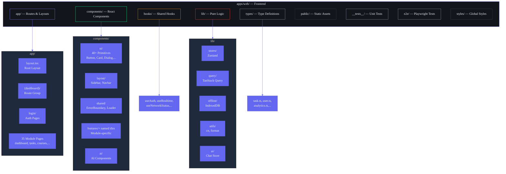

# ARIA OS — Frontend Folder Structure & Conventions

## Document Control

| Field | Value |
|---|---|
| Document ID | FE-FS-001 |
| Version | 1.0.0 |
| Status | Active |
| Last Updated | 2026-07-10 |
| Classification | Internal — Engineering |
| Target Audience | Frontend Developers |
| Cross-References | `AGENTS.md §4.1`, `docs/engineering/FrontendArchitecture.md §3`, `tsconfig.json` |

---

## 1. Executive Summary

The Second Brain OS frontend follows a standardized folder structure under `apps/web/` that enforces separation of concerns, predictable import paths, and scalable module ownership. Every directory has a defined purpose, naming convention, and boundary rule. The structure supports 16 route-level modules, 40+ UI components, 8+ shared hooks, and a layered component hierarchy (ui/layout/shared/features).

---

## 2. Directory Tree

### 2.1 Top-Level Structure

```
apps/web/
├── .next/                              # Build output (gitignored)
├── .storybook/                         # Storybook configuration
├── __tests__/                          # Unit & integration tests
├── app/                                # Next.js App Router — pages, layouts, APIs
├── components/                         # All React components
├── coverage/                           # Test coverage reports (gitignored)
├── e2e/                                # Playwright end-to-end specs
├── hooks/                              # Reusable React hooks
├── lib/                                # Pure logic: stores, queries, utilities
├── node_modules/                       # Dependencies (gitignored)
├── public/                             # Static assets
├── scripts/                            # Build & utility scripts
├── stories/                            # Storybook stories (legacy root)
├── storybook-static/                   # Storybook build output
├── styles/                             # Global CSS and style utilities
├── test-results/                       # Test artifacts (gitignored)
├── types/                              # TypeScript type definitions
│
├── .dockerignore
├── .env.local                          # Local environment variables
├── .eslintrc.json                      # ESLint configuration
├── .gitignore
├── .npmrc                              # npm registry config
├── Dockerfile                          # Production Docker image
├── lighthouserc.json                   # Lighthouse CI configuration
├── middleware.ts                        # Auth middleware (Supabase SSR)
├── next-env.d.ts                       # Next.js TypeScript declarations
├── next.config.js                      # Next.js configuration
├── package.json                        # Dependencies & scripts
├── playwright.config.ts                # Playwright E2E config
├── postcss.config.js                   # PostCSS configuration
├── sentry.client.config.ts             # Sentry error tracking config
├── sw.ts                               # Service worker (Serwist)
├── tailwind.config.js                  # Tailwind CSS configuration
├── tsconfig.json                       # TypeScript configuration
├── vitest.config.ts                    # Vitest test runner config
├── vitest.setup.ts                     # Vitest setup file
└── vitest.shims.d.ts                   # Vitest type shims
```

### 2.2 `app/` — Route Pages & Layouts

```
app/
├── (dashboard)/                        # Route group — all authenticated pages
│   ├── layout.tsx                      # Dashboard layout (Sidebar + Navbar)
│   ├── loading.tsx                     # Root loading skeleton
│   ├── error.tsx                       # Module error boundary
│   ├── academics/page.tsx
│   ├── agents/page.tsx
│   ├── analytics/page.tsx
│   ├── automation/page.tsx
│   ├── briefing/page.tsx
│   ├── chat/page.tsx
│   ├── courses/page.tsx
│   ├── dashboard/page.tsx
│   ├── flags/page.tsx
│   ├── focus/page.tsx
│   ├── goals/page.tsx
│   ├── habits/page.tsx
│   ├── ideas/page.tsx
│   ├── income/page.tsx
│   ├── knowledge/page.tsx
│   ├── learning/page.tsx
│   ├── memory/page.tsx
│   ├── monitoring/page.tsx
│   ├── nudges/page.tsx
│   ├── opportunities/page.tsx
│   ├── projects/page.tsx
│   ├── prompt-playground/page.tsx
│   ├── resources/page.tsx
│   ├── review/page.tsx
│   ├── roadmap/page.tsx
│   ├── settings/page.tsx
│   ├── skills/page.tsx
│   ├── sleep/page.tsx
│   ├── tasks/page.tsx
│   ├── time/page.tsx
│   ├── youtube-vault/page.tsx
│   └── youtube/page.tsx
│
├── login/
│   └── page.tsx                        # Login page
├── offline/
│   └── page.tsx                        # Offline fallback page
├── lib/                                # App-specific server utilities
├── styles/                             # App-specific style modules
├── types/                              # App-specific type extensions
│
├── error.tsx                           # Root error boundary
├── global-error.tsx                    # Fatal error boundary (outside layout)
├── globals.css                         # Tailwind directives + global styles
├── layout.tsx                          # Root layout (fonts, metadata, providers)
├── loading.tsx                         # Root loading state
├── not-found.tsx                       # 404 page
└── page.tsx                            # Landing page (/)
```

**Conventions:**
- Each module gets a single `page.tsx` inside `(dashboard)/<module>/`
- `layout.tsx`, `loading.tsx`, `error.tsx` at route group level for shared chrome
- No nested route groups inside `(dashboard)/` — flat module structure
- Server Actions co-located as `actions.ts` within module directories

### 2.3 `components/` — All React Components

```
components/
├── ai/                                 # AI-specific components
│   ├── AIDock.tsx
│   ├── AIInsightCard.tsx
│   ├── AIUndo.tsx
│   ├── ConfidenceBadge.tsx
│   ├── GhostHint.tsx
│   ├── StreamingText.tsx
│   ├── SuggestionChips.tsx
│   └── ThinkingIndicator.tsx
│
├── analytics/                          # Analytics chart & data components
├── command-center/                     # Cmd+K command palette components
├── dashboard/                          # Dashboard-specific widgets
├── features/                           # Module-specific feature components (empty — migrated to components/<module>/)
├── feedback/                           # User feedback components
├── flags/                              # Feature flag UI
├── focus/                              # Focus mode components
├── knowledge/                          # Knowledge graph components
├── layout/                             # App shell components
│   ├── Sidebar.tsx
│   ├── Navbar.tsx
│   ├── MobileNav.tsx
│   └── ShellSelector.tsx
│
├── memory/                             # Memory consolidation UI
├── motion/                             # Animation components (PageTransition, Stagger)
├── notifications/                      # Notification center components
├── opportunities/                      # Opportunity radar components
├── pwa/                                # PWA install/update components
├── resources/                          # Resource library components
├── settings/                           # Settings page components
├── shared/                             # Cross-module composites
│   ├── ErrorBoundary.tsx               # Component-level error boundary
│   ├── LiveRegion.tsx                  # ARIA live region
│   ├── ModuleError.tsx                 # Module-level error fallback
│   ├── ModuleLoading.tsx               # Module-level loading skeleton
│   ├── PostHogProvider.tsx             # Analytics provider
│   └── index.ts
│
├── shell/                              # Responsive shell components
├── sleep/                              # Sleep tracking components
├── tasks/                              # Task management components
├── theme/                              # Theme switcher components
├── ui/                                 # Atomic UI primitives (40+)
│   ├── Button.tsx                      # 4 variants, 3 sizes
│   ├── Input.tsx                       # 9 types, 7 states
│   ├── Card.tsx                        # 6 variants
│   ├── Dialog.tsx                      # Accessible modal
│   ├── Select.tsx                      # Native select
│   ├── Badge.tsx                       # Status badges
│   ├── Skeleton.tsx                    # Loading placeholders
│   ├── DataTable.tsx                   # Sortable table
│   ├── Tabs.tsx                        # Tab navigation
│   ├── DropdownMenu.tsx                # Menu dropdown
│   ├── Command.tsx                     # Cmd+K command palette (cmdk)
│   ├── ...                             # 30+ more primitives
│   └── index.ts                        # Barrel exports
│
├── youtube-vault/                      # YouTube vault components
│
├── Button.tsx                          # Legacy — being migrated to ui/Button.tsx
├── Card.tsx                            # Legacy — being migrated to ui/Card.tsx
├── Checkbox.tsx                        # Legacy
├── DataTable.tsx                       # Legacy
├── FormField.tsx                       # Legacy
├── Input.tsx                           # Legacy
├── Modal.tsx                           # Legacy
├── Navbar.tsx                          # Legacy — being migrated to layout/Navbar.tsx
├── OfflineBanner.tsx                   # Legacy
├── RoadmapEditor.tsx                   # Legacy
├── Sidebar.tsx                         # Legacy — being migrated to layout/Sidebar.tsx
├── ThreeBackground.tsx                 # Three.js cyberpunk background
│
├── index.ts                            # Barrel exports
└── *.stories.tsx                       # Storybook stories co-located with components
```

### 2.4 `hooks/` — Reusable React Hooks

```
hooks/
├── index.ts                            # Barrel exports
├── useAuth.ts                          # Authentication state
├── useCommandCenter.ts                 # Cmd+K command palette state
├── useNetworkStatus.ts                 # Online/offline detection
├── usePredictions.ts                   # AI predictions
├── useRealtime.ts                      # Supabase Realtime subscriptions
├── useResponsive.ts                    # Responsive breakpoint detection
└── useStoreSync.ts                     # Zustand store sync
```

### 2.5 `lib/` — Pure Logic (No React Imports)

```
lib/
├── ai/                                 # AI client chat store, streaming
│   ├── chat-store.ts
│   └── stream.ts
├── analytics/                          # Analytics utilities
├── api/                                # API client helpers
├── motion/                             # Framer Motion variants
├── offline/                            # IndexedDB + mutation queue
│   ├── db.ts
│   ├── sync.ts
│   └── conflict.ts
├── query/                              # TanStack Query hooks
│   ├── index.ts
│   ├── provider.tsx
│   ├── use-tasks.ts
│   ├── use-courses.ts
│   ├── use-goals.ts
│   └── ...
├── services/                           # External service integrations
├── stores/                             # Zustand stores
│   ├── index.ts
│   ├── user-store.ts
│   ├── task-store.ts
│   ├── ui-store.ts
│   └── search-store.ts
├── types/                              # Re-exports from packages/types
├── utils/                              # Utility functions
│   ├── cn.ts                           # clsx + tailwind-merge
│   ├── format.ts                       # Date formatting
│   ├── constants.ts                    # App constants
│   └── validators.ts                   # Input validation
├── validation/                         # Zod schemas
├── index.ts                            # Barrel exports
├── supabase.ts                         # Supabase browser client
├── supabase-server.ts                  # Supabase server client
├── toast.ts                            # Toast notification helpers
└── web-vitals.ts                       # Core Web Vitals reporting
```

### 2.6 Supporting Directories

```
__tests__/                               # Vitest test mirror
├── unit/
│   ├── hooks/
│   ├── stores/
│   └── utils/
├── integration/
│   └── features/
└── setup.ts

e2e/                                     # Playwright E2E specs
├── fixtures/
│   ├── auth.ts
│   └── db.ts
└── specs/
    ├── auth-flow.spec.ts
    ├── dashboard-loading.spec.ts
    ├── task-crud.spec.ts
    └── ...

types/                                   # Shared TypeScript types (13 files)
├── index.ts
├── task.ts
├── user.ts
├── analytics.ts
├── notifications.ts
├── opportunity.ts
├── settings.ts
└── ...

styles/                                  # Global CSS
├── globals.css                          # Design tokens, Tailwind layers
└── index.ts

public/                                  # Static assets
├── icons/                               # PWA icons (192, 384, 512, 1024)
├── manifest.json                        # PWA Web App Manifest
├── sw.js                                # Generated service worker
└── workbox-*.js                         # Workbox runtime
```

---

## 3. Directory Purposes

| Directory | Purpose | Contains |
|---|---|---|
| `app/` | Next.js App Router entry points. Thin orchestration only — no business logic. | Pages, layouts, loading/error boundaries, API routes |
| `components/ui/` | Atomic UI primitives. One component = one file. Pure, accessible, theme-aware. | shadcn/ui-style components |
| `components/layout/` | App shell components that define the page chrome. | Sidebar, Navbar, MobileNav, ShellSelector |
| `components/shared/` | Cross-module composites used by 2+ modules. | ErrorBoundary, LiveRegion, ModuleError |
| `components/features/` | Module-specific feature components. Empty — features live in named dirs. | Per-module subdirectories |
| `hooks/` | Generic reusable hooks (not module-specific). Module-specific hooks live in lib/query/. | useAuth, useNetworkStatus, useRealtime |
| `lib/stores/` | Zustand client state only. No server data fetching. | ui-store, search-store, user-store (session) |
| `lib/query/` | TanStack Query hooks for server state. One file per module. | useTasks, useCourses, provider |
| `lib/offline/` | IndexedDB wrapper + mutation queue. No React imports. | db.ts, sync.ts, conflict.ts |
| `lib/utils/` | Pure utility functions. | cn, format, validators, constants |
| `types/` | TypeScript interfaces and type definitions. | Per-module type files |
| `public/` | Static assets served directly. | Icons, manifest, service worker |
| `__tests__/` | Mirror of source structure for tests. | Unit, integration, setup |
| `e2e/` | Playwright end-to-end test specs. | auth, CRUD flows, PWA tests |

---

## 4. Naming Conventions

| Construct | Convention | Example | Rule |
|---|---|---|---|
| **Component files** | PascalCase, single export | `Button.tsx`, `TaskCard.tsx` | Named export, one component per file |
| **Page files** | kebab-case directory + `page.tsx` | `tasks/page.tsx` | Default export only |
| **Layout files** | `layout.tsx` per route group | `(dashboard)/layout.tsx` | Default export |
| **Loading files** | `loading.tsx` | `dashboard/loading.tsx` | Default export |
| **Error files** | `error.tsx` | `tasks/error.tsx` | 'use client', default export |
| **Hooks** | camelCase + `use` prefix | `useAuth.ts`, `useNetworkStatus.ts` | Named export |
| **Stores** | camelCase + `Store` suffix | `uiStore.ts`, `taskStore.ts` | Named export `useUIStore` |
| **Query hooks** | kebab-case + `use-` prefix | `use-tasks.ts`, `use-courses.ts` | Named exports |
| **Utilities** | camelCase | `cn.ts`, `format.ts` | Named exports |
| **Types** | PascalCase, one per file | `task.ts`, `user.ts` | Named exports |
| **Directories** | kebab-case | `command-center/`, `youtube-vault/` | Lowercase with hyphens |
| **Constants** | UPPER_SNAKE | `MAX_RETRY_COUNT`, `API_BASE_URL` | Named export |
| **Stories** | ComponentName.stories.tsx | `Button.stories.tsx` | Co-located with component |

---

## 5. Import Path Aliases

Defined in `tsconfig.json`:

| Alias | Resolves to | Usage |
|---|---|---|
| `@/` | `apps/web/` root | All project imports |
| `@app/types` | `packages/types/src` | Shared type definitions |
| `@app/types/*` | `packages/types/src/*` | Deep type imports |
| `@app/ui` | `packages/ui/src` | Shared UI components |
| `@app/ui/*` | `packages/ui/src/*` | Deep UI imports |

**Import order (enforced by ESLint):**

```typescript
// 1. React / Next.js
import { useState } from 'react'
import { useRouter } from 'next/navigation'

// 2. External libraries
import { useQuery } from '@tanstack/react-query'
import { motion } from 'framer-motion'

// 3. Internal aliases
import { Button } from '@/components/ui/button'
import { useAuth } from '@/hooks/useAuth'
import { supabase } from '@/lib/supabase'
import type { Task } from '@/types/task'

// 4. Relative (last resort)
import { TaskCard } from './task-card'
```

---

## 6. File Organization Rules

### 6.1 Boundary Rules

```
app/           → Route pages only. Keep thin (< 50 lines). No business logic.
                 Compose from components/, use hooks from hooks/.
components/ui/ → One file per component. No dependencies on app/ or hooks/.
                 Can depend on lib/utils/ (cn, format).
components/layout/ → App shell. No feature knowledge. Can use hooks/ (useAuth, useResponsive).
components/shared/ → Cross-module. Cannot import from features/.
hooks/           → Generic only. No module-specific logic.
lib/stores/      → Zustand + persist middleware only. No Supabase calls.
lib/query/       → TanStack Query only. No Zustand imports.
lib/offline/     → IndexedDB only. No React.
types/           → Interfaces and types only. No runtime code.
```

### 6.2 When to Create New Files vs Extend Existing

| Scenario | Action | Rule |
|---|---|---|
| New module page | Create `app/(dashboard)/<module>/page.tsx` | One file per module |
| New UI primitive | Create `components/ui/<ComponentName>.tsx` | One component per file |
| New shared component | Create `components/shared/<ComponentName>.tsx` | Used by 2+ modules |
| New feature component | Create `components/<module>/<ComponentName>.tsx` | Module-specific |
| New hook | Create `hooks/use<hook-name>.ts` | Generic only |
| New store | Create `lib/stores/<name>-store.ts` | Client state only |
| New query hook | Create `lib/query/use-<module>.ts` | One per module |
| New type | Create `types/<name>.ts` | Export from `types/index.ts` |
| Extend existing component | Add props (non-breaking) | Keep backward compat |
| Add utility function | Extend existing `lib/utils/<file>.ts` | Group by concern |
| New Storybook story | Create `<Component>.stories.tsx` | Co-located |

### 6.3 Legacy Migration Status

| Legacy File | Target | Status |
|---|---|---|
| `components/Button.tsx` | `components/ui/Button.tsx` | ✅ Done (both exist, ui/ preferred) |
| `components/Card.tsx` | `components/ui/Card.tsx` | ✅ Done |
| `components/Input.tsx` | `components/ui/Input.tsx` | ✅ Done |
| `components/Modal.tsx` | `components/ui/Dialog.tsx` | ✅ Done |
| `components/Sidebar.tsx` | `components/layout/Sidebar.tsx` | ✅ Done |
| `components/Navbar.tsx` | `components/layout/Navbar.tsx` | ✅ Done |
| `components/DataTable.tsx` | `components/ui/DataTable.tsx` | ✅ Done |
| `components/OfflineBanner.tsx` | `components/layout/OfflineBanner.tsx` | ⏳ Phase 2 |
| `components/RoadmapEditor.tsx` | `components/features/goals/roadmap-editor.tsx` | ⏳ Phase 2 |
| `components/Checkbox.tsx` | `components/ui/Checkbox.tsx` | ⏳ Phase 2 |
| `components/FormField.tsx` | `components/shared/form-field.tsx` | ⏳ Phase 2 |

---

## 7. Mermaid Directory Hierarchy



---

---

## 8. Component Categories by Module

Each feature module follows a consistent component categorization pattern. Components are organized by module name under `components/<module>/` with the following categories:

### Page Structure Pattern

Every module page at `app/(dashboard)/<module>/page.tsx` follows this composition:

```typescript
'use client'

// 1. Server-data hook (TanStack Query)
import { useModuleData } from '@/lib/query/use-module'

// 2. Client-state hook (Zustand)
import { useModuleUIStore } from '@/lib/stores/ui-store'

// 3. Feature components
import { ModuleList } from '@/components/module/ModuleList'
import { ModuleForm } from '@/components/module/ModuleForm'
import { ModuleDetail } from '@/components/module/ModuleDetail'

// 4. Shared components
import { ModuleLoading } from '@/components/shared/ModuleLoading'
import { ModuleError } from '@/components/shared/ModuleError'
import { EmptyCanvas } from '@/components/shared/EmptyCanvas'

export default function ModulePage() {
  const { data, isLoading, error } = useModuleData()
  const viewMode = useModuleUIStore((s) => s.viewMode)

  if (isLoading) return <ModuleLoading />
  if (error) return <ModuleError error={error} />
  if (!data?.length) return <EmptyCanvas module="module" />

  return <ModuleList data={data} viewMode={viewMode} />
}
```

### Module Component Categories

Each feature module directory (`components/<module>/`) typically contains these component categories:

| Category | Pattern | Example Components |
|---|---|---|
| **List/Grid** | Displays collection of items | `TaskList.tsx`, `CourseGrid.tsx` |
| **Card** | Single item display | `TaskCard.tsx`, `HabitCard.tsx` |
| **Form** | Create/edit forms | `TaskForm.tsx`, `CourseForm.tsx` |
| **Detail** | Full item view | `TaskDetail.tsx`, `CourseDetail.tsx` |
| **Stats** | Module-specific statistics | `HabitStats.tsx`, `SleepScore.tsx` |
| **Calendar** | Date-based views | `HabitCalendar.tsx`, `SleepCalendar.tsx` |

### Module-Specific Component Inventories

| Module | Components |
|---|---|
| **tasks/** | TaskCard, TaskList, TaskForm, TaskDetail, KanbanBoard, KanbanCard, TaskCalendarView, TaskFilterBar, TaskBulkActions |
| **courses/** | CourseCard, CourseForm, CourseDetail, CourseProgressBar, PlatformBadge, CourseVideoList |
| **habits/** | HabitCard, HabitForm, HabitCalendar, HabitCheckin, HabitStats, HabitStreak |
| **goals/** | GoalCard, GoalForm, GoalDetail, RoadmapCanvas, MilestoneNode, GoalProgressRing |
| **sleep/** | SleepForm, SleepScore, SleepChart, SleepCalendar, WindDownCard |
| **income/** | IncomeEntry, IncomeForm, IncomeChart, HourlyRateCard, IncomeSummary |
| **projects/** | ProjectCard, ProjectForm, ProjectDetail, PhaseTimeline, BlockerBadge |
| **ideas/** | IdeaCard, IdeaForm, IdeaPipeline, IdeaStageBadge |
| **resources/** | ResourceCard, ResourceForm, ResourceSearch, TagFilterBar |
| **opportunities/** | OpportunityCard, OpportunityScore, ScoreBadge, RadarScanner |
| **time/** | TimeEntryForm, PomodoroTimer, DeepWorkIndicator, DailyStats |
| **dashboard/** | KPIStrip, MorningBriefing, TodayFocus, CourseProgress, OpportunityFeed, ActiveProjects, WeeklyVelocity, MilestoneTimeline |
| **chat/** | ChatPanel, ConversationList, ContextPanel, MessageBubble, AIAgentBadge |
| **notifications/** | NotificationList, NotificationBell, NotificationItem |

---

## 9. Component Dependency Map

```mermaid
graph TD
    subgraph Pages["Module Pages (app/(dashboard)/)"]
        DP[Dashboard Page]
        TP[Tasks Page]
        CP[Courses Page]
        HP[Habits Page]
    end

    subgraph Feature["Feature Components (components/<module>/)"]
        TC[TaskCard]
        TF[TaskForm]
        CC[CourseCard]
        HC[HabitCard]
    end

    subgraph Shared["Shared Components (components/shared/)"]
        EB[ErrorBoundary]
        ML[ModuleLoading]
        ME[ModuleError]
        EC[EmptyCanvas]
    end

    subgraph UI["UI Primitives (components/ui/)"]
        BTN[Button]
        CARD[Card]
        INPUT[Input]
        BADGE[Badge]
        DIALOG[Dialog]
        DATA[DataTable]
    end

    subgraph Layout["Layout (components/layout/)"]
        SID[Sidebar]
        NAV[Navbar]
        MN[MobileNav]
    end

    subgraph Hooks["Hooks (hooks/)"]
        UA[useAuth]
        UR[useRealtime]
        URES[useResponsive]
    end

    subgraph State["State (lib/)"]
        US[user-store]
        UIS[ui-store]
        QT[use-tasks]
        QC[use-courses]
    end

    DP --> TC
    DP --> CC
    DP --> HC
    TP --> TC
    TP --> TF
    CP --> CC
    HP --> HC

    TC --> EB
    TC --> ML
    TF --> ME
    CC --> EC
    HC --> EC

    TC --> CARD
    TC --> BADGE
    TF --> BTN
    TF --> INPUT
    TF --> DIALOG
    CC --> CARD
    HC --> BADGE

    Pages --> SID
    Pages --> NAV
    Pages --> MN

    Pages --> UA
    Pages --> UR
    Pages --> URES

    Pages --> US
    Pages --> UIS
    TC --> QT
    CC --> QC

    style Pages fill:#13151A,stroke:#6366F1,color:#F1F5F9
    style Feature fill:#13151A,stroke:#818CF8,color:#F1F5F9
    style Shared fill:#13151A,stroke:#00FFA3,color:#F1F5F9
    style UI fill:#13151A,stroke:#F59E0B,color:#F1F5F9
    style Layout fill:#13151A,stroke:#EF4444,color:#F1F5F9
    style Hooks fill:#13151A,stroke:#94A3B8,color:#F1F5F9
    style State fill:#13151A,stroke:#334155,color:#F1F5F9
```



---

## 10. Page Type Patterns

ARIA OS uses several page type patterns across its 16+ module routes:

### Pattern A: List Page (Most Modules)

```typescript
app/(dashboard)/<module>/page.tsx
├── Header (title, search, "Add New" button)
├── View Toggle (list/grid/kanban/calendar)
├── Filter Bar (status, priority, date, category)
├── Data List (virtualized or paginated)
│   ├── Card / Row components
│   └── Empty State (when no data)
├── Create Form (modal or inline)
└── Detail Panel (slide-over or inline)
```

Used by: tasks, courses, habits, goals, income, projects, ideas, resources, opportunities, sleep

### Pattern B: Dashboard Page

```typescript
app/(dashboard)/dashboard/page.tsx
├── KPI Strip (6 metrics with sparklines)
├── Morning Briefing (AI-generated banner)
├── Today's Focus (priority tasks with checkboxes)
├── Bento Grid
│   ├── Course Progress (3 cards)
│   ├── Opportunity Feed (top 2)
│   ├── Active Projects (2 cards)
│   ├── Activity Heatmap
│   ├── Weekly Velocity (chart)
│   └── Milestone Timeline
└── Last updated indicator
```

### Pattern C: Chat Page

```typescript
app/(dashboard)/chat/page.tsx
├── Left Panel (conversation history)
├── Center Panel (messages, streaming, input)
└── Right Panel (agent status, context, memory)
```

### Pattern D: Settings Page

```typescript
app/(dashboard)/settings/page.tsx
├── Profile Section
├── Preferences Section
├── Notifications Section
├── AI Configuration
├── Data Export / GDPR
└── Danger Zone (account deletion)
```

---

## 8. Revision History

| Version | Date | Author | Changes |
|---|---|---|---|
| 1.0.0 | 2026-07-10 | Developer | Initial frontend folder structure documentation |
| 1.1.0 | 2026-07-14 | Developer | Added component categories by module, dependency map, page type patterns |
