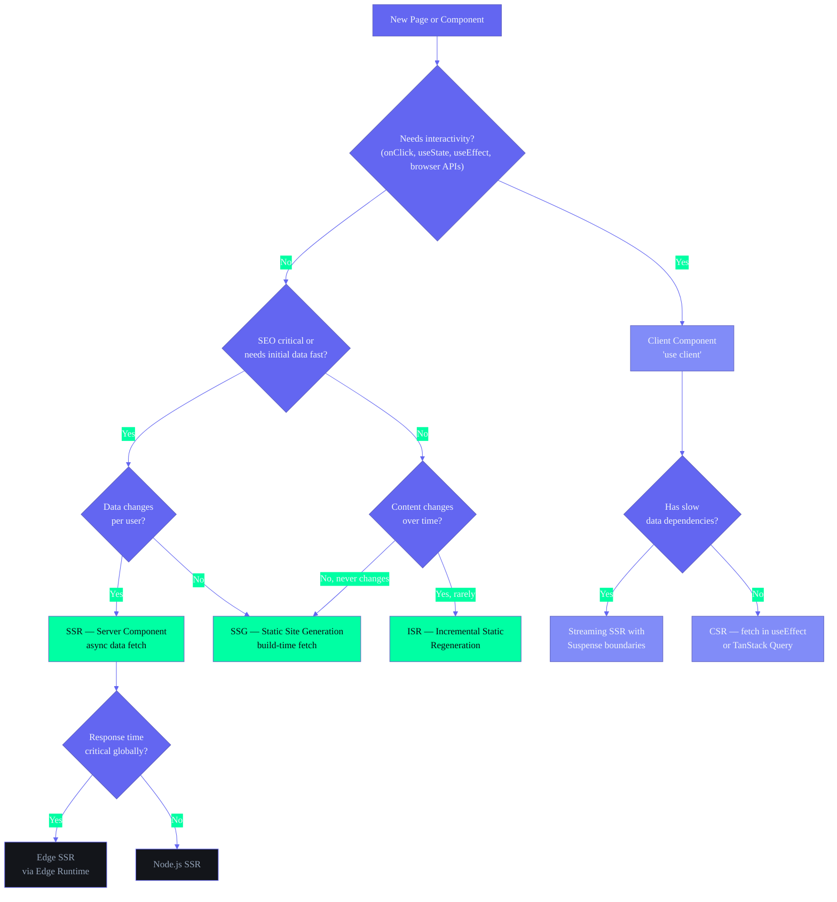

# ARIA OS — Frontend Rendering Strategy

## Document Control

| Field | Value |
|---|---|
| Document ID | FE-RS-001 |
| Version | 1.0.0 |
| Status | Active |
| Last Updated | 2026-07-10 |
| Classification | Internal — Engineering |
| Target Audience | Frontend Developers |
| Cross-References | `docs/engineering/FrontendArchitecture.md §4`, `docs/engineering/FrontendPerformanceGuide.md`, `AGENTS.md §4.2` |

---

## 1. Executive Summary

ARIA OS uses **Next.js 14 App Router** with a hybrid rendering strategy: Server Components (SSR) for the landing page and dashboard shell, Client Components (CSR) for all 16 interactive module pages, and planned expansion into ISR, Streaming SSR, and SSG for public pages. The rendering strategy is determined by data freshness requirements, interactivity needs, and SEO importance — not by defaulting to one approach.

---

## 2. Rendering Modes

### 2.1 Next.js 14 Rendering Modes

| Mode | Full Name | When Data Fetches | User Sees | Best For |
|---|---|---|---|---|
| **SSR** | Server-Side Rendering | On every request (server) | Full HTML immediately | SEO-critical, user-specific data |
| **SSG** | Static Site Generation | At build time | Pre-built HTML | Content that never changes |
| **ISR** | Incremental Static Regeneration | At build + revalidation | Pre-built HTML + updates | Content that changes rarely |
| **CSR** | Client-Side Rendering | In browser after page loads | Loading spinner → content | Highly interactive, real-time data |
| **Streaming SSR** | Streaming SSR | On request (server, streamed) | Progressive HTML chunks | Slow data dependencies |
| **Edge SSR** | Edge Server-Side Rendering | On request (edge server) | Full HTML immediately | Global low-latency |

### 2.2 Current State vs Target

| Page | Current | Phase 1 | Phase 2 | Phase 3 |
|---|---|---|---|---|
| `/` (Landing) | SSR (Server Component) | SSR | SSR + ISR | Edge SSR |
| `/login` | CSR ('use client') | CSR | CSR | CSR |
| `/dashboard` | CSR ('use client') | CSR | SSR + Suspense islands | Streaming SSR |
| `/tasks` | CSR ('use client') | CSR | CSR (with SSR detail) | CSR (virtual scroll) |
| `/tasks/[id]` | — | — | SSR | SSR + prefetch |
| `/courses` | CSR ('use client') | CSR | CSR | CSR |
| `/about` | — | — | SSG | SSG |
| `/privacy` | — | — | SSG | SSG |
| `/offline` | CSR | CSR | CSR | CSR |
| All [id] routes | — | — | SSR | SSR |

---

## 3. Server Components vs Client Components

### 3.1 Decision Framework

```
Is the component interactive (onClick, onChange, useState, useEffect)?
├─ YES → Must be 'use client' (Client Component)
└─ NO → Is it SEO-critical or data-dependent?
    ├─ YES → Server Component (default in App Router)
    └─ NO → Server Component (still preferred — ships less JS)
```

### 3.2 Current Component Classification

| Component | Type | Rationale |
|---|---|---|
| `app/layout.tsx` (Root) | Server | Metadata, font loading, no interactivity |
| `app/(dashboard)/layout.tsx` | Server | No interactivity at layout level |
| `app/page.tsx` (Landing) | Server | SEO-critical |
| `app/not-found.tsx` | Server | Static fallback |
| `app/error.tsx` | Client ('use client') | Error boundary must be client |
| `app/loading.tsx` | Server | Static skeleton |
| `app/login/page.tsx` | Client | Auth state, form interaction |
| All module pages | Client | Realtime data, CRUD forms, interactivity |
| `components/ui/Button.tsx` | Client | onClick handler |
| `components/layout/Sidebar.tsx` | Client | usePathname, toggle state |
| `components/layout/Navbar.tsx` | Client | User menu, search trigger |
| `components/shared/ErrorBoundary.tsx` | Client | Class component with state |
| `lib/query/provider.tsx` | Client | React Query provider |
| `hooks/useAuth.ts` | Client | Browser-only Supabase auth |

### 3.3 Server Component Data Fetching

```typescript
// app/(dashboard)/dashboard/page.tsx — SSR with client islands
import { createSupabaseServerClient } from '@/lib/supabase-server'
import { DashboardClient } from '@/components/dashboard/dashboard-client'

export default async function DashboardPage() {
  const supabase = createSupabaseServerClient()
  const { data: tasks } = await supabase.from('tasks').select('count')

  return (
    <div>
      {/* Server-rendered static content */}
      <h1 className="text-2xl font-display">Dashboard</h1>
      {/* Client island for interactive content */}
      <DashboardClient initialCount={tasks?.[0]?.count ?? 0} />
    </div>
  )
}
```

### 3.4 Client Component with Server Data Props

```typescript
'use client'

import { useState } from 'react'
import { useQuery } from '@tanstack/react-query'
import { supabase } from '@/lib/supabase'

interface DashboardClientProps {
  initialCount: number
}

export function DashboardClient({ initialCount }: DashboardClientProps) {
  const [count] = useState(initialCount) // Hydrated from server

  const { data: liveTasks } = useQuery({
    queryKey: ['tasks'],
    queryFn: async () => {
      const { data } = await supabase.from('tasks').select('*')
      return data
    },
  })

  return <div>{/* Interactive dashboard content */}</div>
}
```

---

## 4. Data Fetching Strategies

### 4.1 Strategy Decision Matrix

| Strategy | Use Case | Caching | Real-time | Offline | Current Usage |
|---|---|---|---|---|---|
| **Supabase Direct (Browser)** | Simple CRUD, low data volume | None (in-memory) | Realtime subscription | Planned (IndexedDB) | 12 module pages |
| **TanStack Query** | Server state with caching needs | Auto (gcTime 5min) | Invalidation + refetch | Planned (persister) | Phase 2 target |
| **Server Components (async)** | SSR data for SEO pages | Per-request | No | No | Landing page |
| **Server Actions** | Form mutations | No | No | No | Login, create forms |
| **Supabase Server Client** | SSR data for detail pages | Per-request | No | No | Phase 2 |

### 4.2 Current Data Flow (Module Pages)

```typescript
// Current pattern — Supabase direct in useEffect
'use client'

import { useEffect, useState } from 'react'
import { supabase } from '@/lib/supabase'

export default function TasksPage() {
  const [tasks, setTasks] = useState([])
  const [loading, setLoading] = useState(true)

  useEffect(() => {
    supabase.from('tasks').select('*')
      .then(({ data }) => { setTasks(data ?? []); setLoading(false) })
  }, [])

  if (loading) return <ModuleLoading />

  return <TaskList tasks={tasks} />
}
```

### 4.3 Target Data Flow (TanStack Query)

```typescript
// Target pattern — TanStack Query in custom hook
'use client'

import { useQuery } from '@tanstack/react-query'
import { supabase } from '@/lib/supabase'
import { ModuleLoading } from '@/components/shared/ModuleLoading'
import { TaskList } from '@/components/tasks/TaskList'

export default function TasksPage() {
  const { data: tasks, isLoading } = useQuery({
    queryKey: ['tasks'],
    queryFn: async () => {
      const { data } = await supabase.from('tasks').select('*')
      return data ?? []
    },
    staleTime: 30_000,
    gcTime: 300_000,
  })

  if (isLoading) return <ModuleLoading />

  return <TaskList tasks={tasks} />
}
```

### 4.4 Server Action Pattern

```typescript
// app/(dashboard)/tasks/actions.ts
'use server'

import { createSupabaseServerClient } from '@/lib/supabase-server'
import { revalidatePath } from 'next/cache'

export async function createTask(formData: FormData) {
  const supabase = createSupabaseServerClient()
  const title = formData.get('title') as string

  const { error } = await supabase.from('tasks').insert({
    title,
    user_id: (await supabase.auth.getUser()).data.user?.id,
  })

  if (error) throw new Error('Failed to create task')
  revalidatePath('/tasks')
}
```

---

## 5. Streaming SSR & Suspense Boundaries

### 5.1 Streaming SSR Architecture

```
Request → Server Component renders
          ├── <Layout> → HTML starts streaming immediately
          ├── <Suspense fallback={<Skeleton />}>
          │   └── <SlowDataComponent /> → Replaces skeleton when ready
          └── <Suspense fallback={<CardSkeleton />}>
              └── <AnotherSlowComponent /> → Replaces skeleton
```

### 5.2 Implementation Pattern (Phase 2)

```typescript
// app/(dashboard)/dashboard/page.tsx — Streaming SSR
import { Suspense } from 'react'
import { DashboardSkeleton } from '@/components/dashboard/dashboard-skeleton'
import { KPIStrip } from '@/components/dashboard/KPIStrip'
import { ActivityHeatmap } from '@/components/ui/ActivityHeatmap'
import { WeeklyReviewCard } from '@/components/review/WeeklyReviewCard'

export default function DashboardPage() {
  return (
    <div className="space-y-6">
      <Suspense fallback={<div className="h-24 animate-pulse bg-background-card rounded-xl" />}>
        <KPIStrip />
      </Suspense>

      <div className="grid grid-cols-1 lg:grid-cols-2 gap-6">
        <Suspense fallback={<div className="h-64 animate-pulse bg-background-card rounded-xl" />}>
          <ActivityHeatmap />
        </Suspense>
        <Suspense fallback={<div className="h-64 animate-pulse bg-background-card rounded-xl" />}>
          <WeeklyReviewCard />
        </Suspense>
      </div>
    </div>
  )
}
```

### 5.3 Suspense Boundaries Currently

| Location | Wrapped | Fallback | Phase |
|---|---|---|---|
| Root layout | No Suspense | N/A | Already done |
| Dashboard | No Suspense | Inline loading.tsx | Phase 2 |
| Module pages | No Suspense | Inline useState check | Phase 2 |
| Detail routes | No Suspense | N/A | Phase 2 |

---

## 6. Rendering Decision Tree



---

## 7. Rendering Performance Considerations

| Concern | SSR | CSR | Streaming SSR | SSG | ISR |
|---|---|---|---|---|---|
| **First Paint** | Fast (server HTML) | Slower (JS needed) | Fastest (chunks stream) | Fastest (pre-built) | Fast (pre-built) |
| **Time to Interactive** | Slower (hydration) | Fast (already interactive) | Moderate (progressive hydration) | Fast (pre-hydrated) | Fast |
| **SEO** | Excellent | Poor (no JS) | Excellent | Excellent | Excellent |
| **Server Load** | High (per request) | Low | Medium | None (build only) | Low |
| **Data Freshness** | Always fresh | Client-determined | Always fresh | Stale until rebuild | Revalidated |
| **Bundle Size** | Smaller (server code) | Larger (all in client) | Smaller | Smallest | Small |
| **Offline Support** | None (needs server) | Possible (with SW) | None | Full static | Cached static |
| **Personalization** | Possible (cookies) | Full | Possible | None | None |

### 7.1 Optimization Rules

1. **Default to Server Components** — Reduces client JS by ~40%. Only add 'use client' when browser APIs, event handlers, or hooks are required.
2. **Colocate 'use client' boundaries** — Keep the client scope small. Prefer wrapping only the interactive child rather than the whole page.
3. **Stream non-critical data** — Wrap slow data fetches in `<Suspense>` to avoid blocking the initial HTML response.
4. **Prefetch detail routes** — Use `<Link prefetch={true}>` or `router.prefetch()` on hover for instant detail page navigation.
5. **Avoid 'use client' in layouts** — Layouts wrap all children; making them client components prevents server rendering of all children.
6. **Use TanStack Query for client data** — Built-in stale-while-revalidate, cache deduplication, and background refetching replaces manual useEffect patterns.
7. **SSG public pages** — About, privacy, terms, and documentation pages should be statically generated at build time.

---

## 8. Migration Roadmap

| Wave | Pages | Change | Impact |
|---|---|---|---|
| Phase 1 | All modules | Add `loading.tsx` + `error.tsx` per module | Better UX during load/failures |
| Phase 2 | Dashboard | SSR with Suspense boundaries for each widget | Faster initial paint, progressive loading |
| Phase 2 | /tasks/[id], /courses/[id], ... | New SSR detail routes | SEO for shareable links |
| Phase 2 | All modules | Replace direct Supabase calls with TanStack Query | Caching, dedup, refetch |
| Phase 2 | /about, /privacy, /terms | New SSG pages | Fast static content |
| Phase 3 | / | ISR for landing page sections | Fresh content without rebuild |
| Phase 3 | Dashboard | Streaming SSR | Fastest possible initial render |
| Phase 3 | Public pages | Edge SSR | Global low-latency |

---

---

## 9. ISR Strategy Details

### ISR Revalidation Strategy

For public pages that change infrequently but need periodic updates (landing, about, privacy, terms), ISR provides a balance of performance and freshness.

```typescript
// app/page.tsx — Landing page with ISR
export const revalidate = 3600 // Revalidate every hour

export default async function LandingPage() {
  const features = await getPublicFeatures()
  const testimonials = await getTestimonials()

  return (
    <div>
      <HeroSection />
      <FeaturesSection features={features} />
      <TestimonialsSection testimonials={testimonials} />
    </div>
  )
}
```

### ISR Configuration Per Page

| Page | Revalidation | Strategy | Rationale |
|---|---|---|---|
| `/` (Landing) | 3600s (1 hour) | Time-based | Content changes infrequently, stale-while-revalidate acceptable |
| `/about` | 86400s (24 hours) | Time-based | Static team/content info |
| `/privacy` | 604800s (7 days) | Time-based | Legal document, rarely changes |
| `/terms` | 604800s (7 days) | Time-based | Legal document, rarely changes |
| `/login` | No ISR (CSR) | -- | Always client-rendered due to auth state |

### On-Demand Revalidation (Phase 3)

For content changes that need immediate propagation:

```typescript
// app/api/revalidate/route.ts
import { revalidatePath } from 'next/cache'
import { revalidateTag } from 'next/cache'

export async function POST(request: Request) {
  const secret = request.headers.get('x-revalidate-secret')

  if (secret !== process.env.REVALIDATION_SECRET) {
    return Response.json({ message: 'Invalid secret' }, { status: 401 })
  }

  revalidatePath('/')
  revalidateTag('public-features')

  return Response.json({ revalidated: true })
}
```

This approach is used when content is updated via a headless CMS or when landing page copy changes.

---

## 10. SSR Strategy Details

### Server Component Data Fetching Patterns

**Pattern 1: Direct Supabase Query**

```typescript
// app/(dashboard)/dashboard/page.tsx — SSR with server component
import { createSupabaseServerClient } from '@/lib/supabase-server'

export default async function DashboardPage() {
  const supabase = createSupabaseServerClient()

  const [{ data: tasks }, { data: courses }, { data: habits }] = await Promise.all([
    supabase.from('tasks').select('count').single(),
    supabase.from('courses').select('count').single(),
    supabase.from('habits').select('count').single(),
  ])

  return (
    <DashboardClient
      initialCounts={{
        tasks: tasks?.count ?? 0,
        courses: courses?.count ?? 0,
        habits: habits?.count ?? 0,
      }}
    />
  )
}
```

**Pattern 2: Suspense with Streaming SSR**

For components with slow data dependencies, wrap in `<Suspense>` to avoid blocking the initial HTML response:

```typescript
// app/(dashboard)/dashboard/page.tsx — Streaming SSR
import { Suspense } from 'react'

export default function DashboardPage() {
  return (
    <div className="space-y-6">
      <Suspense fallback={<div className="h-24 bg-background-card animate-pulse rounded-xl" />}>
        <KPIStrip />
      </Suspense>
      <div className="grid grid-cols-1 lg:grid-cols-2 gap-6">
        <Suspense fallback={<div className="h-64 bg-background-card animate-pulse rounded-xl" />}>
          <ActivityHeatmap />
        </Suspense>
        <Suspense fallback={<div className="h-64 bg-background-card animate-pulse rounded-xl" />}>
          <WeeklyReviewCard />
        </Suspense>
      </div>
    </div>
  )
}
```

### When to Choose SSR over CSR

| Criterion | Choose SSR | Choose CSR |
|---|---|---|
| SEO required | Yes | No |
| Initial data needed for meaningful first paint | Yes | No |
| User-specific data | Yes (with cookies/session) | Yes (after client render) |
| Highly interactive | No | Yes |
| Real-time data subscriptions | No | Yes |
| Offline-capable | No | Yes |
| Public / crawlable | Yes | No |

### SSR Performance Considerations

| Concern | Mitigation | Status |
|---|---|---|
| Server load per request | Cache public SSR pages with CDN (Vercel) | Built-in |
| Database connection per request | Use connection pooling via Supabase | Built-in |
| Large payload serialization | Selective data fetching, limit returned fields | Best practice |
| Blocking data dependencies | Wrap slow fetches in Suspense boundaries | Phase 2 |

---

## 11. CSR Strategy Details

### Client-Side Rendering for Module Pages

All 16 interactive module pages use client-side rendering because they require:
- Real-time Supabase subscriptions for live updates
- Browser APIs (localStorage, IndexedDB, service worker)
- State management via Zustand and TanStack Query
- Highly interactive CRUD operations with optimistic updates

```typescript
'use client'

import { useQuery } from '@tanstack/react-query'
import { supabase } from '@/lib/supabase'
import { ModuleLoading } from '@/components/shared/ModuleLoading'
import { ModuleError } from '@/components/shared/ModuleError'
import { EmptyCanvas } from '@/components/shared/EmptyCanvas'

export default function ModulePage() {
  const { data, isLoading, error } = useQuery({
    queryKey: ['module-data'],
    queryFn: async () => {
      const { data, error } = await supabase.from('module').select('*')
      if (error) throw error
      return data
    },
  })

  if (isLoading) return <ModuleLoading />
  if (error) return <ModuleError error={error} />
  if (!data?.length) return <EmptyCanvas module="module" />

  return <ModuleList data={data} />
}
```

### Code Splitting for Heavy Modules

Modules with heavy dependencies use dynamic imports to keep the initial bundle small:

```typescript
import dynamic from 'next/dynamic'

const RoadmapEditor = dynamic(
  () => import('@/components/goals/RoadmapEditor'),
  { ssr: false, loading: () => <ModuleLoading /> }
)

const ThreeBackground = dynamic(
  () => import('@/components/ThreeBackground'),
  { ssr: false }
)
```

### Modules Using Dynamic Imports

| Module | Heavy Dependency | Dynamic Import |
|---|---|---|
| Goals | React Flow | `RoadmapCanvas`, `RoadmapEditor` |
| Knowledge | d3-force | `KnowledgeGraph` |
| Landing page | Three.js | `ThreeBackground` |
| Analytics | Recharts | `DetailedChart`, `Heatmap` |
| AI Chat | Streaming parser | `StreamingText` |

---

## 12. Rendering Decision Guide

### Quick Decision Flowchart

```
Starting a new page?
│
├─ Is it a public page (SEO critical)?
│  ├─ YES → Does data change frequently?
│  │  ├─ YES (per user) → SSR with Suspense streaming
│  │  ├─ YES (per time) → ISR with revalidation
│  │  └─ NO (static) → SSG
│  └─ NO → Is it a detail route (shareable URL)?
│     ├─ YES → SSR with generateMetadata
│     └─ NO → CSR (default for all module pages)
│
├─ Is it an auth-protected module page?
│  └─ YES → CSR with TanStack Query + Zustand
│
├─ Is it a form or settings page?
│  └─ YES → CSR with Server Actions
│
└─ Is it a landing/marketing page?
   └─ YES → ISR with 1-hour revalidation
```

### Optimization Checklist

When implementing a new page, verify:

- [ ] Rendering mode chosen based on the decision tree above
- [ ] 'use client' boundary is as narrow as possible
- [ ] Heavy components use dynamic imports with `ssr: false`
- [ ] Server Component fetches are parallelized with `Promise.all`
- [ ] Suspense boundaries isolate slow data dependencies
- [ ] TanStack Query is configured with appropriate `staleTime` and `gcTime`
- [ ] Metadata is set for SEO (if public) or noindex (if auth-protected)
- [ ] Loading and error states are handled at both page and component level

---

## 9. Revision History

| Version | Date | Author | Changes |
|---|---|---|---|
| 1.0.0 | 2026-07-10 | Developer | Initial rendering strategy documentation |
| 1.1.0 | 2026-07-14 | Developer | Expanded ISR, SSR, CSR sections, decision guide, code splitting |
