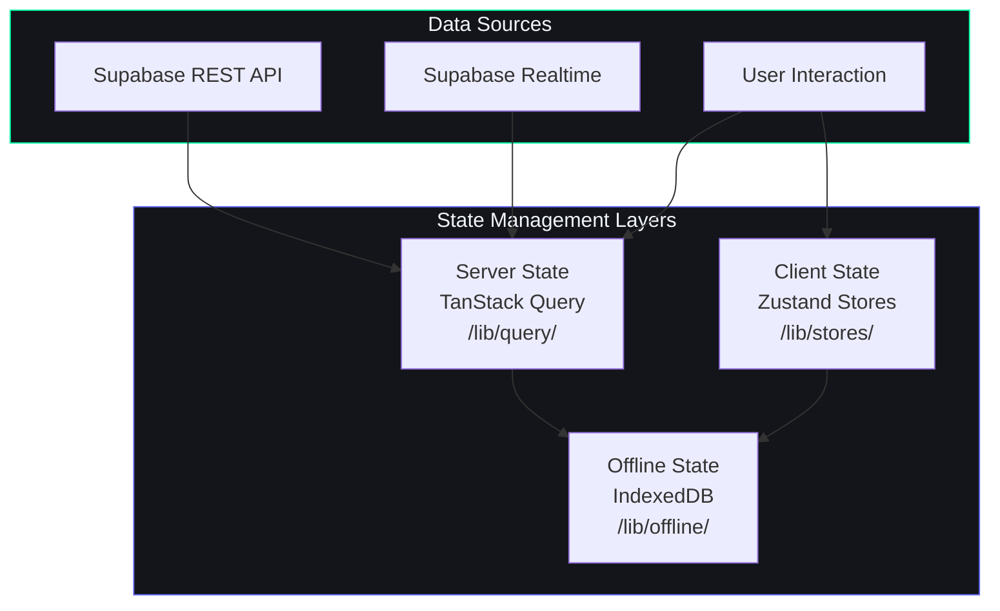
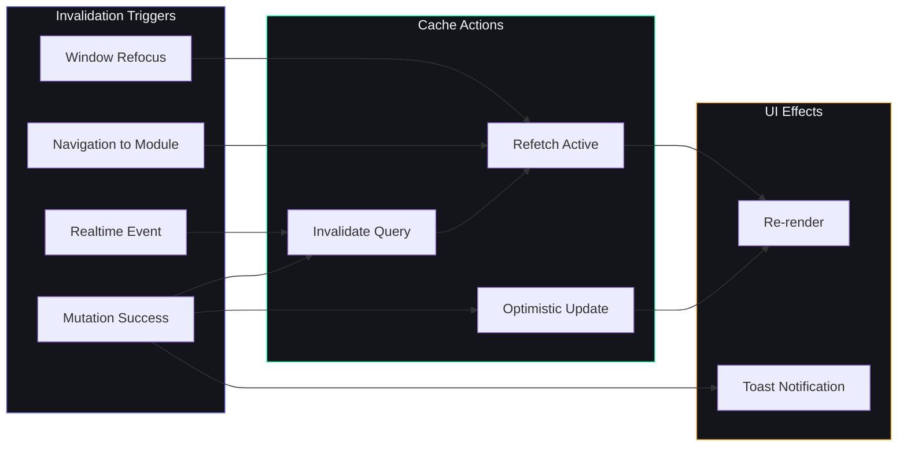
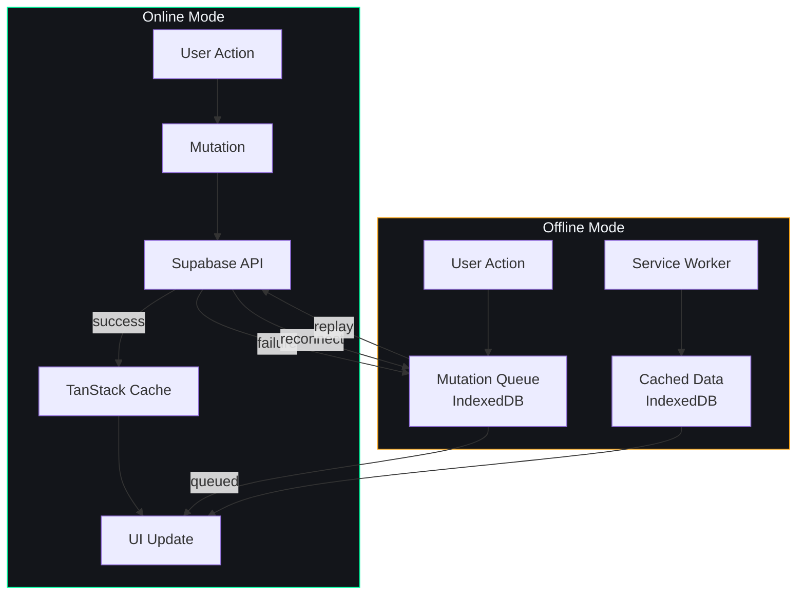
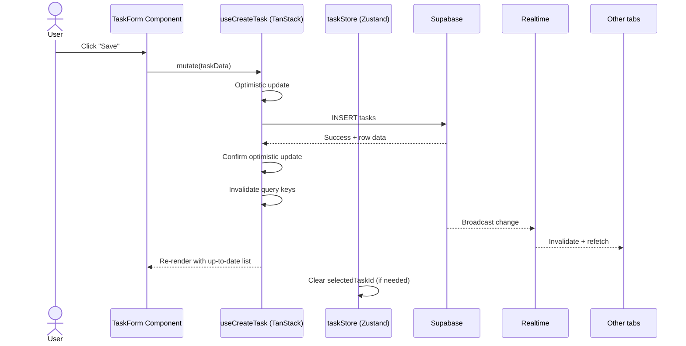
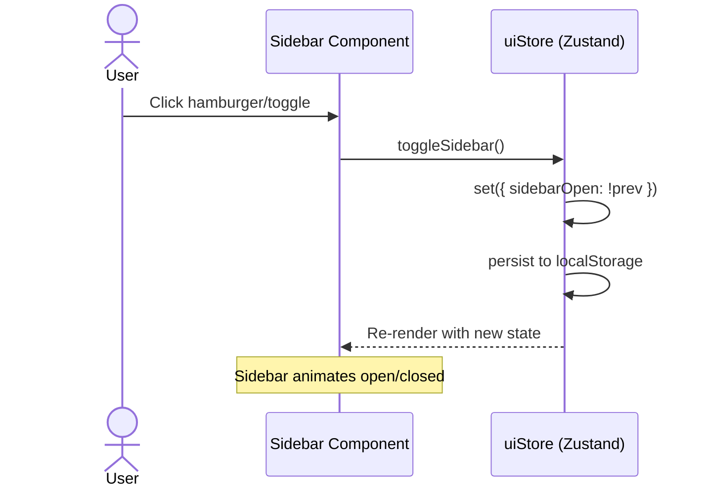

# State Management Architecture

## Document Control

| Field | Value |
|---|---|
| Document ID | FE-SM-001 |
| Version | 1.0.0 |
| Status | Active |
| Last Updated | 2026-07-14 |
| Classification | Internal - Engineering |
| Target Audience | Frontend Developers |
| Cross-References | `AGENTS.md Section 5`, `FolderStructure.md`, `RenderingStrategy.md`, `docs/engineering/12_Architecture.md` |

---

## Table of Contents

1. [Overview](#overview)
2. [State Management Philosophy](#state-management-philosophy)
3. [Zustand Store Architecture](#zustand-store-architecture)
4. [TanStack Query for Server State](#tanstack-query-for-server-state)
5. [Store Patterns](#store-patterns)
6. [Realtime Subscriptions](#realtime-subscriptions)
7. [Local State vs Server State](#local-state-vs-server-state)
8. [Offline State Persistence](#offline-state-persistence)
9. [State Flow Diagrams](#state-flow-diagrams)
10. [Best Practices](#best-practices)
11. [Related Documents](#related-documents)

---

## Overview

ARIA OS uses a layered state management architecture that separates concerns into three distinct categories:

1. **Client State** (Zustand): Global UI state, theme preferences, sidebar state, command palette, search state
2. **Server State** (TanStack Query): All data fetched from Supabase -- tasks, courses, habits, sleep logs, etc.
3. **Offline State** (IndexedDB): Local cache for offline access and mutation queue

This separation ensures predictable data flow, optimal performance, and graceful degradation when offline.

## State Management Philosophy



**Core principles:**
- Zustand is for UI-only state that does not originate from the server.
- TanStack Query handles all server-originated data with automatic caching, deduplication, and background refetch.
- IndexedDB provides offline persistence and mutation queuing.
- Stores never mix server data with client state.
- Realtime subscriptions invalidate TanStack Query caches, triggering refetches.

## Zustand Store Architecture

All Zustand stores live in `lib/stores/` and follow a consistent pattern.

### Store Inventory

| Store File | State | Persisted | Purpose |
|---|---|---|---|
| `user-store.ts` | `user`, `session`, `isAuthenticated` | Yes (localStorage) | Authentication state and user profile |
| `ui-store.ts` | `sidebarOpen`, `theme`, `activeModule`, `viewport` | Yes (localStorage) | Global UI preferences and layout state |
| `task-store.ts` | `selectedTaskId`, `filterState`, `viewMode` | No | Task UI state (not task data) |
| `search-store.ts` | `query`, `results`, `isOpen`, `recentSearches` | Yes (localStorage) | Command palette and search state |
| `notification-store.ts` | `notifications`, `unreadCount`, `preferences` | No | In-app notification state |
| `plugin-store.ts` | `installedPlugins`, `activePlugins`, `pluginStates` | Yes (localStorage) | Plugin management state |

### Store Pattern Template

```typescript
// lib/stores/ui-store.ts
import { create } from 'zustand'
import { persist } from 'zustand/middleware'

interface UIState {
  // State
  sidebarOpen: boolean
  theme: 'dark' | 'light' | 'system'
  activeModule: string | null
  viewport: 'mobile' | 'tablet' | 'desktop'

  // Actions
  toggleSidebar: () => void
  setSidebarOpen: (open: boolean) => void
  setTheme: (theme: 'dark' | 'light' | 'system') => void
  setActiveModule: (module: string | null) => void
  setViewport: (viewport: 'mobile' | 'tablet' | 'desktop') => void
  reset: () => void
}

export const useUIStore = create<UIState>()(
  persist(
    (set, get) => ({
      // Initial state
      sidebarOpen: true,
      theme: 'system',
      activeModule: null,
      viewport: 'desktop',

      // Actions
      toggleSidebar: () => set((state) => ({ sidebarOpen: !state.sidebarOpen })),
      setSidebarOpen: (open) => set({ sidebarOpen: open }),
      setTheme: (theme) => set({ theme }),
      setActiveModule: (module) => set({ activeModule: module }),
      setViewport: (viewport) => set({ viewport }),
      reset: () => set({
        sidebarOpen: true,
        theme: 'system',
        activeModule: null,
      }),
    }),
    {
      name: 'aria-ui-storage', // localStorage key
      partialize: (state) => ({
        sidebarOpen: state.sidebarOpen,
        theme: state.theme,
      }),
    }
  )
)
```

### Store Architecture Rules

1. **No server data in Zustand**: Never store Supabase query results in Zustand stores. Use TanStack Query instead.
2. **Actions mutate state immutably**: Always use `set()` with a new object, never mutate state directly.
3. **Persistence strategy**: Only persist user preferences and UI state. Never persist runtime state like `selectedTaskId`.
4. **Selectors for performance**: Use Zustand selectors to prevent unnecessary re-renders:

```typescript
// In component — only re-renders when sidebarOpen changes
const sidebarOpen = useUIStore((state) => state.sidebarOpen)
const toggleSidebar = useUIStore((state) => state.toggleSidebar)
```

5. **No stores in stores**: Stores should not import other stores. Use middleware or hooks to coordinate between stores.

## TanStack Query for Server State

TanStack Query (React Query v5) manages all server-originated data. Query hooks are co-located in `lib/query/` with one file per module.

### Query Hook Pattern

```typescript
// lib/query/use-tasks.ts
import { useQuery, useMutation, useQueryClient } from '@tanstack/react-query'
import { supabase } from '@/lib/supabase'
import type { Task } from '@/types/task'

// Query keys factory
export const taskKeys = {
  all: ['tasks'] as const,
  lists: () => [...taskKeys.all, 'list'] as const,
  list: (filters: Record<string, unknown>) => [...taskKeys.lists(), filters] as const,
  details: () => [...taskKeys.all, 'detail'] as const,
  detail: (id: string) => [...taskKeys.details(), id] as const,
}

// Query hook
export function useTasks(filters?: { status?: string; priority?: string }) {
  return useQuery({
    queryKey: taskKeys.list(filters ?? {}),
    queryFn: async () => {
      let query = supabase.from('tasks').select('*')

      if (filters?.status) {
        query = query.eq('status', filters.status)
      }
      if (filters?.priority) {
        query = query.eq('priority', filters.priority)
      }

      const { data, error } = await query.order('created_at', { ascending: false })
      if (error) throw error
      return data as Task[]
    },
    staleTime: 30_000,       // 30 seconds before considered stale
    gcTime: 5 * 60_000,      // 5 minutes in garbage collection
    refetchOnWindowFocus: true,
  })
}

// Mutation hook
export function useCreateTask() {
  const queryClient = useQueryClient()

  return useMutation({
    mutationFn: async (newTask: Omit<Task, 'id' | 'created_at'>) => {
      const { data, error } = await supabase.from('tasks').insert(newTask).select().single()
      if (error) throw error
      return data as Task
    },
    onSuccess: () => {
      queryClient.invalidateQueries({ queryKey: taskKeys.lists() })
    },
  })
}
```

### Query Configuration

| Setting | Value | Rationale |
|---|---|---|
| `staleTime` | 30s (default), 5min (static data) | Balance freshness vs refetch overhead |
| `gcTime` | 5min | Keep data in cache for navigation |
| `refetchOnWindowFocus` | true | Keep data fresh when user returns |
| `retry` | 3 (exponential backoff) | Handle transient network errors |
| `refetchInterval` | 30s (dashboard only) | Live-updating dashboard widgets |

### Cache Invalidation Strategy



## Store Patterns

### Pattern 1: Feature Store (UI-only)

Used for module-specific UI state that never touches server data.

```typescript
interface TaskUIState {
  selectedTaskId: string | null
  viewMode: 'list' | 'kanban' | 'calendar'
  filterStatus: string | null
  filterPriority: string | null
  searchQuery: string
  isCreating: boolean
  isEditing: boolean

  selectTask: (id: string | null) => void
  setViewMode: (mode: 'list' | 'kanban' | 'calendar') => void
  setFilter: (key: string, value: string | null) => void
  setSearchQuery: (query: string) => void
}
```

### Pattern 2: Compound Store with Slices

For complex state that needs organized slices.

```typescript
interface ChatState {
  // Slice A: Conversation
  conversations: Conversation[]
  activeConversationId: string | null

  // Slice B: Messages
  messages: Message[]
  isStreaming: boolean
  streamingContent: string

  // Slice C: Context
  contextData: ContextData | null
  attachedModules: string[]

  // Actions (namespaced by convention)
  conversations: { create: () => void; select: (id: string) => void; delete: (id: string) => void }
  messages: { send: (text: string) => void; stopStreaming: () => void; clear: () => void }
  context: { attachModule: (m: string) => void; detachModule: (m: string) => void }
}
```

### Pattern 3: Middleware Store

For stores that need side effects on state changes, using Zustand's `subscribe`:

```typescript
// Subscribe to theme changes
const unsubTheme = useUIStore.subscribe(
  (state) => state.theme,
  (theme) => {
    document.documentElement.classList.remove('light', 'dark', 'system')
    document.documentElement.classList.add(theme)
  }
)
```

## Realtime Subscriptions

Supabase Realtime provides live updates for multi-user scenarios and background data freshness.

### Subscription Architecture

```typescript
// lib/query/use-realtime-tasks.ts
import { useEffect } from 'react'
import { useQueryClient } from '@tanstack/react-query'
import { supabase } from '@/lib/supabase'
import { taskKeys } from './use-tasks'

export function useRealtimeTasks(userId: string) {
  const queryClient = useQueryClient()

  useEffect(() => {
    const channel = supabase
      .channel('tasks-realtime')
      .on(
        'postgres_changes',
        {
          event: '*',
          schema: 'public',
          table: 'tasks',
          filter: `user_id=eq.${userId}`,
        },
        () => {
          queryClient.invalidateQueries({ queryKey: taskKeys.lists() })
        }
      )
      .subscribe()

    return () => {
      supabase.removeChannel(channel)
    }
  }, [userId, queryClient])
}
```

### Realtime Strategy

| Data Type | Subscription | Invalidation Strategy |
|---|---|---|
| Tasks | Full table changes | Invalidate task list queries |
| Courses | Full table changes | Invalidate course list queries |
| Habits | Full table changes | Invalidate habit + habit_log queries |
| Chat messages | New messages only | Append to message list (no refetch) |
| Notifications | New notifications | Increment unread count + refetch |
| Dashboard KPIs | Selective (task/habit counts) | Aggregate queries invalidated |

## Local State vs Server State

### Decision Matrix

| Characteristic | Local State (Zustand) | Server State (TanStack Query) |
|---|---|---|
| Origin | User action, browser API, preference | Supabase database |
| Persistence | localStorage (optional) | Database (source of truth) |
| Freshness | Always current (local) | Stale-while-revalidate |
| Sharing | Single tab | Multi-tab via Realtime |
| Offline | Works immediately | Shows cached data |
| Cache strategy | Manual | Automatic (staleTime, gcTime) |
| Mutation | Direct set() | Optimistic → confirm → revert |
| Testing | Simple (mock store) | Requires mock Supabase |

### When to Use Each

**Use Zustand when:**
- Sidebar open/closed state
- Theme preference (dark/light/system)
- Selected item ID for detail views
- Search query text
- Modal/dialog open state
- View mode toggle (list/kanban/calendar)
- Command palette open/closed

**Use TanStack Query when:**
- Task list data and mutations
- Course list with progress
- Habit definitions and logs
- Sleep logs and scores
- Income entries
- Project and phase data
- Idea pipeline items
- Opportunity radar results
- Resource library items
- Time entries and stats
- User profile and preferences

**Use both together when:**
- A page needs UI state + server data
- Example: Task page uses TanStack Query for `useTasks()` and Zustand for `selectedTaskId` + `viewMode`. The UI state determines what and how to display, while the server state provides the data.

## Offline State Persistence

Offline state uses IndexedDB for durable storage and a mutation queue for deferred writes.

### Offline Architecture



### IndexedDB Store

Key tables cached locally for offline read access:

| Table | Cache Strategy | Records |
|---|---|---|
| tasks | Recent 100 + today's | ~150 |
| courses | Active only | ~20 |
| goals | Active only | ~20 |
| habits | Active only | ~50 |
| daily_briefings | Current week | ~7 |
| roadmaps | Active only | ~5 |
| user_profile | Single row | 1 |

## State Flow Diagrams

### User Creates a Task (Online)



### User Toggles Sidebar



## Best Practices

1. **One store per concern**: Each Zustand store has a single responsibility. Avoid monolithic stores.
2. **No server data in Zustand**: Server data lives in TanStack Query caches. Zustand is for UI state only.
3. **Use selectors**: Always use selectors to subscribe to specific state slices. This prevents unnecessary re-renders.
4. **Optimistic updates for mutations**: Use `onMutate` in TanStack Query for instant UI feedback on mutations.
5. **Batch invalidations**: When a mutation affects multiple query types, invalidate them all in `onSuccess`.
6. **Clean up realtime subscriptions**: Always unsubscribe from Realtime channels in `useEffect` cleanup.
7. **Avoid deeply nested state**: Keep store state flat. Use selectors to derive nested values.
8. **Test stores in isolation**: Zustand stores can be tested directly without React components.
9. **Persist only what is needed**: Use `partialize` in Zustand persist middleware to limit localStorage usage.
10. **Document store interfaces**: Every store should have a TypeScript interface documenting its state and actions.

## Related Documents

| Document | Description |
|---|---|
| [FolderStructure.md](FolderStructure.md) | Frontend directory structure and file organization |
| [RenderingStrategy.md](RenderingStrategy.md) | SSR, CSR, ISR decisions and rendering architecture |
| [ComponentLibrary.md](ComponentLibrary.md) | Component hierarchy and atomic design |
| [Architecture](../engineering/12_Architecture.md) | System architecture and data flow |
| [AGENTS.md Section 5](../../AGENTS.md) | Design system and component guidelines |
| [IMPLEMENTATION_BACKLOG.md](IMPLEMENTATION_BACKLOG.md) | Frontend implementation tracking |

---

## Revision History

| Version | Date | Author | Changes |
|---|---|---|---|
| 1.0.0 | 2026-07-14 | Developer | Initial state management documentation |
