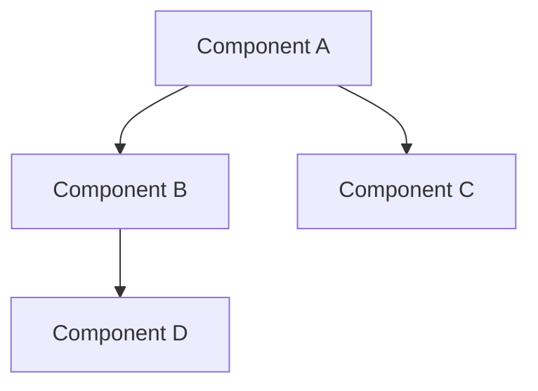

---
category: template
type: architecture
version: 1.0.0
status: active
---

# [Title]

## Document Control

| Field | Value |
|---|---|
| Document ID | GOV-TAR-001 |
| Version | 1.0.0 |
| Status | Draft |
| Last Updated | [YYYY-MM-DD] |
| Author | [Name] |

---

## Table of Contents

<!-- auto-generated on save -->

---

## Overview

[2–3 sentences describing the architecture component: what it is, the problem it solves, and its place in the system.]

## Design Goals

- **[Goal 1]**: [Brief description of what this goal means in practice]
- **[Goal 2]**: [Brief description]

## Architecture Diagram

<!-- Insert Mermaid diagram, ASCII art, or reference to diagram file -->

## Component Description

### [Component 1]

[Description of this component's responsibility, key behaviors, and interface contracts.]

**Responsibilities:**
- [Responsibility 1]
- [Responsibility 2]

**Interfaces:**
- [Interface/API surface]

### [Component 2]

[Description.]

## Data Flow

### Normal Flow

1. [Step 1: trigger or input]
2. [Step 2: processing]
3. [Step 3: storage or output]

### Error Flow

1. [What happens when something fails]
2. [How errors propagate]
3. [Recovery mechanism]

## Dependencies

### Internal Dependencies

| Dependency | Type | Purpose |
|---|---|---|
| [Module/Package] | [Library/Service/Data] | [Why it is needed] |

### External Dependencies

| Dependency | Version | Purpose | Fallback Strategy |
|---|---|---|---|
| [External Service] | [Version] | [Purpose] | [Fallback or degradation behavior] |

## Security Considerations

- **[Concern 1]**: [How it is addressed]
- **[Concern 2]**: [How it is addressed]
- **Data classification**: [Level of data handled]
- **Authentication/Authorization**: [How access is controlled]

## Performance Characteristics

| Scenario | Expected Performance | Degradation Behavior |
|---|---|---|
| [Normal load] | [Latency/throughput] | [Graceful degradation] |
| [Peak load] | [Latency/throughput] | [Throttling behavior] |
| [Failure mode] | [Recovery time] | [Fallback behavior] |

**Scaling strategy:** [Horizontal/vertical, autoscaling rules, capacity planning]

## Resilience and Fault Tolerance

- **[Mechanism 1]**: [e.g., Circuit breaker — opens after N failures, 60s cooldown]
- **[Mechanism 2]**: [e.g., Retry with exponential backoff — 3 attempts, 2s/4s/8s]
- **[Mechanism 3]**: [e.g., Provider failover — primary fails, secondary takes over]

## Alternatives Considered

| Alternative | Reason for Rejection |
|---|---|
| [Approach 1] | [Why it was not chosen] |
| [Approach 2] | [Why it was not chosen] |

## Future Considerations

- **[Future improvement 1]**: [When it might become relevant]
- **[Future improvement 2]**: [When it might become relevant]

## Related Documents

- `./path/to/related-doc.md` — [Relationship description (replace with actual link)]
- `./path/to/adr-doc.md` — [Decision reference (replace with actual link)]

---

## Revision History

| Version | Date | Author | Changes |
|---|---|---|---|
| 1.0.0 | YYYY-MM-DD | [Author] | Initial draft |
