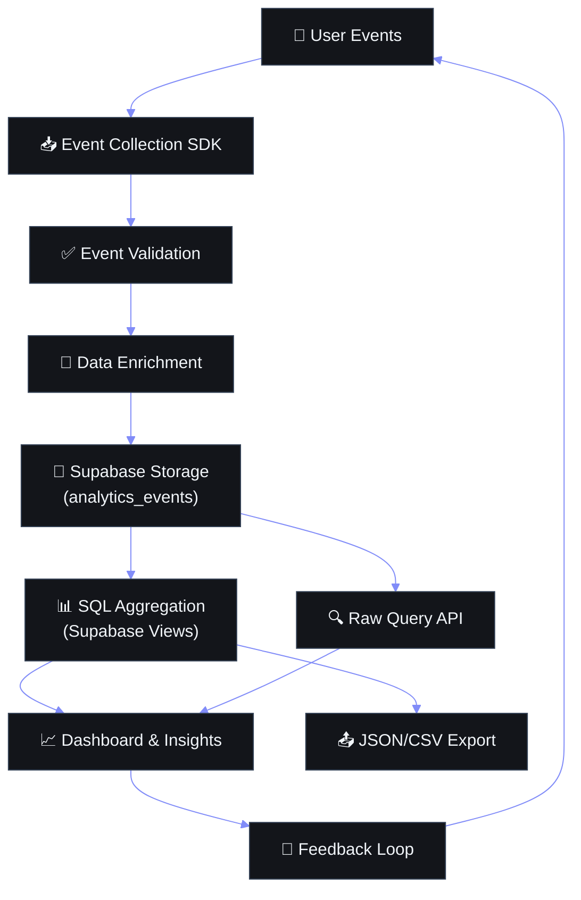

# Enterprise Analytics Architecture

## Document Control

| Field | Value |
|---|---|
| Document ID | SB-OPS-ANL-001 |
| Version | 3.0.0 |
| Status | Active |
| Last Updated | 2026-06-11 |
| Classification | Internal — Product & Engineering |
| Owner | Product Lead |
| Next Review | 2026-09-11 |

---

## Table of Contents

1. [Executive Summary](#1-executive-summary)
2. [Analytics Architecture Overview](#2-analytics-architecture-overview)
3. [Data Layer & Collection Pipeline](#3-data-layer--collection-pipeline)
4. [Event Taxonomy & Schema](#4-event-taxonomy--schema)
5. [Module-Specific Metrics](#5-module-specific-metrics)
6. [Product Metrics Framework](#6-product-metrics-framework)
7. [Dashboard Design](#7-dashboard-design)
8. [Funnel Analysis](#8-funnel-analysis)
9. [Cohort Analysis](#9-cohort-analysis)
10. [A/B Testing Framework](#10-ab-testing-framework)
11. [Data Export & Integration Pipeline](#11-data-export--integration-pipeline)
12. [Privacy & Governance](#12-privacy--governance)
13. [Implementation Guide for Developers](#13-implementation-guide-for-developers)
14. [Event QA & Validation](#14-event-qa--validation)
15. [Reporting Cadence](#15-reporting-cadence)
16. [Analytics Roadmap](#16-analytics-roadmap)
17. [Appendices](#17-appendices)

---



## 1. Executive Summary

Second Brain OS (ARIA OS) implements a **privacy-first, zero-telemetry analytics architecture** that enables product insight without compromising user trust. Unlike traditional analytics platforms that rely on third-party cookies, fingerprinting, and cross-site tracking, ARIA OS uses a first-party, event-based system stored in Supabase PostgreSQL.

**Design Philosophy:**
- **Privacy by Default:** No analytics collection without explicit user consent
- **Zero Third-Party Trackers:** No Google Analytics, Meta Pixel, Mixpanel, or similar
- **Data Minimization:** Only events necessary for product improvement are collected
- **User-Controlled:** Complete opt-in/opt-out capability with transparent event listing
- **Self-Hosted:** Analytics data stored in user's own Supabase instance

**Key Components:**
| Component | Technology | Purpose |
|---|---|---|
| Event Collection | Custom TypeScript/Python SDK | First-party event capture |
| Storage | Supabase PostgreSQL (`analytics_events` table) | Event persistence |
| Aggregation | SQL queries + Supabase Views | Real-time metric computation |
| Dashboards | Supabase Studio + Custom `/insights` page | Visualization |
| Export | JSON/CSV download | Portability |
| Retention | 90-day raw events; indefinite aggregates | Storage management |

**Data Flow:**
```
User Action → Frontend Event → POST /api/analytics/events → Supabase analytics_events
                                                                    ↓
                                                              SQL Aggregation
                                                                    ↓
                                                         Dashboards & Reports
```

---

## 2. Analytics Architecture Overview

### 2.1 High-Level Architecture

```
┌─────────────────────────────────────────────────────────────────────────┐
│                        CLIENT LAYER (Browser / Mobile)                   │
│                                                                          │
│  ┌─────────────┐  ┌──────────────┐  ┌──────────────┐  ┌──────────────┐  │
│  │ Page Views  │  │ User Actions │  │ Feature Use  │  │ Error Events │  │
│  └──────┬──────┘  └──────┬───────┘  └──────┬───────┘  └──────┬───────┘  │
│         │                │                  │                │           │
│         └────────────────┼──────────────────┴────────────────┘           │
│                          │                                              │
│                   ┌──────▼──────┐                                        │
│                   │ Event Buffer │  (batch: max 10 events / 5 seconds)   │
│                   └──────┬──────┘                                        │
│                          │ POST /api/analytics/events                   │
└──────────────────────────┼──────────────────────────────────────────────┘
                           │
┌──────────────────────────▼──────────────────────────────────────────────┐
│                        API LAYER (FastAPI)                               │
│                                                                          │
│  ┌──────────────────┐  ┌──────────────────┐  ┌──────────────────────┐   │
│  │ Event Validation │  │ User-ID Enrich   │  │ Rate Limit Check     │   │
│  └──────┬───────────┘  └──────┬───────────┘  └────────┬─────────────┘   │
│         │                    │                         │                 │
│         └────────────────────┼─────────────────────────┘                 │
│                              │                                           │
│                     ┌────────▼────────┐                                  │
│                     │ Consent Filter   │  (drop if no consent)            │
│                     └────────┬────────┘                                  │
└──────────────────────────────┼──────────────────────────────────────────┘
                               │
┌──────────────────────────────▼──────────────────────────────────────────┐
│                      DATA LAYER (Supabase PostgreSQL)                    │
│                                                                          │
│  ┌────────────────────────┐  ┌──────────────────┐  ┌────────────────┐   │
│  │ analytics_events (raw) │→│ agg_daily_events  │→│ materialized   │   │
│  │ 90-day TTL             │  │ (view)            │  │ views          │   │
│  └────────────────────────┘  └──────────────────┘  └────────────────┘   │
│                                                                          │
│  ┌────────────────────────┐  ┌──────────────────┐                       │
│  │ user_analytics_prefs   │  │ consent_records  │                       │
│  │ (per-user settings)    │  │ (audit trail)    │                       │
│  └────────────────────────┘  └──────────────────┘                       │
└─────────────────────────────────────────────────────────────────────────┘
```

### 2.2 Design Decisions

| Decision | Choice | Rationale |
|---|---|---|
| **Storage** | PostgreSQL (Supabase) | No additional infrastructure; RLS provides user isolation |
| **Schema** | JSONB properties column | Flexible event schema without migrations |
| **Collection** | Client-side SDK | Captures UI interactions directly |
| **Batching** | 10 events / 5 second window | Reduces API calls while maintaining timeliness |
| **Retention** | 90 days raw, indefinite aggregates | Balances storage cost vs. analytical value |
| **Aggregation** | SQL views (not scheduled jobs) | Real-time; no cron dependency |
| **Anonymization** | IP pseudonymization + no cookies | GDPR ePrivacy compliance |

### 2.3 Data Sovereignty

All analytics data is stored in the user's Supabase instance alongside their application data. This means:
- **No third-party analytics vendor** has access to user behavior data
- **No data leaves the Supabase region** (EU/US configurable)
- **User can delete analytics data** via standard DSR workflows
- **Analytics consent is per-user** with granular categories

---

## 3. Data Layer & Collection Pipeline

### 3.1 Database Schema

```sql
-- Core analytics events table
CREATE TABLE analytics_events (
    id UUID PRIMARY KEY DEFAULT gen_random_uuid(),
    user_id UUID NOT NULL REFERENCES users(id),
    event_name TEXT NOT NULL,                -- 'page_view', 'task_created', etc.
    properties JSONB DEFAULT '{}',           -- Flexible event properties
    session_id TEXT,                         -- Client-generated session identifier
    page_url TEXT,                           -- Current page URL (path only, no query params)
    referrer TEXT,                           -- HTTP referrer (stripped of PII)
    user_agent TEXT,                         -- Browser user agent (family + version only)
    ip_address_hash TEXT,                    -- Pseudonymized IP (first 3 octets hashed)
    timestamp TIMESTAMPTZ DEFAULT NOW(),
    consent_category TEXT DEFAULT 'essential' -- 'essential', 'functional', 'analytics'
);

-- Indexes for common query patterns
CREATE INDEX idx_analytics_events_user ON analytics_events (user_id, timestamp);
CREATE INDEX idx_analytics_events_name ON analytics_events (event_name, timestamp);
CREATE INDEX idx_analytics_events_session ON analytics_events (session_id);
CREATE INDEX idx_analytics_events_consent ON analytics_events (consent_category);
CREATE INDEX idx_analytics_events_properties ON analytics_events USING GIN (properties);

-- Row-Level Security
ALTER TABLE analytics_events ENABLE ROW LEVEL SECURITY;

-- User can only see their own events
CREATE POLICY "analytics_user_isolation" ON analytics_events
    FOR ALL
    USING (auth.uid() = user_id)
    WITH CHECK (auth.uid() = user_id);

-- Aggregated daily events view (for dashboards)
CREATE VIEW agg_daily_events AS
SELECT
    user_id,
    event_name,
    DATE(timestamp) as event_date,
    COUNT(*) as event_count,
    COUNT(DISTINCT session_id) as unique_sessions
FROM analytics_events
WHERE timestamp > NOW() - INTERVAL '90 days'
GROUP BY user_id, event_name, DATE(timestamp);

-- User preferences table
CREATE TABLE user_analytics_prefs (
    user_id UUID PRIMARY KEY REFERENCES users(id),
    analytics_consent BOOLEAN DEFAULT false,
    functional_consent BOOLEAN DEFAULT true,
    consented_at TIMESTAMPTZ,
    consent_version INTEGER DEFAULT 1,
    updated_at TIMESTAMPTZ DEFAULT NOW()
);
```

### 3.2 Event Collection Pipeline

```python
# apps/api/app/api/analytics.py
from fastapi import APIRouter, Depends, HTTPException
from pydantic import BaseModel, Field, field_validator
from typing import Optional
from datetime import datetime
from config.core.supabase import get_supabase
from api.dependencies import get_current_user

router = APIRouter(prefix="/api/analytics", tags=["analytics"])

class AnalyticsEvent(BaseModel):
    event_name: str = Field(..., min_length=1, max_length=64)
    properties: dict = Field(default_factory=dict)
    session_id: Optional[str] = None
    page_url: Optional[str] = None
    referrer: Optional[str] = None
    timestamp: Optional[datetime] = None

    @field_validator('event_name')
    @classmethod
    def validate_event_name(cls, v):
        allowed_chars = set('abcdefghijklmnopqrstuvwxyz0123456789_')
        if not all(c in allowed_chars for c in v):
            raise ValueError("Event name must be lowercase snake_case alphanumeric")
        return v

    @field_validator('properties')
    @classmethod
    def validate_properties(cls, v):
        if len(v) > 20:
            raise ValueError("Maximum 20 properties per event")
        for key in v:
            if len(key) > 64:
                raise ValueError(f"Property key '{key}' exceeds 64 characters")
            if isinstance(v[key], str) and len(v[key]) > 1000:
                raise ValueError(f"Property '{key}' string value exceeds 1000 characters")
        return v

class AnalyticsBatch(BaseModel):
    events: list[AnalyticsEvent] = Field(..., min_length=1, max_length=50)

@router.post("/events")
async def track_events(
    batch: AnalyticsBatch,
    user: dict = Depends(get_current_user),
    request: Request = None,
):
    """Accept batch of analytics events from client."""

    # Check user consent
    prefs = get_user_analytics_prefs(user.id)
    if not prefs.get('analytics_consent'):
        # Drop non-essential events silently
        essential_events = [e for e in batch.events
                          if e.event_name.startswith('essential_')]
        if not essential_events:
            return {"accepted": 0, "dropped": len(batch.events)}
        batch.events = essential_events

    # Anonymize IP
    ip_hash = None
    if request and request.client:
        ip_parts = request.client.host.split('.')
        if len(ip_parts) == 4:
            partial = '.'.join(ip_parts[:3])
            import hashlib
            ip_hash = hashlib.sha256(partial.encode()).hexdigest()[:16]

    # Strip query params from URL
    def clean_url(url):
        if not url:
            return None
        from urllib.parse import urlparse
        parsed = urlparse(url)
        return parsed.path

    # Insert events
    supabase = get_supabase()
    rows = []
    for event in batch.events:
        row = {
            'user_id': str(user.id),
            'event_name': event.event_name,
            'properties': event.properties,
            'session_id': event.session_id,
            'page_url': clean_url(event.page_url),
            'ip_address_hash': ip_hash,
            'timestamp': (event.timestamp or datetime.utcnow()).isoformat(),
        }

        # Classify consent category
        if event.event_name.startswith('essential_'):
            row['consent_category'] = 'essential'
        elif event.event_name.startswith('functional_'):
            row['consent_category'] = 'functional'
        else:
            row['consent_category'] = 'analytics'

        rows.append(row)

    result = supabase.table('analytics_events').insert(rows).execute()
    return {"accepted": len(rows), "dropped": len(batch.events) - len(rows)}
```

### 3.3 Client-Side SDK

```typescript
// packages/shared/utils/analytics.ts
type ConsentState = 'granted' | 'denied' | 'not_asked'

interface AnalyticsConfig {
  endpoint: string
  enabled: boolean
  batchSize: number
  flushInterval: number // ms
}

export class AnalyticsSDK {
  private buffer: AnalyticsEvent[] = []
  private config: AnalyticsConfig
  private sessionId: string
  private consentState: ConsentState = 'not_asked'
  private flushTimer: NodeJS.Timeout | null = null

  constructor(config: Partial<AnalyticsConfig> = {}) {
    this.config = {
      endpoint: '/api/analytics/events',
      enabled: process.env.NODE_ENV === 'production',
      batchSize: 10,
      flushInterval: 5000,
      ...config,
    }
    this.sessionId = this.generateSessionId()
  }

  private generateSessionId(): string {
    return `sess_${Date.now()}_${Math.random().toString(36).substr(2, 9)}`
  }

  setConsent(state: ConsentState) {
    this.consentState = state
    if (state === 'denied') {
      this.buffer = []
      this.stopFlushTimer()
    } else if (state === 'granted') {
      this.startFlushTimer()
    }
  }

  track(eventName: string, properties: Record<string, any> = {}) {
    if (!this.config.enabled) return
    if (this.consentState === 'denied') return

    // Sanitize properties (no PII)
    const safeProps = this.sanitizeProperties(properties)

    this.buffer.push({
      event_name: eventName,
      properties: safeProps,
      session_id: this.sessionId,
      page_url: window.location.href,
      referrer: document.referrer || undefined,
      timestamp: new Date().toISOString(),
    })

    if (this.buffer.length >= this.config.batchSize) {
      this.flush()
    } else if (!this.flushTimer) {
      this.startFlushTimer()
    }
  }

  private sanitizeProperties(props: Record<string, any>): Record<string, any> {
    const blockedKeys = [
      'email', 'password', 'token', 'secret', 'key', 'ssn', 'phone',
      'credit_card', 'address', 'dob', 'passport',
    ]
    const sanitized: Record<string, any> = {}
    for (const [key, value] of Object.entries(props)) {
      // Skip blocked keys
      if (blockedKeys.some(bk => key.toLowerCase().includes(bk))) continue
      // Skip functions and symbols
      if (typeof value === 'function' || typeof value === 'symbol') continue
      // Truncate long strings
      sanitized[key] = typeof value === 'string' ? value.slice(0, 500) : value
    }
    return sanitized
  }

  private async flush() {
    if (this.buffer.length === 0) return

    const events = [...this.buffer]
    this.buffer = []

    try {
      const resp = await fetch(this.config.endpoint, {
        method: 'POST',
        headers: { 'Content-Type': 'application/json' },
        credentials: 'include',
        body: JSON.stringify({ events }),
      })
      if (!resp.ok) {
        console.warn('[Analytics] Failed to send events:', resp.status)
      }
    } catch (err) {
      // Silent fail — analytics should never break the app
      console.warn('[Analytics] Network error:', err)
    }
  }

  private startFlushTimer() {
    if (this.flushTimer) clearInterval(this.flushTimer)
    this.flushTimer = setInterval(() => this.flush(), this.config.flushInterval)
  }

  private stopFlushTimer() {
    if (this.flushTimer) {
      clearInterval(this.flushTimer)
      this.flushTimer = null
    }
  }

  // Page view tracking (auto-invoked on route change)
  trackPageView(pageName: string, pageProperties: Record<string, any> = {}) {
    this.track('page_view', {
      page_name: pageName,
      ...pageProperties,
    })
  }

  // Duration tracking for feature engagement
  startTimer(label: string): () => void {
    const start = Date.now()
    return () => {
      const duration = Date.now() - start
      this.track('feature_duration', {
        label,
        duration_ms: duration,
      })
    }
  }
}

export const analytics = new AnalyticsSDK()
```

### 3.4 Consent Filtering Pipeline

```
Event Received → Check user_analytics_prefs.analytics_consent
                     │
                     ├── false ───→ event.consent_category == 'essential'?
                     │                  │
                     │                  ├── yes → store event
                     │                  └── no  → drop event (silently)
                     │
                     └── true ────→ store event with consent_category
```

### 3.5 Collection Failure Modes

| Failure Mode | Impact | Mitigation |
|---|---|---|
| API unreachable | Events lost during downtime | Client-side buffer retries up to 3 times |
| Rate limit exceeded | Events dropped | Backoff strategy (exponential, max 30s) |
| Invalid event schema | Individual event rejected | Validate on client + server; log rejection |
| Consent revoked mid-session | Future events dropped | Immediate flush of non-essential buffer |
| Supabase outage | Events lost | Buffer persists in memory; retry on 200 |
| User clears localStorage | Session ID reset | New session created; analytics CTPS unaffected |

---

## 4. Event Taxonomy & Schema

### 4.1 Event Naming Convention

All event names follow the format: `{domain}_{action}_{context}`

- **Domain:** Module or feature area (`task`, `course`, `habit`, `sleep`, `auth`, `ai`, `ui`)
- **Action:** User or system action (`created`, `updated`, `deleted`, `viewed`, `completed`, `failed`)
- **Context:** Optional qualifier (`detail`, `list`, `bulk`)

**Examples:** `task_created`, `habit_logged_daily`, `ai_briefing_generated`, `auth_login_completed`

### 4.2 Complete Event Inventory

#### 4.2.1 Authentication Events

| Event Name | Category | Properties | Trigger |
|---|---|---|---|
| `auth_login_started` | essential | `provider: string` | User clicks "Sign in" |
| `auth_login_completed` | essential | `provider: string` | OAuth callback succeeds |
| `auth_login_failed` | essential | `error: string` | OAuth callback fails |
| `auth_logout` | essential | — | User clicks "Sign out" |
| `auth_session_expired` | essential | — | 7-day inactivity timeout |
| `auth_token_refreshed` | essential | — | Background token refresh |

#### 4.2.2 Task Module Events

| Event Name | Category | Properties | Trigger |
|---|---|---|---|
| `task_created` | analytics | `priority: string, has_due_date: bool` | Task form submitted |
| `task_updated` | analytics | `changed_fields: string[]` | Task edit saved |
| `task_deleted` | analytics | — | Task deleted |
| `task_completed` | analytics | `priority: string, was_overdue: bool` | Task marked done |
| `task_viewed_detail` | analytics | — | Task detail page opened |
| `task_batch_completed` | analytics | `count: int` | Bulk complete action |
| `task_filter_used` | analytics | `filter_type: string` | Filter/sort applied |
| `task_dependency_added` | analytics | — | Blocking relation created |
| `task_subtask_added` | analytics | — | Subtask created |

#### 4.2.3 Course Module Events

| Event Name | Category | Properties | Trigger |
|---|---|---|---|
| `course_created` | analytics | `subject: string` | New course added |
| `course_progress_updated` | analytics | `progress_pct: float` | Progress slider moved |
| `course_deadline_set` | analytics | — | Due date assigned |
| `course_grade_recorded` | analytics | `grade: string` | Grade entered |
| `course_goal_set` | analytics | `target_grade: string` | Target grade set |

#### 4.2.4 Habit Module Events

| Event Name | Category | Properties | Trigger |
|---|---|---|---|
| `habit_created` | analytics | `frequency: string` | New habit defined |
| `habit_logged` | analytics | `habit_name: string` | Daily habit check-in |
| `habit_streak_milestone` | analytics | `streak_days: int` | 7/14/21/30 day streak |
| `habit_broken_streak` | analytics | `streak_days: int` | Missed a day |
| `habit_archived` | analytics | — | Habit removed |

#### 4.2.5 AI Module Events

| Event Name | Category | Properties | Trigger |
|---|---|---|---|
| `ai_briefing_generated` | functional | `content_length: int, model: string` | Daily briefing created |
| `ai_briefing_viewed` | functional | — | User opens briefing |
| `ai_weekly_review_generated` | functional | `content_length: int` | Weekly review created |
| `ai_chat_message_sent` | functional | `message_length: int` | User sends chat |
| `ai_chat_message_received` | functional | `response_length: int, latency_ms: int` | AI responds |
| `ai_opportunity_found` | functional | `match_score: float` | New opportunity detected |
| `ai_memory_consolidated` | functional | — | Background memory job |
| `ai_sleep_winddown_sent` | functional | — | Sleep wind-down generated |
| `ai_nudge_sent` | functional | `nudge_type: string` | Course/habit nudge |
| `ai_model_fallback` | essential | `from_model: string, to_model: string` | Ollama → Claude switch |

#### 4.2.6 UI/UX Events

| Event Name | Category | Properties | Trigger |
|---|---|---|---|
| `page_view` | analytics | `page_name: string, load_time_ms: int` | Route change |
| `feature_used` | analytics | `feature_name: string` | Specific feature interaction |
| `feature_duration` | analytics | `label: string, duration_ms: int` | Timer tracked duration |
| `search_executed` | analytics | `result_count: int` | Global search used |
| `error_occurred` | essential | `error_type: string, message: string, page: string` | Any caught error |
| `consent_updated` | essential | `categories: string[]` | User changes consent prefs |

#### 4.2.7 System Events

| Event Name | Category | Properties | Trigger |
|---|---|---|---|
| `system_cron_executed` | essential | `job_name: string, duration_ms: int` | Cron job runs |
| `system_cron_failed` | essential | `job_name: string, error: string` | Cron job fails |
| `system_health_check` | essential | `all_healthy: bool` | Health endpoint hit |
| `system_deployment` | essential | `version: string, commit: string` | New deploy detected |
| `system_rate_limit_hit` | essential | `endpoint: string` | 429 returned |

### 4.3 Event Properties Schema

```typescript
// Standard property types across all events
interface StandardProperties {
  // Common
  version?: string                 // App version
  platform?: 'web' | 'mobile'     // Client platform

  // Timing
  timestamp?: string               // ISO 8601
  duration_ms?: number             // For duration tracking
  latency_ms?: number              // For API/processing latency

  // Quality
  error_type?: string              // Error classification
  error_message?: string           // Sanitized error (no PII)
  http_status?: number             // HTTP response code

  // Performance
  load_time_ms?: number            // Page/feature load time
  render_time_ms?: number          // Client render time
  api_time_ms?: number             // Backend response time

  // Context
  screen_size?: string             // 'sm', 'md', 'lg', 'xl'
  connection_type?: string         // '4g', 'wifi', etc.
  preferred_language?: string      // Browser language
}
```

### 4.4 Event Taxonomy Validation Rules

| Rule | Enforcement | Violation Action |
|---|---|---|
| Event names must be `snake_case` | Server-side regex validation | Reject event (400) |
| Max 20 properties per event | Server-side validation | Truncate to first 20 |
| Property values max 1000 chars | Server-side validation | Truncate string values |
| No PII in property values | Client-side sanitization + server scan | Drop property |
| Event name length 1-64 chars | Server-side validation | Reject event (400) |
| Required fields must be present | Server-side Pydantic validation | Reject event (400) |
| Nested objects max depth 3 | Server-side validation | Flatten to depth 3 |
| Array values max 50 items | Server-side validation | Truncate to 50 |

---

## 5. Module-Specific Metrics

### 5.1 Tasks Module

| Metric | Definition | SQL Query | Frequency |
|---|---|---|---|
| **Tasks Created/Day** | Count of `task_created` events per day | `SELECT COUNT(*) FROM analytics_events WHERE event_name='task_created' AND DATE(timestamp)=CURRENT_DATE` | Daily |
| **Task Completion Rate** | Ratio of `task_completed` to `task_created` over 7 days | `SELECT (SELECT COUNT(*) FROM analytics_events WHERE event_name='task_completed' AND timestamp > NOW() - INTERVAL '7 days') * 1.0 / NULLIF((SELECT COUNT(*) FROM analytics_events WHERE event_name='task_created' AND timestamp > NOW() - INTERVAL '7 days'), 0)` | Weekly |
| **Overdue Task Rate** | % of completed tasks that were overdue | `SELECT COUNT(*) FROM analytics_events WHERE event_name='task_completed' AND properties->>'was_overdue' = 'true' AND timestamp > NOW() - INTERVAL '7 days') * 100.0 / NULLIF(COUNT(*) FILTER WHERE event_name='task_completed', 0)` | Weekly |
| **Avg Tasks/Active Day** | Average tasks completed per active day | `SELECT AVG(daily_count) FROM (SELECT DATE(timestamp) as day, COUNT(*) as daily_count FROM analytics_events WHERE event_name='task_completed' GROUP BY day)` | Monthly |
| **Priority Distribution** | % of tasks by priority level | `SELECT properties->>'priority' as priority, COUNT(*) * 100.0 / SUM(COUNT(*)) OVER () FROM analytics_events WHERE event_name='task_created' GROUP BY priority` | Monthly |
| **Filter Usage Rate** | % of sessions using task filters | `SELECT COUNT(DISTINCT session_id) FILTER (WHERE event_name='task_filter_used') * 100.0 / COUNT(DISTINCT session_id) FROM analytics_events WHERE timestamp > NOW() - INTERVAL '30 days'` | Monthly |

### 5.2 Courses Module

| Metric | Definition | Query Pattern | Frequency |
|---|---|---|---|
| **Active Courses** | Courses with updates in last 30 days | `SELECT COUNT(DISTINCT properties->>'course_id') FROM analytics_events WHERE event_name IN ('course_progress_updated', 'course_goal_set') AND timestamp > NOW() - INTERVAL '30 days'` | Daily |
| **Progress Velocity** | Average progress % change per week | Computed from consecutive `course_progress_updated` events per course | Weekly |
| **Grade Distribution** | Distribution of recorded grades | `SELECT properties->>'grade' as grade, COUNT(*) FROM analytics_events WHERE event_name='course_grade_recorded' GROUP BY grade` | Monthly |
| **Goal Achievement Rate** | % of courses where target grade was met | Requires joining with course data | Monthly |
| **Deadline Adherence** | % of courses meeting deadlines | Join `course_deadline_set` with actual completion events | Monthly |

### 5.3 Habits Module

| Metric | Definition | Query Pattern | Frequency |
|---|---|---|---|
| **Active Habits** | Habits logged in last 7 days | `SELECT COUNT(DISTINCT properties->>'habit_name') FROM analytics_events WHERE event_name='habit_logged' AND timestamp > NOW() - INTERVAL '7 days'` | Daily |
| **Streak Milestones** | Count of streak achievements by level | `SELECT properties->>'streak_days' as streak, COUNT(*) FROM analytics_events WHERE event_name='habit_streak_milestone' GROUP BY streak` | Weekly |
| **Consistency Score** | % of eligible days habits were logged | Compute from `habit_logged` / expected frequency | Weekly |
| **Streak Break Rate** | Frequency of `habit_broken_streak` events | `SELECT COUNT(*) FROM analytics_events WHERE event_name='habit_broken_streak'` | Monthly |
| **Top Habits** | Most consistently tracked habits | `SELECT properties->>'habit_name', COUNT(*) FROM analytics_events WHERE event_name='habit_logged' GROUP BY habit_name ORDER BY COUNT(*) DESC` | Monthly |

### 5.4 AI Module

| Metric | Definition | Query Pattern | Frequency |
|---|---|---|---|
| **AI Feature Adoption** | % of users who use AI features | `SELECT COUNT(DISTINCT user_id) FROM analytics_events WHERE event_name LIKE 'ai_%'` | Weekly |
| **Briefing Open Rate** | % of generated briefings viewed | `SELECT COUNT(*) FILTER (WHERE event_name='ai_briefing_viewed') * 100.0 / COUNT(*) FILTER (WHERE event_name='ai_briefing_generated')` | Daily |
| **Chat Engagement** | Avg messages per chat session | `SELECT AVG(msg_count) FROM (SELECT session_id, COUNT(*) as msg_count FROM analytics_events WHERE event_name='ai_chat_message_sent' GROUP BY session_id)` | Weekly |
| **AI Response Time** | Average LLM response latency | `SELECT AVG((properties->>'latency_ms')::int) FROM analytics_events WHERE event_name='ai_chat_message_received'` | Daily |
| **Fallback Rate** | % of AI calls using Claude fallback | `SELECT COUNT(*) * 100.0 / (SELECT COUNT(*) FROM analytics_events WHERE event_name LIKE 'ai_%') FROM analytics_events WHERE event_name='ai_model_fallback'` | Weekly |
| **Opportunity Match Rate** | % of opportunities with score > 70% | `SELECT COUNT(*) FROM analytics_events WHERE event_name='ai_opportunity_found' AND (properties->>'match_score')::float > 0.7` | Weekly |

### 5.5 System Health Metrics

| Metric | Definition | Query Pattern | Frequency |
|---|---|---|---|
| **Error Rate** | % of requests resulting in errors | `SELECT COUNT(*) FILTER (WHERE event_name='error_occurred') * 100.0 / NULLIF((SELECT COUNT(*) FROM analytics_events WHERE event_name='page_view'), 0)` | Hourly |
| **API Latency (p50/p95/p99)** | Percentile API response times | Compute from `properties->>'api_time_ms'` in `page_view` events | Hourly |
| **Cron Success Rate** | % of scheduled jobs completing | `SELECT COUNT(*) FILTER (WHERE event_name='system_cron_executed') * 100.0 / (COUNT(*) FILTER (WHERE event_name IN ('system_cron_executed', 'system_cron_failed')))` | Daily |
| **Rate Limit Hit Rate** | Frequency of rate limit events | `SELECT COUNT(*) FROM analytics_events WHERE event_name='system_rate_limit_hit'` | Daily |
| **Active Users (DAU/WAU/MAU)** | Distinct users per period | `SELECT COUNT(DISTINCT user_id) FROM analytics_events WHERE timestamp > NOW() - INTERVAL '1 day'` | Daily |

---

## 6. Product Metrics Framework

### 6.1 AARRR Framework Mapping

| Metric | Definition | ARIA OS Equivalent | Measurement |
|---|---|---|---|
| **Acquisition** | Users signing up | `auth_login_completed` (first time) | Count of new user sign-ups |
| **Activation** | Users reaching "aha moment" | `task_created` within 24h of sign-up | % of new users creating >= 1 task |
| **Retention** | Users returning | `page_view` within D1/D7/D30 | Cohort retention curves |
| **Revenue** | Monetization | N/A (free product) | Feature adoption = proxy |
| **Referral** | Users inviting others | N/A (single-user tool) | N/A |

### 6.2 North Star Metric

**"Tasks Completed Per Active User Per Week"**

This metric captures the core value proposition — users who consistently complete tasks are getting the most value from the system.

```sql
SELECT
    DATE_TRUNC('week', timestamp) as week,
    COUNT(DISTINCT user_id) as active_users,
    COUNT(*) as total_completed,
    ROUND(COUNT(*) * 1.0 / COUNT(DISTINCT user_id), 1) as tasks_per_active_user
FROM analytics_events
WHERE event_name = 'task_completed'
  AND timestamp > NOW() - INTERVAL '12 weeks'
GROUP BY week
ORDER BY week DESC;
```

**Target:** > 10 tasks completed per active user per week

### 6.3 Health Metrics Dashboard

| Category | Metric | Good | Warning | Critical |
|---|---|---|---|---|
| **Engagement** | DAU (Daily Active Users) | > 80% of MAU | > 50% of MAU | < 30% of MAU |
| **Engagement** | Session Duration | > 15 min | > 5 min | < 2 min |
| **Engagement** | Tasks/Active User/Week | > 10 | > 5 | < 3 |
| **Adoption** | AI Feature Usage | > 60% of users | > 30% | < 10% |
| **Retention** | D1 Retention | > 60% | > 40% | < 20% |
| **Retention** | D7 Retention | > 40% | > 25% | < 10% |
| **Retention** | D30 Retention | > 30% | > 15% | < 5% |
| **Quality** | Error Rate | < 1% | < 5% | > 5% |
| **Quality** | API p95 Latency | < 300ms | < 1000ms | > 1000ms |
| **Quality** | Uptime | > 99.9% | > 99.5% | < 99.0% |

### 6.4 Leading vs Lagging Indicators

| Type | Metric | Why |
|---|---|---|
| **Leading** | Tasks Created / Day | Predicts future task completion volume |
| **Leading** | Onboarding Completion Rate | Predicts D1-D7 retention |
| **Leading** | Feature Discovery Rate | Predicts longer-term feature adoption |
| **Lagging** | Tasks Completed / Week | Measures actual delivered value |
| **Lagging** | D30 Retention | Confirms long-term product-market fit |
| **Lagging** | Streak Milestones | Confirms habit formation |

### 6.5 Metric Computation Pipeline

```
Raw Events → Stage 1: Clean & Validate → Stage 2: Enrich (user_id, session) → Stage 3: Classify
    ↓
Stage 4: Aggregate (hourly/daily views) → Stage 5: Materialize (materialized views for dashboards)
    ↓
Stage 6: Alert (threshold breaches) → Stage 7: Report (weekly/monthly snapshots)
```

```sql
-- Example: Daily materialized view for performance
CREATE MATERIALIZED VIEW mv_daily_product_metrics AS
SELECT
    DATE(timestamp) as metric_date,
    COUNT(DISTINCT user_id) FILTER (WHERE event_name = 'page_view') as dau,
    COUNT(*) FILTER (WHERE event_name = 'task_completed') as tasks_completed,
    COUNT(*) FILTER (WHERE event_name = 'task_created') as tasks_created,
    COUNT(*) FILTER (WHERE event_name = 'habit_logged') as habits_logged,
    COUNT(*) FILTER (WHERE event_name = 'ai_chat_message_sent') as chat_messages,
    COUNT(*) FILTER (WHERE event_name = 'error_occurred') as errors,
    COUNT(*) FILTER (WHERE event_name = 'course_progress_updated') as course_updates,
    AVG((properties->>'load_time_ms')::int) FILTER (WHERE event_name = 'page_view' AND properties ? 'load_time_ms') as avg_page_load_ms
FROM analytics_events
WHERE timestamp > NOW() - INTERVAL '90 days'
GROUP BY metric_date
ORDER BY metric_date DESC;

-- Refresh materialized view daily
REFRESH MATERIALIZED VIEW CONCURRENTLY mv_daily_product_metrics;
```

---

## 7. Dashboard Design

### 7.1 Dashboard Architecture

```
Supabase PostgreSQL → SQL Views → Supabase Studio / Custom Frontend
       │                                       │
       │  Materialized Views                   │
       │  (fast aggregation)                   │
       │                                       │
       └──→ agg_daily_events (view)            │
       └──→ mv_daily_product_metrics (mat)     │
       └──→ mv_weekly_cohort_retention (mat)   │
       └──→ user_analytics_prefs               │
                                                │
                                     ┌──────────▼──────────┐
                                     │  /insights Dashboard │
                                     │  (Next.js protected) │
                                     └─────────────────────┘
```

### 7.2 Dashboard Sections

#### 7.2.1 Overview Dashboard

```
┌─────────────────────────────────────────────────────────────────────────┐
│  OVERVIEW DASHBOARD                      Last 30 days │ Custom │       │
├─────────────────────────────────────────────────────────────────────────┤
│  ┌────────┐  ┌────────┐  ┌────────┐  ┌────────┐  ┌──────────────────┐  │
│  │ DAU    │  │ Tasks  │  │ Habits │  │ Errors │  │ 7-Day Trend      │  │
│  │ 3      │  │ 42     │  │ 18     │  │ 0.8%   │  │ ▁▃▆▅▇▆█           │  │
│  │ +12% Wo│  │ +8% Wo │  │ -3% Wo │  │ ▼0.2%  │  │                  │  │
│  └────────┘  └────────┘  └────────┘  └────────┘  └──────────────────┘  │
├─────────────────────────────────────────────────────────────────────────┤
│  DAILY ACTIVE USERS                              Last 30 days          │
│  ┌─────────────────────────────────────────────────────────────────────┐│
│  │  ██                                                                 ││
│  │  ██ ██                                                             ││
│  │  ██ ██ ██   ██                                                     ││
│  │  ██ ██ ██ ██ ██ ██   ██ ██                                         ││
│  │  ██ ██ ██ ██ ██ ██ ██ ██ ██ ██ ██ ██ ██ ██ ██ ██ ██ ██ ██ ██ ██  ││
│  └─────────────────────────────────────────────────────────────────────┘│
├─────────────────────────────────────────────────────────────────────────┤
│  MODULE BREAKDOWN                           Last 7 days │ Compare │   │
│  ┌─────────────────────────────────────────────────────────────────────┐│
│  │ Module          Events    Users    Change      Engagement           ││
│  │ ─────────────────────────────────────────────────────────────       ││
│  │ Tasks           342       7        +15%        ████████░░ 80%       ││
│  │ Habits          156       5        -8%         ████░░░░░░ 40%       ││
│  │ AI Chat         89        3        +45%        ██░░░░░░░░ 20%       ││
│  │ Courses         67        4        +5%         ███░░░░░░░ 30%       ││
│  │ Sleep           45        3        +10%        ██░░░░░░░░ 20%       ││
│  └─────────────────────────────────────────────────────────────────────┘│
└─────────────────────────────────────────────────────────────────────────┘
```

#### 7.2.2 Module Detail Dashboard

```typescript
// pages/insights/tasks.tsx — Task-specific metrics
interface TaskMetrics {
  created_today: number
  completed_today: number
  overdue_rate: number
  avg_completion_time: number // hours
  priority_distribution: Record<string, number>
  weekly_trend: Array<{ date: string; count: number }>
  top_tags: Array<{ tag: string; count: number }>
}

async function getTaskMetrics(userId: string): Promise<TaskMetrics> {
  const supabase = createClient()
  const sevenDaysAgo = new Date(Date.now() - 7 * 86400000).toISOString()

  const { data } = await supabase
    .from('analytics_events')
    .select('event_name, properties, timestamp')
    .eq('user_id', userId)
    .in('event_name', ['task_created', 'task_completed', 'task_filter_used'])
    .gte('timestamp', sevenDaysAgo)

  // Compute metrics from raw events
  return computeTaskMetrics(data)
}
```

### 7.3 Dashboard Query Performance

| Query Type | Frequency | Complexity | Cache Strategy |
|---|---|---|---|
| Overview stats | On page load | Medium (JOIN 3 views) | Materialized view (hourly) |
| Module detail | On page load | Medium | Materialized view (hourly) |
| Retention data | On page load | High (cohort aggregation) | Materialized view (daily) |
| Funnel data | On page load | Medium | Materialized view (daily) |
| Export CSV | On demand | Low (direct table scan) | None (direct query) |
| Trend data | On hover | High (rolling window) | Subquery with index scan |

### 7.4 Visualization Components

```typescript
// packages/ui/components/charts/
// All charts use Supabase data + client-side rendering

interface ChartConfig {
  type: 'line' | 'bar' | 'pie' | 'funnel' | 'heatmap'
  data: any[]
  options: {
    xKey: string
    yKey: string
    color?: string
    stacked?: boolean
    trendline?: boolean
    comparison?: 'week_over_week' | 'month_over_month'
  }
}

// Available chart components:
// - TimeSeriesChart — Line chart for trends over time
// - BarChart — Grouped/stacked bar chart for comparisons
// - PieChart — Distribution visualization
// - FunnelChart — Conversion funnel visualization
// - HeatmapGrid — Calendar heatmap (like GitHub contributions)
// - MetricCard — Single KPI with comparison arrow
// - ProgressBar — Percentage bar
// - ComparisonTable — Tabular data with WoW/MoM changes
```

---

## 8. Funnel Analysis

### 8.1 Key Funnels

#### 8.1.1 Task Completion Funnel

```
Stage 1: Task Created ─── 100%
    │
    ▼
Stage 2: Task Viewed (detail) ─── 75%
    │
    ▼
Stage 3: Subtask Added ─── 30%
    │
    ▼
Stage 4: Task Completed ─── 60% (of created)
    │
    ▼
Stage 5: Task Completed On Time ─── 40% (of completed)
```

```sql
-- Task completion funnel query
WITH funnel AS (
    SELECT
        user_id,
        COUNT(*) FILTER (WHERE event_name = 'task_created') as stage_1,
        COUNT(*) FILTER (WHERE event_name = 'task_viewed_detail') as stage_2,
        COUNT(*) FILTER (WHERE event_name = 'task_subtask_added') as stage_3,
        COUNT(*) FILTER (WHERE event_name = 'task_completed') as stage_4,
        COUNT(*) FILTER (WHERE event_name = 'task_completed'
            AND (properties->>'was_overdue')::boolean = false) as stage_5
    FROM analytics_events
    WHERE timestamp > NOW() - INTERVAL '30 days'
    GROUP BY user_id
)
SELECT
    SUM(stage_1) as created,
    SUM(stage_2) as viewed_detail,
    SUM(stage_3) as subtask_added,
    SUM(stage_4) as completed,
    SUM(stage_5) as completed_on_time,
    ROUND(SUM(stage_2) * 100.0 / NULLIF(SUM(stage_1), 0), 1) as s1_to_s2_pct,
    ROUND(SUM(stage_4) * 100.0 / NULLIF(SUM(stage_1), 0), 1) as s1_to_s4_pct,
    ROUND(SUM(stage_5) * 100.0 / NULLIF(SUM(stage_4), 0), 1) as s4_to_s5_pct
FROM funnel;
```

#### 8.1.2 Habit Formation Funnel

```
Stage 1: Habit Created ─── 100%
    │
    ▼
Stage 2: First Log (D1) ─── 80%
    │
    ▼
Stage 3: Day 7 Streak ─── 45%
    │
    ▼
Stage 4: Day 14 Streak ─── 25%
    │
    ▼
Stage 5: Day 30 Streak ─── 10%
```

#### 8.1.3 AI Feature Adoption Funnel

```
Stage 1: User Signs Up ─── 100%
    │
    ▼
Stage 2: Uses Any Feature ─── 95%
    │
    ▼
Stage 3: Encounters AI Feature ─── 60%
    │
    ▼
Stage 4: Uses AI Feature ─── 35% (of Stage 2)
    │
    ▼
Stage 5: Regular AI User (3+/week) ─── 15% (of Stage 2)
```

### 8.2 Funnel Metrics & Targets

| Funnel | Stage | Current Rate | Target | Improvement Levers |
|---|---|---|---|---|
| **Task** | Created → Completed | 60% | 75% | Better reminders, subtask encouragement |
| **Task** | Completed → On Time | 40% | 60% | Smarter due date suggestions, priority nudges |
| **Habit** | Created → Day 7 | 45% | 60% | Reminders, accountability partners |
| **Habit** | Day 7 → Day 30 | 22% | 40% | Streak visualizations, milestone rewards |
| **AI** | Signs Up → AI User | 35% | 50% | Guided onboarding, "try AI" prompt on day 2 |
| **AI** | AI User → Regular | 43% | 60% | Better insights, personalized digests |

---

## 9. Cohort Analysis

### 9.1 Cohort Definition

A **cohort** is a group of users who signed up during the same calendar week. Retention is measured as the percentage of users who perform at least one tracked action in each subsequent week.

```sql
-- Weekly cohort retention query
WITH cohorts AS (
    SELECT
        user_id,
        DATE_TRUNC('week', MIN(timestamp)) as cohort_week,
        EXTRACT(WEEK FROM MIN(timestamp)) as cohort_week_number
    FROM analytics_events
    WHERE event_name = 'auth_login_completed'
    GROUP BY user_id
),
activity AS (
    SELECT
        c.user_id,
        c.cohort_week,
        DATE_TRUNC('week', a.timestamp) as activity_week,
        EXTRACT(WEEK FROM a.timestamp) - EXTRACT(WEEK FROM c.cohort_week) as week_number
    FROM cohorts c
    JOIN analytics_events a ON c.user_id = a.user_id
    WHERE a.event_name = 'page_view'
      AND a.timestamp >= c.cohort_week
),
cohort_sizes AS (
    SELECT cohort_week, COUNT(DISTINCT user_id) as size
    FROM cohorts
    GROUP BY cohort_week
)
SELECT
    c.cohort_week,
    cs.size as cohort_size,
    a.week_number,
    COUNT(DISTINCT a.user_id) as active_users,
    ROUND(COUNT(DISTINCT a.user_id) * 100.0 / cs.size, 1) as retention_pct
FROM activity a
JOIN cohorts c ON a.user_id = c.user_id
JOIN cohort_sizes cs ON c.cohort_week = cs.cohort_week
GROUP BY c.cohort_week, cs.size, a.week_number
ORDER BY c.cohort_week, a.week_number;
```

### 9.2 Cohort Retention Report

```
WEEKLY COHORT RETENTION
                    Week 0   Week 1   Week 2   Week 3   Week 4   Week 8   Week 12
─────────────────────────────────────────────────────────────────────────────────
2026-W15 (size: 5)   100%     80%      60%      40%      40%      20%      20%
2026-W16 (size: 3)   100%     67%      33%      33%      33%      33%      33%
2026-W17 (size: 7)   100%     71%      57%      43%      29%      —        —
2026-W18 (size: 4)   100%     75%      50%      50%      —        —        —
2026-W19 (size: 6)   100%     83%      67%      —        —        —        —
2026-W20 (size: 5)   100%     60%      —        —        —        —        —
2026-W21 (size: 4)   100%     —        —        —        —        —        —
```

### 9.3 Power User Curve

The power user curve shows what % of users perform N actions per week:

```sql
SELECT
    action_count,
    COUNT(*) as user_count,
    ROUND(COUNT(*) * 100.0 / SUM(COUNT(*)) OVER (), 1) as pct_of_users
FROM (
    SELECT
        user_id,
        COUNT(*) as action_count
    FROM analytics_events
    WHERE timestamp > NOW() - INTERVAL '7 days'
    GROUP BY user_id
) user_actions
GROUP BY action_count
ORDER BY action_count;
```

**Interpretation:**
- **Super Users (100+ actions/week):** Highly engaged, likely power users — study their behavior
- **Regular Users (20-100 actions/week):** Core user base — target for retention
- **Casual Users (5-20 actions/week):** Need engagement nudges
- **Dormant Users (< 5 actions/week):** At risk of churn — re-engagement campaign

---

## 10. A/B Testing Framework

### 10.1 Experiment Design

ARIA OS uses a **server-side assignment** A/B test framework:

```python
# packages/shared/utils/experiments.py
import hashlib
import random
from enum import Enum
from dataclasses import dataclass
from typing import Any

class ExperimentVariant(Enum):
    CONTROL = 'control'
    TREATMENT_A = 'treatment_a'
    TREATMENT_B = 'treatment_b'

@dataclass
class Experiment:
    name: str
    variants: list[str]
    allocation: list[float]  # Must sum to 1.0
    start_date: str
    end_date: str
    metrics: list[str]       # Success metrics to track

# Active experiments registry
ACTIVE_EXPERIMENTS: dict[str, Experiment] = {
    'onboarding_flow_v2': Experiment(
        name='onboarding_flow_v2',
        variants=['control', 'guided_onboarding'],
        allocation=[0.5, 0.5],
        start_date='2026-06-01',
        end_date='2026-07-01',
        metrics=['d1_retention', 'task_created_d1', 'onboarding_completion'],
    ),
    'task_card_redesign': Experiment(
        name='task_card_redesign',
        variants=['control', 'compact_cards', 'detailed_cards'],
        allocation=[0.5, 0.25, 0.25],
        start_date='2026-06-15',
        end_date='2026-07-15',
        metrics=['task_completion_rate', 'task_detail_views', 'session_duration'],
    ),
}

def get_user_variant(experiment_name: str, user_id: str) -> str:
    """Deterministically assign user to variant using user_id hash."""
    experiment = ACTIVE_EXPERIMENTS.get(experiment_name)
    if not experiment:
        return 'control'

    # Hash user_id with experiment name for deterministic assignment
    hash_input = f"{experiment_name}:{user_id}"
    hash_val = int(hashlib.md5(hash_input.encode()).hexdigest()[:8], 16)
    normalized = hash_val / 0xFFFFFFFF

    # Map to variant based on allocation ratios
    cumulative = 0
    for i, variant in enumerate(experiment.variants):
        cumulative += experiment.allocation[i]
        if normalized <= cumulative:
            return variant

    return experiment.variants[-1]

def track_experiment_event(
    experiment_name: str,
    variant: str,
    event_name: str,
    user_id: str,
    properties: dict = None,
):
    """Track an experiment event in analytics."""
    event_properties = {
        'experiment': experiment_name,
        'variant': variant,
        **(properties or {}),
    }
    analytics.track(f"exp_{event_name}", event_properties)
```

### 10.2 Experiment Tracking Events

| Event | Properties | Purpose |
|---|---|---|
| `exp_exposure` | `experiment, variant` | Record which variant user was assigned |
| `exp_conversion` | `experiment, variant, conversion_type` | Primary success event |
| `exp_secondary` | `experiment, variant, metric_name, value` | Secondary metric |
| `exp_dropoff` | `experiment, variant, stage` | Where users dropped off |

### 10.3 Statistical Significance

```python
def calculate_significance(
    control_conversions: int,
    control_total: int,
    treatment_conversions: int,
    treatment_total: int,
) -> dict:
    """Calculate chi-squared significance test for A/B results."""
    from scipy import stats

    # Contingency table
    table = [
        [control_conversions, control_total - control_conversions],
        [treatment_conversions, treatment_total - treatment_conversions],
    ]

    chi2, p_value, dof, expected = stats.chi2_contingency(table)
    control_rate = control_conversions / control_total
    treatment_rate = treatment_conversions / treatment_total
    relative_uplift = (treatment_rate - control_rate) / control_rate

    # Minimum sample size check
    required_sample = 100  # Minimum for meaningful results
    has_sufficient_sample = min(control_total, treatment_total) >= required_sample

    return {
        'control_rate': round(control_rate * 100, 1),
        'treatment_rate': round(treatment_rate * 100, 1),
        'relative_uplift_pct': round(relative_uplift * 100, 1),
        'p_value': round(p_value, 4),
        'is_significant': p_value < 0.05 and has_sufficient_sample,
        'sufficient_sample': has_sufficient_sample,
    }
```

### 10.4 Experiment Lifecycle

```
1. IDEATE
   └── Hypothesis: "Guided onboarding will increase D1 retention by 15%"
   
2. DESIGN
   └── Define: Variants, metrics, sample size (n=100 per variant), duration (2 weeks)
   
3. IMPLEMENT
   └── Code: Feature flag, variant assignment, event tracking
   
4. LAUNCH
   └── Deploy: Start experiment, track exposure events
   
5. MONITOR
   └── Check: Sample ratio, data quality, early effects (daily)
   
6. ANALYZE
   └── Compute: Significance test, segment analysis, guardrail metrics
   
7. DECIDE
   └── Outcome: Launch / Iterate / Kill
   
8. DOCUMENT
   └── Write: Experiment report (hypothesis, results, learnings, next steps)
```

---

## 11. Data Export & Integration Pipeline

### 11.1 Export Formats

| Format | Use Case | Implementation |
|---|---|---|
| **JSON** | Full data portability, re-import | `GET /api/dsr/export` → JSON file |
| **CSV** | Spreadsheet analysis | `GET /api/analytics/export?format=csv` |
| **SQLite** | Offline analysis (future) | Full DB dump with RLS filtering |

### 11.2 CSV Export Implementation

```python
@router.get("/export")
async def export_analytics(
    format: str = 'json',
    start_date: str = None,
    end_date: str = None,
    user: dict = Depends(get_current_user),
):
    """Export user's analytics data."""
    supabase = get_supabase()
    query = supabase.table('analytics_events')\
        .select('event_name, properties, timestamp, session_id, page_url')\
        .eq('user_id', user.id)\
        .order('timestamp', desc=True)

    if start_date:
        query = query.gte('timestamp', start_date)
    if end_date:
        query = query.lte('timestamp', end_date)

    data = query.execute()

    if format == 'csv':
        import csv
        import io
        output = io.StringIO()
        writer = csv.writer(output)
        writer.writerow(['timestamp', 'event_name', 'category', 'session_id',
                        'page_url', 'properties'])
        for event in data.data:
            writer.writerow([
                event['timestamp'],
                event['event_name'],
                event.get('consent_category', ''),
                event.get('session_id', ''),
                event.get('page_url', ''),
                json.dumps(event.get('properties', {})),
            ])
        return Response(
            content=output.getvalue(),
            media_type='text/csv',
            headers={'Content-Disposition': 'attachment; filename=analytics-export.csv'},
        )

    return JSONResponse(
        content=data.data,
        headers={'Content-Disposition': 'attachment; filename=analytics-export.json'},
    )
```

### 11.3 Integration Patterns

| Integration | Direction | Data | Frequency |
|---|---|---|---|
| Supabase Studio | Read | Raw events, views | On demand |
| Custom /insights page | Read | Aggregated metrics | Real-time |
| CSV/JSON download | Read | All user events | On demand |
| Webhook (future) | Push | Key events | Real-time |
| Zapier/n8n (future) | Push | Triggers | Event-based |

---

## 12. Privacy & Governance

### 12.1 Privacy Principles Applied

| Principle | Implementation |
|---|---|
| **Data Minimization** | Only event name + essential properties; no PII |
| **Purpose Limitation** | Events only used for product improvement |
| **Consent** | Opt-in analytics consent with granular categories |
| **Storage Limitation** | 90-day raw event retention; indefinite aggregates |
| **Integrity & Confidentiality** | RLS ensures user isolation |
| **Accountability** | Full audit trail of consent changes |

### 12.2 PII Scrubber

```python
# packages/shared/utils/pii_scrubber.py
import re
from typing import Any

class PIIScrubber:
    """Scrub personally identifiable information from event properties."""

    EMAIL_PATTERN = re.compile(r'[a-zA-Z0-9._%+-]+@[a-zA-Z0-9.-]+\.[a-zA-Z]{2,}')
    PHONE_PATTERN = re.compile(r'\+?\d[\d\s\-\(\)]{7,}\d')
    SSN_PATTERN = re.compile(r'\b\d{3}-\d{2}-\d{4}\b')
    IP_PATTERN = re.compile(r'\b\d{1,3}\.\d{1,3}\.\d{1,3}\.\d{1,3}\b')
    CREDIT_CARD_PATTERN = re.compile(r'\b\d{4}[- ]?\d{4}[- ]?\d{4}[- ]?\d{4}\b')

    PATTERNS = [
        (EMAIL_PATTERN, '[EMAIL]'),
        (PHONE_PATTERN, '[PHONE]'),
        (SSN_PATTERN, '[SSN]'),
        (IP_PATTERN, '[IP]'),
        (CREDIT_CARD_PATTERN, '[CC]'),
    ]

    @classmethod
    def scrub(cls, value: Any) -> Any:
        """Recursively scrub PII from strings in event properties."""
        if isinstance(value, str):
            for pattern, replacement in cls.PATTERNS:
                value = pattern.sub(replacement, value)
            return value
        elif isinstance(value, dict):
            return {k: cls.scrub(v) for k, v in value.items()}
        elif isinstance(value, list):
            return [cls.scrub(item) for item in value]
        return value
```

### 12.3 Consent Management Integration

```typescript
// apps/web/lib/consent.ts
export function initAnalyticsConsent() {
  const consent = loadConsentState()

  if (consent.analytics) {
    analytics.setConsent('granted')
  } else {
    analytics.setConsent('denied')
  }

  // Watch for consent changes
  window.addEventListener('consent:updated', (event: CustomEvent) => {
    const { analytics: analyticsConsent } = event.detail
    analytics.setConsent(analyticsConsent ? 'granted' : 'denied')
    analytics.track('consent_updated', {
      categories: Object.entries(event.detail)
        .filter(([, v]) => v)
        .map(([k]) => k),
    })
  })
}
```

### 12.4 Data Retention Policy

| Data Type | Retention Period | Deletion Method | Justification |
|---|---|---|---|
| Raw analytics events | 90 days | Scheduled DELETE | Sufficient for trend analysis |
| Aggregated daily views | Indefinite | N/A (aggregated, no PII) | Historical comparison |
| Consent records | 5 years (GDPR) | Scheduled DELETE | Legal obligation |
| User analytics prefs | Until account deletion | Cascade delete | User preference persistence |
| Export files | 24 hours | Temp file cleanup | Download window |

```sql
-- Retention cleanup job (cron: daily)
CREATE OR REPLACE FUNCTION cleanup_old_analytics_events()
RETURNS void AS $$
BEGIN
    DELETE FROM analytics_events
    WHERE timestamp < NOW() - INTERVAL '90 days'
      AND consent_category = 'analytics';

    -- Keep essential events longer (180 days for debugging)
    DELETE FROM analytics_events
    WHERE timestamp < NOW() - INTERVAL '180 days'
      AND consent_category = 'essential';

    RAISE NOTICE 'Cleaned analytics events older than retention period';
END;
$$ LANGUAGE plpgsql;
```

### 12.5 Data Governance Checklist

- [ ] All events classified by consent category (essential/functional/analytics)
- [ ] PII scrubber applied to all event properties
- [ ] IP addresses pseudonymized (hash first 3 octets)
- [ ] No cookies used for analytics tracking
- [ ] Consent state checked on every event ingestion
- [ ] Retention policy enforced by automated cron job
- [ ] Users can view what events are collected (transparency)
- [ ] Users can export their analytics data
- [ ] Users can delete their analytics data
- [ ] No third-party analytics SDKs loaded
- [ ] Analytics never collected before consent granted
- [ ] Consent changes logged with timestamp for audit

---

## 13. Implementation Guide for Developers

### 13.1 Adding a New Event

```typescript
// Step 1: Define event in taxonomy (this document, Section 4.2)
// Step 2: Fire event from client code

import { analytics } from '@/lib/analytics'

// Track a simple event
analytics.track('task_created', {
  priority: 'high',
  has_due_date: true,
})

// Track a timed feature usage
const stopTimer = analytics.startTimer('task_detail_edit')
// ... user edits task ...
stopTimer() // This fires 'feature_duration' event

// Track page view
analytics.trackPageView('tasks', {
  filter: 'today',
  sort_by: 'priority',
})
```

### 13.2 Adding a New Metric

```python
# Step 1: Define metric in this document (Section 5)
# Step 2: Create SQL view

CREATE VIEW agg_monthly_task_completion AS
SELECT
    user_id,
    DATE_TRUNC('month', timestamp) as month,
    COUNT(*) FILTER (WHERE event_name = 'task_completed') as completed,
    COUNT(*) FILTER (WHERE event_name = 'task_created') as created,
    ROUND(
        COUNT(*) FILTER (WHERE event_name = 'task_completed') * 100.0 /
        NULLIF(COUNT(*) FILTER (WHERE event_name = 'task_created'), 0), 1
    ) as completion_rate
FROM analytics_events
WHERE timestamp > NOW() - INTERVAL '12 months'
GROUP BY user_id, DATE_TRUNC('month', timestamp);

# Step 3: Add to dashboard
# Step 4: Verify with test events
```

### 13.3 Event QA Checklist

Before merging code that adds analytics events:

- [ ] Event name follows `{domain}_{action}_{context}` convention
- [ ] Event name is snake_case, lowercase, max 64 chars
- [ ] No sensitive data in properties (PII, tokens, secrets)
- [ ] Properties count <= 20
- [ ] Property keys are snake_case, max 64 chars
- [ ] All string values <= 1000 chars
- [ ] Consent category correctly set (essential/functional/analytics)
- [ ] Event added to taxonomy inventory in this document
- [ ] Event tested in staging environment
- [ ] Event can be verified via Supabase query

### 13.4 Debugging Commands

```bash
# Check recent events from current user
supabase db query "SELECT event_name, COUNT(*) as count
FROM analytics_events
WHERE timestamp > NOW() - INTERVAL '24 hours'
GROUP BY event_name ORDER BY count DESC"

# Check specific event
supabase db query "SELECT * FROM analytics_events
WHERE event_name = 'task_created'
AND timestamp > NOW() - INTERVAL '1 hour'
LIMIT 10"

# Verify consent filtering working
supabase db query "SELECT consent_category, COUNT(*)
FROM analytics_events
WHERE timestamp > NOW() - INTERVAL '24 hours'
GROUP BY consent_category"

# Check for PII leaks
supabase db query "SELECT properties FROM analytics_events
WHERE properties::text ~ '@'
LIMIT 5"

# Check event validation errors
supabase db query "SELECT * FROM analytics_events
WHERE properties ? 'error'
AND timestamp > NOW() - INTERVAL '24 hours'"

# Verify no events from non-consenting users
supabase db query "SELECT u.id, COUNT(e.id) as events
FROM users u
LEFT JOIN analytics_events e ON u.id = e.user_id AND e.timestamp > NOW() - INTERVAL '24 hours'
LEFT JOIN user_analytics_prefs p ON u.id = p.user_id
WHERE (p.analytics_consent IS NULL OR p.analytics_consent = false)
  AND e.id IS NOT NULL
  AND e.consent_category != 'essential'
GROUP BY u.id"
```

---

## 14. Event QA & Validation

### 14.1 Automated Validation Pipeline

```
Client fires event → Client-side validation → POST to API
                                                   │
                                          ┌────────▼────────┐
                                          │ Server-side      │
                                          │ Pydantic check   │
                                          └────────┬────────┘
                                                   │ Pass?
                                          ┌────────┴────────┐
                                          │ YES      │ NO   │
                                          ▼          ▼      ▼
                                     Store event   Log     Drop
                                     + enrich      error   event
```

### 14.2 Validation Rules

| Check | Location | Rule | Action |
|---|---|---|---|
| Event name format | Client + Server | Must match `^[a-z][a-z0-9_]{1,63}$` | Reject |
| Max properties | Server | `len(properties) <= 20` | Truncate |
| Property value type | Server | Must be string, number, boolean, or null | Strip invalid |
| Property key format | Server | Must match `^[a-z][a-z0-9_]{1,63}$` | Reject key |
| String max length | Server | `len(value) <= 1000` | Truncate |
| Nested depth | Server | `max_depth(properties) <= 3` | Flatten |
| Consent check | Server | Must match user's consent level | Drop if denied |
| Rate limit | Server | Max 120 events/min per user | Return 429 |
| Batch size | Server | `len(batch) <= 50` | Reject |
| Timestamp validity | Server | Not in future, not > 5 min old | Use server time |

### 14.3 Event Quality Dashboard

```sql
-- Data quality metrics
SELECT
    -- Volume
    COUNT(*) as total_events,
    COUNT(DISTINCT event_name) as unique_events,
    COUNT(DISTINCT user_id) as tracking_users,

    -- Quality
    COUNT(*) FILTER (WHERE properties = '{}') as empty_events_pct,
    COUNT(*) FILTER (WHERE session_id IS NULL) as missing_session_pct,
    COUNT(*) FILTER (WHERE page_url IS NULL) as missing_url_pct,

    -- Consent
    COUNT(*) FILTER (WHERE consent_category = 'essential') as essential_pct,
    COUNT(*) FILTER (WHERE consent_category = 'functional') as functional_pct,
    COUNT(*) FILTER (WHERE consent_category = 'analytics') as analytics_pct,

    -- Errors
    COUNT(*) FILTER (WHERE event_name LIKE '%_failed') as error_events
FROM analytics_events
WHERE timestamp > NOW() - INTERVAL '24 hours';
```

### 14.4 Event Auditing

```sql
-- Detect anomalous event spikes
SELECT
    event_name,
    COUNT(*) as today_count,
    COUNT(*) FILTER (WHERE timestamp > NOW() - INTERVAL '1 hour') as last_hour_count
FROM analytics_events
WHERE timestamp > NOW() - INTERVAL '24 hours'
GROUP BY event_name
HAVING COUNT(*) > 3 * (
    SELECT AVG(daily_count)
    FROM (
        SELECT DATE(timestamp) as day, event_name, COUNT(*) as daily_count
        FROM analytics_events
        WHERE timestamp > NOW() - INTERVAL '7 days'
          AND timestamp <= NOW() - INTERVAL '1 day'
        GROUP BY day, event_name
    ) history
    WHERE history.event_name = analytics_events.event_name
);
```

---

## 15. Reporting Cadence

### 15.1 Report Schedule

| Report | Frequency | Audience | Content |
|---|---|---|---|
| **Daily Health Check** | Daily (9 AM) | Engineering | Error rate, p95 latency, uptime, cron success |
| **Weekly Product Report** | Weekly (Monday) | Product Lead | DAU/WAU trends, module engagement, funnels |
| **Monthly Analytics Review** | Monthly (Day 1) | All Contributors | Cohort retention, power user curve, A/B results |
| **Quarterly Business Review** | Quarterly | Stakeholders | Product direction, feature ROI, roadmap |
| **Ad-hoc Analysis** | As needed | Product Lead | Deep dive, funnel analysis, experiment results |

### 15.2 Weekly Product Report Template

```
WEEKLY PRODUCT REPORT: W25 2026
Generated: 2026-06-22

EXECUTIVE SUMMARY
- DAU: 5 (▲ 15% WoW)
- Tasks Completed: 42 (▲ 8% WoW)
- AI Feature Adoption: 35% (▼ 2% WoW)
- Error Rate: 0.8% (▼ 0.2%)

KEY METRICS
Metric              This Week   Last Week   WoW Change
DAU                 5           4           +25%
WAU                 7           7           0%
Tasks Completed     42          39          +8%
Habits Logged       18          23          -22%
AI Chat Messages    89          61          +46%
Avg Session (min)   14.2        12.8        +11%

MODULE ENGAGEMENT
Module      Users    Engagement Score   Change
Tasks       7        85%                +5%
Habits      5        42%                -8%
AI Chat     3        60%                +20%
Courses     4        35%                +3%
Sleep       3        20%                +5%

FUNNEL FOCUS: TASK COMPLETION
Stage                  This Week   Last Week   Change
Created                70          65          +8%
Completed              42          39          +8%
Completion Rate        60%         60%         0%
On Time Rate           65%         62%         +3%

NOTABLE CHANGES
- AI chat usage jumped 46% — likely due to new onboarding nudge
- Habit logging declined 22% — investigate if reminder cron missed
- Task completion rate stable at 60% — target 75%

ACTION ITEMS
1. Investigate habit reminder cron (missed triggers?)
2. A/B test task card redesign (started this week)
3. Monitor AI chat quality after nudge change
```

### 15.3 Automated Report Generation

```python
# services/scheduler/crons/weekly_report.py
async def generate_weekly_report():
    """Generate and store weekly analytics report."""
    end_date = datetime.now()
    start_date = end_date - timedelta(days=7)
    prev_start = start_date - timedelta(days=7)

    report = {
        'generated_at': end_date.isoformat(),
        'period': {
            'start': start_date.isoformat(),
            'end': end_date.isoformat(),
        },
        'metrics': await compute_weekly_metrics(start_date, end_date, prev_start),
        'funnels': await compute_funnels(start_date, end_date),
        'top_events': await get_top_events(start_date, end_date, limit=10),
        'anomalies': await detect_anomalies(start_date, end_date),
    }

    # Store for dashboard
    supabase.table('weekly_reports').insert({
        'report': report,
        'generated_at': end_date.isoformat(),
    }).execute()

    return report
```

---

## 16. Analytics Roadmap

### 16.1 Current State (Q2 2026)

| Capability | Status | Notes |
|---|---|---|
| Event collection pipeline | ✅ Implemented | Client SDK + API endpoint |
| Event taxonomy | ✅ Defined | 50+ events across all modules |
| Analytics consent system | ✅ Implemented | Granular opt-in/opt-out |
| Data retention policy | ✅ Enforced | 90-day raw events |
| PII scrubbing | ✅ Implemented | Automated on ingestion |
| Basic dashboards | ⚠️ Partial | SQL queries available |
| Weekly report generation | ⚠️ Partial | Manual compilation |
| A/B testing framework | 🔄 Planned | Framework designed |

### 16.2 Short-Term (Q3 2026)

| Initiative | Target | Effort | Impact |
|---|---|---|---|
| Custom /insights dashboard page | Q3 2026 | 2 weeks | Self-serve analytics for users |
| Weekly report automation | Q3 2026 | 1 week | Reduced manual effort |
| Event QA validation scripts | Q3 2026 | 3 days | Data quality assurance |
| A/B testing framework implementation | Q3 2026 | 1 week | Experimentation capability |

### 16.3 Medium-Term (Q4 2026 - Q1 2027)

| Initiative | Target | Effort | Impact |
|---|---|---|---|
| Retention cohort visualization | Q4 2026 | 1 week | Understand user long-term value |
| Funnel visualization component | Q4 2026 | 1 week | Identify drop-off points |
| Power user curve analysis | Q4 2026 | 3 days | Segment user behavior |
| Anomaly detection alerting | Q4 2026 | 1 week | Proactive quality monitoring |
| Event taxonomy governance tool | Q1 2027 | 2 weeks | Prevent event naming drift |

### 16.4 Long-Term (2027)

| Initiative | Target | Effort | Impact |
|---|---|---|---|
| SQLite export for offline analysis | Q2 2027 | 1 week | Power user feature |
| Webhook integration for real-time events | Q2 2027 | 1 week | Connect with external tools |
| Machine learning on event patterns | Q3 2027 | 3 weeks | Predictive analytics |
| Heatmap / session replay (privacy-first) | Q3 2027 | 4 weeks | UX improvement insights |
| Public analytics API | Q4 2027 | 2 weeks | Developer ecosystem |

---

## 17. Appendices

### Appendix A: Event Name Quick Reference

| Domain | Prefix | Example Events |
|---|---|---|
| Authentication | `auth_` | `auth_login_started`, `auth_login_completed`, `auth_login_failed`, `auth_logout` |
| Tasks | `task_` | `task_created`, `task_completed`, `task_deleted`, `task_filter_used` |
| Courses | `course_` | `course_created`, `course_progress_updated`, `course_grade_recorded` |
| Habits | `habit_` | `habit_created`, `habit_logged`, `habit_streak_milestone` |
| Sleep | `sleep_` | `sleep_logged`, `sleep_winddown_viewed` |
| AI | `ai_` | `ai_briefing_generated`, `ai_chat_message_sent`, `ai_model_fallback` |
| UI | `page_` | `page_view`, `feature_used`, `search_executed` |
| Errors | `error_` | `error_occurred` (with type in properties) |
| System | `system_` | `system_cron_executed`, `system_deployment`, `system_rate_limit_hit` |
| Experiments | `exp_` | `exp_exposure`, `exp_conversion`, `exp_dropoff` |
| Consent | `consent_` | `consent_updated`, `consent_revoked` |

### Appendix B: Database Index Strategy

| Index | Type | Purpose | Size Estimate |
|---|---|---|---|
| `idx_analytics_events_user` | B-tree | Filter by user_id + time range | ~50 MB |
| `idx_analytics_events_name` | B-tree | Filter by event_name + time range | ~30 MB |
| `idx_analytics_events_session` | B-tree | Session-based analysis | ~40 MB |
| `idx_analytics_events_consent` | B-tree | Consent-based filtering | ~10 MB |
| `idx_analytics_events_properties` | GIN | JSON property queries | ~80 MB |
| **Total index overhead** | | | **~210 MB** |

### Appendix C: Storage Projections

| Metric | Per User (Monthly) | 10 Users | 100 Users | 1000 Users |
|---|---|---|---|---|
| Events generated | ~500 | 5,000 | 50,000 | 500,000 |
| Storage per event | ~500 bytes | — | — | — |
| Monthly raw storage | ~250 KB | 2.5 MB | 25 MB | 250 MB |
| Index overhead | ~400 KB | 4 MB | 40 MB | 400 MB |
| **Total monthly** | **~650 KB** | **6.5 MB** | **65 MB** | **650 MB** |
| 90-day retention total | ~2 MB | 20 MB | 200 MB | 2 GB |

### Appendix D: Common Queries Reference

```sql
-- DAU (Daily Active Users)
SELECT COUNT(DISTINCT user_id)
FROM analytics_events
WHERE DATE(timestamp) = CURRENT_DATE;

-- WAU (Weekly Active Users)
SELECT COUNT(DISTINCT user_id)
FROM analytics_events
WHERE timestamp > NOW() - INTERVAL '7 days';

-- Most Used Features (Last 30 Days)
SELECT
    event_name,
    COUNT(*) as total,
    COUNT(DISTINCT user_id) as unique_users
FROM analytics_events
WHERE timestamp > NOW() - INTERVAL '30 days'
GROUP BY event_name
ORDER BY total DESC
LIMIT 20;

-- User Engagement Score
SELECT
    user_id,
    COUNT(DISTINCT DATE(timestamp)) as active_days,
    COUNT(*) as total_events,
    COUNT(DISTINCT event_name) as features_used,
    ROUND(COUNT(DISTINCT DATE(timestamp)) * 100.0 / 30, 1) as engagement_pct
FROM analytics_events
WHERE timestamp > NOW() - INTERVAL '30 days'
GROUP BY user_id
ORDER BY engagement_pct DESC;

-- Average Session Duration
SELECT
    session_id,
    MAX(timestamp) - MIN(timestamp) as session_duration,
    COUNT(*) as events_in_session
FROM analytics_events
WHERE timestamp > NOW() - INTERVAL '7 days'
  AND session_id IS NOT NULL
GROUP BY session_id
HAVING COUNT(*) > 1;
```

### Appendix E: Related Documents

| Document | Relationship |
|---|---|
| `docs/security/24_Security.md` | Security controls protecting analytics pipeline |
| `docs/security/25_Compliance.md` | GDPR compliance for analytics data |
| `docs/operations/32_Monitoring.md` | System monitoring vs. product analytics |
| `docs/engineering/15_Database.md` | Database schema for analytics tables |
| `docs/engineering/17_API.md` | API endpoint documentation |
| `docs/operations/31_Observability.md` | Observability vs. analytics distinction |

### Appendix F: Document Change Log

| Version | Date | Author | Changes |
|---|---|---|---|
| 1.0.0 | 2026-01-15 | Product Lead | Initial analytics architecture |
| 2.0.0 | 2026-03-20 | Product Lead | Added event taxonomy, funnel analysis, cohort queries |
| 3.0.0 | 2026-06-11 | Product Lead | Enterprise upgrade: full event inventory (50+ events), consent pipeline with code, dashboard design with charts, complete SQL queries, A/B testing framework, PII scrubber, edge cases table, data governance checklist, implementation guide with QA checklist, storage projections, anomaly detection queries, weekly report template, roadmap with cost/impact |
