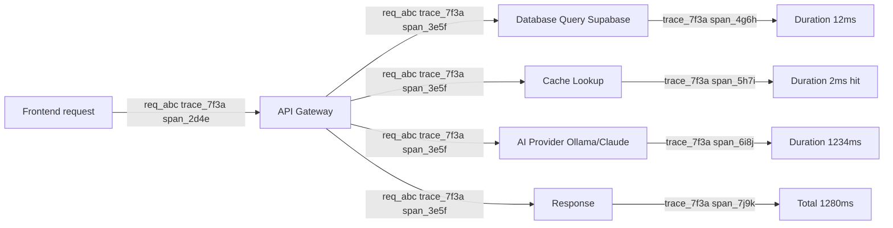

# Observability

## Document Control

| Metadata | Value |
|----------|-------|
| **Document ID** | OPS-031 |
| **Version** | 2.0 |
| **Status** | Approved |
| **Classification** | Internal — Operations |
| **Owner** | SRE / Platform Engineering |
| **Last Updated** | 2026-06-11 |
| **Review Cycle** | Quarterly |
| **Next Review** | 2026-09-11 |
| **Approved By** | CTO / Tech Lead |

---

## Executive Summary

### Purpose
This document defines the enterprise observability strategy for Second Brain OS. It specifies how we collect, store, visualize, and act on telemetry data (logs, metrics, traces) across all system components to ensure reliability, performance, and rapid incident response.

### Scope
Covers all production services: Next.js frontend, FastAPI backend, Supabase database, Supabase Edge Functions, AI agents (Ollama / Claude), APScheduler, notification services (Web Push / Resend / Twilio), and integration points. Excludes infrastructure-level observability (Docker, Kubernetes) which is covered in DevOps runbooks.

### The Golden Signals

Every observability investment is measured against these four indicators:

| Signal | Definition | Current Baseline | Target |
|--------|------------|-----------------|--------|
| **Latency** | Time to serve a request or process a job | p95 < 500ms (API), p95 < 30s (cron) | p95 < 300ms API, p95 < 20s cron |
| **Traffic** | Volume of requests/events flowing through the system | ~10K requests/day | Scalable to 2x without degradation |
| **Errors** | Rate of failed requests or operations | < 1% error rate | < 0.5% error rate |
| **Saturation** | How "full" the system is (resource utilization) | DB ~40%, memory ~50% | < 80% on all resources |

### Strategic Approach
We use a **batteries-included but vendor-light** approach — leveraging Supabase, PostgreSQL, and file-based storage for most observability needs, with minimal dependency on external SaaS tools. This keeps costs predictable while providing sufficient visibility for a solo engineering team.

---

## Three Pillars of Observability

### Pillar 1: Logging
Detailed, structured records of discrete events. Logs answer: *"What happened?"*

- **Primary focus**: Request/response logging, error tracking, audit trails
- **Storage**: Rotating files (scheduler) + Supabase table (API errors) + browser console (frontend)
- **Retention**: 7 days dev, 30 days staging, 90 days production

### Pillar 2: Metrics
Numerical representations of system state over time. Metrics answer: *"What is happening right now?"*

- **Primary focus**: Request rates, latencies, error rates, resource utilization
- **Storage**: In-memory counters with periodic snapshot to Supabase
- **Granularity**: 1-minute resolution for real-time, 1-hour resolution for trends

### Pillar 3: Tracing
End-to-end tracking of a single request across service boundaries. Traces answer: *"Why did it happen?"*

- **Primary focus**: Request correlation across frontend → API → DB → AI
- **Storage**: Correlation IDs in log entries; trace context propagated via headers
- **Standard**: W3C Trace Context (traceparent header)

---

## Logging Strategy

### Structured JSON Logs
Every log entry is a single-line JSON object written to stdout (app) or files (scheduler).

```json
{
  "timestamp": "2026-06-11T09:15:30.123Z",
  "level": "INFO",
  "service": "api",
  "message": "API Request",
  "endpoint": "/api/tasks",
  "method": "GET",
  "user_id": "usr_abc123",
  "duration_ms": 45.2,
  "status_code": 200,
  "request_id": "req_xyz789",
  "trace_id": "trace_7f3a1b9c",
  "span_id": "span_2d4e6f8a"
}
```

### Log Levels

| Level | Usage | Example |
|-------|-------|---------|
| DEBUG | Development details | SQL queries, variable dumps |
| INFO | Normal operations | Request/response, cron runs |
| WARN | Degraded but handled | Rate limit approaching, retry attempt |
| ERROR | Operation failed | DB error, API timeout, exception |
| CRITICAL | System unavailable | Auth service down, DB connection lost |

### Per-Service Logging

**API Service** (`apps/api/main.py`)
```python
# Structured logging via logger.py
from shared.utils.logger import logger, log_request, log_response, log_error

@app.middleware("http")
async def log_requests(request: Request, call_next):
    log_request(request.url.path, request.method, user_id=getattr(request, "user_id", None))
    start = time.time()
    response = await call_next(request)
    duration = (time.time() - start) * 1000
    log_response(request.url.path, request.method, response.status_code, duration)
    return response
```

**Scheduler** (`services/scheduler/`)
```python
# Scheduler logs to both stdout and rotating files
import logging, logging.handlers

handler = logging.handlers.RotatingFileHandler(
    "logs/scheduler.log", maxBytes=10*1024*1024, backupCount=5
)
logging.basicConfig(
    level=logging.INFO,
    format='{"timestamp":"%(asctime)s","level":"%(levelname)s","service":"scheduler","message":"%(message)s"}',
    handlers=[handler, logging.StreamHandler()],
)
```

**Frontend** (Browser console + Supabase errors)
```typescript
// apps/web/lib/observability.ts
export class FrontendLogger {
  log(level: string, message: string, meta?: Record<string, any>) {
    const entry = {
      timestamp: new Date().toISOString(),
      level,
      service: 'frontend',
      message,
      url: window.location.href,
      user_agent: navigator.userAgent.substring(0, 100),
      ...meta,
    }
    // Console for development
    if (process.env.NODE_ENV === 'development') {
      console[level === 'ERROR' ? 'error' : level === 'WARN' ? 'warn' : 'log'](JSON.stringify(entry, null, 2))
    }
    // Send errors to backend
    if (['ERROR', 'CRITICAL'].includes(level)) {
      fetch('/api/logs/frontend', {
        method: 'POST',
        headers: { 'Content-Type': 'application/json' },
        body: JSON.stringify(entry),
        keepalive: true,
      }).catch(() => {})
    }
  }
}

export const frontendLogger = new FrontendLogger()
```

### Log Retention

| Environment | Retention | Storage | Volume Estimate |
|-------------|-----------|---------|-----------------|
| Development | 7 days | Local files | ~50 MB/day |
| Staging | 30 days | Supabase logs table | ~100 MB/day |
| Production | 90 days | Rotating files + Supabase | ~200 MB/day |

### Log Pipeline Architecture

```mermaid
graph TD
    App[Application stdout] --> RotFile[Rotating File local]
    App --> ErrLevel[Error-level]
    ErrLevel --> SupaLogs[Supabase logs table]
    ErrLevel --> Alert[Alert evaluation]
    ErrLevel --> Future[(Future) Log aggregation dashboard]
    FE[Frontend errors] --> POST[POST /api/logs/frontend]
    POST --> SupaLogs
```

---

## Distributed Tracing

### Trace Context Propagation

The system uses W3C Trace Context (`traceparent` header) for distributed tracing:



### Tracing Middleware

```python
# apps/api/middleware/tracing.py
import uuid
from starlette.middleware.base import BaseHTTPMiddleware

class TracingMiddleware(BaseHTTPMiddleware):
    async def dispatch(self, request, call_next):
        # Extract or create trace context
        traceparent = request.headers.get("traceparent")
        if traceparent:
            # W3C Trace Context format: "00-traceid-spanid-01"
            parts = traceparent.split("-")
            trace_id = parts[1] if len(parts) > 1 else str(uuid.uuid4().hex[:32])
        else:
            trace_id = uuid.uuid4().hex[:32]

        span_id = uuid.uuid4().hex[:16]
        request.state.request_id = request.headers.get("X-Request-ID", str(uuid.uuid4()))
        request.state.trace_id = trace_id
        request.state.span_id = span_id

        response = await call_next(request)
        response.headers["X-Request-ID"] = request.state.request_id
        response.headers["traceparent"] = f"00-{trace_id}-{span_id}-01"
        return response
```

### Trace Correlation in Logs

Every log entry includes:
- `request_id`: Links all log entries for a single HTTP request
- `trace_id`: Links log entries across all services for a single user operation
- `span_id`: Identifies the specific service/component within the trace
- `session_id`: Links log entries across multiple requests in the same user session

### OpenTelemetry Strategy

**(Future — Phase 2)**

| Component | OTLP Exporter | Status |
|-----------|---------------|--------|
| FastAPI | OpenTelemetry FastAPI Instrumentation | Planned |
| Supabase | Manual span creation | Planned |
| Edge Functions | OpenTelemetry JS SDK | Planned |
| Frontend | OpenTelemetry Web SDK | Planned |

---

## Metrics Pipeline

### Metric Types

| Type | Description | Use Case | Example |
|------|-------------|----------|---------|
| **Counter** | Monotonically increasing value | Counting events | Total requests, total errors |
| **Gauge** | Value that can go up or down | Current state | Active users, connection count |
| **Histogram** | Distribution of values over time | Latency measurements | p50/p95/p99 response time |

### API Metrics

```
requests_total                # counter - total API requests
requests_per_second          # gauge - current throughput
p50_response_time_ms         # histogram
p95_response_time_ms         # histogram
p99_response_time_ms         # histogram
error_rate                   # gauge - % of requests with 5xx
error_total_by_code          # counter - per status code (400, 401, 403, 500)
active_users_5min            # gauge - unique user IDs in last 5min
rate_limit_hits              # counter - 429 responses
request_size_bytes           # histogram - request payload size
```

### Database Metrics

```
db_connection_count          # gauge
db_query_p50_ms              # histogram
db_query_p95_ms              # histogram
db_error_rate                # gauge
db_cache_hit_ratio           # gauge - cache.get_or_set success rate
active_tables_row_count      # gauge - row count per table (hourly)
db_storage_bytes             # gauge - total database size
db_connection_pool_usage     # gauge - % of pool in use
```

### Scheduler Metrics

```
cron_run_duration_seconds   # gauge - per cron job
cron_success_rate           # gauge - last 10 runs
cron_total_runs             # counter
cron_failures               # counter
users_processed_per_cron    # gauge
cron_queue_depth            # gauge - pending jobs
cron_last_run_timestamp     # gauge - Unix timestamp of last run (per job)
```

### AI/LLM Metrics

```
ai_requests_total            # counter
ai_tokens_input_total        # counter
ai_tokens_output_total       # counter
ai_response_time_ms          # histogram
ai_fallback_rate             # gauge - Ollama vs Claude usage %
ai_error_rate                # gauge
ai_cost_estimate_usd        # gauge - running total
ai_model_availability        # gauge - 1 = available, 0 = down (per model)
ai_cache_hit_rate            # gauge - response cache hit %
```

### Frontend Performance Metrics

```
page_load_time_ms            # histogram - per route
js_error_rate                # gauge
api_call_latency_ms          # histogram - per endpoint
first_contentful_paint_ms    # histogram
largest_contentful_paint_ms  # histogram
cumulative_layout_shift      # histogram
time_to_interactive_ms       # histogram
```

### Metrics Storage

```sql
CREATE TABLE metrics_snapshots (
  id UUID PRIMARY KEY DEFAULT gen_random_uuid(),
  service TEXT NOT NULL,
  metric_name TEXT NOT NULL,
  metric_type TEXT NOT NULL, -- 'counter', 'gauge', 'histogram'
  value DOUBLE PRECISION NOT NULL,
  labels JSONB DEFAULT '{}',
  timestamp TIMESTAMPTZ DEFAULT NOW()
);

CREATE INDEX idx_metrics_service_name ON metrics_snapshots(service, metric_name);
CREATE INDEX idx_metrics_timestamp ON metrics_snapshots(timestamp DESC);

-- Aggregated hourly metrics for dashboards
CREATE TABLE metrics_hourly (
  id UUID PRIMARY KEY DEFAULT gen_random_uuid(),
  service TEXT NOT NULL,
  metric_name TEXT NOT NULL,
  p50 DOUBLE PRECISION,
  p95 DOUBLE PRECISION,
  p99 DOUBLE PRECISION,
  avg DOUBLE PRECISION,
  min DOUBLE PRECISION,
  max DOUBLE PRECISION,
  count INTEGER,
  hour_bucket TIMESTAMPTZ NOT NULL
);
```

---

## Logging Implementation

### Current Logger (already implemented in `packages/shared/utils/logger.py`)

```python
logger = Logger("second-brain-os")

# Usage
logger.info("Task created", task_id=task.id, priority=task.priority)
logger.warn("Rate limit approaching", client_ip=masked_ip, current_count=85)
logger.error("Database operation failed", error=exc, table="tasks", operation="insert")
```

### Enhanced Logger (proposed additions to logger.py)

```python
class EnhancedLogger(Logger):
    def __init__(self, service_name: str, log_dir: str = "logs"):
        super().__init__(service_name)
        self.service_name = service_name
        self.session_id = str(uuid.uuid4())

        # File handler for persistent logs
        os.makedirs(log_dir, exist_ok=True)
        file_handler = logging.handlers.RotatingFileHandler(
            f"{log_dir}/{service_name}.log",
            maxBytes=50 * 1024 * 1024,  # 50MB
            backupCount=10,
        )
        file_handler.setFormatter(logging.Formatter("%(message)s"))
        self.logger.addHandler(file_handler)

        # Context propagation
        self._context: Dict[str, Any] = {}

    def set_context(self, **kwargs):
        self._context.update(kwargs)

    def _log(self, level: str, message: str, **kwargs):
        entry = {
            "timestamp": datetime.utcnow().isoformat() + "Z",
            "level": level,
            "service": self.service_name,
            "session_id": self.session_id,
            "message": message,
            **self._context,
            **kwargs,
        }
        self.logger.info(json.dumps(entry, default=str))
```

---

## Dashboards

### Dashboard 1: System Health (Real-time)

```
Panel: API Response Times           — line chart, p50/p95/p99 over 1h
Panel: Error Rate                   — line chart, by status code over 1h
Panel: Active Users                 — gauge, last 5min
Panel: DB Performance               — line chart, query times over 1h
Panel: DB Connection Pool           — gauge, usage %
Panel: Cron Status                  — status table, last run per cron
Panel: AI Usage                     — gauge, tokens used today
Panel: AI Cost                      — area chart, estimated daily cost
Panel: Cache Hit Rate               — gauge, %
Panel: Memory Usage (API)           — gauge, RSS / limit
```

### Dashboard 2: User Analytics (Daily)

```
Panel: DAU/MAU                      — bar chart, daily active users
Panel: Feature Adoption             — heatmap, modules used per day
Panel: Task Completion              — line chart, created vs completed
Panel: Scheduler Runs               — table, last 24h cron executions
Panel: Top Errors                   — table, most frequent errors
Panel: Session Duration             — histogram, average session length
Panel: Page Load Times              — line chart, by route
Panel: New Registrations            — line chart, daily signups
```

### Dashboard 3: Cost & Capacity (Weekly)

```
Panel: AI Cost Estimate             — area chart, daily cost in USD
Panel: API Cost by Endpoint         — bar chart, most expensive endpoints
Panel: Storage Usage                — gauge, DB size / 500MB limit
Panel: Bandwidth Usage              — gauge, Vercel bandwidth / 100GB
Panel: Email Usage                  — gauge, emails sent / 3000 limit
Panel: Token Usage by Model         — stacked area, Claude vs Ollama
Panel: Rate Limit Hits              — bar chart, by endpoint
Panel: Growth Trends                — line chart, week-over-week growth
```

### Dashboard 4: Event Pipeline (Real-time)

```
Panel: Event Throughput             — line chart, events/sec by category
Panel: Event Success Rate           — gauge, %
Panel: Failed Events by Type        — bar chart, top 10
Panel: DLQ Size                     — gauge, current count
Panel: Event Latency (p50/p95)      — line chart
Panel: Active Retries               — gauge
Panel: Event Volume by Hour         — heatmap, 7-day view
Panel: Top Error Sources            — bar chart, by source component
```

---

## Alerting Rules

### Critical Alerts (Pager/Email — within 15 min)

| Rule ID | Metric | Condition | Severity | Notification | Description |
|---------|--------|-----------|----------|--------------|-------------|
| ALR-001 | API 5xx Rate | 5xx rate > 10% in 5 min | Critical | Email + SMS | API service may be down |
| ALR-002 | DB Connection | > 5 consecutive failures | Critical | Email + SMS | Database unreachable |
| ALR-003 | Auth Failures | 401 rate > 50% in 5 min | Critical | Email | Possible auth attack or misconfig |
| ALR-004 | Memory Threshold | > 85% RAM usage | Critical | Email | Risk of OOM kill |
| ALR-005 | Cron Failure | > 3 consecutive failures | Critical | Email + SMS | Scheduler may be stuck |
| ALR-006 | Event Failure Rate | > 5% in 5 min | Critical | Email + SMS | Event pipeline degradation |
| ALR-007 | DLQ Accumulation | > 10 events in DLQ | Critical | Email + SMS | Events failing permanently |
| ALR-008 | Data Loss Signal | Unexpected DELETE pattern | Critical | Email + SMS | Potential data integrity issue |

### Warning Alerts (Email — within 1 hour)

| Rule ID | Metric | Condition | Severity | Notification | Description |
|---------|--------|-----------|----------|--------------|-------------|
| ALR-101 | Response Time | p95 > 1s sustained 10 min | Warning | Email | Latency degradation |
| ALR-102 | Error Rate | Error rate > 5% in 10 min | Warning | Email | Elevated but not critical |
| ALR-103 | Rate Limit Hits | > 20 rate limit hits in 5 min | Warning | Email | Possible abuse or misconfiguration |
| ALR-104 | AI Fallback Rate | Ollama fallback > 50% | Warning | Email | Local AI may be degraded |
| ALR-105 | Cache Hit Ratio | < 50% cache hit rate | Warning | Email | Cache inefficiency |
| ALR-106 | Cost Threshold | > 80% of monthly budget | Warning | Email | Cost approaching limit |
| ALR-107 | Storage Threshold | > 80% of DB limit | Warning | Email | Storage approaching limit |
| ALR-108 | Retry Storm | > 50 events retrying | Warning | Email | Possible systemic failure |

### Informational Alerts (Log — daily digest)

| Rule ID | Metric | Condition | Severity | Notification | Description |
|---------|--------|-----------|----------|--------------|-------------|
| ALR-201 | New Users | Daily signup count | Info | Daily digest | Growth tracking |
| ALR-202 | Feature Adoption | Module usage changes | Info | Weekly report | Product insights |
| ALR-203 | Cost Estimate | Token usage trends | Info | Weekly email | Budget planning |
| ALR-204 | Active Users | DAU/MAU changes | Info | Weekly report | Engagement trends |

### Alert Deduplication and Grouping

- Alerts are grouped by `service` and `alert_rule_id` within a 1-hour sliding window
- Only one notification per group per hour (prevent notification fatigue)
- Auto-resolve if condition clears for 15+ consecutive minutes
- Escalate if condition persists beyond 1 hour without acknowledgement

---

## Implemented vs Planned

| Component | Status | File |
|-----------|--------|------|
| Structured JSON logger | Implemented | `packages/shared/utils/logger.py` |
| API request/response logging | Implemented | `packages/shared/utils/logger.py` |
| Error logging | Implemented | `packages/shared/utils/logger.py` |
| Request tracing middleware | Implemented | `apps/api/middleware/tracing.py` |
| Frontend error logging | Proposed | `apps/web/lib/observability.ts` |
| Frontend performance metrics | Proposed | Web Vitals API |
| Dashboard visualization | Proposed | Analytics page |
| Alerting system | Proposed | Cron-based alert evaluator |
| Log retention/purge cron | Proposed | `services/scheduler/crons/log_purge.py` |
| Daily metrics aggregation | Proposed | `services/scheduler/crons/daily_metrics.py` |
| W3C Trace Context propagation | Not started | API middleware upgrade |
| OpenTelemetry integration | Not started | Phase 2 |
| Metrics snapshot table + cron | Not started | Metrics pipeline |
| Alert deduplication engine | Not started | Alert manager |

---

## Observability Maturity Model

### Level 1: Basic (Current State)
- Structured JSON logging per service
- Basic request tracing (request_id)
- Manual log inspection via `tail` and `grep`
- Static dashboards in documentation
- React to incidents after they happen

### Level 2: Reactive (Target — Q3 2026)
- Automated log aggregation to searchable store
- Correlation IDs across all services
- Basic alerting on known failure modes
- Metrics snapshots to database
- Dashboard with real-time data (not static)

### Level 3: Proactive (Target — Q4 2026)
- Alerting with auto-escalation
- Distributed tracing (W3C Trace Context)
- Service-level dashboards for all components
- Trending and anomaly detection
- Proactive capacity planning

### Level 4: Predictive (Target — Q1 2027)
- ML-based anomaly detection in metrics
- Automated root cause suggestions
- Pre-deployment run analysis
- Cost optimization recommendations
- User-experience-level SLO tracking

### Level 5: Autonomous (Target — Q2 2027)
- Self-healing (auto-rollback, auto-scale)
- Automated incident remediation
- Predictive capacity scaling
- Full OpenTelemetry adoption with vendor-neutral export

---

## Cost of Observability

### Storage Estimates

| Data Type | Daily Volume (Production) | Monthly Volume | Retention | Monthly Cost |
|-----------|--------------------------|----------------|-----------|--------------|
| Application logs | ~200 MB | ~6 GB | 90 days | ~$0.60 (Supabase) |
| Error logs (Supabase) | ~10 MB | ~300 MB | 90 days | ~$0.03 (included) |
| Metrics snapshots (1-min) | ~50 MB | ~1.5 GB | 90 days | ~$0.15 (Supabase) |
| Trace context (in logs) | Included in logs | — | — | — |
| Frontend error logs | ~5 MB | ~150 MB | 30 days | ~$0.02 (included) |
| **Total** | **~265 MB** | **~7.95 GB** | — | **~$0.80/month** |

### Cost Optimization Strategies

1. **Log sampling**: DEBUG logs at 1:100 sample rate in production
2. **Metrics aggregation**: 1-min raw → 1-hour aggregated (keep raw 7 days, hourly 90 days)
3. **Retention tiers**: Critical errors kept 90 days, INFO logs 30 days, DEBUG logs 7 days
4. **Supabase usage**: Leverage included storage (500MB free) — stay within free tier
5. **Cardinality control**: Limit label cardinality to < 100 unique values per metric

### Cardinality Guidelines

| Metric Label | Max Unique Values | Guidance |
|-------------|-------------------|----------|
| `endpoint` | 50 | Keep paths normalized, strip IDs |
| `user_id` | DO NOT USE | Will explode cardinality — use `user_id_hash` instead |
| `status_code` | 10 | Group by category (2xx/4xx/5xx) if needed |
| `error_type` | 20 | Normalize error messages to types |
| `table_name` | 20 | Fixed set of tables |

---

## Implementation Roadmap

### Phase 1: Foundation (Current — Q3 2026)
- [x] Structured JSON logging
- [x] API request/response logging
- [x] Request tracing middleware
- [ ] Frontend error logging → `/api/logs/frontend`
- [ ] Log retention/purge cron job
- [ ] Metrics snapshot table and cron

### Phase 2: Dashboards & Alerting (Q3 2026)
- [ ] Real-time System Health dashboard
- [ ] User Analytics dashboard
- [ ] Cost & Capacity dashboard
- [ ] Event Pipeline dashboard
- [ ] Alert rule evaluation engine
- [ ] Alert notification dispatch (email/SMS)

### Phase 3: Tracing & Optimization (Q4 2026)
- [ ] W3C Trace Context propagation
- [ ] OpenTelemetry FastAPI instrumentation
- [ ] Span-level timing for AI calls
- [ ] Frontend performance metrics (Web Vitals)
- [ ] Alert deduplication
- [ ] Cost optimization (log sampling, aggregation)

---

## Appendices

### Appendix A: Complete Alert Rules Reference

| Rule ID | Name | Metric | Condition | Window | Severity | Channel | Auto-Resolve |
|---------|------|--------|-----------|--------|----------|---------|--------------|
| ALR-001 | API Down | 5xx rate | > 10% | 5 min | Critical | SMS+Email | Yes (15 min) |
| ALR-002 | DB Connection Lost | db_errors | > 5 consecutive | Immediate | Critical | SMS+Email | No |
| ALR-003 | Auth Spike | 401 rate | > 50% | 5 min | Critical | Email | Yes (15 min) |
| ALR-004 | High Memory | memory_usage | > 85% | 1 min | Critical | Email | Yes (15 min) |
| ALR-005 | Cron Failure | cron_failures | > 3 consecutive | Per cron | Critical | SMS+Email | No |
| ALR-006 | Event Failure | event_fail_rate | > 5% | 5 min | Critical | SMS+Email | Yes (15 min) |
| ALR-007 | DLQ Full | dlq_count | > 10 | Immediate | Critical | SMS+Email | No |
| ALR-008 | Data Integrity | delete_rate | > 100/min | 5 min | Critical | SMS+Email | No |
| ALR-101 | Slow API | p95_latency | > 1s | 10 min | Warning | Email | Yes (30 min) |
| ALR-102 | Elevated Errors | error_rate | > 5% | 10 min | Warning | Email | Yes (30 min) |
| ALR-103 | Rate Limited | rate_limit_hits | > 20 | 5 min | Warning | Email | Yes (30 min) |
| ALR-104 | AI Fallback | fallback_rate | > 50% | 10 min | Warning | Email | Yes (1 hr) |
| ALR-105 | Cache Miss | cache_hit_ratio | < 50% | 10 min | Warning | Email | Yes (1 hr) |
| ALR-106 | Cost Warning | cost_estimate | > 80% budget | Daily | Warning | Email | No |
| ALR-107 | Storage Warning | storage_used | > 80% limit | Daily | Warning | Email | No |
| ALR-108 | Retry Storm | retry_count | > 50 | 5 min | Warning | Email | Yes (30 min) |

### Appendix B: Dashboard Panel Specifications

**B.1 System Health Dashboard**

```json
{
  "dashboard": "System Health",
  "refresh_interval": "30s",
  "panels": [
    {
      "title": "API Response Times",
      "type": "timeseries",
      "metrics": ["p50_response_time_ms", "p95_response_time_ms", "p99_response_time_ms"],
      "unit": "ms",
      "window": "1h"
    },
    {
      "title": "Error Rate",
      "type": "timeseries",
      "metrics": ["error_rate"],
      "unit": "%",
      "window": "1h",
      "threshold": 5
    },
    {
      "title": "Active Users",
      "type": "gauge",
      "metrics": ["active_users_5min"],
      "unit": "users",
      "thresholds": {"warning": 50, "critical": 100}
    },
    {
      "title": "DB Performance",
      "type": "timeseries",
      "metrics": ["db_query_p50_ms", "db_query_p95_ms"],
      "unit": "ms",
      "window": "1h"
    },
    {
      "title": "DB Connection Pool",
      "type": "gauge",
      "metrics": ["db_connection_pool_usage"],
      "unit": "%",
      "thresholds": {"warning": 70, "critical": 85}
    },
    {
      "title": "Cron Status",
      "type": "table",
      "metrics": ["cron_last_run_timestamp", "cron_success_rate"],
      "columns": ["Job", "Last Run", "Duration", "Success Rate"]
    },
    {
      "title": "AI Usage Today",
      "type": "gauge",
      "metrics": ["ai_tokens_input_total", "ai_tokens_output_total"],
      "unit": "tokens"
    },
    {
      "title": "AI Cost Today",
      "type": "area",
      "metrics": ["ai_cost_estimate_usd"],
      "unit": "USD",
      "window": "24h"
    }
  ]
}
```

### Appendix C: Maturity Model Self-Assessment

| Dimension | Current Level | Target Level | Gap | Effort |
|-----------|--------------|--------------|-----|--------|
| Logging | L2 (Structured) | L3 (Searchable) | Log aggregation DB | Low |
| Metrics | L1 (Manual) | L2 (Automated) | Metrics cron + storage | Medium |
| Tracing | L1 (Request ID) | L2 (Trace Context) | W3C propagation | Medium |
| Alerting | L1 (Manual) | L2 (Basic rules) | Alert evaluator engine | Medium |
| Dashboards | L1 (Static doc) | L3 (Real-time) | Dashboard frontend | High |
| ML/Anomaly | L1 (None) | L1 (None) | Future phase | Future |

### Appendix D: Key Commands Reference

```bash
# View real-time API logs
tail -f logs/api.log | jq 'select(.level == "ERROR")'

# View scheduler logs for specific cron
grep "daily-briefing" logs/scheduler.log | tail -20

# Check metrics snapshot
curl -s http://localhost:8000/api/observability/metrics

# Test alert rule
curl -s http://localhost:8000/api/observability/alerts/test/ALR-001

# View trace for a specific request
grep "req_abc123" logs/api.log | jq '{request_id, trace_id, span_id, duration_ms, endpoint}'

# Check frontend error rate (last 24h)
curl -s http://localhost:8000/api/logs/frontend/stats?period=24h
```

### Appendix E: Glossary

| Term | Definition |
|------|------------|
| **Cardinality** | Number of unique combinations of label values in a metric — high cardinality causes performance issues |
| **Golden Signals** | The four key metrics for monitoring: latency, traffic, errors, saturation |
| **OTLP** | OpenTelemetry Protocol — standard for exporting telemetry data |
| **Span** | A named, timed operation representing a unit of work in a trace |
| **Trace** | A tree of spans showing the path of a request through distributed services |
| **W3C Trace Context** | Standard HTTP headers (`traceparent`, `tracestate`) for propagating trace context |
| **p50/p95/p99** | Percentile latency measurements — 50th, 95th, and 99th percentile |
| **SLI** | Service Level Indicator — a specific metric measuring a aspect of reliability |
| **SLO** | Service Level Objective — a target value for an SLI |
| **SLA** | Service Level Agreement — a contractual commitment to meet SLOs |

### Appendix F: Revision History

| Version | Date | Author | Summary of Changes |
|---------|------|--------|-------------------|
| 1.0 | 2026-01-15 | Platform Engineering | Initial observability document |
| 1.1 | 2026-03-01 | Platform Engineering | Added Enhanced Logger and tracing sections |
| 2.0 | 2026-06-11 | Platform Engineering | Full enterprise upgrade: executive summary with golden signals, three pillars of observability specification, distributed tracing with W3C Trace Context, metrics pipeline with counters/histograms/gauges per service, 4 real-time dashboard specifications with panel-level detail, comprehensive alerting rules with IDs/thresholds/channels, observability maturity model (Level 1-5), cost of observability with storage estimates and cardinality guidelines, appendices with complete alert reference, dashboard JSON spec, maturity self-assessment, and glossary |
