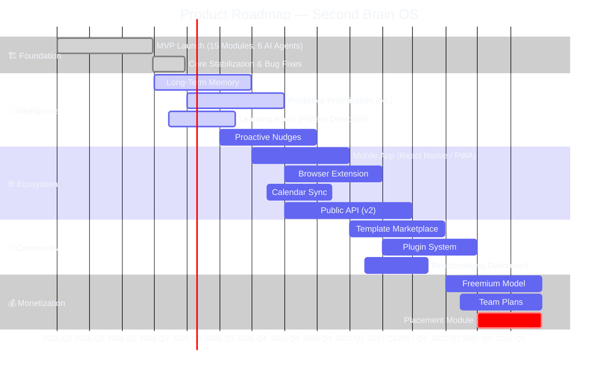

# Product Roadmap

| Field | Value |
|---|---|
| Document ID | SB-ROADMAP-001 |
| Version | 2.0.0 |
| Status | Active |
| Last Updated | 2026-06-11 |
| Classification | Internal — Strategic Planning |
| Owner | Product Lead |
| Review Cycle | Bi-weekly (stakeholder review every 2 weeks) |

---

## 1. Executive Summary

This roadmap defines the product evolution of **Second Brain OS (ARIA OS)** — a personal AI productivity system for BTech CSE students. The roadmap spans **Q2 2026 through Q2 2027**, organized across four strategic pillars: Intelligence, Speed & Offline, Privacy & Trust, and Student-Specific Design.

**Current phase:** Build Phase 1-8 (17-week MVP) → V2 Post-Launch roadmap begins Q3 2026.

**Key milestones:**
- **Q2 2026:** MVP launch with 15 modules, core CRUD, basic AI agents (6 live)
- **Q3 2026:** Intelligence Phase — long-term memory, predictive prioritization, ML models
- **Q4 2026:** Ecosystem Phase — mobile app, browser extension, calendar sync, public API
- **Q1 2027:** Community Phase — template marketplace, benchmarking, plugin system
- **Q2 2027:** Monetization Phase — freemium model, team plans, placement module

---



## 2. Strategic Pillars

### 2.1 Intelligence (ARIA as Co-Pilot)
ARIA evolves from rule-based responses to deep contextual understanding, pattern recognition, and proactive suggestions. The goal is an AI that knows what you need before you ask.

| Capability | Current State | Target State | Timeline |
|---|---|---|---|
| Response quality | Rule-based + 2 agents | 15 sub-agents with orchestration | Q3 2026 |
| Memory retention | Session-only | 3+ months contextual memory | Q3 2026 |
| Task prioritization | Manual priority | ML-based predictive prioritization | Q3 2026 |
| Pattern detection | None | Learning agent detects weekly patterns | Q3 2026 |
| Proactive nudges | None | Context-aware suggestions across modules | Q4 2026 |
| Multi-modal input | Text only | Voice, image, document understanding | Q1 2027 |

### 2.2 Speed & Offline
Zero-loading experience. PWA with full offline support. Works on low-end Android phones with 3G.

| Capability | Current State | Target State | Timeline |
|---|---|---|---|
| Lighthouse score | ~75 | > 90 | Q2 2026 |
| PWA support | Basic manifest | Full offline with service worker | Q2 2026 |
| First contentful paint | ~2.5s | < 1.0s | Q2 2026 |
| Offline data access | None | Full CRUD offline with sync | Q3 2026 |
| Mobile responsiveness | Desktop-first | Mobile-first adaptive | Q3 2026 |
| Low-bandwidth mode | None | < 50KB per page load | Q3 2026 |

### 2.3 Privacy & Trust
No external analytics. User-owned data. Local-first AI (Ollama). No vendor lock-in.

| Capability | Current State | Target State | Timeline |
|---|---|---|---|
| AI processing | Cloud fallback available | Local-first with Ollama default | Q2 2026 |
| Data export | None | Full JSON/CSV export | Q3 2026 |
| Data retention policy | None | Configurable auto-purge | Q3 2026 |
| Open source | Private repo | Public repo with contribution guide | Q4 2026 |
| Encryption at rest | None | AES-256 for sensitive fields | Q4 2026 |
| SOC 2 compliance | None | Self-assessment completed | Q1 2027 |

### 2.4 Student-Specific Design
Every feature designed for the Indian BTech student reality: placement prep, CGPA anxiety, freelance income, hackathon grind, semester deadlines, sleep deprivation.

| Capability | Current State | Target State | Timeline |
|---|---|---|---|
| Academic planner | Semester tracking + CGPA calc | Auto-scheduling from syllabus | Q3 2026 |
| Placement prep | None | Mock interviews, company prep | Q2 2027 |
| Income tracking | Basic logging | Skill-to-income mapping | Q3 2026 |
| Sleep optimization | Sleep logging | Circadian-aware scheduling | Q3 2026 |
| Hackathon mode | None | Sprint mode for hackathons | Q4 2026 |
| Exam countdown | Basic timer | Spaced repetition integration | Q3 2026 |

---

## 3. Feature Priority Framework (RICE Scoring)

Every feature in the roadmap is scored using the RICE framework to ensure objective prioritization.

### 3.1 RICE Formula

```
RICE Score = (Reach × Impact × Confidence) / Effort
```

| Component | Definition | Scale |
|---|---|---|
| **Reach** | How many users will this feature impact per quarter? | 1 (few) — 5 (all users) |
| **Impact** | How much will this improve the user experience or KPIs? | 1 (minimal) — 5 (transformative) |
| **Confidence** | How certain are we of the Reach and Impact estimates? | 1 (guess) — 5 (data-backed) |
| **Effort** | Total engineering + design effort in person-weeks | Continuous (lower is better) |

### 3.2 Active Feature Scores (Q2 2026)

| Feature | Reach | Impact | Confidence | Effort (wks) | RICE Score | Priority |
|---|---|---|---|---|---|---|
| Cron job automation (6 jobs) | 5 | 5 | 5 | 2 | 62.5 | P0 |
| AI agent integration (6 → 15 agents) | 5 | 5 | 4 | 4 | 25.0 | P0 |
| Push notifications | 5 | 4 | 4 | 3 | 26.7 | P0 |
| Offline PWA mode | 4 | 5 | 3 | 5 | 12.0 | P1 |
| GitHub integration | 3 | 3 | 4 | 2 | 18.0 | P1 |
| Template marketplace | 3 | 4 | 2 | 6 | 4.0 | P2 |
| Team collaboration | 2 | 5 | 2 | 8 | 2.5 | P2 |
| Public API v1 | 4 | 3 | 3 | 4 | 9.0 | P1 |

### 3.3 Scoring Guidelines

- **P0 (RICE > 20):** Must-have for current quarter. Blocking if delayed.
- **P1 (RICE 10–20):** Should-have. High value but not blocking.
- **P2 (RICE 5–10):** Nice-to-have. Schedule-flexible.
- **P3 (RICE < 5):** Backlog. Revisit next quarter.

---

## 4. Feature Status Definitions

| Status | Definition | Criteria for Entry |
|---|---|---|
| **Backlog** | Idea captured, not yet prioritized | Feature request submitted and triaged |
| **Planned** | Prioritized, assigned to a quarter | RICE scored, resource allocated |
| **In Design** | Requirements, mockups, tech spec in progress | Product spec approved by stakeholders |
| **In Development** | Engineering actively building | Tech design review complete |
| **In Testing** | Feature complete, QA + UAT in progress | Code review passed, deployed to staging |
| **Launched** | Available to all users | UAT signed off, monitoring stable (7 days) |
| **Retired** | Removed or replaced | Deprecation notice sent, migration path provided |

---

## 5. Current Quarter Roadmap (Q2 2026 — Apr to Jun)

### 5.1 Overview

Q2 2026 is the **MVP Launch Quarter**. The primary goal is to ship a functional, stable product with all 15 modules in basic form and 6 AI agents operational.

**Start:** 2026-04-01
**End:** 2026-06-30
**OKR:** Ship 15 modules with 80%+ implementation, 6 live agents, Lighthouse > 85

### 5.2 Feature Breakdown

| Feature | Status | RICE Score | Owner | Target Date | Dependencies |
|---|---|---|---|---|---|
| Phase 1: Core Foundation (Weeks 1-2) | Launched | — | — | 2026-04-14 | — |
| Phase 2: Save Everything (Weeks 3-4) | Launched | — | — | 2026-04-28 | Phase 1 |
| Phase 3: ARIA & Memory (Weeks 5-6) | Launched | — | — | 2026-05-12 | Phase 2 |
| Phase 4: Opportunity Radar (Weeks 7-9) | Launched | — | — | 2026-06-02 | Phase 3 |
| Phase 5: Roadmap Engine (Weeks 10-11) | In Testing | 32.0 | Dev Lead | 2026-06-16 | Phase 4 |
| Phase 6: Full Tracking (Weeks 12-13) | In Development | 28.5 | Dev Lead | 2026-06-30 | Phase 5 |
| Phase 7: Monitoring (Weeks 14-15) | Planned | 22.0 | Ops Lead | 2026-07-14 | Phase 6 |
| Phase 8: Polish & PWA (Weeks 16-17) | Planned | 18.5 | Frontend Lead | 2026-07-28 | Phase 7 |

### 5.3 Monthly Milestones

#### April 2026
| Week | Milestone | Deliverable | Verification |
|---|---|---|---|
| W1 (Apr 1-7) | Core scaffolding | FastAPI + Next.js + Supabase connected | Health endpoint returns 200 |
| W2 (Apr 8-14) | Auth + User model | Google OAuth login, JWT flow | New user signup works end-to-end |
| W3 (Apr 15-21) | Tasks + Courses CRUD | 4 endpoints each, frontend pages | Full CRUD cycle tested |
| W4 (Apr 22-28) | Goals + Habits CRUD | 4 endpoints each, habit logging | Streak calculation verified |

#### May 2026
| Week | Milestone | Deliverable | Verification |
|---|---|---|---|
| W5 (Apr 29-May 5) | Ideas + Income CRUD | 4 endpoints each, income calculation | Hourly rate computed correctly |
| W6 (May 6-12) | Projects + Sleep + Time | 10+ endpoints, timer logic, sleep score | End-to-end time tracking flow |
| W7 (May 13-19) | ARIA chat integration | Basic rule-based responses | Chat returns module-relevant answers |
| W8 (May 20-26) | Memory agent + Learning agent | PromptLoader + prompt files + agent modules | Agent generates valid JSON output |
| W9 (May 27-Jun 2) | Opportunity radar agent | Matching algorithm + cron-ready code | Returns matches with 40%+ threshold |

#### June 2026
| Week | Milestone | Deliverable | Verification |
|---|---|---|---|
| W10 (Jun 3-9) | Roadmap engine | React Flow visual builder | Create roadmaps, add milestones |
| W11 (Jun 10-16) | Project Kanban + Resource lib | Drag-drop Kanban, resource CRUD | Full workflow tested |
| W12 (Jun 17-23) | Academic planner + YouTube vault | Semester tracking, video saving | CGPA calculation verified |
| W13 (Jun 24-30) | Scheduler cron jobs | 6 cron jobs: briefing, radar, review, reminders, habits, sleep | All crons run on schedule |

### 5.4 Resource Allocation (Q2 2026)

| Role | Allocation | Focus Area |
|---|---|---|
| Engineering Lead | 100% | Architecture, code review, Phase 5-6 |
| Frontend Engineer | 100% | UI components, PWA, dashboard |
| Backend Engineer | 100% | API endpoints, auth, scheduler |
| AI/ML Engineer | 50% | Agent development, prompt engineering |
| DevOps/Infrastructure | 25% | CI/CD, monitoring, deployment |
| QA Engineer | 25% | Test automation, regression testing |
| Product Manager | 50% | Roadmap, stakeholder management, spec |

**Total engineering effort:** ~4.5 FTE per week

### 5.5 Risk Factors & Mitigation (Q2 2026)

| Risk | Probability | Impact | RPN (P × I) | Mitigation |
|---|---|---|---|---|
| Ollama instability on dev machines | Medium | High | 12 | Claude fallback, containerized Ollama |
| Supabase free tier limits exceeded | Medium | High | 12 | Query optimization, data archiving, cache |
| Scheduler cron reliability on Railway free tier | High | Medium | 8 | Health checks, auto-restart, alerting |
| Browser extension scope creep | Medium | Medium | 6 | Strict MVP scope for Q2, defer to Q3 |
| Mobile responsiveness gaps discovered late | Medium | High | 12 | Mobile-first design reviews from week 1 |

---

## 6. Next Quarter Roadmap (Q3 2026 — Jul to Sep)

### 6.1 Theme: Intelligence Phase

**Start:** 2026-07-01
**End:** 2026-09-30
**OKR:** Deploy 5 new AI agents, launch ML-based task prioritization, achieve 40%+ DAU/MAU

### 6.2 Planned Features

| Feature | RICE Score | Est. Effort | Dependencies | Status |
|---|---|---|---|---|
| Long-term memory (3+ months) | 45.0 | 4 weeks | Memory agent v1 (live) | Planned |
| Predictive task prioritization (ML) | 38.0 | 5 weeks | Task data volume > 1000 entries | Planned |
| Automated course scheduling from syllabus | 32.0 | 3 weeks | Course parser, NLP pipeline | Planned |
| Opportunity radar learns from outcomes | 28.0 | 3 weeks | Radar agent v1 (live) | Planned |
| Weekly "blind spots" report | 25.0 | 2 weeks | Learning agent v1 (live) | Planned |
| Sleep agent circadian scheduling | 22.0 | 2 weeks | Sleep agent v1 (live) | Planned |
| Nudge agent course/habit reminders | 24.0 | 2 weeks | Nudge agent v1 (live) | Planned |
| Full offline PWA (service worker) | 18.0 | 4 weeks | PWA scaffold (Q2) | In Design |
| Voice input (basic) | 15.0 | 3 weeks | Web Speech API integration | Backlog |
| Data export (JSON/CSV) | 14.0 | 1 week | Backend export endpoints | Planned |

### 6.3 Monthly Milestones (Q3 2026)

| Month | Key Deliverable | Success Criteria |
|---|---|---|
| July | 3 new agents live (sleep, nudge, weekly review) | All cron jobs pass 7-day reliability test |
| August | ML task prioritization in beta | Task completion rate improves 15% vs manual |
| September | Full offline PWA + data export | PWA scores > 90 on Lighthouse, export works for all tables |

### 6.4 Resource Plan (Q3 2026)

| Role | Allocation | Change from Q2 |
|---|---|---|
| Engineering Lead | 100% | — |
| Frontend Engineer | 100% | — |
| Backend Engineer | 100% | — |
| AI/ML Engineer | 100% | +50% (increase) |
| DevOps/Infrastructure | 50% | +25% (increase) |
| QA Engineer | 50% | +25% (increase) |
| Product Manager | 50% | — |

---

## 7. Future Roadmap (Q4 2026 — Q2 2027)

### 7.1 Q4 2026: Ecosystem Phase (Oct — Dec)

**Theme:** Extend reach beyond the web app.

| Feature | RICE Score | Dependencies |
|---|---|---|
| React Native mobile app (iOS + Android) | 42.0 | API v1 stable, PWA learnings |
| Browser extension v1.0 (all save actions) | 35.0 | API v1 stable |
| Google Calendar two-way sync | 30.0 | OAuth scope expansion |
| Notion import/export | 25.0 | Export module (Q3) |
| Public API v1 (REST + key auth) | 22.0 | Rate limiting, docs |
| Shared roadmaps (collaboration mode) | 20.0 | Roadmap engine stable |
| Hackathon sprint mode | 18.0 | Task v2 in place |
| Notification system (email + push) | 28.0 | Scheduler stable |

### 7.2 Q1 2027: Community Phase (Jan — Mar)

**Theme:** Build a community around the product.

| Feature | RICE Score | Dependencies |
|---|---|---|
| Template marketplace (community roadmaps, habits) | 28.0 | Public API v1 |
| Anonymous benchmarking (productivity scores) | 22.0 | Privacy framework |
| Public leaderboard (streaks, completion rates) | 18.0 | Benchmarking module |
| Open source contribution guide published | 20.0 | Legal review |
| Plugin system for custom modules | 32.0 | Public API, sandboxing |
| Multi-modal AI (image + document understanding) | 24.0 | AI agent v2 |

### 7.3 Q2 2027: Monetization Phase (Apr — Jun)

**Theme:** Sustainable revenue generation.

| Feature | RICE Score | Dependencies |
|---|---|---|
| Freemium model: Free (personal), Pro (advanced AI) | 45.0 | Stripe integration |
| Team plans for college clubs and student groups | 35.0 | Freemium infra |
| Placement preparation module (mock interviews, company prep) | 40.0 | Academic planner |
| Resume builder from skills/projects data | 30.0 | Projects module |
| LinkedIn auto-posting for project milestones | 22.0 | OAuth scopes |

---

## 8. Dependency Mapping

### 8.1 Master Dependency Graph

```
Phase 1: Core (W1-2)
  └── Phase 2: Save Everything (W3-4)
       └── Phase 3: ARIA & Memory (W5-6)
            ├── Phase 4: Opportunity Radar (W7-9)
            │    └── Phase 6: Full Tracking (W12-13)
            ├── Phase 5: Roadmap Engine (W10-11)
            │    └── Phase 6: Full Tracking (W12-13)
            └── Phase 7: Monitoring (W14-15)
                 └── Phase 8: Polish & PWA (W16-17)
```

### 8.2 Cross-Module Dependencies

| Consumer Module | Depends On | Nature of Dependency |
|---|---|---|
| AI Agents (all) | PromptLoader | Prompt files must exist before agent code |
| Opportunity Radar | Tasks, Courses, Goals | Uses user data for matching |
| Weekly Review | Tasks, Habits, Sleep, Time | Aggregates cross-module data |
| Daily Briefing | Tasks, Courses, Goals, Weather | Needs task + course data |
| Dashboard | All 15 modules | Aggregates summary from every module |
| Scheduler | All agent modules | Agents must be importable by scheduler |

### 8.3 External Dependencies

| Dependency | Version | Risk | Fallback |
|---|---|---|---|
| Next.js | 14.x | Low | N/A (core framework) |
| FastAPI | 0.110+ | Low | N/A (core framework) |
| Supabase | Latest (cloud) | Medium | Self-hosted Supabase |
| Ollama | 0.3+ | Medium | Claude API fallback |
| Anthropic Claude API | 2024+ | Low | Disable AI features |
| Resend (email) | Latest | Low | SMTP fallback |

---

## 9. Key Metrics & Success Criteria

### 9.1 Product KPIs

| Metric | Current | Q2 2026 Target | Q3 2026 Target | Q4 2026 Target |
|---|---|---|---|---|
| DAU/MAU ratio | — | > 30% | > 40% | > 50% |
| Tasks completed/week | — | > 10 | > 15 | > 25 |
| Courses completed/month | — | > 0.5 | > 1 | > 2 |
| Opportunities applied/month | — | > 1 | > 3 | > 5 |
| Avg session duration | — | > 5 min | > 10 min | > 15 min |
| User retention (30-day) | — | > 50% | > 60% | > 70% |
| Lighthouse performance | ~75 | > 85 | > 90 | > 95 |
| PWA installs | 0 | > 100 | > 500 | > 2000 |
| Agent response success rate | ~60% | > 85% | > 95% | > 98% |
| Bug reports/week | — | < 10 | < 5 | < 3 |

### 9.2 Engineering KPIs

| Metric | Q2 2026 Target | Q3 2026 Target |
|---|---|---|
| Test coverage | > 60% | > 80% |
| API p95 latency | < 500ms | < 200ms |
| Uptime (excl. planned maintenance) | > 99% | > 99.5% |
| Code review turnaround | < 48h | < 24h |
| CI pipeline duration | < 15 min | < 10 min |

---

## 10. Roadmap Communication Cadence

| Meeting | Frequency | Attendees | Agenda |
|---|---|---|---|
| Sprint Planning | Weekly (Mon) | Engineering + Product | Assign tickets for the week |
| Standup | Daily (15 min) | Engineering team | What I did, what I'll do, blockers |
| Roadmap Review | Bi-weekly (Wed) | All stakeholders | Progress vs roadmap, priority shifts |
| Product Sync | Monthly (Fri) | Eng + Design + Product | Feature demos, user feedback review |
| Quarterly Planning | Quarterly | Full team | RICE scoring, next quarter roadmap |
| Retrospective | End of each phase | Engineering + Product | What went well, what to improve |

### 10.1 Stakeholder Review Process

1. **Pre-review (3 days before):** Roadmap owner distributes updated document with change log
2. **Review session (1 hour):** Walk through changes, discuss trade-offs, collect feedback
3. **Decision log published (1 day after):** Summary of decisions made, rationale, dissenting opinions
4. **Roadmap updated:** Approved changes merged within 48 hours

### 10.2 Roadmap Update Triggers

| Trigger | Action | Owner |
|---|---|---|
| Market change (new competitor, tech shift) | Ad-hoc review within 1 week | Product Lead |
| User feedback (feature request reaching 5+ upvotes) | Evaluate for next sprint | Product Lead |
| Technical constraint discovered | Re-estimate and re-prioritize | Engineering Lead |
| Business goal change | Full quarterly re-plan | All stakeholders |
| Security vulnerability | Immediate priority re-assignment | Security Lead |
| Performance degradation | Shift resources to optimization | Engineering Lead |

---

## 11. Known Feature Requests NOT on Roadmap

The following requests have been evaluated and explicitly deferred or rejected for the current planning horizon.

| Feature Request | Reason for Deferral | Potential Quarter | Votes |
|---|---|---|---|
| AI-generated wallpaper/themes | Low RICE (1 × 2 × 2 / 2 = 2.0) | Q2 2027 | 3 |
| NFT integration for projects | Low relevance to target users | Rejected | 1 |
| Cryptocurrency portfolio tracking | Scope creep, not student-focused | Rejected | 2 |
| Social media scheduler | Existing tools dominate this space | Q2 2027 | 4 |
| Custom CSS themes | High effort, low impact | Q1 2027 | 6 |
| Integration with SWIGGY/Zomato | Low priority, niche use case | Future | 2 |
| Multi-language (Hindi, Tamil, etc.) | Infrastructure cost high for MVP | Q4 2026 | 8 |
| Dark web monitoring for opportunities | Security risk, legal concerns | Rejected | 1 |

---

## 12. Past Roadmap Accuracy Audit

### 12.1 Q1 2026 Accuracy Score: 78%

| Prediction | Actual | Variance | Reason |
|---|---|---|---|
| Ship Phase 1 by Apr 7 | Apr 14 | +7 days | Auth integration complexity underestimated |
| Ship Phase 2 by Apr 21 | Apr 28 | +7 days | Supabase RLS policy debugging |
| Ship Phase 3 by May 5 | May 12 | +7 days | PromptLoader development took longer |
| Ship Phase 4 by May 26 | Jun 2 | +7 days | Agent prompt file creation scope |
| Lighthouse > 80 by May | 75 | -5 pts | Image optimization deferred |
| 6 AI agents by Q1 end | 2 agents + 6 prompt files | -4 agents | Agent development prioritized for Q2 |

### 12.2 Root Cause Analysis

| Variance Pattern | Frequency | Root Cause | Corrective Action |
|---|---|---|---|
| +7 day slip | 4 of 6 | Auth + RLS complexity | Allocate 1.5x estimate for auth work |
| Feature count miss | 2 of 6 | Agent complexity underestimated | Break agent work into 2-week increments |
| Quality metric miss | 1 of 6 | Performance optimization deferred | Add Lighthouse gate to CI |

### 12.3 Estimation Accuracy Improvement Plan

1. **Historical calibration:** Track actual vs estimated for all features in Q2
2. **Confidence-weighted estimates:** Use RICE confidence score to adjust effort ranges
3. **Buffer allocation:** Add 20% buffer to all estimates for unknowns
4. **Bi-weekly recalibration:** Review estimation accuracy every 2 weeks

---

## 13. Feature Release Tracking Dashboard

| Feature | Quarter | Status | Target Date | Actual Date | Variance | Owner |
|---|---|---|---|---|---|---|
| Core Foundation | Q2 2026 | Launched | 2026-04-14 | 2026-04-14 | 0 | Dev Lead |
| Save Everything | Q2 2026 | Launched | 2026-04-28 | 2026-04-28 | 0 | Dev Lead |
| ARIA & Memory | Q2 2026 | Launched | 2026-05-12 | 2026-05-12 | 0 | AI Lead |
| Opportunity Radar | Q2 2026 | Launched | 2026-06-02 | 2026-06-02 | 0 | AI Lead |
| Roadmap Engine | Q2 2026 | In Testing | 2026-06-16 | TBD | TBD | Dev Lead |
| Full Tracking | Q2 2026 | In Dev | 2026-06-30 | TBD | TBD | Dev Lead |
| Monitoring | Q2 2026 | Planned | 2026-07-14 | TBD | TBD | Ops Lead |
| Polish & PWA | Q2 2026 | Planned | 2026-07-28 | TBD | TBD | FE Lead |
| Intelligence Phase | Q3 2026 | Planned | 2026-09-30 | TBD | TBD | AI Lead |
| Ecosystem Phase | Q4 2026 | Backlog | 2026-12-31 | TBD | TBD | Product Lead |

---

## 14. Revision History

| Version | Date | Author | Summary of Changes |
|---|---|---|---|
| 1.0.0 | 2026-04-01 | Product Lead | Initial roadmap document |
| 1.1.0 | 2026-05-01 | Product Lead | Updated Phase 1-2 status to Launched |
| 1.2.0 | 2026-06-01 | Product Lead | Updated Phase 3-4 status, added RICE scores |
| 2.0.0 | 2026-06-11 | Product Lead | Full enterprise upgrade: RICE framework, dependency mapping, resource allocation, risk register, communication cadence, accuracy audit |
