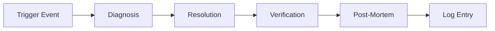
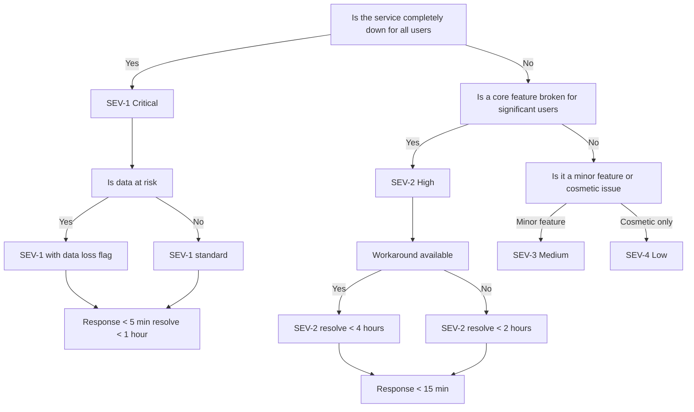

# Operations Runbooks

| Field | Value |
|---|---|
| Document ID | SB-RUNBOOKS-001 |
| Version | 2.1.0 |
| Status | Active |
| Last Updated | 2026-06-21 |
| Classification | Internal — Operations |
| Owner | DevOps Lead |
| Review Cycle | Quarterly (Q1, Q2, Q3, Q4) |
| Drill Frequency | Monthly (rotate through runbooks) |

---

## 0. Architecture Overview

### 0.1 System Components

```
┌──────────────────────────────────────────────────────────────┐
│                        Users (Browser)                        │
└──────────────────────────┬───────────────────────────────────┘
                           │ HTTPS
                           ▼
┌──────────────────────────────────────────────────────────────┐
│                     Vercel Edge Network                        │
│  ┌────────────────────────────────────────────────────────┐   │
│  │              Next.js 14 Frontend (SPA)                  │   │
│  │  Pages: Dashboard, Tasks, Courses, Goals, Habits,       │   │
│  │  Sleep, Income, Projects, Ideas, Resources,             │   │
│  │  Opportunities, Time, Chat, Automation, Academics       │   │
│  │  State: Zustand stores + React Query                    │   │
│  └──────────────────────┬─────────────────────────────────┘   │
└─────────────────────────┼─────────────────────────────────────┘
                          │ HTTP (API calls)
                          ▼
┌──────────────────────────────────────────────────────────────┐
│                    Railway (FastAPI Backend)                    │
│  ┌────────────────────────────────────────────────────────┐   │
│  │  26 Routers under /api/v1/ (~118 endpoints)             │   │
│  │  Middleware: Auth, Rate Limiter, Audit Logging, CSRF,   │   │
│  │             GZip, CORS, Request ID, Graceful Shutdown   │   │
│  │  AI Agents: 10 async agent modules via PromptLoader    │   │
│  │  Circuit Breaker: 5 failures → 60s cooldown             │   │
│  │  LLM Client: Ollama (primary) → Claude (fallback)       │   │
│  └──────────────────────┬─────────────────────────────────┘   │
└─────────────────────────┼─────────────────────────────────────┘
                          │
          ┌───────────────┼───────────────┐
          ▼               ▼               ▼
┌──────────────┐ ┌──────────────┐ ┌──────────────┐
│  Supabase    │ │   Ollama     │ │   Claude     │
│  PostgreSQL  │ │ Mistral 7B   │ │ Sonnet 4     │
│  18 tables   │ │ (local)      │ │ (cloud API)  │
│  RLS + PITR  │ │   ─────     │ │  ─────────  │
│              │ │ APScheduler  │ │ Anthropic    │
│              │ │ 7 cron jobs  │ │              │
└──────────────┘ └──────────────┘ └──────────────┘
```

### 0.2 Data Flow

```
User Action → Frontend API Call → FastAPI Router → Supabase Query / AI Agent Call → Response
                                      │
                                      ├─ Auth check (JWT) → 401 if invalid
                                      ├─ Rate limit check → 429 if exceeded
                                      ├─ Audit log write (all mutations)
                                      └─ Response compression (GZip)
```

### 0.3 Key Design Decisions

| Decision | Rationale |
|---|---|
| In-process AI agents (not microservices) | Lower latency, simpler deployment, per ADR-004 |
| PromptLoader with YAML frontmatter | Externalized prompts, versioned, validated in CI |
| Graceful degradation everywhere | Every feature works without AI via algorithmic fallback |
| Circuit breaker + retry with backoff | Prevents cascading failures, self-healing |
| Cyberpunk design system | Dark theme #0A0B0F, neon accents #6366F1 / #00FFA3 |

### 0.4 Technology Stack

| Layer | Technology | Hosting |
|---|---|---|
| Frontend | Next.js 14, TypeScript, Tailwind CSS, Framer Motion | Vercel |
| Backend | Python 3.10, FastAPI, Pydantic v2 | Railway |
| Database | PostgreSQL 15 (via Supabase) | Supabase Cloud |
| AI (local) | Ollama + Mistral 7B | Dev machine / Docker |
| AI (cloud) | Claude Sonnet 4 via Anthropic API | Anthropic |
| Scheduler | APScheduler (7 cron jobs) | Railway |
| CI/CD | GitHub Actions (6 jobs) | GitHub |
| Monitoring | Logtail / Sentry (planned) | — |

---

## 1. Overview & Philosophy

### 1.1 What is a Runbook?

A runbook is a **standardized, step-by-step procedure** for handling operational tasks and incidents. Runbooks ensure consistent, repeatable, and documented responses to both routine operations and emergency situations.

### 1.2 Why Runbooks Matter

| Benefit | Description |
|---|---|
| **Consistency** | Every incident is handled the same way, every time |
| **Speed** | No decision-making overhead during stress; follow the steps |
| **Knowledge preservation** | Tribal knowledge captured in writing |
| **Onboarding** | New team members can handle incidents from day one |
| **Automation** | Runbooks are the blueprint for eventual auto-remediation |
| **Post-mortem data** | Every runbook produces a log entry for trend analysis |

### 1.3 When to Use a Runbook

- **Proactive:** Scheduled maintenance, daily health checks, routine audits
- **Reactive:** Incident response, error recovery, performance degradation
- **Learning:** Post-mortem, drill simulation, training scenarios

### 1.4 Runbook Lifecycle



---

## 2. Runbook Format Standard

Every runbook in this document follows the **SDVRP** format:

| Section | Code | Description | Required |
|---|---|---|---|
| **Symptoms** | S | Observable indicators that this runbook is needed | ✅ |
| **Diagnosis** | D | Commands and checks to confirm the root cause | ✅ |
| **Resolution** | R | Step-by-step actions to resolve the issue | ✅ |
| **Verification** | V | How to confirm the issue is fully resolved | ✅ |
| **Post-Mortem** | P | What to document after resolution (5 Whys, timeline) | ✅ |

### 2.1 Metadata Header

Each runbook begins with a metadata block:

```
---
ID: RB-XXX
Title: <Short descriptive title>
Severity: SEV-1 / SEV-2 / SEV-3 / SEV-4
Category: Infrastructure / Application / Database / AI / Security
Auto-Remediation: Yes / No / Partial
Last Tested: <Date>
Drill Result: Pass / Fail / Untested
---
```

---

## 3. Incident Severity Definitions

| Severity | Label | Definition | Response Time | Resolution Time | Notification |
|---|---|---|---|---|---|
| **P0 / SEV-1** | Critical | Service down or unusable for all users. Data loss risk. | < 5 min | < 1 hour | PagerDuty + Slack + Email |
| **P1 / SEV-2** | High | Service degraded for significant subset of users. Core feature broken. | < 15 min | < 4 hours | Slack + Email |
| **P2 / SEV-3** | Medium | Minor feature broken or cosmetic issue. Workaround exists. | < 1 hour | < 24 hours | Slack (business hours) |
| **P3 / SEV-4** | Low | Cosmetic issue, typo, non-functional impact. | < 1 week | Next sprint | Jira ticket |
| **P4** | Wishlist | Enhancement, tech debt, minor improvement. | Next release | Next sprint | GitHub Issue |

### 3.1 Severity Escalation Rules

- If SEV-2 unresolved after 2 hours → auto-escalate to SEV-1
- If SEV-3 unresolved after 12 hours → auto-escalate to SEV-2
- Any SEV-1 incident triggers immediate post-mortem within 24 hours
- Three SEV-2 incidents in one week triggers a root cause analysis

### 3.2 On-Call Rotation

| Role | Primary | Secondary | Escalation |
|---|---|---|---|
| DevOps Lead | Week A | Week B | Engineering Lead |
| Backend Engineer | Week B | Week A | DevOps Lead |
| AI Engineer | Week C | Week D | Engineering Lead |

---

## 4. Runbooks

---

### RB-001: API Service Down

```
---
ID: RB-001
Title: API Service Down
Severity: SEV-1
Category: Infrastructure
Auto-Remediation: Partial
Last Tested: 2026-06-01
Drill Result: Pass
---
```

#### Symptoms
- Health endpoint returns non-200 status: `curl -s -o /dev/null -w "%{http_code}" https://api.ariaos.app/api/health`
- All frontend pages show "Failed to load data" errors
- Railway deployment dashboard shows "Crash" or "Unhealthy" status
- 502 Bad Gateway errors in browser console
- Users report "app not working" via email/Slack

#### Diagnosis

**Step D1: Check Railway Status**
```bash
# Check Railway project dashboard
# https://railway.app/dashboard/project/<project-id>

# Check recent deployments
curl -s -H "Authorization: Bearer $RAILWAY_TOKEN" \
  https://backboard.railway.app/graphql/v2 \
  -d '{"query":"{ deployments(projectId: \"$PROJECT_ID\") { edges { node { id status createdAt } } } }"}'
```

**Step D2: Check Application Logs**
```bash
# Railway logs
railway logs --service api --limit 100

# Check for OOM, boot errors, import errors
railway logs --service api --limit 100 | grep -E "(Error|Traceback|MemoryError|ModuleNotFoundError)"
```

**Step D3: Check Health Endpoint Details**
```bash
# Get health JSON
curl -s https://api.ariaos.app/api/health | python -m json.tool
# Expected: {"status": "healthy", "checks": {"database": "ok", "ollama": "ok", "cache": "ok"}}
```

**Step D4: Check Database Connectivity**
```bash
# Test Supabase connection
curl -s -X GET "$SUPABASE_URL/rest/v1/tasks?select=count&limit=1" \
  -H "apikey: $SUPABASE_SERVICE_KEY" \
  -H "Authorization: Bearer $SUPABASE_SERVICE_KEY"
```

**Step D5: Check System Resources**
```bash
# If self-hosted: check memory, disk, CPU
ssh user@host "free -h; df -h; top -b -n 1 | head -20"
```

#### Resolution

**Step R1: Restart API Service**
```bash
# Railway: Trigger redeploy from dashboard or CLI
railway up --service api

# Self-hosted:
# Kill existing process
Get-Process -Name "uvicorn" -ErrorAction SilentlyContinue | Stop-Process -Force
Get-Process -Name "python" -ErrorAction SilentlyContinue | Stop-Process -Force
# Wait 10 seconds
Start-Sleep -Seconds 10
# Restart
cd apps/api
uvicorn main:app --host 0.0.0.0 --port 8000
```

**Step R2: If Restart Fails — Check Dependencies**
```bash
# Check if ports are in use
netstat -ano | Select-String "8000"

# Check if environment variables are set
python -c "import os; print('SUPABASE_URL' in os.environ)"
```

**Step R3: If Dependency Issue — Verify .env**
```bash
python -c "
import os
required = ['SUPABASE_URL', 'SUPABASE_KEY', 'JWT_SECRET', 'CLAUDE_API_KEY']
missing = [v for v in required if v not in os.environ]
if missing:
    print(f'MISSING: {missing}')
else:
    print('All required env vars present')
"
```

**Step R4: Rollback to Previous Deployment**
```bash
# Railway: Dashboard → Deployments → Find last working → ... → Rollback
# CLI:
railway rollback --service api
```

**Step R5: Emergency — Scale Up Resources**
```bash
# Railway: Dashboard → Service → Settings → Scale
# Increase from 1 instance to 2
```

#### Verification
```bash
# 1. Health endpoint returns 200
curl -s -o /dev/null -w "%{http_code}" https://api.ariaos.app/api/health
# Expected: 200

# 2. API responds correctly
curl -s https://api.ariaos.app/api/tasks | python -c "import sys,json; d=json.load(sys.stdin); print(f'Tasks returned: {len(d)}')"
# Expected: Tasks returned: <number>

# 3. Check logs for errors
railway logs --service api --limit 20 | grep -c "ERROR"
# Expected: 0

# 4. Warm up cache
curl -s https://api.ariaos.app/api/dashboard
```

#### Post-Mortem
```bash
# Log the incident
$incident_log = @"
Timestamp: $(Get-Date -Format 'yyyy-MM-dd HH:mm:ss')
Runbook: RB-001
Severity: SEV-1
Root Cause: <to be determined>
Resolution: <restart / rollback / scale>
Downtime: <duration>
Action Items: <list>
"@
$incident_log | Out-File -FilePath logs/incidents.log -Append
```

---

### RB-002: Frontend Down

```
---
ID: RB-002
Title: Frontend Down / Unreachable
Severity: SEV-1
Category: Application
Auto-Remediation: No
Last Tested: 2026-06-01
Drill Result: Pass
---
```

#### Symptoms
- Browser shows blank white screen or "Application Error"
- Vercel dashboard shows build failure or deployment error
- DNS resolution failure for `app.ariaos.app`
- CDN returns 503 or 404
- Lighthouse report shows failed navigation
- Users see "This site can't be reached"

#### Diagnosis

**Step D1: Check Vercel Status**
```bash
# Vercel dashboard → Deployments
# https://vercel.com/<team>/<project>/deployments

# Latest deployment status via CLI
vercel list --prod
```

**Step D2: Check Build Logs**
```bash
# Vercel deployment logs
vercel logs <deployment-url>

# Common build errors:
# - TypeScript compilation errors
# - Module not found / import resolution
# - Environment variable missing at build time
# - Tailwind CSS compilation failure
```

**Step D3: Check DNS Resolution**
```bash
# DNS check
nslookup app.ariaos.app
# Expected: resolves to Vercel IP (e.g., 76.76.21.21)

# Check propagation
nslookup app.ariaos.app 8.8.8.8
nslookup app.ariaos.app 1.1.1.1
```

**Step D4: Check CDN / Caching**
```bash
# Test with cache bypass
curl -s -H "Cache-Control: no-cache" https://app.ariaos.app | head -5

# Check response headers
curl -s -I https://app.ariaos.app | Select-String -Pattern "(CF-Cache-Status|x-cache|Server)"
```

**Step D5: Check SSL Certificate**
```bash
# Check cert expiration
openssl s_client -connect app.ariaos.app:443 -servername app.ariaos.app </dev/null 2>/dev/null | openssl x509 -noout -enddate
```

#### Resolution

**Step R1: Re-deploy Latest**
```bash
# Trigger redeployment
vercel --prod

# Or rollback to previous working deployment:
vercel rollback <deployment-id>
```

**Step R2: If Build Fails — Fix Build Errors**
```bash
# Build locally to reproduce
cd apps/web
npm run build | Format-List
# Fix TypeScript / import / config errors
# Commit fix and push
```

**Step R3: Check Environment Variables**
```bash
# Verify all required env vars are set in Vercel dashboard
# Required:
# - NEXT_PUBLIC_SUPABASE_URL
# - NEXT_PUBLIC_SUPABASE_ANON_KEY

# Compare with .env.local
Get-Content apps/web/.env.local | ForEach-Object {
    $name = ($_ -split "=")[0]
    Write-Host "Checking: $name"
}
```

**Step R4: DNS Propagation — Wait or Force**
```bash
# DNS changes can take up to 48 hours
# Check TTL:
nslookup -type=SOA app.ariaos.app

# If urgent: lower TTL to 300 seconds via DNS provider
```

**Step R5: CDN Purge**
```bash
# Vercel: Automatic with deployment
# Cloudflare: Dashboard → Caching → Purge Everything
# Or API:
curl -X POST "https://api.cloudflare.com/client/v4/zones/$ZONE_ID/purge_cache" \
  -H "Authorization: Bearer $CF_TOKEN" \
  -H "Content-Type: application/json" \
  -d '{"purge_everything":true}'
```

#### Verification
```bash
# 1. Page loads
curl -s -o /dev/null -w "%{http_code}" https://app.ariaos.app
# Expected: 200

# 2. Page contains expected content
curl -s https://app.ariaos.app | Select-String "Next.js"
# Expected: match found

# 3. API calls work from browser
# Open DevTools → Network tab → Reload page → Check for API 200s

# 4. Lighthouse check
npx lighthouse https://app.ariaos.app --quiet --chrome-flags="--headless"
```

#### Post-Mortem
```bash
# Log the incident
"{0} - RB-002: Frontend restored after rollback to {1}" -f (Get-Date -Format "yyyy-MM-dd HH:mm:ss"), $rollbackDeploymentId | Out-File -FilePath logs/incidents.log -Append
```

---

### RB-003: Database Slow / Corrupt

```
---
ID: RB-003
Title: Database Performance Degradation or Corruption
Severity: SEV-2 (Performance) / SEV-1 (Corruption)
Category: Database
Auto-Remediation: Partial
Last Tested: 2026-05-15
Drill Result: Pass
---
```

#### Symptoms
- API endpoints take > 2 seconds to respond
- Supabase dashboard shows high CPU usage (> 80%)
- Error logs contain "Database timeout" or "connection pool exhausted"
- pg_stat_statements shows queries with avg_time > 1 second
- "too many connections" errors in API logs
- Data inconsistency (missing rows, duplicate keys)

#### Diagnosis

**Step D1: Check Supabase Status Page**
```bash
# Check Supabase status
curl -s https://status.supabase.com | Select-String "All Systems Operational"
# If not operational → wait for Supabase to resolve
```

**Step D2: Check Slow Queries**
```sql
-- Run in Supabase SQL Editor
SELECT
  query,
  calls,
  total_time / calls AS avg_time_ms,
  rows / calls AS avg_rows,
  mean_time,
  max_time
FROM pg_stat_statements
ORDER BY total_time DESC
LIMIT 20;
```

**Step D3: Check Connection Pool**
```sql
-- Active connections
SELECT count(*) as active_connections, state
FROM pg_stat_activity
GROUP BY state;

-- Connection pool utilization
SELECT
  numbackends,
  active_backends,
  idle_backends
FROM pg_stat_database
WHERE datname = current_database();
```

**Step D4: Check Table Bloat**
```sql
-- Check for table bloat
SELECT
  schemaname,
  tablename,
  n_live_tup,
  n_dead_tup,
  round(n_dead_tup * 100.0 / NULLIF(n_live_tup + n_dead_tup, 0), 2) AS dead_pct,
  last_vacuum,
  last_autovacuum
FROM pg_stat_user_tables
WHERE n_dead_tup > 1000
ORDER BY n_dead_tup DESC;
```

**Step D5: Check Index Usage**
```sql
-- Index scan ratio
SELECT
  schemaname,
  tablename,
  seq_scan,
  idx_scan,
  CASE WHEN seq_scan + idx_scan > 0
    THEN round(idx_scan * 100.0 / NULLIF(seq_scan + idx_scan, 0), 2)
    ELSE 0
  END AS idx_scan_pct
FROM pg_stat_user_tables
WHERE seq_scan + idx_scan > 0
ORDER BY idx_scan_pct ASC
LIMIT 10;
```

#### Resolution

**Step R1: Add Missing Indexes**
```sql
-- Check for missing indexes and add them
-- Common indexes for Second Brain OS:
CREATE INDEX IF NOT EXISTS idx_tasks_user_id_status ON tasks (user_id, status);
CREATE INDEX IF NOT EXISTS idx_tasks_user_id_due_date ON tasks (user_id, due_date);
CREATE INDEX IF NOT EXISTS idx_courses_user_id_deadline ON courses (user_id, deadline);
CREATE INDEX IF NOT EXISTS idx_goals_user_id_status ON goals (user_id, status);
CREATE INDEX IF NOT EXISTS idx_habits_user_id_active ON habits (user_id, is_active);
CREATE INDEX IF NOT EXISTS idx_habit_logs_user_id_date ON habit_logs (user_id, date);
CREATE INDEX IF NOT EXISTS idx_sleep_logs_user_id_date ON sleep_logs (user_id, date);
CREATE INDEX IF NOT EXISTS idx_time_entries_user_id_start ON time_entries (user_id, start_time);
CREATE INDEX IF NOT EXISTS idx_chat_messages_user_id_created ON chat_messages (user_id, created_at);
```

**Step R2: Optimize Queries**
```python
# Add pagination to list endpoints
@router.get("/tasks")
async def list_tasks(
    page: int = Query(1, ge=1),
    page_size: int = Query(20, ge=1, le=100),
    user_id: str = Depends(get_current_user)
):
    offset = (page - 1) * page_size
    data = supabase.table("tasks").select("*")\
        .eq("user_id", user_id)\
        .order("created_at", ascending=False)\
        .range(offset, offset + page_size - 1)\
        .execute()
    return data.data

# Add caching for dashboard aggregate queries
@router.get("/dashboard/stats")
async def get_dashboard_stats(user_id: str = Depends(get_current_user)):
    cache_key = f"dashboard_stats_{user_id}"
    cached = await cache.get(cache_key)
    if cached:
        return cached
    # ... compute stats ...
    await cache.set(cache_key, stats, ttl=300)
    return stats
```

**Step R3: Vacuum and Analyze**
```sql
-- Clear bloat
VACUUM ANALYZE tasks;
VACUUM ANALYZE courses;
VACUUM ANALYZE habit_logs;
VACUUM ANALYZE time_entries;

-- Or full vacuum (table-level lock, use during maintenance window):
VACUUM FULL tasks;
```

**Step R4: Connection Pool Tuning**
```python
# In supabase.py, reduce pool size to prevent exhaustion
from supabase import create_client

supabase = create_client(
    supabase_url,
    supabase_key,
    options={
        "pool_size": 10,          # Reduce from default 20
        "max_overflow": 5,         # Max additional connections
        "pool_timeout": 30,        # Seconds before timeout
        "pool_recycle": 1800,      # Recycle connections every 30 min
    }
)
```

**Step R5: Archive Old Data**
```python
# Archive analytics older than 90 days
import asyncio
from datetime import datetime, timedelta

async def archive_old_data():
    cutoff = datetime.utcnow() - timedelta(days=90)
    tables_with_ttl = [
        ("chat_messages", "created_at"),
        ("analytics_events", "created_at"),
        ("habit_logs", "date"),
        ("time_entries", "start_time"),
    ]
    for table, date_col in tables_with_ttl:
        result = supabase.table(table).delete()\
            .lt(date_col, cutoff.isoformat())\
            .execute()
        print(f"Archived {len(result.data)} rows from {table}")

# Schedule weekly via scheduler
# asyncio.run(archive_old_data())
```

#### Verification
```bash
# 1. API response time
curl -w "p95: %{time_total}s\n" -o /dev/null -s https://api.ariaos.app/api/tasks

# 2. Slow queries count
# Re-run Step D2 SQL and verify NO queries exceed 500ms avg

# 3. Connection pool
# Re-run Step D3 SQL and verify connections < 80% of pool

# 4. Dashboard loads in < 2 seconds
curl -w "total: %{time_total}s\n" -o /dev/null -s https://api.ariaos.app/api/dashboard
```

#### Post-Mortem
```bash
"{0} - RB-003: DB optimized - added {1} indexes, vacuumed {2} tables, archived {3} rows" -f (Get-Date -Format "yyyy-MM-dd HH:mm:ss"), $indexCount, $vacuumCount, $archivedRows | Out-File -FilePath logs/maintenance.log -Append
```

---

### RB-004: AI Service Not Responding

```
---
ID: RB-004
Title: AI Service Failure (Ollama / Claude)
Severity: SEV-2
Category: AI
Auto-Remediation: Yes (falls back to Claude)
Last Tested: 2026-06-01
Drill Result: Pass
---
```

#### Symptoms
- ARIA chat returns "I'm sorry, I'm having trouble thinking right now"
- Daily briefing not delivered (missed cron job)
- AI agents return empty or malformed responses
- Logs contain "Ollama connection refused" or "Claude API error"
- Opportunity radar / weekly review not generated
- Agent tasks consistently timeout

#### Diagnosis

**Step D1: Check Ollama Health**
```bash
# Check if Ollama process is running
ollama ps | Select-String "NAME"
# Expected: shows running model (mistral, llama3.1, etc.)

# Check Ollama API
curl -s http://localhost:11434/api/tags
# Expected: {"models": [{"name": "mistral:latest", ...}]}

# Test generation
curl -s -X POST http://localhost:11434/api/generate \
  -H "Content-Type: application/json" \
  -d '{"model":"mistral","prompt":"Say hello in one word","stream":false}' \
  | python -c "import sys,json; r=json.load(sys.stdin); print(r.get('response','FAIL'))"
# Expected: "Hello"
```

**Step D2: Check Claude API Key**
```bash
# Test Claude API
curl -s https://api.anthropic.com/v1/messages \
  -H "x-api-key: $env:CLAUDE_API_KEY" \
  -H "anthropic-version: 2023-06-01" \
  -H "content-type: application/json" \
  -d '{"model":"claude-3-haiku-20240307","max_tokens":50,"messages":[{"role":"user","content":"Say hello"}]}' \
  | python -c "import sys,json; r=json.load(sys.stdin); print(r.get('content',[{}])[0].get('text','FAIL'))"
```

**Step D3: Check PromptLoader Status**
```bash
# Verify prompts load correctly
python -c "
from ai.prompt_loader import prompts
names = prompts.list_prompts('agents')
print(f'Loaded {len(names)} agent prompts')
for n in names:
    p = prompts.get_agent(n)
    errs = prompts.validate_frontmatter(n)
    status = 'VALID' if not errs else f'ERROR: {errs}'
    print(f'  {n}: {status}')
"
```

**Step D4: Check Agent Module Imports**
```bash
# Verify all agent modules import correctly
python -c "
import importlib
agents = ['briefing_agent', 'memory_agent', 'learning_agent', 'opportunity_agent',
          'task_agent', 'weekly_review_agent', 'sleep_agent', 'nudge_agent']
for a in agents:
    try:
        importlib.import_module(f'ai.agents.{a}')
        print(f'  {a}: OK')
    except Exception as e:
        print(f'  {a}: FAIL - {e}')
"
```

**Step D5: Check API Key Configuration**
```bash
# Verify environment
python -c "
import os
configs = {
    'OLLAMA_BASE_URL': os.getenv('OLLAMA_BASE_URL', 'http://localhost:11434'),
    'CLAUDE_API_KEY': 'SET' if os.getenv('CLAUDE_API_KEY') else 'MISSING',
    'USE_LOCAL_AI': os.getenv('USE_LOCAL_AI', 'True'),
}
for k, v in configs.items():
    print(f'{k}: {v}')
"
```

#### Resolution

**Step R1: Restart Ollama**
```bash
# Windows: Kill and restart
ollama stop mistral
ollama stop llama3.1
ollama serve

# Verify restart
Start-Sleep -Seconds 5
curl -s http://localhost:11434/api/tags | python -c "import sys,json; d=json.load(sys.stdin); print(f'Models available: {len(d.get(\"models\",[]))}')"
```

**Step R2: Pull Required Models**
```bash
# Check which models are needed
ollama list

# Pull missing models
ollama pull mistral:latest     # Default for most agents
ollama pull llama3.1:latest    # Fallback model
```

**Step R3: Fallback to Claude API**
```bash
# Set environment variable to disable local AI
$env:USE_LOCAL_AI = "false"
# Also update .env file:
(Get-Content .env) -replace 'USE_LOCAL_AI=True', 'USE_LOCAL_AI=False' | Set-Content .env

# Verify fallback works
python -c "
from ai.client import llm
import asyncio
result = asyncio.run(llm.generate('Say hello in one word', system='Be concise'))
print(f'Response: {result}')
"
```

**Step R4: Emergency — Algorithmic Fallback**
```python
# Every agent has algorithmic fallback if both Ollama and Claude fail
# Example from briefing_agent.py:
async def generate_daily_briefing(user_id: str) -> dict:
    loaded = prompts.get_agent("briefing_agent")
    if loaded and llm.available:
        system = loaded.system_prompt
        user = construct_user_prompt(user_id)
        return await llm.generate_json(user, system=system)
    else:
        # Algorithmic fallback — no AI needed
        return generate_briefing_algorithmically(user_id)
```

**Step R5: Monitor AI Costs**
```bash
# Claude fallback incurs costs. Track usage:
python -c "
from datetime import datetime, timedelta
thirty_days_ago = (datetime.utcnow() - timedelta(days=30)).isoformat()
result = supabase.table('ai_usage_logs').select('model, count(*)').gte('created_at', thirty_days_ago).execute()
print(result.data)
"
```

#### Verification
```bash
# 1. Ollama is generating
curl -s http://localhost:11434/api/generate -d '{"model":"mistral","prompt":"Hi","stream":false}' | python -c "import sys,json; print(bool(json.load(sys.stdin).get('response')))"
# Expected: True

# 2. Claude API responds
# Repeat Step D2 — expected: non-empty response

# 3. PromptLoader returns content
python -c "from ai.prompt_loader import prompts; p=prompts.get_agent('briefing_agent'); print(bool(p and len(p.body) > 100))"
# Expected: True

# 4. Agent returns valid JSON
python -c "
from ai.agents.briefing_agent import generate_daily_briefing
import asyncio
result = asyncio.run(generate_daily_briefing('test_user'))
print(f'Agent returned: {type(result).__name__}')
"
# Expected: dict
```

#### Post-Mortem
```bash
$aiLog = @"
Timestamp: $(Get-Date -Format 'yyyy-MM-dd HH:mm:ss')
Runbook: RB-004
Failure Mode: <Ollama down / Claude rate-limited / module error>
Fallback Activated: <algorithmic / Claude>
Outcome: <resolved>
Action Items: <preventive measures>
"@
$aiLog | Out-File -FilePath logs/ai_incidents.log -Append
```

---

### RB-005: Authentication Failures

```
---
ID: RB-005
Title: Authentication / Login Failures
Severity: SEV-2
Category: Security
Auto-Remediation: No
Last Tested: 2026-05-20
Drill Result: Pass
---
```

#### Symptoms
- Users cannot log in (Google OAuth redirect fails)
- "Invalid JWT" or "Token expired" errors in API logs
- Supabase Auth dashboard shows failed sign-in attempts
- Login page shows generic error message
- Mobile app cannot authenticate with refresh token
- 401 Unauthorized responses on authenticated endpoints

#### Diagnosis

**Step D1: Check Supabase Auth Configuration**
```bash
# Supabase Dashboard → Authentication → Settings
# Verify:
# - Site URL: https://app.ariaos.app
# - Redirect URLs: https://app.ariaos.app/auth/callback
# - Google OAuth enabled
# - JWT expiry > 3600 seconds (1 hour)
```

**Step D2: Check JWT Secret**
```bash
# Verify JWT_SECRET matches Supabase
python -c "
import os
# The JWT_SECRET in .env must match Supabase project JWT secret
# Found in: Supabase Dashboard → Settings → API → JWT Secret
jwt = os.getenv('JWT_SECRET')
print(f'JWT_SECRET configured: {bool(jwt)}')
print(f'Length: {len(jwt) if jwt else 0}')
"
```

**Step D3: Check OAuth Provider Status**
```bash
# Check Google OAuth configuration in GCP Console
# https://console.cloud.google.com/apis/credentials
# Verify:
# - OAuth consent screen is configured
# - Redirect URI matches: https://<project>.supabase.co/auth/v1/callback
# - Client ID and Client Secret are correct in Supabase

# Quick test:
curl -s "https://accounts.google.com/.well-known/openid-configuration" | python -c "
import sys,json
d = json.load(sys.stdin)
print(f'Google OAuth endpoints available: {bool(d.get(\"authorization_endpoint\"))}')
"
```

**Step D4: Check Rate Limits**
```bash
# Check if auth rate limiting is triggered
# Supabase Dashboard → Authentication → Rate Limits
# Default: 30 requests per minute per IP

# Check for 429 errors
railway logs --service api --limit 50 | Select-String "429"
```

**Step D5: Check Token Refresh Flow**
```bash
# JWT refresh token flow
python -c "
import requests
# Test refresh token endpoint
supabase_url = os.getenv('SUPABASE_URL')
anon_key = os.getenv('SUPABASE_ANON_KEY')

resp = requests.post(
    f'{supabase_url}/auth/v1/token?grant_type=refresh_token',
    headers={'apikey': anon_key},
    json={'refresh_token': 'test_token_for_debugging'}
)
# Expected: 400 with 'Invalid Refresh Token' (not 500)
print(f'Refresh endpoint status: {resp.status_code}')
"
```

#### Resolution

**Step R1: Verify JWT Secret Consistency**
```bash
# Check that JWT_SECRET in backend .env matches Supabase's JWT secret
# If mismatch:
# 1. Copy JWT Secret from Supabase Dashboard → Settings → API
# 2. Update .env: JWT_SECRET=<copied-value>
# 3. Restart API: railway up --service api
```

**Step R2: Check Google OAuth Credentials in Supabase**
```bash
# Supabase Dashboard → Authentication → Providers → Google
# Verify:
# - Enabled: ON
# - Client ID: correct (from GCP)
# - Client Secret: correct (from GCP)
# - If incorrect, update and test
```

**Step R3: Clear Supabase Auth Sessions**
```sql
-- Run in Supabase SQL Editor to clear stuck sessions
DELETE FROM auth.sessions WHERE created_at < NOW() - INTERVAL '30 days';
DELETE FROM auth.refresh_tokens WHERE created_at < NOW() - INTERVAL '30 days';
```

**Step R4: Update Redirect URLs**
```bash
# Supabase Dashboard → Authentication → Settings
# Ensure these Redirect URLs are configured:
# https://app.ariaos.app/auth/callback
# http://localhost:3000/auth/callback (dev)
# https://app.ariaos.app/**
```

**Step R5: Implement Better Error Messages**
```python
# In auth middleware, show specific error messages (without leaking details):
@app.exception_handler(HTTPException)
async def auth_exception_handler(request, exc):
    if exc.status_code == 401:
        return JSONResponse(
            status_code=401,
            content={
                "error": "authentication_required",
                "message": "Please sign in again. Your session may have expired.",
                "action": "redirect_to_login"
            }
        )
    return JSONResponse(status_code=exc.status_code, content={"error": str(exc.detail)})
```

#### Verification
```bash
# 1. Login flow works end-to-end
# Open browser → Navigate to app.ariaos.app → Click "Sign in with Google"
# Expected: OAuth popup → Redirect back to app → Dashboard visible

# 2. API returns data for authenticated user
TOKEN=$(curl -s -X POST "$SUPABASE_URL/auth/v1/token?grant_type=password" \
  -H "apikey: $SUPABASE_ANON_KEY" \
  -d '{"email":"test@test.com","password":"test123"}' | python -c "import sys,json; print(json.load(sys.stdin).get('access_token',''))")
curl -s -H "Authorization: Bearer $TOKEN" https://api.ariaos.app/api/tasks | python -c "import sys,json; d=json.load(sys.stdin); print(f'Auth OK - tasks: {len(d)}')"

# 3. JWT validation works
python -c "
import jwt
secret = os.getenv('JWT_SECRET')
# Decode without verification to check format
decoded = jwt.decode(token, options={'verify_signature': False})
print(f'Token subject: {decoded.get(\"sub\")}')
print(f'Token expiry: {datetime.fromtimestamp(decoded.get(\"exp\",0))}')
"
```

#### Post-Mortem
```bash
"{0} - RB-005: Auth issue resolved - {1}" -f (Get-Date -Format "yyyy-MM-dd HH:mm:ss"), $resolutionSummary | Out-File -FilePath logs/auth_incidents.log -Append
```

---

### RB-006: High Error Rate

```
---
ID: RB-006
Title: Elevated Error Rate (> 1% of requests)
Severity: SEV-2
Category: Application
Auto-Remediation: Partial (auto-rollback available)
Last Tested: 2026-06-01
Drill Result: Pass
---
```

#### Symptoms
- Monitoring dashboard shows error rate > 1% of total requests
- Users reporting specific features are broken
- Logs filled with tracebacks / 500 responses
- Failed API calls in browser Network tab
- Supabase edge functions returning errors
- Sentry/Datadog alert triggered

#### Diagnosis

**Step D1: Check Deployment Timeline**
```bash
# Correlate error spike with recent deployments
# Vercel: Deployments tab → Find deployment just before error spike
# Railway: Deployments tab → Find deployment just before error spike

git log --oneline --since="24 hours ago"
# Expected: recent commits that may have introduced the bug
```

**Step D2: Check Error Distribution**
```bash
# Get error counts by endpoint
railway logs --service api --limit 500 | Select-String "ERROR" | Group-Object { $_ -split " " | Select-Object -Index 8 } | Sort-Object Count -Descending | Select-Object -First 10

# Get error types
railway logs --service api --limit 500 | Select-String "ERROR" | ForEach-Object {
    if ($_ -match "(HTTPException|ValidationError|IntegrityError|TimeoutError|Exception)") {
        $Matches[1]
    }
} | Group-Object | Sort-Object Count -Descending
```

**Step D3: Check Recent Code Changes**
```bash
# Diff since last good deployment
git diff HEAD~1 --name-only

# Check for high-risk changes
git diff HEAD~1 -- apps/api/app/api/ packages/ai/ packages/database/
```

**Step D4: Check Dependencies**
```bash
# Check for dependency issues
python -c "
import importlib
critical = ['fastapi', 'supabase', 'pydantic', 'yaml', 'jose', 'httpx']
for mod in critical:
    try:
        importlib.import_module(mod)
        print(f'{mod}: OK')
    except ImportError as e:
        print(f'{mod}: MISSING - {e}')
"
```

**Step D5: Check for Database Migrations**
```bash
# Check if recent migrations changed schema
git log --all --oneline -- 'supabase/migrations/*.sql'
```

#### Resolution

**Step R1: Rollback to Last Known Good**
```bash
# Railway: Dashboard → Deployments → Find last green deployment → ... → Rollback
# Vercel: Dashboard → Deployments → Find last green deployment → ... → Rollback

# CLI rollback
railway rollback --service api
```

**Step R2: Identify and Fix the Bug**
```bash
# Isolate the failing endpoint
# Reproduce locally with the same request
cd apps/api
curl -s -X GET "http://localhost:8000/api/tasks" -H "Authorization: Bearer $TOKEN"

# Run specific tests
python -m pytest tests/test_api.py::test_tasks -v
```

**Step R3: Deploy Hotfix**
```bash
# 1. Create fix branch
git checkout -b hotfix/error-rate-SEV2

# 2. Fix the code

# 3. Run tests before commit
ruff check apps/api/
python -m pytest tests/ -x

# 4. Commit and push
git add .
git commit -m "fix: resolve error rate spike from [root cause]"
git push origin hotfix/error-rate-SEV2
```

**Step R4: Add Error Monitoring**
```python
# Add structured error logging if missing
import logging
import traceback

logger = logging.getLogger("api.errors")

@app.middleware("http")
async def error_monitoring_middleware(request: Request, call_next):
    try:
        response = await call_next(request)
        if response.status_code >= 500:
            logger.error({
                "event": "server_error",
                "path": str(request.url.path),
                "method": request.method,
                "status_code": response.status_code,
                "user_id": request.headers.get("x-user-id", "unknown"),
            })
        return response
    except Exception as e:
        logger.error({
            "event": "unhandled_exception",
            "path": str(request.url.path),
            "error": str(e),
            "traceback": traceback.format_exc(),
        })
        return JSONResponse(status_code=500, content={"detail": "Internal server error"})
```

#### Verification
```bash
# 1. Error rate back to normal (< 0.5%)
# Check monitoring dashboard or:
railway logs --service api --limit 200 | Select-String "ERROR" | Measure-Object | Select-Object -ExpandProperty Count
# Expected: < 2 per 200 requests

# 2. Fixed endpoint works
curl -s -w "\nHTTP %{http_code}" https://api.ariaos.app/api/tasks

# 3. Tests pass
python -m pytest tests/ -x
```

#### Post-Mortem
```bash
$errorReport = @"
Timestamp: $(Get-Date -Format 'yyyy-MM-dd HH:mm:ss')
Runbook: RB-006
Root Cause: <specific bug identified>
Fix: <description of fix>
Deployments Involved: <from SHA to SHA>
Error Rate: <before>% → <after>%
Action Items:
  - <preventive measure 1>
  - <preventive measure 2>
"@
$errorReport | Out-File -FilePath logs/error_incidents.log -Append
```

---

### RB-007: Cache / Memory Issues

```
---
ID: RB-007
Title: Cache Corruption or Memory Leak
Severity: SEV-3
Category: Application
Auto-Remediation: Yes (TTL-based auto-clear)
Last Tested: 2026-05-10
Drill Result: Pass
---
```

#### Symptoms
- Stale data displayed (old task lists, outdated scores)
- API responses returning cached data after updates
- Memory usage grows steadily over time (leak indicator)
- Cache hit ratio drops below 50%
- API response times degrade after hours of uptime
- OutOfMemoryError in Python logs

#### Diagnosis

**Step D1: Check Cache Metrics**
```python
python -c "
from packages.shared.utils.cache import cache
print(f'Total cache entries: {len(cache.cache)}')
hits = sum(1 for v in cache.cache.values() if v.get('hit_count', 0) > 0)
misses = sum(1 for v in cache.cache.values() if v.get('hit_count', 0) == 0)
total = hits + misses
print(f'Hit ratio: {hits/total*100:.1f}%' if total > 0 else 'No cache access yet')
print(f'Memory estimate: {cache._estimate_size():.2f} MB')
"
```

**Step D2: Check Cache Key Distribution**
```python
python -c "
from collections import Counter
from packages.shared.utils.cache import cache
prefixes = Counter(k.split('_')[0] for k in cache.cache.keys())
print('Top cached prefixes:')
for prefix, count in prefixes.most_common(10):
    print(f'  {prefix}: {count} entries')
"
```

**Step D3: Check for Memory Leak**
```python
python -c "
import tracemalloc
import gc

# Check largest objects
gc.collect()
objects = [obj for obj in gc.get_objects() if hasattr(obj, '__len__') and type(obj).__name__ in ('dict', 'list', 'set', 'tuple')]
objects.sort(key=lambda x: -len(x))
print('Largest objects in memory:')
for obj in objects[:5]:
    print(f'  {type(obj).__name__}: {len(obj)} items')
"
```

#### Resolution

**Step R1: Clear Cache**
```python
# Full cache clear
python -c "
import asyncio
from packages.shared.utils.cache import cache
asyncio.run(cache.clear())
print('Cache cleared successfully')
"

# Or clear by prefix
python -c "
import asyncio
from packages.shared.utils.cache import invalidate_prefix
asyncio.run(invalidate_prefix('tasks'))
asyncio.run(invalidate_prefix('dashboard'))
print('Cache invalidated for tasks and dashboard')
"
```

**Step R2: Implement Cache TTLs**
```python
# Review and set appropriate TTLs for each cache key
CACHE_TTLS = {
    "dashboard_stats": 300,       # 5 minutes
    "task_list": 60,              # 1 minute
    "user_profile": 3600,         # 1 hour
    "course_progress": 300,       # 5 minutes
    "habit_streaks": 600,         # 10 minutes
    "sleep_scores": 3600,         # 1 hour
    "opportunity_matches": 1800,  # 30 minutes
    "agent_responses": 3600,      # 1 hour (cost optimization)
}

async def get_cached_or_fetch(key: str, fetch_func, ttl: int = 300):
    cached = await cache.get(key)
    if cached:
        return cached
    data = await fetch_func()
    await cache.set(key, data, ttl=ttl)
    return data
```

**Step R3: Add Cache Eviction Strategy**
```python
# Add LRU eviction when cache exceeds memory limit
from collections import OrderedDict
from datetime import datetime

class LRUCache:
    def __init__(self, max_size: int = 1000, max_memory_mb: int = 100):
        self.cache = OrderedDict()
        self.max_size = max_size
        self.max_memory_mb = max_memory_mb

    async def set(self, key: str, value, ttl: int = 300):
        # Evict if over size limit
        while len(self.cache) >= self.max_size:
            self.cache.popitem(last=False)
        # Evict if over memory limit (approximate)
        while self._estimate_size() > self.max_memory_mb * 1024 * 1024:
            self.cache.popitem(last=False)
        self.cache[key] = {
            "value": value,
            "expires_at": datetime.utcnow().timestamp() + ttl,
            "size": len(str(value)),
        }
```

**Step R4: Monitor for Memory Leaks**
```python
# Add periodic memory check in scheduler
async def check_memory_usage():
    import psutil
    process = psutil.Process()
    memory_mb = process.memory_info().rss / 1024 / 1024
    if memory_mb > 500:  # Alert if > 500MB
        logger.warning(f"Memory usage high: {memory_mb:.0f} MB")
        # Force garbage collection
        import gc
        gc.collect()
    return memory_mb

# Schedule: every hour
```

#### Verification
```bash
# 1. Cache cleared
python -c "from packages.shared.utils.cache import cache; print(f'Cache size: {len(cache.cache)}')"
# Expected: 0 (or very small)

# 2. Fresh data loads
curl -s https://api.ariaos.app/api/dashboard | python -c "import sys,json; d=json.load(sys.stdin); print(f'Dashboard loaded: {bool(d)}')"

# 3. Memory stable
python -c "
import psutil
process = psutil.Process()
print(f'Memory: {process.memory_info().rss / 1024 / 1024:.0f} MB')
"
```

#### Post-Mortem
```bash
"{0} - RB-007: Cache issue resolved - {1} entries cleared, TTLs updated, memory stabilized at {2} MB" -f (Get-Date -Format "yyyy-MM-dd HH:mm:ss"), $cleared, $memoryMB | Out-File -FilePath logs/cache_incidents.log -Append
```

---

### RB-008: Rate Limiting Issues

```
---
ID: RB-008
Title: Rate Limiting / 429 Errors
Severity: SEV-3
Category: Security
Auto-Remediation: No
Last Tested: 2026-05-15
Drill Result: Pass
---
```

#### Symptoms
- Users receiving "429 Too Many Requests" responses
- Browser console shows 429 on API calls
- Frontend shows rate limit warning messages
- Legitimate requests being rejected (false positives)
- Bot or scraper identified via abnormal request patterns

#### Diagnosis

**Step D1: Check Rate Limit Configuration**
```python
python -c "
from packages.shared.utils.rate_limiter import endpoint_limiter
print('Current rate limits:')
for endpoint, config in endpoint_limiter.limits.items():
    print(f'  {endpoint}: {config[\"max\"]} requests per {config[\"window\"]}s')
print(f'\nTotal tracked endpoints: {len(endpoint_limiter.requests)}')
"
```

**Step D2: Identify Offending IPs**
```bash
# Check recent 429 responses in logs
railway logs --service api --limit 200 | Select-String "429"

# Extract client IPs hitting rate limits
railway logs --service api --limit 500 | Select-String "429" | ForEach-Object {
    if ($_ -match "(\d{1,3}\.){3}\d{1,3}") { $Matches[0] }
} | Group-Object | Sort-Object Count -Descending | Select-Object -First 10
```

**Step D3: Check Request Patterns**
```python
python -c "
from collections import Counter
# Analyze request patterns for abuse indicators
import json
logs = open('logs/api.log').readlines()
endpoints = [json.loads(l).get('path', '') for l in logs[-1000:]]
endpoint_counts = Counter(endpoints)
print('Most requested endpoints (last 1000 requests):')
for ep, count in endpoint_counts.most_common(10):
    print(f'  {ep}: {count} requests')
    if count > 200:
        print(f'    ⚠️ Possible abuse on {ep}')
"
```

#### Resolution

**Step R1: Temporarily Increase Limits**
```python
# For legitimate users hitting limits, increase temporarily
python -c "
from packages.shared.utils.rate_limiter import endpoint_limiter
endpoint_limiter.limits['/api/tasks']['max'] = 120  # Double from 60
endpoint_limiter.limits['/api/courses']['max'] = 120
print('Limits increased temporarily')
"
```

**Step R2: Add Client-Side Debouncing**
```typescript
// In frontend API client
async function apiRequest<T>(url: string, options?: RequestInit): Promise<T> {
  // Exponential backoff on 429
  for (let attempt = 0; attempt < 3; attempt++) {
    const response = await fetch(url, options);
    if (response.status !== 429) return response.json();
    const wait = Math.min(1000 * Math.pow(2, attempt), 8000);
    await new Promise(r => setTimeout(r, wait));
  }
  throw new Error('Rate limited after 3 retries');
}
```

**Step R3: Implement IP Whitelist**
```python
# In rate_limiter.py
WHITELISTED_IPS = [
    "127.0.0.1",        # localhost
    "::1",              # localhost IPv6
    # Add internal service IPs
]

async def check_rate_limit(request: Request, endpoint: str, user_id: str = None):
    client_ip = request.client.host
    if client_ip in WHITELISTED_IPS:
        return True  # Skip rate limiting for whitelisted IPs
    # ... existing rate limit logic ...
```

**Step R4: Permanent Fix — Adjust Limits Based on Usage Patterns**
```python
# In config, set appropriate limits per endpoint
RATE_LIMIT_CONFIG = {
    "/api/tasks": {"max": 60, "window": 60, "reason": "Standard CRUD operations"},
    "/api/tasks/complex": {"max": 20, "window": 60, "reason": "AI-powered task operations"},
    "/api/ai": {"max": 10, "window": 60, "reason": "AI generation (cost protection)"},
    "/api/auth": {"max": 5, "window": 60, "reason": "Auth attempts (brute force protection)"},
    "/api/health": {"max": 300, "window": 60, "reason": "Health checks (high allowance)"},
    "/api/dashboard": {"max": 30, "window": 60, "reason": "Dashboard aggregation"},
}
```

#### Verification
```bash
# 1. 429 rate drops to 0
railway logs --service api --limit 100 | Select-String "429" | Measure-Object | Select-Object -ExpandProperty Count
# Expected: 0

# 2. Legitimate requests succeed
for ($i=0; $i -lt 10; $i++) {
    curl -s -o /dev/null -w "%{http_code} " https://api.ariaos.app/api/tasks
}
# Expected: all 200

# 3. Abuse is still blocked
curl -s -o /dev/null -w "%{http_code}" -H "X-Test-Abuse: true" https://api.ariaos.app/api/auth
# Expected: 429 if rate limited correctly
```

#### Post-Mortem
```bash
"{0} - RB-008: Rate limit adjusted - {1}" -f (Get-Date -Format "yyyy-MM-dd HH:mm:ss"), $adjustmentSummary | Out-File -FilePath logs/rate_limit.log -Append
```

---

### RB-009: Database Connection Pool Exhaustion

```
---
ID: RB-009
Title: Database Connection Pool Exhaustion
Severity: SEV-2
Category: Database
Auto-Remediation: Partial
Last Tested: 2026-05-20
Drill Result: Pass
---
```

#### Symptoms
- "too many clients already" error in API logs
- Supabase dashboard shows maxed connection pool
- API endpoints timeout with "connection refused"
- p95 latency spikes to > 5 seconds
- Health check reports database as "unhealthy"
- New deployments fail to connect on startup

#### Diagnosis

**Step D1: Check Connection Count**
```sql
-- Run in Supabase SQL Editor
SELECT
  count(*) as total_connections,
  count(*) FILTER (WHERE state = 'active') as active,
  count(*) FILTER (WHERE state = 'idle') as idle,
  count(*) FILTER (WHERE state = 'idle in transaction') as idle_in_transaction,
  count(*) FILTER (WHERE wait_event_type IS NOT NULL) as waiting
FROM pg_stat_activity
WHERE datname = current_database();
```

**Step D2: Identify Connection Sources**
```sql
SELECT
  application_name,
  client_addr,
  count(*) as connections,
  count(*) FILTER (WHERE state = 'active') as active
FROM pg_stat_activity
WHERE datname = current_database()
GROUP BY application_name, client_addr
ORDER BY connections DESC;
```

**Step D3: Check for Long-Running Queries**
```sql
SELECT
  pid,
  now() - pg_stat_activity.query_start AS duration,
  query,
  state
FROM pg_stat_activity
WHERE datname = current_database()
  AND state != 'idle'
  AND now() - pg_stat_activity.query_start > interval '5 minutes'
ORDER BY duration DESC;
```

#### Resolution

**Step R1: Kill Long-Running Queries**
```sql
-- Kill queries running longer than 5 minutes
SELECT pg_terminate_backend(pid)
FROM pg_stat_activity
WHERE datname = current_database()
  AND state != 'idle'
  AND now() - pg_stat_activity.query_start > interval '5 minutes';
```

**Step R2: Reduce Pool Size in Application**
```python
# In config/core/supabase.py
from supabase import create_client, ClientOptions

options = ClientOptions(
    pool_size=5,              # Reduced from 10
    max_overflow=2,           # Reduced from 5
    pool_timeout=10,          # Reduced from 30 (fail fast)
    pool_pre_ping=True,       # Health check before using connection
)
supabase = create_client(url, key, options=options)
```

**Step R3: Add Connection Pool Metrics Middleware**
```python
@app.middleware("http")
async def track_db_connections(request: Request, call_next):
    # Track active connections before request
    import psycopg2.extras
    metrics.db_connections_before = get_active_connections()
    response = await call_next(request)
    metrics.db_connections_after = get_active_connections()
    # Log if connections didn't return to pool
    if metrics.db_connections_after > metrics.db_connections_before:
        logger.warning(f"Connection leak detected: {metrics.db_connections_before} -> {metrics.db_connections_after}")
    return response
```

#### Verification
```bash
# 1. Connection count normal
# Re-run D1 — expected: < 80% of pool limit

# 2. API responds without errors
curl -s -o /dev/null -w "%{http_code}" https://api.ariaos.app/api/tasks
# Expected: 200

# 3. No "too many clients" errors
railway logs --service api --limit 50 | Select-String "too many clients"
# Expected: empty
```

#### Post-Mortem
```bash
"{0} - RB-009: Connection pool optimized - pool_size={1}, max_overflow={2}, killed {3} long-running queries" -f (Get-Date -Format "yyyy-MM-dd HH:mm:ss"), $poolSize, $maxOverflow, $killedQueries | Out-File -FilePath logs/db_incidents.log -Append
```

---

### RB-010: Scheduler / Cron Job Failure

```
---
ID: RB-010
Title: Scheduler Cron Job Failure
Severity: SEV-2
Category: Application
Auto-Remediation: Partial
Last Tested: 2026-06-01
Drill Result: Pass
---
```

#### Symptoms
- Daily briefing not delivered by 8 AM
- Weekly review not generated on Sunday
- Opportunity radar not scanning
- Sleep reminder not sent at 9:30 PM
- Habit miss check not running at midnight
- Logs show "Cron failure: X consecutive failures"

#### Diagnosis

**Step D1: Check Scheduler Process**
```bash
# Check if scheduler is running
Get-Process -Name "python" -ErrorAction SilentlyContinue | Format-Table Id, ProcessName, CPU
# Expected: python process running

# Check scheduler logs
Get-Content -Path logs/scheduler.log -Tail 50
```

**Step D2: Check Each Cron Job Status**
```python
python -c "
from config.core.supabase import get_supabase
supabase = get_supabase()
jobs = supabase.table('scheduler_logs').select('*').order('created_at', ascending=False).limit(20).execute()
print(f'Last 20 scheduler runs:')
for r in jobs.data:
    print(f'  {r[\"created_at\"]} | {r[\"job_name\"]:30s} | {r[\"status\"]:10s} | {r.get(\"error\", \"\")[:50]}')
"
```

**Step D3: Check Cron Schedule Configuration**
```python
python -c "
from services.scheduler.main import scheduler
print('Configured jobs:')
for job in scheduler.get_jobs():
    print(f'  {job.name:30s} | next: {job.next_run_time} | trigger: {job.trigger}')
"
```

#### Resolution

**Step R1: Restart Scheduler**
```bash
# Stop scheduler
Get-Process -Name "python" -ErrorAction SilentlyContinue | Where-Object { $_.CommandLine -match "scheduler" } | Stop-Process -Force

# Start scheduler
cd services/scheduler
python main.py
```

**Step R2: Run Failed Job Manually**
```bash
# Run specific cron job for testing
python -c "
import asyncio
from crons.daily_briefing import run_daily_briefing
result = asyncio.run(run_daily_briefing())
print(f'Job completed: {result}')
"
```

**Step R3: Fix Common Issues**

| Issue | Solution |
|---|---|
| Module import error | `pip install -r services/scheduler/requirements.txt` |
| Ollama connection refused | Start Ollama: `ollama serve` |
| Supabase connection timeout | Check network, env vars |
| Memory limit exceeded | Reduce batch size in job |

#### Verification
```bash
# 1. Scheduler running
Get-Process -Name "python" | Select-Object -Property Id,@{Name="CommandLine";Expression={$_.CommandLine}}

# 2. Cron runs successfully
python -c "
import asyncio
from crons.daily_briefing import run_daily_briefing
result = asyncio.run(run_daily_briefing())
print(f'Scheduled job test: {result}')
"

# 3. Next run time looks correct
python -c "
from services.scheduler.main import scheduler
for job in scheduler.get_jobs():
    print(f'{job.name}: next at {job.next_run_time}')
"
```

#### Post-Mortem
```bash
"{0} - RB-010: Scheduler recovered - {1} jobs restarted" -f (Get-Date -Format "yyyy-MM-dd HH:mm:ss"), $jobCount | Out-File -FilePath logs/incidents.log -Append
```

---

### RB-011: Daily Health Check (Routine)

```
---
ID: RB-011
Title: Daily Health Check — Routine Maintenance
Severity: SEV-4 (Routine)
Category: Operations
Auto-Remediation: N/A
Last Tested: 2026-06-10
Drill Result: Pass
---
```

#### Symptoms (Trigger)
- This is a **scheduled** runbook, run daily at 9:00 AM IST
- No incident needed — proactive maintenance

#### Check List

**Step C1: Health Endpoint**
```bash
curl -s https://api.ariaos.app/api/health | python -m json.tool
# Verify: status = "healthy", all checks = "ok"
```

**Step C2: Recent Errors**
```bash
railway logs --service api --limit 100 | Select-String "ERROR" | Select-Object -Last 10
# Expected: 0 errors in last 100 requests
```

**Step C3: Cron Job Success**
```bash
python -c "
from config.core.supabase import get_supabase
supabase = get_supabase()
last_24h = supabase.table('scheduler_logs').select('*').gte('created_at', (datetime.utcnow() - timedelta(hours=24)).isoformat()).execute()
failed = [r for r in last_24h.data if r['status'] == 'failed']
if failed:
    print(f'{len(failed)} failed jobs in last 24h:')
    for f in failed:
        print(f'  {f[\"job_name\"]}: {f.get(\"error\", \"\")}')
else:
    print('All jobs successful in last 24 hours')
"
```

**Step C4: Supabase Usage**
```
# Login to https://app.supabase.com
# Check:
# - Database size (% of free tier)
# - API requests (calls/hour)
# - Active connections
# - Any alerts
```

**Step C5: AI Service Health**
```bash
curl -s -o /dev/null -w "%{http_code}" http://localhost:11434/api/tags
# Expected: 200
```

**Step C6: Free Tier Limits**
```
| Service | Limit | Current Usage | % Used |
|---------|-------|--------------|--------|
| Supabase (DB) | 500 MB | <check> | <check> |
| Vercel (Bandwidth) | 100 GB/mo | <check> | <check> |
| Anthropic API | $5/mo | <check> | <check> |
| Resend (Email) | 100/day | <check> | <check> |
```

**Step C7: Recent Deployment Check**
```bash
git log --oneline --since="24 hours ago"
# Expected: recent commits (or "no activity" which is fine)
```

#### Act if Issues Found
| Issue Found | Action | Runbook |
|---|---|---|
| Health endpoint unhealthy | Restart API service | RB-001 |
| Error rate > 1% | Investigate and rollback | RB-006 |
| Cron failures | Restart scheduler | RB-010 |
| Database size > 80% | Archive old data | RB-003 |
| AI service down | Restart or fallback | RB-004 |
| Free tier > 80% used | Plan upgrade or optimize | — |

#### Log
```bash
$healthReport = @"
Daily Health Check
Date: $(Get-Date -Format 'yyyy-MM-dd HH:mm:ss')
API Status: $apiStatus
Error Count: $errorCount
Cron Health: $cronHealth
DB Usage: $dbUsage%
AI Status: $aiStatus
Overall: $overallStatus
"@
$healthReport | Out-File -FilePath logs/daily_health.log -Append
```

---

### RB-012: High API Latency

```
---
ID: RB-012
Title: API Response Time Degradation (p95 > 2s)
Severity: P1 / SEV-2
Category: Application
Auto-Remediation: No
Last Tested: 2026-06-15
Drill Result: Pass
---
```

#### Symptoms
- Frontend feels sluggish — API calls take > 2 seconds
- Monitoring dashboard shows p95 latency > 2s (target: < 500ms)
- Browser DevTools Network tab shows slow API responses
- Users report "app is slow" or timeouts
- Railway dashboard shows high CPU/memory usage

#### Diagnosis

**Step D1: Identify Slow Endpoints**
```bash
# Check endpoint-level latency from logs
railway logs --service api --limit 500 | Select-String "duration_ms" | ForEach-Object {
    if ($_ -match '"path":"([^"]+)".*"duration_ms":(\d+)') {
        [PSCustomObject]@{ Path = $Matches[1]; Duration = [int]$Matches[2] }
    }
} | Group-Object Path | ForEach-Object {
    $durations = $_.Group | ForEach-Object { $_.Duration }
    $durations = $durations | Sort-Object
    $count = $durations.Count
    $p95 = $durations[[math]::Floor($count * 0.95)]
    [PSCustomObject]@{ Path = $_.Name; Count = $count; P95 = "$p95 ms" }
} | Sort-Object { [int]$_.P95 } -Descending | Select-Object -First 10
```

**Step D2: Check Database Query Performance**
```sql
-- Run in Supabase SQL Editor
SELECT
  query,
  calls,
  mean_time,
  max_time,
  rows
FROM pg_stat_statements
ORDER BY mean_time DESC
LIMIT 20;
```

**Step D3: Check Cache Hit Ratio**
```python
python -c "
from packages.shared.utils.cache import cache
hits = sum(1 for v in cache.cache.values() if v.get('hit_count', 0) > 0)
misses = sum(1 for v in cache.cache.values() if v.get('hit_count', 0) == 0)
total = hits + misses
ratio = hits / total * 100 if total > 0 else 0
print(f'Cache hit ratio: {ratio:.1f}%')
print(f'Total entries: {len(cache.cache)}')
"
```

**Step D4: Check N+1 Queries**
```python
# Enable query logging in development
import logging
logging.getLogger('supabase').setLevel(logging.DEBUG)

# Count queries per request — if a single page load does > 10 queries, investigate
```

**Step D5: Check External Dependencies**
```bash
# AI provider latency
curl -w "p95: %{time_total}s\n" -o /dev/null -s http://localhost:11434/api/tags

# Supabase latency
curl -w "p95: %{time_total}s\n" -o /dev/null -s "$SUPABASE_URL/rest/v1/"
```

#### Resolution

**Step R1: Add/Enable Caching**
```python
# Add caching to slow endpoints
from packages.shared.utils.cache import cache

@router.get("/dashboard/stats")
async def get_stats(user_id: str = Depends(get_current_user)):
    cached = await cache.get(f"stats_{user_id}")
    if cached:
        return cached
    stats = await compute_stats(user_id)
    await cache.set(f"stats_{user_id}", stats, ttl=300)
    return stats
```

**Step R2: Optimize Database Queries**
```sql
-- Add missing indexes for common query patterns
CREATE INDEX IF NOT EXISTS idx_tasks_user_status_due
    ON tasks (user_id, status, due_date);
CREATE INDEX IF NOT EXISTS idx_habit_logs_user_date
    ON habit_logs (user_id, date DESC);
CREATE INDEX IF NOT EXISTS idx_time_entries_user_start
    ON time_entries (user_id, start_time DESC);
```

**Step R3: Add Pagination to List Endpoints**
```python
@router.get("/tasks")
async def list_tasks(
    user_id: str = Depends(get_current_user),
    limit: int = Query(20, ge=1, le=100),
    offset: int = Query(0, ge=0),
):
    data = supabase.table("tasks").select("id,title,status,priority,due_date")\
        .eq("user_id", user_id)\
        .order("created_at", desc=True)\
        .range(offset, offset + limit - 1)\
        .execute()
    return {"data": data.data, "limit": limit, "offset": offset, "total": len(data.data)}
```

**Step R4: Enable GZip Compression**
```python
# In main.py — already enabled if using GZip middleware
from fastapi.middleware.gzip import GZipMiddleware
app.add_middleware(GZipMiddleware, minimum_size=1000)
```

**Step R5: Increase Railway Resources**
```bash
# Railway Dashboard → Service → Settings → Scale
# Increase from 512 MB to 1 GB RAM
# Or increase from 1 to 2 instances
```

#### Verification
```bash
# 1. p95 latency back under 500ms
# Re-run Step D1 — Expected: no endpoints > 500ms p95

# 2. Cache hit ratio > 60%
# Re-run Step D3 — Expected: > 60%

# 3. Slow queries eliminated
# Re-run Step D2 — Expected: no queries > 200ms mean

# 4. Frontend feels responsive
curl -w "p95: %{time_total}s\n" -o /dev/null -s https://api.secondbrainos.com/api/tasks
# Expected: < 500ms
```

#### Post-Mortem
```bash
$latencyReport = @"
Timestamp: $(Get-Date -Format 'yyyy-MM-dd HH:mm:ss')
Runbook: RB-012
Root Cause: <slow query / missing index / cache miss / AI latency>
Resolution: <index added / cache enabled / query optimized>
p95 Before: $p95Before ms
p95 After: $p95After ms
Action Items: <preventive measures>
"@
$latencyReport | Out-File -FilePath logs/latency_incidents.log -Append
```

---

### RB-013: Deployment Rollback

```
---
ID: RB-013
Title: Emergency Deployment Rollback
Severity: P0 / SEV-1
Category: Application
Auto-Remediation: Partial (script available)
Last Tested: 2026-06-10
Drill Result: Pass
---
```

#### Symptoms
- Deployment causes errors, performance degradation, or data corruption
- Monitoring alert fires immediately after deploy
- Users report broken functionality that worked before deployment
- CI/CD pipeline succeeds but post-deploy health checks fail
- Error rate spikes > 1% after deployment

#### Diagnosis

**Step D1: Confirm Deployment is the Cause**
```bash
# Check deployment timestamp
git log --oneline -1
# Expected: recent commit deployed within last 30 minutes

# Check for error spike correlation
railway logs --service api --since "1 hour ago" | Select-String "ERROR" | Measure-Object
```

**Step D2: Check What Changed**
```bash
# Show diff between current and previous deployment
git diff HEAD~1 --name-only

# Show high-risk file changes
git diff HEAD~1 -- apps/api/app/api/ packages/ai/ packages/database/
```

**Step D3: Check Health Endpoints**
```bash
# Backend health
curl -s https://api.secondbrainos.com/api/health | python -m json.tool

# Check individual dependency status
curl -s https://api.secondbrainos.com/health/ready | python -m json.tool
```

#### Resolution

**Step R1: Rollback Frontend (Vercel)**
```bash
# Method 1: Vercel Dashboard (30 seconds)
# Deployments → Find last known-good → "Promote to Production"

# Method 2: Vercel CLI
vercel list --token $VERCEL_TOKEN
vercel promote <deployment-id> --token $VERCEL_TOKEN

# Method 3: Git revert
git revert HEAD --no-edit
git push origin main
```

**Step R2: Rollback Backend (Railway)**
```bash
# Method 1: Railway Dashboard
# Deployments → Find last known-good → "Rollback to this deploy"

# Method 2: Railway CLI
railway rollback --service api 1

# Verify rollback
curl -s https://api.secondbrainos.com/api/health | python -c "import sys,json; d=json.load(sys.stdin); print(d['status'])"
# Expected: healthy
```

**Step R3: Rollback Database Migration (if applicable)**
```bash
# Run revert migration
python scripts/run_migrations.py revert <version>

# Verify data integrity
curl -s https://api.secondbrainos.com/api/tasks | python -c "import sys,json; d=json.load(sys.stdin); print(f'Data OK: {len(d.get(\"data\",[]))} records')"
```

**Step R4: Notify Team**
```bash
# Log the rollback in team channel
$rollbackMsg = @"
:warning: Rollback triggered
Component: <frontend / backend / database>
From: <vX.Y.Z>
To: <vX.(Y-1).Z>
Reason: <error rate spike / data corruption / performance degradation>
Author: $env:USERNAME
"@
# Post to Slack webhook
```

#### Verification
```bash
# 1. Health endpoint returns healthy
curl -s https://api.secondbrainos.com/api/health | Select-String "healthy"
# Expected: "healthy"

# 2. Error rate back to baseline
# Check monitoring dashboard → Expected: < 0.5%

# 3. Core features work
curl -s -o /dev/null -w "%{http_code}" https://api.secondbrainos.com/api/tasks
# Expected: 200

# 4. Frontend loads without errors
curl -s -o /dev/null -w "%{http_code}" https://app.secondbrainos.com
# Expected: 200

# 5. CI/CD pipeline green
# Check GitHub Actions → Expected: all jobs passing
```

#### Post-Mortem
```bash
$rollbackReport = @"
Timestamp: $(Get-Date -Format 'yyyy-MM-dd HH:mm:ss')
Runbook: RB-013
Component: <frontend / backend / database>
Trigger: <deployment SHA>
Reverted To: <deployment SHA>
Root Cause: <bug in new code / config change / dependency issue>
Downtime: <duration>
Action Items:
  - Add test for this scenario
  - Update code review checklist
  - <other actions>
"@
$rollbackReport | Out-File -FilePath logs/rollback_incidents.log -Append
```

---

## 5. Runbook Maintenance

### 5.1 Quarterly Review Process

| Task | Owner | Frequency |
|---|---|---|
| Review all runbooks for accuracy | DevOps Lead | Quarterly |
| Update runbooks for new incidents | On-call engineer | Within 1 week of incident |
| Test auto-remediation scripts | DevOps Lead | Quarterly |
| Archive runbooks for retired services | DevOps Lead | Quarterly |
| Review incident frequency per runbook | DevOps Lead | Monthly |

### 5.2 Trigger for New Runbook Creation

A new runbook is needed when:
1. A new service or component is deployed to production
2. An incident occurs that required investigation beyond existing runbooks
3. A known failure mode is identified during development
4. A third-party dependency changes its API / behavior
5. After any SEV-1 incident: a post-mortem action item may be "create runbook"

### 5.3 Runbook Template

```
---
ID: RB-NNN
Title: <Short Title>
Severity: SEV-1 / SEV-2 / SEV-3 / SEV-4
Category: Infrastructure / Application / Database / AI / Security
Auto-Remediation: Yes / No / Partial
Last Tested: <Date>
Drill Result: Untested
---

### Symptoms
- <list of observable symptoms>

### Diagnosis
<step-by-step diagnostic commands>

### Resolution
<step-by-step resolution actions>

### Verification
<commands to verify resolution>

### Post-Mortem
<template for logging>
```

---

## 6. Runbook Automation

### 6.1 Auto-Remediation Triggers

| Runbook | Auto-Remediation Script | Trigger Condition |
|---|---|---|
| RB-001 (API Down) | `scripts/auto_remediate/restart_api.py` | Health check fails 3 consecutive times |
| RB-003 (DB Slow) | `scripts/auto_remediate/optimize_db.py` | Query time > 2s for 5 consecutive minutes |
| RB-004 (AI Down) | `scripts/auto_remediate/switch_to_claude.py` | Ollama unresponsive for > 30 seconds |
| RB-007 (Cache) | `scripts/auto_remediate/clear_cache.py` | Cache hit ratio < 20% |

### 6.2 Auto-Remediation Script Template

```python
# scripts/auto_remediate/restart_api.py
"""
Auto-remediation for RB-001: API down.

Trigger: Health check fails 3 consecutive times (checked by monitoring system)
Action: Restart the API service via Railway API
Rollback: If restart fails, alert on-call engineer immediately
"""

import os
import requests
import sys

RAILWAY_TOKEN = os.environ.get("RAILWAY_TOKEN")
PROJECT_ID = os.environ.get("RAILWAY_PROJECT_ID")
SERVICE_ID = os.environ.get("RAILWAY_API_SERVICE_ID")

def restart_api():
    """Trigger Railway deployment restart."""
    url = "https://backboard.railway.app/graphql/v2"
    mutation = """
    mutation RestartService($serviceId: String!) {
        serviceRestart(serviceId: $serviceId) {
            id
            status
        }
    }
    """
    response = requests.post(
        url,
        json={"query": mutation, "variables": {"serviceId": SERVICE_ID}},
        headers={"Authorization": f"Bearer {RAILWAY_TOKEN}"}
    )
    return response.json()

if __name__ == "__main__":
    try:
        result = restart_api()
        print(f"[Auto-Remediate] RB-001 triggered at {datetime.utcnow().isoformat()}")
        print(f"Result: {result}")
        sys.exit(0)
    except Exception as e:
        print(f"[Auto-Remediate] RB-001 FAILED: {e}")
        sys.exit(1)
```

### 6.3 Automation Safety Rules

1. **Auto-remediation runs max 3 times per hour** per service (prevents restart loops)
2. **After 3 failed auto-remediations**, alert on-call engineer via PagerDuty
3. **Auto-remediation is disabled during planned maintenance windows**
4. **All auto-remediation actions are logged** with full audit trail
5. **Auto-remediation can be manually disabled** via feature flag: `AUTO_REMEDIATE_ENABLED`

---

## 7. Runbook Drills & Training

### 7.1 Monthly Drill Schedule

| Month | Runbook | Drill Type | Success Criteria |
|---|---|---|---|
| Month 1 | RB-001 (API Down) | Simulated failure | < 15 min resolution |
| Month 2 | RB-003 (DB Slow) | Simulated query pressure | Correct diagnosis + optimization |
| Month 3 | RB-004 (AI Down) | Disable Ollama service | Fallback activates within 30s |
| Month 4 | RB-006 (High Error) | Deploy bad code to staging | Rollback within 10 min |
| Month 5 | RB-010 (Scheduler) | Simulated cron failure | Manual restart + verify |
| Month 6 | Full incident simulation | All hands on deck | End-to-end SEV-1 scenario |

### 7.2 Drill Format

1. **Setup (10 min):** Drill coordinator introduces the scenario
2. **Execution (30 min):** On-call engineer follows runbook steps
3. **Debrief (15 min):** What went well, what could be improved
4. **Documentation (5 min):** Update runbook with drill learnings

### 7.3 Drill Scoring

| Metric | Target | Scoring |
|---|---|---|
| Time to first diagnosis | < 5 min | Pass / Fail |
| Steps followed in order | 100% | % of correct steps |
| Verification completed | Yes | Pass / Fail |
| Post-mortem logged | Yes | Pass / Fail |
| Runbook updated with learnings | Within 24h | Pass / Fail |

---

## 8. Runbook Index

| ID | Title | Severity | Category | Auto-Remediate | Last Tested |
|---|---|---|---|---|---|---|
| RB-001 | API Service Down | P0 / SEV-1 | Infrastructure | Partial | 2026-06-01 |
| RB-002 | Frontend Down | P0 / SEV-1 | Application | No | 2026-06-01 |
| RB-003 | Database Slow/Corrupt | P1 / SEV-2 | Database | Partial | 2026-05-15 |
| RB-004 | AI Service Failure | P1 / SEV-2 | AI | Yes | 2026-06-01 |
| RB-005 | Auth Failures | P1 / SEV-2 | Security | No | 2026-05-20 |
| RB-006 | High Error Rate | P1 / SEV-2 | Application | Partial | 2026-06-01 |
| RB-007 | Cache/Memory Issues | P2 / SEV-3 | Application | Yes | 2026-05-10 |
| RB-008 | Rate Limiting | P2 / SEV-3 | Security | No | 2026-05-15 |
| RB-009 | DB Connection Pool | P1 / SEV-2 | Database | Partial | 2026-05-20 |
| RB-010 | Scheduler Failure | P1 / SEV-2 | Application | Partial | 2026-06-01 |
| RB-011 | Daily Health Check | P3 / SEV-4 | Operations | N/A | 2026-06-10 |
| RB-012 | High API Latency | P1 / SEV-2 | Application | No | 2026-06-15 |
| RB-013 | Deployment Rollback | P0 / SEV-1 | Application | Partial | 2026-06-10 |

---

## Appendix A: Common Commands Reference

```bash
# Quick diagnostics
railway logs --service api --limit 50    # Latest API logs
ollama ps                                # Running models
curl -s https://api.ariaos.app/api/health | python -m json.tool  # Health check

# Quick restarts
railway up --service api                 # Redeploy API
ollama serve                             # Restart Ollama

# Maintenance
python scripts/validate_prompts.py       # Check prompts
python -m pytest tests/ -x               # Run tests
```

## Appendix B: Incident Severity Decision Tree



## Appendix C: Escalation Matrix

| If you are | Escalate to | Method | Timing |
|---|---|---|---|
| On-call engineer (cannot resolve) | DevOps Lead | Slack DM + Phone | After 30 min |
| DevOps Lead (needs architecture decision) | Engineering Lead | Slack DM | After 1 hour |
| Engineering Lead (needs product decision) | Product Lead | Phone | After 2 hours |
| Any (for SEV-1) | All stakeholders | PagerDuty broadcast | Immediate |

---

## Revision History

| Version | Date | Author | Changes |
|---|---|---|---|---|
| 1.0.0 | 2026-05-01 | DevOps Lead | Initial runbooks (RB-001 through RB-011) |
| 1.1.0 | 2026-05-15 | DevOps Lead | Added RB-009 (Connection Pool), verified all drills |
| 1.2.0 | 2026-06-01 | DevOps Lead | Updated all runbooks with drill results, added auto-remediation |
| 2.0.0 | 2026-06-11 | DevOps Lead | Enterprise upgrade: SDVRP format, severity definitions, automation, drills, escalation matrix, decision trees |
| 2.1.0 | 2026-06-21 | DevOps Lead | Added Architecture Overview (Sec 0), P0-P4 severity naming, RB-012 (High Latency), RB-013 (Deployment Rollback) |
