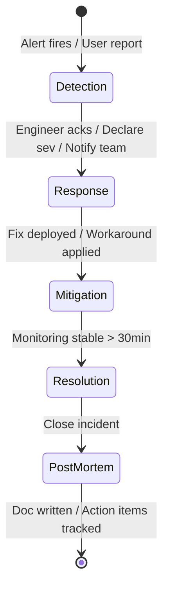
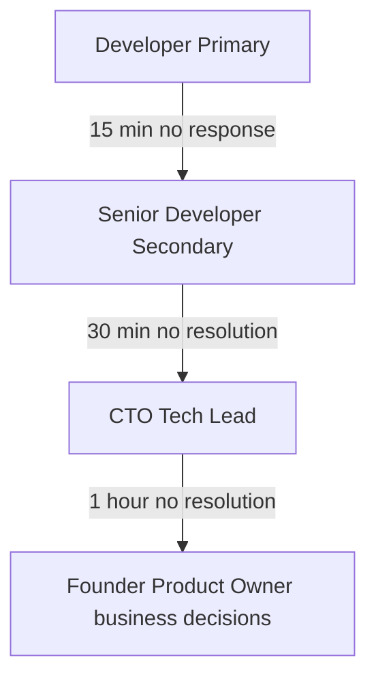
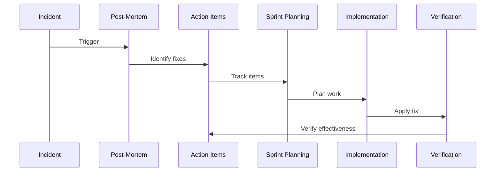

# Incident Response

## Document Control

| Metadata | Value |
|----------|-------|
| **Document ID** | OPS-040 |
| **Version** | 2.0 |
| **Status** | Approved |
| **Classification** | Internal — Operations |
| **Owner** | SRE / Platform Engineering |
| **Last Updated** | 2026-06-11 |
| **Review Cycle** | Quarterly |
| **Next Review** | 2026-09-11 |
| **Approved By** | CTO / Tech Lead |

---

## Executive Summary

### Purpose
This document defines the enterprise incident response framework for Second Brain OS. It establishes standardized processes for detecting, responding to, mitigating, and learning from production incidents across all system components (API, database, AI agents, scheduler, and frontend).

### Scope
Applies to all production environments (staging and production). Covers all services: Next.js frontend, FastAPI backend, Supabase database, Supabase Edge Functions, AI services (Ollama / Claude), scheduler, notification services (Web Push / Resend / Twilio), and third-party API integrations.

### Stakeholders
| Role | Incident Response Responsibility |
|------|--------------------------------|
| On-Call Engineer (Primary) | First responder — acknowledge, investigate, triage |
| On-Call Engineer (Secondary) | Backup responder, assist with investigation |
| CTO / Tech Lead | Escalation point, business-impact decisions |
| Product Owner | User communication, feature prioritization for fixes |
| Security Lead | Security-related incidents (breach, data loss) |

### Key Metrics (Targets)

| Metric | Target | Measurement |
|--------|--------|-------------|
| MTTD (Mean Time to Detect) | < 5 min for SEV-1 | Alert → Acknowledge |
| MTTR (Mean Time to Resolve) | < 2 hr for SEV-1 | Alert → Resolution |
| MTBF (Mean Time Between Failures) | > 14 days | Rolling 90-day window |
| SLA Compliance | > 99.5% uptime | Monthly calculation |
| Post-Mortem Completion | Within 5 business days | SEV-1/SEV-2 incidents |

---

## Incident Lifecycle (5 Phases)



### Phase 1: Detection

**Trigger Sources:**
| Source | Examples | Typical Latency |
|--------|----------|-----------------|
| Automated alerting | 5xx spike, DB connection failure, cron missed | < 1 min |
| Synthetic monitoring | Heartbeat check, health endpoint | < 1 min |
| User report | Support email, Discord, Twitter | 5-30 min |
| Log analysis | Error rate increase in logs | 5-15 min |
| Security scanner | Intrusion detection, anomaly | < 5 min |

**Actions:**
1. Acknowledge the alert or report
2. Verify it is a genuine incident (not a false positive)
3. Determine initial severity
4. Create incident channel/ticket with timestamp

### Phase 2: Response

**Actions:**
1. Declare the incident with severity level
2. Notify stakeholders per severity communication plan
3. Set up incident channel (Slack/Discord) with all responders
4. Begin investigation — gather logs, metrics, traces
5. Record timeline entries as investigation progresses
6. Update status page if applicable

### Phase 3: Mitigation

**Actions:**
1. Identify the immediate fix, workaround, or containment strategy
2. Apply the fix or rollback to last known good state
3. Verify the fix is effective (monitor for 5-10 minutes)
4. Communicate resolution status to stakeholders
5. If fix is temporary, document permanent fix needed

### Phase 4: Resolution

**Actions:**
1. Confirm system is stable for sustained period (30+ min for SEV-1, 15+ min for lower)
2. Close the incident
3. Send final resolution communication
4. Update incident dashboard with duration and resolution

### Phase 5: Post-Mortem

**Actions:**
1. Schedule post-mortem within 5 business days for SEV-1/SEV-2
2. Complete post-mortem document
3. Assign action items with owners and due dates
4. Track action items to closure
5. Update runbooks and documentation

---

## Incident Response Team Structure

### Role Definitions (Solo Dev Context)

Even in a solo-dev environment, each role represents a hat to wear and specific actions to take:

| Role | Responsibility | Solo Dev Equivalent |
|------|---------------|-------------------|
| **Incident Commander (IC)** | Owns the incident end-to-end; coordinates response, communication, decision-making | The developer, wearing the command hat |
| **Scribe** | Records timeline of events, actions taken, decisions made | Use a dedicated Slack/Discord channel or a local markdown file |
| **Technical Lead** | Investigates root cause, designs fix | The developer, wearing the technical hat |
| **Communications Lead** | Updates stakeholders, status page, users | Pre-written templates + auto-notification |
| **Subject Matter Expert (SME)** | Deep expertise in affected area | Self-refer to specific docs/runbooks |

### On-Call Schedule

| Day | Primary | Secondary | Escalation |
|-----|---------|-----------|------------|
| Mon-Wed | Dev A | Dev B | CTO |
| Thu-Sat | Dev B | Dev C | CTO |
| Sunday | Dev C | Dev A | CTO |

**On-Call Responsibilities:**
- Acknowledge alerts within response time
- Investigate and diagnose the incident
- Apply fix or workaround
- Communicate status updates
- Document incident in the runbook

**On-Call Handoff Procedure:**
1. Review open incidents and ongoing investigations
2. Review recent alerts (last 24h)
3. Check for upcoming deployments or maintenance windows
4. Update on-call handoff doc with context

---

## Severity Levels

### SEV-1: Critical (System Down)
**Definition**: Complete service unavailability. Users cannot login, access data, or use core features.

**Response Time**: 15 minutes
**Resolution Time**: < 2 hours
**Notification**: Email + SMS to on-call engineer
**Update Frequency**: Every 30 minutes

Examples:
- Auth service completely down (no logins possible)
- Database unreachable (all pages return 500)
- Data loss or corruption detected
- Security breach or unauthorized access

### SEV-2: Major (Degraded Experience)
**Definition**: Core features unavailable or severely degraded. Users can login but major functionality broken.

**Response Time**: 30 minutes
**Resolution Time**: < 4 hours
**Notification**: Email to engineering team
**Update Frequency**: Every 2 hours

Examples:
- Scheduler cron jobs failing consistently
- AI service (ARIA) unresponsive
- One major module completely broken (e.g., Task Manager)
- API response times > 3s for all endpoints
- PWA not installable

### SEV-3: Minor (Partial Degradation)
**Definition**: Non-critical feature broken or degraded. Workaround available.

**Response Time**: 2 hours
**Resolution Time**: < 24 hours
**Notification**: Slack/Teams message
**Update Frequency**: Daily

Examples:
- One feature has visual glitch (e.g., dashboard heatmap missing)
- Lighthouse score drops below 80
- Browser extension not saving correctly
- Email notifications delayed
- Search not returning all results

### SEV-4: Low (Cosmetic / QoL)
**Definition**: Cosmetic issues, minor bugs, quality-of-life improvements.

**Response Time**: Next business day
**Resolution Time**: Next sprint
**Notification**: None (tracked in backlog)
**Update Frequency**: Weekly

Examples:
- Typo in UI text
- CSS alignment issue on one screen size
- Missing loading state on a rarely-used feature
- Non-critical console warning

---

## Response Times

| Severity | Response Time | Update Frequency | Resolution Target |
|----------|--------------|------------------|-------------------|
| SEV-1    | 15 min       | Every 30 min     | < 2 hours         |
| SEV-2    | 30 min       | Every 2 hours    | < 4 hours         |
| SEV-3    | 2 hours      | Daily            | < 24 hours        |
| SEV-4    | Next day     | Weekly           | Next sprint       |

---

## Escalation Paths

### Standard Escalation


### Specific Escalation Matrix

| Issue Type | L1 (15min) | L2 (45min) | L3 (2hr) |
|------------|------------|------------|----------|
| Auth down | Dev on-call | Auth specialist | CTO |
| Database issue | Dev on-call | DB specialist | CTO |
| Security breach | Dev on-call | CTO | Legal (if needed) |
| AI failure | Dev on-call | AI/ML engineer | CTO |
| Frontend broken | Dev on-call | Frontend lead | CTO |
| Data loss | Dev on-call | DB specialist | CTO + Founder |

### Timeout Escalation Rules

If a responder does not acknowledge within the severity response time:
1. Primary misses SEV-1 15min ack → Auto-escalate to Secondary
2. Secondary misses 15min → Auto-escalate to CTO
3. CTO misses 15min → Auto-escalate to Founder

---

## Communication Templates

### SEV-1 Critical Templates

**SEV-1 Initial Alert (SMS/Email)**
```
SUBJECT: [SEV-1] CRITICAL: {service_name} is DOWN
BODY:
Impact: {description of user impact}
Detected at: {timestamp}
Affected: {% of users affected}
Sev: SEV-1
Action: Investigating - next update in 30 min
On-call: {engineer_name} - {phone}
Priority: CRITICAL - acknowledge immediately
```

**SEV-1 Status Update (Email)**
```
SUBJECT: [SEV-1] UPDATE #{n}: {service_name} - {status}
BODY:
Status: {Investigating / Mitigating / Resolved / Monitoring}
Current Impact: {updated impact description}
Root Cause: {if known}
ETA: {estimated resolution time}
Action Taken: {what has been done so far}
Next Update: {time}
```

**SEV-1 Resolution (Email)**
```
SUBJECT: [SEV-1] RESOLVED: {service_name}
BODY:
Incident Duration: {start_time} to {end_time}
Root Cause: {root cause summary}
Fix Applied: {description of fix}
Verification: {how we verified the fix}
Post-Mortem: {link to post-mortem doc scheduled}
```

### SEV-2 Major Templates

**SEV-2 Initial Alert (Email)**
```
SUBJECT: [SEV-2] {service_name} - Degraded
BODY:
Impact: {description of user impact}
Detected at: {timestamp}
Sev: SEV-2
Action: Investigating - next update in 2 hours
Assigned: {engineer_name}
```

**SEV-2 Resolution (Email)**
```
SUBJECT: [SEV-2] RESOLVED: {service_name}
BODY:
Issue: {description}
Duration: {start} to {end}
Fix: {description of fix}
```

### SEV-3 Minor Templates

**SEV-3 Notification (Slack/Discord)**
```
[SEV-3] {feature} - {issue description}
Impact: {minor impact description}
Assigned: {engineer_name}
Target fix: {next deploy or sprint}
```

### Public Status Page Messages

```
[INVESTIGATING] We are investigating reports of {issue}.
Users may experience {impact}. We will provide updates as available.

[IDENTIFIED] We have identified the cause of {issue}.
{root cause description}. We are working on a fix.

[MONITORING] We have deployed a fix for {issue}.
We are monitoring the results.

[RESOLVED] The issue with {issue} has been resolved.
All systems are operating normally.
```

---

## Post-Mortem Process

### When to Conduct
- **Mandatory**: All SEV-1 incidents
- **Mandatory**: SEV-2 incidents with significant user impact (>10% of users)
- **Mandatory**: Any incident that results in data loss or security concern
- **Recommended**: Recurring SEV-3 incidents (same issue 3+ times)

### Timeline

| Step | When | Owner | Duration |
|------|------|-------|----------|
| Incident closed | T+0 | IC | — |
| Draft post-mortem started | T+24h | IC | 1 hour |
| Peer review | T+48h | Secondary | 30 min |
| Finalized | T+72h | IC | — |
| Action items assigned | T+96h | IC | — |
| Retrospective meeting | T+5 days | All | 1 hour |

### 5 Whys Root Cause Analysis Template

```
5 Whys Analysis
─────────────────────────────────────────────────────
Incident: {title}
Date: {YYYY-MM-DD}

Problem Statement:
{What went wrong, from the user's perspective}

Why #1: {Immediate technical cause}
  Why #2: {Underlying system condition}
    Why #3: {Process or configuration gap}
      Why #4: {Decision or oversight}
        Why #5: {Systemic root cause}

Root Cause: {One-sentence summary of Why #5}

Systemic Category: {Code / Config / Process / People / External}
```

### Post-Mortem Template

```markdown
# Post-Mortem: {Incident Title}

## Overview
- Date: {YYYY-MM-DD}
- Duration: {X hours Y minutes}
- Severity: {SEV-1 / SEV-2}
- Impact: {# users affected, what they experienced}
- Detection: {how incident was discovered}
- MTTD: {X min}
- MTTR: {X min}

## Timeline (UTC)
| Time | Event |
|------|-------|
| 09:15 | First error observed |
| 09:17 | PagerDuty alert triggered |
| 09:20 | Engineer acknowledged |
| 09:35 | Root cause identified |
| 10:00 | Fix deployed |
| 10:15 | Monitoring confirmed resolution |

## 5 Whys Root Cause Analysis
**Problem**: {What went wrong}

1. Why did {symptom} happen? → {answer}
2. Why did {cause #1} happen? → {answer}
3. Why did {cause #2} happen? → {answer}
4. Why did {cause #3} happen? → {answer}
5. Why did {cause #4} happen? → {answer}

**Root Cause**: {Systemic root cause}

## Contributing Factors
- Factor 1: {description}
- Factor 2: {description}

## Resolution
- {Steps taken to resolve}
- {Workarounds applied}

## Lessons Learned
### What Went Well
- {Positive aspects of response}
- {What worked in the process}

### What Went Wrong
- {Failures in detection, response, or resolution}
- {Process gaps}

### Action Items
| # | Action | Owner | Due Date | Status |
|---|--------|-------|----------|--------|
| 1 | {action item} | {owner} | {YYYY-MM-DD} | {Open/In Progress/Done} |
| 2 | {action item} | {owner} | {YYYY-MM-DD} | {Open/In Progress/Done} |

## Preventative Measures
- {Monitoring to add}
- {Tests to write}
- {Process changes}
- {Documentation updates}

## Metrics
- MTTD: {minutes}
- MTTR: {minutes}
- User Impact: {X users affected for Y minutes}
- Data Loss: {Yes/No — details if yes}
```

---

## Incident Metrics

### Definitions

| Metric | Definition | Formula |
|--------|------------|---------|
| **MTTD** (Mean Time to Detect) | Average time from incident start to first alert/acknowledgement | Sum of detection times / Number of incidents |
| **MTTR** (Mean Time to Resolve) | Average time from alert to resolution | Sum of resolution times / Number of incidents |
| **MTBF** (Mean Time Between Failures) | Average uptime between incidents | Total uptime / Number of incidents |
| **MTTA** (Mean Time to Acknowledge) | Average time from alert to engineer ack | Sum of (ack_time - alert_time) / Incidents |
| **SLA Compliance** | Percentage of uptime meeting the 99.5% target | (Total time - Downtime) / Total time × 100 |
| **Incident Rate** | Incidents per week/month | Count of incidents / Time period |

### Tracking Table

```sql
CREATE TABLE incident_metrics (
  id UUID PRIMARY KEY DEFAULT gen_random_uuid(),
  incident_id TEXT NOT NULL,
  severity TEXT NOT NULL,
  detected_at TIMESTAMPTZ NOT NULL,
  acknowledged_at TIMESTAMPTZ,
  mitigated_at TIMESTAMPTZ,
  resolved_at TIMESTAMPTZ,
  mttd_minutes INTEGER,
  mtta_minutes INTEGER,
  mttr_minutes INTEGER,
  users_affected INTEGER,
  data_loss BOOLEAN DEFAULT FALSE,
  root_cause_category TEXT,
  created_at TIMESTAMPTZ DEFAULT NOW()
);
```

### Dashboard: Incident Metrics

```
Panel 1: MTTD Trend              — line chart, 30-day rolling average
Panel 2: MTTR Trend              — line chart, 30-day rolling average
Panel 3: MTBF                    — gauge, current days since last incident
Panel 4: Incidents by Severity   — bar chart, SEV-1/2/3/4 per month
Panel 5: Incidents by Category   — pie chart, root cause categories
Panel 6: SLA Uptime              — gauge, current month uptime %
Panel 7: Active Incidents        — table, currently open incidents
Panel 8: Post-Mortem Completion  — gauge, % completed within 5 days
```

### SLA Targets

| Metric | Target | Critical Threshold | Measurement Window |
|--------|--------|-------------------|-------------------|
| Uptime | > 99.5% | < 99.0% | Monthly |
| SEV-1 MTTR | < 2 hours | > 4 hours | Rolling 30 days |
| SEV-2 MTTR | < 4 hours | > 8 hours | Rolling 30 days |
| Post-Mortem Completion | 5 business days | > 10 days | Per-incident |
| Action Item Closure | 90% within sprint | < 70% | Monthly |

---

## Common Incident Scenarios

### Scenario 1: Database Connection Lost
**Symptoms**: All API endpoints returning 500, health check shows database unhealthy.

**Check**:
```bash
curl -s https://api.ariaos.app/api/health | python -c "import sys,json; print(json.load(sys.stdin)['checks']['database']['status'])"
```

**Cause**: Supabase project paused (free tier), connection pool exhausted, network issue.

**Fix**:
1. Check Supabase dashboard - is project active? https://app.supabase.com
2. If paused, unpause from dashboard
3. Check connection limits in project settings
4. If pool exhausted, queries will auto-retry (retry.py has backoff)

**Prevention**:
- Monitor DB connection count
- Set up periodic health check that pings DB
- Keep Supabase project active with daily cron

### Scenario 2: Auth Service Failure
**Symptoms**: Users cannot login, get 401 errors, session management broken.

**Check**:
```bash
curl -s -X POST https://api.ariaos.app/api/auth/login -d '{"provider":"google"}' -v
```

**Cause**: Google OAuth config changed, Supabase auth settings modified, JWT secret rotated.

**Fix**:
1. Verify Google OAuth credentials in Supabase dashboard
2. Check that redirect URIs are correct
3. Verify JWT_SECRET hasn't changed
4. Roll back any recent auth config changes

**Prevention**:
- Do not change auth config without testing on staging
- Document all OAuth providers and their settings

### Scenario 3: Scheduler Stuck
**Symptoms**: Daily briefing not delivered, opportunity radar not running.

**Check**:
```bash
tail -n 50 logs/scheduler.log
# Look for repeated errors or long gap in timestamps
```

**Cause**: Python process crashed, memory exhausted, infinite loop.

**Fix**:
```bash
# Check if process is running
ps aux | grep scheduler

# Kill and restart
kill -9 <PID>
cd services/scheduler && python main.py

# Check for memory leak
python -c "
import psutil
p = psutil.Process()
print(f'Memory: {p.memory_info().rss / 1024 / 1024:.1f} MB')
"
```

**Prevention**:
- Add process supervisor (systemd or PM2)
- Monitor scheduler process health
- Add memory usage alerts

### Scenario 4: AI Service Degraded
**Symptoms**: ARIA responses slow, empty, or error messages.

**Check**:
```bash
# Check Ollama first
curl -s http://localhost:11434/api/tags

# Check Claude fallback
curl -s https://api.anthropic.com/v1/messages \
  -H "x-api-key: $CLAUDE_API_KEY" \
  -H "anthropic-version: 2023-06-01" \
  -H "content-type: application/json" \
  -d '{"model":"claude-3-haiku-20240307","max_tokens":10,"messages":[{"role":"user","content":"test"}]}'
```

**Fix**:
```bash
# Restart Ollama
ollama serve

# Check available models
ollama list
# Pull missing models
ollama pull llama3.1

# Switch to Claude fallback if Ollama is down long-term:
export USE_LOCAL_AI=false
```

**Prevention**:
- Auto-fallback to Claude when Ollama fails
- Model health check in scheduler
- Cache common AI responses

### Scenario 5: Free Tier Limits Exceeded

**Symptoms**: Supabase throws storage/bandwidth exceeded errors, Resend stops sending, Vercel shows bandwidth warnings.

**Check**:
```python
# Supabase dashboard: Settings > Database > Storage
# Resend dashboard: Usage
# Vercel dashboard: Usage
# Claude API: console.anthropic.com

# Application-level check in cost_monitor cron
```

**Fix**:
- **DB size > 500MB**: Archive old analytics data, delete unused test data
- **Bandwidth > 100GB**: Optimize images, enable CDN caching
- **Emails > 3000**: Reduce notification frequency, batch digests
- **Claude credits > $5**: Increase Ollama usage, reduce Claude calls

**Prevention**:
- All cost monitoring implemented
- Auto-alerts at 80% threshold
- Monthly cost review

### Scenario 6: Deployment Failure

**Symptoms**: Vercel deploy fails, new version not live, build errors.

**Check**:
```bash
# Check Vercel deploy logs
npx vercel logs

# Check build locally
cd apps/web && npm run build
```

**Fix**:
1. Check build logs for errors
2. Fix reported issues (usually TypeScript errors or missing dependencies)
3. If urgent, revert to previous deploy: `npx vercel rollback`
4. Verify rollback successful

**Prevention**:
- Run lint + type-check before pushing
- Use PR preview deployments
- Never deploy on Friday evening

---

## Tabletop Exercise Plan

### Purpose
Quarterly tabletop exercises validate the incident response process, test runbook accuracy, and build muscle memory for incident handling.

### Exercise Format

| Component | Duration | Description |
|-----------|----------|-------------|
| Scenario Briefing | 5 min | Facilitator reads the scenario |
| Incident Play | 30 min | Team responds in real-time, out loud |
| Debrief | 15 min | Discuss what went well, what was unclear |
| Action Items | 10 min | Capture improvements |

### Exercise Scenarios (Rotate Quarterly)

| Quarter | Scenario | Focus Area |
|---------|----------|------------|
| Q1 | Database unreachable | Backend + DB runbook |
| Q2 | Security breach detected | Security + communication |
| Q3 | AI agent producing bad output | AI monitoring + rollback |
| Q4 | Full stack outage (deployment gone wrong) | Multi-service coordination |

### Exercise Template

```markdown
# Tabletop Exercise: {Scenario Name}
Date: {YYYY-MM-DD}
Facilitator: {name}

## Scenario
{2-3 paragraphs describing the incident scenario}

## Script
1. Facilitator: "At {time}, {event happens}. What do you do?"
2. IC: {response}
3. Facilitator: "Now {new development}. How does this change your response?"
4. ...

## Notes
- {Interesting decisions or observations}
- {Gaps identified in runbooks}

## Action Items
| Action | Owner | Due |
|--------|-------|-----|
| {fix identified gap} | {owner} | {date} |
```

---

## Continuous Improvement

### Feedback Loop



### Action Item Lifecycle

1. **Capture**: Action items identified during post-mortem are recorded in the project management system
2. **Classify**: Each item gets a type — Monitoring, Testing, Process, Documentation, Code
3. **Prioritize**: Items are prioritized based on risk reduction
4. **Assign**: Owner and due date assigned during the retrospective
5. **Track**: Status tracked weekly during team sync
6. **Verify**: Completed items are reviewed for effectiveness after implementation
7. **Close**: Items closed only after verification

### Improvement Categories

| Category | Example Items | Review Frequency |
|----------|---------------|-----------------|
| **Monitoring Gaps** | Add dashboard panel, new alert rule, log more context | Monthly |
| **Testing Gaps** | Add integration test, chaos experiment, load test | Sprintly |
| **Process Gaps** | Update runbook, improve handoff, clarify escalation | Quarterly |
| **Documentation** | Update runbook, add scenario, improve template | Per-incident |
| **Code/Architecture** | Add retry logic, circuit breaker, improve error handling | Backlog |

### Monthly Review Cadence

| Week | Activity | Participants |
|------|----------|-------------|
| Week 1 | Review previous month's incidents and action items | Engineering team |
| Week 2 | Update runbooks based on lessons learned | On-call engineers |
| Week 3 | Test alerting rules (tweak thresholds if needed) | SRE |
| Week 4 | Quarterly tabletop exercise (Q1-Q4) | Full team |

---

## Incident Dashboard

### Current Incident Status
```
Type: SEV-2 | Auth Degraded | Investigating
Started: 2026-06-11 09:15 UTC
Duration: 45 min
Engineer: Dev A
Next Update: 10:00 UTC
```

### Recent Incidents
| Date | Sev | Duration | Issue | Resolution | MTTD | MTTR |
|------|-----|----------|-------|------------|------|------|
| 2026-06-10 | SEV-3 | 1.5h | Scheduler missed | Restarted scheduler | 12 min | 90 min |

---

## Improvement Tracking

Incidents drive system improvements:

| Incident | Action Item | Status | Due |
|----------|-------------|--------|-----|
| Auth outage - 2026-06-01 | Add auth health check | Done | S2 |
| Slow queries - 2026-05-28 | Add composite indexes | In progress | S3 |
| Scheduler crash - 2026-05-20 | Add process supervisor | Backlog | S5 |

---

## Training & Drills

- **Monthly**: Table-top exercise (review past incidents)
- **Quarterly**: Full drill (simulate SEV-1, practice response)
- **Onboarding**: New engineers shadow on-call for 2 weeks
- **Documentation**: Update runbooks after every incident

---

## Appendices

### Appendix A: Communication Template Quick Reference

| Severity | Channel | Template | Target Audience |
|----------|---------|----------|-----------------|
| SEV-1 Initial | SMS + Email | `[SEV-1] CRITICAL: {service} is DOWN` | On-call + CTO |
| SEV-1 Update | Email | `[SEV-1] UPDATE #{n}: {service} - {status}` | Engineering team |
| SEV-1 Resolution | Email | `[SEV-1] RESOLVED: {service}` | Engineering + stakeholders |
| SEV-2 Initial | Email | `[SEV-2] {service} - Degraded` | Engineering team |
| SEV-2 Resolution | Email | `[SEV-2] RESOLVED: {service}` | Engineering team |
| SEV-3 Notification | Slack/Discord | `[SEV-3] {feature} - {issue}` | Engineering team |
| Status Page | Public | Structured status messages | All users |

### Appendix B: Post-Mortem Checklist

- [ ] Incident timeline recorded (all timestamps UTC)
- [ ] 5 Whys root cause analysis completed
- [ ] Contributing factors identified
- [ ] "What went well" section filled
- [ ] "What went wrong" section filled
- [ ] Action items created with owners and due dates
- [ ] Preventative measures documented
- [ ] Runbooks updated (if applicable)
- [ ] Dashboard/alerting updated (if applicable)
- [ ] Post-mortem shared with team

### Appendix C: Metric Definitions Reference

| Metric | Full Name | Purpose | Formula | Target |
|--------|-----------|---------|---------|--------|
| MTTD | Mean Time to Detect | How fast we learn about problems | Σ(acknowledged_at - started_at) / n | < 5 min (SEV-1) |
| MTTA | Mean Time to Acknowledge | How fast responders pick up alerts | Σ(acknowledged_at - alert_at) / n | < 15 min (SEV-1) |
| MTTR | Mean Time to Resolve | How fast we fix problems | Σ(resolved_at - acknowledged_at) / n | < 2 hr (SEV-1) |
| MTBF | Mean Time Between Failures | How reliable the system is | Total uptime / n_incidents | > 14 days |
| SLA | Service Level Agreement | Contracted uptime percentage | (Total - Downtime) / Total × 100 | > 99.5% |

### Appendix D: Runbook Update Guidelines

After every SEV-1 or SEV-2 incident:
1. If the fix was not in any existing runbook → add a new scenario
2. If the fix was in a runbook but unclear → improve the runbook
3. If the fix was in a runbook but the engineer didn't find it → improve discoverability
4. If a new monitoring alert would have caught this sooner → add the alert

### Appendix E: Revision History

| Version | Date | Author | Summary of Changes |
|---------|------|--------|-------------------|
| 1.0 | 2026-01-15 | Platform Engineering | Initial incident response document |
| 1.1 | 2026-03-01 | Platform Engineering | Added AI service failure scenario |
| 2.0 | 2026-06-11 | Platform Engineering | Full enterprise upgrade: executive summary, 5-phase incident lifecycle, role definitions for solo dev, 5 Whys root cause analysis template, incident metrics (MTTD/MTTR/MTBF/SLA) with tracking table, tabletop exercise plan, continuous improvement feedback loop, communication templates for all severity levels, appendices with checklist and metric definitions |
