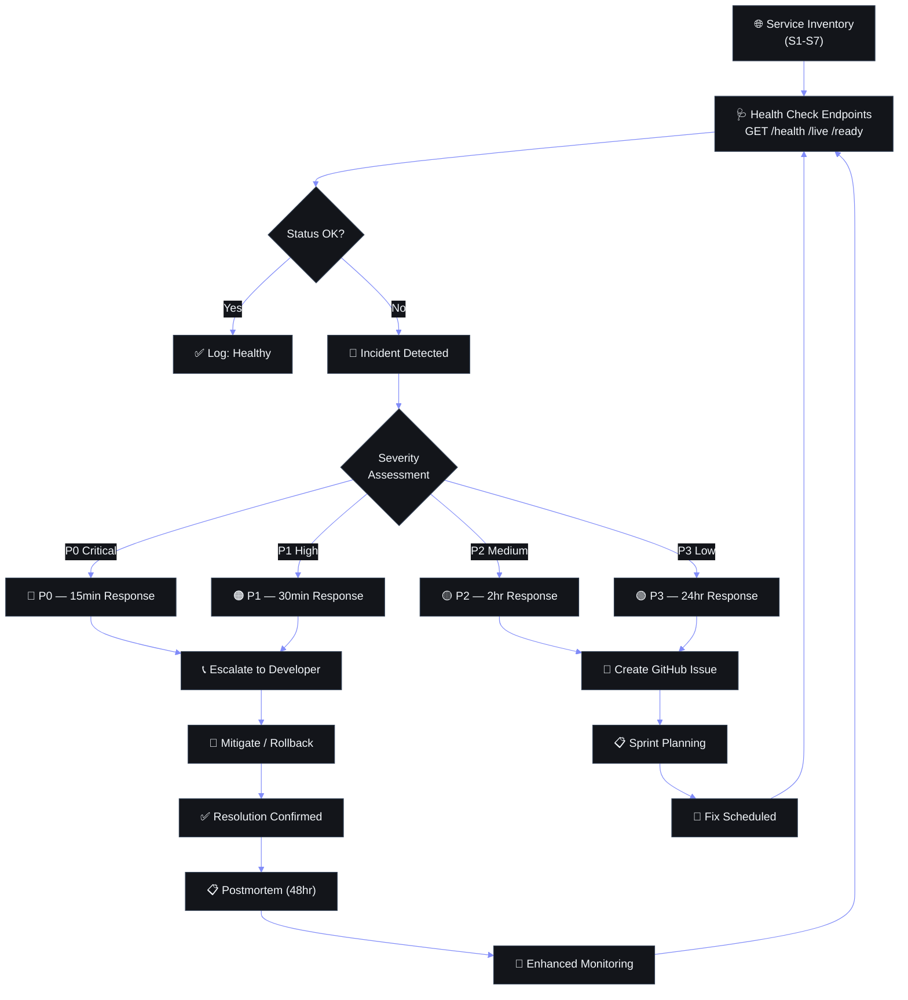

# Service Level Agreement (SLA) & Support Operations Plan

## Document Control

| Field | Value |
|---|---|
| Document ID | SB-SLA-001 |
| Version | 1.0.0 |
| Status | Draft |
| Classification | Internal — Confidential |
| Effective Date | 2026-06-11 |
| Next Review | 2026-09-11 |
| Owner | Developer (single maintainer) |
| Approval | Self-approved |

---

## 1. Executive Summary

### 1.1 Purpose

This Service Level Agreement (SLA) defines the performance commitments, availability targets, and support operations framework for Second Brain OS — a personal AI productivity system serving a single user/developer. While the system is designed for individual use, this document applies enterprise-grade SLA discipline to ensure reliability, accountability, and continuous improvement.

### 1.2 Scope

The SLA covers all production services listed in Section 2. It does not cover local development environments, experimental features, or third-party services beyond the control of this project.

### 1.3 Audience

**Primary:** The sole developer and user of Second Brain OS. All SLA commitments are made to and by the same individual. The purpose of this document is self-accountability — to formalize reliability targets and ensure the system meets professional standards despite being a solo project.

**Secondary:** Future contributors, employers, or portfolio reviewers evaluating the operational maturity of this project.

### 1.4 SLA Philosophy

This SLA recognizes a fundamental constraint: the project is maintained by a single individual with academic commitments (BTech CSE), operating on free-tier infrastructure. Commitments are realistic — they acknowledge that:

- Response times are best-effort during exams and personal events
- Free-tier services impose hard limits (Supabase 500MB, Resend 3000 emails/mo)
- Local AI (Ollama) availability depends on the developer's machine being powered on
- There is no 24/7 on-call rotation; response times reflect a single person's availability

Despite these constraints, the SLA targets industry-standard metrics wherever feasible, treating the single-developer reality as a constraint to be managed rather than an excuse for unreliability.

---



## 2. Service Definitions

### 2.1 Service Inventory

| # | Service | Description | Criticality | Dependencies | Hosting |
|---|---------|-------------|-------------|--------------|---------|
| S1 | Frontend | Next.js 14 application serving the web UI (React, Tailwind, Framer Motion, Three.js) | P1 | S2 (API), S3 (Database), S7 (Auth) | Vercel (Free Hobby) |
| S2 | Backend API | FastAPI/Python REST API serving 13+ modules (tasks, habits, courses, goals, etc.) | P0 | S3 (Database), S5 (AI), S6 (Email), S7 (Auth) | Railway (Free tier) |
| S3 | Database | Supabase PostgreSQL with Row-Level Security, all user data storage | P0 | None (leaf dependency) | Supabase (Free tier) |
| S4 | AI Services | ARIA chat agent, daily briefings, opportunity radar, weekly reviews | P1 | S2 (orchestrates calls), S3 (memory/context) | Ollama (local) / Claude API (fallback) |
| S5 | Scheduler | APScheduler cron jobs: briefings, radar, weekly review, uptime checks | P2 | S2 (API calls), S3 (reading/writing), S4 (AI), S6 (notifications) | Railway (same process as S2) |
| S6 | Email Notifications | Transactional emails via Resend API (briefings, alerts, reminders) | P2 | S2 (triggers), S3 (templates/queue) | Resend (Free tier) |
| S7 | Authentication | Google OAuth via Supabase Auth, JWT session management, RLS enforcement | P0 | S3 (user/session storage) | Supabase Auth (managed) |

### 2.2 Criticality Tier Definitions

| Tier | Label | Definition | Max Acceptable Downtime (per month) |
|---|---|---|---|
| P0 | Critical | Complete system failure. User cannot log in, access data, or use any core feature. | 30 minutes |
| P1 | High | Core features unavailable. Auth works but major functionality (AI, main modules) broken. | 2 hours |
| P2 | Medium | Non-critical features degraded. Workarounds exist. Background jobs or notifications failing. | 8 hours |
| P3 | Low | Cosmetic issues, minor bugs, quality-of-life improvements. No user workflow impact. | No commitment |

### 2.3 Service Dependency Map

```
                    ┌─────────────┐
                    │  S7: Auth   │
                    │  (Supabase) │
                    └──────┬──────┘
                           │ depends
                           v
┌──────────┐    ┌──────────────────┐    ┌──────────────┐
│  S1: Web │◄──►│   S2: Backend    │◄──►│  S3: DB      │
│ (Next.js)│    │   (FastAPI)      │    │ (PostgreSQL) │
└──────────┘    └────────┬─────────┘    └──────────────┘
                         │
              ┌──────────┼──────────┐
              v          v          v
        ┌─────────┐ ┌─────────┐ ┌─────────┐
        │ S4: AI  │ │ S5:     │ │ S6:     │
        │(Ollama/ │ │Scheduler│ │ Email   │
        │ Claude) │ │(APSched)│ │(Resend) │
        └─────────┘ └─────────┘ └─────────┘
```

**Failure Propagation:**
- S3 (DB) failure → S2, S1, S5, S6, S7 all fail → **P0**
- S7 (Auth) failure → S1, S2 all unreachable → **P0**
- S2 (API) failure → S1, S5, S6 fail → **P1** (S3, S7 unaffected)
- S4 (AI) failure → Only AI features degraded → **P1** (all CRUD unaffected)
- S5 (Scheduler) failure → Background jobs missed → **P2**
- S6 (Email) failure → Notifications delayed → **P2**
- S1 (Frontend) failure → API still serves, but UI unavailable → **P1**

### 2.4 Technology Stack Reference

| Component | Technology | Version | Runtime |
|---|---|---|---|
| Frontend framework | Next.js | 14 | Node.js 18+ |
| UI library | React | 18 | Node.js |
| Styling | Tailwind CSS | Latest | PostCSS |
| Animation | Framer Motion | Latest | JavaScript |
| 3D rendering | Three.js | Latest | WebGL |
| State management | Zustand | Latest | JavaScript |
| Backend framework | FastAPI | Latest | Python 3.10+ |
| Database | PostgreSQL (Supabase) | 15.x | Managed |
| AI (local) | Ollama | Latest | Local machine |
| AI (cloud) | Claude API | Latest | Anthropic |
| Scheduler | APScheduler | Latest | Python |
| Email | Resend API | Latest | Managed |
| Auth | Supabase Auth (Google OAuth) | Managed | Managed |
| Monitoring | BetterUptime + Custom cron | Free | Python |
| Logging | Custom JSON logger | — | Python |
| Cache | In-memory (TTL) | — | Python |

---

## 3. Service Level Objectives (SLOs)

### 3.1 SLO Targets

| Service | Metric | Target | Measurement Method | Reporting Period | Measurement Window |
|---|---|---|---|---|---|
| Frontend (S1) | Uptime | ≥ 99.5% | BetterUptime HTTP checks (1-min interval) | Monthly | Rolling 30 days |
| Frontend (S1) | Page Load (p95) | ≤ 3 seconds | Lighthouse / PerfMonitor (see `apps/web/lib/performance.ts`) | Monthly | Last 1000 loads |
| Frontend (S1) | Error Rate | < 1% of page views | Frontend error logger to Supabase analytics | Monthly | Last 1000 page views |
| Backend API (S2) | Uptime | ≥ 99.9% | BetterUptime HTTP checks (1-min interval) | Monthly | Rolling 30 days |
| Backend API (S2) | Response Time (p95) | ≤ 500 ms | Metrics middleware (`apps/api/middleware/metrics.py`) | Monthly | Last 1000 requests per endpoint |
| Backend API (S2) | Error Rate (5xx) | < 0.5% | Error handler + logger | Monthly | Rolling 30 days |
| Database (S3) | Uptime | ≥ 99.95% | Supabase status page + custom /api/health DB check | Monthly | Rolling 30 days |
| Database (S3) | Query Latency (p95) | ≤ 200 ms | Query tracker (`QueryTracker` middleware) | Monthly | Last 1000 queries |
| Database (S3) | Connection Availability | ≥ 99% | Health endpoint DB check | Monthly | Rolling 30 days |
| AI Services (S4) | Uptime (Claude fallback) | ≥ 99% | Health endpoint AI check | Monthly | Rolling 30 days |
| AI Services (S4) | Response Time (p95) | ≤ 10s (Claude) / ≤ 30s (Ollama) | API middleware timing | Monthly | Last 100 AI calls |
| AI Services (S4) | Fallback Activation | ≤ 30s to switch Ollama→Claude | Health check cron | Per event | N/A |
| Scheduler (S5) | Job Execution Rate | ≥ 98% on-time | Scheduler execution log to DB | Monthly | All scheduled jobs |
| Scheduler (S5) | Max Job Lag | ≤ 5 minutes | Compare scheduled vs actual execution time | Monthly | All delayed jobs |
| Email (S6) | Delivery Rate | ≥ 99% (Resend reported) | Resend dashboard delivery logs | Monthly | All sent emails |
| Email (S6) | Delivery Latency (p95) | ≤ 60 seconds | Application-sent vs Resend-accepted timestamp | Monthly | Last 100 emails |
| Auth (S7) | Uptime | ≥ 99.95% | Supabase status page | Monthly | Rolling 30 days |
| Auth (S7) | Login Success Rate | ≥ 99% | Auth event logging | Monthly | All login attempts |
| Auth (S7) | Session Validation (p95) | ≤ 200 ms | API middleware auth check timing | Monthly | Last 1000 validations |

### 3.2 SLO Calculation Methodology

**Uptime:** `(Total minutes in period - Downtime minutes) / Total minutes in period × 100`

- Downtime is measured from first failed health check to first successful health check after recovery
- Periods as short as 1 minute are counted (no grace period for brief blips)
- Scheduled maintenance with ≥ 24h notice is excluded from uptime calculation

**Response Time (p95):** The 95th percentile of all measured response times — meaning 95% of requests are faster than this value and 5% are slower. Calculated from the last 1000 data points per service.

**Error Rate:** `(Total error responses / Total requests) × 100`

- Frontend: JavaScript errors logged via `logger.warn`/`logger.error`
- Backend: HTTP 5xx responses
- Auth: Failed login/session validation attempts

### 3.3 SLO Burn Rate Policy

To prevent rapid SLO consumption, the following burn rate alerts trigger at:

| Burn Rate | Time to Exhaust SLO | Alert | Action |
|---|---|---|---|
| 10× (fast burn) | ~3 days | P1 incident | Immediate investigation |
| 2× (medium burn) | ~15 days | P2 incident | Investigation within 8 hours |
| 1× (slow burn) | ~30 days | P3 ticket | Scheduled review |

---

## 4. Uptime & Availability Guarantees

### 4.1 Per-Service Availability Targets

| Service | Monthly Target | Annual Target | Max Monthly Downtime |
|---|---|---|---|
| Frontend (Next.js on Vercel) | 99.5% | 99.0% | 3h 39m |
| Backend API (FastAPI on Railway) | 99.9% | 99.5% | 43m |
| Database (Supabase PostgreSQL) | 99.95% | 99.9% | 21m |
| AI Services (Claude fallback) | 99.0% | 98.0% | 7h 18m |
| Scheduler (APScheduler) | 98.0% | 97.0% | 14h 36m |
| Email (Resend) | 99.5% | 99.0% | 3h 39m |
| Auth (Supabase Auth) | 99.95% | 99.9% | 21m |

### 4.2 Combined System Availability

**Full System (all services operational):**
```
0.995 × 0.999 × 0.9995 × 0.99 × 0.98 × 0.995 × 0.9995 = 0.9576 ≈ 95.76%

Max monthly full-system downtime: ~30.8 hours
```

**Core System (P0 services: API + DB + Auth):**
```
0.999 × 0.9995 × 0.9995 = 0.998 ≈ 99.8%

Max monthly core downtime: ~1.4 hours
```

**Notes:**
- Combined availability is a theoretical worst-case — service failures are rarely correlated
- Supabase and Vercel have their own SLA commitments (Supabase: 99.95%, Vercel: 99.99%)
- Local Ollama AI is excluded from combined calculations (availability = developer's machine uptime)
- The 95.76% figure acknowledges the single-developer/free-tier reality; the core system target of 99.8% is where engineering effort is focused

### 4.3 Exclusions from Availability Calculation

The following are excluded from all availability calculations and SLA commitments:

1. **Scheduled Maintenance:** Announced at least 24 hours in advance (see Section 8)
2. **Emergency Maintenance:** Announced as soon as possible, duration capped at 2 hours
3. **Force Majeure:** Natural disasters, war, pandemic, government action, power grid failure, internet backbone disruption
4. **Third-Party Outages:** Supabase, Vercel, Railway, Anthropic (Claude), Resend, Google (OAuth), GitHub — any failure originating upstream of our control
5. **Local Dependencies:** Ollama AI unavailability when the developer's machine is off, sleeping, or on different network
6. **Free Tier Limits:** Service degradation caused by hitting free-tier caps (Supabase 500MB storage, Resend 3000 emails/mo, Vercel 100GB bandwidth)
7. **Self-Inflicted:** Downtime caused by the developer's own actions (debugging, experimental deploys, breaking changes)
8. **Beta/Experimental Features:** Any feature explicitly marked as "beta," "experimental," or "WIP" in the UI or codebase
9. **Network Issues:** Local ISP problems, DNS propagation delays, or client-side connectivity issues
10. **Client-Side Failures:** Browser compatibility, ad blockers, extensions, or local machine performance

### 4.4 Service Credits Structure

Since Second Brain OS is a free, self-hosted personal productivity system, traditional monetary credits are inapplicable. Instead, service credits take the form of **service extensions** — additional development attention, new features, or accelerated issue resolution.

| Monthly Uptime (Core System) | Service Credit |
|---|---|
| ≥ 99.8% | No credit (meets target) |
| 99.0% – 99.7% | 1 dedicated development session (2h) for feature requests |
| 95.0% – 98.9% | 2 development sessions + priority bug fix in next sprint |
| < 95.0% | Full week of reliability-focused improvements + post-mortem + public incident report |
| < 90.0% | Architecture review and migration planning session |

**Credit Claim Process:** Since the developer and user are the same person, credits are self-assessed during the monthly SLA review. No claim form is necessary — the developer simply acknowledges the shortfall in the review document and allocates the corresponding credit.

---

## 5. Incident Response & Support

### 5.1 Support Hours

| Day | Support Level | Rationale |
|---|---|---|
| Monday – Friday (09:00 – 22:00 IST) | Normal (standard response targets) | Developer is actively working on or near system |
| Monday – Friday (22:00 – 09:00 IST) | Best-effort (2× standard response times) | Off-hours, sleep |
| Saturday – Sunday (10:00 – 20:00 IST) | Best-effort | Weekend availability varies |
| Saturday – Sunday (20:00 – 10:00 IST) | Email-only (no guaranteed response) | Personal time |
| Exam weeks (as declared) | Email-only | Academic priority (see Section 8.4) |
| Public holidays (India) | Email-only | Personal time |

**Note:** As a single-developer project, "support hours" simply reflect the times when the developer is most likely to be available to respond to incidents. There is no separate support team.

### 5.2 Response & Resolution Targets by Severity

| Severity | Initial Response | Status Update Frequency | Resolution Target | Workaround Target |
|---|---|---|---|---|
| P0 (Critical) | ≤ 30 minutes | Every 30 minutes | ≤ 4 hours | ≤ 1 hour |
| P1 (High) | ≤ 2 hours | Every 2 hours | ≤ 8 hours | ≤ 4 hours |
| P2 (Medium) | ≤ 8 hours | Daily | ≤ 48 hours | ≤ 24 hours |
| P3 (Low) | ≤ 24 hours | Weekly (sprint cycle) | Next release | N/A (cosmetic) |

**Response Definition:** Initial acknowledgment of the incident — not necessarily resolution. This could be as simple as: "Incident acknowledged. Investigating."

**Resolution Definition:** Service restored to normal operation. A workaround that restores functionality counts as resolution; permanent fix may follow in a subsequent release.

**During Exam Periods:** All response and resolution targets are doubled during declared exam weeks.

### 5.3 How to Report Incidents

Since the user and developer are the same person, incident reporting is automated:

| Detection Method | Description | Examples |
|---|---|---|
| Automated monitoring | BetterUptime alerts + /api/health cron | HTTP 500, timeout, auth failure |
| Self-detection | Developer notices issue during normal use | UI glitch, missing data, slow response |
| Proactive monitoring | Periodic dashboard review | Cost threshold warnings, slow query detection |

**Self-Reporting Protocol:**
1. Developer observes issue or receives automated alert
2. Issue is logged in the incident tracker (`docs/operations/40_IncidentResponse.md`)
3. Severity is classified per Section 6
4. Response process begins per severity targets
5. Resolution is documented in the incident log

### 5.4 Escalation Matrix

As a single-developer project, the escalation matrix is intentionally flat:

| Level | Person | Availability | Escalation Trigger |
|---|---|---|---|
| L1 | Developer (self) | Per support hours | Initial incident acknowledgment |
| L2 | Cloud provider support (Supabase, Vercel, Railway) | Business hours / ticket-based | Issue is outside developer's control (infrastructure) |
| L3 | AWS/Azure/GCP (via cloud provider's own escalation) | 24/7 enterprise support (if available on plan) | Cloud provider infrastructure failure |

**Escalation Path by Incident Type:**

| Incident Type | L1 | L2 | Notes |
|---|---|---|---|
| Database corruption | Developer | Supabase Support | Open ticket with Supabase |
| Auth failure | Developer | Supabase Support | OAuth/SSO issues |
| Platform outage | Developer | Vercel / Railway | Status page check first |
| AI model failure | Developer | Anthropic Support | API key / billing issues |
| Email delivery | Developer | Resend Support | Delivery failure investigation |
| Security breach | Developer | Cloud provider + CERT-In (if applicable) | See incident response plan |

### 5.5 Communication Channels

| Channel | Purpose | Availability |
|---|---|---|
| Email (admin@ariaos.app) | Incident notifications, alerts | 24/7 (delivery) |
| SMS (SMS alert via future Twilio integration) | P0 critical alerts | 24/7 (planned) |
| Local terminal / TUI | Real-time status during development | During working hours |
| GitHub Issues | Bug tracking, feature requests | 24/7 |
| Status page (built-in `/status`) | Public system status | 24/7 (if services operational) |

---

## 6. Incident Severity Classification

### 6.1 Severity Definitions

#### P0 — Critical (System Down)

**Definition:** Complete service unavailability. Core data access is broken. User cannot log in, access personal data, or use any productivity feature. No workaround exists.

**Response Target:** ≤ 30 minutes | **Resolution Target:** ≤ 4 hours

**Concrete Examples for This System:**
- **Auth Failure:** Supabase Auth service unreachable; Google OAuth redirects return 500; no user can log in
- **Database Down:** Supabase PostgreSQL instance unreachable or corrupted; all API endpoints return 500; /api/health shows database unhealthy
- **Data Loss:** Accidental data deletion or corruption detected; critical user data (tasks, habits, courses) unrecoverable from primary storage
- **Security Breach:** Unauthorized access detected; API keys leaked; user data exfiltrated; session tokens compromised
- **Persistence Layer Failure:** All CRUD operations fail across all 13 modules; the system cannot read or write any user data

#### P1 — High (Degraded Experience)

**Definition:** Core features are unavailable or severely degraded. User can log in but major functionality is broken. A partial workaround may exist.

**Response Target:** ≤ 2 hours | **Resolution Target:** ≤ 8 hours

**Concrete Examples for This System:**
- **Frontend Unavailable:** Vercel deployment fails; Next.js app returns 500 or blank page; API is healthy but UI cannot render
- **API Partially Down:** One or more critical API routers returning errors (e.g., `/api/tasks` failing while other endpoints work)
- **Scheduler Failure:** APScheduler process crashed; daily briefing, opportunity radar, and weekly review all failing
- **AI Service Down (No Fallback):** Both Ollama (local) and Claude API (cloud) unavailable; AI chat, briefings, radar, and agent features all broken
- **Module Failure:** One major module completely broken (e.g., Task Manager returns errors, Habit Tracker cannot log entries)
- **API Performance Degradation:** Response times > 3 seconds for all endpoints; user experience significantly impacted
- **PWA Failure:** Service worker not installing; offline mode unavailable; app cannot be installed on devices

#### P2 — Medium (Partial Degradation)

**Definition:** Non-critical features are broken or degraded. A reasonable workaround exists. Core functionality is unaffected.

**Response Target:** ≤ 8 hours | **Resolution Target:** ≤ 48 hours

**Concrete Examples for This System:**
- **Email Notifications Delayed:** Resend API has intermittent failures; daily briefing emails arrive 2–4 hours late
- **AI Feature Intermittent:** Ollama is slow or unresponsive intermittently; Claude fallback works but response times exceed 15 seconds
- **Scheduler Job Missed:** One non-critical cron job fails (e.g., system health report email); other jobs execute normally
- **Search Degraded:** Full-text search across tasks/courses returns incomplete results or times out
- **One Feature Has Visual Glitch:** Dashboard heatmap fails to render; Three.js 3D background not loading; animation stuttering
- **Browser Extension Issue:** PWA save prompt not appearing; bookmarklet not correctly capturing current page
- **Lighthouse Score Drop:** Performance or accessibility score drops below 80 due to unoptimized asset or missing metadata

#### P3 — Low (Cosmetic / Quality of Life)

**Definition:** Cosmetic issues, minor bugs, or quality-of-life improvements. No impact on user workflow. No workaround needed.

**Response Target:** ≤ 24 hours | **Resolution Target:** Next release (sprint-based)

**Concrete Examples for This System:**
- **UI Typo:** Incorrect label, spelling error, or inconsistent terminology in the interface
- **CSS Alignment Issue:** Element misaligned on a specific screen size or browser (non-breaking)
- **Missing Loading State:** A rarely-used feature lacks a loading spinner or skeleton; appears to hang briefly
- **Console Warning:** Non-critical deprecation warning or unused variable in browser console
- **Documentation Error:** Outdated or incorrect information in documentation (non-functional)
- **Accessibility Minor:** Color contrast slightly below WCAG AA on non-critical element
- **Animation Glitch:** Framer Motion transition stutters on first load; Three.js background briefly flashes

### 6.2 Severity Mapping to Incident Response Doc

| SLA Severity | Incident Response Severity | Notes |
|---|---|---|
| P0 (Critical) | SEV-1 (Critical) | Direct mapping |
| P1 (High) | SEV-2 (Major) | Direct mapping |
| P2 (Medium) | SEV-3 (Minor) | Direct mapping |
| P3 (Low) | SEV-4 (Low) | Direct mapping |

### 6.3 Severity Upgrade/Downgrade Rules

- **Upgrade:** A P2 or P3 incident that remains unresolved past its resolution target must be escalated one severity level
- **Downgrade:** A P0 or P1 incident may be downgraded once a workaround is implemented that restores core functionality
- **Reclassification:** If new information changes the scope or impact of an incident, severity may be reclassified at any time
- **Same-User Note:** Since the user and developer are the same person, severity classification is a personal judgment call. When in doubt, classify higher and downgrade later.

---

## 7. Reporting & Review

### 7.1 SLA Performance Reports

A monthly SLA performance report is generated on the first day of each month covering the previous calendar month.

**Report Contents:**

| Section | Content | Source |
|---|---|---|
| Executive Summary | Did we meet SLOs this month? High-level pass/fail | Manual assessment |
| Service Availability | Uptime % per service, total downtime | BetterUptime + health check logs |
| SLO Attainment | Each SLO metric vs. target (pass/fail table) | Metrics middleware + logging |
| Incident Summary | All incidents by severity, total count, mean time to resolve | `40_IncidentResponse.md` log |
| Top Incidents | Top 5 incidents by duration/impact | Incident log |
| Maintenance Log | Scheduled and emergency maintenance events | Section 8 log |
| Trends | 3-month rolling trend for each SLO metric | Historical data |
| Credits Owed | Self-assessed service credits (if applicable) | Section 4.4 |
| Action Items | Improvements to implement next month | Developer's discretion |

**Report Format:** Markdown document stored at `docs/operations/sla_reports/{YYYY-MM}-sla-report.md`.

**Monthly Automation:** As much data as possible is auto-generated via monitoring cron jobs. The developer performs a manual review and writes commentary.

### 7.2 Service Review Meetings

Since this is a solo project, "meetings" are structured self-reviews.

| Review Type | Frequency | Duration | Focus |
|---|---|---|---|
| Monthly SLA Review | Monthly | 30 min | Previous month SLOs, incidents, credits |
| Quarterly Service Review | Quarterly | 1 hour | Trend analysis, architecture decisions, capacity planning |
| Annual SLA Revision | Annually | 2 hours | Full document revision, target adjustment, technology roadmap |

**Quarterly Review Agenda:**
1. Monthly SLA report highlights (past 3 months)
2. Incident trend analysis (are we improving?)
3. SLO target review (are targets too aggressive? too lenient?)
4. Capacity planning (are we approaching free-tier limits?)
5. Architecture changes needed (based on failure patterns)
6. SLA document amendments (if any)
7. Next quarter focus areas

**Quarterly Review Output:** `docs/operations/sla_reviews/{YYYY-QQ}-service-review.md`

### 7.3 SLA Revision Process

| Trigger | Process | Timeline |
|---|---|---|
| Scheduled annual revision | Full document review, stakeholder (self) approval | Before anniversary date |
| Quarterly review identifies changes | Targeted amendments to affected sections | Within 1 week of review |
| New service added | Create new service definition, SLOs, targets | Before service goes live |
| Service deprecated | Remove or archive service from document | Upon deprecation |
| Third-party SLA changes | Update targets to reflect provider changes | Within 2 weeks of provider change |
| Consistent SLO failure | SLO relaxation (if target was unrealistic) or improvement plan (if fixable) | After 3 consecutive misses |

**Revision Approval:** All revisions require a single comment in the revision history (Appendix E) acknowledging the change. No formal approval board exists.

### 7.4 Service Credit Calculation

| SLO Miss Condition | Credit Earned | Application |
|---|---|---|
| Core system (P0) uptime < 99.8% but ≥ 99.0% | 1 development session (2h) | Feature request of choice |
| Core system uptime < 99.0% but ≥ 95.0% | 2 development sessions + priority bug | Highest-priority open issue |
| Core system uptime < 95.0% | Full reliability sprint + post-mortem | Documented in public |
| Any single P0 SLO missed (response or resolution) | 1 development session | Feature request of choice |
| AI uptime < 99.0% (Claude fallback) for 3 consecutive months | AI architecture review | Scheduled review |
| 3+ P0 incidents in a single month | Full incident prevention sprint | Root cause analysis for each |

**Credit Expiry:** All service credits must be claimed within 90 days of being earned.

---

## 8. Maintenance Windows

### 8.1 Scheduled Maintenance Policy

| Aspect | Policy |
|---|---|
| Definition | Planned maintenance with known start/end time, scope, and expected impact |
| Minimum Notice | 24 hours for standard maintenance; 48 hours for breaking changes |
| Preferred Window | Saturdays 06:00–08:00 IST (lowest usage period) |
| Maximum Duration | 2 hours per maintenance window |
| Frequency | Maximum 2 scheduled maintenance events per month |
| Documentation | All maintenance events logged in `docs/operations/maintenance_log.md` |
| Communication | Email notification to admin@ariaos.app (self) + status page update |

**Scheduled Maintenance Types:**
- Database migration (schema changes, index creation, data backfill)
- Deployment of major releases (new features, breaking API changes)
- Dependency updates (Python packages, Node modules, security patches)
- Infrastructure upgrades (Vercel/Railway plan changes, domain changes)

**Procedure:**
1. Plan: Define scope, expected duration, rollback plan
2. Announce: Minimum 24h notice via email + status page
3. Execute: During maintenance window or preferred window
4. Verify: Run health checks and smoke tests
5. Post-Maintenance: Update maintenance log, note any issues
6. Rollback: If maintenance exceeds window or fails, revert immediately

### 8.2 Emergency Maintenance Policy

| Aspect | Policy |
|---|---|
| Definition | Unscheduled maintenance required to address a P0 or P1 incident |
| Notice | As soon as possible (retroactive if immediate action required) |
| Duration | Capped at 2 hours; if longer needed, escalate to full incident response |
| Communication | Status page update + email alert |
| Documentation | Logged in both incident response and maintenance log |

**Examples:**
- Security patch deployment (zero-day exploit)
- Database performance degradation requiring immediate index rebuild
- Expired SSL certificate renewal
- Free-tier limit breach requiring emergency data cleanup

**Post-Emergency:** Within 24 hours of conclusion, document:
1. What triggered the emergency
2. Why it wasn't caught by scheduled maintenance
3. Monitoring or alert improvements to prevent future emergencies

### 8.3 Maintenance Notification Timeline

| Type | Notice Period | Notification Method | Status Page Update |
|---|---|---|---|
| Scheduled (standard) | ≥ 24 hours | Email | Yes |
| Scheduled (breaking) | ≥ 48 hours | Email + calendar invite | Yes |
| Emergency | ASAP (may be retroactive) | Email (immediate) | Yes |
| Free-tier limit cleanup | ≥ 1 hour (automated) | Email (automated alert) | Optional |

### 8.4 Blackout Periods — Exam Weeks & Project Deadlines

The following periods are designated as **blackout periods** where no scheduled maintenance is performed, and incident response targets are relaxed (2× standard response/resolution times):

| Period | Typical Dates (IST Academic Calendar) | Type |
|---|---|---|
| Mid-semester exams | September (weeks 2–3) | Exams |
| End-semester exams | December (weeks 2–4) | Exams |
| Semester break | January (weeks 1–2) | Personal time |
| Mid-semester exams (even sem) | March (weeks 2–3) | Exams |
| End-semester exams (even sem) | May (weeks 2–4) | Exams |
| Summer break | June–July (flexible) | Personal time |
| Major project submission | As declared (min 1 week notice) | Project deadline |
| Personal events | As declared (min 48h notice) | Personal |

**Blackout Period Rules:**
1. No scheduled maintenance during blackout periods
2. Emergency maintenance only for P0 incidents
3. Response/resolution targets doubled for all severity levels
4. Developer will attempt daily 15-min health check during blackout
5. Automated monitoring continues normally (BetterUptime)
6. Blackout periods are declared in the SLA review document in advance

---

## 9. Security Commitments

### 9.1 Uptime Monitoring

| Monitoring Tool | Type | What It Monitors | Check Interval | Alerts To |
|---|---|---|---|---|
| BetterUptime | External | API/health, frontend homepage, status page | 1 minute | Email + SMS (future) |
| Custom health check cron | Internal | Database, Auth, Ollama, Cache (full stack) | 5 minutes | Email |
| Supabase built-in | Managed | Database connections, query performance, storage | Real-time | Supabase dashboard |
| Vercel analytics | Managed | Frontend performance, error rates, bandwidth | Real-time | Vercel dashboard |

**Health Check Endpoint:** `GET /api/health`
```json
{
  "status": "healthy",
  "timestamp": "2026-06-11T09:15:30Z",
  "checks": {
    "database": { "status": "healthy", "latency_ms": 12 },
    "supabase_auth": { "status": "healthy", "latency_ms": 45 },
    "ollama": { "status": "degraded", "latency_ms": null, "error": "Ollama not running" },
    "cache": { "status": "healthy", "entry_count": 127 }
  }
}
```

### 9.2 Vulnerability Disclosure

Since this is a personal project with a single user, the vulnerability disclosure process is simplified:

| Aspect | Policy |
|---|---|
| Reporting Channel | GitHub Issues (private) or email to admin@ariaos.app |
| Response Commitment | Acknowledgment within 48 hours |
| Fix Timeline | P0 (critical vuln): 24 hours; P1 (high): 1 week; P2/P3: next sprint |
| Disclosure | Fixes are applied directly; no public disclosure unless vulnerability affects dependencies |
| Scope | Application code, dependency chain, infrastructure configuration |

**Self-Disclosure:** The developer runs `npm audit` and `pip-audit` weekly to check for known vulnerabilities in dependencies.

### 9.3 Incident Notification Timeline

| Incident Type | Self-Notification | External Notification | Method |
|---|---|---|---|
| P0 (service down) | Immediate (automated alert) | N/A (single user) | BetterUptime alert |
| P0 (security breach) | Immediate | Cloud provider + relevant authorities (if applicable) | Email + SMS |
| Data loss detected | Immediate | N/A (self-notified) | Automated alert |
| Third-party breach (Supabase/Vercel/Anthropic) | Within 24 hours of provider notification | N/A | Provider email |
| Free-tier limit reached | Automated alert at 80% threshold | N/A | Cost monitor cron |

**Self-Notification Channels (Primary → Secondary):**
1. BetterUptime push notification (mobile)
2. Email alert (admin@ariaos.app)
3. SMS (future Twilio integration)

### 9.4 Data Backup Guarantees

Referenced from the Disaster Recovery Plan (`docs/operations/41_DisasterRecovery.md`):

| Data Class | RPO (Recovery Point Objective) | RTO (Recovery Time Objective) | Method |
|---|---|---|---|
| User data (tasks, habits, logs, entries) | ≤ 24 hours | ≤ 4 hours | Daily `pg_dump` to local storage |
| Auth data (users, sessions) | ≤ 5 minutes (Supabase managed) | ≤ 1 hour | Supabase Auth (managed) |
| AI memory / context | ≤ 24 hours | ≤ 8 hours | Supabase table backup |
| Source code | Real-time (per commit) | ≤ 1 hour | GitHub repository |
| Environment variables | Per change | ≤ 30 minutes | Encrypted `.env` file |
| Chat history | ≤ 7 days | ≤ 24 hours | Periodic JSON export |

**Backup Verification:**
- Automated backup integrity check runs daily (`scripts/verify_backup.sh`)
- Manual full restore drill performed quarterly
- Backup logs audited during monthly SLA review

### 9.5 Authentication Security

| Mechanism | Implementation | Notes |
|---|---|---|
| Google OAuth | Supabase Auth with Google provider | Single sign-on, no password storage |
| JWT Sessions | Supabase-managed JWTs with configurable expiry (default: 7 days) | Tokens stored in `httpOnly` cookies |
| Row-Level Security (RLS) | Supabase PostgreSQL policies on all tables | Every query filtered by `user_id` |
| Session Refresh | Auto-refresh via Supabase client SDK | Transparent to user |
| API Key Management | Environment variables stored in Railway/Vercel, never in source | Pre-commit hooks prevent accidental commits |
| Rate Limiting | 100 requests/min per IP (`packages/shared/utils/rate_limiter.py`) | Prevents brute force and abuse |

**Auth Security Commitments:**
- No plaintext secrets in source code (enforced via `.gitignore` + pre-commit hooks)
- JWT secrets are randomly generated, rotated if compromised
- RLS policies are mandatory on every new table (enforced via code review)
- Failed login attempts are logged and monitored
- Session tokens are invalidated on password/account changes

---

## 10. Limitations & Exclusions

### 10.1 Third-Party Dependencies

This SLA does not cover failures originating from the following third-party services. In the event of a third-party outage, the developer's commitment is limited to monitoring the provider's status page and restoring service as soon as the provider resolves the issue.

| Provider | Service | Typical Free-Tier SLA | Fallback Plan |
|---|---|---|---|
| Supabase | PostgreSQL database, Auth | 99.95% (Pro); no SLA on Free | Data is backed up locally (RPO: 24h); manual restore to alternative provider (Render, Neon) documented in DR plan |
| Vercel | Frontend hosting, CDN, Serverless functions | 99.99% (Pro); no SLA on Free Hobby | Rollback to previous deployment; local dev server as temporary fallback |
| Railway | Backend hosting, container runtime | No SLA on Free tier | Redeploy on Render or local machine; documented in DR plan |
| Anthropic (Claude) | AI API | Provider SLA applies | Fallback to Ollama (local) or algorithmic mode |
| Resend | Email delivery | Provider SLA applies | Emails queued locally; manual send via SMTP fallback |
| Google (OAuth) | Authentication provider | Provider SLA applies | No fallback; auth is unavailable until Google recovers |

**Provider Status Pages:**
- Supabase: https://status.supabase.com
- Vercel: https://vercel-status.com
- Anthropic: https://status.anthropic.com
- Resend: https://resend.com/status

### 10.2 Beta Features Disclaimer

Features explicitly marked as "Beta," "Experimental," "WIP," or "Preview" in the UI, documentation, or codebase are excluded from all SLA commitments. These features:

- May be incomplete, unstable, or change without notice
- May not have monitoring, backup, or recovery procedures
- May have reduced or no error handling
- May be removed at any time without prior notice
- Have no uptime, performance, or availability guarantees

**Current Beta Features (as of document version):** None declared. This section serves as a disclaimer for future experimental features.

### 10.3 Local AI (Ollama) Dependency

Ollama runs on the developer's local machine and is subject to:

- Machine being powered on and connected to the internet
- Machine not being used for resource-intensive tasks (gaming, compilation, video editing)
- Sufficient RAM and VRAM to load the selected model
- Local network connectivity
- Power availability (laptop battery / UPS)
- Operating system and driver compatibility

**Mitigations:**
- Automatic fallback to Claude API when Ollama is unreachable
- Automatic fallback to algorithmic mode if both AI providers are unavailable
- Graceful degradation — all non-AI features continue functioning normally

### 10.4 Force Majeure

Neither the developer nor the user (same person) shall be held liable for any delay or failure in service performance resulting from events outside reasonable control, including but not limited to:

- Natural disasters (earthquake, flood, storm, fire)
- War, terrorism, civil unrest
- Pandemic or public health emergency
- Government action, embargo, or sanction
- Power grid failure or blackout
- Internet backbone disruption or DNS attacks
- Acts of God

### 10.5 Free-Tier Limitations

Second Brain OS operates entirely on free-tier infrastructure. The following limitations are inherent to the chosen hosting model and are excluded from SLA commitments:

| Resource | Free-Tier Limit | Consequence of Exceeding | Monitoring |
|---|---|---|---|
| Supabase database storage | 500 MB | Database becomes read-only or paused | Cost monitor at 80% (400 MB) |
| Supabase bandwidth | 2 GB/day | API throttling or temporary suspension | Cost monitor |
| Vercel bandwidth | 100 GB/month | 503 errors or billing charge | Vercel dashboard |
| Resend emails | 3,000 emails/month | Emails silently dropped | Cost monitor at 80% (2,400) |
| Claude API credits | $5 / mo free trial | API returns 402 (payment required) | Cost monitor at 80% ($4) |
| Railway execution time | 500 hours/month | Service suspended until reset | Railway dashboard |

### 10.6 Additional Exclusions

- **Local Network:** Any issue caused by the user's ISP, router, DNS, or local network configuration
- **Client Software:** Browser compatibility issues not reproducible in Chrome/Firefox latest, ad blocker interference, corporate firewall restrictions
- **User Error:** Data loss or corruption caused by accidental deletion, misconfiguration, or misuse
- **Custom Modifications:** Any unofficial fork, patch, or modification of the codebase
- **End-of-Life Components:** Third-party dependencies that reach end-of-life (e.g., Python 3.9 when deprecated)

---

## 11. Appendices

### Appendix A: Service Component Dependency Map

```
                                ┌─────────────────────────────────────────────────────────────┐
                                │                    SECOND BRAIN OS                           │
                                │                  ┌───────────────────┐                      │
                                │                  │   S7: Supabase    │                      │
                                │                  │   Auth (P0)       │                      │
                                │                  └────────┬──────────┘                      │
                                │                           │                                 │
                                │                           v                                 │
                                │  ┌─────────────────────────────────────────────────────┐    │
                                │  │              S3: Supabase PostgreSQL (P0)          │    │
                                │  │  ┌──────┬──────┬──────┬──────┬──────┬──────┬──────┐│    │
                                │  │  │tasks │habits│courses│goals │ideas │income │...  ││    │
                                │  │  └──────┴──────┴──────┴──────┴──────┴──────┴──────┘│    │
                                │  └───────────────────┬─────────────────────────────────┘    │
                                │                      │                                      │
                                │                      v                                      │
                                │  ┌─────────────────────────────────────────────────────┐    │
                                │  │  S2: FastAPI Backend on Railway (P0)               │    │
                                │  │  ┌──────────┬──────────┬──────────┬──────────┐     │    │
                                │  │  │ REST API │ Rate     │ Error    │ Metrics  │     │    │
                                │  │  │ Routers  │ Limiter  │ Handler  │ Middleware│    │    │
                                │  │  └──────────┴──────────┴──────────┴──────────┘     │    │
                                │  └──────┬──────────────────────────────────┬──────────┘    │
                                │         │                                  │                │
                                │         v                                  v                │
                                │  ┌──────────────┐              ┌──────────────────┐        │
                                │  │ S5: Scheduler │             │ S4: AI Service   │        │
                                │  │ (APScheduler) │             │  ┌──────────┐   │        │
                                │  │  (P2)         │──────►──────│  │ Ollama   │   │        │
                                │  │               │             │  │ (Local)  │   │        │
                                │  └──────┬────────┘             │  ├──────────┤   │        │
                                │         │                      │  │  Claude  │   │        │
                                │         v                      │  │ (Cloud)  │   │        │
                                │  ┌──────────────┐              │  └──────────┘   │        │
                                │  │ S6: Resend   │              └──────────────────┘        │
                                │  │ Email (P2)   │                                         │
                                │  └──────────────┘                                         │
                                │                                                           │
                                │  ┌─────────────────────────────────────────────────────┐    │
                                │  │  S1: Next.js Frontend on Vercel (P1)               │    │
                                │  │  Pages │ Components │ Zustand │ Framer Motion │ 3D  │    │
                                │  └─────────────────────────────────────────────────────┘    │
                                └─────────────────────────────────────────────────────────────┘

External Dependencies (excluded from SLA):
  ┌────────────┐  ┌────────────┐  ┌───────────────┐  ┌──────────┐
  │ Google     │  │ Supabase   │  │ Anthropic     │  │ Resend   │
  │ OAuth      │  │ Infra      │  │ Claude API    │  │ API      │
  └────────────┘  └────────────┘  └───────────────┘  └──────────┘
```

### Appendix B: Escalation Contact Tree

```
┌──────────────────────────────────────────────────────────────┐
│                   ESCALATION CONTACT TREE                      │
│                      Second Brain OS                           │
├──────────────────────────────────────────────────────────────┤
│                                                                │
│  PRIMARY CONTACT (All Incidents)                               │
│  ┌──────────────────────────────────────────────────────────┐ │
│  │ Developer (Self)                                          │ │
│  │ Email: admin@ariaos.app                                   │ │
│  │ Phone: [On-file — set in env: ADMIN_PHONE]               │ │
│  │ Availability: Per Section 5.1 Support Hours               │ │
│  └──────────────────────────────────────────────────────────┘ │
│                     │                                          │
│                     v                                          │
│  CLOUD PROVIDER ESCALATIONS (Infrastructure Issues Only)       │
│  ┌──────────────┬──────────────────┬────────────────────────┐ │
│  │ Supabase     │ Vercel           │ Railway                │ │
│  │ Support:     │ Support:         │ Support:               │ │
│  │ supabase.com │ vercel.com       │ railway.app            │ │
│  │ /support     │ /support         │ /support               │ │
│  │ Account:     │ Account:         │ Account:               │ │
│  │ [Project Ref]│ [Email on file]  │ [Email on file]        │ │
│  └──────────────┴──────────────────┴────────────────────────┘ │
│                                                                │
│  API PROVIDER ESCALATIONS (Service-Specific)                   │
│  ┌──────────────┬──────────────────┐                           │
│  │ Anthropic    │ Resend           │                           │
│  │ (Claude)     │ (Email)          │                           │
│  │ support@     │ support@         │                           │
│  │ anthropic.com│ resend.com       │                           │
│  └──────────────┴──────────────────┘                           │
│                                                                │
│  INCIDENT FLOW:                                                │
│  1. Automated alert triggers (BetterUptime / cron)             │
│  2. Developer receives notification (email/SMS)                │
│  3. Developer acknowledges within severity target              │
│  4. Developer investigates and resolves                        │
│  5. If platform issue: escalate to cloud provider              │
│  6. Document in incident log + post-mortem (if applicable)     │
└──────────────────────────────────────────────────────────────────┘
```

### Appendix C: Incident Report Template

```markdown
# Incident Report: {INCIDENT_ID}

## 1. Overview
- **Date:** {YYYY-MM-DD}
- **Duration:** {X hours Y minutes}
- **Severity:** {P0 / P1 / P2 / P3}
- **Service Affected:** {S1–S7}
- **Detection Method:** {BetterUptime / Self-detected / Monitoring cron / User report}
- **Incident Commander:** Developer (self)

## 2. Timeline (IST)

| Time | Event |
|---|---|
| {HH:MM} | {First symptom / alert} |
| {HH:MM} | {Acknowledged} |
| {HH:MM} | {Root cause identified} |
| {HH:MM} | {Workaround applied} |
| {HH:MM} | {Fix deployed} |
| {HH:MM} | {Service restored} |
| {HH:MM} | {Monitoring confirmed} |

## 3. Impact
- **User Impact:** {Description of what the user experienced}
- **Data Loss:** {Yes/No — if yes, quantify}
- **Cascading Failures:** {List any secondary services affected}

## 4. Root Cause
{Detailed description of what caused the incident}

## 5. Resolution
{Steps taken to resolve. Include commands run, configs changed, code deployed}

## 6. Contributing Factors
- {Factor 1}
- {Factor 2}

## 7. Lessons Learned

### 7.1 What Went Well
- {Aspect 1}
- {Aspect 2}

### 7.2 What Went Wrong
- {Aspect 1}
- {Aspect 2}

### 7.3 Action Items

| # | Action | Owner | Due | Status |
|---|---|---|---|---|
| 1 | {Action description} | Developer | {YYYY-MM-DD} | {Open/In Progress/Done} |
| 2 | {Action description} | Developer | {YYYY-MM-DD} | {Open/In Progress/Done} |

## 8. Preventative Measures
- {Monitoring to add}
- {Tests to write}
- {Process changes}
- {Documentation updates}

## 9. SLO Impact
| Metric | Target | Actual | Miss? |
|---|---|---|---|
| {e.g., API Response Time p95} | ≤ 500 ms | {actual} | {Yes/No} |
| {e.g., API Uptime} | ≥ 99.9% | {actual} | {Yes/No} |

---

**Filed by:** Developer
**Date:** {YYYY-MM-DD}
**Attachments:** {Links to relevant logs, screenshots, PRs}
```

### Appendix D: SLA Credit Matrix

| Condition | Credit | Redemption |
|---|---|---|
| Core uptime ≥ 99.8% (met) | None | N/A |
| Core uptime 99.0% – 99.7% | 1 dev session (2h) | Feature request |
| Core uptime 95.0% – 98.9% | 2 dev sessions + priority bug | Feature + top bug fix |
| Core uptime < 95.0% | Full reliability sprint + post-mortem | Reliability improvements |
| P0 response time miss (> 30 min) | 1 dev session | Feature request |
| P0 resolution time miss (> 4h) | 1 dev session + root cause fix | Root cause fix prioritized |
| P1 response time miss (> 2h) | 1 dev session (same week) | Feature request |
| AI uptime < 99% for 3 consecutive months | AI architecture review | Architecture review |
| 3+ P0 incidents in a month | Incident prevention sprint | RCA for each incident |
| Any SLO missed 3 months running | SLO review + target adjustment | Section 7.3 revision process |
| Data loss incident | Data integrity sprint + backup reform | DR plan improvement |

**Credit Log:** All earned and redeemed credits are tracked in `docs/operations/sla_credits.md`.

### Appendix E: Revision History

| Version | Date | Author | Changes | Sections Affected |
|---|---|---|---|---|
| 1.0.0 | 2026-06-11 | Developer | Initial SLA document | All |
| — | — | — | — | — |
| — | — | — | — | — |

**Planned Review Schedule:**
| Review | Due Date | Type |
|---|---|---|
| Q3 2026 Service Review | 2026-09-11 | Quarterly |
| Annual SLA Revision | 2026-06-11 | Annual |
| Q4 2026 Service Review | 2026-12-11 | Quarterly |
| Q1 2027 Service Review | 2027-03-11 | Quarterly |

---

*This SLA is a living document. It reflects the reality of a single-developer, free-tier project while maintaining the rigor and structure of an enterprise operations plan. When in doubt, prioritize reliability over velocity, documentation over assumptions, and user experience over feature count.*

*— Developer, Second Brain OS*
