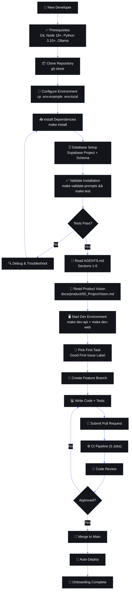

# Developer Onboarding & Environment Guide — Second Brain OS

## Document Control

| Field | Value |
|---|---|
| Document ID | SB-OPS-044 |
| Version | 1.0.0 |
| Status | Draft |
| Date | 2026-06-11 |
| Author | Engineering Team |
| Owner | Tech Lead |
| Review Cycle | Quarterly |

---

## 1. Introduction

### 1.1 Purpose

This guide gets a new developer from zero to running the full Second Brain OS stack in **under 2 hours**. It covers environment setup on Windows, repository configuration, service startup, verification, daily development workflow, and debugging.

Second Brain OS (ARIA OS) is a personal AI productivity system built for BTech CSE students. It replaces 12+ tools (Todoist, Notion, Calendar, ChatGPT, Habitica, etc.) with a single, unified platform powered by local AI.

### 1.2 System Overview



**Frontend (Next.js 14 + React 18):** A cyberpunk-themed single-page application with 15 modules — Tasks, Courses, Goals (with roadmap canvas), Habits, Sleep, Income, Projects, Ideas, Resources, Opportunities, Academics, YouTube Vault, Chat (ARIA), Time Tracking, and Automation. Pages are built with Tailwind CSS (dark theme, neon accents), Framer Motion for animations, Three.js for 3D background effects, Zustand for state management, and React Flow for the roadmap editor. Data is fetched from Supabase directly (via SSR client) or proxied through the FastAPI backend.

**Backend (FastAPI + Python 3.10+):** A REST API with 13 routers (50+ endpoints) serving task management, course tracking, habit logging, sleep analysis, income tracking, project management, idea vault, resource library, opportunity radar, academic tracking, chat (ARIA), time tracking, and automation. The API integrates with Supabase PostgreSQL for persistence, Ollama (local) for primary AI inference, and Claude API as a fallback for complex reasoning tasks. A custom rate limiter (100 req/min) and structured JSON logger are applied globally.

**Scheduler (APScheduler):** A standalone async service running 6 cron jobs — Daily Briefing (7 AM), Opportunity Radar (6 AM), Weekly Review (Sunday 8 PM), Habit Checker (8 PM), Missed Task Checker (midnight), and Sleep Reminder (10:30 PM). Each cron job calls the corresponding agent in `packages/ai/agents/` to generate briefings, scan for opportunities, or send reminders.

**AI Layer (Ollama + Claude):** ARIA — the AI assistant — runs in-process within the FastAPI backend. The `LLMClient` in `packages/ai/client.py` defaults to Ollama with Mistral model for zero-cost local inference. If `USE_LOCAL_AI=False` and a Claude API key is configured, it falls back to Anthropic Claude Sonnet 4. The client has two methods: `generate()` for text and `generate_json()` for structured JSON output. All prompts are constructed dynamically from templates stored in `docs/ai/`.

### 1.3 Prerequisites

Before starting, ensure you have:

- **Windows 10/11** (64-bit) — this is the primary dev environment
- **Git** installed and configured
- **Node.js 18+** (LTS recommended)
- **Python 3.10+** (3.10, 3.11, or 3.12)
- **VS Code** (or your preferred editor)
- **Ollama** (for local AI — required for full functionality)
- **Supabase account** (free tier at supabase.com)
- **Anthropic API key** (optional, for Claude fallback — get at console.anthropic.com)
- **GitHub account** (for repository access)
- Minimum **8 GB RAM** (16 GB recommended for Ollama)
- Minimum **10 GB free disk space**

### 1.4 Tech Stack Summary

| Layer | Technology | Version | Purpose |
|---|---|---|---|
| Frontend Framework | Next.js | 14.2.0 | React framework with App Router, SSR, PWA |
| UI Library | React | 18.2.0 | Component-based UI rendering |
| Styling | Tailwind CSS | 3.4.1 | Utility-first CSS with dark mode |
| State Management | Zustand | 4.4.7 | Global stores (tasks, user) |
| Animation | Framer Motion | 10.18.0 | Page transitions, staggered reveals |
| 3D Graphics | Three.js | 0.160.0 | Background effects |
| Charts | Recharts | 2.10.3 | Analytics, sleep, income graphs |
| Drag & Drop | dnd-kit | 6.1.0 | Task reordering |
| Forms | React Hook Form | 7.49.3 | Form validation with Zod |
| Roadmap Editor | React Flow | 11.11.4 | Visual goal roadmaps |
| Backend Framework | FastAPI | 0.109.0 | REST API with auto-docs |
| ASGI Server | Uvicorn | 0.27.0 | Async server for FastAPI |
| Database | Supabase (PostgreSQL) | Latest | All 27 tables, RLS, realtime |
| ORM / Client | supabase-py | 2.3.4 | Python Supabase SDK |
| Auth | Supabase Auth | Latest | Google OAuth, JWT sessions |
| AI (Local) | Ollama + Mistral | Latest | Primary AI inference |
| AI (Cloud) | Anthropic Claude | Sonnet 4 | Fallback AI (optional) |
| Scheduler | APScheduler | 3.10.4 | 6 cron jobs |
| Email | Resend API | Latest | Daily briefings, alerts |
| Rate Limiter | Custom middleware | — | 100 req/min per user |
| Logging | Python structlog/json | — | Structured JSON logs |
| Validation | Pydantic v2 | 2.5.3 | Request/response schemas |
| TypeScript | TypeScript | 5.3.3 | Type safety for frontend |
| Linting | ESLint 8 + Ruff | Latest | Code quality |
| Formatting | Prettier + Black | Latest | Code formatting |

---

## 2. Environment Setup — Step by Step

### 2.1 Prerequisites Installation

#### Git

1. Download the installer from https://git-scm.com/download/win
2. Run the installer — use defaults except:
   - **Choosing the default editor**: Select "Use Visual Studio Code as Git's default editor" (if VS Code is installed)
   - **Adjusting your PATH environment**: Select "Git from the command line and also from 3rd-party software"
   - **Configuring the line ending conversions**: Select "Checkout as-is, commit as-is" (avoids CRLF issues)
3. After installation, configure your identity:

```powershell
git config --global user.name "Your Name"
git config --global user.email "your.email@example.com"
git config --global core.autocrlf false
git config --global core.longpaths true
```

**Windows-specific notes:**
- If Git Bash is slow, use PowerShell or Windows Terminal instead
- `core.longpaths true` prevents issues with deep npm dependency trees
- The repo uses LF line endings — setting `autocrlf false` avoids unwanted diffs

#### Node.js 18+ (with nvm-windows)

1. Download nvm-windows from https://github.com/coreybutler/nvm-windows/releases (get `nvm-setup.exe`)
2. Run the installer
3. Restart PowerShell, then:

```powershell
nvm install 18.19.0
nvm use 18.19.0
```

4. Verify:

```powershell
node --version   # Should show v18.19.0 or higher
npm --version    # Should show 10.x
```

**Alternative (direct install):** Download the LTS installer from https://nodejs.org/ and run it. Ensure "Add to PATH" is checked.

**Windows-specific notes:**
- If `nvm` is not recognized, restart PowerShell or add `%APPDATA%\nvm` to your PATH
- If node-gyp errors occur later, install build tools: `npm install --global windows-build-tools` (see section 2.3)

#### Python 3.10+ (with pyenv-win or direct install)

**Option A — Direct Install (recommended for simplicity):**
1. Download Python 3.10.11 from https://www.python.org/downloads/release/python-31011/
2. Run the installer — **IMPORTANT**: Check "Add Python to PATH"
3. Click "Install Now"
4. Verify:

```powershell
python --version   # Should show Python 3.10.11
pip --version      # Should show pip 23.x
```

**Option B — pyenv-win (for managing multiple versions):**
```powershell
git clone https://github.com/pyenv-win/pyenv-win.git $HOME\.pyenv
# Add to PATH (run in PowerShell, then restart):
[System.Environment]::SetEnvironmentVariable('PYENV',$env:USERPROFILE+"\.pyenv\pyenv-win\","User")
[System.Environment]::SetEnvironmentVariable('PYENV_ROOT',$env:USERPROFILE+"\.pyenv\pyenv-win\","User")
[System.Environment]::SetEnvironmentVariable('PYENV_HOME',$env:USERPROFILE+"\.pyenv\pyenv-win\","User")
[System.Environment]::SetEnvironmentVariable('path', $env:USERPROFILE+"\.pyenv\pyenv-win\bin;"+$env:USERPROFILE+"\.pyenv\pyenv-win\shims;"+[Environment]::GetEnvironmentVariable('path', "User"), "User")
# Restart PowerShell, then:
pyenv install 3.10.11
pyenv global 3.10.11
```

#### VS Code & Extensions

1. Download from https://code.visualstudio.com/
2. After installation, open and install these extensions:

```powershell
code --install-extension dbaeumer.vscode-eslint
code --install-extension esbenp.prettier-vscode
code --install-extension ms-python.python
code --install-extension ms-python.vscode-pylance
code --install-extension bradlc.vscode-tailwindcss
code --install-extension eamodio.gitlens
code --install-extension rangav.vscode-thunder-client
```

**Recommended VS Code settings** (add to `.vscode/settings.json` in the repo or your global `settings.json`):

```json
{
  "editor.formatOnSave": true,
  "editor.defaultFormatter": "esbenp.prettier-vscode",
  "editor.codeActionsOnSave": {
    "source.fixAll.eslint": "explicit"
  },
  "files.autoSave": "onFocusChange",
  "typescript.updateImportsOnFileMove.enabled": "always",
  "tailwindCSS.experimental.classRegex": [
    ["cva\\(([^)]*)\\)", "[\"'`]([^\"'`]*).*?[\"'`]"]
  ],
  "python.defaultInterpreter": "${workspaceFolder}\\apps\\api\\venv\\Scripts\\python.exe",
  "python.formatting.provider": "black",
  "python.linting.enabled": true,
  "python.linting.ruffEnabled": true,
  "[python]": {
    "editor.defaultFormatter": "ms-python.python",
    "editor.formatOnSave": true
  }
}
```

#### Ollama (for Local AI)

1. Download from https://ollama.com/download/windows
2. Run the installer (Ollama runs as a background service on Windows)
3. Verify it's running:

```powershell
ollama --version
```

4. Pull the Mistral model (this downloads ~4.1 GB):

```powershell
ollama pull mistral
```

5. Verify the model works:

```powershell
ollama run mistral "Hello, what model are you?"
```

6. Ollama runs at `http://localhost:11434` by default. Confirm:

```powershell
curl http://localhost:11434/api/tags
```

**Windows-specific notes:**
- Ollama runs as a system tray icon on Windows — look for the llama icon in your system tray
- If the port 11434 is already in use, check `ollama serve` for conflicts
- For systems with less than 16 GB RAM, consider pulling a smaller model: `ollama pull phi` or `ollama pull llama3.2:1b`

### 2.2 Repository Setup

```powershell
# Clone the repository
git clone https://github.com/{owner}/secondbrain-os
cd secondbrain-os

# (Optional) Add your SSH key if using SSH:
# git clone git@github.com:{owner}/secondbrain-os.git

# View the repository structure
ls
```

The repository is a monorepo with this top-level structure:

```
ARIA OS - SecondBrain/
├── apps/
│   ├── api/               FastAPI backend
│   └── web/               Next.js frontend
├── packages/
│   ├── ai/                AI agent modules & LLM client
│   ├── config/core/       FastAPI config, auth, supabase
│   ├── database/schemas/  Pydantic models
│   ├── shared/utils/      Logging, cache, rate limiter
│   ├── types/             Shared type definitions
│   └── ui/                Shared UI components
├── services/
│   └── scheduler/         APScheduler + 6 cron jobs
├── docs/
│   ├── product/           PRD, Features, Roadmap
│   ├── design/            UIUX
│   ├── engineering/       Architecture, API, Database
│   ├── ai/                Agents, AI_Instructions
│   ├── security/
│   └── devops/            Deployment
├── infrastructure/        Docker, Terraform, K8s (WIP)
├── tests/
├── scripts/
├── analytics/
└── monitoring/
```

### 2.3 Frontend Setup (`apps/web`)

```powershell
cd apps/web
npm install
```

**What this does:**
- `npm install` reads `package.json` and installs all dependencies (Next.js, React, Tailwind, Framer Motion, Three.js, Zustand, Supabase JS, etc.) into `node_modules/`
- It also generates `package-lock.json` for reproducible builds
- Expected install time: 1–3 minutes depending on network speed
- Expected output: a clean exit with no error messages (warnings about deprecated packages are normal)

**Troubleshooting:**

If `npm install` fails:

| Issue | Solution |
|---|---|
| **node-gyp errors** (Python not found) | Run: `npm install --global windows-build-tools` or install Python 3.10+ (ensure "Add to PATH" is checked) |
| **ERR! path too long** (Windows MAX_PATH) | Run PowerShell as Admin: `New-ItemProperty -Path "HKLM:\SYSTEM\CurrentControlSet\Control\FileSystem" -Name "LongPathsEnabled" -Value 1 -PropertyType DWORD` |
| **ETIMEDOUT / network errors** | Retry with: `npm install --prefer-offline` or set proxy: `npm config set registry https://registry.npmjs.org/` |
| **ERR! Cannot find module** | Delete `node_modules` and `package-lock.json`, then retry: `rm -r -fo node_modules; Remove-Item package-lock.json; npm install` |
| **ESLint errors during install** | These are post-install scripts — ignore them for now, they'll be checked during lint |
| **fsevents warnings on Windows** | Safe to ignore — fsevents is macOS-only |

**Start the frontend dev server:**

```powershell
npm run dev
```

**Expected output:**

```
▲ Next.js 14.2.0
- Local:        http://localhost:3000
- Environments: .env.local

✓ Ready in 2.8s
```

**What this does:**
- Starts the Next.js development server on port 3000
- Hot Module Replacement (HMR) is enabled — changes to components refresh instantly
- The server compiles TypeScript, applies Tailwind CSS, and watches for file changes

**Verify:**
1. Open http://localhost:3000 in your browser
2. You should see the login page (cyberpunk dark theme with ARIA OS branding)
3. If you see a blank page, check the terminal for errors (usually missing `.env.local` — see Section 2.8)

### 2.4 Backend Setup (`apps/api`)

```powershell
cd apps/api
python -m venv venv
```

**What this does:**
- Creates a Python virtual environment in the `venv/` directory
- Isolates dependencies from your global Python installation
- Always use this virtual environment when working on the backend

```powershell
# Activate the virtual environment (Windows)
.\venv\Scripts\activate
```

After activation, your prompt should show `(venv)` at the beginning:
```
(venv) PS C:\PROJECTS\...\apps\api>
```

```powershell
# Install dependencies
pip install -r requirements.txt
```

**Expected output:**
```
Collecting fastapi==0.109.0
Downloading fastapi-0.109.0-py3-none-any.whl (92 kB)
...
Successfully installed fastapi-0.109.0 uvicorn-0.27.0 supabase-2.3.4 ...
```

Total packages installed: ~22 (FastAPI, Uvicorn, SQLAlchemy, supabase-py, anthropic, httpx, APScheduler, etc.). Install time: 1–3 minutes.

**Common issues:**

| Issue | Solution |
|---|---|
| **`pip` not recognized** | Ensure Python is in PATH, restart PowerShell, or use `python -m pip install -r requirements.txt` |
| **Microsoft Visual C++ 14.0 required** | Download from https://visualstudio.microsoft.com/visual-cpp-build-tools/ — run the installer and select "Desktop development with C++" |
| **`psycopg2` build failure** | Install from wheel: `pip install psycopg2-binary` (it's already in requirements.txt under that name, but if it fails, try: `pip install --only-binary psycopg2-binary psycopg2-binary`) |
| **`python-dotenv` not found** | Run: `pip install python-dotenv` |
| **OpenSSL errors** | Install latest OpenSSL or use Python 3.10+ which bundles it |

**Start the backend server:**

```powershell
uvicorn main:app --reload
```

**Expected output:**
```
INFO:     Uvicorn running on http://127.0.0.1:8000
INFO:     Application startup complete.
INFO:     Second Brain OS API starting version=1.0.0
```

**What this does:**
- `uvicorn` starts the FastAPI application from the `main.py` file
- `--reload` enables auto-restart when Python files change (development only)
- The server initializes middleware (CORS, rate limiter) and registers all 13 routers

**Verify:**
1. Open http://localhost:8000 — you should see: `{"message":"Second Brain OS API is running","version":"1.0.0"}`
2. Open http://localhost:8000/docs — you should see the Swagger UI with all 50+ endpoints
3. Open http://localhost:8000/health — you should see: `{"status":"healthy","version":"1.0.0"}`

### 2.5 Scheduler Setup (`services/scheduler`)

```powershell
cd services/scheduler
python -m venv venv
.\venv\Scripts\activate
pip install -r requirements.txt
```

The scheduler has its own virtual environment separate from the API. This is because it's a standalone service, not part of the API package.

**Note:** The `requirements.txt` in `services/scheduler` may be empty — the scheduler relies on shared packages. Ensure the virtual environment has access to the `packages/` directory by checking that `sys.path.insert(0, ...)` in `main.py` points correctly (it inserts `../../packages` relative to the scheduler file).

```powershell
python main.py
```

**Expected output:**
```
Cron jobs scheduled:
  - Daily Briefing: 7 AM daily
  - Opportunity Radar: 6 AM daily
  - Weekly Review: Sunday 8 PM
  - Habit Checker: 8 PM daily
  - Missed Task Checker: Midnight daily
  - Sleep Reminder: 10:30 PM daily
Scheduler started. Press Ctrl+C to exit.
```

**What this does:**
- Creates an `AsyncIOScheduler` instance
- Registers 6 cron jobs with specific triggers
- Runs an asyncio event loop forever

**Verify:** The scheduler runs indefinitely. Press Ctrl+C to stop it. You can keep it running in a separate terminal window.

### 2.6 AI Setup

#### Ollama Installation

1. Download from https://ollama.com/download/windows
2. Run the installer
3. Verify: `ollama --version`

#### Pull the Mistral Model

```powershell
ollama pull mistral
```

This downloads the Mistral 7B model (~4.1 GB). On a typical broadband connection, expect 5–15 minutes.

#### Verify AI Works

```powershell
# Test via command line
ollama run mistral "What is 2+2?"

# Test via API
curl http://localhost:11434/api/generate -d "{\"model\":\"mistral\",\"prompt\":\"Say hello in JSON format\",\"stream\":false}"
```

**Expected CLI output:**
```
>>> What is 2+2?
2+2 is 4.
```

**Expected API output:** A JSON response with a `response` field containing the model's output.

#### Verify AI Works in the Application

Start both the backend (Section 2.4) and Ollama, then:

```powershell
curl -X POST http://localhost:8000/api/chat -H "Content-Type: application/json" -d "{\"message\":\"Hello ARIA, what should I work on today?\"}"
```

If `USE_LOCAL_AI=True` (default), this will call Ollama and return a response. Expect a response in 3–15 seconds (Ollama's first inference is slower — subsequent calls are faster).

#### Setting Claude API Fallback (Optional)

1. Get an API key from https://console.anthropic.com/
2. Set the environment variable (or add to `.env`):

```powershell
$env:CLAUDE_API_KEY="sk-ant-..."
```

3. Set `USE_LOCAL_AI=False` in your `.env` file to route AI calls through Claude instead of Ollama.

### 2.7 Supabase Setup

#### Creating a Supabase Project

1. Go to https://supabase.com/ and sign up (GitHub OAuth recommended)
2. Click "New Project"
3. Fill in:
   - **Name**: `secondbrain-os-dev`
   - **Database Password**: Generate a strong password and save it
   - **Region**: Choose the closest to you (e.g., `Singapore` for Asia, `Mumbai` if available)
4. Click "Create new project" (takes 1–2 minutes to provision)

#### Getting API Keys

1. In the Supabase dashboard, go to **Project Settings → API**
2. Copy these values:
   - **Project URL** → `NEXT_PUBLIC_SUPABASE_URL`
   - **anon public** key → `NEXT_PUBLIC_SUPABASE_ANON_KEY`
   - **service_role** key → `SUPABASE_SERVICE_KEY` (keep this secret — never expose to the client)

#### Setting Up Database Tables

The project requires 27 tables. You have two options:

**Option A — Run SQL Scripts (recommended):**

SQL scripts are located in `packages/database/schemas/`. Run them in the Supabase SQL Editor (go to **SQL Editor** in the dashboard):

1. Open the SQL Editor
2. Copy and paste each table's CREATE TABLE statement (from `docs/engineering/15_Database.md`)
3. Execute them in the following order:
   - `users_profile` first (references `auth.users`)
   - Then: goals, projects, income_sources, roadmaps, courses, habits, tasks (these reference goals/projects)
   - Then: subtasks, task_dependencies, habit_logs, sleep_logs, time_logs, chat_messages, aria_memory, daily_briefings, weekly_reviews
   - Then: youtube_saves, resources, ideas, opportunities, income_logs, academic_subjects, marks, study_sessions, daily_logs, roadmap_updates

**Option B — Use `db/schema.sql`:**

If a `packages/database/schemas/schema.sql` exists with all table definitions, copy the entire file content and paste it into the SQL Editor.

#### Configuring RLS Policies

After creating tables, enable RLS on every table. In the SQL Editor, run:

```sql
-- Enable RLS on all user-owned tables
ALTER TABLE users_profile ENABLE ROW LEVEL SECURITY;
ALTER TABLE tasks ENABLE ROW LEVEL SECURITY;
ALTER TABLE courses ENABLE ROW LEVEL SECURITY;
ALTER TABLE goals ENABLE ROW LEVEL SECURITY;
ALTER TABLE habits ENABLE ROW LEVEL SECURITY;
ALTER TABLE habit_logs ENABLE ROW LEVEL SECURITY;
ALTER TABLE sleep_logs ENABLE ROW LEVEL SECURITY;
ALTER TABLE income_sources ENABLE ROW LEVEL SECURITY;
ALTER TABLE income_logs ENABLE ROW LEVEL SECURITY;
ALTER TABLE projects ENABLE ROW LEVEL SECURITY;
ALTER TABLE ideas ENABLE ROW LEVEL SECURITY;
ALTER TABLE resources ENABLE ROW LEVEL SECURITY;
ALTER TABLE opportunities ENABLE ROW LEVEL SECURITY;
ALTER TABLE time_logs ENABLE ROW LEVEL SECURITY;
ALTER TABLE chat_messages ENABLE ROW LEVEL SECURITY;
ALTER TABLE youtube_saves ENABLE ROW LEVEL SECURITY;
ALTER TABLE daily_briefings ENABLE ROW LEVEL SECURITY;
ALTER TABLE aria_memory ENABLE ROW LEVEL SECURITY;
ALTER TABLE roadmaps ENABLE ROW LEVEL SECURITY;
ALTER TABLE roadmap_updates ENABLE ROW LEVEL SECURITY;
ALTER TABLE academic_subjects ENABLE ROW LEVEL SECURITY;
ALTER TABLE marks ENABLE ROW LEVEL SECURITY;
ALTER TABLE weekly_reviews ENABLE ROW LEVEL SECURITY;
ALTER TABLE study_sessions ENABLE ROW LEVEL SECURITY;
ALTER TABLE daily_logs ENABLE ROW LEVEL SECURITY;

-- Create policies for all tables
CREATE POLICY "users_own_data" ON users_profile
  FOR ALL USING (auth.uid() = user_id) WITH CHECK (auth.uid() = user_id);

CREATE POLICY "users_own_data" ON tasks
  FOR ALL USING (auth.uid() = user_id) WITH CHECK (auth.uid() = user_id);

CREATE POLICY "users_own_data" ON courses
  FOR ALL USING (auth.uid() = user_id) WITH CHECK (auth.uid() = user_id);

-- ... repeat for all 27 tables ...
```

**Tables without `user_id`** (subtasks, task_dependencies, marks) inherit access through their parent table's RLS policy, so they don't need their own RLS policies.

#### Setting Up Auth (Google OAuth)

1. In Supabase dashboard, go to **Authentication → Providers**
2. Click Google, enable it
3. Go to https://console.cloud.google.com/apis/credentials
4. Create a new OAuth 2.0 Client ID:
   - **Application type**: Web application
   - **Name**: Second Brain OS Dev
   - **Authorized JavaScript origins**: `http://localhost:3000`
   - **Authorized redirect URIs**: `https://[your-project-ref].supabase.co/auth/v1/callback`
5. Copy the Client ID and Client Secret back to Supabase
6. In Supabase Auth settings, set **Site URL** to `http://localhost:3000`

### 2.8 Environment Configuration

Create `.env.local` in `apps/web/`:

```env
# Frontend (.env.local in apps/web)
NEXT_PUBLIC_SUPABASE_URL=https://[your-project-ref].supabase.co
NEXT_PUBLIC_SUPABASE_ANON_KEY=fake-jwt-token-string-for-testingInR5cCI6IkpXVCJ9...
```

Create `.env` in the **repository root** (`ARIA OS - SecondBrain/.env`) — this is read by `packages/config/core/config.py`:

```env
# Backend (root .env — read by pydantic-settings)
SUPABASE_URL=https://[your-project-ref].supabase.co
SUPABASE_KEY=fake-jwt-token-string-for-testingInR5cCI6IkpXVCJ9...
SUPABASE_SERVICE_KEY=fake-jwt-token-string-for-testingInR5cCI6IkpXVCJ9...
JWT_SECRET=your-jwt-secret-change-in-production
JWT_ALGORITHM=HS256
ACCESS_TOKEN_EXPIRE_MINUTES=10080
CLAUDE_API_KEY=sk-ant-...                          # Optional — only if using Claude
OLLAMA_BASE_URL=http://localhost:11434
USE_LOCAL_AI=True                                    # Set to False to use Claude
APP_NAME="Second Brain OS"
DEBUG=True
CORS_ORIGINS=http://localhost:3000,http://localhost:3001
RESEND_API_KEY=re_...                                # Optional — for email features
```

**Where to get each value:**

| Variable | Where to Find |
|---|---|
| `NEXT_PUBLIC_SUPABASE_URL` | Supabase Dashboard → Project Settings → API → Project URL |
| `NEXT_PUBLIC_SUPABASE_ANON_KEY` | Supabase Dashboard → Project Settings → API → anon public key |
| `SUPABASE_URL` | Same as `NEXT_PUBLIC_SUPABASE_URL` |
| `SUPABASE_KEY` | Same as `NEXT_PUBLIC_SUPABASE_ANON_KEY` |
| `SUPABASE_SERVICE_KEY` | Supabase Dashboard → Project Settings → API → service_role key |
| `JWT_SECRET` | Supabase Dashboard → Project Settings → API → JWT Secret (or generate a random 32-char string) |
| `CLAUDE_API_KEY` | https://console.anthropic.com/ → API Keys |
| `RESEND_API_KEY` | https://resend.com/ → API Keys |
| `OLLAMA_BASE_URL` | Defaults to `http://localhost:11434` — only change if Ollama runs on a different host/port |
| `CORS_ORIGINS` | Comma-separated list of frontend URLs allowed to call the API |

**CRITICAL: NEVER commit `.env` or `.env.local` files to Git.** Add them to `.gitignore` (they already should be):

```gitignore
# .gitignore should contain:
.env
.env.local
.env.*.local
venv/
node_modules/
```

---

## 3. Verification Checklist

Use this checklist to verify that everything is working correctly. Complete each step before moving to the next.

### Frontend & Backend

- [ ] **Frontend loads at localhost:3000** — Open http://localhost:3000 in Chrome/Edge. You should see the cyberpunk login page with "ARIA OS" branding and a Google sign-in button. The Three.js background should render (animated grid/lines).
- [ ] **Login page renders** — The page at http://localhost:3000 should display a full login UI with Google OAuth button, ARIA logo, and the tagline. Check that the dark theme is applied (background #0A0B0F, neon accents).
- [ ] **Backend health check returns 200** — Run: `curl http://localhost:8000/health`. Expected: `{"status":"healthy","version":"1.0.0"}`
- [ ] **Backend root returns API info** — Run: `curl http://localhost:8000/`. Expected: `{"message":"Second Brain OS API is running","version":"1.0.0"}`
- [ ] **Swagger docs render** — Open http://localhost:8000/docs. You should see the FastAPI Swagger UI with all 13 router tags: tasks, courses, goals, ideas, chat, projects, resources, opportunities, income, habits, sleep, time, automation.

### Database
- [ ] **Supabase client initializes** — Start the backend and check the terminal logs. You should see no errors related to Supabase connection (if the `.env` is properly configured).
- [ ] **Database tables exist** — In Supabase Dashboard → Table Editor, confirm that your 27 tables are listed.
- [ ] **RLS is enabled** — Check Supabase Dashboard → Authentication → Policies. You should see policies for each table.

### AI
- [ ] **Ollama is running** — Run: `curl http://localhost:11434/api/tags`. Expected: a JSON array containing the `mistral` model (or whatever models you've pulled).
- [ ] **Ollama model responds** — Run: `ollama run mistral "Hello"`. Expected: the model responds with a greeting.
- [ ] **ARIA chat endpoint responds** — Start both backend and Ollama, then: `curl -X POST http://localhost:8000/api/chat -H "Content-Type: application/json" -d "{\"message\":\"Hello\"}"`. Expected: a JSON response with `response` and `actions` fields.

### Scheduler
- [ ] **Scheduler starts without errors** — Run: `cd services/scheduler && python main.py`. Should print 6 cron jobs registered and "Scheduler started".
- [ ] **Cron jobs registered** — The output should list all 6 jobs with their schedules (Daily Briefing at 7 AM, etc.).

### API Endpoints
- [ ] **Tasks endpoint returns data** (may return empty array without auth) — `curl http://localhost:8000/api/tasks/`
- [ ] **Courses endpoint returns data** — `curl http://localhost:8000/api/courses/`
- [ ] **Goals endpoint returns data** — `curl http://localhost:8000/api/goals/`
- [ ] **Habits endpoint returns data** — `curl http://localhost:8000/api/habits/`
- [ ] **Sleep endpoint returns data** — `curl http://localhost:8000/api/sleep/`
- [ ] **Time endpoint returns data** — `curl http://localhost:8000/api/time/`
- [ ] **Income endpoint returns data** — `curl http://localhost:8000/api/income/`
- [ ] **Projects endpoint returns data** — `curl http://localhost:8000/api/projects/`
- [ ] **Ideas endpoint returns data** — `curl http://localhost:8000/api/ideas/`
- [ ] **Resources endpoint returns data** — `curl http://localhost:8000/api/resources/`
- [ ] **Opportunities endpoint returns data** — `curl http://localhost:8000/api/opportunities/`
- [ ] **Automation endpoint returns data** — `curl http://localhost:8000/api/automation/`
- [ ] **All 13 routers respond** — All above endpoints return either data or a valid error response (not a 500 or connection refused).

### Final Integration Check
- [ ] **Full stack works together** — Frontend running on :3000, backend on :8000, Ollama on :11434, all without errors. You can open Swagger at /docs and all endpoints are listed.

---

## 4. Development Workflow

### 4.1 Git Workflow

#### Branch Naming

| Branch Pattern | Purpose | Example |
|---|---|---|
| `feature/xxx` | New features | `feature/chat-websocket` |
| `fix/xxx` | Bug fixes | `fix/task-sort-order` |
| `docs/xxx` | Documentation only | `docs/api-usage-examples` |
| `refactor/xxx` | Code refactoring | `refactor/supabase-client` |
| `chore/xxx` | Build/config/tooling | `chore/update-deps` |

#### Commit Message Format

Use conventional commits:

```
<type>(<scope>): <description>

[optional body]

[optional footer]
```

Types: `feat`, `fix`, `docs`, `style`, `refactor`, `perf`, `test`, `chore`, `ci`

Examples:
```
feat(tasks): add drag-and-drop reordering
fix(api): handle empty task list query
docs(readme): update setup instructions
refactor(supabase): extract client singleton
```

#### PR Process

1. Create a branch from `main`
2. Make your changes
3. Run lint checks: `npm run lint` (frontend), `ruff check .` (Python)
4. Run type checks: `npm run type-check` (frontend)
5. Push and create a PR with a clear description
6. Request review from at least one other developer
7. Squash-merge to `main` when approved

#### Code Review Checklist

- [ ] No secrets or credentials in code
- [ ] All Supabase queries filter by `user_id`
- [ ] Error handling exists (try/catch or HTTPException)
- [ ] Pydantic models validate input (backend)
- [ ] No `any` types (frontend)
- [ ] Lint and type checks pass
- [ ] No console.log / print statements (use logger instead)
- [ ] Tests pass (if applicable)

### 4.2 Daily Development Loop

Start services in this order (each in a separate terminal):

```powershell
# Terminal 1: Start Ollama (if using local AI)
ollama serve
# (Ollama typically runs as a background service on Windows; only needed if not already running)

# Terminal 2: Start the backend
cd apps/api
.\venv\Scripts\activate
uvicorn main:app --reload
# Wait for: "Application startup complete" and "Second Brain OS API starting"

# Terminal 3: Start the frontend
cd apps/web
npm run dev
# Wait for: "✓ Ready in ..." and "Local: http://localhost:3000"

# (Optional) Terminal 4: Start the scheduler
cd services/scheduler
.\venv\Scripts\activate
python main.py
# Wait for: "Scheduler started"
```

**Order rationale:**
1. Ollama first — it might take a moment to warm up
2. Backend second — the frontend can't function without the API
3. Frontend third — the dev server compiles TypeScript and Hot Module Replacement
4. Scheduler last — it's standalone and not required for most development tasks

### 4.3 Code Quality

#### Frontend

```powershell
# ESLint — checks for code quality issues
npm run lint

# TypeScript type checking
npm run type-check

# Single file lint
npx next lint --file path/to/file.tsx
```

#### Backend

```powershell
# Format Python code with Black
black .

# Lint with Ruff
ruff check .

# Static analysis
python -m py_compile main.py
```

#### Pre-commit Hooks

There are no pre-commit hooks configured yet. Run these checks manually before committing:

1. `npm run lint` (from `apps/web`)
2. `npm run type-check` (from `apps/web`)
3. `ruff check .` (from repo root or `apps/api`)
4. `black --check .` (from repo root — fails if formatting is off)

---

## 5. Debugging Guide

### 5.1 Common Issues & Solutions

| # | Symptom | Likely Cause | Solution |
|---|---|---|---|
| 1 | `'npm' is not recognized` | Node.js not installed or not in PATH | Install Node.js 18+ from https://nodejs.org/ and restart PowerShell |
| 2 | `'python' is not recognized` | Python not installed or not in PATH | Install Python 3.10+ with "Add to PATH" checked, restart PowerShell |
| 3 | `pip' is not recognized` | Python scripts directory not in PATH | Use `python -m pip` instead, or add `%APPDATA%\Python\Scripts` to PATH |
| 4 | `ModuleNotFoundError: No module named 'config'` | Backend running from wrong directory | Ensure you're running from `apps/api/` (where `main.py` is), not the repo root |
| 5 | `cannot find module 'next'` | npm install not run | Run `cd apps/web && npm install` |
| 6 | `Supabase connection refused` | .env not configured or wrong URL | Check `SUPABASE_URL` in `.env` — should be `https://[project-ref].supabase.co` |
| 7 | `Ollama is not running` | Ollama service not started | Run `ollama serve` or start Ollama from system tray. Check with `curl http://localhost:11434/api/tags` |
| 8 | `CORS error` in browser | Backend origin not in `CORS_ORIGINS` | Add `http://localhost:3000` to `CORS_ORIGINS` in `.env`. Backend's CORS middleware includes this by default. |
| 9 | `Port 3000 already in use` | Another process on port 3000 | Run `netstat -ano \| findstr :3000`, kill the PID with `taskkill /PID <number> /F`, or use a different port: `npm run dev -- -p 3001` |
| 10 | `Port 8000 already in use` | Another process on port 8000 | Same as above; or run `uvicorn main:app --reload --port 8001` |
| 11 | `JWT validation failed` | JWT_SECRET mismatch or expired token | Check that `JWT_SECRET` in `.env` matches the JWT secret in Supabase Project Settings → API. If expired, re-login. |
| 12 | `Rate limiting triggered` (429) | >100 requests in 60 seconds | Wait 60 seconds. If persistent, check for a bug causing repeated requests (e.g., infinite re-renders in React) |
| 13 | `.env not loaded` | .env file in wrong directory | Backend `.env` must be in the **repo root** (not in `apps/api/`). Frontend `.env.local` must be in `apps/web/`. |
| 14 | `node-gyp` rebuild errors | Missing C++ build tools | Run PowerShell as Admin: `npm install --global windows-build-tools`, or install Visual Studio Build Tools |
| 15 | `ERR_OSSL_EVP_UNSUPPORTED` | OpenSSL 3.x incompatibility with older packages | Run: `$env:NODE_OPTIONS="--openssl-legacy-provider"` or use Node 18 LTS |
| 16 | Tailwind styles not applying | Tailwind content paths misconfigured | Check `tailwind.config.js` → `content` array includes all directories with JSX/TSX files |
| 17 | Next.js compilation fails with TypeScript errors | New code has type errors | Run `npm run type-check` to see all errors. Fix them or add `// @ts-expect-error` with a comment |
| 18 | FastAPI auto-docs (Swagger) not loading | Backend not started or wrong URL | Open http://localhost:8000/docs. If 404, ensure the backend is running. |
| 19 | `404 Not Found` on API routes | Router not registered | Check `main.py` to confirm all routers are registered with `app.include_router()`. Check endpoint paths match the prefix. |
| 20 | AI response is garbage/empty | Model not pulled, wrong model name, or timeout | Run `ollama pull mistral` to ensure model exists. Check `LLMClient` uses `mistral` as default model name. |

### 5.2 Debugging Tools

#### Browser DevTools

- **React DevTools**: Install the Chrome extension for component tree inspection and state debugging
- **Network tab** (F12 → Network): Watch API calls, check response payloads, headers, and status codes
- **Console tab** (F12 → Console): Check for React errors, Supabase SDK warnings, and rate limiting messages
- **Application tab** (F12 → Application): Inspect localStorage (Zustand persisted stores), IndexedDB, and service workers

#### VS Code Debugger

Create `.vscode/launch.json` in the repo root:

```json
{
  "version": "0.2.0",
  "configurations": [
    {
      "name": "Python: FastAPI",
      "type": "python",
      "request": "launch",
      "module": "uvicorn",
      "args": ["main:app", "--reload", "--port", "8000"],
      "cwd": "${workspaceFolder}/apps/api",
      "envFile": "${workspaceFolder}/.env",
      "console": "integratedTerminal"
    },
    {
      "name": "Python: Scheduler",
      "type": "python",
      "request": "launch",
      "module": "main",
      "cwd": "${workspaceFolder}/services/scheduler",
      "console": "integratedTerminal"
    },
    {
      "name": "Next.js: Frontend",
      "type": "node-terminal",
      "request": "launch",
      "command": "npm run dev",
      "cwd": "${workspaceFolder}/apps/web"
    }
  ]
}
```

#### API Testing with Thunder Client

1. Open Thunder Client in VS Code (extension installed in Section 2.1)
2. Create a new request:
   - **GET** `http://localhost:8000/health`
   - **POST** `http://localhost:8000/api/chat` with body: `{"message": "Hello"}`
   - **POST** `http://localhost:8000/api/tasks` with body: `{"title": "Test task", "priority": "medium"}`
3. Use the "Collections" feature to save common requests
4. Use the "Environment Variables" feature to switch between dev/production URLs

#### API Testing with curl (PowerShell)

```powershell
# Health check
curl http://localhost:8000/health

# List all tasks
curl http://localhost:8000/api/tasks/

# Create a task
curl -X POST http://localhost:8000/api/tasks/ -H "Content-Type: application/json" -d '{\"title\":\"Test task\",\"priority\":\"medium\"}'

# Chat with ARIA
curl -X POST http://localhost:8000/api/chat -H "Content-Type: application/json" -d '{\"message\":\"What should I work on today?\"}'
```

#### Database Inspection

- **Supabase Dashboard → Table Editor**: Browse, filter, and edit data directly
- **Supabase Dashboard → SQL Editor**: Run arbitrary SQL queries
- **Useful debug queries:**

```sql
-- Check all tables exist
SELECT table_name FROM information_schema.tables WHERE table_schema = 'public';

-- Check RLS is enabled on tables
SELECT tablename, rowsecurity FROM pg_tables WHERE schemaname = 'public';

-- Check tasks for a specific user
SELECT id, title, status, priority, due_date FROM tasks WHERE user_id = '[user-uuid]';

-- Check active policies
SELECT tablename, policyname FROM pg_policies WHERE schemaname = 'public';

-- Count rows per table
SELECT schemaname,tablename,n_live_tup FROM pg_stat_user_tables ORDER BY n_live_tup DESC;
```

---

## 6. Architecture Reference

### 6.1 Directory Structure (Full Tree)

```
ARIA OS - SecondBrain/
├── apps/
│   ├── api/                                    # FastAPI backend
│   │   ├── main.py                             # App entry, middleware, 13 routers
│   │   ├── requirements.txt                    # Python dependencies
│   │   └── app/
│   │       └── api/
│   │           ├── __init__.py
│   │           ├── tasks.py                    # /api/tasks (6 endpoints)
│   │           ├── courses.py                  # /api/courses (4 endpoints)
│   │           ├── goals.py                    # /api/goals (4 endpoints)
│   │           ├── ideas.py                    # /api/ideas (4 endpoints)
│   │           ├── chat.py                     # /api/chat (2 endpoints)
│   │           ├── projects.py                 # /api/projects (4 endpoints)
│   │           ├── resources.py                # /api/resources (4 endpoints)
│   │           ├── opportunities.py            # /api/opportunities (4 endpoints)
│   │           ├── income.py                   # /api/income (4 endpoints)
│   │           ├── habits.py                   # /api/habits (4 endpoints)
│   │           ├── sleep.py                    # /api/sleep (3 endpoints)
│   │           ├── time.py                     # /api/time (7 endpoints)
│   │           └── automation.py               # /api/automation (3 endpoints)
│   └── web/                                    # Next.js 14 frontend
│       ├── package.json
│       ├── next.config.js
│       ├── tailwind.config.js
│       ├── tsconfig.json
│       ├── app/
│       │   ├── layout.tsx                      # Root layout (fonts, globals)
│       │   ├── page.tsx                        # Root page (auth redirect)
│       │   ├── globals.css                     # Global styles, cyberpunk theme
│       │   ├── login/page.tsx                  # Login page
│       │   ├── (dashboard)/layout.tsx          # Dashboard layout (sidebar + navbar)
│       │   ├── dashboard/page.tsx              # Dashboard
│       │   ├── tasks/page.tsx                  # Tasks module
│       │   ├── courses/page.tsx                # Courses module
│       │   ├── goals/page.tsx                  # Goals + roadmap editor
│       │   ├── habits/page.tsx                 # Habits module
│       │   ├── sleep/page.tsx                  # Sleep tracking
│       │   ├── income/page.tsx                 # Income tracking
│       │   ├── projects/page.tsx               # Projects module
│       │   ├── ideas/page.tsx                  # Idea vault
│       │   ├── resources/page.tsx              # Resources library
│       │   ├── opportunities/page.tsx          # Opportunities radar
│       │   ├── academics/page.tsx              # Academics / marks
│       │   ├── youtube/page.tsx                # YouTube vault
│       │   ├── chat/page.tsx                   # ARIA chat interface
│       │   ├── time/page.tsx                   # Time tracking
│       │   └── automation/page.tsx             # Automation rules
│       ├── components/                         # Shared React components
│       ├── lib/
│       │   ├── supabase.ts                     # Supabase client (server-side)
│       │   ├── taskStore.ts                    # Zustand store for tasks
│       │   └── userStore.ts                    # Zustand store for user
│       ├── hooks/                              # Custom React hooks
│       ├── types/                              # TypeScript type definitions
│       └── styles/                             # Additional CSS modules
├── packages/
│   ├── ai/
│   │   ├── __init__.py
│   │   ├── client.py                          # LLMClient (Ollama + Claude)
│   │   └── agents/                            # AI agent implementations
│   ├── config/
│   │   └── core/
│   │       ├── __init__.py
│   │       ├── config.py                      # Pydantic Settings class
│   │       ├── auth.py                        # JWT auth utilities
│   │       └── supabase.py                    # Supabase client singleton
│   ├── database/
│   │   └── schemas/                           # Pydantic request/response models
│   ├── shared/
│   │   └── utils/
│   │       ├── logger.py                      # Structured JSON logging
│   │       ├── rate_limiter.py                # Rate limiting middleware
│   │       ├── cache.py                       # In-memory cache with TTL
│   │       └── security.py                    # Token generation, sanitization
│   ├── types/                                 # Shared Python type definitions
│   └── ui/                                    # Shared UI components (future)
├── services/
│   └── scheduler/
│       ├── main.py                            # APScheduler setup, 6 cron jobs
│       ├── requirements.txt
│       └── crons/
│           ├── daily_briefing.py              # 7 AM: generate morning briefing
│           ├── opportunity_radar.py           # 6 AM: scan for opportunities
│           ├── weekly_review.py               # Sunday 8 PM: weekly review
│           ├── habit_checker.py               # 8 PM: check habits
│           ├── missed_task_checker.py         # Midnight: check missed tasks
│           └── sleep_reminder.py              # 10:30 PM: sleep reminder
├── docs/
│   ├── product/                               # PRD, Features, Roadmap, SRS
│   ├── design/                                # UIUX, Design System, Design Tokens
│   ├── engineering/                           # Architecture, API, Database
│   ├── ai/                                    # AI_Instructions, Agent prompts
│   ├── security/                              # Security policies, Compliance
│   ├── devops/                                # Deployment, DevOps
│   └── operations/                            # Monitoring, Runbooks, Onboarding
├── infrastructure/                            # Docker, Terraform, K8s (WIP)
├── tests/
├── scripts/
├── analytics/
└── monitoring/
```

### 6.2 Key Files & Their Purpose

| File | Purpose |
|---|---|
| `apps/api/main.py` | FastAPI app entry point — creates app, registers middleware, includes all 13 routers |
| `apps/web/app/layout.tsx` | Root layout — loads Google fonts (Syne, DM Sans, JetBrains Mono), applies global CSS |
| `apps/web/next.config.js` | Next.js configuration — image domains, environment vars for client |
| `apps/web/tailwind.config.js` | Design system — colors, fonts, shadows, animations, breakpoints |
| `packages/config/core/config.py` | Settings class — reads `.env`, validates all config variables via Pydantic |
| `packages/config/core/supabase.py` | Supabase client factory — singleton pattern with `get_supabase_client()` |
| `packages/ai/client.py` | LLM client — `generate()` and `generate_json()` with Ollama/Claude routing |
| `packages/shared/utils/rate_limiter.py` | Rate limiter middleware — 100 req/min per user, in-memory sliding window |
| `packages/shared/utils/logger.py` | Structured JSON logger — `log_request`, `log_response`, `log_error` |
| `services/scheduler/main.py` | APScheduler setup — registers 6 cron jobs with AsyncIOScheduler |

### 6.3 Module Dependencies

```
Frontend (Next.js) ─── Supabase SDK (direct reads via RLS)
    │
    ├── Backend API (FastAPI) ─── Supabase (PostgreSQL)
    │       │                       │
    │       ├── AI Client ───── Ollama (local) or Claude (cloud)
    │       └── Rate Limiter
    │
    └── Scheduler (APScheduler) ─── Cron Agents ─── AI Client ─── Ollama/Claude
                                        │
                                        └── Email (Resend)
```

**Dependency rules:**
- Frontend NEVER imports from Python packages
- Backend depends on `packages/` (config, database, shared, ai)
- Scheduler depends on `packages/` (config, ai)
- Shared packages depend only on third-party libraries (FastAPI, Supabase, httpx)

### 6.4 API Endpoint Quick Reference

| Module | Base Path | Endpoints | Auth Required |
|---|---|---|---|
| Tasks | `/api/tasks` | GET (list), POST (create), PUT, DELETE, POST/complete, POST/reschedule, GET/missed | JWT |
| Courses | `/api/courses` | GET, POST, PUT, DELETE, GET/progress | JWT |
| Goals | `/api/goals` | GET, POST, PUT, DELETE, POST/progress | JWT |
| Ideas | `/api/ideas` | GET, POST, PUT, DELETE, POST/market-check | JWT |
| Chat | `/api/chat` | POST (message), GET/history | JWT |
| Projects | `/api/projects` | GET, POST, PUT, DELETE, GET/github, POST/linkedin-post | JWT |
| Resources | `/api/resources` | GET, POST, PUT, DELETE | JWT |
| Opportunities | `/api/opportunities` | GET, POST, PUT, POST/apply | JWT |
| Income | `/api/income` | GET, POST, GET/sources, POST/sources, GET/summary | JWT |
| Habits | `/api/habits` | GET, POST, PUT, DELETE, POST/log, GET/report | JWT |
| Sleep | `/api/sleep` | GET, POST, GET/stats, POST/adjust-tasks | JWT |
| Time | `/api/time` | GET, POST/start, POST/stop, GET/active, GET/stats | JWT |
| Automation | `/api/automation` | GET, POST, PUT, DELETE | JWT |

Total: ~50+ endpoints across 13 routers.

### 6.5 Database Table Quick Reference

| # | Table | Purpose | Key FK |
|---|---|---|---|
| 1 | users_profile | User profile, preferences, settings | auth.users(id) |
| 2 | tasks | Task management | user_id, goal_id, project_id |
| 3 | subtasks | Subtask breakdown | task_id |
| 4 | task_dependencies | Task dependency graph | task_id, depends_on_id |
| 5 | courses | Course tracking | user_id, related_goal_id |
| 6 | youtube_saves | YouTube video vault | user_id, related_goal_id |
| 7 | resources | Resource library | user_id, related_goal_id |
| 8 | ideas | Idea vault | user_id |
| 9 | goals | Goal tracking | user_id, linked_roadmap_id |
| 10 | roadmaps | Visual roadmap canvas | user_id |
| 11 | roadmap_updates | AI-detected roadmap changes | roadmap_id, user_id |
| 12 | opportunities | Opportunity radar results | user_id |
| 13 | income_sources | Income source definitions | user_id |
| 14 | income_logs | Individual income entries | user_id, source_id |
| 15 | projects | Project tracking | user_id, related_income_source_id |
| 16 | academic_subjects | Academic subjects | user_id, related_goal_id |
| 17 | marks | Academic marks/exam results | subject_id |
| 18 | habits | Habit definitions | user_id, linked_goal_id |
| 19 | habit_logs | Daily habit completion | habit_id |
| 20 | sleep_logs | Sleep tracking | user_id |
| 21 | time_logs | Time tracking sessions | user_id, task_id |
| 22 | chat_messages | ARIA conversation history | user_id |
| 23 | aria_memory | ARIA's long-term memory | user_id |
| 24 | daily_briefings | Morning briefings | user_id |
| 25 | weekly_reviews | Weekly review reports | user_id |
| 26 | study_sessions | Focused study sessions | user_id, course_id |
| 27 | daily_logs | Evening reflection logs | user_id |

All 27 tables have RLS enabled scoped to `user_id = auth.uid()`.

---

## 7. Security Checklist for Developers

- [ ] **Never commit .env files** — `.env`, `.env.local`, `.env.*.local` are in `.gitignore`. Verify with `git status` before committing.
- [ ] **Never log secrets** — The structured JSON logger (`logger.py`) should never log API keys, Supabase service keys, JWT tokens, or user passwords. If you need to debug auth, log the user ID, not the token.
- [ ] **Always use parameterized queries** — The Supabase SDK handles this automatically. Never construct raw SQL strings with string interpolation.
- [ ] **Always filter by `user_id`** — Every query to Supabase must be scoped to the authenticated user's ID. RLS should catch this, but never rely solely on RLS — filter in application code too.
- [ ] **Never expose `service_role` key** — The `SUPABASE_SERVICE_KEY` bypasses RLS. It must only be used in server-side code (FastAPI routes, APScheduler). Never put it in `NEXT_PUBLIC_*` variables.
- [ ] **Validate all input** — Frontend: Zod schemas with react-hook-form. Backend: Pydantic models in request handlers.
- [ ] **Run lint before commit** — `npm run lint` (frontend) and `ruff check .` (backend) should pass without errors.
- [ ] **Keep dependencies updated** — Run `npm audit` and `pip audit` periodically. Update patch versions for critical security fixes.
- [ ] **Use the rate limiter** — All API requests are rate limited (100 req/min). If you need to bypass (e.g., for the scheduler), use a service_role key for server-to-server calls.
- [ ] **Authenticate WebSocket connections** — The ARIA chat WebSocket must validate the JWT token on connection. Never accept unauthenticated WebSocket messages.

---

## 8. Appendices

### Appendix A: Quick Start (tl;dr — 10 Commands)

```powershell
# 1. Clone the repo
git clone https://github.com/{owner}/secondbrain-os
cd secondbrain-os

# 2. Frontend setup
cd apps/web
npm install
npm run dev &
cd ../..

# 3. Backend setup
cd apps/api
python -m venv venv
.\venv\Scripts\activate
pip install -r requirements.txt
uvicorn main:app --reload &
cd ../..

# 4. Scheduler (optional)
cd services/scheduler
python -m venv venv
.\venv\Scripts\activate
pip install -r requirements.txt
python main.py &
cd ../..

# 5. AI (optional)
ollama pull mistral

# 6. Check everything
curl http://localhost:8000/health
curl http://localhost:11434/api/tags
```

### Appendix B: Troubleshooting Flowchart (Text-Based)

```
                                    ┌──────────┐
                                    │  PROBLEM │
                                    └────┬─────┘
                                         │
                                    ┌────▼────┐
                         ┌──────────│ Frontend│──────────┐
                         │          │ issue?  │          │
                         │          └────┬────┘          │
                         ▼               ▼               ▼
                   ┌──────────┐   ┌──────────────┐  ┌──────────┐
                   │ Cannot   │   │ Page loads   │  │ CORS or  │
                   │ npm      │   │ but broken   │  │ API 404  │
                   │ install  │   │              │  │          │
                   └────┬─────┘   └──────┬───────┘  └────┬─────┘
                        │                │               │
                   ┌────▼────┐     ┌─────▼──────┐  ┌─────▼──────┐
                   │ Check   │     │ Open       │  │ Check if   │
                   │ Node    │     │ DevTools   │  │ backend    │
                   │ version │     │ Console    │  │ is running │
                   └─────────┘     │ for errors │  │ on :8000   │
                                   └────────────┘  └────────────┘
                                        │               │
                                   ┌────▼────┐    ┌─────▼──────┐
                                   │ Fix JS  │    │ Start      │
                                   │ errors  │    │ backend    │
                                   │ in code │    │ (see §2.4) │
                                   └─────────┘    └────────────┘

                                    ┌──────────┐
                                    │  Backend │  (if frontend works but API fails)
                                    │  issue?  │
                                    └────┬─────┘
                                         │
                    ┌────────────────────┼────────────────────┐
                    ▼                    ▼                    ▼
              ┌───────────┐      ┌──────────────┐      ┌────────────┐
              │ uvicorn   │      │ Supabase     │      │ Ollama not │
              │ fails to  │      │ connection   │      │ responding │
              │ start     │      │ error        │      │            │
              └─────┬─────┘      └──────┬───────┘      └─────┬──────┘
                    │                   │                     │
              ┌─────▼─────┐      ┌──────▼───────┐      ┌─────▼──────┐
              │ Check     │      │ Check .env   │      │ Check      │
              │ Python    │      │ SUPABASE_URL │      │ ollama     │
              │ deps      │      │ and _KEY     │      │ serve      │
              │ pip list  │      │ values       │      │ & port     │
              └───────────┘      └──────────────┘      └────────────┘
```

### Appendix C: Useful Commands Reference

#### Frontend
| Command | Description |
|---|---|
| `npm run dev` | Start dev server at localhost:3000 |
| `npm run build` | Production build |
| `npm run start` | Start production server |
| `npm run lint` | Run ESLint on all files |
| `npm run type-check` | Run TypeScript type checker (tsc --noEmit) |
| `npx next lint --file path/to/file.tsx` | Lint a single file |
| `npx next build --debug` | Build with verbose debugging |

#### Backend
| Command | Description |
|---|---|
| `uvicorn main:app --reload` | Start dev server at localhost:8000 |
| `uvicorn main:app --reload --port 8001` | Start on different port |
| `uvicorn main:app --host 0.0.0.0` | Expose to network |
| `python -m py_compile main.py` | Syntax check Python file |
| `black .` | Format all Python files |
| `ruff check .` | Lint all Python files |
| `ruff check --fix .` | Auto-fix lint issues |
| `pip list --outdated` | Show outdated packages |
| `pip freeze > requirements.txt` | Update requirements file |

#### Database
| Command | Description |
|---|---|
| Supabase Dashboard → SQL Editor | Run SQL queries |
| Supabase Dashboard → Table Editor | Browse/edit data |
| Supabase Dashboard → Auth | Manage users, OAuth providers |

#### Git
| Command | Description |
|---|---|
| `git status` | Check changed files |
| `git diff` | View unstaged changes |
| `git log --oneline -10` | Show last 10 commits |
| `git branch` | List branches |
| `git checkout -b feature/xxx` | Create and switch to new branch |
| `git add -p` | Stage changes interactively |
| `git commit -m "type(scope): description"` | Commit with conventional message |

#### Utility
| Command | Description |
|---|---|
| `ollama list` | List downloaded models |
| `ollama pull mistral` | Download Mistral model |
| `ollama rm mistral` | Remove Mistral model |
| `curl http://localhost:11434/api/tags` | Check Ollama API status |
| `netstat -ano \| findstr :3000` | Find process on port 3000 |
| `taskkill /PID <number> /F` | Kill a process by PID |

### Appendix D: Recommended Reading / Links

**Project Documentation:**
- Architecture: `docs/engineering/04_Architecture.md`
- API Reference: `docs/engineering/17_API.md`
- Database Schema: `docs/engineering/15_Database.md`
- Tech Stack: `docs/engineering/11_TechStack.md`
- AI Instructions: `docs/ai/19_AI_Instructions.md`
- Design System: `docs/design/10_DesignSystem.md`
- Developer Guide: `AGENTS.md`

**External Resources:**
- [Next.js 14 Documentation](https://nextjs.org/docs)
- [FastAPI Documentation](https://fastapi.tiangolo.com/)
- [Supabase Documentation](https://supabase.com/docs)
- [Ollama Documentation](https://github.com/ollama/ollama)
- [Tailwind CSS Documentation](https://tailwindcss.com/docs)
- [Zustand Documentation](https://github.com/pmndrs/zustand)
- [Framer Motion Documentation](https://www.framer.com/motion/)
- [React Flow Documentation](https://reactflow.dev/)
- [APScheduler Documentation](https://apscheduler.readthedocs.io/)

### Appendix E: Revision History

| Version | Date | Author | Changes |
|---|---|---|---|
| 1.0.0 | 2026-06-11 | Engineering Team | Initial developer onboarding guide |

---

*End of Document — SB-OPS-044*
