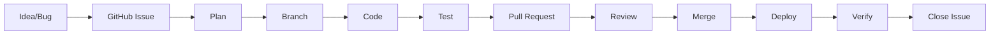
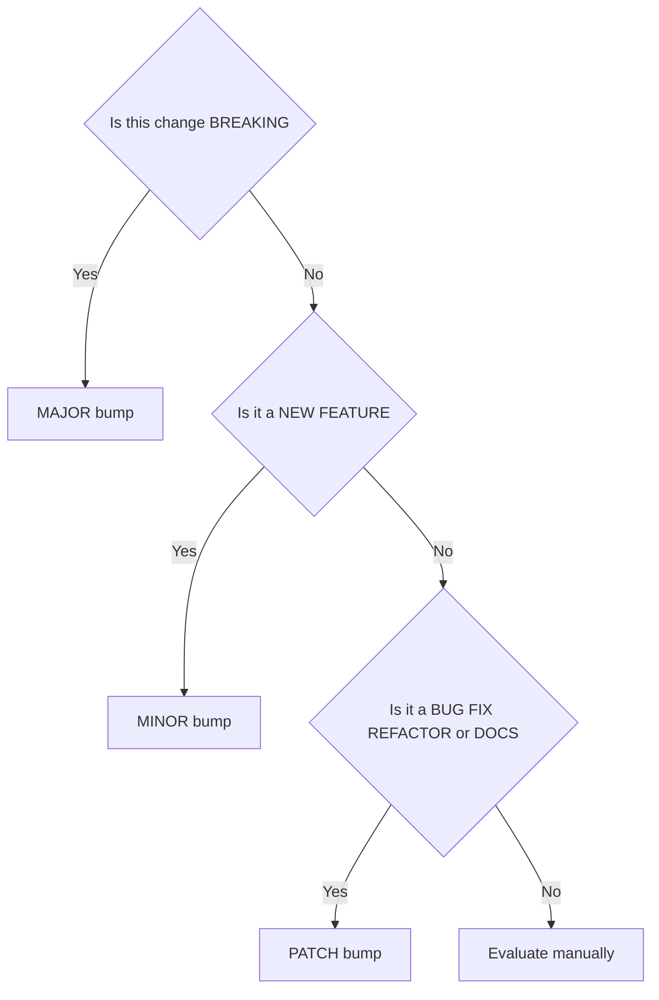

# Change Management & Release Process

**System:** Second Brain OS (ARIA OS)
**Document ID:** OPS-CM-001
**Version:** 1.0.0
**Effective Date:** 2026-06-11

---

## Document Control

| Metadata | Value |
|---|---|
| Document Owner | Platform Engineering |
| Approver | Technical Lead |
| Review Cycle | Quarterly or on process change |
| Location | `docs/operations/49_ChangeManagement.md` |
| Supporting Documents | `AGENTS.md`, `docs/engineering/ARCHITECTURE.md`, `docs/operations/50_IncidentResponse.md` |
| Change History | See Appendix F |

---

## 1. Executive Summary

### 1.1 Purpose

This document defines the change management and release process for Second Brain OS — a personal AI productivity system built on Next.js, FastAPI, Supabase, and AI services. The purpose is to manage all changes to the system predictably, minimize production incidents, maintain code quality, and establish a lightweight yet repeatable release cadence suitable for a single-developer team.

### 1.2 Scope

This process governs the following categories of change:

- **Code changes** — Frontend (Next.js), Backend (FastAPI), shared packages, AI agent modules, and service-layer code.
- **Infrastructure changes** — Hosting platform migrations (Vercel, Railway), Supabase project configuration, DNS, CDN, and deployment pipeline modifications.
- **Configuration changes** — Environment variables, feature flags, application settings, and third-party service keys.
- **AI prompt changes** — Agent instructions, system prompts, briefing templates, and model parameter adjustments.
- **Dependency updates** — npm packages, Python packages, Supabase client libraries, and runtime version upgrades.

### 1.3 Change Management Philosophy

The process is designed to be **lightweight but structured** — sufficient rigor to prevent regressions and data loss without imposing bureaucratic overhead on a solo developer. The guiding principles are:

1. **Risk-appropriate process** — Higher-risk changes require more gates (branching, testing, dry-run). Low-risk changes remain fast and frictionless.
2. **Traceability by default** — Every change is linked to an issue, labeled by type and risk, and recorded in git history.
3. **Recovery over perfection** — Rollback procedures and emergency processes are pre-defined so the developer can act quickly when things go wrong.
4. **Continuous improvement** — Metrics are tracked and retrospectives are held to refine the process over time.

---

## 2. Change Classification

### 2.1 Change Types

Every change SHALL be classified with exactly one type. The type determines labeling, branching convention, and changelog categorization.

| Type | Definition | Examples |
|---|---|---|
| **Feature** | New functionality added to the system | New API endpoint, new page, new AI capability |
| **Fix** | Correction of a defect or regression | Error in task creation, wrong calculation in dashboard |
| **Refactor** | Code restructuring with no behavioral change | Extracting shared logic, renaming for clarity |
| **Dependency** | Updating a library, package, or runtime | Upgrading Next.js, Python package version bump |
| **Configuration** | Changing application or environment settings | Environment variables, `.env` changes, Supabase RLS policy |
| **Infrastructure** | Changing hosting, deployment, or CI/CD | Migration from Railway to Render, Vercel team change |
| **Documentation** | Updates to internal or user-facing docs only | Writing this document, updating API reference |
| **AI** | Changes to AI prompts, agent logic, or model config | Updating briefing prompt, changing agent temperature |
| **Security** | Security patches or auth hardening | Updating auth middleware, rotating secrets, SQL injection fix |

### 2.2 Change Priority

Priority determines response time, escalation path, and deployment urgency.

| Priority | Definition | Examples | Response Time |
|---|---|---|---|
| **P0 — Critical** | System is down, data is at risk, or authentication is broken | Auth middleware failing, database corruption, secrets leaked | Immediate |
| **P1 — High** | Major feature is broken with no workaround | Task creation returning 500, AI chat non-responsive | < 4 hours |
| **P2 — Medium** | Feature is partially broken; workaround exists | Dashboard stats incorrect, search missing some results | < 24 hours |
| **P3 — Low** | Cosmetic issue or minor usability problem | Button alignment off, typo in UI text | Next release |
| **P4 — Enhancement** | New feature or improvement request | Dark mode toggle, export to CSV feature | Backlog |

### 2.3 Change Risk Assessment

Risk level gates the required process steps. Lower-risk changes move faster; higher-risk changes require additional safeguards.

| Risk Level | Criteria | Approval | Branching | Testing Required |
|---|---|---|---|---|
| **Low** | Documentation only, CSS/styling changes, minor UI text, non-functional refactors | Self-approve, commit directly to `main` | None required | Lint only |
| **Medium** | New features, non-critical bug fixes, code refactors, dependency minor updates | Self-review via PR | Branch from `main` | Lint + type-check + relevant tests |
| **High** | Database schema changes, authentication changes, AI prompt changes, API breaking changes, dependency major upgrades | Self-review via PR + run full test suite | Branch from `main` | Lint + type-check + full test suite + manual QA |
| **Critical** | Infrastructure migration, security patches, environment variable changes (secrets), dependency with known vulnerability, data migrations | Self-review via PR + full suite + dry-run | Branch from `main` | Lint + type-check + full suite + dry-run + staging deploy |

---

## 3. Change Request Process

### 3.1 Process Flow



### 3.2 Detailed Steps

#### Step 1: Issue Creation

Every change SHALL originate from a GitHub Issue. The issue serves as the single source of truth for the change's lifecycle.

**Issue Template:**

```
---
title: "{type}: {short description}"
labels: ["type: {type}", "priority: {P0-P4}", "risk: {level}"]
---

## Description
[Concise description of what needs to change]

## Motivation
[Why this change is needed — bug, feature request, tech debt, etc.]

## Implementation Plan
[Brief outline of approach — required for Medium+ changes]

## Definition of Done
- [ ] Code implemented
- [ ] Tests written/updated
- [ ] Lint passes
- [ ] Type-check passes
- [ ] PR created and merged
- [ ] Verified in production
```

**Labeling Convention:**
- `type: feature`, `type: fix`, `type: refactor`, `type: dependency`, `type: config`, `type: infrastructure`, `type: docs`, `type: ai`, `type: security`
- `priority: P0`, `priority: P1`, `priority: P2`, `priority: P3`, `priority: P4`
- `risk: low`, `risk: medium`, `risk: high`, `risk: critical`

#### Step 2: Planning

The depth of planning scales with risk level.

| Risk Level | Planning Required |
|---|---|
| Low | No formal plan; proceed directly |
| Medium | Brief implementation plan as issue comment (3–5 bullet points) |
| High | One-paragraph design document in issue or linked doc covering approach, affected components, and migration strategy |
| Critical | Full design document saved to `docs/engineering/` before any coding begins, covering architecture, data model, migration, rollback, and testing strategy |

#### Step 3: Branching

Branch naming follows the convention `{type}/{issue-number}-{kebab-case-description}`.

```bash
git checkout main
git pull origin main
git checkout -b feat/42-task-filtering
```

**Branch Naming Examples:**

| Scenario | Branch Name |
|---|---|
| New task filtering feature | `feat/42-task-filtering` |
| Fix login error | `fix/43-login-error` |
| Update onboarding docs | `docs/44-onboarding-guide` |
| Upgrade Next.js | `dependency/45-nextjs-upgrade` |
| Emergency hotfix auth | `hotfix/46-auth-bypass` |

HOTFIX branches are used exclusively for P0/P1 issues and bypass the standard workflow (see Section 3.3).

#### Step 4: Implementation

All code SHALL adhere to the conventions defined in `AGENTS.md`:

1. **Frontend (Next.js/TypeScript):** Follow import ordering, PascalCase components, camelCase hooks, kebab-case files. Use Zustand for global state, Framer Motion for animations, and design tokens from `tailwind.config.js`.
2. **Backend (FastAPI/Python):** Follow snake_case naming, Pydantic models for all schemas, HTTPException for errors, and filter all queries by `user_id`.
3. **Quality gates that MUST pass before committing:**
   ```bash
   # Frontend
   cd apps/web && npm run lint && npm run type-check

   # Backend
   cd apps/api && ruff check . && python -m py_compile main.py
   ```
4. **Testing:** Write or update tests for the change. Run `pytest` for backend tests.

#### Step 5: Pull Request

Create a Pull Request against the `main` branch. The PR is self-reviewed by the developer.

**PR Title Format (Conventional Commits):**

```
{type}({scope}): {description}
```

| Type | Scope Examples |
|---|---|
| `feat(tasks)` | New task filtering dropdown |
| `fix(auth)` | Resolve token expiry redirect loop |
| `refactor(api)` | Extract shared validation middleware |
| `deps(web)` | Upgrade Next.js to 14.2.0 |
| `chore(release)` | Bump version to 0.2.0 |

**PR Body Template:**

```markdown
## Changes

- [List specific changes made]
- [Reference files or modules affected]

## Testing

- [ ] Lint passes
- [ ] Type-check passes
- [ ] Unit tests pass
- [ ] Manual testing performed
  - [Login flow] — works
  - [Task CRUD] — works
  - [AI chat] — works

## Closes

Closes #42
```

**Self-Review Checklist:**

- [ ] Diff reviewed line-by-line
- [ ] No commented-out code, `console.log`, `print()`, or debug artifacts
- [ ] No secrets, keys, or tokens in the diff
- [ ] Error handling is present (try/catch, HTTPException, user-friendly messages)
- [ ] Database queries filter by `user_id`
- [ ] Types are correct (no `any`)
- [ ] Lint and type-check pass
- [ ] Follows AGENTS.md conventions

#### Step 6: Merge Strategy & Deployment

| Risk Level | Merge Strategy | Deploy Strategy |
|---|---|---|
| **Low** | Direct commit to `main` | Automatic (Vercel auto-deploy, Railway auto-deploy) |
| **Medium** | Squash merge via PR | Automatic |
| **High** | Squash merge via PR, verify build locally | Manual trigger after verification |
| **Critical** | Squash merge via PR, verify dry-run passed, verify staging deployment | Manual trigger after full verification |

**Merge Commands (Medium+):**

```bash
git checkout main
git pull origin main
git merge --squash feat/42-task-filtering
git commit -m "feat(tasks): add priority filter dropdown (#42)"
git push origin main
git branch -d feat/42-task-filtering
```

#### Step 7: Verification

Post-deployment verification must confirm the change works in production:

1. Navigate to the changed functionality and test end-to-end.
2. Check application logs for errors (Vercel/LogDash or Railway monitoring).
3. Verify API health endpoint returns `200 OK`.
4. If applicable, verify database state (row counts, new columns, etc.).
5. Close the GitHub Issue with a comment noting the deployment timestamp.

### 3.3 Emergency Change Process (P0/P1)

For critical and high-priority issues, speed is prioritized over process. The following simplified workflow applies:

1. **Skip issue creation** — an issue can be created after resolution for tracking.
2. **Branch immediately** from `main` with the `hotfix/` prefix:
   ```bash
   git checkout main
   git checkout -b hotfix/46-auth-bypass
   ```
3. **Fix, test minimally**, and merge with a `HOTFIX:` prefix in the merge commit:
   ```bash
   git commit -m "HOTFIX: resolve auth token bypass vulnerability (#46)"
   ```
4. **Deploy immediately** — bypass staging and dry-run.
5. **Create issue after** for post-incident tracking.
6. **Document** in the incident response log (see `docs/operations/50_IncidentResponse.md`).

---

## 4. Release Management

### 4.1 Release Cadence

Second Brain OS follows a time-based release cadence with semantic versioning.

| Release Type | Frequency | Contents | Version Bump |
|---|---|---|---|
| **Patch Release** | As needed (typically 1–3 per week) | P0/P1 fixes, low-risk changes, documentation | PATCH |
| **Minor Release** | Bi-weekly (every other Friday) | Features, enhancements, non-critical fixes | MINOR |
| **Major Release** | Monthly | Breaking changes, redesigns, large features | MAJOR |
| **Emergency Hotfix** | Immediate | P0 issues | PATCH (may be cherry-picked) |

### 4.2 Version Numbering

Versioning follows the [Semantic Versioning 2.0.0](https://semver.org/) specification: `MAJOR.MINOR.PATCH`.

```
MAJOR — Breaking API changes, database schema migrations that are backward-incompatible,
        major redesigns, or removal of features
MINOR — New features, non-breaking enhancements, new API endpoints, new pages
PATCH — Bug fixes, performance improvements, documentation, refactors, dependency updates

Current Version: 0.1.0 (pre-alpha)
```

**Version Source of Truth:**
- Frontend: `apps/web/package.json` — `"version": "0.1.0"`
- Backend: `apps/api/pyproject.toml` — `version = "0.1.0"`

Both files MUST be kept in sync with the same version string.

### 4.3 Release Process

#### Pre-Release Checklist

- [ ] All planned changes for this release are merged into `main`.
- [ ] `CHANGELOG.md` is updated with entries for all changes since the last release.
- [ ] Version is bumped in `apps/web/package.json` and `apps/api/pyproject.toml`.
- [ ] Git tag is created and pushed.
- [ ] `npm run build` succeeds for the frontend.
- [ ] `npm run lint` passes for the frontend.
- [ ] `ruff check .` passes for the backend.
- [ ] Manual QA of core flows:
  - [ ] Login / authentication
  - [ ] Task creation, editing, deletion
  - [ ] Habit logging and streak tracking
  - [ ] AI chat / briefing response
  - [ ] Dashboard loads with correct data
- [ ] Database migrations are ready and tested (if applicable).
- [ ] Environment variables are configured for production (if new ones added).

#### Release Steps

```bash
# 1. Ensure main is up to date
git checkout main
git pull origin main

# 2. Update CHANGELOG.md with release notes

# 3. Bump version
# Frontend
cd apps/web
npm version patch --no-git-tag-version  # or minor / major

# Backend
cd apps/api
# Manually update pyproject.toml version field

# 4. Commit version bump
git add apps/web/package.json apps/api/pyproject.toml CHANGELOG.md
git commit -m "chore(release): bump version to 0.2.0"

# 5. Tag the release
git tag -a v0.2.0 -m "Release v0.2.0 - Task filtering, habit streaks, AI briefing improvements"
git push origin main --tags

# 6. Build and deploy
cd apps/web && npm run build
# Deploy via Vercel (automatic on push to main) and Railway (automatic on push to main)

# 7. Verify in production
# Run the post-release checklist below
```

#### Post-Release Verification

- [ ] Production URL loads without errors: `https://secondbrain.app`
- [ ] API health check returns `200 OK`: `GET /api/health`
- [ ] Login flow works end-to-end
- [ ] CRUD operations work for tasks, habits, projects
- [ ] AI chat endpoint responds correctly
- [ ] No error spikes in Vercel/Railway logs
- [ ] Database migrations applied successfully (if applicable)
- [ ] Version displayed in footer matches `v0.2.0`

---

## 5. Dependency Management

Dependencies SHALL be managed proactively to prevent security vulnerabilities and compatibility issues.

### 5.1 Update Cadence

| Dependency Type | Examples | Check Frequency | Update Strategy |
|---|---|---|---|
| **Core framework** | Next.js, React | Monthly | Minor updates within 2 weeks; major updates evaluated |
| **Backend framework** | FastAPI, Uvicorn | Monthly | Minor updates within 2 weeks; major updates evaluated |
| **Python packages** | httpx, pydantic, supabase-py | Monthly via `pip-audit` | Security patches: immediately; others: within 1 month |
| **npm packages** | zod, zustand, framer-motion, three.js | Monthly via `npm audit` | Security patches: immediately; others: within 1 month |
| **Database** | Supabase client, postgres drivers | Quarterly | Minor updates within 1 month; major evaluated |
| **Utility** | Tailwind CSS, lucide-react | Quarterly | Minor updates within 1 month |
| **Animation** | Framer Motion, Three.js | Quarterly | Minor updates within 1 month |
| **AI/LLM** | Claude API, OpenRouter, model IDs | Per deprecation notice | Update within 30 days of deprecation notice |
| **Runtime** | Node.js, Python version | Annually | Within 3 months of new major release |
| **Infrastructure** | Vercel CLI, Railway CLI | Per update notice | Within 2 weeks of CLI update |

### 5.2 Dependency Update Process

```bash
# Frontend — check and update npm packages
cd apps/web
npm outdated              # List outdated packages
npm update                # Update within semver range (safe)
npm install package@latest  # Major upgrade (requires risk assessment)

# Backend — check and update Python packages
cd apps/api
pip list --outdated       # List outdated packages
pip install --upgrade package  # Upgrade specific package

# After any dependency update, run quality gates:
npm run lint && npm run type-check  # Frontend
ruff check .                        # Backend
pytest                              # Full test suite
```

### 5.3 Security Vulnerability Process

| Severity | Response Time | Action |
|---|---|---|
| **Critical** | Within 24 hours | Create P0 issue, upgrade immediately, test, deploy hotfix |
| **High** | Within 48 hours | Create P1 issue, upgrade, test, deploy in next patch |
| **Medium** | Within 1 week | Create P2 issue, upgrade in next minor release |
| **Low** | Within 1 month | Create P3 issue, upgrade in next regular release |

**Automated Checks:**
- Weekly: `npm audit` (frontend) and `pip-audit` (backend)
- Results recorded in dependency tracking section of project board

---

## 6. Configuration Management

### 6.1 Environment Configuration

| Environment | Purpose | Configuration Source |
|---|---|---|
| **Development** | Local coding and testing | `.env.local` file (not committed) |
| **Production** | Live service accessible to user | Vercel Environment Variables, Railway Environment Variables |

**Configuration Inventory:**
- `NEXT_PUBLIC_SUPABASE_URL` — Supabase project URL
- `NEXT_PUBLIC_SUPABASE_ANON_KEY` — Supabase anonymous key
- `SUPABASE_SERVICE_ROLE_KEY` — Supabase service role key (backend only)
- `CLAUDE_API_KEY` — Anthropic API key for AI features
- `OPENROUTER_API_KEY` — OpenRouter API key (if used)
- `SESSION_SECRET` — Session encryption key
- `NEXT_PUBLIC_APP_URL` — Public application URL

### 6.2 Configuration Change Process

1. **Dev testing:** Modify `.env.local` locally and verify the system works as expected.
2. **Verification:** Run the relevant feature to confirm the configuration change does not break existing functionality.
3. **Production update:**
   - Vercel: Dashboard → Project → Settings → Environment Variables → Update
   - Railway: Dashboard → Project → Variables → Update
4. **Redeploy:** Vercel and Railway auto-deploy on push; trigger a manual redeploy if configuration-only change.
5. **Verify production:** Test the affected functionality in the live environment.

### 6.3 Secrets Management

- **Never** commit `.env` files to the repository — they are listed in `.gitignore`.
- **Offline backup:** Encrypt sensitive environment files with GPG:
  ```bash
  gpg -c .env.production          # Creates .env.production.gpg
  gpg -d .env.production.gpg > .env.production  # Decrypt when needed
  ```
- **Key rotation:** All secrets SHALL be rotated quarterly (every 3 months) or immediately upon suspected compromise.
- **Pre-commit hook:** If configured, `git-secrets` prevents accidental commits of patterns matching API keys.

---

## 7. Rollback Procedures

### 7.1 Rollback Triggers

| Trigger | Detection Method | Action | Owner |
|---|---|---|---|
| **Build fails on production** | Vercel deploy log, CI failure | Auto-rollback to previous deployment | Platform Engineering |
| **API error rate > 5%** | Railway monitoring, log analysis | Manual rollback to previous Railway deployment | Platform Engineering |
| **Authentication broken** | User report, monitoring alert | Emergency rollback — deploy previous commit | Platform Engineering |
| **Data corruption detected** | Manual audit, test failure | Restore from database backup (see disaster recovery plan) | Platform Engineering |
| **Performance degradation > 50%** | Lighthouse CI, response time monitoring | Rollback to previous deployment | Platform Engineering |

### 7.2 Rollback Commands

```bash
# Frontend — Vercel
vercel rollback                           # CLI rollback to previous deployment
# Alternative: Vercel Dashboard → Deployments → ⋮ → Rollback to Previous

# Backend — Railway
railway redeploy --deployment <id>       # Deploy specific previous deployment
# Alternative: Railway Dashboard → Deployments → Select previous → Redeploy

# Full rollback (both frontend and backend)
git revert HEAD                          # Revert the most recent commit
git push origin main                     # Trigger redeploy on both platforms
```

### 7.3 Rollback Verification

After rollback is complete:

1. Verify production URL loads correctly.
2. Verify API health check returns `200 OK`.
3. Verify the broken functionality is now working.
4. Create a new issue to investigate the root cause of the rollback.
5. Document the incident in the incident response log.

---

## 8. Communication & Documentation

### 8.1 Changelog Template

The `CHANGELOG.md` file at the repository root SHALL be maintained for every release. Entries follow the [Keep a Changelog](https://keepachangelog.com/) format.

```markdown
## [0.2.0] — 2026-06-25

### Added
- Task filtering by priority and status (#42)
- Habit streak visualization on dashboard (#38)
- AI briefings now include weather context (#45)

### Fixed
- Task creation failing when no due date set (#43)
- Habit log duplicate entries on rapid click (#41)
- CORS error blocking localhost:3001 requests (#40)

### Changed
- Rate limiter increased from 100 to 150 req/min (#39)
- Database index on `tasks.due_date` for query performance (#37)

### Security
- Updated Supabase RLS policies to prevent cross-user data access (#44)
- Rotated Claude API key as quarterly maintenance

### Dependencies
- Upgraded Next.js to 14.2.5 (#46)
- Upgraded FastAPI to 0.111.0 (#47)

[0.2.0]: https://github.com/org/second-brain-os/releases/tag/v0.2.0
```

### 8.2 Change Notifications

As a solo developer operation, formal change notifications are not required. The following serve as the record of changes:

- **CHANGELOG.md** — Human-readable release notes.
- **Git tags** — Annotated tags with release notes (`git tag -a v0.2.0 -m "..."`).
- **GitHub Issues** — Complete traceability from request to deployment.
- **Deployment logs** — Vercel and Railway deployment history.

---

## 9. Continuous Improvement

### 9.1 Metrics to Track

| Metric | Definition | Target | Measurement Method |
|---|---|---|---|
| **Lead Time** | Time from issue creation to deployment | < 2 days | GitHub Issue created → merge commit date |
| **Deployment Frequency** | Number of production deployments per week | 2–4 per week | Git log (`git log --oneline main`), Vercel deployments |
| **Change Failure Rate** | Percentage of deployments causing a failure | < 5% | Deployments followed by rollback or hotfix |
| **Time to Restore (P0)** | Time from P0 incident to resolution | < 4 hours | Incident created → fix deployed |
| **Documentation Coverage** | Percentage of features with documentation | 80% | Manual audit against feature inventory |
| **Dependency Health** | Percentage of dependencies up-to-date | > 90% | `npm outdated`, `pip list --outdated` counts |

### 9.2 Retrospective Process

A lightweight retrospective SHALL be conducted after each major release or after any P0 incident.

**Retrospective Format:**

```markdown
## Retrospective — [Release/Incident Name]

Date: 2026-06-25
Facilitator: Self

### What Went Well?
- [List positive aspects]

### What Could Be Improved?
- [List areas for improvement]

### Action Items
- [ ] [Action item 1] — Owner, Due date
- [ ] [Action item 2] — Owner, Due date

### Process Changes
- [Any updates needed to this document or AGENTS.md]
```

---

## 10. Appendices

### Appendix A: Change Request Form Template

```markdown
## Change Request

**CR-ID:** CR-{YYYY}-{NNN}
**Date:** {date}
**Requester:** {name}

### Change Summary
**Title:** {type}: {short description}
**Type:** {Feature / Fix / Refactor / Dependency / Config / Infrastructure / Docs / AI / Security}
**Priority:** {P0 / P1 / P2 / P3 / P4}
**Risk Level:** {Low / Medium / High / Critical}

### Description
{detailed description}

### Justification
{why this change is needed}

### Impact Assessment
- **Affected Components:** {list of modules, pages, APIs}
- **Database Changes:** {yes/no — details if yes}
- **Breaking Changes:** {yes/no — details if yes}
- **Rollback Plan:** {how to revert if needed}

### Approval
**Approver:** {self}
**Date:** {date}

### Closure
**Deployed at:** {timestamp}
**Verified by:** {self}
```

### Appendix B: Release Checklist (Printable Version)

```
# SECOND BRAIN OS — RELEASE CHECKLIST

## Release: v_________    Date: ______________

## Pre-Release
[ ] All planned changes merged to main
[ ] CHANGELOG.md updated
[ ] Version bumped in package.json
[ ] Version bumped in pyproject.toml
[ ] Git tag created: v_________
[ ] npm run build succeeds
[ ] npm run lint passes
[ ] ruff check . passes
[ ] pytest passes

## Manual QA
[ ] Login flow works
[ ] Task CRUD works
[ ] Habit logging works
[ ] AI chat responds
[ ] Dashboard loads correctly
[ ] Database migrations applied

## Post-Release
[ ] Production URL loads
[ ] API health returns 200
[ ] Login works in production
[ ] CRUD operations work in production
[ ] AI chat responds in production
[ ] No error spikes in logs
[ ] Version in footer matches

## Sign-Off
Released by: _______________
Date/Time: _________________
```

### Appendix C: Conventional Commits Reference

| Prefix | Usage | Example |
|---|---|---|
| `feat` | A new feature | `feat(tasks): add priority filter` |
| `fix` | A bug fix | `fix(auth): resolve token expiry` |
| `refactor` | Code restructuring | `refactor(api): extract auth middleware` |
| `docs` | Documentation only | `docs: update API reference` |
| `style` | Formatting, linting | `style: fix prettier warnings` |
| `test` | Adding or fixing tests | `test: add task CRUD tests` |
| `chore` | Build, deps, tooling | `chore(deps): upgrade next to 14.2.5` |
| `perf` | Performance improvement | `perf: optimize dashboard query` |
| `security` | Security fix | `security: update RLS policies` |
| `hotfix` | Emergency fix (P0/P1) | `hotfix: resolve auth bypass` |

**Scope values:** `tasks`, `habits`, `auth`, `dashboard`, `ai`, `api`, `web`, `goals`, `ideas`, `projects`, `resources`, `opportunities`, `income`, `sleep`, `time`, `release`, `deps`

### Appendix D: Semantic Versioning Decision Tree



**Breaking changes include:**
- API endpoint removal or signature change
- Database schema changes requiring migration
- Removal of a feature or configuration option
- Major dependency upgrade with API incompatibility
- AI prompt changes that alter agent output format

### Appendix E: Migration Plan Template

For High and Critical risk changes involving schema or infrastructure changes:

```markdown
## Migration Plan: {Title}

**Date:** {date}
**Risk Level:** {High / Critical}
**Estimated Downtime:** {duration}

### Current State
{description of current implementation}

### Target State
{description of desired implementation}

### Migration Steps
1. {step 1 — e.g., "Create new column tasks.priority"}
2. {step 2 — e.g., "Backfill data for existing rows"}
3. {step 3 — e.g., "Deploy code that reads new column"}
4. {step 4 — e.g., "Drop old column after verification"}

### Rollback Plan
{how to revert each step}

### Verification
{how to confirm migration succeeded}

### Testing Results
- [ ] Dry-run completed (if applicable)
- [ ] Staging deployment verified
- [ ] Rollback tested
```

### Appendix F: Revision History

| Version | Date | Author | Description of Change |
|---|---|---|---|
| 1.0.0 | 2026-06-11 | Platform Engineering | Initial release — comprehensive change management and release process for Second Brain OS |
