## Document Control

| Field | Value |
|---|---|
| Document ID | OPS-TDB-001 |
| Version | 1.0.0 |
| Status | Active |
| Last Updated | 2026-07-11 |

# Technical Debt & Quality Management Plan

> **Project**: Second Brain OS (ARIA OS)
> **Stage**: Alpha — Single Developer
> **Owner**: Primary Developer
> **Last Updated**: 2026-06-11

---

## Document Control

| Version | Date | Author | Changes |
|---|---|---|---|
| 1.0 | 2026-06-11 | AI-Assisted | Initial document — full debt register, quality standards, testing strategy |
| | | | |

---



```mermaid
%%{init: {'theme':'base','themeVariables':{'primaryColor':'#6366F1','primaryTextColor':'#F1F5F9','primaryBorderColor':'#6366F1','lineColor':'#818CF8','secondaryColor':'#13151A','tertiaryColor':'#0A0B0F','background':'#0A0B0F','mainBkg':'#13151A','nodeBorder':'#334155','clusterBkg':'#0A0B0F','clusterBorder':'#1E293B','titleColor':'#F1F5F9','edgeLabelBackground':'#13151A','nodeTextColor':'#F1F5F9'}}}%%
flowchart LR
    Identify["🔍 Identify Debt<br/>Static Analysis · Code Review · Bug Reports"] --> Classify["📂 Classify Debt"]
    Classify --> Category{"Category"}
    Category -->|Code Quality| CodeQ["📝 Code Quality"]
    Category -->|Architecture| Arch["🏗️ Architecture"]
    Category -->|Testing| Test["🧪 Testing"]
    Category -->|Documentation| Docs["📚 Documentation"]
    Category -->|Infrastructure| Infra["⚙️ Infrastructure"]
    Category -->|Security| Sec["🔒 Security"]
    Category -->|Performance| Perf["âš¡ Performance"]
    Category -->|Dependency| Dep["📦 Dependency"]
    Category -->|UX| UX["🎨 UX"]
    CodeQ --> Prioritize["📊 Prioritize<br/>Impact × Urgency"]
    Arch --> Prioritize
    Test --> Prioritize
    Docs --> Prioritize
    Infra --> Prioritize
    Sec --> Prioritize
    Perf --> Prioritize
    Dep --> Prioritize
    UX --> Prioritize
    Prioritize --> Register["📋 Register in Debt Register"]
    Register --> Schedule["📅 Schedule in Sprint"]
    Schedule --> Refactor["🔧 Refactor / Fix"]
    Refactor --> Verify["✅ Verify<br/>Tests · Lint · Review"]
    Verify --> QualityGates{"Passes Quality Gates?"}
    QualityGates -->|No| Refactor
    QualityGates -->|Yes| Close["✅ Close Debt Item"]
    Close --> Document["📝 Update Documentation"]
    Document --> Monitor2["📊 Monitor for Regressions"]
    Monitor2 --> Identify
```

## 1. Executive Summary

### 1.1 Purpose

This document exists to **systematically identify, track, and resolve technical debt** across Second Brain OS. It serves as the single source of truth for known quality issues, provides a framework for classifying and prioritizing debt, and defines the engineering standards we commit to as the project grows from solo-alpha to production.

### 1.2 Scope

All artifacts of the Second Brain OS project:

- **Code**: Frontend (Next.js/TypeScript), Backend (FastAPI/Python), Shared packages (AI agents, utils, config)
- **Infrastructure**: Supabase, SQL schema, RLS policies, deployment config
- **Documentation**: Product docs, engineering specs, API docs, README files
- **AI**: Agent prompts, LLM client config, tool definitions
- **Data**: Database schema design, migration scripts, seed data

### 1.3 Quality Philosophy

**The 80/20 Rule**: 20% of effort fixes 80% of issues. We target the high-interest, high-impact debt first — the stuff that actively slows down development or risks users' data. Perfection is the enemy of shipped.

**Solo-dev realism**: With one developer working ~10h/week, we cannot fix everything. This document helps us spend those hours where they matter most.

---

## 2. Technical Debt Framework

### 2.1 Debt Categories

| Category | Definition | Examples in This Codebase |
|---|---|---|
| Code Quality | Poor code structure, violations | `catch (error: any)` patterns, missing return types |
| Architecture | Violations of design principles | Duplicate CRUD patterns across 12 API modules |
| Testing | Missing or inadequate tests | Zero tests across entire project |
| Documentation | Missing or outdated docs | Undocumented API endpoints, no API schema docs |
| Infrastructure | Suboptimal deployment setup | No CI/CD, manual `git push && ssh` deploys |
| Security | Known vulnerabilities | Environment variables not validated at startup |
| Performance | Suboptimal performance | Missing indexes, no pagination on list endpoints |
| Dependency | Outdated libraries | Not audited for CVEs |
| AI | Prompt/agent issues | Stale system prompts, no chat truncation |
| UX | Poor user experience | No error boundaries, missing loading skeletons |

### 2.2 Debt Classification

| Class | Interest Rate | Description | Example |
|---|---|---|---|
| 🔴 Critical (P0) | Very high — blocks features or causes data loss | Must fix before next release | Missing RLS on a production table |
| 🟠 High (P1) | High — slows development or causes friction daily | Fix within current sprint | Slow queries, no pagination |
| 🟡 Medium (P2) | Medium — inconvenient but workaround exists | Fix within next 2 sprints | Missing error messages, some `any` types |
| 🟢 Low (P3) | Low — cosmetic or nice-to-have | Fix when touching related code | Inline CSS, minor style inconsistencies |
| ⚪ Omitted (P4) | None — intentional trade-off | Document and move on | Using local Ollama instead of cloud AI |

### 2.3 Debt Iceberg Model

```
        ┌──────────────────────────────────┐
        │  Known & Tracked (This doc)      │  ~25 items
        │  ┌────────────────────────────┐  │
        │  │  TD-001 through TD-025     │  │
        │  └────────────────────────────┘  │
        ├──────────────────────────────────┤
        │  Known but Untracked             │  ~10-15 items
        │  (Mental notes, "I'll fix this   │
        │   later", gut feeling issues)    │
        ├──────────────────────────────────┤
        │  Unknown (Hidden)                │  ??? items
        │  (Will discover during           │
        │   refactoring or after a bug)    │
        └──────────────────────────────────┘
```

---

## 3. Technical Debt Register

### 3.1 Current Debt Register

| ID | Category | Description | Class | Est. Effort | Impact | Created | Target Resolution |
|---|---|---|---|---|---|---|---|
| TD-001 | Security | RLS not enabled on all Supabase tables (only `tasks`, `users` verified; `habits`, `sleep_logs`, `time_entries`, `income`, `opportunities`, `resources`, `projects`, `ideas`, `courses` may be unprotected) | 🔴 P0 | 4h | Data leak — users could access each other's data | 2026-06 | 2026-07 |
| TD-002 | Infrastructure | No CI/CD pipeline — every deploy is manual `git push` + SSH + restart | 🟠 P1 | 8h | Deploys are error-prone, no automated checks | 2026-06 | 2026-08 |
| TD-003 | Testing | Zero tests across the entire project (0 unit, 0 integration, 0 e2e) | 🔴 P0 | Ongoing | No safety net for regressions; every refactor is risky | 2026-06 | 2026-12 |
| TD-004 | Infrastructure | No staging environment — code goes from `main` branch directly to production | 🟠 P1 | 4h | Changes hit users without pre-flight validation | 2026-06 | 2026-08 |
| TD-005 | Code Quality | `catch (error: any)` used in all Zustand stores (userStore.ts, taskStore.ts) — type safety lost | 🟠 P1 | 1h | Swallows type info, potential unhandled error shapes | 2026-06 | 2026-07 |
| TD-006 | Code Quality | `User` interface uses `any` for `daily_routine` and `opportunity_preferences` fields | 🟡 P2 | 2h | No type safety on critical user data shapes | 2026-06 | 2026-08 |
| TD-007 | Architecture | Only 2 Zustand stores exist (tasks, users) — all other modules use ad-hoc local `useState` | 🟡 P2 | 6h | Inconsistent state management, harder to add cross-module features | 2026-06 | 2026-09 |
| TD-008 | Architecture | No pagination on any list endpoint — all GET routes return all rows unfiltered | 🟠 P1 | 8h | Performance degradation as data grows; no cursor/offset support | 2026-06 | 2026-08 |
| TD-009 | Performance | Some SQL queries may not filter by `user_id` (not all API routes verified) | 🔴 P0 | 3h | Data leak risk; performance issue for multi-user queries | 2026-06 | 2026-07 |
| TD-010 | Code Quality | Duplicate CRUD patterns across 12 API route files — each reimplements get/create/update/delete with nearly identical boilerplate | 🟡 P2 | 16h | High maintenance cost; bug fix must be replicated 12 times | 2026-06 | 2026-10 |
| TD-011 | UX | No React error boundaries on any page — a runtime crash takes down the entire UI | 🟠 P1 | 4h | Poor UX; unhandled errors show white screen | 2026-06 | 2026-07 |
| TD-012 | UX | No loading skeletons on any page — content flashes in after async fetch completes | 🟡 P2 | 6h | Jarring UX; no perceived performance feedback | 2026-06 | 2026-08 |
| TD-013 | AI | Chat history has no truncation — long conversations will exceed context window | 🟠 P1 | 4h | AI will start hallucinating or failing on long conversations | 2026-06 | 2026-07 |
| TD-014 | AI | Ollama default (`mistral`, `stream: false`) blocks response until full generation completes | 🟡 P2 | 3h | Slow perceived response time; no streaming UX | 2026-06 | 2026-08 |
| TD-015 | Performance | Three.js bundle not code-split or lazily loaded — loads on every page via layout | 🟢 P3 | 2h | Unnecessary 150KB+ JS on non-visual pages | 2026-06 | 2026-09 |
| TD-016 | Infrastructure | Environment variables not validated at startup — missing `NEXT_PUBLIC_SUPABASE_URL` crashes at runtime | 🟠 P1 | 1h | Silent failures; cryptic errors on misconfiguration | 2026-06 | 2026-07 |
| TD-017 | Infrastructure | API response format is inconsistent across endpoints — some return `{data}`, some return `response.data[0]` | 🟡 P2 | 4h | Frontend must handle multiple shapes; fragile | 2026-06 | 2026-08 |
| TD-018 | Infrastructure | No request/response logging on most API endpoints — only `chat.py` has structured logging | 🟡 P2 | 4h | Hard to debug production issues; no audit trail | 2026-06 | 2026-08 |
| TD-019 | Code Quality | Inline CSS/`style` props used in some components instead of Tailwind design tokens | 🟢 P3 | 4h | Inconsistent theming; harder to maintain dark mode | 2026-06 | 2026-09 |
| TD-020 | UX | No custom 404 or error pages — users see Next.js default error screen | 🟢 P3 | 2h | Unprofessional appearance on errors | 2026-06 | 2026-09 |
| TD-021 | Performance | No database indexes on frequently queried columns (`status`, `created_at`, `user_id` joins) | 🟠 P1 | 2h | Query performance degrades with data growth | 2026-06 | 2026-07 |
| TD-022 | Dependency | `npm audit` / `pip-audit` never run — unknown number of vulnerable dependencies | 🟠 P1 | 2h | Possible known CVEs in production | 2026-06 | 2026-07 |
| TD-023 | Documentation | API endpoints undocumented — no OpenAPI/Swagger description beyond auto-generated schema | 🟡 P2 | 8h | Hard to onboard new developers; AI agents can't self-serve | 2026-06 | 2026-09 |
| TD-024 | Architecture | Chat agent (`chat.py`) contains hardcoded intent detection (string matching on keywords) instead of NLU routing | 🟡 P2 | 8h | Brittle; misses user intent on slight phrasing changes | 2026-06 | 2026-10 |
| TD-025 | Code Quality | TypeScript types directory (`packages/types/`) contains only `.gitkeep` — no shared types defined yet | 🟡 P2 | 4h | Frontend and backend types are duplicated/inconsistent | 2026-06 | 2026-08 |

### 3.2 Debt History Log

| Date | ID | Item | Action Taken | Outcome |
|---|---|---|---|---|
| — | — | — | (No entries yet — tracking begins on first debt resolution) | — |

---

## 4. Code Quality Standards

### 4.1 Quality Gates

| Gate | Tool | Command | Current Enforcement | Target |
|---|---|---|---|---|
| Frontend lint | ESLint | `npm run lint` | Manual — pre-commit | Pre-commit hook |
| Frontend types | TypeScript | `npm run type-check` | Manual — pre-commit | Pre-commit hook |
| Backend syntax | py_compile | `python -m py_compile main.py` | Manual | Pre-commit hook |
| Python lint | ruff | `ruff check .` | Manual | Pre-commit hook |
| Python format | black | `black .` | Manual | Pre-commit hook |
| Markdown lint | markdownlint | — | Not enforced | Future |
| Secret scanning | git-secrets / truffleHog | — | Not enforced | Future |
| Dependency audit | `npm audit` / `pip-audit` | — | Not enforced | Monthly |
| Bundle analysis | `next/bundle-analyzer` | — | Not enforced | Future |

### 4.2 Code Review Standards (Self-Review Checklist)

When reviewing a PR (or your own commit before pushing), check each of these:

- [ ] No hardcoded secrets, API keys, or tokens
- [ ] All API responses filter by `user_id` (`.eq("user_id", current_user.user.id)`)
- [ ] Error handling: try/catch with user-friendly messages (no raw `error.message` to UI)
- [ ] No `any` types — use proper interfaces or `unknown` with type guards
- [ ] Imports ordered: external → internal → relative
- [ ] No dead code, commented-out code, or `console.log` / `print()`
- [ ] Naming consistent: PascalCase components, camelCase functions/hooks, snake_case Python
- [ ] Tailwind classes use design tokens (`text-text-primary`, `bg-background-card`) where applicable
- [ ] AI prompts/personas are versioned and not hardcoded in route handlers

### 4.3 Complexity Budget

| Metric | Warning | Hard Limit |
|---|---|---|
| Function length | > 30 lines | > 50 lines |
| Component length | > 150 lines | > 300 lines |
| File length | > 300 lines | > 500 lines |
| Cyclomatic complexity | > 10 | > 15 |
| Nesting depth | > 3 levels | > 5 levels |
| Imports per file | > 15 | > 25 |

If any file exceeds a hard limit, a TD item must be created or the file must be refactored before merging.

---

## 5. Testing Strategy

### 5.1 Current State

```
Unit Tests:     ❌ Zero (0 tests across all 30+ TS files and 25+ Python files)
Integration:    ❌ Zero
E2E Tests:      ❌ Zero
Manual QA:      ✅ Developer manually clicks through features during development
```

This is the single biggest quality gap. No tests means no safety net — every change carries risk of regressions that won't be caught until a user reports them.

### 5.2 Testing Roadmap

| Phase | Timeline | Focus | Tools | Coverage Target |
|---|---|---|---|---|
| Phase 1 | Now → Month 1 | Critical paths: auth, tasks CRUD, data isolation | Vitest (frontend), Pytest (backend) | 20% |
| Phase 2 | Month 1→3 | All 12 API routes, core components (chat, dashboard) | + HTTPX/TestClient (API integration) | 50% |
| Phase 3 | Month 3→6 | E2E critical paths: login → create task → view dashboard | Playwright | 70% |
| Phase 4 | Month 6→12 | AI agent tests, edge cases, accessibility | Custom harnesses + axe-core | 85% |

### 5.3 Priority Test Targets

| Priority | What to Test | Why |
|---|---|---|
| P0 | Auth flow: login, logout, session persistence, token refresh | No auth = no system |
| P0 | Task CRUD: create, read, update, delete, complete, undo | Core feature, used daily |
| P0 | Data isolation: user A cannot read/write user B's data | Security — RLS verification |
| P1 | Habit CRUD + streak calculation | Core feature; streak math is error-prone |
| P1 | Sleep score calculation | Data integrity; formula changes affect history |
| P1 | API error handling: 400, 401, 404, 500 responses | UX — these should return consistent shapes |
| P2 | AI chat response: correct intent routing, fallback behavior | Key differentiator |
| P2 | Dashboard stats aggregation: totals, counts, recent items | User trust — wrong numbers break trust |
| P3 | UI component rendering: Button, Card, Modal, Sidebar states | Polish |
| P3 | Edge cases: empty lists, special characters, XSS injection, unicode | Robustness |

---

## 6. Refactoring Strategy

### 6.1 Refactoring Principles

1. **Boy Scout Rule**: Leave code cleaner than you found it. If you touch a file, fix one small thing.
2. **Touch it once, fix it**: When adding a feature, refactor the code you touch. Never leave it worse.
3. **Dedicated sessions**: Every other Friday PM = refactoring block. No new features, only cleanup.
4. **The 30-minute rule**: If a fix takes < 30 minutes, do it immediately. Don't add it to the backlog.
5. **The 2-hour rule**: If a fix takes > 2 hours, plan it. Create a TD item, schedule it into a sprint.
6. **Incremental over big-bang**: Never do "rewrite the whole module" — do 2-hour chunks over weeks.

### 6.2 Hotspots Analysis

| File | Lines | Complexity | Risk | Priority |
|---|---|---|---|---|
| `apps/api/app/api/chat.py` | ~83 | Medium (intent routing logic) | High — AI orchestration, hard to test | P1 |
| `apps/api/app/api/tasks.py` | ~99 | Low | High — core feature, auth critical | P1 |
| `apps/web/app/chat/page.tsx` | ~320 | Medium (state + animation + API) | Medium — complex UI state | P2 |
| `apps/web/lib/supabase.ts` | 11 | Very Low | **High** — auth client, single point of failure | P1 |
| `packages/ai/client.py` | 52 | Low | Medium — LLM integration (cost + reliability) | P2 |
| `packages/ai/agents/*.py` | 100-200 | Medium | Medium — prompt quality affects user trust | P2 |
| `services/scheduler/main.py` | ~300 | Medium | Low — background jobs, less critical | P3 |

### 6.3 Refactoring Candidates

| Candidate | Current State | Target State | Effort | Priority |
|---|---|---|---|---|
| API error handling | Inconsistent shapes per endpoint | Unified `{"success", "data", "error"}` schema | 4h | P1 |
| TypeScript types | `any` in userStore, missing shared types | Full typed interfaces in `packages/types/` | 8h | P2 |
| Zustand stores | Only 2 stores exist | Consistent pattern across all modules | 6h | P2 |
| Duplicate list endpoints | Each module reimplements filter/pagination | Shared `BaseRouter` class or utility | 16h | P3 |
| Inline CSS | Style props in some components | Tailwind design tokens everywhere | 4h | P2 |
| Chat intent routing | Hardcoded `if "task" in message_lower` | Dedicated NLU router or agent dispatch | 8h | P2 |

---

## 7. Quality Metrics & KPIs

### 7.1 Current Metrics Baseline

| Metric | Current State | Target | How to Measure |
|---|---|---|---|
| Frontend lint errors | Unknown (never run clean) | 0 | `npm run lint` |
| TypeScript errors | Unknown | 0 | `npm run type-check` |
| Python lint errors | Unknown | 0 | `ruff check .` |
| Python format compliance | Unknown | 100% | `black --check .` |
| Test coverage | **0%** | 85% | `pytest --cov` |
| Bundle size (client JS) | ~350KB (est., no measurement) | < 200KB | `next/bundle-analyzer` |
| API response time (p95) | Unknown | < 200ms | Logger middleware with timing |
| Documentation coverage | ~60% (est.) | 80% | Manual audit by module |
| Unused dependencies | Unknown | 0 | `depcheck` + `pip-check` |
| Known CVEs | Unknown | 0 | `npm audit` + `pip-audit` |
| Database query performance | Unknown — no indexes verified | All queries < 50ms | `EXPLAIN ANALYZE` + logging |

### 7.2 Quality Dashboard (Proposed)

| Week | Lint Errors | Type Errors | Test Coverage | API p95 | Open TD Items |
|---|---|---|---|---|---|
| (Tracking begins once CI/CD is implemented and baseline measurements are taken) |
| | | | | | |

---

## 8. Technical Debt Budget

### 8.1 Allocation

| Timeframe | Effort | Frequency | What to Do |
|---|---|---|---|
| Daily | 15 min | Every coding session | Fix small issues immediately (30-min rule) |
| Weekly | 1 hour | Friday PM | Dedicated cleanup session — pick 1-2 P1/P2 items |
| Per feature | 10% of feature time | Per PR | Refactor code you touch; don't leave it worse |
| Monthly | 2 hours | First weekend of month | Debt review (see 9.1) + run all lint/audit checks |
| Quarterly | 1 full day | Every 3 months | Debt sprint — close 10+ items |
| Annually | 1 week | Once per year | Major cleanup — tackle architecture-level debt |

### 8.2 Budget Calculation

Assuming ~10 hours/week of active development time:

| Activity | Hours/Week | % of Time |
|---|---|---|
| Daily 15-min fixes | 1.25h | 12.5% |
| Friday cleanup session | 1h | 10% |
| Per-feature refactoring (10%) | ~1h | 10% |
| **Total debt allocation** | **3.25h** | **32.5%** |

This is realistic for a solo alpha project. The alternative is letting debt compound until it blocks all progress.

---

## 9. Technical Debt Review Process

### 9.1 Monthly Debt Review (First Weekend of Each Month)

1. **Run all quality gates** — lint, type-check, ruff, black
2. **Run dependency audits** — `npm audit`, `pip-audit`
3. **Scan for TODO/FIXME/HACK/XXX comments** in code:
   ```bash
   rg "TODO|FIXME|HACK|XXX" --type-add 'py:*.py' --type-add 'ts:*.{ts,tsx}' -t py -t ts
   ```
4. **Review open GitHub Issues** labeled `tech-debt`
5. **Update this document** — add new items, close resolved ones
6. **Plan top 3 items** to fix this month (should be P0 or P1)

### 9.2 Quarterly Debt Sprint (First Friday of Quarter)

- Full day (8h) dedicated to resolving high-interest debt
- Target: Close 10+ debt items
- Measure: Reduce open TD count by 30%
- Ban new features during sprint — only cleanup, refactoring, documentation

### 9.3 Debt Approval Process

**New debt discovered:**
- **P0/P1** → Create GitHub Issue immediately with label `tech-debt`, add to this register within 24h
- **P2** → Add to this register; reviewed at monthly debt review
- **P3** → Add to this register; reviewed quarterly
- **P4** → Note in register; fix if you touch the code

**Intentional debt (trade-offs):**
- Must be documented with rationale before accepting
- Must add `// TODO(TD-XXX): rationale` or `# TODO(TD-XXX): rationale` comment in the code
- Must be added to this register within the same session

---

## 10. Quality Culture & Best Practices

### 10.1 Development Principles

- **Write it, then right it**: Get it working first, then make it good. Don't try to write perfect code on the first pass.
- **Test at the boundary**: Test API endpoints and user interactions, not internal implementation details. Boundaries change less often.
- **Document decisions**: Every non-obvious choice needs an inline comment. "Why" is more important than "what" — the code shows what.
- **Fail fast**: Validate inputs early, crash with clear messages. Silent failures become mysterious production bugs.
- **Consistency over cleverness**: Boring code is good code. Fancy one-liners are bugs waiting to happen.
- **You ship what you merge**: Every commit to `main` is production. Treat it accordingly.

### 10.2 Anti-Patterns to Avoid

| Anti-Pattern | Why It's Bad | Better Approach |
|---|---|---|
| Copy-paste code | Duplicates bugs, increases maintenance 2x | Extract shared logic into utility or base class |
| Premature optimization | Complex code with no measured benefit | Profile first, optimize second; measure before/after |
| Big bang refactoring | High risk, long period with no value, high chance of abandonment | Incremental refactoring — 2-hour chunks over weeks |
| Not-my-code mentality | Every file is the developer's responsibility, especially solo | Boy Scout Rule — leave it cleaner |
| Silent failures | `except: pass` or empty catch hides bugs | Log all errors; show user-friendly messages; crash loudly for unrecoverable |
| Magic numbers/strings | `if status == 3` — what is 3? | Named constants or enums |

### 10.3 Quality Checklist (Pre-Merge)

Before pushing any commit to `main`:

- [ ] `npm run lint` passes with 0 errors
- [ ] `npm run type-check` passes with 0 errors
- [ ] No `console.log`, `print()`, or `debugger` statements
- [ ] New API routes filter by `user_id`
- [ ] New API routes have consistent error response format
- [ ] New pages/components handle loading, empty, error states
- [ ] No secrets committed (API keys, tokens, passwords)
- [ ] New dependencies justified and audited
- [ ] README or docs updated if interface changed
- [ ] This TR document updated if new debt was introduced

---

## 11. Appendices

### Appendix A: Full Technical Debt Register

*(See Section 3.1 above — all 25 items)*

| Severity | Count | % of Total |
|---|---|---|
| 🔴 P0 | 2 | 8% |
| 🟠 P1 | 8 | 32% |
| 🟡 P2 | 10 | 40% |
| 🟢 P3 | 5 | 20% |
| ⚪ P4 | 0 | 0% |
| **Total** | **25** | **100%** |

### Appendix B: Code Quality Checklist

*(See Section 10.3 above — pre-merge checklist)*

### Appendix C: Refactoring Decision Tree

```
Found code that needs improvement?
│
├─ Is it a bug? → Fix immediately (30-min rule)
│
├─ Is it taking > 30 min to fix?
│  ├─ Yes → Can you defer without blocking progress?
│  │  ├─ Yes → Create TD item, schedule it
│  │  └─ No → Fix now, but only the specific issue (no gold-plating)
│  └─ No → Fix it now
│
├─ Does this code have tests?
│  ├─ No → Add tests first, then refactor
│  └─ Yes → Refactor with confidence, verify tests pass
│
├─ Is this file > 500 lines?
│  ├─ Yes → Extract one logical section into a new file
│  └─ No → Proceed with targeted refactor
│
└─ Is this a P0/P1 debt item?
   ├─ Yes → Prioritize in current sprint
   └─ No → Add to quarterly debt sprint
```

### Appendix D: Monthly Debt Review Template

```markdown
# Monthly Debt Review — [Month Year]

## Quality Gate Results
- Frontend lint errors: ___
- TypeScript errors: ___
- Python lint errors: ___
- Python format compliance: ___

## Security Audit
- npm audit: ___ vulnerabilities (___ critical)
- pip-audit: ___ vulnerabilities (___ critical)

## TODO/FIXME Scan
- Total comments found: ___
- New TODOs since last month: ___

## Debt Register Changes
- New items added: ___
- Items resolved: ___
- Open items total: ___

## Top 3 Items to Fix This Month
1. ___
2. ___
3. ___

## Notes
___
```

### Appendix E: Testing Priority Matrix

```
                    High Business Value
                    │
     P0 ────────────┼──────────── P0
     Auth, Tasks    │  Data Isolation
     CRUD           │
                    │
──────┼─────────────┼───────────────
                    │
     P1 ────────────┼──────────── P1
     Habits, Sleep  │  API Error
     Score          │  Handling
                    │
                    Low Business Value
                    
                    Low Technical Risk     High Technical Risk
```

### Appendix F: Revision History

| Version | Date | Author | Changes |
|---|---|---|---|
| 1.0 | 2026-06-11 | AI-Assisted | Initial draft — 25 debt items registered, standards defined |
| | | | |
