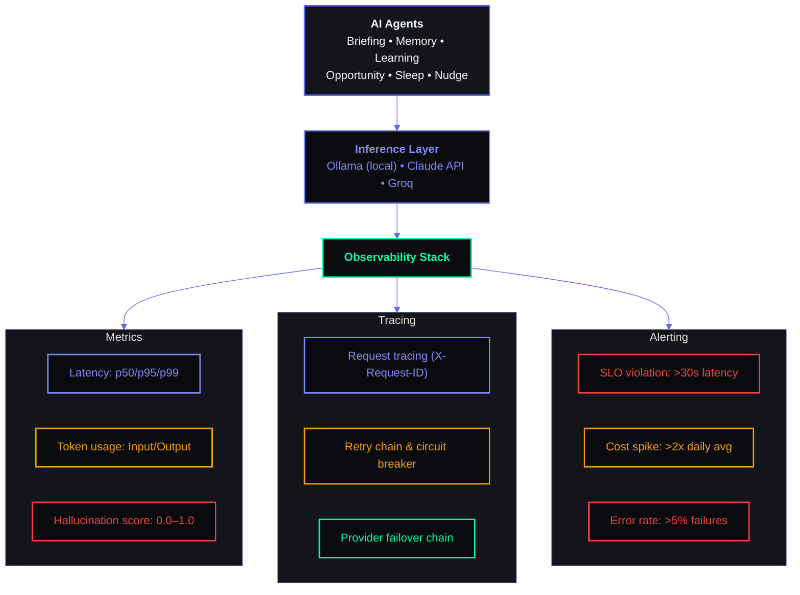

# AI Observability — Second Brain OS

## Document Control

| Field | Value |
|---|---|
| **Document ID** | OPS-AI-OBS-001 |
| **Version** | 1.0 |
| **Status** | Draft |
| **Author** | ARIA OS Engineering |
| **Last Updated** | 2026-06-11 |
| **Approval** | Pending |
| **Classification** | Internal — AI Operations |

---

## 1. Executive Summary

Second Brain OS relies on AI agents for task generation, goal planning, habit suggestions, idea expansion, and conversational assistance. These agents currently invoke Ollama (local) and Claude API (remote) with no observability beyond basic request logging. As the system scales and AI costs grow, comprehensive AI observability is critical for cost control, quality assurance, hallucination detection, and performance optimization.

**Purpose:** Define the metrics, tracing architecture, logging strategy, alerting rules, and dashboards required to monitor AI system health, cost, and quality across all agents.

**Scope:** All AI inference providers (Ollama, Claude API, Groq API), all agent types (task generator, goal planner, habit coach, idea expander, chat assistant), and all integration points (FastAPI, APScheduler, Next.js server actions).

**Drivers:**
- AI cost management — LLM calls are the fastest-growing cost center
- Hallucination detection — personal productivity data must be accurate
- Latency SLO — AI responses should complete within 3s for interactive flows
- Provider failover visibility — track when/how often fallback providers are used

---



## 2. AI Observability Challenges

### 2.1 Hallucination Detection

| Challenge | Impact | Mitigation |
|---|---|---|
| LLMs generate plausible but incorrect task dates | User misses deadlines | Post-generation validation hook; confidence score on extracted dates |
| AI suggests non-existent courses/resources | Trust erosion | RAG-based grounding — only recommend from user's existing resources |
| Goal breakdown contains unrealistic milestones | User frustration | Template-based constraints on goal sub-tasks; human review flag |
| Chat assistant fabricates user data | Data integrity risk | Context window injection of actual user data; verify citations |

**Hallucination Score Metric:**
```python
def compute_hallucination_score(response: str, context: dict) -> float:
    """
    Estimate hallucination likelihood based on:
    - Factual density (named entities that can be verified against user data)
    - Response confidence (low probability tokens indicate guessing)
    - Contradiction rate (statements contradicting known user data)
    Returns score 0.0 (safe) to 1.0 (likely hallucinated).
    """
    score = 0.0

    # Check named entities against user data
    entities = extract_entities(response)
    known_entities = get_user_entities(context["user_id"])
    unverified = [e for e in entities if e not in known_entities]
    score += len(unverified) * 0.1

    # Check for contradictions
    for entity in entities:
        if entity in known_entities:
            known_value = known_entities[entity]
            if entity_contradicts(response, entity, known_value):
                score += 0.3

    return min(score, 1.0)
```

### 2.2 Latency Tracking

| Challenge | Impact | Mitigation |
|---|---|---|
| Ollama on local GPU: 2-5s per call | Poor UX for interactive features | Async processing + optimistic UI for non-blocking flows |
| Claude API: 0.5-3s (varies by model) | Perceived slowness | Loading skeletons, streaming responses via SSE |
| Prompt preprocessing (RAG, context assembly) adds 500ms-2s | Increased total response time | Cache preprocessed contexts, parallelize context retrieval |
| Cold start on first AI call after deployment | 5-10s delay | Warm-up prompts on service startup |

**Latency SLOs:**
| Tier | p50 | p95 | p99 |
|---|---|---|---|
| Interactive (chat, task generate) | 1.5s | 3s | 5s |
| Background (summarize, embed) | 5s | 10s | 30s |
| Batch (weekly report, analytics) | 30s | 60s | 120s |

### 2.3 Cost Monitoring

| Challenge | Impact | Mitigation |
|---|---|---|
| Claude API: $0.25/M input, $1.25/M output tokens | Unbounded cost per user | Per-user daily token budget (configurable: default 100K input/20K output) |
| Prompt engineering bloat (unnecessary context) | Wasted tokens | Prompt size monitoring; minification of injected context |
| Retry storm on provider failure | 2-3x cost spike | Circuit breaker after 3 failures in 60s window; fallback to cached response |
| Student developer on limited budget | Surprise bills | Daily cost alerts at $5/$10/$20 thresholds |

### 2.4 Quality Measurement

| Challenge | Impact | Mitigation |
|---|---|---|
| No user feedback collection | Blind to quality regressions | Thumb up/down on every AI response |
| Subjective quality (task relevance) | Hard to automate | Implicit signals: task acceptance rate, edit distance, completion rate |
| A/B testing different prompts/models | No structured comparison | Prompt version tracking per agent; model comparison by acceptance rate |
| Agent drift over model updates | Degraded performance over time | Weekly quality score dashboard; regression test suite for critical agents |

---

## 3. Current State

### 3.1 Existing Observability

| Capability | Status | Detail |
|---|---|---|
| Request logging | ✅ Basic | `structlog` logs in `packages/shared/utils/logger.py` — includes request path, method, status |
| Error tracking | ✅ Sentry | Application errors captured in Sentry |
| AI-specific logging | ❌ None | No LLM call logging, token counting, or cost tracking |
| AI latency tracking | ❌ None | No per-call timing data |
| AI quality tracking | ❌ None | No user feedback or quality metrics |
| AI cost tracking | ❌ None | No token/cost aggregation |
| Fallback monitoring | ❌ None | No visibility into when Ollama vs Claude vs Groq is used |
| Prompt versioning | ❌ None | Prompts hardcoded in agent code, no version tracking |

### 3.2 What We Need

```
Current:  FastAPI → structlog log (basic)
Target:   FastAPI → OpenTelemetry → Trace (request + agent + LLM) → Metrics → Grafana
                                                   ↓
                                            Cost dashboard
                                                   ↓
                                            Quality scoring
                                                   ↓
                                            Alerts (PagerDuty / email)
```

---

## 4. LLM Metrics

### 4.1 Core Metrics

Every LLM call emits the following metrics to both structured logs and OpenTelemetry:

| Metric | Type | Unit | Labels | Description |
|---|---|---|---|---|
| `llm.response_time` | Histogram | ms | provider, model, agent, status | Total time for LLM response (wire to response) |
| `llm.token_input` | Counter | tokens | provider, model, agent | Input tokens consumed |
| `llm.token_output` | Counter | tokens | provider, model, agent | Output tokens generated |
| `llm.token_total` | Counter | tokens | provider, model, agent | Total tokens (input + output) |
| `llm.cost` | Counter | USD (microdollars) | provider, model, agent | Cost of this request (calculated client-side using provider rate) |
| `llm.requests_total` | Counter | count | provider, model, agent, status | Total LLM requests |
| `llm.request_errors` | Counter | count | provider, model, agent, error_type | Failed LLM requests |
| `llm.retry_count` | Histogram | count | provider, model | Number of retries before success/failure |
| `llm.context_window_utilization` | Gauge | % | provider, model | Percentage of context window used |

### 4.2 Metric Implementation

```python
# packages/shared/utils/ai_metrics.py
from opentelemetry import metrics
from opentelemetry.metrics import Histogram, Counter
import time

meter = metrics.get_meter("aria.ai", version="1.0.0")

# Create instruments
llm_response_time = meter.create_histogram(
    name="llm.response_time",
    description="Response time for LLM calls",
    unit="ms",
)

llm_token_input = meter.create_counter(
    name="llm.token_input",
    description="Input tokens consumed by LLM",
    unit="tokens",
)

llm_token_output = meter.create_counter(
    name="llm.token_output",
    description="Output tokens generated by LLM",
    unit="tokens",
)

llm_cost = meter.create_counter(
    name="llm.cost",
    description="Cost of LLM request in microdollars",
    unit="microUSD",
)

llm_requests_total = meter.create_counter(
    name="llm.requests_total",
    description="Total LLM requests",
    unit="count",
)

llm_request_errors = meter.create_counter(
    name="llm.request_errors",
    description="Failed LLM requests",
    unit="count",
)
```

### 4.3 Provider Rate Table

```python
# packages/shared/utils/ai_pricing.py
PROVIDER_RATES = {
    "claude": {
        "claude-3-haiku": {"input": 0.25, "output": 1.25},       # per 1M tokens
        "claude-3-5-haiku": {"input": 0.80, "output": 4.00},     # per 1M tokens
        "claude-3-5-sonnet": {"input": 3.00, "output": 15.00},   # per 1M tokens
    },
    "ollama": {"*": {"input": 0, "output": 0}},                   # free (local)
    "groq": {
        "llama3-70b": {"input": 0.59, "output": 0.79},           # per 1M tokens
        "llama3-8b": {"input": 0.07, "output": 0.08},            # per 1M tokens
    },
}

def calculate_cost(provider: str, model: str, input_tokens: int, output_tokens: int) -> float:
    """Calculate cost in USD."""
    rates = PROVIDER_RATES.get(provider, {}).get(model) or PROVIDER_RATES.get(provider, {}).get("*")
    if not rates:
        return 0.0
    input_cost = (input_tokens / 1_000_000) * rates["input"]
    output_cost = (output_tokens / 1_000_000) * rates["output"]
    return round(input_cost + output_cost, 6)
```

---

## 5. Quality Metrics

### 5.1 Explicit User Feedback

```python
# apps/api/app/api/ai_feedback.py
@router.post("/api/ai/feedback")
async def record_ai_feedback(
    interaction_id: str = Body(...),
    rating: int = Body(..., ge=1, le=5),        # 1-5 star rating
    feedback_type: str = Body("explicit"),       # explicit, implicit
    comment: Optional[str] = Body(None),
    current_user = Depends(require_auth),
):
    """Record user feedback on an AI interaction."""
    await supabase.from_("ai_feedback").insert({
        "interaction_id": interaction_id,
        "user_id": current_user.id,
        "rating": rating,
        "feedback_type": feedback_type,
        "comment": comment,
        "created_at": datetime.utcnow().isoformat(),
    }).execute()

    # Emit quality metric
    ai_quality_score.add(
        rating,
        {"interaction_id": interaction_id, "feedback_type": feedback_type}
    )

    return {"status": "recorded"}
```

### 5.2 Implicit Quality Signals

| Signal | Metric | Collection Method |
|---|---|---|
| Task acceptance rate | `ai.quality.task_accepted` | User clicks "Add" vs "Dismiss" on AI-generated task |
| Task edit distance | `ai.quality.edit_distance` | Levenshtein distance between AI suggestion and user's final version |
| Goal completion rate | `ai.quality.goal_completed` | User achieves goals generated by AI vs manually created |
| Re-prompt rate | `ai.quality.reprompt_rate` | User asks AI to regenerate suggestion |
| Dismissal rate | `ai.quality.dismissal_rate` | User dismisses AI suggestion without action |

```python
# packages/ai/agents/quality.py
import Levenshtein

def compute_edit_distance_ratio(original: str, edited: str) -> float:
    """Ratio of edit distance to original length. 0.0 = identical, 1.0 = completely rewritten."""
    if not original:
        return 1.0
    distance = Levenshtein.distance(original, edited)
    return distance / len(original)
```

### 5.3 Hallucination Rate Estimate

```python
# packages/ai/agents/monitor.py
class HallucinationDetector:
    """Estimate hallucination probability using multiple signals."""

    def __init__(self):
        self.contradiction_patterns = [
            r"(?i)(you (don't|do not|never) have)",
            r"(?i)(I (can'|cannot|don't|do not) (find|see|have))",
        ]

    async def estimate(self, prompt: str, response: str, context: dict) -> dict:
        score = 0.0
        signals = []

        # Signal 1: Contradiction with known user data
        contradictions = await self.check_contradictions(response, context)
        if contradictions:
            score += 0.3
            signals.append({"signal": "data_contradiction", "detail": contradictions})

        # Signal 2: Low-probability token usage (requires logprobs from provider)
        if "logprobs" in context:
            avg_logprob = context["logprobs"]["avg_logprob"]
            if avg_logprob > -1.0:  # Very low confidence
                score += 0.3
                signals.append({"signal": "low_confidence_tokens", "detail": avg_logprob})

        # Signal 3: Vague/hedging language
        hedging = self.detect_hedging(response)
        if hedging:
            score += 0.2
            signals.append({"signal": "hedging_language", "detail": hedging})

        # Signal 4: Unverifiable factual claims
        unverifiable = self.detect_unverifiable_claims(response, context)
        if unverifiable:
            score += 0.2
            signals.append({"signal": "unverifiable_claims", "detail": unverifiable})

        return {
            "score": min(score, 1.0),
            "signals": signals,
            "threshold_exceeded": score >= 0.5,
        }
```

### 5.4 Fallback Rate

```python
# packages/ai/agents/monitor.py (continued)
class FallbackMonitor:
    """Track when and why fallback providers are used."""

    def __init__(self):
        self.fallback_reasons = meter.create_counter(
            name="ai.fallback.total",
            description="Number of fallback activations by reason",
            unit="count",
        )

    async def record_fallback(self, primary: str, fallback: str, reason: str, latency_ms: int):
        self.fallback_reasons.add(1, {
            "primary_provider": primary,
            "fallback_provider": fallback,
            "reason": reason,  # timeout, rate_limit, error, unavailable
        })

        await supabase.from_("ai_fallback_log").insert({
            "primary_provider": primary,
            "fallback_provider": fallback,
            "reason": reason,
            "latency_ms": latency_ms,
            "timestamp": datetime.utcnow().isoformat(),
        }).execute()
```

---

## 6. Tracing Architecture

### 6.1 Request → Agent → LLM Trace

```
┌────────────────────────────────────────────────────────────┐
│ Span: POST /api/ai/generate (request_id: abc-123)          │
│ ├── Span: Agent: TaskGenerator (agent: task_generator)     │
│ │   ├── Span: Context Assembly                             │
│ │   │   ├── Span: DB Query: user_tasks (3ms)              │
│ │   │   ├── Span: DB Query: user_goals (2ms)              │
│ │   │   └── Span: DB Query: user_preferences (1ms)        │
│ │   ├── Span: LLM Call: Claude 3.5 Haiku (1.2s)           │
│ │   │   ├── Attributes: provider, model, tokens_in/out    │
│ │   │   ├── Event: "llm.request.started"                  │
│ │   │   └── Event: "llm.request.completed"                │
│ │   ├── Span: Post-processing                              │
│ │   │   ├── Span: Parse Response (0.5ms)                  │
│ │   │   └── Span: Validate Dates (2ms)                    │
│ │   └── Span: Quality Check (1ms)                          │
│ └── Span: Response Formatting (0.3ms)                      │
└────────────────────────────────────────────────────────────┘
```

### 6.2 OpenTelemetry Setup

```python
# apps/api/app/telemetry.py
from opentelemetry import trace
from opentelemetry.exporter.otlp.proto.http.trace_exporter import OTLPSpanExporter
from opentelemetry.sdk.trace import TracerProvider
from opentelemetry.sdk.trace.export import BatchSpanProcessor
from opentelemetry.instrumentation.fastapi import FastAPIInstrumentor
from opentelemetry.instrumentation.httpx import HTTPXClientInstrumentor

def setup_telemetry(app):
    """Configure OpenTelemetry for AI tracing."""

    # Tracer provider
    provider = TracerProvider(
        resource=Resource.create({
            "service.name": "aria-ai",
            "service.version": "1.0.0",
            "deployment.environment": os.getenv("ENVIRONMENT", "development"),
        })
    )

    # Export to OpenTelemetry Collector (or directly to Jaeger/Tempo)
    otlp_exporter = OTLPSpanExporter(
        endpoint=os.getenv("OTEL_EXPORTER_OTLP_ENDPOINT", "http://localhost:4318"),
        headers={"Authorization": f"Bearer {os.getenv('OTEL_AUTH_TOKEN', '')}"},
    )
    provider.add_span_processor(BatchSpanProcessor(otlp_exporter))

    # Set global tracer provider
    trace.set_tracer_provider(provider)

    # Instrument FastAPI
    FastAPIInstrumentor.instrument_app(app)

    # Instrument HTTPX (used for Claude API calls)
    HTTPXClientInstrumentor().instrument()

    return trace.get_tracer(__name__)
```

### 6.3 AI Call Tracing Decorator

```python
# packages/ai/agents/tracing.py
from opentelemetry import trace
from functools import wraps
import time

tracer = trace.get_tracer(__name__)

def trace_llm_call(agent_name: str):
    """Decorator to trace LLM calls with OpenTelemetry spans."""

    def decorator(func):
        @wraps(func)
        async def wrapper(prompt: str, model: str = None, provider: str = None, **kwargs):
            with tracer.start_as_current_span(f"llm.call.{provider or 'unknown'}") as span:
                span.set_attribute("agent", agent_name)
                span.set_attribute("provider", provider or "unknown")
                span.set_attribute("model", model or "unknown")
                span.set_attribute("prompt_length_chars", len(prompt))

                start = time.time()
                try:
                    result = await func(prompt, model=model, provider=provider, **kwargs)

                    elapsed = (time.time() - start) * 1000
                    span.set_attribute("response_time_ms", elapsed)
                    span.set_attribute("response_length_chars", len(result.get("response", "")))
                    span.set_attribute("tokens_input", result.get("tokens_input", 0))
                    span.set_attribute("tokens_output", result.get("tokens_output", 0))
                    span.set_attribute("status", "success")

                    return result

                except Exception as e:
                    elapsed = (time.time() - start) * 1000
                    span.set_attribute("response_time_ms", elapsed)
                    span.set_attribute("status", "error")
                    span.set_attribute("error.type", type(e).__name__)
                    span.record_exception(e)
                    raise

        return wrapper

    return decorator
```

### 6.4 Agent-Level Tracing

```python
# packages/ai/agents/task_generator.py
from .tracing import trace_llm_call

class TaskGenerator:
    def __init__(self):
        self.provider = AIProvider()
        self.tracer = trace.get_tracer(__name__)

    @trace_llm_call(agent_name="task_generator")
    async def generate_tasks(self, context: dict, count: int = 3) -> list[dict]:
        """Generate task suggestions based on user context."""
        prompt = self._build_prompt(context, count)

        with self.tracer.start_as_current_span("agent.task_generator.context_assembly") as span:
            span.set_attribute("context_size_items", len(context.get("recent_tasks", [])))
            span.set_attribute("user_id", context.get("user_id", "unknown"))

        response = await self.provider.generate(
            prompt=prompt,
            model="claude-3-5-haiku",
        )

        with self.tracer.start_as_current_span("agent.task_generator.post_processing") as span:
            parsed = self._parse_response(response)
            span.set_attribute("tasks_generated", len(parsed))
            span.set_attribute("parse_success", len(parsed) > 0)

        return parsed
```

---

## 7. LLM Cost Tracking

### 7.1 Per-Agent Cost Tracking

```sql
-- Aggregated cost view
CREATE VIEW ai_cost_by_agent AS
SELECT
    agent_name,
    provider,
    model,
    COUNT(*) AS request_count,
    SUM(tokens_input) AS total_input_tokens,
    SUM(tokens_output) AS total_output_tokens,
    SUM(cost_usd) AS total_cost_usd
FROM ai_interaction_logs
WHERE timestamp >= date_trunc('day', now())
GROUP BY agent_name, provider, model
ORDER BY total_cost_usd DESC;
```

### 7.2 Daily Cost Budget

```python
# packages/ai/agents/budget.py
class AICostBudget:
    """Enforce per-user and global daily AI cost budgets."""

    def __init__(self):
        self.global_daily_budget = float(os.getenv("AI_DAILY_BUDGET_USD", "10.00"))
        self.user_daily_budget = float(os.getenv("AI_USER_DAILY_BUDGET_USD", "2.00"))
        self.redis = redis_client

    async def check_budget(self, user_id: str, estimated_cost: float) -> bool:
        """Check if this request would exceed budget. Returns True if allowed."""
        today = datetime.now().strftime("%Y-%m-%d")

        # Check global daily spend
        global_spent = float(await self.redis.get(f"ai:cost:daily:{today}") or 0)
        if global_spent + estimated_cost > self.global_daily_budget:
            await self._alert_budget_exceeded("global", global_spent, estimated_cost)
            return False

        # Check user daily spend
        user_spent = float(await self.redis.get(f"ai:cost:user:{user_id}:{today}") or 0)
        if user_spent + estimated_cost > self.user_daily_budget:
            return False

        return True

    async def record_spend(self, user_id: str, cost_usd: float):
        today = datetime.now().strftime("%Y-%m-%d")
        await self.redis.incrbyfloat(f"ai:cost:daily:{today}", cost_usd)
        await self.redis.expire(f"ai:cost:daily:{today}", 86400 * 2)
        await self.redis.incrbyfloat(f"ai:cost:user:{user_id}:{today}", cost_usd)
        await self.redis.expire(f"ai:cost:user:{user_id}:{today}", 86400 * 2)

    async def _alert_budget_exceeded(self, scope: str, current: float, attempted: float):
        logger.warning("ai.budget.exceeded", scope=scope, current=current, attempted=attempted)
        # Send to alerting system
```

### 7.3 Cost Dashboard Data

```typescript
// apps/web/app/admin/ai-costs/page.tsx
export default async function AICostsPage() {
  const dailyCosts = await fetchAICosts({ period: "daily", days: 30 });
  const agentBreakdown = await fetchAICosts({ groupBy: "agent" });
  const modelBreakdown = await fetchAICosts({ groupBy: "model" });

  return (
    <div className="flex flex-col gap-6 p-6">
      <h1 className="font-syne text-2xl font-bold">AI Cost Dashboard</h1>
      <div className="grid grid-cols-1 gap-6 lg:grid-cols-3">
        <CostCard title="Today" value={dailyCosts.today} format="currency" />
        <CostCard title="This Week" value={dailyCosts.week} format="currency" />
        <CostCard title="This Month" value={dailyCosts.month} format="currency" />
      </div>
      <CostChart data={dailyCosts.series} />
      <div className="grid grid-cols-1 gap-6 lg:grid-cols-2">
        <CostBreakdownTable title="By Agent" data={agentBreakdown} />
        <CostBreakdownTable title="By Model" data={modelBreakdown} />
      </div>
    </div>
  );
}
```

---

## 8. Logging Strategy

### 8.1 Structured AI Interaction Logs

```json
{
  "timestamp": "2026-06-11T14:30:00.123Z",
  "level": "info",
  "event": "ai.interaction.completed",
  "request_id": "req_abc123",
  "trace_id": "tp_xyz789",
  "span_id": "sp_456def",
  "agent": "task_generator",
  "provider": "claude",
  "model": "claude-3-5-haiku",
  "user_id": "user_001",
  "session_id": "sess_abc",
  "prompt_preview": "Generate 3 tasks based on...",
  "prompt_tokens": 1250,
  "completion_tokens": 320,
  "response_preview": "1. Complete math assignment...",
  "latency_ms": 1240,
  "cost_usd": 0.0016,
  "status": "success",
  "fallback_used": false,
  "quality_score": 4.5,
  "hallucination_score": 0.02,
  "context_size_bytes": 45200,
  "model_version": "claude-3-5-haiku-20241022",
  "error": null
}
```

### 8.2 Log Schema (Database)

```sql
-- ai_interaction_logs table
CREATE TABLE ai_interaction_logs (
    id                UUID PRIMARY KEY DEFAULT gen_random_uuid(),
    timestamp         TIMESTAMPTZ NOT NULL DEFAULT now(),
    request_id        TEXT,
    trace_id          TEXT,
    span_id           TEXT,

    -- Agent & model
    agent             TEXT NOT NULL,              -- task_generator, goal_planner, etc.
    provider          TEXT NOT NULL,              -- claude, ollama, groq
    model             TEXT NOT NULL,              -- claude-3-5-haiku, llama3.2
    model_version     TEXT,

    -- User context
    user_id           UUID REFERENCES users(id) ON DELETE SET NULL,
    session_id        TEXT,

    -- Tokens & cost
    prompt_tokens     INTEGER NOT NULL DEFAULT 0,
    completion_tokens INTEGER NOT NULL DEFAULT 0,
    total_tokens      INTEGER GENERATED ALWAYS AS (prompt_tokens + completion_tokens) STORED,
    cost_usd          NUMERIC(10, 6) NOT NULL DEFAULT 0,

    -- Performance
    latency_ms        INTEGER NOT NULL,

    -- Content (truncated for PII minimization)
    prompt_preview    TEXT,                       -- First 200 chars of prompt
    response_preview  TEXT,                       -- First 200 chars of response
    prompt_size_bytes INTEGER,
    response_size_bytes INTEGER,

    -- Quality
    quality_score     NUMERIC(3, 2),             -- User rating 1-5
    hallucination_score NUMERIC(4, 3),           -- Estimated 0-1
    user_feedback_id  UUID,
    user_edited       BOOLEAN DEFAULT FALSE,     -- User edited the response

    -- Status
    status            TEXT DEFAULT 'success' CHECK (status IN ('success', 'error', 'fallback', 'timeout', 'budget_blocked')),
    fallback_used     BOOLEAN DEFAULT FALSE,
    error             TEXT,
    error_type        TEXT,

    -- Metadata
    context_size_bytes INTEGER,
    metadata          JSONB DEFAULT '{}',

    -- Retention: 90 days
    expires_at        TIMESTAMPTZ GENERATED ALWAYS AS (timestamp + INTERVAL '90 days') STORED
);

-- Indexes
CREATE INDEX idx_ai_logs_timestamp ON ai_interaction_logs (timestamp DESC);
CREATE INDEX idx_ai_logs_user_id ON ai_interaction_logs (user_id);
CREATE INDEX idx_ai_logs_agent ON ai_interaction_logs (agent);
CREATE INDEX idx_ai_logs_provider ON ai_interaction_logs (provider);
CREATE INDEX idx_ai_logs_status ON ai_interaction_logs (status);
CREATE INDEX idx_ai_logs_cost ON ai_interaction_logs (cost_usd DESC);
```

### 8.3 Structured Logger

```python
# packages/ai/agents/logger.py
import structlog

ai_logger = structlog.get_logger("ai.interaction")

class AIInteractionLogger:
    """Structured logging for every AI interaction."""

    async def log_interaction(
        self,
        request_id: str,
        agent: str,
        provider: str,
        model: str,
        user_id: str,
        prompt: str,
        response: str,
        prompt_tokens: int,
        completion_tokens: int,
        latency_ms: int,
        status: str = "success",
        error: str = None,
        fallback_used: bool = False,
        quality_score: float = None,
        hallucination_score: float = None,
        **extra,
    ):
        log_entry = {
            "event": "ai.interaction.completed",
            "request_id": request_id,
            "agent": agent,
            "provider": provider,
            "model": model,
            "user_id": user_id,
            "prompt_preview": prompt[:200],
            "response_preview": response[:200],
            "prompt_tokens": prompt_tokens,
            "completion_tokens": completion_tokens,
            "latency_ms": latency_ms,
            "cost_usd": calculate_cost(provider, model, prompt_tokens, completion_tokens),
            "status": status,
            "error": error,
            "fallback_used": fallback_used,
            "quality_score": quality_score,
            "hallucination_score": hallucination_score,
            **extra,
        }

        ai_logger.info("ai.interaction.completed", **log_entry)

        # Also persist to database for querying
        await self._persist_to_db(log_entry)

    async def _persist_to_db(self, log_entry: dict):
        """Store interaction log in Supabase for dashboard querying."""
        await supabase.from_("ai_interaction_logs").insert({
            "request_id": log_entry.get("request_id"),
            "agent": log_entry.get("agent"),
            "provider": log_entry.get("provider"),
            "model": log_entry.get("model"),
            "user_id": log_entry.get("user_id"),
            "prompt_tokens": log_entry.get("prompt_tokens"),
            "completion_tokens": log_entry.get("completion_tokens"),
            "cost_usd": log_entry.get("cost_usd"),
            "latency_ms": log_entry.get("latency_ms"),
            "status": log_entry.get("status"),
            "error": log_entry.get("error"),
            "fallback_used": log_entry.get("fallback_used"),
            "quality_score": log_entry.get("quality_score"),
            "hallucination_score": log_entry.get("hallucination_score"),
            "prompt_preview": log_entry.get("prompt_preview"),
            "response_preview": log_entry.get("response_preview"),
            "metadata": log_entry.get("metadata", {}),
        }).execute()
```

### 8.4 Log Retention

| Environment | Retention | Action |
|---|---|---|
| Development | 7 days | Rotated daily |
| Staging | 30 days | Rotated weekly |
| Production | 90 days | Rotated monthly, archived to cold storage |

---

## 9. Alerting

### 9.1 Alert Rules

| Alert | Metric | Threshold | Window | Severity | Action |
|---|---|---|---|---|---|
| **High Latency** | `llm.response_time` p95 | > 5s | 5 min | Warning | Page AI team |
| **Latency Spike** | `llm.response_time` p99 | > 10s | 1 min | Critical | Page + auto-fallback to cached |
| **Cost Spike** | `llm.cost` rate | > 2× daily budget | 1 hour | Warning | Throttle non-critical agents |
| **Budget Exceeded** | `llm.cost` daily sum | > daily budget | Day | Critical | Block all non-interactive AI |
| **Error Rate** | `llm.request_errors` / `llm.requests_total` | > 10% | 5 min | Critical | Circuit breaker, fallback provider |
| **Fallback Activation** | `ai.fallback.total` | > 5 | 1 min | Warning | Investigate primary provider |
| **Provider Unavailable** | `llm.request_errors` by provider | 100% failure | 30s | Critical | Switch all traffic to fallback |
| **High Hallucination Rate** | `hallucination_score` avg | > 0.3 | 1 hour | Warning | Review prompt/context quality |
| **Low Quality Score** | `quality_score` avg | < 3.0 | 1 day | Warning | Review agent prompts |
| **Context Window Warning** | `llm.context_window_utilization` | > 80% | 5 min | Info | Consider increasing context or truncating |

### 9.2 Alert Implementation

```python
# packages/shared/utils/ai_alerts.py
class AIAlertManager:
    """Evaluate metrics and trigger alerts based on rules."""

    def __init__(self):
        self.webhook_url = os.getenv("ALERT_WEBHOOK_URL")  # Slack / Discord / PagerDuty
        self.email_sender = os.getenv("ALERT_EMAIL_SENDER")

    async def evaluate_and_alert(self):
        """Periodic check of all alert rules."""
        alerts = []

        # Check latency
        p95_latency = await self._get_latency_percentile(95, window_minutes=5)
        if p95_latency > 5000:
            alerts.append(Alert(
                name="high_latency",
                severity="warning",
                message=f"AI response p95 latency is {p95_latency}ms (threshold: 5000ms)",
                value=p95_latency,
            ))

        # Check error rate
        error_rate = await self._get_error_rate(window_minutes=5)
        if error_rate > 0.10:
            alerts.append(Alert(
                name="high_error_rate",
                severity="critical",
                message=f"AI error rate is {error_rate:.1%} (threshold: 10%)",
                value=error_rate,
            ))

        # Check cost
        daily_cost = await self._get_daily_cost()
        if daily_cost > float(os.getenv("AI_DAILY_BUDGET_USD", "10.00")):
            alerts.append(Alert(
                name="budget_exceeded",
                severity="critical",
                message=f"AI daily cost ${daily_cost:.2f} exceeds budget",
                value=daily_cost,
            ))

        # Send alerts
        for alert in alerts:
            await self._send_alert(alert)

        return alerts

    async def _send_alert(self, alert: Alert):
        """Send alert to configured channels."""
        # Slack webhook
        if self.webhook_url:
            await self._send_slack(alert)

        # Email for critical alerts
        if alert.severity == "critical":
            await self._send_email(alert)

        # Log to audit
        logger.warning("ai.alert.triggered", **alert.dict())
```

### 9.3 Circuit Breaker

```python
# packages/ai/agents/circuit_breaker.py
class AICircuitBreaker:
    """Prevent cascading failures when AI provider is degraded."""

    STATES = ("closed", "open", "half-open")

    def __init__(self, provider: str, failure_threshold: int = 3, recovery_timeout: int = 60):
        self.provider = provider
        self.failure_threshold = failure_threshold
        self.recovery_timeout = recovery_timeout
        self.state = "closed"
        self.failure_count = 0
        self.last_failure_time = None
        self.redis_key = f"circuit_breaker:{provider}"

    async def call(self, func, *args, **kwargs):
        """Execute function with circuit breaker protection."""
        state = await self._get_state()

        if state == "open":
            if await self._should_attempt_recovery():
                await self._set_state("half-open")
            else:
                raise CircuitBreakerOpenError(f"Circuit breaker open for {self.provider}")

        try:
            result = await func(*args, **kwargs)
            await self._on_success()
            return result
        except Exception as e:
            await self._on_failure()
            raise

    async def _on_success(self):
        if self.state == "half-open":
            await self._set_state("closed")
        await self.redis.set(f"{self.redis_key}:failures", 0)

    async def _on_failure(self):
        failures = await self.redis.incr(f"{self.redis_key}:failures")
        if failures >= self.failure_threshold:
            await self._set_state("open")
            await self.redis.set(f"{self.redis_key}:last_failure", time.time())
            logger.warning("circuit_breaker.opened", provider=self.provider, failures=failures)
```

---

## 10. Dashboard

### 10.1 Grafana Dashboard Panels

A dedicated Grafana dashboard (`Second Brain OS — AI Observability`) with the following panels:

#### Row 1: Overview (Top-Level KPIs)

```
┌─────────────────┬─────────────────┬─────────────────┬─────────────────┐
│ AI Requests     │ Avg Latency     │ Daily Cost      │ Error Rate       │
│ (24h)           │ (24h)           │ (today)         │ (24h)            │
│ 1,234 req       │ 1.2s            │ $4.56           │ 2.3%             │
│ +12% vs prev    │ ▼ 0.3s vs prev  │ ▲ $1.23 vs prev │ ▼ 1.1% vs prev  │
└─────────────────┴─────────────────┴─────────────────┴─────────────────┘
```

#### Row 2: Request Volume & Latency

- **AI Requests Over Time** — Time series (24h / 7d / 30d) — bar chart colored by status (success / error / fallback)
- **Latency Percentiles** — Time series (p50 / p95 / p99) — line chart with threshold annotations at 3s / 5s / 10s
- **Latency Heatmap** — Request volume × latency buckets (50ms–10s+) — heatmap showing distribution shifts

#### Row 3: Cost Analytics

- **Cost Burn Rate** — Time series (USD/hour) — line chart with daily budget annotation line
- **Cost by Agent** — Pie chart — top 5 agents by cost
- **Cost by Model** — Stacked bar — model-level cost breakdown (Haiku / Sonnet / Llama)
- **Token Usage** — Time series — input tokens vs output tokens stacked area

#### Row 4: Quality & Errors

- **Quality Score Distribution** — Histogram — user ratings (1-5) as bar chart
- **Hallucination Score Trend** — Time series — average hallucination score over time
- **Error Breakdown** — Bar chart — errors by type (timeout / rate_limit / auth / server_error / context_length)
- **Fallback Rate** — Time series — % of requests using fallback provider

#### Row 5: Per-Agent Detail

- **Agent Health Table** — Table with columns: Agent, Requests, Avg Latency, p95, Cost, Error Rate, Fallback %, Quality Score
- **Top Users by Cost** — Table — user_id, total cost, request count, avg latency

### 10.2 Dashboard Configuration

```json
{
  "title": "Second Brain OS — AI Observability",
  "tags": ["aria-os", "ai", "observability"],
  "timezone": "utc",
  "refresh": "30s",
  "panels": [
    {
      "title": "AI Requests (24h)",
      "type": "stat",
      "datasource": "Prometheus",
      "targets": [
        {
          "expr": "sum(increase(llm.requests_total[24h]))",
          "legendFormat": "Total Requests"
        }
      ]
    },
    {
      "title": "Avg Latency (24h)",
      "type": "stat",
      "datasource": "Prometheus",
      "targets": [
        {
          "expr": "histogram_quantile(0.50, sum(rate(llm.response_time_bucket[24h])) by (le))",
          "legendFormat": "p50"
        }
      ]
    },
    {
      "title": "Daily Cost",
      "type": "stat",
      "datasource": "Prometheus",
      "targets": [
        {
          "expr": "sum(increase(llm.cost[24h])) / 1000000",
          "legendFormat": "Cost (USD)"
        }
      ]
    },
    {
      "title": "Error Rate (24h)",
      "type": "stat",
      "datasource": "Prometheus",
      "targets": [
        {
          "expr": "sum(rate(llm.request_errors[24h])) / sum(rate(llm.requests_total[24h])) * 100",
          "legendFormat": "Error Rate %"
        }
      ]
    }
  ]
}
```

### 10.3 Embedded Admin Page

For self-hosted admin panel (no Grafana required), an embedded dashboard:

```typescript
// apps/web/app/admin/ai-observability/page.tsx
export default function AIObservabilityPage() {
  const { metrics, loading } = useAIMetrics();

  if (loading) return <DashboardSkeleton />;

  return (
    <div className="flex flex-col gap-6 p-6">
      <h1 className="font-syne text-2xl font-bold text-text-primary">AI Observability</h1>

      {/* KPI Cards */}
      <div className="grid grid-cols-1 gap-4 md:grid-cols-2 lg:grid-cols-4">
        <KpiCard title="Requests (24h)" value={metrics.requests24h} change={metrics.requestsChange} />
        <KpiCard title="Avg Latency" value={`${metrics.avgLatency}ms`} change={metrics.latencyChange} />
        <KpiCard title="Daily Cost" value={`$${metrics.dailyCost}`} change={metrics.costChange} format="currency" />
        <KpiCard title="Error Rate" value={`${metrics.errorRate}%`} change={metrics.errorRateChange} />
      </div>

      {/* Charts */}
      <div className="grid grid-cols-1 gap-6 lg:grid-cols-2">
        <ChartCard title="Request Volume">
          <TimeSeriesChart data={metrics.requestSeries} lines={["success", "error", "fallback"]} />
        </ChartCard>
        <ChartCard title="Latency (p50/p95/p99)">
          <TimeSeriesChart data={metrics.latencySeries} lines={["p50", "p95", "p99"]}
            thresholds={[{ value: 3000, label: "SLO p95" }, { value: 5000, label: "Critical" }]} />
        </ChartCard>
      </div>

      {/* Cost & Quality */}
      <div className="grid grid-cols-1 gap-6 lg:grid-cols-3">
        <ChartCard title="Cost by Agent">
          <PieChart data={metrics.costByAgent} />
        </ChartCard>
        <ChartCard title="Quality Distribution">
          <BarChart data={metrics.qualityDistribution} />
        </ChartCard>
        <ChartCard title="Error Breakdown">
          <BarChart data={metrics.errorBreakdown} horizontal />
        </ChartCard>
      </div>

      {/* Agent Table */}
      <ChartCard title="Agent Health">
        <AgentHealthTable data={metrics.agentHealth} />
      </ChartCard>
    </div>
  );
}
```

---

## 11. Appendices

### 11.1 Log Schema

| Table | Purpose | Retention | Size Estimate (1K users) |
|---|---|---|---|
| `ai_interaction_logs` | Per-LLM-call records | 90 days | ~500 MB |
| `ai_feedback` | Explicit user ratings | 90 days | ~10 MB |
| `ai_fallback_log` | Fallback provider activations | 90 days | ~5 MB |
| `ai_quality_scores` | Computed quality/hallucination scores | 90 days | ~50 MB |

### 11.2 Alert Thresholds

| Alert | p50 Threshold | p95 Threshold | p99 Threshold |
|---|---|---|---|
| Latency (interactive) | > 1.5s | > 3s | > 5s |
| Error rate | — | > 5% | > 10% |
| Fallback rate | — | > 10% | > 25% |
| Hallucination score | — | > 0.2 | > 0.5 |
| Cost spike (× normal) | > 1.5× | > 2× | > 5× |

### 11.3 OpenTelemetry Collector Config

```yaml
# infrastructure/otel/collector.yaml
receivers:
  otlp:
    protocols:
      http:
        endpoint: 0.0.0.0:4318
      grpc:
        endpoint: 0.0.0.0:4317

processors:
  batch:
    timeout: 1s
    send_batch_size: 1024
  memory_limiter:
    check_interval: 1s
    limit_mib: 500

exporters:
  prometheus:
    endpoint: 0.0.0.0:8889
    namespace: aria_ai
  jaeger:
    endpoint: jaeger:14250
    tls:
      insecure: true
  debug:
    verbosity: basic

service:
  pipelines:
    traces:
      receivers: [otlp]
      processors: [memory_limiter, batch]
      exporters: [jaeger, debug]
    metrics:
      receivers: [otlp]
      processors: [memory_limiter, batch]
      exporters: [prometheus, debug]
```

### 11.4 Revision History

| Version | Date | Author | Changes |
|---|---|---|---|
| 1.0 | 2026-06-11 | ARIA OS Engineering | Initial draft — full AI observability architecture, metrics, tracing, cost tracking, alerts, dashboard |
