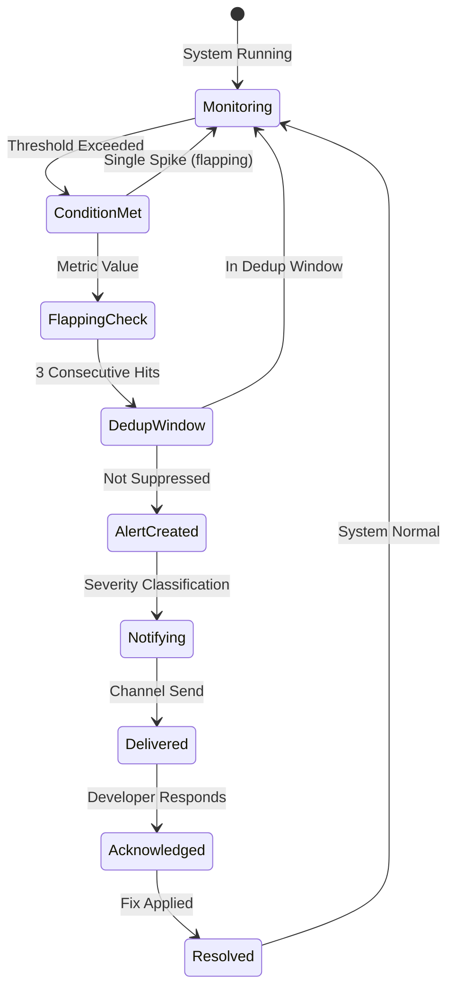
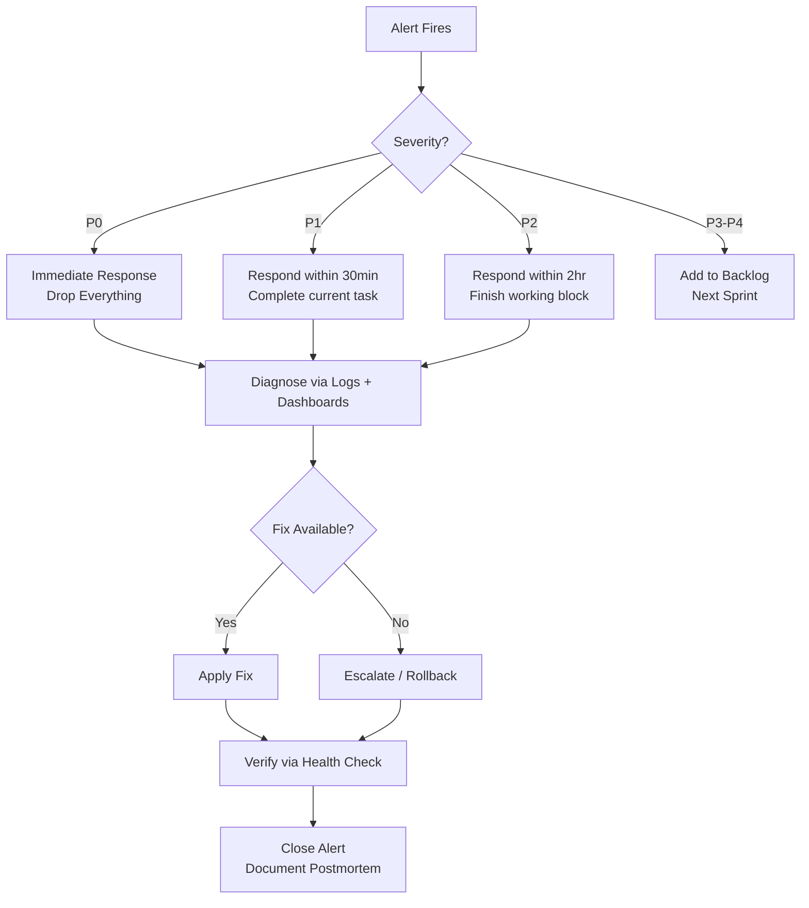

# Alerting System — Second Brain OS

## Document Control

| Field | Value |
|---|---|
| Document ID | OPS-ALR-003 |
| Version | 1.0.0 |
| Status | Approved |
| Date | 2026-07-10 |
| Classification | Internal |
| Owner | Developer |

---

## Table of Contents

- [1. Executive Summary](#1-executive-summary)
- [2. Purpose](#2-purpose)
- [3. Scope](#3-scope)
- [4. Business Context](#4-business-context)
- [5. Functional Specification](#5-functional-specification)
- [6. Non-Functional Requirements](#6-non-functional-requirements)
- [7. Architecture](#7-architecture)
- [8. Diagrams](#8-diagrams)
- [9. Data Models](#9-data-models)
- [10. APIs](#10-apis)
- [11. Security](#11-security)
- [12. Performance Targets](#12-performance-targets)
- [13. Edge Cases](#13-edge-cases)
- [14. Failure Scenarios](#14-failure-scenarios)
- [15. Risks & Mitigations](#15-risks--mitigations)
- [16. Acceptance Criteria](#16-acceptance-criteria)
- [17. Traceability](#17-traceability)
- [18. Implementation Notes](#18-implementation-notes)
- [19. Testing Strategy](#19-testing-strategy)
- [20. References](#20-references)

---

## 1. Executive Summary

Second Brain OS implements a lightweight alerting system based on structured log scanning and health check polling. Without a dedicated alerting platform (PagerDuty, Opsgenie), alerts are surfaced through console log monitoring, Sentry error notifications, and automated email alerts from the scheduler. The alerting system follows the P0-P4 severity framework defined in the Incident Response plan. Future phases will introduce dedicated alert routing and escalation automation.

---

## 2. Purpose

Alerts provide timely notification of system degradation, failures, and security events. They enable the developer to respond before issues impact user experience. The alerting system is the bridge between monitoring data and incident response, translating raw metrics into actionable notifications.

---

## 3. Scope

This document covers:

- Alert conditions and thresholds for all monitored systems
- Severity classification (P0-P4) and associated SLAs
- Notification channels (console logs, Sentry, email)
- Suppression and deduplication rules
- Alert response playbook snippets
- Future alert routing and escalation design

Out of scope: user-facing notifications, marketing alerts, third-party service alerts (Supabase, Vercel, Railway have their own).

---

## 4. Business Context

With a single developer operator, the alerting system must balance comprehensiveness with low noise. False positives waste the developer's limited attention and lead to alert fatigue. Every alert condition is calibrated for accuracy: requiring multiple consecutive failures before firing, using dynamic thresholds where possible, and providing clear diagnostic information in each alert payload.

---

## 5. Functional Specification

### 5.1 Alert Conditions

| Alert | Condition | Severity | Frequency | Channel |
|---|---|---|---|---|
| High latency | p95 > 500ms for 5 consecutive minutes | P1 | 5min | Log + Sentry |
| Elevated error rate | 5xx > 5% in 5-minute window | P1 | 5min | Log + Sentry |
| Circuit breaker opens | Circuit breaker transitions to OPEN | P1 | Immediate | Log + Sentry |
| Scheduler job fails | Same cron job fails 3 consecutive times | P2 | Per failure | Log + email |
| AI provider unavailable | Both Ollama and Claude fail | P0 | Immediate | Log + Sentry + email |
| Rate limit exceeded | 429 responses > 10% of requests | P2 | 5min | Log |
| Health check fails | `/health/ready` returns unhealthy | P1 | 1min | Log + Sentry |
| Supabase connection error | DB query fails with connection error | P0 | Immediate | Log + Sentry + email |
| Memory usage high | Estimated > 80% of container memory | P2 | 5min | Log |
| Authentication spike | 401 errors > 20% of requests | P2 | 5min | Log |
| Unhandled exception | Uncaught exception in request handler | P1 | Immediate | Sentry |
| Token usage spike | Daily token usage exceeds 200% of average | P3 | Daily | Log |

### 5.2 Severity Levels

| Level | Label | SLA | Examples |
|---|---|---|---|
| P0 | Critical | 15min response, 1hr fix | Complete outage, data loss, security breach |
| P1 | High | 30min response, 4hr fix | Major feature unavailable, degradation > 25% |
| P2 | Medium | 2hr response, 24hr fix | Partial degradation, < 25% affected |
| P3 | Low | 24hr response, next sprint | Non-critical bug, cosmetic issue |
| P4 | Wishlist | Next release | Enhancement, tech debt |

### 5.3 Notification Channels

| Channel | Used For | Reliability | Cost |
|---|---|---|---|
| Console log (Railway) | All alerts | High (platform) | Free |
| Sentry error alert | P0-P1 errors | High | Free tier |
| Email (Resend API) | P0, scheduler failures | Medium (depends on Resend) | Free tier |
| Future: Slack webhook | P0-P2 | High | Free |

### 5.4 Suppression Rules

- **Dedup window**: Same alert type + same service = suppressed for 30 minutes
- **Maintenance mode**: All alerts suppressed during scheduled maintenance (set via feature flag `system.maintenance_mode`)
- **Flapping detection**: Alert fires only after 3 consecutive positive checks (prevents flapping)
- **Cooldown**: 5-minute minimum interval between alerts of same type
- **Noise threshold**: If same alert fires 10+ times in 1 hour, auto-escalate to P1 and reduce frequency

---

## 6. Non-Functional Requirements

| ID | Requirement | Target |
|---|---|---|
| ALR-NFR-001 | Alert detection latency | < 60s |
| ALR-NFR-002 | False positive rate | < 5% |
| ALR-NFR-003 | Alert delivery reliability | > 99% |
| ALR-NFR-004 | Maximum alerts per hour | < 50 |
| ALR-NFR-005 | Dedup window | 30 minutes per alert type |

---

## 7. Architecture

```mermaid
flowchart LR
    subgraph Sources["Alert Sources"]
        Metrics[Metrics Collector<br/>5-min window]
        Health[Health Check<br/>/health/ready]
        Errors[Error Logger<br/>Structured Logs]
        Circuit[Circuit Breaker<br/>State Machine]
        Scheduler[Cron Job<br/>Execution Monitor]
        Sentry[Sentry SDK<br/>Exception Tracking]
    end

    subgraph Detection["Alert Detection"]
        Cond[Condition Evaluator<br/>thresholds + rules]
        Flapping[Flapping Detector<br/>3 consecutive checks]
        Dedup[Deduplication<br/>30-min window]
        Suppress[Suppression Rules<br/>maintenance mode]
    end

    subgraph Routing["Alert Routing"]
        Sev[Severity Classifier<br/>P0-P4]
        Policy[Policy Engine<br/>channel selection]
    end

    subgraph Delivery["Delivery"]
        Log[Console Log]
        SentryAlert[Sentry Alert]
        Email[Email via Resend]
    end

    Sources --> Detection
    Detection --> Routing
    Routing --> Delivery
```



---

## 8. Diagrams

### 8.1 Alert Lifecycle



### 8.2 Alert Response Flow



---

## 9. Data Models

### 9.1 Alert Event

```python
from pydantic import BaseModel
from datetime import datetime
from typing import Optional

class AlertEvent(BaseModel):
    alert_id: str  # UUID
    alert_type: str  # high_latency, error_rate, circuit_breaker, etc.
    severity: str  # P0, P1, P2, P3, P4
    title: str
    message: str
    source: str  # metrics, health, scheduler, sentry
    metric_value: Optional[float] = None
    threshold: Optional[float] = None
    service: str  # api, scheduler, ai_provider, database
    environment: str  # production, staging, development
    timestamp: datetime
    acknowledged_at: Optional[datetime] = None
    resolved_at: Optional[datetime] = None
    request_id: Optional[str] = None
    metadata: dict = {}
```

### 9.2 Alert Rule

```python
class AlertRule(BaseModel):
    rule_id: str
    alert_type: str
    severity: str
    condition: str  # "p95_latency > 500"
    window_minutes: int
    consecutive_hits: int = 3
    dedup_minutes: int = 30
    channels: list[str]  # log, sentry, email
    enabled: bool = True
    cooldown_minutes: int = 5
```

---

## 10. APIs

No dedicated alert API exists currently. Alerts are generated internally by monitoring logic and health check polling.

| Function | Source | Description |
|---|---|---|
| `check_alert_conditions()` | `services/scheduler/crons/monitoring.py` | Evaluates metrics against thresholds |
| `send_alert()` | `packages/shared/utils/alerts.py` | Routes alert to configured channels |
| `suppress_alert()` | Feature flag `system.maintenance_mode` | Temporarily disables alerts |

---

## 11. Security

- Alert messages must not contain secrets, tokens, or passwords
- Email alerts are sent via Resend API with TLS; no alert data stored in transit
- Sentry error grouping excludes PII by default
- Alert suppression during maintenance prevents false alarms during known changes
- Alert history logged to Supabase `monitoring_events` table

---

## 12. Performance Targets

| Metric | Target |
|---|---|
| Alert detection latency | < 60s |
| Alert delivery time (Sentry) | < 10s |
| Alert delivery time (email) | < 30s |
| False positive rate | < 5% |
| Alert processing overhead | < 1ms per metric check |

---

## 13. Edge Cases

| Edge Case | Handling |
|---|---|
| Multiple alerts fire simultaneously | Process in severity order; dedup identical types |
| Alert channel fails (email down) | Fall back to console log; retry 3 times |
| Developer unresponsive during P0 | Escalation: retry channels every 5min for 30min |
| Metric spike is temporary (flapping) | Require 3 consecutive checks before alert |
| Scheduled maintenance triggers alert | Suppress via feature flag; auto-resume after window |
| Circuit breaker opens during high load | Alert; circuit breaker self-heals after cooldown |
| Alert dedup key collision | Use composite key: type + service + metric_name |

---

## 14. Failure Scenarios

| Scenario | Impact | Mitigation |
|---|---|---|
| All alert channels down | No notification; blind to issues | Monitor alert delivery itself as a health check |
| Alert spam (misconfigured threshold) | Alert fatigue; developer ignores alerts | Auto-throttle if > 50 alerts/hour; require manual reset |
| Dedup failure | Duplicate alerts | Each alert gets unique ID; receiver deduplicates |
| Maintenance window exceeded | Missed real alerts | Auto-resume suppression after timer expires |
| Alert rule evaluation blocks main thread | Degraded API performance | Run evaluation in background task |

---

## 15. Risks & Mitigations

| Risk | Likelihood | Impact | Mitigation |
|---|---|---|---|
| Alert fatigue from noise | Medium | High | Conservative thresholds; flapping detection; auto-throttle |
| Missed critical alert due to suppression | Low | High | Suppression only with explicit feature flag + timer |
| Email alerts rate-limited by Resend | Low | Medium | Combine multiple alerts into digest; prefer Sentry for urgent |
| No 24/7 coverage (single developer) | High | Medium | Alerts are best-effort; no on-call rotation |
| False sense of security | Medium | Medium | Regular alert testing via chaos experiments |

---

## 16. Acceptance Criteria

- [ ] Alert fires when p95 latency exceeds 500ms for 5 consecutive minutes
- [ ] Alert fires when error rate exceeds 5% in 5-minute window
- [ ] Circuit breaker OPEN state triggers immediate P1 alert
- [ ] Scheduler job failure after 3 attempts triggers P2 alert
- [ ] Both AI providers unavailable triggers P0 alert
- [ ] Duplicate alerts of same type are suppressed within 30-minute window
- [ ] Maintenance mode suppresses all alerts
- [ ] Alert payload includes diagnostic information (request_id, metric value, threshold)

---

## 17. Traceability

| Requirement | Covered By | Verified By |
|---|---|---|
| ALR-NFR-001 | Metric polling implementation | Integration test |
| ALR-NFR-002 | Alert testing with known failure | Chaos experiment |
| ALR-NFR-003 | Channel delivery verification | Manual channel check |

---

## 18. Implementation Notes

### 18.1 Current Implementation

Alerts are implemented as:
- Health check polling via scheduler cron job (every minute)
- Structured log scanning for 5xx, timeout patterns
- LLM client circuit breaker hooks that log on state change
- Sentry SDK exception capture for unhandled errors
- Scheduler job wrapper that logs failures and sends email via Resend

### 18.2 Future Enhancements

| Enhancement | Target | Description |
|---|---|---|
| Slack webhook integration | Q4 2026 | Route P0-P2 alerts to Slack channel |
| Alert dashboard | Q1 2027 | Visual alert history and status board |
| Custom alert rules API | Q1 2027 | Allow configuring thresholds via API |
| Escalation automation | Q2 2027 | Auto-escalate unacknowledged alerts |
| On-call schedule | Q3 2027 | Rotating developer schedule |

### 18.3 Alert Fatigue Prevention

- All thresholds require 3+ consecutive samples before firing
- Dynamic baselines for latency/error rate (moving average, not fixed threshold)
- Maximum 10 alerts of same type per hour before auto-throttle
- Weekly alert review and threshold recalibration

---

## 19. Testing Strategy

| Test Type | Scope | Location |
|---|---|---|
| Unit | Alert condition evaluation | `tests/test_shared_utils.py` |
| Unit | Dedup logic | `tests/test_shared_utils.py` |
| Integration | Circuit breaker alert triggers | `tests/test_llm_client.py` |
| Integration | Scheduler failure alert | `tests/test_scheduler.py` |
| Chaos | Metric spike triggers alert | Manual test |
| E2E | Full alert lifecycle | Manual verification |

---

## 20. References

| Reference | Description |
|---|---|
| [Incident Response](./40_IncidentResponse.md) | Severity framework and response procedures |
| [Monitoring](./32_Monitoring.md) | Metrics collection and thresholds |
| [Dashboards](./Dashboards.md) | Dashboard data sources for alerts |
| [Tracing](./Tracing.md) | Request IDs in alert payloads |
| [Runbooks](./39_Runbooks.md) | Alert response playbooks |
| [SLA](./43_SLA.md) | Service level agreement targets |
| [Sentry](./Sentry.md) | Error tracking and alert integration |

---

## Revision History

| Version | Date | Author | Changes |
|---|---|---|---|
| 1.0.0 | 2026-07-10 | Developer | Initial alerting system document |
