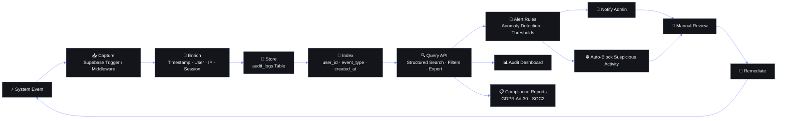

# Audit Logs — Second Brain OS

## Document Control

| Field | Value |
|---|---|
| **Document ID** | OPS-AUDIT-001 |
| **Version** | 1.0 |
| **Status** | Draft |
| **Author** | ARIA OS Engineering |
| **Last Updated** | 2026-06-11 |
| **Approval** | Pending |
| **Classification** | Internal — Security & Compliance |

---



## 1. Executive Summary

Second Brain OS processes personal productivity data across 15+ modules (tasks, courses, goals, ideas, projects, resources, opportunities, income, habits, sleep, time). As the system scales toward multi-user and handles increasingly sensitive user data, a comprehensive audit logging system is required to satisfy both internal security requirements and external regulatory mandates.

**Purpose:** Provide a tamper-evident, queryable record of all significant system events — authentication attempts, data mutations, role/permission changes, security events, and system-level operations.

**Scope:** Covers the entire tech stack: Next.js 14 frontend, FastAPI backend, Supabase PostgreSQL, and the AI agent orchestrator (Ollama/Claude).

**Drivers:**
- GDPR Article 30 (records of processing activities)
- DPDP Act 2023 Section 8 (security safeguards, breach notification)
- Internal security incident response requirements
- Multi-user accountability for Phase 2 launch

---

## 2. Audit Event Types

### 2.1 Authentication Events

| Event | Trigger | Logged Data |
|---|---|---|
| `auth.login.success` | Successful login via Supabase Auth | user_id, email, IP, user_agent, timestamp |
| `auth.login.failure` | Failed login attempt | email (attempted), IP, user_agent, reason (invalid creds / account locked) |
| `auth.logout` | User logout | user_id, session_id |
| `auth.token.refresh` | JWT token refresh | user_id, old_token_jti, new_token_jti |
| `auth.mfa.verify` | MFA challenge passed/failed | user_id, method (TOTP/SMS), result |
| `auth.password.reset` | Password reset requested/completed | user_id, method (email link) |
| `auth.session.revoked` | Admin revokes a session | admin_id, target_user_id, session_id |

### 2.2 Data Mutations

| Event | Trigger | Logged Data |
|---|---|---|
| `data.create` | INSERT on any user-owned table | user_id, resource_type, resource_id, new_value (full row) |
| `data.update` | UPDATE on any user-owned table | user_id, resource_type, resource_id, old_value (diff), new_value (diff) |
| `data.delete` | DELETE on any user-owned table | user_id, resource_type, resource_id, old_value (full row deleted) |
| `data.bulk_create` | Bulk import/creation (e.g., CSV upload) | user_id, resource_type, count, source (e.g., `csv_import`) |
| `data.bulk_delete` | Bulk delete (e.g., archive old tasks) | user_id, resource_type, count, filter_criteria |

Tracked tables: `tasks`, `courses`, `goals`, `ideas`, `projects`, `resources`, `opportunities`, `income`, `habits`, `sleep_logs`, `time_entries`, `users`.

### 2.3 Role & Permission Changes

| Event | Trigger | Logged Data |
|---|---|---|
| `role.assigned` | User assigned a role | admin_id, target_user_id, role (admin/user/viewer) |
| `role.revoked` | User role removed | admin_id, target_user_id, previous_role |
| `permission.granted` | Custom permission added | admin_id, target_user_id, permission_name |
| `permission.revoked` | Custom permission removed | admin_id, target_user_id, permission_name |
| `team.member.added` | User added to shared workspace | inviter_id, invitee_id, workspace_id |
| `team.member.removed` | User removed from workspace | remover_id, removed_user_id, workspace_id |

### 2.4 Security Events

| Event | Trigger | Logged Data |
|---|---|---|
| `security.rate_limit.hit` | API rate limit exceeded | user_id/IP, endpoint, count, window |
| `security.suspicious_ip` | Request from known-bad IP / geolocation anomaly | user_id, IP, geolocation, action triggered |
| `security.unauthorized_access` | 403 to protected resource | user_id/IP, resource_path, role_at_time |
| `security.breach_alert` | Detected indicator of compromise | alert_type, severity, source_ip, evidence |
| `security.api_key.created` | API key generated | user_id, key_prefix (first 8 chars), expires_at |
| `security.api_key.revoked` | API key revoked | user_id, key_prefix, reason |

### 2.5 System Events

| Event | Trigger | Logged Data |
|---|---|---|
| `system.startup` | FastAPI / scheduler starts | service_name, version, host, pid |
| `system.shutdown` | Service stops | service_name, uptime_seconds |
| `system.config.change` | Feature flag / env var changed | changed_by, config_key, old_value, new_value |
| `system.db.migration` | Alembic migration runs | migration_id, direction (up/down), timestamp |
| `system.agent.invocation` | AI agent called (Ollama/Claude) | agent_name, model, prompt_tokens, completion_tokens, latency_ms, user_id |
| `system.scheduler.job` | Cron / APScheduler job runs | job_name, triggered_by, duration_ms, success |

---

## 3. Audit Data Model

### 3.1 `audit_logs` Table Schema

```sql
-- Supabase / PostgreSQL audit_logs table

CREATE TABLE audit_logs (
    event_id        UUID PRIMARY KEY DEFAULT gen_random_uuid(),
    timestamp       TIMESTAMPTZ NOT NULL DEFAULT now(),
    user_id         UUID REFERENCES users(id) ON DELETE SET NULL,
    session_id      TEXT,

    -- Action classification
    action          TEXT NOT NULL,              -- e.g., 'data.update', 'auth.login.success'
    category        TEXT NOT NULL DEFAULT 'system',  -- 'auth', 'data', 'role', 'security', 'system'

    -- Resource identification
    resource_type   TEXT,                       -- 'tasks', 'goals', 'users', etc.
    resource_id     TEXT,                       -- UUID of the affected resource

    -- Mutation data (for data.* events)
    old_value       JSONB,                      -- previous state (null for creates)
    new_value       JSONB,                      -- new state (null for deletes)
    diff_summary    TEXT,                       -- human-readable change description

    -- Request context
    ip_address      INET,
    user_agent      TEXT,
    request_id      TEXT,                       -- correlation ID for request tracing
    endpoint        TEXT,                       -- API path that triggered the event

    -- Enrichment
    severity        TEXT DEFAULT 'info',        -- 'info', 'warning', 'critical'
    metadata        JSONB DEFAULT '{}',        -- flexible extra data

    -- Audit integrity
    checksum        TEXT                        -- SHA-256 of concatenated key fields

) PARTITION BY RANGE (timestamp);

-- Partition by month
CREATE TABLE audit_logs_2026_06 PARTITION OF audit_logs
    FOR VALUES FROM ('2026-06-01') TO ('2026-07-01');

CREATE TABLE audit_logs_2026_07 PARTITION OF audit_logs
    FOR VALUES FROM ('2026-07-01') TO ('2026-08-01');
-- ... monthly partitions created by cron
```

### 3.2 Indexes

```sql
CREATE INDEX idx_audit_timestamp ON audit_logs (timestamp DESC);
CREATE INDEX idx_audit_user_id ON audit_logs (user_id);
CREATE INDEX idx_audit_action ON audit_logs (action);
CREATE INDEX idx_audit_category ON audit_logs (category);
CREATE INDEX idx_audit_resource ON audit_logs (resource_type, resource_id);
CREATE INDEX idx_audit_request_id ON audit_logs (request_id);
-- GIN index for JSONB metadata queries
CREATE INDEX idx_audit_metadata ON audit_logs USING GIN (metadata);
```

### 3.3 Checksum Computation

```python
# apps/api/app/audit/checksum.py
import hashlib, json

def compute_audit_checksum(event: dict) -> str:
    raw = f"{event['timestamp']}|{event['user_id']}|{event['action']}|{event['resource_id']}|{json.dumps(event.get('old_value', ''), sort_keys=True)}|{json.dumps(event.get('new_value', ''), sort_keys=True)}"
    return hashlib.sha256(raw.encode()).hexdigest()
```

---

## 4. Architecture

```
┌──────────┐     ┌──────────────┐     ┌────────────┐     ┌────────────────┐
│  Client  │────▶│  FastAPI App │────▶│  Audit     │────▶│  Supabase      │
│ (Next.js)│     │  Middleware  │     │  Writer    │     │  audit_logs    │
└──────────┘     └──────────────┘     └────────────┘     └────────────────┘
                       │                                         │
                       │                                  ┌──────┴──────┐
                       │                                  │  Partition  │
                       ▼                                  │  Manager    │
                ┌──────────────┐                          │  (cron job) │
                │  Python      │                          └─────────────┘
                │  Logger      │
                │  (structlog) │
                └──────┬───────┘
                       │
                       ▼
                ┌──────────────┐
                │  Retry Queue │
                │  (fail-safe) │
                └──────────────┘
```

**Data Flow:**
1. **Request enters** FastAPI — `AuditMiddleware` extracts `user_id` from JWT, generates `request_id` via UUID.
2. **Logger middleware** captures request metadata (IP, user_agent, endpoint, method) and injects into `request.state`.
3. **Route handler** executes — for mutations, the handler calls `AuditWriter.record()` with action, old/new values.
4. **AuditWriter** validates payload, computes checksum, writes via `supabase.table('audit_logs').insert(...)` with retry logic (max 3 attempts, exponential backoff).
5. **On failure**, event is enqueued to a local JSON log file as fallback, recovered by a periodic flush worker.
6. **Partition manager** (monthly cron job) creates next month's partition and drops partitions older than retention.

### Middleware Implementation Skeleton

```python
# apps/api/app/audit/middleware.py
from starlette.middleware.base import BaseHTTPMiddleware
from structlog import get_logger

logger = get_logger()

class AuditMiddleware(BaseHTTPMiddleware):
    async def dispatch(self, request, call_next):
        request.state.request_id = str(uuid.uuid4())
        request.state.audit_context = {
            "ip_address": request.client.host,
            "user_agent": request.headers.get("user-agent"),
            "endpoint": str(request.url.path),
            "method": request.method,
        }
        response = await call_next(request)
        # Log non-GET requests as potential mutations
        if request.method not in ("GET", "HEAD", "OPTIONS"):
            logger.info("request.completed", **request.state.audit_context, status_code=response.status_code)
        return response
```

---

## 5. Current State

| Capability | Status | Detail |
|---|---|---|
| Request logging | ✅ Basic | `structlog` logging in `packages/shared/utils/logger.py` — JSON-structured request/response logs |
| Request correlation | ⚠️ Partial | No global `request_id` propagated through the system |
| Data mutation audit | ❌ None | No tracking of who changed what or when |
| Auth event audit | ⚠️ Partial | Supabase Auth logs available via Supabase dashboard, not queryable in-app |
| AI agent audit | ❌ None | No trace of which prompt went to which model |
| Compliance readiness | ❌ None | No audit trail for GDPR Art 30 or DPDP Act compliance |
| Audit retention | ❌ None | No retention policy or partition management |
| Audit review UI | ❌ None | No dashboard for audit log review |

---

## 6. Implementation

### 6.1 FastAPI Middleware for Request Audit

```python
# apps/api/app/audit/__init__.py
from .middleware import AuditMiddleware
from .writer import AuditWriter
from .models import AuditEvent

__all__ = ["AuditMiddleware", "AuditWriter", "AuditEvent"]
```

```python
# apps/api/app/audit/models.py
from pydantic import BaseModel
from typing import Optional, Any
from datetime import datetime

class AuditEvent(BaseModel):
    user_id: Optional[str] = None
    session_id: Optional[str] = None
    action: str
    category: str = "system"
    resource_type: Optional[str] = None
    resource_id: Optional[str] = None
    old_value: Optional[dict] = None
    new_value: Optional[dict] = None
    diff_summary: Optional[str] = None
    ip_address: Optional[str] = None
    user_agent: Optional[str] = None
    request_id: Optional[str] = None
    endpoint: Optional[str] = None
    severity: str = "info"
    metadata: dict = {}
```

### 6.2 SQLAlchemy / Triggers for Data Changes

For mutation-heavy tables, use database triggers as a safety net alongside application-level logging:

```sql
-- Trigger function for data mutation audit
CREATE OR REPLACE FUNCTION audit_log_trigger()
RETURNS TRIGGER AS $$
DECLARE
    _user_id UUID := current_setting('app.current_user_id', TRUE)::UUID;
BEGIN
    IF TG_OP = 'INSERT' THEN
        INSERT INTO audit_logs (user_id, action, category, resource_type, resource_id, new_value, diff_summary)
        VALUES (_user_id, 'data.create', 'data', TG_TABLE_NAME, NEW.id::TEXT, row_to_json(NEW), 'Created ' || TG_TABLE_NAME);
        RETURN NEW;
    ELSIF TG_OP = 'UPDATE' THEN
        INSERT INTO audit_logs (user_id, action, category, resource_type, resource_id, old_value, new_value, diff_summary)
        VALUES (_user_id, 'data.update', 'data', TG_TABLE_NAME, NEW.id::TEXT, row_to_json(OLD), row_to_json(NEW), 'Updated ' || TG_TABLE_NAME);
        RETURN NEW;
    ELSIF TG_OP = 'DELETE' THEN
        INSERT INTO audit_logs (user_id, action, category, resource_type, resource_id, old_value, diff_summary)
        VALUES (_user_id, 'data.delete', 'data', TG_TABLE_NAME, OLD.id::TEXT, row_to_json(OLD), 'Deleted ' || TG_TABLE_NAME);
        RETURN OLD;
    END IF;
END;
$$ LANGUAGE plpgsql SECURITY DEFINER;

-- Apply trigger to core tables
CREATE TRIGGER audit_tasks AFTER INSERT OR UPDATE OR DELETE ON tasks FOR EACH ROW EXECUTE FUNCTION audit_log_trigger();
CREATE TRIGGER audit_goals AFTER INSERT OR UPDATE OR DELETE ON goals FOR EACH ROW EXECUTE FUNCTION audit_log_trigger();
CREATE TRIGGER audit_income AFTER INSERT OR UPDATE OR DELETE ON income FOR EACH ROW EXECUTE FUNCTION audit_log_trigger();
```

**Note:** The `app.current_user_id` session variable is set by the FastAPI middleware on each authenticated request via:
```sql
SELECT set_config('app.current_user_id', request.user.id, FALSE);
```

### 6.3 Structured JSON Logs

```python
# apps/api/app/audit/writer.py
import structlog
from supabase import create_client
from tenacity import retry, stop_after_attempt, wait_exponential

logger = structlog.get_logger()

class AuditWriter:
    def __init__(self, supabase_client):
        self.supabase = supabase_client
        self.fallback_logger = structlog.get_logger("audit_fallback")

    @retry(stop=stop_after_attempt(3), wait=wait_exponential(multiplier=1, min=1, max=10))
    async def record(self, event: AuditEvent) -> None:
        payload = event.model_dump()
        payload["checksum"] = compute_audit_checksum(payload)
        payload["timestamp"] = datetime.utcnow().isoformat()

        result = self.supabase.table("audit_logs").insert(payload).execute()
        if hasattr(result, 'error') and result.error:
            raise AuditWriteError(result.error.message)

    async def record_fallback(self, event: AuditEvent) -> None:
        # Write to local file as fallback when Supabase is unreachable
        self.fallback_logger.error("audit.write_failed", **event.model_dump())
```

---

## 7. Audit Storage Strategy

### 7.1 Storage Architecture

| Component | Detail |
|---|---|
| **Primary store** | Supabase PostgreSQL `audit_logs` partitioned table |
| **Partition key** | `timestamp` — monthly ranges |
| **Retention** | 90 days (rolling) |
| **Cold storage** | Archived partitions exported as JSON to Supabase Storage bucket (`audit-archive/`) before deletion |
| **Fallback** | Local JSON log files at `logs/audit-fallback/` — flushed when Supabase becomes available |

### 7.2 Partition Management

Cron job (APScheduler in `services/scheduler/`) runs on the 1st of each month:

```python
# services/scheduler/jobs/audit_partitions.py
async def manage_audit_partitions():
    """Create next month's partition, drop partitions older than 90 days."""
    current_month = datetime.now().strftime("%Y_%m")
    next_month = (datetime.now() + relativedelta(months=1)).strftime("%Y_%m")

    # Create next month
    await execute_sql(f"""
        CREATE TABLE IF NOT EXISTS audit_logs_{next_month}
        PARTITION OF audit_logs
        FOR VALUES FROM ('{next_month.replace("_", "-")}-01') TO ('{next_month.replace("_", "-")}-01'::DATE + INTERVAL '1 month');
    """)

    # Archive and drop partitions older than 90 days
    cutoff = (datetime.now() - timedelta(days=90)).strftime("%Y_%m")
    old_partitions = await fetch_old_partitions(cutoff)
    for partition in old_partitions:
        await export_partition_to_storage(partition["name"])
        await execute_sql(f"DROP TABLE IF EXISTS {partition['name']};")
```

### 7.3 Retention Schedule

| Partition Age | Action |
|---|---|
| 0–90 days | Active — queryable via dashboard |
| 90–97 days | Marked for deletion, available for export |
| 97+ days | Exported to cold storage, partition dropped |

### 7.4 Size Estimate

Assuming 1K users, ~100 events/user/day:
- Daily event volume: ~100,000
- Average event size: ~500 bytes
- Daily storage: ~50 MB
- Monthly storage: ~1.5 GB
- 90-day retention: ~4.5 GB

Well within Supabase Pro plan limits (8 GB included).

---

## 8. Audit Review & Analysis

### 8.1 Dashboard Integration

A dedicated "Audit Log" page in the admin panel (`apps/web/app/admin/audit/page.tsx`) provides:

| Feature | Implementation |
|---|---|
| **Event feed** | Infinite-scroll table sorted by `timestamp DESC` |
| **Filtering** | By user, action type, category, resource, date range, severity |
| **Search** | Full-text search across `diff_summary`, `metadata` (JSONB) |
| **Detail panel** | Click-to-expand showing full `old_value` / `new_value` JSON diff |
| **CSV export** | Export filtered results as CSV for compliance reporting |
| **Real-time** | WebSocket feed for critical events (security breaches, auth failures) |

### 8.2 Audit API Endpoints

```python
# apps/api/app/api/audit.py
from fastapi import APIRouter, Depends, Query

router = APIRouter(prefix="/api/admin/audit", tags=["Admin - Audit"])

@router.get("/events")
async def list_audit_events(
    user_id: Optional[str] = None,
    action: Optional[str] = None,
    category: Optional[str] = None,
    resource_type: Optional[str] = None,
    start_date: Optional[datetime] = None,
    end_date: Optional[datetime] = None,
    severity: Optional[str] = None,
    page: int = Query(1, ge=1),
    page_size: int = Query(50, ge=1, le=200),
    current_user = Depends(require_admin),
):
    """List audit events with filtering and pagination."""
    query = supabase.table("audit_logs").select("*", count="exact")
    if user_id: query = query.eq("user_id", user_id)
    if action: query = query.eq("action", action)
    if category: query = query.eq("category", category)
    if start_date: query = query.gte("timestamp", start_date.isoformat())
    if end_date: query = query.lte("timestamp", end_date.isoformat())
    query = query.order("timestamp", desc=True)
    query = query.range((page-1)*page_size, page*page_size - 1)
    return query.execute()

@router.get("/events/{event_id}")
async def get_audit_event(
    event_id: str,
    current_user = Depends(require_admin),
):
    """Get full audit event detail."""
    result = supabase.table("audit_logs").select("*").eq("event_id", event_id).single().execute()
    if not result.data:
        raise HTTPException(404, "Audit event not found")
    return result.data

@router.get("/stats")
async def audit_stats(
    start_date: datetime,
    end_date: datetime,
    current_user = Depends(require_admin),
):
    """Aggregated audit statistics for dashboard."""
    return supabase.rpc("audit_stats", {
        "start_date": start_date.isoformat(),
        "end_date": end_date.isoformat(),
    }).execute()
```

### 8.3 Frontend Page (Admin)

```typescript
// apps/web/app/admin/audit/page.tsx
"use client";

import { useState } from "react";
import { useAdminAudit } from "@/hooks/useAdminAudit";
import { AuditFilters } from "@/components/admin/audit/AuditFilters";
import { AuditTable } from "@/components/admin/audit/AuditTable";
import { AuditDetailModal } from "@/components/admin/audit/AuditDetailModal";

export default function AuditLogPage() {
  const { events, loading, total, filters, setFilters, exportCSV } = useAdminAudit();
  const [selectedEvent, setSelectedEvent] = useState(null);

  return (
    <div className="flex flex-col gap-6 p-6">
      <div className="flex items-center justify-between">
        <h1 className="font-syne text-2xl font-bold text-text-primary">Audit Log</h1>
        <button className="btn" onClick={exportCSV}>Export CSV</button>
      </div>
      <AuditFilters filters={filters} onChange={setFilters} />
      <AuditTable events={events} loading={loading} total={total} onSelect={setSelectedEvent} />
      {selectedEvent && (
        <AuditDetailModal event={selectedEvent} onClose={() => setSelectedEvent(null)} />
      )}
    </div>
  );
}
```

---

## 9. Compliance

### 9.1 GDPR Article 30 — Records of Processing Activities

| Requirement | Implementation |
|---|---|
| Name & contact of controller | Stored in `system.config` table, exposed via `/api/admin/compliance/controller-info` |
| Purpose of processing | Documented in PRD; each `action` field maps to a processing purpose |
| Description of data subjects | `users` table; categories defined in `user_roles` |
| Categories of recipients | Audit logs record every data access and disclosure via `resource_type` and `resource_id` |
| Transfers to third countries | Logged when AI prompts sent to Claude API (US-based); `metadata.third_party_transfer = true` |
| Time limits for erasure | Enforced by retention policy (Section 7) and automated deletion scripts |
| Technical & organizational measures | Documented in Security Policy; checksums ensure audit log integrity |

**GDPR Article 30 Compliance Report:**
```sql
-- Generate records of processing for compliance review
SELECT
    user_id,
    action,
    resource_type,
    COUNT(*) as occurrences,
    MIN(timestamp) as first_seen,
    MAX(timestamp) as last_seen
FROM audit_logs
WHERE timestamp >= now() - INTERVAL '90 days'
GROUP BY user_id, action, resource_type
ORDER BY last_seen DESC;
```

### 9.2 DPDP Act 2023 Section 8 — Security Safeguards

| Requirement | Implementation |
|---|---|
| Implement security safeguards | Audit trail acts as detective control; alerts on suspicious patterns |
| Breach notification | `security.breach_alert` event triggers automated email to data fiduciary |
| Record of breach | All breach-related events stored with severity `critical` in audit_logs |
| Data protection impact assessment | Audit trail provides evidence for DPIA documentation |

### 9.3 Audit Integrity

- **Tamper evidence:** Every event includes a SHA-256 checksum covering content and context. Periodic integrity checks recompute checksums and flag mismatches.
- **Append-only:** `audit_logs` table is write-only for the application. Deletion is restricted to the partition manager cron job (using a dedicated service role key).
- **Immutable storage:** Archived partitions are written to Supabase Storage with object lock enabled, preventing deletion or modification during the retention period.

---

## 10. Appendices

### 10.1 Audit Schema SQL

Full migration file at `packages/database/schemas/migrations/004_audit_logs.sql`.

### 10.2 Middleware Implementation

Located at `apps/api/app/audit/` — module readme:

| File | Purpose |
|---|---|
| `__init__.py` | Public API exports |
| `middleware.py` | Starlette `BaseHTTPMiddleware` for request context |
| `writer.py` | `AuditWriter` class with retry and fallback |
| `models.py` | Pydantic `AuditEvent` model |
| `checksum.py` | SHA-256 checksum computation |
| `router.py` | FastAPI admin audit endpoints |

### 10.3 Revision History

| Version | Date | Author | Changes |
|---|---|---|---|
| 1.0 | 2026-06-11 | ARIA OS Engineering | Initial draft — full audit architecture, schema, implementation, compliance mapping |
