# Contributing to Second Brain OS (ARIA OS)

| Field | Value |
|---|---|
| Document ID | OPS-CON-001 |
| Version | 2.0.0 |
| Status | Active |
| Last Updated | 2026-06-11 |
| Classification | Public — Contributor Guide |
| Owner | Engineering Lead |

---



```mermaid
%%{init: {'theme':'base','themeVariables':{'primaryColor':'#6366F1','primaryTextColor':'#F1F5F9','primaryBorderColor':'#6366F1','lineColor':'#818CF8','secondaryColor':'#13151A','tertiaryColor':'#0A0B0F','background':'#0A0B0F','mainBkg':'#13151A','nodeBorder':'#334155','clusterBkg':'#0A0B0F','clusterBorder':'#1E293B','titleColor':'#F1F5F9','edgeLabelBackground':'#13151A','nodeTextColor':'#F1F5F9'}}}%%
flowchart LR
    Fork["🍴 Fork Repository"] --> Clone2["📥 Clone Fork Locally"]
    Clone2 --> Branch["🌿 Create Feature Branch<br/>feature/ · fix/ · docs/"]
    Branch --> Setup["🔧 Setup Dev Environment<br/>make install"]
    Setup --> Code["💻 Write Code + Tests"]
    Code --> Lint["🧹 Run Linters<br/>make lint"]
    Lint --> Validate["✅ Validate Prompts<br/>make validate-prompts"]
    Validate --> Test["🧪 Run Tests<br/>make test"]
    Test --> AllPassing{"All Passing?"}
    AllPassing -->|No| Code
    AllPassing -->|Yes| Commit["📝 Commit Changes<br/>Conventional Commit Format"]
    Commit --> Push["📤 Push to Fork"]
    Push --> PR["🔄 Open Pull Request"]
    PR --> CI["⚙️ CI Pipeline<br/>5 Jobs Running"]
    CI --> CIGreen{"CI Green?"}
    CIGreen -->|No| Code
    CIGreen -->|Yes| Review["👀 Code Review<br/>30-Item Checklist"]
    Review --> Approved{"Approved?"}
    Approved -->|Changes Requested| Code
    Approved -->|Yes| Merge["🔀 Squash & Merge"]
    Merge --> Deploy2["🚀 Auto-Deploy to Production"]
    Deploy2 --> Monitor2["📊 Monitor for Issues"]
    Monitor2 --> Celebrate["🎉 Contribution Complete"]
```

## 1. Welcome & Community Values

Welcome to the SecondBrain OS contributor community! We're building a personal AI productivity system designed specifically for BTech CSE students — combining tasks, courses, goals, habits, sleep, income, projects, and more into a single intelligent system with a local-first AI assistant (ARIA).

**Our community values:**
- **Student-first:** Every feature we build serves the real needs of Indian BTech CSE students
- **Privacy by design:** Local-first AI (Ollama), no external analytics, user-owned data
- **Quality over speed:** Well-tested, documented, and reviewed code before merging
- **Inclusive collaboration:** Respectful, constructive, and supportive communication
- **Graceful degradation:** Every feature must work without AI — AI is a value-add, not a requirement

We believe great software is built by diverse teams with varied perspectives. Whether you're a first-time contributor or an experienced developer, you are welcome here.

---

## 2. Code of Conduct

All contributors must adhere to our [Code of Conduct](../../CODE_OF_CONDUCT.md).

Key expectations:
- Use welcoming and inclusive language
- Be respectful of differing viewpoints and experiences
- Accept constructive criticism gracefully
- Focus on what is best for the community and the user
- Report unacceptable behavior to the maintainers

---

## 3. Getting Started

### 3.1 Prerequisites

| Tool | Version Required | Verification Command |
|---|---|---|
| Node.js | 18.x or later | `node --version` |
| npm | 9.x or later | `npm --version` |
| Python | 3.10 or later | `python --version` |
| Git | 2.30 or later | `git --version` |
| Ollama | 0.3 or later (optional) | `ollama --version` |

### 3.2 Clone and Setup

```bash
# Clone the repository
git clone https://github.com/your-org/aria-os.git
cd "ARIA OS - SecondBrain"

# Install frontend dependencies
cd apps/web
npm install

# Install backend dependencies
cd ../api
python -m venv venv

# On Windows:
venv\Scripts\Activate.ps1
# On macOS/Linux:
# source venv/bin/activate

pip install -r requirements.txt

# Install root-level dependencies
cd ../..
pip install -r requirements.txt
```

### 3.3 Configure Environment

```bash
# Backend environment
cp .env.example .env
# Edit .env with your values:
# - SUPABASE_URL and SUPABASE_KEY (from your Supabase project)
# - JWT_SECRET (generate with: python -c "import secrets; print(secrets.token_hex(32))")
# - CLAUDE_API_KEY (optional, only if using Claude fallback)
# - OLLAMA_BASE_URL defaults to http://localhost:11434

# Frontend environment
cp apps/web/.env.example apps/web/.env.local
# Edit apps/web/.env.local with:
# - NEXT_PUBLIC_SUPABASE_URL
# - NEXT_PUBLIC_SUPABASE_ANON_KEY
```

### 3.4 Run Development Servers

You need **3 terminals** for full-stack development:

```bash
# Terminal 1: Backend (FastAPI)
cd apps/api
venv\Scripts\Activate.ps1
uvicorn main:app --reload --port 8000
# → http://localhost:8000/docs (Swagger UI)

# Terminal 2: Frontend (Next.js)
cd apps/web
npm run dev
# → http://localhost:3000

# Terminal 3: Scheduler (optional, for cron jobs)
cd services/scheduler
pip install -r requirements.txt
python main.py
```

### 3.5 Verify Setup

```bash
# 1. Health endpoint works
curl -s http://localhost:8000/api/health | python -m json.tool
# Expected: {"status": "healthy", ...}

# 2. Frontend loads
curl -s -o /dev/null -w "%{http_code}" http://localhost:3000
# Expected: 200

# 3. Prompts validate (if working on AI)
python scripts/validate_prompts.py
# Expected: All prompts valid

# 4. All tests pass
python -m pytest tests/ -x
# Expected: 30/30 passed
```

---

## 4. Development Environment Setup (Detailed)

### 4.1 Node.js 18 Setup

```bash
# Using nvm (recommended)
nvm install 18
nvm use 18

# Or download directly: https://nodejs.org/en/download/
```

### 4.2 Python 3.10 Setup

```bash
# Windows: Download from python.org
# Or use winget:
winget install Python.Python.3.10

# macOS:
# brew install python@3.10

# Linux:
# sudo apt install python3.10 python3.10-venv
```

### 4.3 Ollama Setup (for Local AI)

```bash
# Download from https://ollama.com/download

# After installation, pull required models:
ollama pull mistral:latest      # Default model for most agents
ollama pull llama3.1:latest     # Fallback model

# Start Ollama service:
ollama serve
```

### 4.4 Supabase Setup

1. Create a free project at https://supabase.com
2. Copy your project URL and anon key from Settings → API
3. Run migrations:
```bash
supabase db push
```
4. Seed test data:
```bash
python scripts/seed_test_data.py
```

### 4.5 Recommended VS Code Extensions

| Extension | Purpose |
|---|---|
| ESLint | TypeScript/React linting |
| Prettier | Code formatting |
| Python (Microsoft) | Python editing, linting, debugging |
| Ruff | Python linting |
| Tailwind CSS IntelliSense | Tailwind CSS class completion |
| GitLens | Git history visualization |
| YAML | YAML frontmatter validation |
| Thunder Client | API endpoint testing |

### 4.6 VS Code Settings

Create `.vscode/settings.json` in the project root:

```json
{
  "editor.formatOnSave": true,
  "editor.defaultFormatter": "esbenp.prettier-vscode",
  "[python]": {
    "editor.defaultFormatter": "charliermarsh.ruff",
    "editor.formatOnSave": true,
    "editor.codeActionsOnSave": {
      "source.organizeImports": true
    }
  },
  "[typescript]": {
    "editor.codeActionsOnSave": {
      "source.fixAll.eslint": true
    }
  },
  "typescript.preferences.importModuleSpecifier": "relative",
  "python.terminal.activateEnvironment": true,
  "files.associations": {
    "*.md": "markdown",
    "AGENTS.md": "markdown"
  }
}
```

---

## 5. Branch Naming Conventions

All branches must follow a consistent naming convention to enable automated CI workflows and maintain clarity.

### 5.1 Format

```
<type>/<short-description>
```

### 5.2 Types

| Type | Purpose | Example |
|---|---|---|
| `feature/` | New functionality | `feature/task-ai-breakdown` |
| `fix/` | Bug fixes | `fix/reschedule-date-picker` |
| `hotfix/` | Urgent production fixes | `hotfix/auth-500-error` |
| `docs/` | Documentation updates | `docs/api-endpoint-reference` |
| `refactor/` | Code restructuring | `refactor/supabase-client` |
| `test/` | Test additions or fixes | `test/agent-prompt-coverage` |
| `chore/` | Build, CI, dependency updates | `chore/upgrade-nextjs-14` |
| `prompt/` | Prompt file changes | `prompt/briefing-agent-v2` |

### 5.3 Rules

- Use kebab-case: `feature/my-feature-name`
- Keep branches short-lived (target: < 1 week)
- Always branch from `main`
- Delete branch after merge
- Example: `feature/offline-pwa-service-worker`

### 5.4 Creating a Branch

```bash
git checkout main
git pull origin main
git checkout -b feature/<your-feature-name>
```

---

## 6. Commit Message Conventions

We follow **Conventional Commits** specification. This enables automated changelog generation and semantic versioning.

### 6.1 Format

```
<type>(<scope>): <description>

[optional body]

[optional footer(s)]
```

### 6.2 Types

| Type | Description | Emoji Convention |
|---|---|---|
| `feat` | New feature | ✨ |
| `fix` | Bug fix | 🐛 |
| `docs` | Documentation only | 📝 |
| `style` | Formatting, whitespace | 💄 |
| `refactor` | Code restructuring | ♻️ |
| `test` | Tests only | ✅ |
| `chore` | Build, CI, deps | 🔧 |
| `perf` | Performance improvement | ⚡️ |
| `prompt` | Prompt file changes | 🤖 |

### 6.3 Scopes

| Scope | Area |
|---|---|
| `web` | Frontend (Next.js) |
| `api` | Backend (FastAPI) |
| `ai` | AI agents / PromptLoader / prompts |
| `db` | Database / Supabase |
| `scheduler` | Cron jobs |
| `auth` | Authentication / OAuth |
| `docs` | Documentation |
| `infra` | CI/CD / Docker / Deployment |
| `ui` | UI components / design system |

### 6.4 Examples

```
feat(ai): add sleep agent wind-down message generation

Implements the sleep agent (A13) to generate personalized wind-down
messages based on sleep logs and tomorrow's schedule.

Closes #142
```

```
fix(api): resolve task reschedule date validation error

Due_date validation was using UTC instead of local timezone,
causing off-by-one errors for IST users.

Fixes #89
```

```
docs(operations): upgrade runbooks to enterprise standard

Full rewrite of 39_Runbooks.md with SDVRP format, severity definitions,
auto-remediation scripts, and drill schedule.

Closes #201
```

```
chore(infra): upgrade Next.js from 14.1 to 14.2

Updates package.json and lockfile. No breaking changes expected.
```

### 6.5 Breaking Changes

Add `BREAKING CHANGE:` in the footer:

```
feat(api)!: restructure opportunity endpoint response

BREAKING CHANGE: The /api/opportunities response format has changed.
The `match_score` field is now `score` and `skills_matched` is now `matches`.
```

---

## 7. Pull Request Process

### 7.1 Before Creating a PR

- [ ] Branch is up to date with `main`: `git pull origin main`
- [ ] All existing tests pass: `python -m pytest tests/ -x`
- [ ] New tests added for new functionality
- [ ] Lint passes: `ruff check apps/api/`
- [ ] TypeScript check passes: `cd apps/web && npm run type-check`
- [ ] Prompt validation passes: `python scripts/validate_prompts.py`
- [ ] No debug code, console.logs, or TODOs
- [ ] Documentation updated (if feature changes)
- [ ] Commit messages follow Conventional Commits

### 7.2 Creating the PR

```bash
# Push your branch
git push origin feature/your-feature-name

# Create PR via GitHub CLI
gh pr create \
  --title "feat(scope): concise description" \
  --body "## Summary
Clear description of what this PR does.

## Changes
- List specific changes
- Point to files modified

## Testing
- How was this tested?
- New test cases added?

## Related Issues
Closes #123"

# Or create via GitHub web UI
```

### 7.3 PR Template

```markdown
## Summary
<!-- One-paragraph description of what this PR accomplishes -->

## Type of Change
- [ ] feat: New feature
- [ ] fix: Bug fix
- [ ] docs: Documentation
- [ ] refactor: Code restructuring
- [ ] test: Test changes
- [ ] chore: Build/CI/Deps

## Changes Made
<!-- List specific file changes and what was modified -->

## Testing Performed
- [ ] Unit tests pass
- [ ] Manual testing completed
- [ ] Edge cases considered

## Documentation
- [ ] README updated
- [ ] API docs updated
- [ ] Prompt files updated
- [ ] AGENTS.md updated

## Checklist
- [ ] Code follows project style guide
- [ ] No sensitive data exposed
- [ ] Database queries have RLS
- [ ] All new code has error handling
- [ ] Types/TypeScript types are correct

Closes #
```

### 7.4 PR Lifecycle

```
Create PR → CI Checks (auto) → Code Review → Changes Requested (loop)
                                                     ↓
                                            All Approved
                                                     ↓
                                              Merge → Delete Branch
```

### 7.5 Merge Requirements

- **1 approval** from a maintainer for regular PRs
- **2 approvals** for changes to AI agents, prompts, or database schema
- All CI checks must pass (4 jobs: frontend, backend, prompts, security)
- No unresolved conversations
- Branch must be up to date with `main`

### 7.6 Merge Strategies

| Strategy | When to Use |
|---|---|
| **Squash & Merge** | Default for feature branches (single commit) |
| **Rebase & Merge** | For multi-commit feature work (preserves history) |
| **Merge Commit** | For complex merges with cross-team coordination |

---

## 8. Code Review Standards

### 8.1 What Reviewers Check

| Category | What We Look For |
|---|---|
| **Correctness** | Does the code do what it's supposed to? Edge cases handled? |
| **Security** | Are inputs sanitized? Is RLS enforced? Are secrets exposed? |
| **Performance** | Are there N+1 queries? Is pagination used? Caching appropriate? |
| **Style** | Does code follow project conventions? (See sections below) |
| **Testing** | Are there tests for new code? Do existing tests still pass? |
| **Documentation** | Are API changes documented? Are prompts updated? |
| **Error Handling** | Are errors caught and handled gracefully? User-friendly messages? |
| **Types** | No `any` in TypeScript. Proper type hints in Python. |

### 8.2 How to Request a Review

```bash
# Request review from specific person
gh pr review --request-reviewer @username

# Or via GitHub UI: Add reviewers in the right sidebar

# Add a comment mentioning reviewers
# @engineering-lead @ai-lead please review when you get a chance
```

### 8.3 Review Response Times

| PR Size | Target Response Time |
|---|---|
| Small (< 100 lines changed) | < 12 hours |
| Medium (100-500 lines) | < 24 hours |
| Large (500+ lines) | < 48 hours |
| Hotfix / SEV-1 related | < 2 hours |

### 8.4 Code Review Etiquette

**For reviewers:**
- Be specific: "The `try/catch` block on line 42 swallows the error — consider re-raising" not "This needs fixing"
- Be kind: Assume good intent, use "we" language
- Acknowledge good code: "Nice use of the factory pattern here"
- Distinguish between blockers and suggestions: Use `BLOCKING:` prefix for must-fix items
- Review at most 400 lines per hour — if a PR is too large, request splitting

**For authors:**
- Respond to all comments within 24 hours
- If you disagree, explain your reasoning, don't just resolve
- Make requested changes promptly
- Thank reviewers for their time

---

## 9. Code Style Conventions

### 9.1 Python (Backend)

See `AGENTS.md` Section 4.2 for full details.

**Key rules:**
- Follow PEP 8
- Use type hints on all function signatures
- Use snake_case for functions and variables
- Use PascalCase for classes
- Maximum line length: 100 characters
- Docstrings for all public functions (Google style)
- Keep functions under 50 lines where possible
- Import order: stdlib → third-party → local

### 9.2 TypeScript/React (Frontend)

See `AGENTS.md` Section 4.1 for full details.

**Key rules:**
- NEVER use `any` — use `unknown` and narrow with type guards
- PascalCase for components, camelCase for functions and hooks
- File names: kebab-case for components (`task-card.tsx`)
- Import order: React/Next → External → Internal hooks → Relative
- Tailwind CSS only (no custom CSS files)
- Prefer `const` over `let`, never use `var`
- All data structures must have defined interfaces in `packages/types/`

### 9.3 Prompt YAML Frontmatter

See `AGENTS.md` Section 4.3 for full details.

**Key rules:**
- `version`, `status`, `model`, `max_tokens`, `temperature` required on all prompts
- `description` required on system prompts
- Use UTF-8 encoding (no BOM)
- Files must validate with `python scripts/validate_prompts.py`

---

## 10. Testing Requirements

### 10.1 Testing Standards

| Layer | Framework | Coverage Target | Location |
|---|---|---|---|
| Python unit tests | pytest | > 80% | `tests/` |
| TypeScript type checks | tsc --noEmit | 100% (no errors) | `apps/web/` |
| Lint (Python) | ruff | 100% (no warnings) | entire project |
| Lint (TypeScript) | ESLint | 100% (no errors) | `apps/web/` |
| Prompt frontmatter | validate_prompts.py | 100% (no errors) | `prompts/` |

### 10.2 Writing Tests

**Python test example:**
```python
# tests/test_task_agent.py
import pytest
from ai.agents.task_agent import analyze_task

@pytest.mark.asyncio
async def test_analyze_task_returns_breakdown():
    result = await analyze_task("Build login page", priority="high")
    assert "steps" in result
    assert len(result["steps"]) > 0
    assert result["estimated_hours"] > 0

@pytest.mark.asyncio
async def test_analyze_empty_task_returns_error():
    with pytest.raises(ValueError, match="Task cannot be empty"):
        await analyze_task("", priority="medium")
```

**TypeScript test example:**
```typescript
// __tests__/task-card.test.tsx
import { render, screen } from '@testing-library/react'
import { TaskCard } from '@/components/task-card'

describe('TaskCard', () => {
  it('renders task title', () => {
    render(<TaskCard task={{ title: 'Build login', status: 'pending' }} />)
    expect(screen.getByText('Build login')).toBeInTheDocument()
  })

  it('shows priority badge', () => {
    render(<TaskCard task={{ title: 'Urgent fix', priority: 'urgent' }} />)
    expect(screen.getByText('URGENT')).toBeInTheDocument()
  })
})
```

### 10.3 Running Tests Before Committing

```bash
# Frontend
cd apps/web && npm run lint && npm run type-check

# Backend
cd apps/api && ruff check . && python -m py_compile main.py

# Prompts
python scripts/validate_prompts.py

# All Python tests
python -m pytest tests/ -x

# Combined (recommended pre-commit)
cd apps/web && npm run lint && npm run type-check && cd ../.. && \
ruff check apps/api/ && python scripts/validate_prompts.py && \
python -m pytest tests/ -x
```

### 10.4 Test-Driven Development (Recommended)

For bug fixes, we strongly recommend TDD:
1. Write a failing test that reproduces the bug
2. Implement the fix
3. Verify the test passes
4. Refactor if needed

---

## 11. Documentation Requirements

### 11.1 When to Update Docs

| Change Type | Docs to Update |
|---|---|
| New API endpoint | `docs/engineering/17_API.md` |
| New database table/schema | `docs/engineering/15_Database.md` |
| New AI agent | `agents/` prompt file + `docs/ai/20_Agent.md` |
| New frontend route/page | `docs/engineering/FrontendArchitecture.md` |
| New environment variable | `.env.example` + deployment docs |
| Changed architecture | `docs/engineering/12_Architecture.md` |
| Changed dependency | `requirements.txt` / `package.json` |

### 11.2 Documentation Standards

- All documentation uses **GitHub-flavored Markdown**
- Use tables for structured data
- Use code blocks with language identifiers for code examples
- Use `AGENTS.md` Section 14 (Documentation Map) to find the right doc to update
- Every doc starts with a metadata table (Document ID, Version, Status, etc.)
- Run `python scripts/validate_prompts.py` if changing prompt files

### 11.3 Documentation Review

Documentation changes are reviewed as part of the PR process. Reviewers check:
- Accuracy (does the doc reflect the code?)
- Clarity (can a new contributor understand it?)
- Completeness (are all edge cases covered?)
- Formatting (tables, code blocks, links)

---

## 12. Issue Tracking

### 12.1 Feature Request Template

When creating a feature request in GitHub Issues, use this template:

```markdown
## Feature Request

### Problem Statement
<!-- What problem does this feature solve? -->

### Proposed Solution
<!-- Describe the solution you'd like -->

### Alternative Solutions
<!-- Any alternatives you considered -->

### User Impact
<!-- Who benefits and how? e.g., "BTech students during exam season" -->

### RICE Score (estimate)
- Reach: (1-5)
- Impact: (1-5)
- Confidence: (1-5)
- Effort: (person-weeks estimate)

### Dependencies
<!-- Any dependent features or systems -->
```

### 12.2 Bug Report Template

```markdown
## Bug Report

### Description
<!-- Clear description of the bug -->

### Steps to Reproduce
1. Go to '...'
2. Click on '...'
3. See error

### Expected Behavior
<!-- What should happen -->

### Actual Behavior
<!-- What actually happens -->

### Environment
- OS: [e.g., Windows 11]
- Browser: [e.g., Chrome 120]
- App Version: [e.g., v0.1.0]
- AI Mode: [Ollama / Claude / None]

### Logs / Screenshots
<!-- Paste error logs or attach screenshots -->

### Possible Fix
<!-- Optional: suggest a fix if you have one -->
```

### 12.3 Issue Labels

| Label | Meaning |
|---|---|
| `bug` | Something isn't working |
| `enhancement` | New feature request |
| `documentation` | Docs improvements |
| `good first issue` | Good for newcomers |
| `help wanted` | Extra attention needed |
| `ai` | AI agent or prompt related |
| `frontend` | Frontend / UI related |
| `backend` | Backend / API related |
| `database` | Schema / query / migration |
| `performance` | Performance optimization |
| `security` | Security concern |
| `P0` | Blocking — highest priority |
| `P1` | High priority |
| `P2` | Medium priority |
| `P3` | Low priority |

---

## 13. Discussion Channels

| Channel | Purpose | Link |
|---|---|---|
| **GitHub Issues** | Bug reports, feature requests | `https://github.com/your-org/aria-os/issues` |
| **GitHub Discussions** | Q&A, ideas, community support | `https://github.com/your-org/aria-os/discussions` |
| **Discord** | Real-time chat, standups, watercooler | [Join Discord](https://discord.gg/aria-os) |

### 13.1 Communication Guidelines

- **Questions → GitHub Discussions** (search first before posting)
- **Bugs → GitHub Issues** (with reproduction steps)
- **Feature ideas → GitHub Issues** (with RICE estimate)
- **Security vulnerabilities → SECURITY.md** (private disclosure)
- **Real-time help → Discord** (use appropriate channel)
- Keep discussions public when possible (don't DM maintainers directly)

---

## 14. Good First Issues

Looking for a place to start? Issues labeled `good first issue` are specifically curated for new contributors:

```bash
# Find good first issues via GitHub CLI
gh issue list --label "good first issue" --limit 10
```

### 14.1 Examples of Good First Issues

| Issue Area | Typical Scope | Skills Needed |
|---|---|---|
| Add a unit test for an agent | One file, < 50 lines | Python, pytest |
| Fix a typo in documentation | One file, < 10 lines | Markdown |
| Add input validation to an endpoint | One file, < 30 lines | Python, FastAPI |
| Improve error handling in a component | One file, < 50 lines | TypeScript, React |
| Add frontmatter to a prompt file | One file, < 10 lines | YAML |
| Update AGENTS.md section | One section | Markdown |

### 14.2 How to Claim an Issue

1. Comment on the issue: "I'd like to work on this"
2. A maintainer will assign it to you within 24 hours
3. If no response in 24 hours, ping in the Discord #contributors channel
4. If you can't complete it, unassign yourself so others can pick it up

---

## 15. Contributor Recognition

### 15.1 Recognition Levels

| Level | Criteria | Recognition |
|---|---|---|
| **First-time contributor** | First merged PR | Shoutout in Discord, contributor badge |
| **Active contributor** | 5+ merged PRs | Listed in README contributors section |
| **Core contributor** | 20+ merged PRs or significant feature work | Maintainer role, code review privileges |
| **Community leader** | Consistently helps others, reviews, docs | Advisory board invitation |

### 15.2 All Contributors

We use the [All Contributors](https://allcontributors.org/) specification to recognize all types of contributions:

```markdown
<!-- README.md -->
## Contributors

Thanks to these wonderful people ([emoji key](https://allcontributors.org/docs/en/emoji-key)):

<!-- ALL-CONTRIBUTORS-LIST:START -->
<!-- This list is auto-generated -->
<!-- ALL-CONTRIBUTORS-LIST:END -->
```

Contributions recognized include: code (`💻`), documentation (`📖`), design (`🎨`), testing (`⚠️`), bug reports (`🐛`), ideas (`🤔`), and community management (`🤝`).

---

## 16. Release Timeline for Contributions

### 16.1 Release Cadence

| Release Type | Frequency | What Goes In |
|---|---|---|
| **Patch** | As needed | Bug fixes, hotfixes |
| **Minor** | Bi-weekly | Features, enhancements |
| **Major** | Per quarter | Breaking changes, large features |

### 16.2 From PR to Release

```
PR Merged → Main branch (CI verifies)
                ↓
         ← Bi-weekly cut →
                ↓
    Staging deployment (3 day soak)
                ↓
   Production release (tagged version)
                ↓
          Changelog updated
```

### 16.3 What This Means for Contributors

- Your PR merged today will be in the next bi-weekly release
- Hotfixes (SEV-1 bugs) can be expedited — tag with `hotfix` label
- Major features are scheduled per quarterly roadmap
- You'll be notified when your contribution is released

---

## 17. FAQ

### How long does a typical first PR take to review?
Small PRs (< 100 lines) are usually reviewed within 12 hours during business days.

### Can I contribute to prompt files?
Yes! Prompt files are in `prompts/` with YAML frontmatter. Run `python scripts/validate_prompts.py` after changes.

### I found a security issue. What do I do?
Follow the process in `SECURITY.md`. Do NOT file a public issue.

### I need help with my setup.
Search existing GitHub Discussions first, then create a new discussion with your error logs.

### Do I need Ollama to contribute?
No. You can set `USE_LOCAL_AI=False` in your .env and work without AI. All features have algorithmic fallbacks.

---

## 18. Revision History

| Version | Date | Author | Changes |
|---|---|---|---|
| 1.0.0 | 2026-05-01 | Engineering Lead | Initial contributing guide |
| 1.1.0 | 2026-05-15 | Engineering Lead | Added PR template, issue templates, test examples |
| 2.0.0 | 2026-06-11 | Engineering Lead | Enterprise upgrade: full environment setup, branch naming, Conventional Commits, code review standards, recognition program, release timeline |
