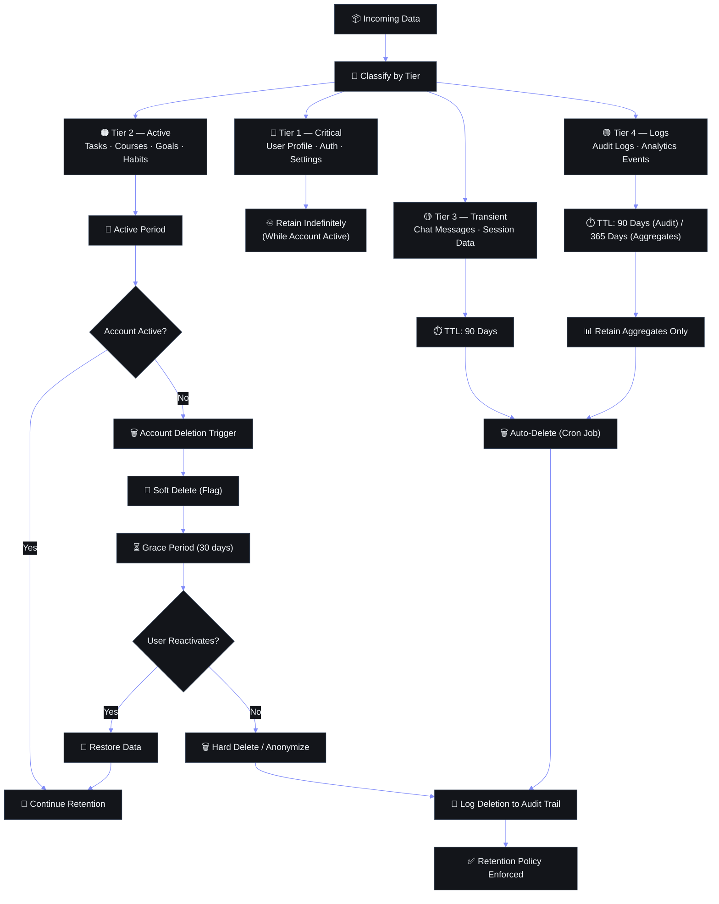

# Data Retention Policy — Second Brain OS

## Document Control

| Field | Value |
|---|---|
| **Document ID** | OPS-DATA-RET-001 |
| **Version** | 1.0 |
| **Status** | Draft |
| **Author** | ARIA OS Engineering |
| **Last Updated** | 2026-06-11 |
| **Approval** | Pending |
| **Classification** | Internal — Data Governance |

---



## 1. Executive Summary

Second Brain OS stores personal productivity data across 15+ database tables, plus AI interaction logs, audit trails, and session data. As the system transitions from single-user to multi-user, a formal data retention policy is required to comply with privacy regulations, minimize storage costs, and reduce security exposure.

**Purpose:** Define retention periods, deletion methods, and archival procedures for every data category in the system, with automated enforcement via Supabase cron jobs and the APScheduler service.

**Scope:** All data stores — Supabase PostgreSQL (primary), Supabase Storage (file uploads), Redis cache, application logs, AI agent logs.

**Drivers:**
- GDPR Article 5(1)(e) — storage limitation principle
- DPDP Act 2023 Section 9 — data retention limitation
- Storage cost optimization (Supabase Pro: 8 GB PostgreSQL, 100 GB bandwidth)
- Security principle of data minimization

---

## 2. Regulatory Requirements

### 2.1 GDPR Article 5(1)(e) — Storage Limitation

> "Personal data shall be kept in a form which permits identification of data subjects for no longer than is necessary for the purposes for which the personal data are processed."

**Implications for Second Brain OS:**
- User productivity data retained only while account is active
- Data deleted within 30 days of account deletion request
- AI interaction logs retained max 90 days for model improvement (opt-in) or deleted immediately (opt-out)
- Audit logs retained 90 days for security monitoring

### 2.2 DPDP Act 2023 Section 9 — Data Retention

> "Every data fiduciary shall — (a) retain data only for the duration specified in the consent; (b) delete data when the purpose is served or consent is withdrawn."

**Implications for Second Brain OS:**
- Consent-based retention periods must be documented and enforceable
- Users must be notified before data deletion
- Deletion must be verifiable (deletion logs)
- Processing records under Section 8 must be retained for 3 years

---

## 3. Data Categories & Retention Periods

### 3.1 User Data

| Data Category | Tables | Retention Period | Legal Basis | Deletion Method | Notes |
|---|---|---|---|---|---|
| **User profile** | `users` | Account lifetime + 90 days | Consent (contract) | Hard delete | 90-day grace after deletion request |
| **Authentication** | Supabase Auth | Account lifetime | Contract | Cascade with user | No local copy — Supabase managed |
| **Email preferences** | `user_preferences` | Account lifetime | Consent | Hard delete | |
| **Session tokens** | Supabase Auth sessions | 24h (access) / 30d (refresh) | Contract | Auto-expire | JWT with short TTL |

### 3.2 Productivity Data

| Data Category | Tables | Retention Period | Legal Basis | Deletion Method | Notes |
|---|---|---|---|---|---|
| **Tasks** | `tasks` | Account lifetime + 90 days | Consent (service delivery) | Hard delete | Archived tasks included |
| **Courses** | `courses` | Account lifetime + 90 days | Consent | Hard delete | Includes course materials |
| **Goals** | `goals` | Account lifetime + 90 days | Consent | Hard delete | |
| **Ideas** | `ideas` | Account lifetime + 90 days | Consent | Hard delete | |
| **Projects** | `projects` | Account lifetime + 90 days | Consent | Hard delete | |
| **Resources** | `resources` | Account lifetime + 90 days | Consent | Hard delete | Excludes bookmarked external URLs |
| **Opportunities** | `opportunities` | Account lifetime + 90 days | Consent | Hard delete | |
| **Income records** | `income` | **7 years** | Legal (tax) | Soft delete → archive | Tax compliance (India IT Act) |
| **Habits** | `habits` | Account lifetime + 90 days | Consent | Hard delete | |
| **Sleep logs** | `sleep_logs` | Account lifetime + 90 days | Consent | Hard delete | |
| **Time entries** | `time_entries` | Account lifetime + 90 days | Consent | Hard delete | |

### 3.3 AI & System Data

| Data Category | Location | Retention Period | Legal Basis | Deletion Method | Notes |
|---|---|---|---|---|---|
| **AI prompt history** | `ai_interaction_logs` | 90 days | Consent (opt-in) / Legitimate interest | Hard delete | Shorter if user opts out |
| **AI agent traces** | `agent_traces` (OpenTelemetry) | 30 days | Legitimate interest | TTL on span export | Jaeger / Tempo retention |
| **Audit logs** | `audit_logs` | 90 days | Legal obligation (GDPR Art 30) | Partition drop | Archived to cold storage first |
| **API request logs** | `structlog` JSON files | 14 days | Legitimate interest | File rotation | Production: 14d, Dev: 7d |
| **Application errors** | Sentry / error logs | 90 days | Legitimate interest | Sentry retention | |
| **Cache entries** | Redis | Session TTL (max 24h) | Contract | TTL eviction | Ephemeral by design |
| **File uploads** | Supabase Storage / `uploads/` | Account lifetime + 30 days | Consent | Delete from Storage | User notified before deletion |

### 3.4 Compliance & Legal

| Data Category | Location | Retention Period | Legal Basis | Deletion Method | Notes |
|---|---|---|---|---|---|
| **Deletion records** | `deletion_logs` | 3 years | DPDP Act Sec 8(5) | Immutable | Proof of deletion compliance |
| **Consent records** | `consent_logs` | Duration of processing + 3 years | GDPR Art 7(1) | Hard delete | |
| **Income records** | `income` (archive) | 7 years | Income Tax Act 1961 | Archived | Irrespective of account status |
| **Data export files** | Supabase Storage / `exports/` | 30 days | User request | Delete | After user downloads |

---

## 4. Automated Deletion Strategy

### 4.1 Supabase Cron Function (Monthly Cleanup)

A scheduled function runs monthly via `pg_cron` (Supabase add-on) to enforce retention policies:

```sql
-- Supabase pg_cron: Monthly data cleanup
SELECT cron.schedule(
    'monthly-data-retention-cleanup',
    '0 3 1 * *',  -- 3 AM on the 1st of every month
    $$ CALL enforce_data_retention(); $$
);
```

### 4.2 Stored Procedure

```sql
CREATE OR REPLACE PROCEDURE enforce_data_retention()
LANGUAGE plpgsql
AS $$
DECLARE
    cutoff_90_days TIMESTAMPTZ := now() - INTERVAL '90 days';
    cutoff_30_days TIMESTAMPTZ := now() - INTERVAL '30 days';
    cutoff_14_days TIMESTAMPTZ := now() - INTERVAL '14 days';
    deleted_count INTEGER;
BEGIN
    -- Log start
    INSERT INTO deletion_logs (job_name, status, started_at)
    VALUES ('monthly_data_retention', 'started', now());

    -- 1. Delete soft-deleted user data older than 90 days
    WITH deleted AS (
        DELETE FROM tasks WHERE deleted_at IS NOT NULL AND deleted_at < cutoff_90_days
        RETURNING id
    ) SELECT COUNT(*) INTO deleted_count FROM deleted;
    PERFORM log_deletion('tasks', deleted_count);

    -- Repeat for goals, projects, ideas, resources, opportunities, habits, sleep_logs, time_entries
    -- (pattern identical)

    -- 2. Delete AI interaction logs older than 90 days
    WITH deleted AS (
        DELETE FROM ai_interaction_logs WHERE created_at < cutoff_90_days
        RETURNING id
    ) SELECT COUNT(*) INTO deleted_count FROM deleted;
    PERFORM log_deletion('ai_interaction_logs', deleted_count);

    -- 3. Delete request logs older than 14 days
    -- (handled by log rotation; this is a safety net)
    PERFORM delete_old_request_logs(cutoff_14_days);

    -- 4. Archive income records older than account deletion + 7 years
    -- (handled separately in archive_income_records procedure)

    -- Log completion
    UPDATE deletion_logs
    SET status = 'completed', completed_at = now()
    WHERE job_name = 'monthly_data_retention' AND status = 'started';
END;
$$;
```

### 4.3 Scheduler Integration (APScheduler)

In addition to `pg_cron`, the APScheduler service (`services/scheduler/`) runs a complementary job for tasks that require application-level logic (e.g., notifying users before deletion, generating compliance reports):

```python
# services/scheduler/jobs/data_retention.py
from apscheduler.schedulers.asyncio import AsyncIOScheduler
from datetime import datetime, timedelta

scheduler = AsyncIOScheduler()

@scheduler.scheduled_job("cron", day=1, hour=3, minute=0)
async def monthly_retention_job():
    """Monthly data retention enforcement with notification."""
    logger.info("retention.job.started")

    # Step 1: Notify users of upcoming deletions
    upcoming_deletions = await get_users_with_pending_deletion(days_until_deletion=7)
    for user in upcoming_deletions:
        await send_deletion_notification(user.email, user.deletion_items)

    # Step 2: Execute deletion via RPC
    result = await supabase.rpc("enforce_data_retention").execute()

    # Step 3: Verify deletion counts match expectations
    log_result = await supabase.from_("deletion_logs") \
        .select("*") \
        .eq("job_name", "monthly_data_retention") \
        .order("started_at", desc=True) \
        .limit(1) \
        .single() \
        .execute()

    if log_result.data:
        logger.info("retention.job.completed", details=log_result.data)

    # Step 4: Generate compliance summary
    await generate_retention_compliance_report()
```

### 4.4 Deletion Confirmation

A `deletion_logs` table records every automated deletion for compliance verification:

```sql
CREATE TABLE deletion_logs (
    id            UUID PRIMARY KEY DEFAULT gen_random_uuid(),
    job_name      TEXT NOT NULL,
    status        TEXT NOT NULL CHECK (status IN ('started', 'completed', 'failed')),
    started_at    TIMESTAMPTZ NOT NULL DEFAULT now(),
    completed_at  TIMESTAMPTZ,
    items         JSONB DEFAULT '[]',        -- [{table: 'tasks', count: 42}, ...]
    error_details TEXT,
    metadata      JSONB DEFAULT '{}'
);

-- Audit-friendly view
CREATE VIEW deletion_summary AS
SELECT
    date_trunc('month', started_at) AS month,
    jsonb_array_elements(items)->>'table' AS table_name,
    SUM((jsonb_array_elements(items)->>'count')::INT) AS total_deleted
FROM deletion_logs
WHERE status = 'completed'
GROUP BY month, table_name
ORDER BY month DESC;
```

---

## 5. Archival Strategy

### 5.1 Cold Storage for Old Data

Data that must be retained beyond the standard retention period (e.g., income records for 7 years, audit logs for compliance) is archived to cold storage before deletion:

```python
# services/scheduler/jobs/data_archive.py
async def archive_income_records():
    """Archive income records older than account deletion + 90 days, retain for 7 years."""
    seven_years_ago = datetime.now() - timedelta(days=365 * 7)

    # Find records to archive
    records = await supabase.from_("income") \
        .select("*") \
        .lt("updated_at", seven_years_ago) \
        .execute()

    if not records.data:
        return

    # Export to JSON
    archive_blob = json.dumps([dict(r) for r in records.data], default=str, indent=2)

    # Store in Supabase Storage bucket (archive/, encrypted, lifecycle-managed)
    archive_path = f"archives/income/{datetime.now().strftime('%Y/%m')}/income_archive_{uuid.uuid4()}.json"
    await supabase.storage.from_("data-archives").upload(archive_path, archive_blob.encode(), {
        "content-type": "application/json",
        "x-goog-meta-retention": "7-years",
        "x-goog-meta-source": "income",
        "x-goog-meta-archived-at": datetime.now().isoformat()
    })

    # Delete from primary table
    record_ids = [r["id"] for r in records.data]
    await supabase.from_("income").delete().in_("id", record_ids).execute()

    logger.info("archive.income.completed", count=len(record_ids), archive_path=archive_path)

    # Log archival event
    await supabase.from_("deletion_logs").insert({
        "job_name": "income_archive",
        "status": "completed",
        "items": json.dumps([{"table": "income", "count": len(record_ids), "archive_path": archive_path}]),
        "metadata": {"retention_years": 7}
    }).execute()
```

### 5.2 Export Before Deletion Option

Users are offered the option to export their data before deletion (GDPR Art 20 — data portability):

```python
# apps/api/app/api/data_export.py
@router.post("/api/user/data/export-before-deletion")
async def export_before_deletion(current_user = Depends(require_auth)):
    """Queue a data export for a user who requested deletion."""
    export_job = await queue_export_job(current_user.id, tables=ALL_USER_TABLES)
    return {"message": "Export queued. You will receive a download link via email.", "job_id": export_job.id}
```

Once the export is ready (ZIP of JSON exports), the user receives an email with a signed download link valid for 7 days. The export files are stored in a temporary Supabase Storage bucket with auto-delete lifecycle of 30 days.

---

## 6. User Deletion Rights

### 6.1 Right to Erasure Procedure

GDPR Article 17 / DPDP Act Section 12 — Right to Erasure:

```python
# apps/api/app/api/data_deletion.py
@router.post("/api/user/data/request-deletion")
async def request_account_deletion(
    confirm: bool = Body(...),
    export_before: bool = Body(False),
    reason: Optional[str] = Body(None),
    current_user = Depends(require_auth),
):
    """Initiate account deletion with 90-day grace period."""
    if not confirm:
        raise HTTPException(400, "Confirmation required")

    # Step 1: Optionally queue export
    if export_before:
        await queue_export_job(current_user.id, tables=ALL_USER_TABLES)

    # Step 2: Set deletion_at flag (90-day grace)
    await supabase.from_("users") \
        .update({
            "deletion_requested_at": datetime.utcnow().isoformat(),
            "deletion_scheduled_at": (datetime.utcnow() + timedelta(days=90)).isoformat(),
            "deletion_reason": reason,
            "is_active": False
        }) \
        .eq("id", current_user.id) \
        .execute()

    # Step 3: Notify user
    await send_deletion_confirmation_email(current_user.email, grace_days=90)

    # Step 4: Invalidate all sessions
    await supabase.auth.admin.sign_out(current_user.id)

    # Step 5: Log deletion request
    await audit_writer.record(AuditEvent(
        user_id=current_user.id,
        action="data.deletion_requested",
        category="data",
        resource_type="users",
        resource_id=current_user.id,
        metadata={"export_before": export_before, "grace_days": 90},
        severity="warning"
    ))

    return {
        "message": "Deletion scheduled. You have 90 days to cancel. A confirmation email has been sent.",
        "deletion_scheduled_at": (datetime.utcnow() + timedelta(days=90)).isoformat()
    }
```

### 6.2 Account Deletion Automation

The final deletion is handled by the monthly cron job (Section 4) which identifies accounts past their 90-day grace period:

```sql
-- Inside enforce_data_retention procedure
-- Delete users past grace period
DELETE FROM users
WHERE deletion_scheduled_at IS NOT NULL
  AND deletion_scheduled_at < now();
-- Cascade deletes user data from all related tables (via FK ON DELETE CASCADE or explicit deletes)
```

Users can cancel a deletion request within the grace period via:
```typescript
// apps/web/app/settings/account/page.tsx
async function cancelDeletion() {
  await fetch("/api/user/data/cancel-deletion", { method: "POST" });
}
```

---

## 7. Retention Override

### 7.1 Legal Hold for Tax Records

Income records require 7-year retention under the Indian Income Tax Act 1961:

| Condition | Override Duration | Action |
|---|---|---|
| Account deleted, income records exist | 7 years from last transaction | Archive to cold storage (Section 5.1) |
| Legal hold placed by admin | Indefinite (until released) | Flag `income.legal_hold = true`, exclude from deletion |
| Subpoena / court order | As specified in order | Admin applies legal hold via admin panel |

### 7.2 User Archive Request

Users may request their raw data be archived for longer than the standard retention:

```python
# apps/api/app/api/data_archive.py
@router.post("/api/user/data/archive-request")
async def request_data_archive(
    duration_months: int = Body(..., ge=1, le=120),
    reason: str = Body(...),
    current_user = Depends(require_auth),
):
    """Request extended data retention beyond standard policy."""
    # Requires explicit consent
    # Logged as retention override
    # Stored in user_preferences.retention_override
```

### 7.3 Override Priority

```
Legal hold (court order) > User archive request > Tax retention (7 years) > Standard retention
```

Overrides are tracked in `retention_overrides` table:

```sql
CREATE TABLE retention_overrides (
    id              UUID PRIMARY KEY DEFAULT gen_random_uuid(),
    user_id         UUID REFERENCES users(id) ON DELETE CASCADE,
    resource_type   TEXT NOT NULL,
    override_type   TEXT NOT NULL CHECK (override_type IN ('legal_hold', 'user_archive', 'tax_retention')),
    expires_at      TIMESTAMPTZ,
    reason          TEXT,
    approved_by     UUID REFERENCES users(id),
    created_at      TIMESTAMPTZ DEFAULT now()
);
```

---

## 8. Implementation

### 8.1 Deletion SQL Scripts

```sql
-- scripts/retention/cleanup_tasks.sql
-- Safely delete soft-deleted tasks older than 90 days
BEGIN;

-- 1. Check count before deletion
SELECT COUNT(*) AS tasks_to_delete
FROM tasks
WHERE deleted_at IS NOT NULL
  AND deleted_at < now() - INTERVAL '90 days';

-- 2. Insert into deletion_logs
INSERT INTO deletion_logs (job_name, status, items)
VALUES ('monthly_data_retention', 'started',
    jsonb_build_array(jsonb_build_object('table', 'tasks', 'count', (
        SELECT COUNT(*) FROM tasks WHERE deleted_at IS NOT NULL AND deleted_at < now() - INTERVAL '90 days'
    )))
);

-- 3. Execute deletion
DELETE FROM tasks
WHERE deleted_at IS NOT NULL
  AND deleted_at < now() - INTERVAL '90 days';

-- 4. Update deletion_logs
UPDATE deletion_logs
SET status = 'completed', completed_at = now()
WHERE job_name = 'monthly_data_retention' AND status = 'started';

COMMIT;
```

### 8.2 Scheduler Integration

The APScheduler service (`services/scheduler/main.py`) loads all retention jobs on startup:

```python
# services/scheduler/main.py
from jobs.data_retention import monthly_retention_job
from jobs.data_archive import archive_income_records
from jobs.audit_partitions import manage_audit_partitions

def register_retention_jobs(scheduler):
    scheduler.add_job(monthly_retention_job, "cron", day=1, hour=3, minute=0)
    scheduler.add_job(archive_income_records, "cron", day=1, hour=4, minute=0)
    scheduler.add_job(manage_audit_partitions, "cron", day=1, hour=2, minute=0)

if __name__ == "__main__":
    scheduler = AsyncIOScheduler()
    register_retention_jobs(scheduler)
    scheduler.start()
    asyncio.get_event_loop().run_forever()
```

### 8.3 Safety Checks Before Delete

Every deletion operation includes a dry-run capability and confirmation threshold:

```python
# services/scheduler/jobs/safety.py
async def safe_delete(
    table: str,
    condition: str,
    params: dict,
    max_allowed: int = 10_000,
    dry_run: bool = True,
) -> dict:
    """Execute deletion with safety checks."""
    # Step 1: Count matching rows
    count_query = f"SELECT COUNT(*) FROM {table} WHERE {condition}"
    result = await execute_sql(count_query, params)
    count = result[0]["count"]

    if count == 0:
        return {"status": "skipped", "reason": "no_rows_to_delete", "count": 0}

    # Step 2: Threshold check
    if count > max_allowed:
        raise RetentionSafetyError(
            f"Deletion of {count} rows from {table} exceeds threshold of {max_allowed}. Manual review required."
        )

    if dry_run:
        return {"status": "dry_run", "would_delete": count, "table": table}

    # Step 3: Execute with transactional safety
    delete_query = f"DELETE FROM {table} WHERE {condition}"
    await execute_sql(delete_query, params)

    return {"status": "deleted", "count": count, "table": table}
```

---

## 9. Audit & Compliance

### 9.1 Deletion Logs

Every deletion is logged in `deletion_logs` and also recorded as an audit event (see `AuditLogs.md`):

| Field | Description |
|---|---|
| `job_name` | Name of the retention job |
| `status` | `started`, `completed`, `failed` |
| `started_at` / `completed_at` | Execution timeline |
| `items` | Array of `{table, count}` for records deleted |
| `error_details` | Error message if failed |
| `metadata` | Additional context (dry_run, threshold, etc.) |

### 9.2 Retention Compliance Report

Generated monthly by the scheduler after cleanup:

```sql
-- monthly_retention_compliance_report
SELECT
    d.job_name,
    d.started_at,
    d.completed_at,
    d.status,
    CASE
        WHEN d.status = 'completed'
            AND d.completed_at IS NOT NULL
            AND d.completed_at - d.started_at < INTERVAL '1 hour'
        THEN 'PASS'
        ELSE 'FAIL'
    END AS compliance_status,
    d.items
FROM deletion_logs d
WHERE d.started_at >= date_trunc('month', now())
ORDER BY d.started_at DESC;
```

The report is emailed to the system administrator and stored in Supabase Storage for audit purposes.

---

## 10. Appendices

### 10.1 SQL Scripts

| File | Purpose |
|---|---|
| `scripts/retention/cleanup_tasks.sql` | Delete soft-deleted tasks > 90 days |
| `scripts/retention/cleanup_ai_logs.sql` | Delete AI interaction logs > 90 days |
| `scripts/retention/archive_income.sql` | Archive income records > 7 years |
| `scripts/retention/user_deletion.sql` | Process accounts past grace period |
| `scripts/retention/compliance_report.sql` | Generate monthly compliance report |

### 10.2 Retention Schedule Calendar

| Date | Job | Action |
|---|---|---|
| 1st of each month, 02:00 UTC | `manage_audit_partitions` | Create next partition, drop old |
| 1st of each month, 03:00 UTC | `monthly_retention_job` | Enforce all retention policies |
| 1st of each month, 04:00 UTC | `archive_income_records` | Archive 7+ year old income records |
| 1st of each month, 05:00 UTC | `generate_compliance_report` | Email compliance summary to admin |
| Daily, 06:00 UTC | `check_pending_deletions` | Notify users within 7 days of deletion |
| Every Sunday, 02:00 UTC | `verification_job` | Verify deletion_logs integrity |

### 10.3 Revision History

| Version | Date | Author | Changes |
|---|---|---|---|
| 1.0 | 2026-06-11 | ARIA OS Engineering | Initial draft — complete retention policy with legal mapping, SQL implementation, compliance reporting |
