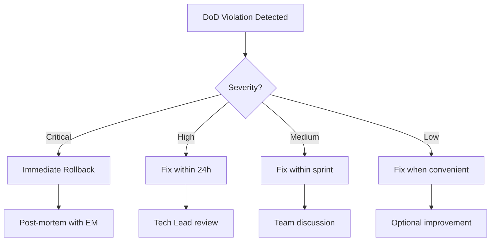

# Definition of Done

> **Document ID:** SB-OPS-DOD-004  
> **Version:** 2.0.0  
> **Status:** Active  
> **Last Updated:** 2026-06-11  
> **Classification:** Internal — Development Process  
> **Owner:** Lead Developer  

---

## Table of Contents

1. [Purpose & Scope](#1-purpose--scope)
2. [Feature DoD Checklist](#2-feature-dod-checklist)
3. [Bug Fix DoD](#3-bug-fix-dod)
4. [Documentation DoD](#4-documentation-dod)
5. [Refactoring DoD](#5-refactoring-dod)
6. [Prompt Engineering DoD](#6-prompt-engineering-dod)
7. [Hotfix DoD](#7-hotfix-dod)
8. [Spike / Research DoD](#8-spike--research-dod)
9. [DoD Exemptions Process](#9-dod-exemptions-process)
10. [DoD Enforcement in CI](#10-dod-enforcement-in-ci)
11. [DoD Evolution](#11-dod-evolution)
12. [DoD Violation and Rollback Process](#12-dod-violation-and-rollback-process)
13. [Appendices](#13-appendices)

---

## 1. Purpose & Scope

### 1.1 What is Definition of Done?

The **Definition of Done (DoD)** is a shared understanding among the team of what it means for work to be complete. It ensures that every deliverable meets a consistent quality bar before it is considered "done" and ready for production.

**DoD applies to ALL work items:** features, bug fixes, documentation, refactoring, prompt engineering, hotfixes, and spikes.

### 1.2 Why DoD Matters

| Reason | Impact |
|---|---|
| Quality consistency | Every release meets the same bar |
| Predictability | "Done" means the same thing to everyone |
| Reduced technical debt | No half-finished work in production |
| Clear handoffs | QA knows what to test, PM knows what's shipped |
| CI/CD integration | Automated gates prevent incomplete work |
| Stakeholder confidence | Demos show finished, tested features |

### 1.3 DoD Levels

| Level | Applies To | Gate |
|---|---|---|
| **Level 1: Task DoD** | Individual tasks within a sprint | PR merge |
| **Level 2: Feature DoD** | Complete user-facing feature | Sprint Review |
| **Level 3: Release DoD** | Entire release | Production deploy |
| **Level 4: Epic DoD** | Multi-sprint initiative | Milestone completion |

This document focuses on **Level 1 (Task DoD)** and **Level 2 (Feature DoD)**, which are enforced per-PR.

---

## 2. Feature DoD Checklist

### 2.1 Complete Checklist

Every feature PR MUST pass ALL the following checks before it can be merged and considered done.

```markdown
## Feature Definition of Done

### Acceptance Criteria
- [ ] All acceptance criteria from the user story are met
- [ ] Edge cases documented in the story are handled
- [ ] Non-functional requirements (performance, security, accessibility) are met
- [ ] Feature works in all supported browsers (Chrome, Firefox, Edge, Safari)

### Testing
- [ ] Unit tests written and passing (>80% coverage on new code)
- [ ] Integration tests written and passing
- [ ] E2E tests written and passing (or existing suite passes)
- [ ] At least one negative test case (error/edge case)
- [ ] No flaky tests introduced
- [ ] Manual testing performed for happy path and error states

### Code Quality
- [ ] Linting passes (ESLint for TS, Ruff for Python)
- [ ] Formatting is clean (Prettier for TS, Black for Python)
- [ ] Type-checking passes (tsc for TS, pyright/pytype for Python)
- [ ] No dead code, commented-out code, or debug logging
- [ ] No hardcoded secrets, tokens, or URLs
- [ ] Error handling is implemented (try/catch for critical operations)
- [ ] Proper HTTP status codes used (200, 201, 400, 404, 500)

### Prompt System (if applicable)
- [ ] Prompt YAML frontmatter is valid
- [ ] scripts/validate_prompts.py passes
- [ ] Fallback prompt is tested (if LLM unavailable)
- [ ] Prompt content tests pass (tests/test_agent_prompts.py)

### Documentation
- [ ] Code is self-documenting (clear variable/function names)
- [ ] JSDoc/Pydoc comments added for public APIs
- [ ] API docs updated (if endpoint changed)
- [ ] README updated (if user-facing behavior changed)
- [ ] CHANGELOG.md entry added

### Review
- [ ] PR reviewed and approved (minimum 1 approval)
- [ ] All reviewer comments addressed (or resolved with reason)
- [ ] No unresolved conversations in the PR

### CI/CD
- [ ] All CI checks pass (8 checks: lint, type-check, build, ruff, py-compile, validate-prompts, pytest, security)
- [ ] Build succeeds locally
- [ ] No known regressions introduced

### Security
- [ ] No new security vulnerabilities introduced
- [ ] Input validation implemented (both frontend and backend)
- [ ] SQL injection prevented (parameterized queries via Supabase SDK)
- [ ] XSS prevented (React auto-escaping, no dangerouslySetInnerHTML)
- [ ] RLS policies respected (all queries filtered by user_id)
- [ ] No secrets committed

### Performance (if applicable)
- [ ] No N+1 query patterns introduced
- [ ] API response time < 500ms p95
- [ ] Bundle size impact assessed (for frontend changes)
- [ ] Lazy loading considered for new UI components

### Accessibility (if UI change)
- [ ] Semantic HTML used (proper headings, landmarks)
- [ ] Keyboard navigation works
- [ ] Screen reader tested (aria labels, alt text)
- [ ] Color contrast meets WCAG 2.1 AA (4.5:1 for text)
- [ ] Focus indicators visible
```

### 2.2 Mandatory vs Optional Checks

| Category | Mandatory | Optional (Recommended) |
|---|---|---|
| Acceptance Criteria | All | — |
| Testing | Unit + Integration + Manual | E2E |
| Code Quality | Lint + Format + Types | Performance profiling |
| Documentation | JSDoc/Pydoc + API docs | README |
| Review | 1 approval | 2 approvals |
| CI/CD | All checks | Build optimization |
| Security | Input validation + RLS | Penetration testing |
| Performance | N+1 check | Load testing |
| Accessibility | Semantic HTML + Keyboard | Screen reader testing |

### 2.3 Per-Module DoD Extensions

| Module | Additional DoD Requirements |
|---|---|
| **AI Agents** | Prompt frontmatter validated, fallback tested, agent response schema validated |
| **Frontend (Next.js)** | Lighthouse score > 80, no bundle size regression > 10KB |
| **Backend API** | OpenAPI schema updated, rate limiting considered |
| **Database** | Migration tested up/down, RLS policies verified, index added for new queries |
| **Scheduler** | Cron schedule tested, error handling for failed jobs, retry logic implemented |
| **Prompts** | All frontmatter fields present, 3+ few-shot examples, anti-patterns documented |

---

## 3. Bug Fix DoD

### 3.1 Bug Fix Checklist

```markdown
## Bug Fix Definition of Done

### Root Cause
- [ ] Root cause identified and documented in the PR description
- [ ] 5 Whys analysis performed (for severity-critical bugs)

### Reproduction
- [ ] Reproducible test case added (unit test that fails without the fix)
- [ ] Steps to reproduce documented in the issue

### Fix
- [ ] Fix addresses root cause, not just symptoms
- [ ] Fix is minimal (touch only the affected code)
- [ ] No new functionality added (scope containment)

### Testing
- [ ] Regression tests added to prevent recurrence
- [ ] All existing tests still pass
- [ ] Manual verification of the fix on staging

### Severity-Specific Requirements

| Severity | Additional Requirements |
|---|---|
| Critical (P0) | Hotfix deployed, incident report created, post-mortem scheduled |
| High (P1) | Automated regression test added, team notified |
| Medium (P2) | Automated regression test added |
| Low (P3) | Bug fix logged, can be done during normal sprint |

### Deployment
- [ ] If critical: hotfix deployed immediately
- [ ] If high: included in next deployment
- [ ] Deployment verified (smoke test in production)
```

### 3.2 Bug Fix Size Limits

| Metric | Maximum | Exception |
|---|---|---|
| Lines changed | 50 lines | Architecture-level bug |
| Files changed | 5 files | Cross-module dependency |
| Risk level | Low | Must be justified in PR |

### 3.3 Regression Test Requirements

| Bug Type | Regression Test Level | Example |
|---|---|---|
| Logic error | Unit test | Wrong calculation in habit streak |
| API error | Integration test | Incorrect status code |
| UI bug | Component test | Button not disabled when form empty |
| Data loss | E2E test + unit test | Task deletion cascade issue |
| Auth/Security | Unit + Integration | JWT token validation bypass |
| Performance | Performance test | Slow query due to missing index |

---

## 4. Documentation DoD

### 4.1 Documentation Checklist

```markdown
## Documentation Definition of Done

### Accuracy
- [ ] All facts are verified against current implementation
- [ ] Code examples compile/run correctly
- [ ] Screenshots reflect current UI (if applicable)
- [ ] API examples match actual request/response format

### Completeness
- [ ] All required sections are present (varies by document type)
- [ ] No placeholder or TODO sections remain
- [ ] All referenced links resolve correctly
- [ ] Edge cases and error states documented

### Clarity
- [ ] Reviewed by a non-author for comprehension
- [ ] Technical terms defined or linked to glossary
- [ ] Writing level appropriate for target audience
- [ ] Consistent terminology throughout

### Stylistic
- [ ] Follows project markdown conventions
- [ ] Tables properly formatted with alignment
- [ ] Code blocks have language tags
- [ ] Proper heading hierarchy (H1 → H2 → H3)

### Review
- [ ] Technical accuracy reviewed by subject matter expert
- [ ] Grammar and spelling checked
- [ ] Approved by documentation steward or Tech Lead
```

### 4.2 Documentation Types and DoD

| Document Type | Required Sections | Min Word Count | Reviewers |
|---|---|---|---|
| API Reference | Description, endpoint, params, response, errors, example | 500 | Tech Lead |
| Architecture Decision Record (ADR) | Context, decision, consequences, alternatives | 300 | Engineering Manager |
| User Guide | Purpose, prerequisites, steps, troubleshooting | 1000 | PM + User |
| README | Description, install, usage, contributing | 200 | Tech Lead |
| RUNBOOK | Prerequisites, steps, expected output, recovery | 500 | Operations |

### 4.3 Documentation Maintenance

| Condition | Action | Owner |
|---|---|---|
| Code changes affect documented behavior | Update docs in same PR | Developer |
| Feature is deprecated | Add deprecation notice, schedule removal | Product Owner |
| Documentation error reported | Fix within 1 sprint | Developer |
| Docs not updated for 6 months | Review and update or archive | Tech Lead |

---

## 5. Refactoring DoD

### 5.1 Refactoring Checklist

```markdown
## Refactoring Definition of Done

### Behavior Preservation
- [ ] No user-facing behavior has changed
- [ ] API contracts remain unchanged (or migration path documented)
- [ ] Output format is identical for same inputs
- [ ] Error handling behavior is identical

### Testing
- [ ] Same test coverage maintained (no test deletions without replacement)
- [ ] Existing tests pass without modification (unless refactoring tests)
- [ ] If tests were updated, verify they test the same behavior
- [ ] Edge case coverage is at least as good as before

### Performance
- [ ] Performance is not degraded (benchmarked if critical path)
- [ ] No new performance bottlenecks introduced
- [ ] If performance improvement claimed, provide benchmark data

### Migration
- [ ] Migration path documented (if public API changed)
- [ ] Deprecation warnings added (for removed functionality)
- [ ] Feature flag used (if migration needs to be gradual)

### Cleanup
- [ ] Old code removed (no dead code left behind)
- [ ] Imports cleaned up
- [ ] No commented-out old code
- [ ] No TODO/FIXME introduced (or tracked as separate issue)
```

### 5.2 Refactoring Risk Levels

| Risk Level | Scope | Review Required | Testing Required |
|---|---|---|---|
| Low (safe) | Renaming, formatting, import cleanup | 1 reviewer | Existing suite |
| Medium | Extracting functions, moving files | 1 reviewer + CI | Existing suite + smoke test |
| High | Architecture change, module restructuring | 2 reviewers + Tech Lead | Full regression suite |
| Critical | Database schema, API contract | 2 reviewers + EM | Full suite + staging + canary |

### 5.3 Refactoring Metrics

| Metric | Target | Measurement |
|---|---|---|
| Test coverage | Same or higher | `pytest --cov` |
| Cyclomatic complexity | Same or lower | `radon cc` or `complexity-report` |
| Lines of code | Same or lower | `cloc` |
| Coupling | Same or lower | Dependency analysis |
| Performance | Within 5% of baseline | `pytest-benchmark` or custom benchmarks |

### 5.4 Refactoring Documentation Requirements

```markdown
## Refactoring Documentation

For medium/high risk refactoring, include in the PR description:

### Current State
[Description of the current architecture/problem]

### Target State
[Description of the desired architecture]

### Migration Plan
1. Step 1: [e.g., Extract function]
2. Step 2: [e.g., Move module]
3. Step 3: [e.g., Remove old code]

### Rollback Plan
[How to revert if issues are found]

### Verification Strategy
[How we'll verify the refactoring was successful]
```

---

## 6. Prompt Engineering DoD

### 6.1 Prompt Engineering Checklist

```markdown
## Prompt Engineering Definition of Done

### Frontmatter Validation
- [ ] Version field present and bumped (semver)
- [ ] Status field is one of: active, draft, deprecated
- [ ] Model field specifies target LLM (ollama/mistral:7b, claude/sonnet-4)
- [ ] max_tokens is a positive integer
- [ ] temperature is a float between 0.0 and 1.0
- [ ] description field present (required for system prompts)
- [ ] Tags present and relevant
- [ ] last_updated is valid ISO date
- [ ] scripts/validate_prompts.py passes with no errors

### Content Structure
- [ ] Role definition is clear and unambiguous
- [ ] Input schema is defined (YAML or JSON)
- [ ] Output JSON schema is defined with all fields
- [ ] Step-by-step instructions are present
- [ ] Few-shot examples are present (minimum 3)
- [ ] Edge cases are documented
- [ ] Anti-patterns are documented
- [ ] Quality criteria / self-verification checklist included
- [ ] Error recovery section included

### File Location
- [ ] File is in correct directory (system/, agents/, or templates/)
- [ ] File name matches agent module name (snake_case)
- [ ] File extension is .md
- [ ] UTF-8 encoding (no BOM)

### Agent Module Integration
- [ ] Agent module imports from PromptLoader: from ai.prompt_loader import prompts
- [ ] Agent module uses prompts.get_agent("name") for the prompt
- [ ] Fallback prompt exists in the agent module (inline string)
- [ ] Fallback prompt is tested (manually remove prompt file, verify agent still works)
- [ ] Agent response parsing matches output schema

### Testing
- [ ] content tests pass (tests/test_agent_prompts.py)
- [ ] Frontmatter tests pass (tests/test_prompt_loader.py)
- [ ] Agent module tests pass (pytest tests/test_agent_prompts.py)
- [ ] Prompt renders correctly with sample context data
- [ ] Token budget respected (max_tokens not exceeded by typical usage)
```

### 6.2 Prompt Version Bumping

| Change Type | Version Bump | Example |
|---|---|---|
| Typos, formatting, minor rewording | Patch | 1.0.0 → 1.0.1 |
| New examples, additional edge cases | Minor | 1.0.0 → 1.1.0 |
| Changed output schema, major restructuring | Major | 1.0.0 → 2.0.0 |
| Changed model or temperature | Minor | 1.0.0 → 1.1.0 |
| Changed role or instructions fundamentally | Major | 1.0.0 → 2.0.0 |

### 6.3 Prompt Quality Metrics

| Metric | Target | Measurement |
|---|---|---|
| Frontmatter fields | All required present | validate_prompts.py |
| Body length (agent prompts) | > 1000 chars | WC count |
| Body length (all prompts) | > 200 chars | WC count |
| Few-shot examples | >= 3 | Manual count |
| Output schema fields | All documented | Manual review |
| Edge cases documented | >= 3 | Manual review |
| Fallback prompt exists | Yes | Code review |

### 6.4 Prompt Deprecation

```markdown
## Prompt Deprecation Process

1. Set status: deprecated in frontmatter
2. Update all agent modules to use new prompt or fallback
3. Mark agent tests to expect deprecation
4. Keep deprecated prompt for minimum 2 sprints
5. After 2 sprints, remove the prompt file
6. Update tests to remove deprecation expectations
```

---

## 7. Hotfix DoD

### 7.1 Hotfix Checklist

```markdown
## Hotfix Definition of Done

### Criticality
- [ ] Issue severity is confirmed as P0 (Critical)
- [ ] Impact is assessed and documented
- [ ] All stakeholders notified

### Fix
- [ ] Fix is minimal (max 50 lines changed)
- [ ] Fix addresses only the specific issue (no scope creep)
- [ ] Root cause is identified and documented
- [ ] Rollback plan is defined and documented

### Review
- [ ] At least 1 reviewer has approved
- [ ] 2nd reviewer confirmed if time permits
- [ ] Reviewer understands the fix (not just rubber-stamping)

### Testing
- [ ] Fix is tested on staging/production-like environment
- [ ] Existing tests pass with the fix
- [ ] No new tests required (fix is minimal/obvious)

### Deployment
- [ ] Deployed to production
- [ ] Deployment verified (smoke test)
- [ ] Monitoring confirms no regression

### Follow-up
- [ ] Permanent fix issue created in backlog
- [ ] Incident report drafted
- [ ] Post-mortem scheduled (within 48 hours)
```

### 7.2 Hotfix DoD Exceptions

Hotfixes receive limited DoD exemptions (see [Section 9](#9-dod-exemptions-process)) but must maintain:

- ✅ Code review (at least 1 approval)
- ✅ CI passes
- ✅ Rollback plan
- ✅ Post-mortem scheduled

---

## 8. Spike / Research DoD

### 8.1 Spike Checklist

```markdown
## Spike / Research Definition of Done

### Research
- [ ] Research question is clearly defined
- [ ] Multiple approaches were investigated (minimum 2)
- [ ] Evidence collected (code samples, benchmarks, documentation)
- [ ] Recommendations made with rationale

### Deliverable
- [ ] Findings documented in a GH Issue comment or doc
- [ ] Recommended approach identified
- [ ] Effort estimate for recommended approach provided
- [ ] Risks and unknowns documented

### Code (if any)
- [ ] Experimental code is in an unreferenced branch or directory
- [ ] No dead code added to main codebase
- [ ] No dependencies introduced without justification

### Decision
- [ ] Go/No-go decision made by Tech Lead
- [ ] Decision documented in the spike issue
```

---

## 9. DoD Exemptions Process

### 9.1 When Exemptions Are Allowed

DoD exemptions are possible but rare. They require explicit approval and documentation.

| Exemption Type | Description | Max Duration | Approval Needed |
|---|---|---|---|
| Test exemption | Tests deferred due to time pressure | 1 sprint | Tech Lead |
| Documentation exemption | Docs deferred | 1 sprint | Tech Lead + PM |
| Performance exemption | Performance optimization deferred | 2 sprints | Engineering Manager |
| Accessibility exemption | Accessibility deferred | 2 sprints | EM + Design Lead |

### 9.2 Exemption Request Template

```markdown
## DoD Exemption Request

**Issue:** #[issue-number]
**Requester:** [Name]
**Date:** [Date]

### DoD Item Requesting Exemption From
[Which specific DoD item(s) to exempt]

### Justification
[Why this exemption is necessary]

### Risk Assessment
[What risks are introduced by the exemption]

### Mitigation Plan
[How will the exempted work be completed later]

### Completion Commitment
- Exempted work will be completed by: [Sprint]
- Tracking issue: #[new-issue-number]

### Approvals
- [ ] Tech Lead: [Name, Date]
- [ ] Product Owner: [Name, Date] (if user-facing)
- [ ] Engineering Manager: [Name, Date] (if > 1 sprint)
```

### 9.3 Exemption Tracking

All exemptions are tracked in a central registry:

```markdown
## DoD Exemptions Registry

| ID | Sprint | Issue | Exempted Item | Reason | Approved By | Due Sprint | Status |
|---|---|---|---|---|---|---|---|
| EX-001 | S7 | #312 | E2E tests | Time pressure, legacy feature | Alice | S8 | ✅ Closed |
| EX-002 | S8 | #345 | Performance benchmark | API not in critical path | Bob | S9 | ⏳ Open |
| EX-003 | S8 | #350 | Accessibility audit | Design not finalized | Carol | S9 | ⏳ Open |
| EX-004 | S9 | #378 | Documentation | UI still changing | Frank | S10 | ⏳ Open |

### Exemption Aging Rules

| Age | Action |
|---|---|
| 1 sprint overdue | Auto-notify requester |
| 2 sprints overdue | Escalate to Tech Lead |
| 3 sprints overdue | Escalate to Engineering Manager |
| 4 sprints overdue | Block new features from requester until resolved |
```

---

## 10. DoD Enforcement in CI

### 10.1 CI-Policed DoD Items

```yaml
# .github/workflows/ci.yml — DoD enforcement

# Job 1: Frontend Quality Gate
- name: DoD — Frontend Quality
  run: |
    echo "Enforcing DoD: Frontend"
    cd apps/web
    npm run lint          # Enforces code style
    npm run type-check    # Enforces type safety
    npm run build         # Enforces buildability

# Job 2: Backend Quality Gate
- name: DoD — Backend Quality
  run: |
    echo "Enforcing DoD: Backend"
    ruff check .          # Enforces Python style (Ruff as linter)
    python -m py_compile main.py  # Enforces syntax validity

# Job 3: Prompt Quality Gate
- name: DoD — Prompt Quality
  run: |
    echo "Enforcing DoD: Prompt Engineering"
    python scripts/validate_prompts.py  # Validates all frontmatter
    python -m pytest tests/test_prompt_loader.py -x  # Loader tests
    python -m pytest tests/test_agent_prompts.py -x  # Content tests

# Job 4: Security Gate
- name: DoD — Security
  run: |
    echo "Enforcing DoD: Security"
    npm audit --audit-level=high   # Block on high vulnerabilities

# Job 5: Test Gate
- name: DoD — Tests
  run: |
    echo "Enforcing DoD: Testing"
    python -m pytest tests/ -x --tb=short  # All tests must pass
```

### 10.2 DoD Gates in CI Pipeline

```
┌─────────────┐     ┌──────────────┐     ┌──────────────┐     ┌──────────────┐     ┌────────────┐
│ PR Submitted │ ──→ │ Lint & Types │ ──→ │ Test Suite   │ ──→ │ Prompts Check│ ──→ │ Security   │
│              │     │              │     │              │     │              │     │            │
│ DoD Gate 1   │     │ Frontend    │     │ pytest pass  │     │ validate_all │     │ npm audit  │
│              │     │ + Backend   │     │ + coverage   │     │ + tests pass │     │ high only  │
└─────────────┘     └──────────────┘     └──────────────┘     └──────────────┘     └────────────┘
                                                                                          │
                                                                                    ┌─────▼─────┐
                                                                                    │ ALL DOORS  │
                                                                                    │    MET     │
                                                                                    │   MERGE   │
                                                                                    │  ALLOWED  │
                                                                                    └───────────┘
```

### 10.3 Human-Policed DoD Items (Not Automatable)

The following DoD items require manual verification by the reviewer:

| Item | How to Verify |
|---|---|
| Acceptance criteria met | Read PR description, compare to issue |
| Error handling present | Inspect try/catch blocks, review edge cases |
| No dead code | Scan diff for unused variables, comments |
| Documentation updated | Check linked docs in PR |
| RLS policies respected | Verify all queries filter by user_id |
| No hardcoded secrets | Inspect diff for API keys, passwords |
| No performance regressions | Reviewer judgment on query patterns |

### 10.4 CI Failure Triage

| Failure | DoD Violation | Action | Block Merge? |
|---|---|---|---|
| ESLint error | Code quality | Fix lint error | ✅ Yes |
| TypeScript error | Type safety | Fix type | ✅ Yes |
| Build failure | Build quality | Fix build | ✅ Yes |
| Test failure | Testing | Fix test or code | ✅ Yes |
| validate_prompts.py fails | Prompt quality | Fix frontmatter | ✅ Yes |
| npm audit (high) | Security | Fix vulnerability | ✅ Yes |
| npm audit (moderate) | Security | Fix or document | ❌ No (warning) |
| Coverage below threshold | Testing | Add tests | ✅ Yes |

---

## 11. DoD Evolution

### 11.1 Quarterly Review Process

The DoD is reviewed every quarter (every 6 sprints) and updated as the project matures.

```markdown
## DoD Quarterly Review

**Date:** [Q1 2026, Q2 2026, ...]
**Facilitator:** Tech Lead
**Participants:** Full engineering team

### Review Agenda

1. **New DoD Items** — Propose additions based on recent incidents
2. **Existing DoD Items** — Are any items obsolete or too burdensome?
3. **DoD Violations** — Review violations from last quarter
4. **Exemptions** — Review open exemptions, close stale ones
5. **Automation** — Can any human-policed items be automated?

### DoD Change Process

1. Team member proposes change (GH Issue + PR to this doc)
2. Discussed at quarterly review
3. Team votes (simple majority)
4. If approved, update document and CI
5. Announce to all team members
6. Review effectiveness next quarter
```

### 11.2 DoD Maturity Model

| Level | Phase | Characteristics | When |
|---|---|---|---|
| **1. Initial** | Startup | No formal DoD, team ad hoc | Pre-v1.0 |
| **2. Defined** | Growth | DoD documented, partially enforced | v1.0-v1.5 |
| **3. Managed** | Scale | DoD fully automated in CI, exemptions tracked | v1.5-v2.0 |
| **4. Optimizing** | Mature | DoD metrics tracked, continuous improvement | v2.0+ |

**Current Status:** Level 2 (Defined) — transitioning to Level 3

### 11.3 DoD Addition Criteria

A new DoD item should be added when:

- A production incident was caused by the missing check
- The team identifies a recurring quality issue
- A new technology or module introduces new quality risks
- Industry best practice evolves
- Customer feedback highlights a consistency issue

### 11.4 DoD Removal Criteria

A DoD item should be removed when:

- It's fully automated and no longer requires manual attention
- It causes significant friction without commensurate quality benefit
- The technology it checks for is deprecated
- A higher-level check makes it redundant

---

## 12. DoD Violation and Rollback Process

### 12.1 What Constitutes a Violation

A DoD violation occurs when:

| Violation Type | Example | Severity |
|---|---|---|
| PR merged without CI passing | Bypassed branch protection | Critical |
| Code merged without review | Direct push to main | Critical |
| Known bug shipped to production | Accepted with exemption but untested | High |
| Tests not passing in main | Test failure introduced by merge | High |
| Documentation not updated | Feature shipped without docs | Medium |
| Linting errors in main | Formatting issues merged | Low |

### 12.2 Violation Response

```markdown
## DoD Violation Response

### Immediate Actions (within 1 hour)
1. Assess impact: Is production affected?
2. If production: Initiate rollback immediately
3. Notify Tech Lead and Scrum Master
4. Document the violation

### Remediation (within 24 hours)
1. Fix the violation (revert, fix, or complete missing items)
2. Identify root cause: Why was DoD bypassed?
3. Update process to prevent recurrence

### Follow-up (within 1 sprint)
1. Add automated check if possible
2. Update DoD document if gaps found
3. Discuss in retrospective
```

### 12.3 Rollback Process

```markdown
## DoD Violation Rollback

### When to Rollback
- Production outage caused by DoD violation
- Data corruption or loss
- Security vulnerability
- P0 bug reached production

### Rollback Steps (Runbook)
1. `git revert HEAD` on main (revert the violating merge)
2. `git push origin main` (deploy revert)
3. Verify deployment (smoke test)
4. Create GH Issue documenting the incident
5. Create a corrected PR with full DoD compliance
6. Follow normal review + CI process for corrected PR

### Timelines
| Step | Time Target |
|---|---|
| Detection | Immediate |
| Rollback initiated | Within 15 minutes |
| Production stable | Within 30 minutes |
| Post-mortem scheduled | Within 48 hours |
| Permanent fix deployed | Next sprint |
```

### 12.4 Post-Violation Incident Report

```markdown
## DoD Incident Report

**Date:** [Date]
**Severity:** [Critical/High/Medium/Low]
**Issue:** #[issue-number]

### Summary
[2-3 sentences describing what happened]

### Root Cause
[Why the DoD was violated — 5 Whys]

### Impact
- Users affected: [count]
- Data affected: [description]
- Duration: [time]
- Revenue impact: [if applicable]

### Timeline
| Time | Event |
|---|---|
| | Violation introduced |
| | Detected by |
| | Rollback initiated |
| | Production stable |

### Corrective Actions
| Action | Owner | Due |
|---|---|---|
| | | |
| | | |

### Prevention
[How will this be prevented in the future]
```

### 12.5 DoD Enforcement Escalation



---

## 13. Appendices

### Appendix A: DoD Quick Reference Card

```
┌─────────────────────────────────────────────────────────────────────┐
│                     DEFINITION OF DONE — QUICK CARD                  │
├─────────────────────────────────────────────────────────────────────┤
│                                                                     │
│  📋 FEATURE                                                         │
│  ☐ All acceptance criteria met                                      │
│  ☐ Unit + integration tests passing                                 │
│  ☐ Lint + type-check + build passing                                │
│  ☐ CI green (all 8 checks)                                          │
│  ☐ PR reviewed & approved (1+ approval)                             │
│  ☐ Error handling implemented                                       │
│  ☐ Input validation + RLS respected                                 │
│  ☐ JSDoc/Pydoc added for public APIs                                │
│  ☐ CHANGELOG entry added                                            │
│  ☐ No secrets committed                                             │
│                                                                     │
│  🐛 BUG FIX                                                         │
│  ☐ Root cause identified                                            │
│  ☐ Regression test added                                            │
│  ☐ Fix minimal (< 50 lines)                                         │
│  ☐ All existing tests pass                                          │
│                                                                     │
│  📝 PROMPT ENGINEERING                                              │
│  ☐ Frontmatter valid (validate_prompts.py passes)                   │
│  ☐ Prompt body > 1000 chars                                         │
│  ☐ 3+ few-shot examples                                             │
│  ☐ Fallback prompt exists and tested                                │
│  ☐ Content tests pass                                               │
│                                                                     │
│  🚀 HOTFIX                                                          │
│  ☐ P0 severity confirmed                                            │
│  ☐ Max 50 lines changed                                             │
│  ☐ 1+ reviewer approval                                             │
│  ☐ Rollback plan documented                                         │
│  ☐ Post-mortem scheduled                                            │
│                                                                     │
│  ⚠️ EXEMPTIONS                                                      │
│  ☐ Approved by Tech Lead (or EM for > 1 sprint)                     │
│  ☐ Tracking issue created                                           │
│  ☐ Due date in current or next sprint                               │
│                                                                     │
└─────────────────────────────────────────────────────────────────────┘
```

### Appendix B: DoD Review Cycle

```
Quarter 1 (Sprints 1-6)  →  DoD Review 1  →  Update & Publish
Quarter 2 (Sprints 7-12) →  DoD Review 2  →  Update & Publish
Quarter 3 (Sprints 13-18) → DoD Review 3  →  Update & Publish
Quarter 4 (Sprints 19-26) → DoD Review 4  →  Update & Publish
```

### Appendix C: DoD Enforcement Script

```python
#!/usr/bin/env python3
"""dod_check.py — Pre-merge DoD enforcement script.

Usage: python scripts/dod_check.py <pr-number>

Checks all automatable DoD items and reports status.
"""

import sys
import subprocess
from typing import List

DOD_CHECKS = [
    ("Frontend Lint", "cd apps/web && npm run lint"),
    ("Frontend Type-Check", "cd apps/web && npm run type-check"),
    ("Frontend Build", "cd apps/web && npm run build"),
    ("Backend Ruff", "ruff check ."),
    ("Backend Compile", "python -m py_compile main.py"),
    ("Prompt Validation", "python scripts/validate_prompts.py"),
    ("Prompt Tests", "python -m pytest tests/test_prompt_loader.py -x"),
    ("Agent Content Tests", "python -m pytest tests/test_agent_prompts.py -x"),
    ("Security Audit", "npm audit --audit-level=high"),
]

def run_checks() -> List[tuple]:
    results = []
    for name, cmd in DOD_CHECKS:
        try:
            result = subprocess.run(cmd, shell=True, capture_output=True, text=True)
            passed = result.returncode == 0
            results.append((name, passed, result.stdout + result.stderr))
        except Exception as e:
            results.append((name, False, str(e)))
    return results

def main():
    results = run_checks()
    all_passed = True
    for name, passed, output in results:
        status = "✅" if passed else "❌"
        print(f"{status} {name}")
        if not passed and output:
            print(f"   {output[:200].strip()}")
        if not passed:
            all_passed = False

    print(f"\nTotal: {sum(1 for _, p, _ in results if p)}/{len(results)} passed")
    sys.exit(0 if all_passed else 1)

if __name__ == "__main__":
    main()
```

---

## Revision History

| Version | Date | Author | Changes |
|---|---|---|---|
| 1.0.0 | 2026-06-01 | Lead Developer | Initial Definition of Done document |
| 2.0.0 | 2026-06-11 | Lead Developer | Added prompt engineering DoD, hotfix DoD, spike DoD, exemption process, CI enforcement section, violation/rollback process, quarterly review cycle |
