# Dependencies

> **Document ID:OPS-DEP-001 SB-OPS-DEPS-006  
> **Version:** 2.0.0  
> **Status:** Active  
> **Last Updated:** 2026-06-11  
> **Classification:** Internal — Development Infrastructure  
> **Owner:** Lead Developer  

---

## Table of Contents

1. [External Dependency Inventory](#1-external-dependency-inventory)
2. [Dependency Categorization](#2-dependency-categorization)
3. [Version Management Strategy](#3-version-management-strategy)
4. [License Compliance Matrix](#4-license-compliance-matrix)
5. [Security Vulnerability Management](#5-security-vulnerability-management)
6. [Dependency Update Strategy](#6-dependency-update-strategy)
7. [Dependency Health Monitoring](#7-dependency-health-monitoring)
8. [AI Model Dependency](#8-ai-model-dependency)
9. [Platform Dependencies](#9-platform-dependencies)
10. [Dependency Graph](#10-dependency-graph)
11. [Fallback Strategy for Each Critical Dependency](#11-fallback-strategy-for-each-critical-dependency)
12. [Vendor Lock-In Assessment](#12-vendor-lock-in-assessment)
13. [Migration Path for Each Dependency](#13-migration-path-for-each-dependency)
14. [Appendices](#14-appendices)

---



```mermaid
%%{init: {'theme':'base', 'themeVariables': { 'primaryColor': '#13151A', 'primaryTextColor': '#F1F5F9', 'primaryBorderColor': '#6366F1', 'lineColor': '#6366F1', 'secondaryColor': '#0A0B0F', 'tertiaryColor': '#1A1D24', 'clusterBkg': '#13151A', 'clusterBorder': '#334155', 'nodeBorder': '#6366F1', 'nodeTextColor': '#F1F5F9', 'edgeLabelBackground': '#13151A', 'edgeLabelColor': '#94A3B8'}}}%%
graph LR
    D["<b>Dependabot</b><br/>Weekly scan: npm + pip + Docker<br/>Auto-creates PRs"]:::primary --> R{"<b>Review</b><br/>CI passes?<br/>Changelog clean?"}:::accent
    R -->|"✅ Non-breaking"| M["<b>Merge</b><br/>Approve &amp; squash<br/>Auto-deploy"]:::accent
    R -->|"⚠️ Breaking"| B["<b>Migration Branch</b><br/>feature/dep-upgrade<br/>Code migration needed"]:::warning
    B --> T["<b>Test</b><br/>Full suite &bull; Smoke<br/>Regression pass"]:::secondary
    T --> M
    R -->|"❌ Security"| S["<b>Emergency</b><br/>Critical CVE patch<br/>&lt; 24hr SLA"]:::danger
    S --> M

    classDef primary fill:#13151A,stroke:#6366F1,stroke-width:2px,color:#F1F5F9
    classDef secondary fill:#0A0B0F,stroke:#818CF8,stroke-width:2px,color:#818CF8
    classDef accent fill:#0A0B0F,stroke:#00FFA3,stroke-width:2px,color:#00FFA3
    classDef warning fill:#0A0B0F,stroke:#F59E0B,stroke-width:2px,color:#F59E0B
    classDef danger fill:#0A0B0F,stroke:#EF4444,stroke-width:2px,color:#EF4444
```

## 1. External Dependency Inventory

### 1.1 NPM Packages (Frontend — apps/web)

| Package | Version | Category | License | Size (KB) | Purpose |
|---|---|---|---|---|---|
| `next` | ^14.2.0 | Runtime | MIT | 12,000+ | React framework |
| `react` | ^18.3.0 | Runtime | MIT | 6,000+ | UI library |
| `react-dom` | ^18.3.0 | Runtime | MIT | 3,000+ | DOM rendering |
| `framer-motion` | ^11.0.0 | Runtime | MIT | 1,200 | Animations |
| `lucide-react` | ^0.370.0 | Runtime | ISC | 500 | Icons |
| `zustand` | ^4.5.0 | Runtime | MIT | 2.5 | State management |
| `@supabase/supabase-js` | ^2.42.0 | Runtime | MIT | 80 | Supabase client |
| `tailwindcss` | ^3.4.0 | Build | MIT | 10,000+ | CSS framework |
| `typescript` | ^5.4.0 | Dev | Apache-2.0 | 50,000+ | Type system |
| `eslint` | ^8.57.0 | Dev | MIT | 5,000+ | Linter |
| `eslint-config-next` | ^14.2.0 | Dev | MIT | 200 | Next.js ESLint config |
| `postcss` | ^8.4.0 | Build | MIT | 1,200 | CSS processing |
| `autoprefixer` | ^10.4.0 | Build | MIT | 200 | CSS prefixes |
| `@types/node` | ^20.0.0 | Dev | MIT | 10,000+ | Node types |
| `@types/react` | ^18.3.0 | Dev | MIT | 5,000+ | React types |

**Total npm dependencies (direct + transitive):** ~1,200 packages  
**Total install size:** ~350 MB (node_modules)

### 1.2 PIP Packages (Backend — apps/api)

| Package | Version | Category | License | Purpose |
|---|---|---|---|---|
| `fastapi` | ^0.110.0 | Runtime | MIT | Web framework |
| `uvicorn` | ^0.29.0 | Runtime | BSD-3 | ASGI server |
| `supabase` | ^2.5.0 | Runtime | MIT | Supabase client |
| `pydantic` | ^2.7.0 | Runtime | MIT | Data validation |
| `pydantic-settings` | ^2.2.0 | Runtime | MIT | Settings management |
| `httpx` | ^0.27.0 | Runtime | BSD-3 | HTTP client |
| `anthropic` | ^0.30.0 | Runtime | MIT | Claude API client |
| `pyyaml` | ^6.0.0 | Runtime | MIT | YAML parsing |
| `python-multipart` | ^0.0.9 | Runtime | Apache-2.0 | Form parsing |
| `python-jose` | ^3.3.0 | Runtime | MIT | JWT handling |
| `apscheduler` | ^3.10.0 | Runtime | MIT | Task scheduling |
| `resend` | ^0.8.0 | Runtime | MIT | Email sending |
| `ruff` | ^0.3.0 | Dev | MIT | Python linter |
| `black` | ^24.0.0 | Dev | MIT | Python formatter |
| `pytest` | ^8.0.0 | Dev | MIT | Testing framework |
| `pytest-asyncio` | ^0.23.0 | Dev | MIT | Async test support |
| `pytest-cov` | ^5.0.0 | Dev | MIT | Coverage reporting |
| `pyright` | ^1.1.350 | Dev | MIT | Type checking |

**Total pip dependencies (direct + transitive):** ~150 packages  
**Total install size:** ~200 MB (venv)

### 1.3 Infrastructure Services

| Service | Version | Category | Provider | Pricing Tier | Purpose |
|---|---|---|---|---|---|
| Supabase Database | Latest | Runtime | Supabase Inc. | Free ($0/mo) | PostgreSQL + Auth |
| Supabase Storage | Latest | Runtime | Supabase Inc. | Free (1 GB) | File storage |
| Supabase Realtime | Latest | Runtime | Supabase Inc. | Free | Real-time subscriptions |
| Vercel | Platform | Runtime | Vercel Inc. | Free (Hobby) | Frontend hosting |
| Railway | Platform | Runtime | Railway Corp. | Free ($5 credit) | Backend hosting |
| Resend | Latest | Runtime | Resend Inc. | Free (100/day) | Email delivery |
| Anthropic API | Latest | Runtime | Anthropic | Pay-as-you-go | Claude AI fallback |
| Ollama | Latest | Runtime | Ollama AI | Free (local) | Local AI inference |
| GitHub Actions | Latest | CI/CD | Microsoft | Free (2000 min/mo) | CI pipeline |
| GitHub | Latest | Code | Microsoft | Free | Version control |

---

## 2. Dependency Categorization

### 2.1 Category Definitions

| Category | Definition | Update Cadence | Risk Level |
|---|---|---|---|
| **Runtime** | Required for application to function in production | Minor: weekly, Major: monthly | High |
| **Dev** | Only needed during development and testing | Monthly | Low |
| **Build** | Required for building/deploying the application | Monthly | Medium |
| **AI** | AI model or service dependency | Per model release | Medium |
| **Infrastructure** | Platform or hosting service | By platform | High |

### 2.2 Dependency Inventory by Category

**Runtime (Frontend):**

| Package | Type | Criticality | Fallback Available |
|---|---|---|---|
| next | Framework | Critical | No |
| react | UI library | Critical | No |
| @supabase/supabase-js | Data access | Critical | HTTP fetch fallback |
| zustand | State management | Medium | React context |
| framer-motion | Animations | Low | CSS animations |
| lucide-react | Icons | Low | SVG icons |

**Runtime (Backend):**

| Package | Type | Criticality | Fallback Available |
|---|---|---|---|
| fastapi | Web framework | Critical | No |
| supabase | Data access | Critical | HTTP client |
| pydantic | Validation | High | Manual validation |
| anthropic | AI client | Medium | Disable Claude fallback |
| pyyaml | Config parsing | High | JSON config |
| apscheduler | Scheduling | Medium | Cron + subprocess |

**Dev:**

| Package | Type | Criticality | Alternative |
|---|---|---|---|
| eslint | Linting | Medium | Prettier, stylelint |
| ruff | Linting | Medium | pylint, flake8 |
| pytest | Testing | Medium | unittest |
| typescript | Type checking | Medium | JSDoc annotations |

**Build:**

| Package | Type | Criticality | Alternative |
|---|---|---|---|
| tailwindcss | CSS | Medium | CSS modules |
| postcss | CSS processing | Low | Sass |
| webpack (via Next.js) | Bundler | Critical | No (Next.js internal) |

**AI:**

| Service | Type | Criticality | Fallback |
|---|---|---|---|
| Ollama (Mistral 7B) | Local AI | Medium | Claude API |
| Claude Sonnet 4 | Cloud AI | Low | Algorithmic fallback |
| Anthropic API | API access | Low | Use Ollama exclusively |

**Infrastructure:**

| Service | Type | Criticality | Alternative |
|---|---|---|---|
| Supabase | Database + Auth | Critical | PostgreSQL direct, Firebase |
| Vercel | Frontend hosting | Medium | Railway, Netlify |
| Railway | Backend hosting | Medium | Heroku, Fly.io |
| GitHub | Code hosting | High | GitLab, self-hosted |

---

## 3. Version Management Strategy

### 3.1 Version Range Strategy

| Dependency Type | Strategy | Example | Rationale |
|---|---|---|---|
| **Runtime (critical)** | Caret (^) for minor, exact for major | `^14.2.0` or `14.2.0` | Auto-patch, pin major |
| **Runtime (stable)** | Caret (^) for minor | `^0.110.0` | Auto-patch and minor |
| **Dev** | Caret (^) | `^8.57.0` | Flexible updates |
| **Build** | Caret (^) | `^3.4.0` | Flexible updates |
| **AI model** | Specific version | `mistral:7b-v0.3` | Model lock |
| **Infrastructure** | Latest stable | `latest` | Follow platform |

### 3.2 Version Pin Examples

```json
// apps/web/package.json — Version strategy
{
  "dependencies": {
    "next": "^14.2.0",              // Caret: auto minor + patch
    "react": "^18.3.0",             // Caret: auto minor + patch
    "react-dom": "^18.3.0",         // Caret: auto minor + patch
    "zustand": "4.5.2",             // Exact: lock to known stable
    "framer-motion": "^11.0.0",     // Caret: auto minor + patch
    "lucide-react": "^0.370.0",     // Caret: auto minor + patch
    "@supabase/supabase-js": "^2.42.0"  // Caret: auto minor + patch
  },
  "devDependencies": {
    "typescript": "^5.4.0",         // Caret: auto minor + patch
    "eslint": "^8.57.0",            // Caret: auto minor + patch
    "@types/react": "^18.3.0",      // Caret: auto minor + patch
    "tailwindcss": "^3.4.0"         // Caret: auto minor + patch
  }
}
```

```txt
# apps/api/requirements.txt — Version strategy
fastapi>=0.110.0,<0.120.0           # Range: within minor
uvicorn[standard]>=0.29.0,<0.30.0   # Range: within minor
supabase>=2.5.0,<3.0.0              # Range: within major
pydantic>=2.7.0,<3.0.0              # Range: within major
pydantic-settings>=2.2.0,<3.0.0     # Range: within major
httpx>=0.27.0,<0.28.0               # Range: exact minor
anthropic>=0.30.0,<0.31.0           # Range: exact minor
pyyaml>=6.0,<7.0                    # Range: within major
apscheduler>=3.10.0,<3.11.0         # Range: exact minor
```

### 3.3 Dependabot Configuration

```yaml
# .github/dependabot.yml
version: 2
updates:
  # Frontend npm dependencies
  - package-ecosystem: "npm"
    directory: "/apps/web"
    schedule:
      interval: "weekly"
      day: "monday"
      time: "09:00"
      timezone: "UTC"
    open-pull-requests-limit: 10
    versioning-strategy: increase
    labels:
      - "dependencies"
      - "module/deps"
    reviewers:
      - "team-leads"
    assignees:
      - "dependabot"
    allow:
      - dependency-type: "direct"
    ignore:
      - dependency-name: "next"
        versions: [">=15.0.0"]  # Wait for v15 stability
      - dependency-name: "react"
        versions: [">=19.0.0"]  # Wait for React 19 stability
    commit-message:
      prefix: "chore(deps)"
      prefix-development: "chore(deps-dev)"
      include: "scope"

  # Backend pip dependencies
  - package-ecosystem: "pip"
    directory: "/apps/api"
    schedule:
      interval: "weekly"
      day: "monday"
      time: "09:00"
      timezone: "UTC"
    open-pull-requests-limit: 10
    labels:
      - "dependencies"
      - "module/deps"
    reviewers:
      - "team-leads"
    allow:
      - dependency-type: "direct"

  # GitHub Actions
  - package-ecosystem: "github-actions"
    directory: "/"
    schedule:
      interval: "monthly"
    labels:
      - "dependencies"
      - "module/ci"
```

---

## 4. License Compliance Matrix

### 4.1 License Types in Use

| License | Type | Copyleft? | Commercial Use? | Restrictions |
|---|---|---|---|---|
| MIT | Permissive | No | Yes | Attribution required |
| Apache-2.0 | Permissive | No | Yes | Patent grant, attribution |
| BSD-2/3 | Permissive | No | Yes | Attribution required |
| ISC | Permissive | No | Yes | Attribution required |
| CC0-1.0 | Public domain | No | Yes | None |
| Python-2.0 | Permissive | No | Yes | Attribution required |

**No GPL, AGPL, LGPL, or other copyleft licenses are permitted in this project.**

### 4.2 License Compliance Table

| Package | License | Status | Notes |
|---|---|---|---|
| next | MIT | ✅ Safe | Standard permissive |
| react | MIT | ✅ Safe | Standard permissive |
| framer-motion | MIT | ✅ Safe | Standard permissive |
| lucide-react | ISC | ✅ Safe | Standard permissive |
| zustand | MIT | ✅ Safe | Standard permissive |
| @supabase/supabase-js | MIT | ✅ Safe | Standard permissive |
| tailwindcss | MIT | ✅ Safe | Standard permissive |
| typescript | Apache-2.0 | ✅ Safe | Patent grant compatible |
| fastapi | MIT | ✅ Safe | Standard permissive |
| uvicorn | BSD-3 | ✅ Safe | Standard permissive |
| supabase (Python) | MIT | ✅ Safe | Standard permissive |
| pydantic | MIT | ✅ Safe | Standard permissive |
| anthropic (Python) | MIT | ✅ Safe | Standard permissive |
| pyyaml | MIT | ✅ Safe | Standard permissive |
| apscheduler | MIT | ✅ Safe | Standard permissive |

### 4.3 License Prohibitions

| License | Prohibition | Alternative |
|---|---|---|
| GPL-2.0 / GPL-3.0 | ❌ Copyleft — would force project to be GPL | Use MIT/Apache alternatives |
| AGPL-3.0 | ❌ Network copyleft — stricter than GPL | Use MIT/Apache alternatives |
| LGPL-3.0 | ⚠️ Limited — can use if dynamically linked | Avoid if possible |
| SSPL | ❌ MongoDB license — not open source per OSI | Use PostgreSQL instead |
| BUSL | ❌ Source-available, not open source | Use MIT/Apache alternatives |
| Proprietary / Non-commercial | ❌ Cannot use in commercial product | Use open alternatives |

### 4.4 License Compliance Process

```markdown
## License Compliance Checklist (NEW DEPENDENCIES)

When adding a new dependency:

1. [ ] Check license on PyPI / npm / GitHub
2. [ ] Verify it's not GPL/AGPL/SSPL/BUSL
3. [ ] Check the NOTICE file (if Apache-2.0)
4. [ ] Add to license compliance matrix
5. [ ] Justify why this dependency is needed
6. [ ] Run `pip-licenses` or `license-checker` to verify

## Automated License Check

# Python
pip install pip-licenses
pip-licenses --format=json --ignore-packages=pip-licenses

# Node
npx license-checker --production --json --failOn="GPL"
```

---

## 5. Security Vulnerability Management

### 5.1 Severity Thresholds

| Severity | CVSS Range | Response Time | Action |
|---|---|---|---|
| Critical | 9.0-10.0 | < 24 hours | Immediate fix, patch or workaround |
| High | 7.0-8.9 | < 72 hours | Plan fix in current/next deployment |
| Medium | 4.0-6.9 | < 2 weeks | Schedule fix in next sprint |
| Low | 0.1-3.9 | < 1 month | Track in backlog |

### 5.2 Vulnerability Response Process

```markdown
## Vulnerability Response Flow

### Detection Sources
- Dependabot alerts (GitHub)
- npm audit
- Snyk (if configured)
- Manual disclosure

### Triage Process

1. **Identify** — Dependabot/Snyk creates alert
2. **Assess** — Determine CVSS score, impact on our codebase
3. **Respond** — Based on severity threshold (see above)
4. **Patch** — Update dependency or implement workaround
5. **Verify** — Confirm vulnerability is resolved
6. **Document** — Record in security log

### Communication

| Severity | Notify |
|---|---|
| Critical | All team (Slack), Engineering Manager |
| High | Tech Lead, development team |
| Medium | Tech Lead |
| Low | Issue comment |
```

### 5.3 Active Security Monitoring

```yaml
# .github/workflows/security.yml
name: Security Scan

on:
  schedule:
    - cron: '0 6 * * 1'  # Every Monday 6 AM
  push:
    branches: [main]

jobs:
  npm-audit:
    runs-on: ubuntu-latest
    steps:
      - uses: actions/checkout@v4
      - uses: actions/setup-node@v4
        with:
          node-version: 18
      - run: cd apps/web && npm audit --audit-level=high
      - name: Notify on critical
        if: failure()
        run: |
          echo "Critical vulnerability detected! Notifying team..."
          # Slack webhook integration

  vulnerability-scan:
    runs-on: ubuntu-latest
    steps:
      - uses: actions/checkout@v4
      - name: Run Trivy scan
        uses: aquasecurity/trivy-action@master
        with:
          scan-type: 'fs'
          scan-ref: '.'
          severity: 'CRITICAL,HIGH'
```

### 5.4 Vulnerability Exceptions

```markdown
## Security Vulnerability Exception

**Exception ID:** SEC-EX-001
**Dependency:** [package] [version]
**CVE:** CVE-2026-XXXX
**Severity:** Medium
**Justification:** [Why we can't fix immediately]
**Risk Mitigation:** [What we're doing instead]
**Expiration:** [Date by which we will fix]
**Approved By:** [Security lead / EM]
```

---

## 6. Dependency Update Strategy

### 6.1 Update Cadence

| Update Type | Frequency | Testing Required | Process |
|---|---|---|---|
| **Patch updates** | Weekly (Monday) | CI passes | Auto-merge via Dependabot |
| **Minor updates** | Weekly (Monday) | CI + manual smoke test | Dependabot PR, human review |
| **Major updates** | Monthly | Full regression + staging | Scheduled upgrade, documented |
| **Security patches** | As needed (< 24h for critical) | CI + targeted testing | Emergency PR, expedited review |
| **AI model updates** | Per model release | Prompt quality benchmark | Staged rollout |

### 6.2 Dependency Update Workflow

```
Dependabot opens PR
        │
        â–¼
┌─────────────────┐     No (minor/major)
│  Automated CI   │ ─────────────────→ Human reviews PR
│  checks pass?   │
└─────────────────┘
        │ Yes (patch only)
        â–¼
Auto-merge enabled
        │
        â–¼
PR merged to main
        │
        â–¼
Deploy to staging (if major)
        │
        â–¼
Deploy to production (after verification)
```

### 6.3 Major Version Upgrade Process

```markdown
## Major Version Upgrade Checklist

**Dependency:** [name]
**From:** [version] → **To:** [version]
**Date:** [planned date]

### Pre-Upgrade
- [ ] Read changelog/breaking changes
- [ ] Identify all usages in our codebase
- [ ] Check open issues about the new version
- [ ] Create a branch: upgrade/<dependency>-v<major>
- [ ] Communicate with team (Slack)

### Upgrade
- [ ] Update version in package.json/requirements.txt
- [ ] Run `npm install` / `pip install`
- [ ] Fix any breaking changes
- [ ] Update any deprecated API usages

### Testing
- [ ] Unit tests pass
- [ ] Integration tests pass
- [ ] E2E tests pass
- [ ] Manual smoke test of affected features
- [ ] Performance benchmark (if applicable)

### Deployment
- [ ] Deploy to staging
- [ ] Verify in staging (24h soak)
- [ ] Deploy to production
- [ ] Monitor for 48h post-deployment

### Rollback Plan
- [ ] Revert version in package.json
- [ ] Re-run install
- [ ] Revert code changes
- [ ] Deploy rollback
```

---

## 7. Dependency Health Monitoring

### 7.1 Health Metrics

| Metric | Source | Threshold | Action |
|---|---|---|---|
| Days since last release | npm/PyPI | > 365 days | Evaluate replacement |
| Open issues count | GitHub Issues | > 500 open | Check resolution rate |
| Download trend | npm/PyPI stats | Declining 6+ months | Investigate alternatives |
| Security advisories | GitHub Advisory DB | Any open | Review and patch |
| Maintenance status | Repository | Archived/unmaintained | Immediate replacement |
| Breaking changes cadence | Changelog | > 3 major/year | Consider stability |
| Bundle size increase | bundlephobia.com | > 20% increase | Evaluate alternatives |

### 7.2 Currently Monitored Dependencies

| Dependency | Last Release | Health | Notes |
|---|---|---|---|
| next | 2026-05-15 | ✅ Healthy | Active development |
| react | 2026-04-20 | ✅ Healthy | Stable, well-maintained |
| supabase-js | 2026-05-10 | ✅ Healthy | Active development |
| fastapi | 2026-05-01 | ✅ Healthy | Active development |
| supabase (Python) | 2026-04-28 | ✅ Healthy | Active development |
| pydantic | 2026-05-05 | ✅ Healthy | Active development |
| pyyaml | 2026-03-01 | ✅ Healthy | Stable, few changes needed |
| apscheduler | 2026-02-15 | ⚠️ Watch | Less frequent updates |
| anthropic (Python) | 2026-05-12 | ✅ Healthy | Active development |

### 7.3 Deprecated/Unmaintained Dependency Process

```markdown
## Dependency Deprecation Response

**Trigger:** Package marked as deprecated on npm/PyPI or repository archived.

### Immediate (within 1 week)
1. Assess impact: is our version affected?
2. Search for alternative packages
3. Create migration plan
4. Assign owner

### Migration (within 1 sprint)
1. Implement migration
2. Test thoroughly
3. Deploy migration

### Cleanup (within 2 sprints)
1. Remove old dependency
2. Update documentation
3. Remove from monitoring
```

### 7.4 Bundle Size Budget

```yaml
# apps/web/bundle-budget.json
budget:
  - type: total
    maxSize: 500 KB
    
  - type: initial
    maxSize: 150 KB
    
  - type: async
    maxSize: 100 KB per chunk
```

**Tracked via:** `next/bundle-analyzer` or CI job

---

## 8. AI Model Dependency

### 8.1 AI Model Inventory

| Model | Provider | Type | Version | Size | Purpose |
|---|---|---|---|---|---|
| Mistral 7B | Ollama (local) | LLM | v0.3 | 4.1 GB | Default AI (all agents) |
| Claude Sonnet 4 | Anthropic (cloud) | LLM | 2026-05 | API | Cloud fallback |

### 8.2 Model Version Management

```yaml
# packages/config/core/ai_config.py
AI_CONFIG = {
    "default": {
        "provider": "ollama",
        "model": "mistral:7b-v0.3",
        "base_url": os.getenv("OLLAMA_BASE_URL", "http://localhost:11434"),
        "timeout": 60,
        "max_retries": 2,
    },
    "fallback": {
        "provider": "anthropic",
        "model": "claude-sonnet-4-20260515",
        "api_key": os.getenv("CLAUDE_API_KEY"),
        "timeout": 30,
        "max_retries": 1,
    },
    "disable_fallback": os.getenv("USE_LOCAL_AI", "True").lower() == "true",
}
```

### 8.3 Model Update Testing Process

```markdown
## AI Model Update Test Plan

**Model:** [name] [current version] → [new version]
**Date:** [planned date]

### Pre-Update
- [ ] Read model release notes
- [ ] Identify breaking changes
- [ ] Set up test environment with new model

### Quality Benchmarks

| Test | Current Model | New Model | Pass/Fail |
|---|---|---|---|
| Briefing quality score | 8.5/10 | | |
| Response format compliance | 95% | | |
| Latency (p50) | 2.3s | | |
| Latency (p95) | 4.1s | | |
| Hallucination rate | 2% | | |

### Regression Tests
- [ ] All agent prompt tests pass
- [ ] Output JSON schema compliance
- [ ] Edge case handling (empty data, errors)

### Rollout
- [ ] Deploy to staging with new model
- [ ] 24h observation period
- [ ] Deploy to production (canary: 10% → 50% → 100%)
- [ ] Rollback plan: switch back to old model tag
```

### 8.4 Model Rollback Plan

```bash
# Rollback to previous model version
# 1. Update environment variable
export OLLAMA_MODEL="mistral:7b-v0.2"

# 2. Pull the old model
ollama pull mistral:7b-v0.2

# 3. Restart the backend
# (Deployment will pick up env change)
```

---

## 9. Platform Dependencies

### 9.1 Platform Version Requirements

| Platform | Version | End of Life | Required By | Testing |
|---|---|---|---|---|
| Node.js | ^18.0.0 (LTS) | 2025-04-30 | Next.js 14 | `node --version` in CI |
| Python | ^3.10.0 | 2026-10-01 | FastAPI, all pip packages | `python --version` in CI |
| PostgreSQL (Supabase) | ^15.0 | TBD (Supabase managed) | Database queries | Supabase manages |
| npm | ^9.0.0 | — | Package install | `npm --version` in CI |
| pip | ^23.0.0 | — | Package install | `pip --version` in CI |

### 9.2 Platform Migration Paths

| Platform | Current | Migration Path | Complexity |
|---|---|---|---|
| Frontend hosting | Vercel (Free) | Railway, Netlify, Cloudflare Pages | Low |
| Backend hosting | Railway (Free) | Fly.io, Render, DigitalOcean App | Medium |
| Database | Supabase (Free) | Direct PostgreSQL, Neon, PlanetScale | High |
| Auth | Supabase Auth | Auth0, Clerk, NextAuth.js | High |
| Email | Resend (Free) | SendGrid, Mailgun, Postmark | Low |
| CI/CD | GitHub Actions | GitLab CI, CircleCI, Jenkins | Medium |

### 9.3 Version Upgrade Triggers

| Condition | Action | Timeline |
|---|---|---|
| Node.js current LTS enters maintenance | Upgrade to next LTS | Within 1 month |
| Python version EOL | Upgrade Python | Within 1 month |
| Supabase API deprecated | Migrate to new API | Before deprecation date |
| Vercel/RAILWAY changes free tier | Evaluate cost, migrate if needed | Within 1 month |
| Hosting platform outage (2+ incidents/mo) | Evaluate alternatives | Within 2 weeks |

---

## 10. Dependency Graph

### 10.1 Architecture Dependency Diagram

```
┌──────────────────────────────────────────────────────────────────┐
│                        FRONTEND (Vercel)                         │
│  ┌──────────┐  ┌──────────┐  ┌──────────┐  ┌─────────────────┐ │
│  │ Next.js  │  │  React   │  │ Tailwind │  │ Framer Motion   │ │
│  │ ^14.2.0  │  │ ^18.3.0  │  │  ^3.4.0  │  │   ^11.0.0       │ │
│  └─────┬────┘  └────┬─────┘  └──────────┘  └─────────────────┘ │
│        │             │                                           │
│  ┌─────▼─────────────▼───────────────────────────────────────┐  │
│  │              @supabase/supabase-js ^2.42.0                 │  │
│  └────────────────────────┬──────────────────────────────────┘  │
└───────────────────────────┼──────────────────────────────────────┘
                            │ HTTPS
                            â–¼
┌──────────────────────────────────────────────────────────────────┐
│                        BACKEND (Railway)                         │
│  ┌──────────┐  ┌──────────┐  ┌──────────┐  ┌─────────────────┐ │
│  │ FastAPI  │  │ Pydantic │  │ Supabase │  │   APScheduler   │ │
│  │ ^0.110.0 │  │  ^2.7.0  │  │  ^2.5.0  │  │   ^3.10.0       │ │
│  └─────┬────┘  └────┬─────┘  └────┬─────┘  └─────────────────┘ │
│        │             │            │                              │
│  ┌─────▼─────────────▼────────────▼─────────────────────────┐  │
│  │              httpx ^0.27.0 + pyyaml ^6.0.0                │  │
│  └────────────────────────┬──────────────────────────────────┘  │
└───────────────────────────┼──────────────────────────────────────┘
                            │
        ┌───────────────────┼───────────────────┐
        â–¼                   â–¼                   â–¼
┌──────────────┐   ┌──────────────┐   ┌──────────────────┐
│  Supabase    │   │   Ollama     │   │  Claude (Anthropic)│
│  PostgreSQL  │   │  Mistral 7B  │   │  Sonnet 4 API    │
│  + Auth + S3 │   │  (Local)     │   │  (Cloud fallback) │
│  Free Tier   │   │  Free        │   │  Pay-per-use     │
└──────────────┘   └──────────────┘   └──────────────────┘
```

### 10.2 Dependency Relationship Matrix

```
                 │ Next React Supa  Fast  Py   Ollama Claude  GH    Vercel Railway
─────────────────┼─────────────────────────────────────────────────────────────
 Next.js         │  ●    ●     ●     ○     ○     ○      ○      ○     ●      ○
 React           │  ○    ●     ○     ○     ○     ○      ○      ○     ●      ○
 Supabase (JS)   │  ○    ○     ●     ●     ○     ○      ○      ○     ○      ○
 FastAPI         │  ○    ○     ○     ●     ●     ●      ●      ○     ○      ●
 Pydantic        │  ○    ○     ○     ●     ●     ○      ○      ○     ○      ○
 Ollama          │  ○    ○     ○     ●     ○     ●      ●      ○     ○      ○
 Claude API      │  ○    ○     ○     ●     ○     ○      ●      ○     ○      ○
 GitHub Actions  │  ○    ○     ○     ○     ○     ○      ○      ●     ○      ○
 Vercel          │  ●    ●     ○     ○     ○     ○      ○      ○     ●      ○
 Railway         │  ○    ○     ○     ●     ●     ○      ○      ○     ○      ●

 ● = Strong dependency (hard to replace)
 â—‹ = Weak/no dependency (easy to replace)
```

### 10.3 Critical Path Dependencies

The following chains represent the most critical dependency paths:

```
# Path 1: User Request Flow
Browser → Vercel → Next.js → React → Supabase JS → HTTPS → Railway → FastAPI → Supabase DB
3 platform dependencies, 4 framework dependencies

# Path 2: AI Agent Flow
Scheduler → FastAPI → APScheduler → AI Agent → PromptLoader → Ollama OR Claude
2 platform dependencies, 2 framework dependencies, 1 AI dependency

# Path 3: Build Flow
Developer → GitHub → GitHub Actions → npm/pip install → Build → Deploy to Vercel + Railway
2 platform dependencies, 2 tool dependencies
```

---

## 11. Fallback Strategy for Each Critical Dependency

### 11.1 Fallback Matrix

| Dependency | Risk | Primary | Fallback | Degradation |
|---|---|---|---|---|
| **Supabase DB** | High — data store | Supabase PostgreSQL | Direct PostgreSQL (pg8000) | Full functionality, different driver |
| **Supabase Auth** | High — user auth | Supabase Auth | JWT verification + PostgreSQL users table | Manual auth, no OAuth |
| **Ollama** | Medium — AI | Local Mistral 7B | Claude API (Anthropic) | Higher latency, cost |
| **Claude API** | Low — AI fallback | Claude Sonnet 4 | Algorithmic fallback (no AI) | Reduced quality, works |
| **Vercel** | Medium — frontend | Vercel | Railway or Netlify | Same app, different host |
| **Railway** | Medium — backend | Railway | Fly.io or Render | Same app, different host |
| **Resend** | Low — email | Resend API | SMTP direct (sendmail) | Delayed delivery |
| **GitHub** | Medium — code | GitHub | GitLab self-hosted | Different workflow |

### 11.2 AI Fallback Implementation

```python
# packages/ai/client.py — AI client with full fallback chain

from ai.prompt_loader import prompts
import httpx
import os

class AIClient:
    """AI client with full fallback chain: Ollama → Claude → Algorithmic."""
    
    def __init__(self):
        self.ollama_base = os.getenv("OLLAMA_BASE_URL", "http://localhost:11434")
        self.claude_key = os.getenv("CLAUDE_API_KEY")
        self.use_local = os.getenv("USE_LOCAL_AI", "True").lower() == "true"
        self.max_retries = 2
    
    async def generate(self, prompt: str, system: str = None) -> str:
        """Generate text with fallback chain."""
        
        # Attempt 1: Ollama (local)
        if self.use_local:
            try:
                return await self._call_ollama(prompt, system)
            except Exception as e:
                logger.warning(f"Ollama failed: {e}. Attempting Claude...")
        
        # Attempt 2: Claude (cloud fallback)
        if self.claude_key:
            try:
                return await self._call_claude(prompt, system)
            except Exception as e:
                logger.warning(f"Claude failed: {e}. Using algorithmic fallback...")
        
        # Attempt 3: Algorithmic fallback (always works)
        return self._algorithmic_fallback(prompt, system)
    
    async def generate_json(self, prompt: str, system: str = None) -> dict:
        """Generate JSON with fallback chain."""
        text = await self.generate(prompt, system)
        try:
            return json.loads(text)
        except json.JSONDecodeError:
            logger.warning("LLM returned invalid JSON. Using default response.")
            return self._default_json_response()
    
    async def _call_ollama(self, prompt: str, system: str = None) -> str:
        """Call Ollama local API."""
        async with httpx.AsyncClient(timeout=60.0) as client:
            payload = {
                "model": "mistral:7b-v0.3",
                "prompt": prompt,
                "system": system or "",
                "stream": False,
            }
            resp = await client.post(f"{self.ollama_base}/api/generate", json=payload)
            resp.raise_for_status()
            return resp.json()["response"]
    
    async def _call_claude(self, prompt: str, system: str = None) -> str:
        """Call Claude API (Anthropic)."""
        # Implementation using anthropic Python SDK
        ...
    
    def _algorithmic_fallback(self, prompt: str, system: str = None) -> str:
        """Template-based response when no AI available."""
        # Return a well-structured default response
        return json.dumps(self._default_json_response())
    
    def _default_json_response(self) -> dict:
        """Default structured response for graceful degradation."""
        return {
            "status": "fallback",
            "message": "AI unavailable, showing non-AI generated content",
            "data": [],
            "insights": [],
            "generated_at": datetime.utcnow().isoformat(),
        }

# Singleton
ai_client = AIClient()
```

### 11.3 Database Fallback

```python
# packages/config/core/supabase.py — Database fallback

from supabase import create_client
import os

class SupabaseClient:
    """Supabase client with fallback to direct PostgreSQL."""
    
    def __init__(self):
        self.url = os.getenv("SUPABASE_URL")
        self.key = os.getenv("SUPABASE_KEY")
        self.service_key = os.getenv("SUPABASE_SERVICE_KEY")
        self._client = None
        self._fallback_client = None
    
    @property
    def client(self):
        if self._client is None:
            try:
                self._client = create_client(self.url, self.key)
            except Exception as e:
                logger.error(f"Failed to create Supabase client: {e}")
                self._client = self._create_fallback()
        return self._client
    
    def _create_fallback(self):
        """Create a direct PostgreSQL client as fallback."""
        # Use psycopg2 or asyncpg directly if Supabase client fails
        # This is a simplified example
        return DirectPostgresClient(
            host=os.getenv("PGHOST"),
            port=os.getenv("PGPORT"),
            database=os.getenv("PGDATABASE"),
            user=os.getenv("PGUSER"),
            password=os.getenv("PGPASSWORD"),
        )
    
    def table(self, name: str):
        return self.client.table(name)
```

---

## 12. Vendor Lock-In Assessment

### 12.1 Lock-In Risk Matrix

| Service | Lock-In Risk | Reason | Mitigation |
|---|---|---|---|
| **Supabase** | **High** | PostgreSQL + Auth + Storage + Realtime tightly integrated | Use standard PostgreSQL, abstract auth layer, keep SQL portable |
| **Vercel** | **Medium** | Next.js optimized for Vercel, but Next.js itself is portable | Avoid Vercel-specific features (Edge Functions, ISR-specific APIs) |
| **Railway** | **Low** | Standard FastAPI app, Docker-based | Containerized, portable to any Docker host |
| **Ollama** | **Low** | Local, open-source, standard API | OpenAI-compatible API, easy to replace |
| **Anthropic** | **Low** | OpenAI-compatible API format | Switch to any OpenAI-compatible provider |
| **Resend** | **Low** | Standard SMTP/API | Multiple email providers available |
| **GitHub** | **Medium** | Tight integration with Actions, Projects | Keep CI/CD config in YAML (portable) |

### 12.2 Supabase Lock-In Mitigation

```python
# packages/database/repository.py — Abstracted data access layer

from abc import ABC, abstractmethod
from typing import List, Optional
from pydantic import BaseModel

class TaskRepository(ABC):
    """Abstract repository pattern for task data access."""
    
    @abstractmethod
    async def list_tasks(self, user_id: str) -> List[dict]:
        pass
    
    @abstractmethod
    async def create_task(self, user_id: str, task: dict) -> dict:
        pass
    
    @abstractmethod
    async def get_task(self, task_id: str, user_id: str) -> Optional[dict]:
        pass

class SupabaseTaskRepository(TaskRepository):
    """Supabase implementation."""
    
    async def list_tasks(self, user_id: str) -> List[dict]:
        data = supabase.table("tasks").select("*").eq("user_id", user_id).execute()
        return data.data
    
    async def create_task(self, user_id: str, task: dict) -> dict:
        result = supabase.table("tasks").insert({**task, "user_id": user_id}).execute()
        return result.data[0]

class PostgresTaskRepository(TaskRepository):
    """Direct PostgreSQL implementation (fallback/alternative)."""
    
    def __init__(self, conn_string: str):
        self.conn_string = conn_string
    
    async def list_tasks(self, user_id: str) -> List[dict]:
        async with asyncpg.connect(self.conn_string) as conn:
            rows = await conn.fetch(
                "SELECT * FROM tasks WHERE user_id = $1", user_id
            )
            return [dict(row) for row in rows]
```

### 12.3 Lock-In Assessment Scorecard

| Service | Portability Score (1-10) | Migration Effort | Data Exportability |
|---|---|---|---|
| Supabase | 6/10 | 2-4 weeks | Full SQL export |
| Vercel | 7/10 | 1-2 weeks | Static export |
| Railway | 9/10 | < 1 week | Docker image |
| Ollama | 10/10 | < 1 day | Model file |
| Anthropic | 9/10 | < 1 day | API key only |
| Resend | 9/10 | < 1 day | API logs |
| GitHub | 6/10 | 1-2 weeks | Full git export |

---

## 13. Migration Path for Each Dependency

### 13.1 Supabase → Direct PostgreSQL

```markdown
## Migration: Supabase → Direct PostgreSQL

**Risk:** High (database is core infrastructure)
**Effort:** 3-4 weeks
**Trigger:** Supabase pricing changes, reliability issues, or feature limitations

### Migration Steps

1. **Phase 1: Schema Export (Week 1)**
   - Export all table schemas: `pg_dump --schema-only`
   - Export RLS policies as PostgreSQL row-level security
   - Export Supabase Auth users table
   - Set up target PostgreSQL (Neon, RDS, self-hosted)

2. **Phase 2: Data Migration (Week 2)**
   - Full data export: `pg_dump --data-only`
   - Import to target database
   - Verify row counts match
   - Set up replication for zero-downtime cutover

3. **Phase 3: Code Migration (Week 2-3)**
   - Replace `@supabase/supabase-js` with `postgres.js` or `pg-promise`
   - Replace Python `supabase` with `asyncpg` or `psycopg3`
   - Replace Supabase Auth with custom JWT auth or Auth0
   - Replace Supabase Storage with S3-compatible storage
   - Replace Supabase Realtime with WebSocket or SSE

4. **Phase 4: Testing (Week 3-4)**
   - Full regression test suite
   - Performance benchmarks
   - Auth flow validation
   - Storage access validation

5. **Phase 5: Cutover (Week 4)**
   - Deploy new database connection
   - Monitor for 48 hours
   - Keep Supabase as read-only backup for 1 week

### Key Differences
- **Auth:** Supabase Auth → JWT + sessions table (manual)
- **Storage:** Supabase Storage → S3/MinIO
- **Realtime:** Supabase Realtime → WebSocket (custom)
- **RLS:** Supabase RLS → Application-level authorization
```

### 13.2 Vercel → Alternative Hosting

```markdown
## Migration: Vercel → Railway / Netlify / Cloudflare Pages

**Risk:** Medium
**Effort:** 1-2 weeks
**Trigger:** Vercel pricing changes, performance issues, or platform limitations

### Migration Steps

1. **Remove Vercel-specific features**
   - Replace `@vercel/analytics` with generic analytics
   - Remove Vercel Edge Functions (use API routes instead)
   - Remove ISR (Incremental Static Regeneration) — use SSR + CDN

2. **Deploy to target platform**
   - Railway: Docker-based, straightforward for Next.js
   - Netlify: `@netlify/plugin-nextjs` for Next.js support
   - Cloudflare Pages: `@cloudflare/next-on-pages`

3. **DNS update**
   - Point domain to new hosting provider
   - Update SSL certificates

4. **Verify**
   - All routes work
   - API calls reach backend
   - Static assets load correctly
   - SEO meta tags preserved
```

### 13.3 Railway → Alternative Backend Hosting

```markdown
## Migration: Railway → Fly.io / Render / Heroku

**Risk:** Medium
**Effort:** 1-2 weeks
**Trigger:** Railway pricing changes, reliability issues

### Migration Steps

1. **Ensure Dockerfile is production-ready**
   - Already exists at `apps/api/Dockerfile`
   - Multi-stage build for smaller images
   - Health checks configured

2. **Deploy to target platform**
   - Fly.io: `fly launch` from Dockerfile
   - Render: Connect GitHub repo, auto-deploy
   - Heroku: `heroku container:push web`

3. **Environment variables**
   - Copy all env vars to new platform
   - Ensure secrets are properly configured

4. **Database connectivity**
   - Update Supabase connection strings
   - Test database connectivity from new host
```

### 13.4 Ollama → Alternative AI Provider

```markdown
## Migration: Ollama → Other AI Provider

**Risk:** Low
**Effort:** < 1 week
**Trigger:** Ollama reliability issues, need for larger model

### Migration Options

1. **OpenAI API** (GPT-4, GPT-4o)
   - Compatible API format (OpenAI-compatible)
   - Change: `ollama/api/generate` → `openai/chat/completions`
   - Cost: ~$0.03/request (vs Ollama: free)

2. **Groq** (Llama 3, Mixtral)
   - Faster inference, free tier available
   - Change: API endpoint + API key
   - Cost: Free tier (30 req/min)

3. **Together AI**
   - Wide model selection
   - Change: API endpoint + API key
   - Cost: ~$0.002/request

4. **Local: LM Studio / llama.cpp**
   - Same local approach
   - Change: different API format
   - Cost: Free

### Migration Steps
1. Update `packages/ai/client.py` to use new provider
2. Update environment variables
3. Test all agents with new provider
4. Run prompt quality benchmarks
5. Deploy and monitor
```

### 13.5 Anthropic → Alternative AI Provider

```markdown
## Migration: Anthropic Claude → OpenAI / Groq / Together

**Risk:** Low
**Effort:** < 3 days
**Trigger:** Pricing changes, API reliability, performance requirements

### Migration Steps

1. Install new SDK: `pip install openai`
2. Update `packages/ai/client.py`:
   - Change API endpoint
   - Update completion format (Claude Messages → OpenAI Chat)
   - Adjust system prompt format
3. Test all agent prompts with new model
4. Compare output quality
5. Deploy with gradual rollout
```

### 13.6 Resend → Alternative Email Provider

```markdown
## Migration: Resend → SendGrid / Mailgun / SMTP

**Risk:** Low
**Effort:** < 2 days
**Trigger:** Resend pricing changes, deliverability issues

### Migration Steps

1. Create account on alternative provider
2. Update email sending code in `services/scheduler/`
3. Verify DNS records (SPF, DKIM, DMARC)
4. Test email delivery
5. Deploy and monitor delivery rates
```

---

## 14. Appendices

### Appendix A: Dependencies Quick Reference

```
┌─────────────────────────────────────────────────────────────────────┐
│                        DEPENDENCIES QUICK CARD                       │
├─────────────────────────────────────────────────────────────────────┤
│                                                                     │
│  RUNTIME (Critical)                                                 │
│  📦 next ^14.2.0         |  🐍 fastapi ^0.110.0                     │
│  📦 react ^18.3.0        |  🐍 pydantic ^2.7.0                      │
│  📦 @supabase/supabase-js | 🐍 supabase ^2.5.0                      │
│  📦 zustand ^4.5.0       |  🐍 apscheduler ^3.10.0                  │
│                                                                     │
│  AI (Medium criticality)                                            │
│  🤖 Ollama Mistral 7B (local)  ⟶  Claude Sonnet 4 (cloud)          │
│  ⟶ Algorithmic fallback (no AI, always works)                       │
│                                                                     │
│  INFRASTRUCTURE                                                     │
│  ☁️ Vercel (Frontend)  → Fallback: Railway / Netlify                │
│  ☁️ Railway (Backend)  → Fallback: Fly.io / Render                  │
│  🗄️ Supabase (DB+Auth) → Fallback: PostgreSQL direct + custom auth  │
│                                                                     │
│  UPDATE CADENCE                                                     │
│  Patch: Auto-merge (Dependabot)  |  Minor: Weekly review            │
│  Major: Monthly + staging  |  Security: <24h for critical           │
│                                                                     │
└─────────────────────────────────────────────────────────────────────┘
```

### Appendix B: Dependency Audit Checklist (Monthly)

```markdown
## Monthly Dependency Audit

**Date:** [Date]
**Auditor:** [Name]

### Check each item:
- [ ] Dependabot alerts reviewed (Critical/High/Medium)
- [ ] All Dependabot PRs merged or scheduled
- [ ] No dependencies past EOL
- [ ] No unmaintained dependencies
- [ ] License compliance verified
- [ ] Bundle size within budget
- [ ] AI models functioning correctly
- [ ] Fallback paths tested
- [ ] Update cadence followed (weekly minor updates)
- [ ] Dependabot config up to date

### Actions from this audit:
1. [Action item]
2. [Action item]
```

### Appendix C: Dependency Status Dashboard

Tracked via GitHub Issues with label `module/deps`:

| Dependency | Current Version | Latest Version | Status | Security | Health |
|---|---|---|---|---|---|
| next | 14.2.0 | 14.2.3 | ✅ Up to date | ✅ No advisories | ✅ Active |
| react | 18.3.0 | 18.3.1 | ⚠️ Minor behind | ✅ No advisories | ✅ Active |
| fastapi | 0.110.0 | 0.112.0 | ⚠️ Minor behind | ✅ No advisories | ✅ Active |
| supabase (JS) | 2.42.0 | 2.45.0 | ⚠️ Minor behind | ✅ No advisories | ✅ Active |

### Appendix D: Dependency Update Automation

```bash
# scripts/update-deps.sh
#!/bin/bash
# Automated dependency update script (run monthly)

echo "Updating frontend dependencies..."
cd apps/web
npx npm-check-updates -u --target minor
npm install

echo "Updating backend dependencies..."
cd ../api
pip install --upgrade -r requirements.txt

echo "Updating scheduler dependencies..."
cd ../../services/scheduler
pip install --upgrade -r requirements.txt

echo "Running tests..."
cd ../..
python -m pytest tests/ -x

echo "Dependency update complete. Review changes before committing."
```

---

## Revision History

| Version | Date | Author | Changes |
|---|---|---|---|
| 1.0.0 | 2026-06-01 | Lead Developer | Initial dependencies document |
| 2.0.0 | 2026-06-11 | Lead Developer | Added full inventory, categorization, license matrix, vulnerability management, update strategy, AI model deps, platform deps, dependency graph, fallback strategies, vendor lock-in assessment, migration paths for all dependencies |
