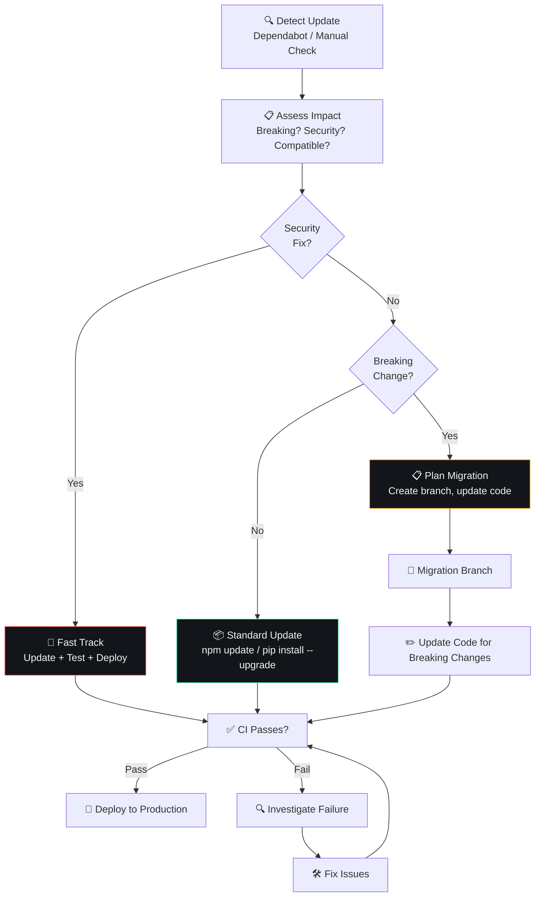

# Dependency Management

## Document Control

| Field | Value |
|---|---|
| Document ID | OPS-DEP-014 |
| Version | 1.0.0 |
| Status | Approved |
| Date | 2026-07-10 |
| Classification | Internal |
| Owner | Developer |

---

## 1. Executive Summary

### Purpose
Define the dependency management strategy for Second Brain OS. This covers Python packages (pip), Node.js packages (npm), Docker base images, GitHub Actions, and system dependencies. The strategy balances security, stability, and maintenance overhead for a single-developer project.

### Scope
All dependencies across frontend, backend, scheduler, infrastructure, and CI/CD.

---

## 2. Dependency Inventory

### 2.1 Python Dependencies (apps/api/requirements.txt)

| Package | Purpose | Version | Risk Level | Last Updated |
|---|---|---|---|---|
| fastapi | Web framework | >=0.104.0 | Medium | 2026-06 |
| uvicorn | ASGI server | >=0.24.0 | Low | 2026-06 |
| supabase | Database client | >=2.5.0 | Medium | 2026-06 |
| anthropic | Claude API client | >=0.30.0 | Low | 2026-06 |
| pydantic | Data validation | >=2.5.0 | Medium | 2026-06 |
| pydantic-settings | Configuration | >=2.1.0 | Low | 2026-06 |
| python-jose | JWT handling | >=3.3.0 | Low | 2026-06 |
| httpx | HTTP client | >=0.25.0 | Low | 2026-06 |
| PyYAML | YAML parsing | >=6.0.1 | Low | 2026-06 |
| sentry-sdk | Error tracking | >=1.40.0 | Low | 2026-06 |

### 2.2 Node.js Dependencies (apps/web/package.json)

| Package | Purpose | Version | Risk Level | Last Updated |
|---|---|---|---|---|
| next | Web framework | 14.x | High | 2026-06 |
| react | UI library | 18.x | High | 2026-06 |
| framer-motion | Animations | 11.x | Medium | 2026-06 |
| supabase-js | Database client | 2.x | Medium | 2026-06 |
| @sentry/nextjs | Error tracking | 8.x | Low | 2026-06 |
| lucide-react | Icons | 0.x | Low | 2026-06 |
| zustand | State management | 4.x | Low | 2026-06 |

### 2.3 Infrastructure Dependencies

| Dependency | Version | Purpose | Update Cadence |
|---|---|---|---|
| Python runtime | 3.10+ | Backend execution | Minor annually |
| Node.js runtime | 18+ LTS | Frontend build | LTS schedule |
| Supabase | 2026 | Database, Auth, Storage | Managed |
| Railway | N/A | Backend hosting | Managed |
| Vercel | N/A | Frontend hosting | Managed |
| Ollama | 0.3+ | Local AI | Monthly |
| Docker | 24+ | Container builds | Major annually |

---

## 3. Update Cadence

| Risk Level | Check Frequency | Apply Patch | Apply Minor | Apply Major |
|---|---|---|---|---|
| **Critical** (security) | Daily (Dependabot) | Within 24 hours | Within 72 hours | Within 1 week |
| **High** | Weekly | Within 3 days | Within 1 week | Evaluate, may skip |
| **Medium** | Weekly | Within 1 week | Within 2 weeks | Planned migration |
| **Low** | Monthly | Within 2 weeks | Within 1 month | Per release |

---

## 4. Update Process



### 4.1 Security Update Workflow

```bash
# 1. Dependabot creates PR
# 2. Review changelog for breaking changes
# 3. Run CI (full regression)
# 4. Merge and deploy within 24 hours for critical CVEs
gh pr review --approve <pr-number>
gh pr merge <pr-number>
```

### 4.2 Non-Security Update Workflow

```bash
# npm
npm outdated
npm update <package>  # Safe updates only
npm install <package>@latest  # Minor/major (check changelog)

# pip
pip list --outdated
pip install --upgrade <package>  # Check for breaking changes
```

---

## 5. Freezing Dependencies

### 5.1 When to Freeze

| Reason | Duration | Example |
|---|---|---|
| Before major release | 1 week | No dep updates 1 week before deploy |
| Known breaking change | Until migration planned | React 19 → Next.js 15 |
| End-of-life dependency | Until replacement | Python 3.9 → 3.10 |
| Active incident | Until resolved | No changes during incident |

### 5.2 Unfreezing Process

1. Create migration branch
2. Update dependency
3. Fix breaking changes
4. Run full regression suite
5. Merge after passing

---

## 6. Dependency Audit

### 6.1 Scheduled Audit

```bash
# Python
pip-audit --requirement apps/api/requirements.txt --severity high

# Node.js
npm audit --audit-level=high

# Docker
docker scout quick <image>
```

### 6.2 Quarterly Deep Audit

| Check | Action |
|---|---|
| Unused dependencies | `pip freeze` review, `npm prune` |
| Deprecated packages | Search for deprecation warnings |
| License compliance | Verify all OSS licenses |
| Bundle size impact | `next/bundle-analyzer` |
| Peer dependency conflicts | `npm ls` depth check |

---

## 7. Dependency Removal Process

```markdown
### RFC: Remove [Package Name]

**Reason:** [Why remove]
**Alternatives:** [What replaces it]
**Impact:**
- Files affected: [N]
- Tests affected: [N]

**Migration:**
1. [Step 1]
2. [Step 2]

**Risk:** Low / Medium / High
**Decision:** Approve / Reject / Defer
```

---

## 8. Version Pinning Strategy

| Environment | Strategy | Reason |
|---|---|---|
| **Development** | Loose (`>=X.Y`) | Flexibility to test upgrades |
| **CI/CD** | Lock files (`requirements.txt`, `package-lock.json`) | Reproducible builds |
| **Production** | Lock files | Stability, no surprise updates |

```python
# requirements.txt — production (pinned)
fastapi==0.104.1
uvicorn==0.24.0
supabase==2.5.0

# requirements-dev.txt — development (flexible)
fastapi>=0.104.0
uvicorn>=0.24.0
```

---

## 9. Performance Targets

| Metric | Target |
|---|---|
| Time to apply security patch | < 24 hours |
| Time for minor update | < 1 week |
| Time for major migration | < 2 weeks |
| Outdated dependencies | < 5% |
| CVEs with no fix available | < 3 at any time |

---

## 10. Edge Cases

| Edge Case | Handling |
|---|---|
| Dependency yanked from registry | Pin to last available version, find replacement |
| License changes (e.g., MIT → AGPL) | Replace dependency, fork if critical |
| Transitive dependency vulnerability | Override version in lock file |
| Platform-specific breakage | Test on both Windows and CI (Ubuntu) |

---

## 11. Failure Scenarios

| Scenario | Impact | Mitigation |
|---|---|---|
| Update breaks production | Service disruption | Rollback immediately, fix forward |
| No maintainer for critical package | Security risk | Fork and self-maintain, or find alternative |
| Conflicting transitive dependencies | Build failure | `pip check`, `npm dedupe` |
| Package registry down | CI failures | Cache dependencies in CI, use mirrors |

---

## 12. Risks

| Risk | Likelihood | Impact | Mitigation |
|---|---|---|---|
| Dependency drift (not updating) | Medium | Medium | Dependabot alerts, monthly audit |
| Breaking change missed in semver | Low | Medium | Full CI before merge |
| Abandoned package | Low | Low | Evaluate alternatives proactively |
| Supply chain attack | Low | Critical | Lock files, audit changes, SCA scanning |

---

## 13. Related Documents

| Document | Relation |
|---|---|
| .github/dependabot.yml | Automated update configuration |
| docs/qa/28_Testing.md | Regression testing for updates |
| docs/security/24_Security.md | Vulnerability management |
| docs/devops/27_DevOps.md | CI/CD pipeline |

---

## 14. Appendices

### 14.1 Quick Commands

```bash
# Python
pip list --outdated
pip install --upgrade --dry-run <package>
pip-audit

# Node.js
npm outdated
npm update
npm audit
npx npm-check-updates

# Docker
docker scout quick secondbrain-api:latest
```

### 14.2 Dependabot Configuration Reference

```yaml
# .github/dependabot.yml (key settings)
version: 2
updates:
  - package-ecosystem: "pip"
    directory: "/apps/api"
    schedule:
      interval: "weekly"
    open-pull-requests-limit: 10
  
  - package-ecosystem: "npm"
    directory: "/apps/web"
    schedule:
      interval: "weekly"
    open-pull-requests-limit: 10
```
