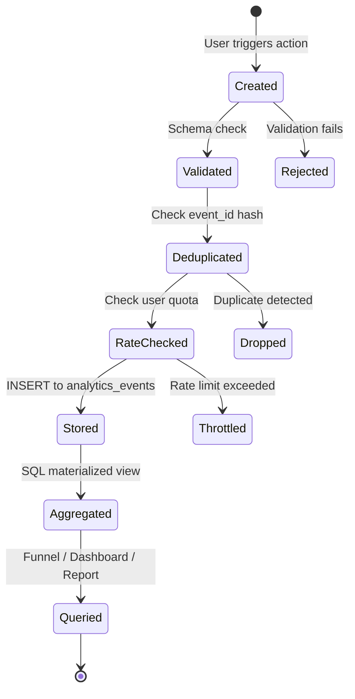

# Event Tracking Specification — Second Brain OS

## Document Control

| Field | Value |
|---|---|
| Document ID | OPS-EVT-010 |
| Version | 1.0.0 |
| Status | Approved |
| Date | 2026-07-10 |
| Classification | Internal |
| Owner | Developer |

---

## Table of Contents

- [1. Executive Summary](#1-executive-summary)
- [2. Purpose](#2-purpose)
- [3. Scope](#3-scope)
- [4. Business Context](#4-business-context)
- [5. Functional Specification](#5-functional-specification)
- [6. Non-Functional Requirements](#6-non-functional-requirements)
- [7. Architecture](#7-architecture)
- [8. Diagrams](#8-diagrams)
- [9. Data Models](#9-data-models)
- [10. APIs](#10-apis)
- [11. Security](#11-security)
- [12. Performance Targets](#12-performance-targets)
- [13. Edge Cases](#13-edge-cases)
- [14. Failure Scenarios](#14-failure-scenarios)
- [15. Risks & Mitigations](#15-risks--mitigations)
- [16. Acceptance Criteria](#16-acceptance-criteria)
- [17. Traceability](#17-traceability)
- [18. Implementation Notes](#18-implementation-notes)
- [19. Testing Strategy](#19-testing-strategy)
- [20. References](#20-references)

---

## 1. Executive Summary

This document defines the event tracking specification for Second Brain OS. Events are the foundation of all analytics, funnels, and product insights. The event taxonomy follows an `object_action` naming convention (e.g., `task_created`, `habit_logged`, `briefing_generated`) with a standard set of properties. Events are captured via a first-party custom SDK and stored in the Supabase `analytics_events` table. Automatic events (page views, sessions) require no developer instrumentation; custom events are instrumented via a simple function call.

---

## 2. Purpose

A standardised event taxonomy ensures that analytics data is consistent, discoverable, and useful across all consumers (dashboards, funnels, reports, AI insights). Without a taxonomy, different developers (or the same developer at different times) will instrument events inconsistently, leading to ambiguous data that cannot be reliably aggregated or compared.

---

## 3. Scope

This document covers:

- Event taxonomy: naming convention, object types, action types
- Event properties: required, optional, custom
- Automatic events: page views, sessions, errors
- Custom events: per-module tracking (15 functional modules)
- Event categories: engagement, performance, system, business
- Privacy considerations: PII minimisation, consent, retention
- Event QA and validation

Out of scope: third-party analytics SDKs, revenue tracking, advertising events.

---

## 4. Business Context

The event system was designed from the start as a first-party, privacy-first alternative to third-party analytics. Every event is stored in the user's own Supabase instance. No data is sent to external analytics providers (PostHog is planned for future, but current approach is fully self-contained). This architecture ensures data sovereignty and simplifies privacy compliance.

---

## 5. Functional Specification

### 5.1 Naming Convention

**Pattern:** `{object}_{action}` (snake_case, all lowercase)

| Component | Rules | Examples |
|---|---|---|
| `object` | The entity being acted upon. Singular noun. | `task`, `habit`, `goal`, `course`, `briefing` |
| `action` | The operation performed. Past tense verb. | `created`, `updated`, `deleted`, `completed`, `viewed` |

Valid examples: `task_created`, `habit_logged`, `briefing_generated`, `user_signed_up`, `session_started`

Invalid examples: `TaskCreated`, `create-task`, `task.create`, `TASK_CREATED`

### 5.2 Object Types

| Object | Description | Valid Actions |
|---|---|---|
| `user` | User account and profile | `signed_up`, `logged_in`, `logged_out`, `updated_profile` |
| `session` | User session | `started`, `ended` |
| `task` | Task CRUD | `created`, `updated`, `deleted`, `completed`, `viewed` |
| `course` | Course tracking | `created`, `updated`, `deleted`, `progressed` |
| `goal` | Goal management | `created`, `updated`, `deleted`, `achieved` |
| `habit` | Habit tracking | `created`, `updated`, `deleted`, `logged` |
| `sleep_log` | Sleep tracking | `created`, `updated`, `deleted` |
| `income_entry` | Income tracking | `created`, `updated`, `deleted` |
| `project` | Project management | `created`, `updated`, `deleted`, `completed` |
| `idea` | Idea pipeline | `created`, `updated`, `deleted`, `promoted` |
| `resource` | Resource library | `created`, `updated`, `deleted` |
| `opportunity` | Opportunity radar | `created`, `updated`, `deleted`, `matched` |
| `time_entry` | Time tracking | `created`, `updated`, `deleted`, `stopped` |
| `chat_message` | AI chat | `sent`, `received` |
| `briefing` | Daily briefing | `generated`, `viewed` |
| `review` | Weekly review | `generated`, `viewed` |
| `memory` | AI memory | `consolidated`, `retrieved` |
| `feedback` | User feedback | `submitted` |
| `page` | Page view | `viewed` |
| `automation` | Automated action | `triggered`, `completed`, `failed` |

### 5.3 Event Properties

Every event carries the following standard properties:

| Property | Type | Required | Description |
|---|---|---|---|
| `event_type` | string | Yes | `object_action` format |
| `user_id` | string | Yes | Authenticated user UUID |
| `timestamp` | datetime | Yes | ISO 8601 UTC |
| `session_id` | string | Yes | UUID per session |
| `module` | string | Yes | Module name (e.g., "tasks", "habits") |
| `action` | string | Yes | Action name (e.g., "created", "logged") |
| `source` | string | Yes | Where the event was captured: `frontend`, `backend`, `scheduler` |
| `metadata` | jsonb | No | Flexible metadata for action-specific details |
| `duration_ms` | integer | No | Duration of the action (if applicable) |
| `request_id` | string | No | Correlation ID for request tracing |

### 5.4 Automatic Events

The following events are captured automatically without developer instrumentation:

| Event | Trigger | Data Source |
|---|---|---|
| `page_viewed` | Every page navigation (frontend route change) | Frontend router hook |
| `session_started` | User login / token refresh | Auth middleware |
| `session_ended` | User logout / token expiry | Auth middleware |
| `error_occurred` | Any 4xx or 5xx API response | Backend middleware |
| `api_call` | Every API request (sampled at 10%) | Backend middleware |

### 5.5 Custom Events (by Module)

Each module instruments events at key user touchpoints. For example:

**Tasks Module:**
```typescript
// Frontend: after successful task creation
trackEvent('task_created', {
  module: 'tasks',
  action: 'created',
  metadata: {
    task_id: newTask.id,
    priority: newTask.priority,
    has_due_date: !!newTask.due_date,
  },
})
```

**Habits Module:**
```typescript
// Frontend: after logging a habit
trackEvent('habit_logged', {
  module: 'habits',
  action: 'logged',
  metadata: {
    habit_id: habit.id,
    habit_name: habit.name,
    streak_count: currentStreak,
  },
})
```

---

## 6. Non-Functional Requirements

| ID | Requirement | Target |
|---|---|---|
| EVT-NFR-001 | Event submission latency | < 50ms (async, non-blocking) |
| EVT-NFR-002 | Event loss rate | < 0.1% |
| EVT-NFR-003 | Duplicate event rate | < 0.01% |
| EVT-NFR-004 | Maximum events per hour per user | 1,000 |
| EVT-NFR-005 | Event storage retention | 90 days raw, 12 months aggregates |
| EVT-NFR-006 | Event ingestion rate | 100 events/second |

---

## 7. Architecture

```mermaid
flowchart LR
    subgraph Sources["Event Sources"]
        UI[Frontend<br/>Next.js Pages]
        API[Backend<br/>FastAPI Routes]
        Cron[Scheduler<br/>Cron Jobs]
    end

    subgraph Capture["Event Capture"]
        FESDK[trackEvent()<br/>TypeScript SDK]
        BEMW[Event Middleware<br/>Python]
        CronSDK[Scheduler SDK<br/>Python]
    end

    subgraph Validation["Validation Layer"]
        Schema[Schema Validation<br/>required props present]
        Dedup[Deduplication<br/>event_id hash]
        Rate[Rate Limiter<br/>1,000/hr/user]
    end

    subgraph Storage["Storage"]
        Raw[(analytics_events<br/>Supabase)]
        Agg[(aggregated_metrics<br/>Materialized Views)]
    end

    subgraph Consumers["Consumers"]
        Funnels[Funnel Analysis]
        Dashboards[Dashboards]
        Reports[Reports]
        AI[AI Insights]
    end

    UI --> FESDK
    API --> BEMW
    Cron --> CronSDK
    FESDK --> Validation
    BEMW --> Validation
    CronSDK --> Validation
    Validation --> Raw
    Raw --> Agg
    Agg --> Funnels
    Agg --> Dashboards
    Raw --> Reports
    Raw --> AI
```

---

## 8. Diagrams

### 8.1 Event Lifecycle



---

## 9. Data Models

### 9.1 Analytics Events Table

```sql
CREATE TABLE analytics_events (
    id UUID PRIMARY KEY DEFAULT gen_random_uuid(),
    event_type VARCHAR(100) NOT NULL,
    user_id UUID NOT NULL REFERENCES users(id),
    session_id UUID,
    module VARCHAR(50),
    action VARCHAR(50),
    source VARCHAR(20) NOT NULL CHECK (source IN ('frontend', 'backend', 'scheduler')),
    metadata JSONB DEFAULT '{}',
    duration_ms INTEGER,
    request_id VARCHAR(36),
    event_id_hash VARCHAR(64) UNIQUE,  -- dedup hash
    created_at TIMESTAMPTZ NOT NULL DEFAULT NOW()
);

CREATE INDEX idx_events_type_time ON analytics_events (event_type, created_at);
CREATE INDEX idx_events_user_time ON analytics_events (user_id, created_at);
CREATE INDEX idx_events_module ON analytics_events (module);
```

### 9.2 Event QA Table

```sql
CREATE TABLE analytics_event_qa (
    id UUID PRIMARY KEY DEFAULT gen_random_uuid(),
    event_type VARCHAR(100),
    validation_result VARCHAR(20),  -- passed, failed, warning
    error_message TEXT,
    sample_payload JSONB,
    created_at TIMESTAMPTZ DEFAULT NOW()
);
```

---

## 10. APIs

| Endpoint | Method | Purpose |
|---|---|---|
| `POST /api/v1/analytics/events` | POST | Submit a custom event |
| `GET /api/v1/analytics/events/qa` | GET | Get event validation results |

---

## 11. Security

- Event metadata is sanitised: no PII, passwords, tokens
- `event_id_hash` uses SHA-256 of (`user_id + event_type + timestamp + nonce`)
- Rate limiting: maximum 1,000 events per hour per user
- Event retention: 90 days (raw), enforced by scheduled deletion
- No events tracked for unauthenticated users (no anonymous tracking)
- User can opt out of event tracking via `/api/v1/analytics/opt-out`

---

## 12. Performance Targets

| Metric | Target |
|---|---|
| Event write latency (p50) | < 20ms |
| Event write latency (p95) | < 50ms |
| Event read query (by type + date) | < 200ms |
| Bulk event export | < 5s for 10K events |
| Database storage per 10K events | ~5MB |

---

## 13. Edge Cases

| Edge Case | Handling |
|---|---|
| User clears browser data mid-session | New session_id; user_id still identifies user |
| Network request fails during event submission | Retry with backoff (3 attempts); drop if all fail |
| Batch events arrive out of order | Timestamp ordering; events processed independently |
| Event with missing required property | Reject; log to `analytics_event_qa` for review |
| User rapidly creates many events | Rate limiter throttles; events after limit are dropped |
| Duplicate event submitted (network retry) | `event_id_hash` unique constraint prevents duplicates |

---

## 14. Failure Scenarios

| Scenario | Impact | Mitigation |
|---|---|---|
| `analytics_events` table full | Events rejected | Auto-cleanup (delete rows older than 90 days) |
| Event validation rejects legitimate events | Data loss | QA table captures rejections; manual review |
| Index maintenance blocks writes | Write degradation | Use CONCURRENTLY for index operations |
| Scheduler fails to deliver events | Gap in data | Log failed events; retry on next cron cycle |

---

## 15. Risks & Mitigations

| Risk | Likelihood | Impact | Mitigation |
|---|---|---|---|
| Event data quality degrades over time | Medium | High | Event QA pipeline; weekly quality report |
| Developers forget to instrument events | Medium | Medium | Code review checklist includes event tracking |
| Event volume grows beyond storage | Low | Medium | Retention policy; archive to cold storage |
| Privacy regulations evolve | Low | High | Anonymisation by default; opt-out capability |

---

## 16. Acceptance Criteria

- [ ] All standard event properties are validated on submission
- [ ] Deduplication works (duplicate event_id_hash rejected)
- [ ] Rate limiter enforces 1,000 events/hour/user
- [ ] Events are queryable by event_type, user_id, and date range
- [ ] Automatic events (page_view, session_start, session_end) fire without developer code
- [ ] Custom events fire for each module's key actions
- [ ] Events older than 90 days are automatically deleted

---

## 17. Traceability

| Requirement | Covered By | Verified By |
|---|---|---|
| EVT-NFR-001 | Event submit time benchmark | Profiling test |
| EVT-NFR-002 | Event loss audit | Count events vs expected |
| EVT-NFR-003 | Dedup test | Submit duplicate; verify single record |
| EVT-NFR-004 | Rate limit test | Submit 1,001 events; verify 1,000 accepted |

---

## 18. Implementation Notes

### 18.1 Event Tracking Checklist for New Modules

When adding a new module, ensure these events are instrumented:

- [ ] `{module}_viewed` — User visits the module page
- [ ] `{module}_created` — User creates a new entity
- [ ] `{module}_updated` — User edits an existing entity
- [ ] `{module}_deleted` — User removes an entity
- [ ] Any module-specific action (e.g., `habit_logged`, `task_completed`)

### 18.2 Event QA Process

1. Every event type registered in `docs/operations/Events.md` with expected properties
2. Validation script (`scripts/validate_events.py`) checks events against schema
3. Failed validations logged to `analytics_event_qa` table
4. Weekly review of QA table for recurring issues
5. Event type additions require documentation update + code review

### 18.3 Event Counts by Module (Estimated Monthly)

| Module | Est. Monthly Events | Peak Daily Events |
|---|---|---|
| Tasks | 500 | 50 |
| Habits | 300 | 30 |
| Courses | 100 | 10 |
| Goals | 100 | 10 |
| Chat | 1,000 | 100 |
| Briefings | 60 | 2 |
| Sleep | 90 | 3 |
| Income | 60 | 2 |
| Page Views | 3,000 | 300 |
| **Total** | **~5,210** | **~507** |

---

## 19. Testing Strategy

| Test Type | Scope | Location |
|---|---|---|
| Unit | Event validation logic | `tests/test_shared_utils.py` |
| Unit | Dedup hash generation | `tests/test_shared_utils.py` |
| Integration | Analytics API endpoint | `tests/test_api_endpoints.py` |
| Integration | Event write + read round-trip | `tests/test_database_schemas.py` |
| Integration | Rate limiter enforcement | `tests/test_shared_utils.py` |
| Data Quality | Event schema compliance | `tests/test_scripts.py` |

---

## 20. References

| Reference | Description |
|---|---|
| [Analytics](./30_Analytics.md) | Analytics architecture and data pipeline |
| [Funnels](./Funnels.md) | Funnel analysis using event data |
| [PostHog](./PostHog.md) | PostHog event tracking (future) |
| [Dashboards](./Dashboards.md) | Dashboard metrics sourced from events |
| [AIInsights](../ai/AIInsights.md) | AI-powered insights from event patterns |
| [Data Retention](../security/46_DataPrivacy.md) | Event data privacy and retention |

---

## Revision History

| Version | Date | Author | Changes |
|---|---|---|---|
| 1.0.0 | 2026-07-10 | Developer | Initial event tracking specification |
