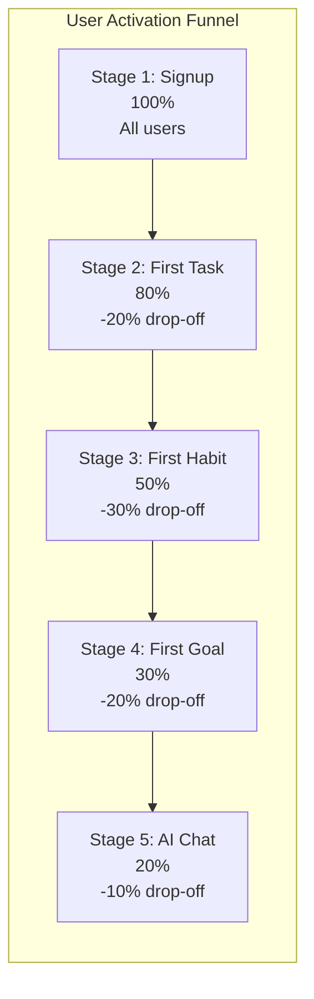
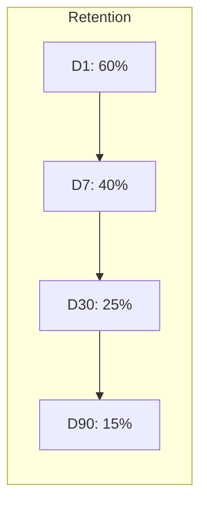

# Conversion Funnels — Second Brain OS

## Document Control

| Field | Value |
|---|---|
| Document ID | OPS-FNL-009 |
| Version | 1.0.0 |
| Status | Approved |
| Date | 2026-07-10 |
| Classification | Internal |
| Owner | Developer |

---

## Table of Contents

- [1. Executive Summary](#1-executive-summary)
- [2. Purpose](#2-purpose)
- [3. Scope](#3-scope)
- [4. Business Context](#4-business-context)
- [5. Functional Specification](#5-functional-specification)
- [6. Non-Functional Requirements](#6-non-functional-requirements)
- [7. Architecture](#7-architecture)
- [8. Diagrams](#8-diagrams)
- [9. Data Models](#9-data-models)
- [10. APIs](#10-apis)
- [11. Security](#11-security)
- [12. Performance Targets](#12-performance-targets)
- [13. Edge Cases](#13-edge-cases)
- [14. Failure Scenarios](#14-failure-scenarios)
- [15. Risks & Mitigations](#15-risks--mitigations)
- [16. Acceptance Criteria](#16-acceptance-criteria)
- [17. Traceability](#17-traceability)
- [18. Implementation Notes](#18-implementation-notes)
- [19. Testing Strategy](#19-testing-strategy)
- [20. References](#20-references)

---

## 1. Executive Summary

Conversion funnels measure user progression through key workflows in Second Brain OS. Three primary funnels are defined: user activation (signup to first AI interaction), feature adoption (depth of module usage), and retention (day 1, 7, 30). Funnel analysis identifies where users drop off so that product improvements can target the highest-impact friction points. Funnels are computed from the analytics events data in Supabase.

---

## 2. Purpose

Funnels translate raw event data into actionable product insights. They answer: Are users completing the signup flow? Do users who create tasks go on to use habits? How many users return after their first week? Which features have the worst adoption? Funnel-driven product decisions replace guesswork with quantitative evidence.

---

## 3. Scope

This document covers:

- User activation funnel (5 stages: signup → first task → first habit → first goal → AI interaction)
- Feature adoption funnel per module (15 modules)
- Retention funnel (D1, D7, D30, D90)
- Funnel analysis methodology (time-bounded, ordered, attribution)
- Funnel visualisation pattern
- Funnel data collection and SQL queries

Out of scope: revenue funnels (product is free), marketing attribution, A/B test funnels.

---

## 4. Business Context

As a single-user system today, funnel analysis has limited practical value. However, these funnels are designed and documented now so they are ready when the user base grows during the college ambassador program (Q4 2026). The analytics infrastructure in [Analytics](./30_Analytics.md) captures the required events; the funnels simply query that data with the right SQL.

---

## 5. Functional Specification

### 5.1 User Activation Funnel

| Stage | Event | Definition | Target Conversion |
|---|---|---|---|
| 1. Signup | `user_signed_up` | User creates account | 100% (baseline) |
| 2. First Task Created | `task_created` | User creates first task | > 80% |
| 3. First Habit Logged | `habit_logged` | User logs first habit completion | > 50% |
| 4. First Goal Created | `goal_created` | User creates first goal | > 30% |
| 5. First AI Interaction | `chat_message_sent` | User sends first chat message | > 20% |

The activation funnel measures progression from signup to engaged user. A user who reaches Stage 5 is considered "fully activated."

### 5.2 Feature Adoption Funnel

Per module, the adoption funnel tracks:

| Stage | Definition | Metric |
|---|---|---|
| Discovery | User views the module page | Page view event |
| First Action | User performs first CRUD action | Module-specific event |
| Repeat Usage | User performs 3+ actions in module within 7 days | Event count |
| Power Use | User performs 10+ actions in 30 days | Event count |
| Habit Formation | User uses module in 70% of eligible days | Day coverage |

### 5.3 Retention Funnel

| Stage | Definition | Target |
|---|---|---|
| D1 | User returns within 1 day of signup | > 60% |
| D7 | User returns within 7 days | > 40% |
| D30 | User returns within 30 days | > 25% |
| D90 | User returns within 90 days | > 15% |

Retention is measured as: returned at least once during the period. A "return" is any authenticated page view or API call.

### 5.4 Funnel Analysis Methodology

- **Time-bounded**: Each stage must occur within a configurable time window (default: 7 days for activation, 30 days for feature adoption)
- **Ordered**: Stages must occur in sequence. Skipping stages is tracked separately.
- **Cohort-based**: Users are grouped by signup week for consistent comparison
- **Attribution**: First-touch attribution (the initial event that led to the current stage)
- **Exclusion**: Users are excluded from a stage if they haven't reached the previous stage within the time window

---

## 6. Non-Functional Requirements

| ID | Requirement | Target |
|---|---|---|
| FNL-NFR-001 | Funnel query execution time | < 5s for 10K users |
| FNL-NFR-002 | Funnel data freshness | < 1 hour (near real-time) |
| FNL-NFR-003 | Funnel cohort size minimum | 10 users (for anonymity) |
| FNL-NFR-004 | Funnel granularity | Daily, weekly, monthly |

---

## 7. Architecture

```mermaid
flowchart TD
    subgraph Events["Event Sources"]
        Signup[user_signed_up]
        Task[task_created]
        Habit[habit_logged]
        Goal[goal_created]
        Chat[chat_message_sent]
        PageView[page_view]
    end

    subgraph Storage["Event Storage"]
        Raw[(analytics_events<br/>Supabase)]
    end

    subgraph Computation["Funnel Computation"]
        Filter[Filter by Event Types<br/>+ Time Range]
        Cohort[Group by Cohort<br/>(signup week)]
        Sequence[Order by Timestamp<br/>Check Sequence]
        Aggregate[Count per Stage<br/>Calculate Conversion]
    end

    subgraph Output["Funnel Output"]
        Activation[Activation Funnel<br/>5 stages]
        Adoption[Feature Adoption Funnel<br/>per module]
        Retention[Retention Funnel<br/>D1/D7/D30/D90]
    end

    Events --> Raw
    Raw --> Filter
    Filter --> Cohort
    Cohort --> Sequence
    Sequence --> Aggregate
    Aggregate --> Activation
    Aggregate --> Adoption
    Aggregate --> Retention
```

---

## 8. Diagrams

### 8.1 Activation Funnel Visualisation



### 8.2 Retention Funnel Visualisation



---

## 9. Data Models

### 9.1 Funnel Result Schema

```python
class FunnelStage(BaseModel):
    stage_name: str
    stage_order: int
    event_type: str
    user_count: int
    conversion_rate: float  # percentage of stage 1 users who reached this stage
    drop_off_rate: float  # percentage drop from previous stage
    median_time_to_stage_hours: Optional[float]

class FunnelResult(BaseModel):
    funnel_type: str  # activation, adoption, retention
    cohort: str  # weekly cohort label, e.g., "2026-W27"
    period_start: datetime
    period_end: datetime
    total_users_in_cohort: int
    stages: list[FunnelStage]
```

### 9.2 Query: Activation Funnel

```sql
WITH stage_1 AS (
    SELECT DISTINCT user_id, MIN(created_at) as event_time
    FROM analytics_events WHERE event_type = 'user_signed_up'
    GROUP BY user_id
),
stage_2 AS (
    SELECT DISTINCT user_id, MIN(created_at) as event_time
    FROM analytics_events WHERE event_type = 'task_created'
    GROUP BY user_id
)
SELECT
    COUNT(DISTINCT s1.user_id) as signed_up,
    COUNT(DISTINCT s2.user_id) as created_task,
    ROUND(100.0 * COUNT(DISTINCT s2.user_id) / NULLIF(COUNT(DISTINCT s1.user_id), 0), 1) as conversion_rate
FROM stage_1 s1
LEFT JOIN stage_2 s2 ON s1.user_id = s2.user_id
    AND s2.event_time > s1.event_time
    AND s2.event_time <= s1.event_time + INTERVAL '7 days';
```

---

## 10. APIs

| Endpoint | Method | Purpose |
|---|---|---|
| `GET /api/v1/analytics/funnels/activation` | GET | Get activation funnel data |
| `GET /api/v1/analytics/funnels/adoption` | GET | Get feature adoption funnel per module |
| `GET /api/v1/analytics/funnels/retention` | GET | Get retention funnel data |

---

## 11. Security

- Funnel data is aggregated; no individual user data exposed
- Minimum cohort size threshold (10 users) to prevent deanonymisation
- All funnel queries filter by the authenticated user's scope (future: admin-only for multi-user)
- Event timestamps are truncated to day granularity to reduce PII exposure

---

## 12. Performance Targets

| Metric | Target |
|---|---|
| Activation funnel query (< 10K users) | < 2 seconds |
| Feature adoption funnel (per module) | < 1 second |
| Retention funnel query | < 3 seconds |
| Funnel cache freshness | Recalculated every hour |
| Query concurrency | Max 5 simultaneous funnel queries |

---

## 13. Edge Cases

| Edge Case | Handling |
|---|---|
| User completes multiple stages in one session | Ordered funnel respects sequence; counts first occurrence |
| User skips a stage (e.g., creates goal before task) | Track as "skipped"; don't force order |
| New user in current week (incomplete funnel) | Exclude from cohort until cohort period ends |
| User with no events after signup | Counted in Stage 1 only; 0% conversion beyond |
| Funnel data for cohort < 10 users | Suppressed; return `"status": "insufficient_data"` |

---

## 14. Failure Scenarios

| Scenario | Impact | Mitigation |
|---|---|---|
| Event data missing due to collection gap | Incomplete funnel | Mark as "partial data"; exclude gap period |
| Analytics table size slows queries | Slow dashboard | Add indexes on (event_type, user_id, created_at) |
| Funnel cache returns stale data | Misleading metrics | Cache TTL of 1 hour; show "last updated" timestamp |
| Cohort window still open (in-progress) | Conversion rates change | Mark as "in_progress"; use rolling calculation |

---

## 15. Risks & Mitigations

| Risk | Likelihood | Impact | Mitigation |
|---|---|---|---|
| Funnels drive wrong product decisions | Medium | High | Always complement funnels with qualitative research |
| Over-optimisation for funnel metrics | Medium | Medium | Track leading + lagging indicators; not just funnels |
| Funnel data quality issues | Medium | High | Event validation pipeline; alert on missing events |
| Privacy regulations apply to funnel data | Low | Medium | Aggregate only; no individual tracking in funnels |

---

## 16. Acceptance Criteria

- [ ] Activation funnel query returns correct 5-stage conversion data
- [ ] Feature adoption funnel works per module (15 modules)
- [ ] Retention funnel returns D1, D7, D30, D90 rates
- [ ] Funnel data is aggregated (no individual user data exposed)
- [ ] Funnel queries respond within performance targets
- [ ] Cohort minimum size enforcement works

---

## 17. Traceability

| Requirement | Covered By | Verified By |
|---|---|---|
| FNL-NFR-001 | Funnel query benchmark | `tests/performance/load-test-crud.js` |
| FNL-NFR-002 | Cache freshness check | SQL `MAX(created_at)` comparison |
| FNL-NFR-003 | Cohort size filter | Test with < 10 users |

---

## 18. Implementation Notes

### 18.1 Funnel Maintenance

- Recalculate funnels weekly (Monday 08:00 UTC) via scheduler cron job
- Archive funnel results to `analytics_funnel_snapshots` table for trend analysis
- Monitor funnel data quality: unexpected 0s or 100% rates trigger investigation
- Add new funnels as modules are introduced

### 18.2 Funnel Interpretation

- A drop of > 50% between any two stages indicates a significant friction point
- Compare funnels across cohorts to measure product improvement impact
- Use funnel data to prioritise which stages to optimise
- Combine funnels with session recordings (PostHog) for qualitative insight

---

## 19. Testing Strategy

| Test Type | Scope | Location |
|---|---|---|
| Unit | Funnel stage ordering logic | `tests/test_shared_utils.py` |
| Integration | Funnel SQL query correctness | `tests/test_database_schemas.py` |
| Integration | Funnel API endpoint | `tests/test_api_endpoints.py` |
| Data Quality | Event sequence validation | `tests/test_scripts.py` |
| Performance | Funnel query with 10K+ events | Manual benchmark |

---

## 20. References

| Reference | Description |
|---|---|
| [Analytics](./30_Analytics.md) | Event collection and analytics architecture |
| [Events](./Events.md) | Event taxonomy and tracking specification |
| [Dashboards](./Dashboards.md) | Dashboarding funnel data |
| [PostHog](./PostHog.md) | PostHog funnel analysis (future) |
| [KPIs](./KPIs.md) | KPI framework referencing funnel metrics |
| [Retention Policies](../security/25_DataRetentionPolicy.md) | Event data retention for funnel computation |

---

## Revision History

| Version | Date | Author | Changes |
|---|---|---|---|
| 1.0.0 | 2026-07-10 | Developer | Initial conversion funnels document |
