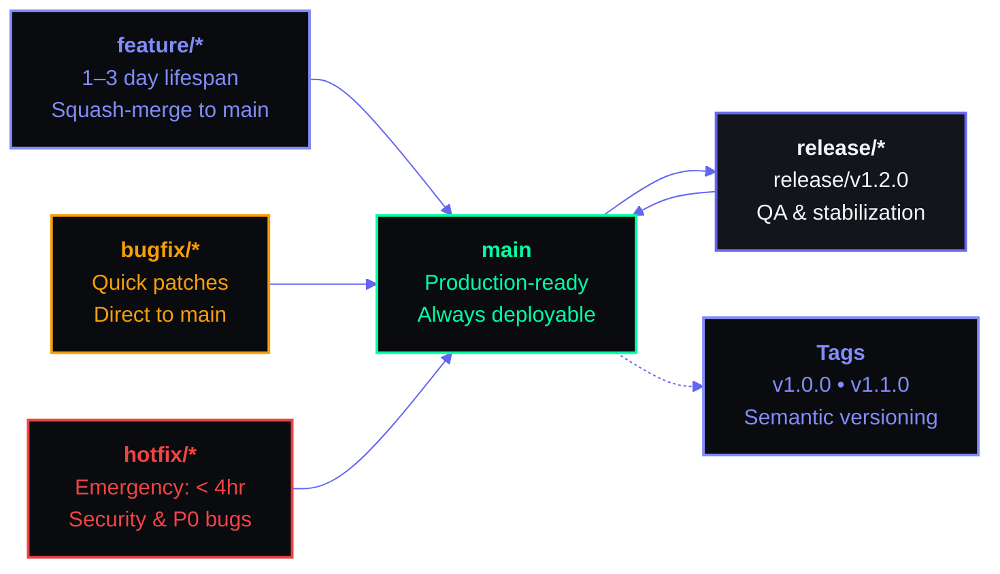

# Git Workflow

> **Document ID:** SB-OPS-GIT-003  
> **Version:** 2.0.0  
> **Status:** Active  
> **Last Updated:** 2026-06-11  
> **Classification:** Internal — Development Process  
> **Owner:** Lead Developer  

---

## Table of Contents

1. [Branching Strategy](#1-branching-strategy)
2. [Branch Naming Convention](#2-branch-naming-convention)
3. [Main Branch Protection Rules](#3-main-branch-protection-rules)
4. [Feature Branch Workflow](#4-feature-branch-workflow)
5. [Commit Message Convention](#5-commit-message-convention)
6. [PR Template](#6-pr-template)
7. [PR Size Guidelines](#7-pr-size-guidelines)
8. [Code Review Process](#8-code-review-process)
9. [Merge Strategy](#9-merge-strategy)
10. [Release Branches](#10-release-branches)
11. [Git Hooks](#11-git-hooks)
12. [Git Tags](#12-git-tags)
13. [.gitignore Patterns](#13-gitignore-patterns)
14. [Large File Handling (Git LFS)](#14-large-file-handling-git-lfs)
15. [Emergency Hotfix Process](#15-emergency-hotfix-process)
16. [Appendices](#16-appendices)

---



## 1. Branching Strategy

### 1.1 Strategy Overview

**Second Brain OS uses Trunk-based Development with short-lived feature branches.**

This strategy was selected over Git Flow for the following reasons (per ADR-005):

| Factor | Trunk-based | Git Flow | Decision |
|---|---|---|---|
| Deployment frequency | Daily+ | Weekly | Trunk wins for CI/CD |
| Branch lifetime | 1-3 days | 3-14 days | Trunk wins — less merge debt |
| Release complexity | Low | High (release branches) | Trunk wins for solo/small team |
| Hotfix handling | Simple branch + deploy | Separate hotfix branch | Trunk wins |
| History readability | Linear (squash-merge) | Complex merge graph | Trunk wins |
| Multi-version support | Limited | Excellent | Git Flow wins — N/A for this project |
| Isolation for large features | Feature flags | Long-lived branches | Feature flags preferred |

**Conclusion:** Trunk-based development with feature flags for incomplete work.

### 1.2 Branch Hierarchy

```
main ────────────────────────────────────────────────────────●──●──●──●──●──●──
  │                                                           │  │  │  │  │  │
  ├── feature/task-prioritization ────────────────●────●──────┘  │  │  │  │  │
  │                                                 │  │         │  │  │  │  │
  ├── feature/daily-briefing-ui ───────●────●───────┘  │         │  │  │  │  │
  │                                     │  │            │         │  │  │  │  │
  ├── bugfix/login-redirect ────────────●──●────────────┼─────────┘  │  │  │  │
  │                                                      │            │  │  │  │
  ├── hotfix/security-vulnerability ─────────────●───────┼────────────┘  │  │  │
  │                                               │       │               │  │  │
  ├── docs/api-documentation ──────────●──────────┼───────┼───────────────┘  │  │
  │                                    │          │       │                  │  │
  ├── refactor/prompt-loader ──────────●─────●────┼───────┼──────────────────┘  │
  │                                         │     │       │                     │
  └── experimental/knowledge-graph ────────●─────●───────┼─────────────────────┘
                                                         │
                                                    [Squash-merge]
                                                    [Delete source branch]
```

### 1.3 Branch Types

| Branch Type | Source | Target | Lifetime | Purpose |
|---|---|---|---|---|
| `main` | — | — | Permanent | Production-ready code. Always deployable. |
| `feature/*` | `main` | `main` | 1-3 days | New functionality. Short-lived. |
| `bugfix/*` | `main` | `main` | 1-2 days | Bug fixes on existing functionality. |
| `hotfix/*` | `main` | `main` | < 24 hours | Critical production issues. |
| `docs/*` | `main` | `main` | 1-2 days | Documentation changes only. |
| `refactor/*` | `main` | `main` | 1-3 days | Code improvements without behavior change. |
| `experimental/*` | `main` | None | Indefinite | Spikes, research, throwaway code. Never merged. |
| `release/*` | `main` | `main` | 1-2 days | Release preparation (cut at feature freeze). |

### 1.4 Feature Flags

For changes that cannot be completed in 1-3 days, use **feature flags** instead of long-lived branches:

```typescript
// apps/web/lib/feature-flags.ts
export const FEATURE_FLAGS = {
  knowledgeGraph: process.env.NEXT_PUBLIC_FF_KNOWLEDGE_GRAPH === 'true',
  aiSuggestions: process.env.NEXT_PUBLIC_FF_AI_SUGGESTIONS === 'true',
  mobilePwa: process.env.NEXT_PUBLIC_FF_MOBILE_PWA === 'true',
  newDashboard: process.env.NEXT_PUBLIC_FF_NEW_DASHBOARD === 'true',
} as const
```

```python
# packages/config/core/feature_flags.py
from pydantic_settings import BaseSettings

class FeatureFlags(BaseSettings):
    ff_knowledge_graph: bool = False
    ff_ai_suggestions: bool = True
    ff_mobile_pwa: bool = False
    ff_new_dashboard: bool = False

feature_flags = FeatureFlags()
```

**Feature Flag Lifecycle:**

| Stage | Flag State | Condition | Cleanup |
|---|---|---|---|
| Development | `false` | Behind flag | Not yet |
| Testing | `true` (staging) | Enabled in staging | Not yet |
| Gradual rollout | `true` (10%, 50%, 100%) | Percentage-based | After 100% |
| GA | Default `true` | Flag always on | Remove flag code |
| Deprecated | Remove flag | Code cleanup | PR to remove |

---

## 2. Branch Naming Convention

### 2.1 Format

```
<type>/<issue-number>-<short-description>
```

**Examples:**
- `feature/142-task-prioritization-algorithm`
- `bugfix/189-login-redirect-loop`
- `hotfix/203-critical-security-patch`
- `docs/156-api-documentation-update`
- `refactor/134-prompt-loader-optimization`
- `experimental/vector-search-benchmark`

### 2.2 Branch Types and Prefixes

| Prefix | Type | Naming Pattern | Example |
|---|---|---|---|
| `feature/` | New feature | `feature/<issue#>-<kebab-description>` | `feature/142-task-prioritization` |
| `bugfix/` | Bug fix | `bugfix/<issue#>-<kebab-description>` | `bugfix/189-login-redirect` |
| `hotfix/` | Critical fix | `hotfix/<issue#>-<kebab-description>` | `hotfix/203-security-patch` |
| `docs/` | Documentation | `docs/<issue#>-<kebab-description>` | `docs/156-api-docs` |
| `refactor/` | Refactoring | `refactor/<issue#>-<kebab-description>` | `refactor/134-prompt-loader` |
| `experimental/` | Research | `experimental/<topic>` | `experimental/vector-benchmark` |
| `release/` | Release prep | `release/v<major>.<minor>` | `release/v1.0` |

### 2.3 Branch Name Rules

| Rule | Rationale | Enforcement |
|---|---|---|
| Max 50 characters | Readability in CLI | Pre-receive hook |
| Use kebab-case only | Consistency with GitHub conventions | Pre-receive hook |
| Always include issue number | Traceability | CI check |
| No trailing slashes | Shell safety | Pre-receive hook |
| No uppercase letters | Cross-platform compatibility | Pre-receive hook |
| No special chars except `-` and `/` | Git safety | Pre-receive hook |

---

## 3. Main Branch Protection Rules

### 3.1 Branch Protection Settings (GitHub)

Configured in GitHub → Settings → Branches → `main`:

```yaml
# .github/branch-protection.yml (requires GitHub Enterprise)
branch_protection:
  - pattern: main
    required_status_checks:
      strict: true
      contexts:
        - "Frontend CI / lint"
        - "Frontend CI / type-check"
        - "Frontend CI / build"
        - "Backend CI / ruff"
        - "Backend CI / py-compile"
        - "Prompts CI / validate-frontmatter"
        - "Prompts CI / pytest"
        - "Security CI / npm-audit"
    enforce_admins: true
    required_pull_request_reviews:
      required_approving_review_count: 1
      dismiss_stale_reviews: true
      require_code_owner_reviews: false
    restrictions:
      users: []
      teams: []
      apps: []
    required_linear_history: true
    allow_force_pushes: false
    allow_deletions: false
    block_creations: false
    required_conversation_resolution: true
    lock_branch: false
    allow_fork_syncing: true
```

### 3.2 Protection Rules Summary

| Rule | Value | Severity | Bypass |
|---|---|---|---|
| Require PR | ✅ Required | Blocking | Admin override |
| Required approvals | 1 | Blocking | Admin override |
| Dismiss stale reviews | ✅ | Blocking | Re-review |
| Require conversation resolution | ✅ | Blocking | Resolve conversation |
| Required status checks | 8 checks | Blocking | Cannot bypass |
| Linear history | ✅ Required | Blocking | Rebase required |
| Force pushes | ❌ Blocked | Blocking | Cannot bypass |
| Deletions | ❌ Blocked | Blocking | Cannot bypass |
| Admin enforcement | ✅ Enabled | Blocking | Cannot bypass |

### 3.3 CI Status Checks Required

| Check | Service | Timeout | Failure Action |
|---|---|---|---|
| Frontend Lint | GitHub Actions (Node 18) | 15 min | Block PR merge |
| Frontend Type-Check | GitHub Actions (Node 18) | 15 min | Block PR merge |
| Frontend Build | GitHub Actions (Node 18) | 15 min | Block PR merge |
| Backend Ruff | GitHub Actions (Python 3.10) | 15 min | Block PR merge |
| Backend PyCompile | GitHub Actions (Python 3.10) | 15 min | Block PR merge |
| Prompt Validation | GitHub Actions (Python 3.10) | 10 min | Block PR merge |
| Prompt Tests | GitHub Actions (Python 3.10) | 10 min | Block PR merge |
| Security Audit | GitHub Actions (Node 18) | 10 min | Warn (non-blocking for low severity) |

---

## 4. Feature Branch Workflow

### 4.1 Complete Lifecycle

```
Step 1: Create Branch              git checkout -b feature/142-task-priority
Step 2: Develop                    [Local commits]
Step 3: Push Branch                git push -u origin feature/142-task-priority
Step 4: Create PR                  gh pr create (or GitHub web)
Step 5: CI Validates               [Automated — 8 checks]
Step 6: Team Review                [1+ approvals]
Step 7: Final Commit Fixes         [Address review feedback]
Step 8: Squash-Merge to Main       [GitHub UI]
Step 9: Delete Branch              [Automatic or manual cleanup]
Step 10: Deploy from Main          [CI/CD auto-deploy]
```

### 4.2 Step-by-Step Commands

**Step 1: Create branch from latest main**

```bash
git checkout main
git pull origin main
git checkout -b feature/142-task-priority
```

**Step 2: Develop with frequent commits**

```bash
# Make changes
git add apps/api/app/api/tasks.py
git commit -m "feat(tasks): add task prioritization endpoint"

# More changes
git add packages/ai/agents/task_agent.py
git commit -m "feat(agents): integrate prioritization with task agent"

# Keep branch up to date with main
git fetch origin
git rebase origin/main
```

**Step 3: Push and create PR**

```bash
# First push
git push -u origin feature/142-task-priority

# Subsequent pushes
git push

# Create PR (using GitHub CLI)
gh pr create \
  --title "feat(tasks): add AI-powered task prioritization" \
  --body "## Description\n\nImplements RICE-based prioritization..." \
  --label "module/ai,module/api" \
  --assignee "@me"
```

**Step 4: Update from review feedback**

```bash
# Address feedback in new commits
git add packages/ai/agents/task_agent.py
git commit -m "fix(tasks): address PR feedback — add edge case for empty tasks"

# Push updates
git push
```

**Step 5: Squash-merge (via GitHub UI)**

```bash
# After PR is approved and CI is green:
# Click "Squash and merge" in GitHub UI
# Or via CLI:
gh pr merge --squash --delete-branch
```

### 4.3 Keeping Branch Updated

**Rebase (preferred for short-lived branches):**

```bash
git fetch origin
git rebase origin/main
# If conflicts:
git rebase --continue   # After resolving
git push --force-with-lease
```

**Merge (only if rebase would be too complex):**

```bash
git fetch origin
git merge origin/main
git push
```

**Rule:** Prefer `rebase` over `merge` for feature branches to maintain linear history. Use `merge` only if the branch has been shared with another developer.

### 4.4 Workflow Rules

| Rule | Rationale | Exception |
|---|---|---|
| Always branch from latest main | Avoid stale base | Hotfix can branch from tagged commit |
| Never commit directly to main | Protect production | Hotfix with admin approval |
| Keep branches < 3 days | Reduce merge conflicts | Large features behind feature flags |
| Squash-merge all features | Clean linear history | Release branches use rebase-merge |
| Delete branch after merge | Prevent stale branches | Experimental branches can persist |
| Force-push only with `--force-with-lease` | Avoid overwriting others' work | Never on shared branches |

---

## 5. Commit Message Convention

### 5.1 Format (Conventional Commits)

```
<type>(<scope>): <description>

[optional body]

[optional footer(s)]
```

**Reference:** [conventionalcommits.org](https://www.conventionalcommits.org/)

### 5.2 Types

| Type | Description | Example | Version Bump |
|---|---|---|---|
| `feat` | New feature | `feat(tasks): add AI prioritization endpoint` | Minor |
| `fix` | Bug fix | `fix(auth): resolve login redirect loop` | Patch |
| `docs` | Documentation only | `docs(api): update task endpoint docs` | None |
| `refactor` | Code change without behavior change | `refactor(prompt-loader): simplify YAML parsing` | None |
| `test` | Adding or updating tests | `test(agents): add briefing agent unit tests` | None |
| `chore` | Build, CI, config, dependencies | `chore(deps): upgrade FastAPI to 0.110.0` | None |
| `style` | Formatting, whitespace, lint | `style(api): format with Black` | None |
| `perf` | Performance improvement | `perf(db): add indexes on task queries` | Patch |
| `ci` | CI/CD changes | `ci: add prompt validation job` | None |
| `build` | Build system changes | `build: configure webpack bundle analyzer` | None |
| `revert` | Revert a previous commit | `revert: feat(tasks): add AI prioritization` | None |

### 5.3 Scopes

| Scope | Module | Example |
|---|---|---|
| `(tasks)` | Tasks module | `feat(tasks): add bulk delete` |
| `(courses)` | Courses module | `fix(courses): correct progress calculation` |
| `(goals)` | Goals module | `feat(goals): add quarterly roadmap view` |
| `(habits)` | Habits module | `fix(habits): reset streak logic` |
| `(sleep)` | Sleep module | `feat(sleep): add sleep debt calculation` |
| `(income)` | Income module | `feat(income): hourly rate analytics` |
| `(projects)` | Projects module | `fix(projects): phase ordering` |
| `(ideas)` | Ideas module | `feat(ideas): add pipeline status filter` |
| `(resources)` | Resources module | `docs(resources): tag taxonomy` |
| `(opportunities)` | Opportunities module | `feat(opportunities): match score algorithm` |
| `(time)` | Time module | `fix(time): pomodoro timer overflow` |
| `(chat)` | Chat module | `feat(chat): message streaming` |
| `(automation)` | Automation module | `feat(automation): add radar trigger` |
| `(auth)` | Authentication | `fix(auth): session refresh` |
| `(agents)` | AI agents | `feat(agents): briefing agent v2 prompt` |
| `(prompts)` | Prompt system | `feat(prompts): add nudge agent prompt` |
| `(api)` | General API | `docs(api): endpoint inventory` |
| `(web)` | Frontend | `feat(web): dashboard layout refresh` |
| `(db)` | Database | `refactor(db): migrate habits table` |
| `(ci)` | CI/CD | `ci: add Dependabot config` |
| `(deps)` | Dependencies | `chore(deps): upgrade Next.js to 14.2` |
| `(infra)` | Infrastructure | `chore(infra): add staging environment` |

### 5.4 Complete Examples

```
feat(tasks): add AI-powered task prioritization endpoint

Implements RICE scoring (Reach, Impact, Confidence, Effort) using
the task_agent LLM to auto-prioritize tasks daily.

- New endpoint: POST /api/tasks/prioritize
- Integrates with task_agent.py
- Falls back to manual priority sort if LLM unavailable

Closes #142
Breaking: changes task priority field from int to enum
```

```
fix(auth): resolve login redirect loop when token expired

The redirect loop occurred because the auth middleware was
checking token expiry before the refresh flow completed.

- Moved token expiry check after refresh attempt
- Added max redirect counter (3) to prevent infinite loops
- Added toast notification on token refresh failure

Fixes #189
```

```
chore(deps): upgrade FastAPI to 0.110.0

- Updates fastapi from 0.104.0 to 0.110.0
- Updates uvicorn from 0.24.0 to 0.29.0
- Removes deprecated Depends() usage
- No breaking changes in our codebase

Refs #203
```

```
docs(api): complete endpoint documentation for all 13 routers

- Adds OpenAPI examples for all 53 endpoints
- Documents all Pydantic request/response schemas
- Adds authentication requirements per endpoint
- Includes curl examples for testing

Closes #156
```

### 5.5 Commit Message Rules

| Rule | Enforcement | Example |
|---|---|---|
| Header max 72 characters | commit-msg hook | ✅ `feat(tasks): add AI prioritization` |
| Body wrapped at 72 characters | commit-msg hook | ✅ Manual line breaks |
| Type must be valid | commit-msg hook | ✅ From type list |
| Scope must be valid (if present) | commit-msg hook | ✅ From scope list |
| Subject starts with lowercase | commit-msg hook | ❌ `feat(Tasks):` → `feat(tasks):` |
| No period at end of subject | commit-msg hook | ❌ `feat: add thing.` → `feat: add thing` |
| Footer for breaking changes | CI check | `Breaking: changes priority field` |
| Link to issue | CI check | `Closes #142` or `Refs #142` |

### 5.6 Breaking Changes

When a commit introduces a breaking change:

```
<type>(<scope>): <description>

BREAKING CHANGE: <description of what breaks and migration path>

Migration guide:
1. Update calls from /api/v1/tasks to /api/v2/tasks
2. Change 'priority' field from int to enum
3. Add 'user_id' to all query params
```

---

## 6. PR Template

### 6.1 Pull Request Template

```markdown
---
name: Standard Pull Request
about: Submit a PR for review
title: "<type>(<scope>): <description>"
labels: ""
assignees: ""
---

## Description

<!-- Briefly describe the changes in 2-3 sentences -->

[Provide context: what problem does this solve?]

Closes #[issue-number]
Related to #[other-issue]

## Type of Change

- [ ] feat: New feature
- [ ] fix: Bug fix
- [ ] docs: Documentation
- [ ] refactor: Code restructuring
- [ ] test: Tests only
- [ ] chore: Build, CI, deps
- [ ] perf: Performance improvement
- [ ] breaking: Breaking change (include migration guide)

## Testing

<!-- Describe how you tested these changes -->

- [ ] Unit tests added/updated
- [ ] Integration tests added/updated
- [ ] E2E tests pass
- [ ] Manual testing performed

**Test evidence:** [Screenshots, logs, or test output]

## Screenshots

<!-- If UI changes, include before/after screenshots -->

| Before | After |
|---|---|
| [before.png] | [after.png] |

## Checklist

### Code Quality
- [ ] Follows code style guidelines (ESLint/Ruff)
- [ ] Type-check passes (TypeScript/pyright)
- [ ] No new warnings (lint, build)
- [ ] No debug code, console.log, or TODO comments
- [ ] Error handling implemented

### Security
- [ ] No SQL injection vectors (parameterized queries used)
- [ ] No secrets or tokens committed
- [ ] Input validation implemented (both frontend and backend)
- [ ] RLS policies considered (Supabase)

### Documentation
- [ ] JSDoc/Pydoc comments added for new functions
- [ ] README updated if needed
- [ ] API docs updated (if endpoint changes)
- [ ] CHANGELOG.md draft entry added

### Prompt System (if applicable)
- [ ] Prompt frontmatter validated
- [ ] Fallback prompt tested
- [ ] Agent module updated to use prompt
- [ ] Content tests pass

## Dependencies

- [ ] Adds new dependencies (justified in description)
- [ ] Removes unused dependencies
- [ ] Updates existing dependencies

## Deployment Notes

<!-- Any special deployment instructions -->
- [ ] Database migration required
- [ ] Environment variables added
- [ ] Feature flag configuration updated
- [ ] Rollback plan documented

## Review Instructions

<!-- Specific areas for reviewers to focus on -->
- Focus on: [module/path/file.ts]
- Especially concerned about: [specific concern]
```

### 6.2 PR Description Guidelines

| Do | Don't |
|---|---|
| Link to the issue | Say "see issue" without context |
| Describe what and why | Only describe what changed |
| Include screenshots for UI | Assume text is enough for UI |
| List manual test steps | Assume reviewer knows how to test |
| Call out risky changes | Bury risky changes in large diffs |
| Include migration steps for breaking changes | Leave breaking changes undocumented |

### 6.3 PR Body Bad Practices

```markdown
<!-- ❌ BAD: Too vague -->
Closes #142

<!-- ❌ BAD: No context -->
Fixed the thing. Tests pass.

<!-- ❌ BAD: Overly detailed on implementation -->
Changed line 42 from .map() to .forEach() and line 87 from 
const to let because the linter said so. Also updated the 
import order in 3 files.

<!-- ✅ GOOD: Clear and informative -->
Implements RICE-based task prioritization using the task_agent 
LLM. Users can now auto-prioritize their task list with one 
click. Falls back to manual sort if LLM is unavailable.

Closes #142
```

---

## 7. PR Size Guidelines

### 7.1 Size Limits

| Metric | Maximum | Ideal | Action if Exceeded |
|---|---|---|---|
| Total lines changed | 400 | < 200 | Break into stacked PRs |
| Files changed | 15 | < 8 | Split by module |
| Commits per PR | 10 | 3-5 | Squash WIP commits |
| Review time (max) | 48 hours | < 12 hours | Escalate |

### 7.2 Stacked PRs (Large Changes)

For changes exceeding 400 lines, break into stacked PRs:

```
PR #1: Data model + migration          (120 lines)
  ↓ (merge to main)
PR #2: API endpoint + validation       (180 lines)
  ↓ (merge to main)
PR #3: Frontend UI + state management  (250 lines)
  ↓ (merge to main)
PR #4: Tests + documentation           (100 lines)
```

**Stacked PR Workflow:**

```bash
# Create first branch
git checkout -b feature/142-model
# ... develop, PR, merge to main ...

# Create second branch from updated main
git checkout main && git pull
git checkout -b feature/142-api

# Alternative: chain branches (advanced)
git checkout -b feature/142-model
git checkout -b feature/142-api   # branch off feature branch
git checkout -b feature/142-ui    # branch off API branch
```

### 7.3 What Counts Towards the Limit

| Included | Not Included |
|---|---|
| `.ts`, `.tsx`, `.js`, `.py` changes | `package-lock.json` (auto-generated) |
| CSS/Tailwind changes | `requirements.txt` (version bumps) |
| Test files | `.md` documentation files |
| Config files | `.github/workflows/*.yml` |
| Prompt `.md` files (content changes) | Generated files (`dist/`, `build/`, `.next/`) |
| Migration SQL files | Image assets |

### 7.4 Small PR Incentives

| Size | Label | Review Speed | Merge Confidence |
|---|---|---|---|
| < 50 lines | `size/xs` | < 4 hours | Very high |
| 50-200 lines | `size/s` | < 12 hours | High |
| 200-400 lines | `size/m` | < 24 hours | Moderate |
| 400+ lines | `size/l` | < 48 hours | Low — request split |

---

## 8. Code Review Process

### 8.1 Review Roles

| Role | Responsibility | Required |
|---|---|---|
| Author | Creates PR, responds to feedback | Yes |
| Reviewer 1 | Primary reviewer, approves | Yes (at least 1) |
| Reviewer 2 | Secondary reviewer (optional) | For complex changes |
| Tech Lead | Final sign-off (for architectural changes) | Per discretion |
| QA | Verify test coverage and behavior | Per PR type |

### 8.2 Review SLA

| Metric | Target | Escalation |
|---|---|---|
| First review | Within 12 hours | Ping after 12h |
| Complete review | Within 24 hours | Escalate to Tech Lead after 24h |
| Multi-round review | Within 48 hours total | PM escalation after 48h |
| Emergency hotfix | Within 1 hour | Directly tag reviewer |

### 8.3 Review Checklist

**Code Reviewer Checklist:**

```markdown
## Reviewer Checklist

### Functionality
- [ ] Code does what the description says
- [ ] Acceptance criteria are met
- [ ] Edge cases are handled (empty state, error state, boundary)
- [ ] No obvious bugs or logic errors

### Code Quality
- [ ] Follows project conventions and style guide
- [ ] No dead code, commented-out code, or TODOs
- [ ] Proper error handling and logging
- [ ] No performance concerns (N+1 queries, memory leaks)
- [ ] No security vulnerabilities (XSS, injection, exposed secrets)

### Testing
- [ ] Tests cover the new functionality
- [ ] Tests are meaningful (test behavior, not implementation)
- [ ] Edge cases have test coverage
- [ ] No flaky tests introduced

### Documentation
- [ ] Inline comments explain "why" not "what"
- [ ] API changes are documented (OpenAPI/JSDoc)
- [ ] README or docs updated if needed
- [ ] CHANGELOG entry added

### Breaking Changes (if applicable)
- [ ] Migration path documented
- [ ] Deprecation warnings added
- [ ] Feature flag used if needed
```

### 8.4 Review Best Practices

**For Authors:**

```markdown
- Request reviews from specific people (not random assignment)
- Write a clear description with context
- Respond to all comments (agree, disagree, or ask clarifying)
- Make requested changes in new commits (don't amend pushed commits)
- Re-request review after addressing all feedback
- Thank reviewers for their time
```

**For Reviewers:**

```markdown
- Review the PR within 12 hours (24 max)
- Be specific: "Line 42: potential null reference when user is null"
- Be kind: "Consider using early return here for readability" not "This is wrong"
- Distinguish: "Must fix" vs "Nitpick" vs "Suggestion"
- Approve when satisfied, don't leave PRs hanging
- Review from the user's perspective, not just code quality
```

### 8.5 Review Response Types

| Label | Meaning | Action Required | Blocking |
|---|---|---|---|
| `blocking` | Must fix before merge | Address and re-request review | ✅ Yes |
| `suggestion` | Optional improvement | Optional | ❌ No |
| `nitpick` | Minor style preference | Ignore or quick fix | ❌ No |
| `question` | Request for clarification | Respond with explanation | ❌ No (unless blocking) |
| `praise` | Positive feedback | Say thanks | ❌ No |

### 8.6 Disagreement Resolution

```
Author disagrees with reviewer feedback
        │
        ▼
Author explains reasoning with technical justification
        │
        ▼
┌────────────────┐    Yes
│ Reviewer agrees│ ───────→ Resolve conversation
│ with author?   │
└────────────────┘
        │ No
        ▼
Involve Tech Lead as tiebreaker
        │
        ▼
Tech Lead makes final decision
(If still unresolved: Engineering Manager)
```

### 8.7 Automatable Reviews

The following are checked by CI/linters, not humans:

| Check | Tool | CI Job |
|---|---|---|
| Formatting (Python) | Ruff | Backend CI |
| Linting (TS) | ESLint | Frontend CI |
| Type checking | TypeScript | Frontend CI |
| Import order | ESLint import/order | Frontend CI |
| Prompt frontmatter | validate_prompts.py | Prompts CI |
| Security audit | npm audit | Security CI |
| Commit message format | commitlint | CI trigger |

---

## 9. Merge Strategy

### 9.1 Merge Types

| Strategy | Used For | History | Pros | Cons |
|---|---|---|---|---|
| **Squash-merge** | Feature branches, bugfixes | Single commit on main | Clean linear history | Loses individual commits |
| **Rebase-merge** | Release branches | All commits preserved | Full granularity | More noise on main |
| **Merge commit** | Never (except hotfix from release) | Branch history visible | Preserves context | Cluttered history |

**Default: Squash-merge** — all feature branches become a single commit on main.

### 9.2 Squash-Merge Commit Message Template

When GitHub squashes and merges, it uses the PR title and body:

```
feat(tasks): add AI-powered task prioritization (#142)

Implements RICE scoring (Reach, Impact, Confidence, Effort) using
the task_agent LLM to auto-prioritize tasks daily.

- New endpoint: POST /api/tasks/prioritize
- Integrates with task_agent.py
- Falls back to manual priority sort if LLM unavailable

Closes #142
```

### 9.3 Merge Configuration (GitHub)

```yaml
# Repository settings → Pull Requests
allow_squash_merge: true
allow_rebase_merge: true
allow_merge_commit: false
default_merge_message: pr-title
default_squash_commit_message: pr-body
```

---

## 10. Release Branches

### 10.1 Release Process

```
Week before release (Feature Freeze)
        │
        ▼
Create release branch: release/v1.0
(cut from main at feature freeze)
        │
        ▼
Final testing & bug fixes on release branch
(PRs target release/v1.0, not main)
        │
        ▼
Rebase-merge release/v1.0 → main
        │
        ▼
Tag v1.0.0 on main
        │
        ▼
Deploy to production
        │
        ▼
Delete release branch
```

### 10.2 Release Branch Commands

```bash
# Cut release branch
git checkout main
git pull origin main
git checkout -b release/v1.0
git push -u origin release/v1.0

# Cherry-pick hotfix to release
git checkout release/v1.0
git cherry-pick <commit-hash>
git push

# After release, merge back to main
git checkout main
git merge release/v1.0 --ff-only
git tag v1.0.0
git push origin main --tags

# Cleanup
git branch -d release/v1.0
git push origin --delete release/v1.0
```

### 10.3 Hotfix from Release Branch

If a critical bug is found on the release branch before it ships:

```bash
git checkout release/v1.0
git checkout -b hotfix/223-crash-on-empty-state
# Fix the bug
git commit -m "fix(dashboard): crash when task list is empty"
git push -u origin hotfix/223-crash-on-empty-state
# Create PR targeting release/v1.0
# After review, squash-merge to release/v1.0
# Then cherry-pick to main
git checkout main
git cherry-pick <commit-hash>
git push
```

---

## 11. Git Hooks

### 11.1 Hook Directory

All hooks are in `.githooks/` (not `.git/hooks/` — which is not tracked):

```
.githooks/
├── commit-msg           # Validates commit message format
├── pre-commit           # Linting, formatting, secrets check
├── pre-push             # Runs test suite
└── prepare-commit-msg   # Auto-prepends issue number from branch name
```

**Enable custom hooks directory:**

```bash
git config core.hooksPath .githooks
```

**One-time setup script:**

```bash
# scripts/setup-hooks.sh
#!/bin/bash
git config core.hooksPath .githooks
chmod +x .githooks/*
echo "Git hooks configured successfully."
```

### 11.2 commit-msg Hook

```bash
#!/bin/bash
# .githooks/commit-msg
# Validates Conventional Commits format

COMMIT_MSG=$(cat "$1")

# Regex for conventional commits
PATTERN="^(feat|fix|docs|refactor|test|chore|style|perf|ci|build|revert)(\([a-z\-]+\))?!?: .{1,72}$"

if ! echo "$COMMIT_MSG" | grep -qE "$PATTERN"; then
    echo ""
    echo "❌ Invalid commit message format!"
    echo ""
    echo "Expected: <type>(<scope>): <description>"
    echo "Example:  feat(tasks): add AI prioritization"
    echo ""
    echo "Types: feat, fix, docs, refactor, test, chore, style, perf, ci, build, revert"
    echo "Scopes: tasks, courses, habits, goals, agents, api, web, prompts, ai, db, ci, deps, infra, auth"
    echo ""
    exit 1
fi

# Check line length
LENGTH=${#COMMIT_MSG}
if [ "$LENGTH" -gt 72 ]; then
    echo ""
    echo "❌ Commit message too long ($LENGTH characters). Max 72 characters."
    echo ""
    exit 1
fi

exit 0
```

### 11.3 pre-commit Hook

```bash
#!/bin/bash
# .githooks/pre-commit
# Runs linters and checks on staged files

STAGED_FILES=$(git diff --cached --name-only --diff-filter=ACM)

if [ -z "$STAGED_FILES" ]; then
    exit 0
fi

echo "🔍 Running pre-commit checks..."

# Check for secrets
if echo "$STAGED_FILES" | grep -qE '\.env$|\.env\.local$|\.env\.production$'; then
    echo "❌ ERROR: .env files should not be committed!"
    exit 1
fi

# Check for AWS/Azure/GCP keys
if git diff --cached | grep -qE '(AKIA|ASIA|aws_secret|azure_.*_key|-----BEGIN.*PRIVATE KEY-----)'; then
    echo "❌ ERROR: Potential secret/key detected in staged changes!"
    exit 1
fi

# Run ESLint on staged TS files
TS_FILES=$(echo "$STAGED_FILES" | grep -E '\.(ts|tsx)$' | tr '\n' ' ')
if [ -n "$TS_FILES" ]; then
    echo "Running ESLint on staged TypeScript files..."
    npx eslint $TS_FILES
    if [ $? -ne 0 ]; then
        echo "❌ ESLint failed. Fix errors before committing."
        exit 1
    fi
fi

# Run Ruff on staged Python files
PY_FILES=$(echo "$STAGED_FILES" | grep -E '\.py$' | tr '\n' ' ')
if [ -n "$PY_FILES" ]; then
    echo "Running Ruff on staged Python files..."
    ruff check $PY_FILES
    if [ $? -ne 0 ]; then
        echo "❌ Ruff check failed. Fix errors before committing."
        exit 1
    fi
fi

echo "✅ Pre-commit checks passed!"
exit 0
```

### 11.4 prepare-commit-msg Hook (Branch-based Issue Number)

```bash
#!/bin/bash
# .githooks/prepare-commit-msg
# Auto-prepends issue number from branch name

BRANCH_NAME=$(git symbolic-ref --short HEAD 2>/dev/null)
COMMIT_MSG_FILE=$1
COMMIT_SOURCE=$2

# Skip for merges and amend
if [ "$COMMIT_SOURCE" = "merge" ] || [ "$COMMIT_SOURCE" = "commit" ]; then
    exit 0
fi

# Extract issue number from branch name
ISSUE_NUMBER=$(echo "$BRANCH_NAME" | grep -oE '[0-9]{3,}' | head -1)

if [ -n "$ISSUE_NUMBER" ]; then
    # Check if commit message already references the issue
    if ! grep -q "#$ISSUE_NUMBER" "$COMMIT_MSG_FILE"; then
        echo "" >> "$COMMIT_MSG_FILE"
        echo "Refs #$ISSUE_NUMBER" >> "$COMMIT_MSG_FILE"
    fi
fi

exit 0
```

### 11.5 Hook Bypass

In emergency situations, hooks can be bypassed:

```bash
# Skip pre-commit hook
git commit --no-verify -m "fix(auth): critical security patch"

# Skip commit-msg hook
git commit --no-verify -m "temp: debug commit"
```

**Rule:** Bypassing hooks requires written justification in the commit message or PR body.

---

## 12. Git Tags

### 12.1 Tagging Convention

**Semantic Versioning:** `v<major>.<minor>.<patch>`

```bash
# Production release
git tag -a v1.0.0 -m "v1.0.0 - Initial production release"

# Release candidate
git tag -a v1.0.0-rc.1 -m "v1.0.0-rc.1 - Release candidate 1"

# Beta
git tag -a v1.0.0-beta.1 -m "v1.0.0-beta.1 - Beta release"

# Patch
git tag -a v1.0.1 -m "v1.0.1 - Security patch for CVE-2026-1234"
```

### 12.2 Tag Types

| Tag Type | Format | Who Tags | When |
|---|---|---|---|
| Production release | `v1.0.0` | Lead Developer | After merge to main |
| Release candidate | `v1.0.0-rc.1` | Lead Developer | During release testing |
| Beta | `v1.0.0-beta.1` | Lead Developer | Pre-release testing |
| Hotfix | `v1.0.1` | Developer | After hotfix merge |
| Milestone | `v1.0.0-m1` | Product Owner | End of sprint |

### 12.3 Tag Commands

```bash
# Create annotated tag (preferred)
git tag -a v1.0.0 -m "v1.0.0 - Initial production release"

# Push tags
git push origin v1.0.0       # Single tag
git push origin --tags       # All tags

# List tags
git tag -l "v1.*"            # All v1.x tags
git tag -n                   # Tags with annotations

# Delete tag (local and remote)
git tag -d v1.0.0-rc.1
git push origin --delete v1.0.0-rc.1

# Checkout tag (read-only)
git checkout tags/v1.0.0 -b release/v1.0.0
```

### 12.4 Tag Rules

| Rule | Rationale |
|---|---|
| Only tag on main | Tags represent official releases |
| Annotated tags only | Lightweight tags lose metadata |
| Never delete a production tag | Release history is permanent |
| Sign tags with GPG (recommended) | Verify authenticity |
| Tag after merge, not before | Tag represents what's released |

### 12.5 Automated Tagging in CI

```yaml
# .github/workflows/release.yml
name: Tag Release

on:
  push:
    branches: [main]

jobs:
  tag:
    runs-on: ubuntu-latest
    steps:
      - uses: actions/checkout@v4
        with:
          fetch-depth: 0
      
      - name: Auto-tag on version change
        run: |
          VERSION=$(python -c "import json; print(json.load(open('package.json'))['version'])")
          if git rev-parse "v$VERSION" >/dev/null 2>&1; then
            echo "Tag v$VERSION already exists, skipping"
          else
            git tag -a "v$VERSION" -m "v$VERSION - Auto-tagged by CI"
            git push origin "v$VERSION"
          fi
```

---

## 13. .gitignore Patterns

### 13.1 .gitignore (Root)

```gitignore
# === Environment ===
.env
.env.local
.env.development.local
.env.test.local
.env.production.local

# === IDE ===
.vscode/
.idea/
*.swp
*.swo
*~
.DS_Store
Thumbs.db

# === Dependencies ===
node_modules/
.pnp/
.pnp.js
__pycache__/
*.pyc
*.pyo
*.egg-info/
.venv/
venv/
*.egg

# === Build Output ===
.next/
out/
build/
dist/
*.tsbuildinfo
next-env.d.ts

# === Coverage ===
coverage/
.coverage
*.lcov

# === Logs ===
*.log
npm-debug.log*
yarn-debug.log*
yarn-error.log*
.pnpm-debug.log*

# === OS Files ===
.DS_Store
Thumbs.db
desktop.ini

# === Docker ===
.docker/
docker-compose.override.yml

# === Testing ===
.cache/
.mypy_cache/
.ruff_cache/
.pytest_cache/
junit.xml

# === Secrets ===
*.pem
*.key
*.crt
secrets/
service-account*.json

# === AI Model Files ===
*.gguf
models/
ollama-data/

# === Large Files (managed via LFS) ===
*.csv
*.parquet
*.pkl
*.h5
*.pb
```

### 13.2 Per-Directory .gitignore

**`apps/api/.gitignore`:**

```gitignore
# API-specific
*.db
*.sqlite
migrations/versions/*.py
alembic.ini
!migrations/versions/.gitkeep
static/
media/
```

**`apps/web/.gitignore`:**

```gitignore
# Next.js specific
.next/
out/
.cache/
next-env.d.ts
*.tsbuildinfo
```

**`services/scheduler/.gitignore`:**

```gitignore
# Scheduler-specific
*.db
*.sqlite
logs/
```

---

## 14. Large File Handling (Git LFS)

### 14.1 LFS Configuration

```bash
# Install Git LFS
git lfs install

# Track file types
git lfs track "*.csv"
git lfs track "*.parquet"
git lfs track "*.pkl"
git lfs track "*.h5"
git lfs track "*.pb"
git lfs track "*.gguf"
git lfs track "*.pth"
git lfs track "*.onnx"

# This creates .gitattributes
# Commit .gitattributes
git add .gitattributes
git commit -m "chore: configure Git LFS for large files"
```

### 14.2 .gitattributes

```gitignore
*.csv filter=lfs diff=lfs merge=lfs -text
*.parquet filter=lfs diff=lfs merge=lfs -text
*.pkl filter=lfs diff=lfs merge=lfs -text
*.h5 filter=lfs diff=lfs merge=lfs -text
*.pb filter=lfs diff=lfs merge=lfs -text
*.gguf filter=lfs diff=lfs merge=lfs -text
*.pth filter=lfs diff=lfs merge=lfs -text
*.onnx filter=lfs diff=lfs merge=lfs -text
```

### 14.3 LFS Rules

| Rule | Description |
|---|---|
| Max file size (LFS) | < 100 MB per file |
| Max file size (direct) | < 5 MB per file (must use LFS above 5 MB) |
| Total LFS storage | < 1 GB (GitHub Free tier limit) |
| LFS bandwidth | < 1 GB/month (GitHub Free tier limit) |

### 14.4 Alternative: External Storage

For files > 100 MB or when LFS quota is insufficient:

```yaml
# Store large assets externally
large_assets:
  provider: S3 / GCS / Supabase Storage
  prefix: gs://secondbrain-assets/models/
  
  examples:
    - "gs://secondbrain-assets/models/mistral-7b.gguf"
    - "gs://secondbrain-assets/data/course-embeddings.parquet"
```

---

## 15. Emergency Hotfix Process

### 15.1 When to Use Hotfix

A hotfix is warranted when:

| Severity | Example | Response |
|---|---|---|
| Critical — Data loss | User data being deleted | Immediate hotfix |
| Critical — Security | Auth bypass, data leak | Immediate hotfix |
| Critical — Outage | Site down for all users | Immediate hotfix |
| High — Major bug | Core feature broken for many users | Hotfix or next deploy |
| Medium — Minor bug | Cosmetic issue | Normal sprint cycle |
| Low — Edge case | Rare scenario rarely encountered | Normal backlog |

### 15.2 Hotfix Process

```bash
# Step 1: Create hotfix branch from main
git checkout main
git pull origin main
git checkout -b hotfix/233-critical-auth-bypass

# Step 2: Fix the issue with minimal changes
# (Only the minimum code to fix the issue)
git add apps/api/app/api/auth.py
git commit -m "fix(auth): prevent token forgery by validating signature"

# Step 3: Push and create PR (with urgency label)
git push -u origin hotfix/233-critical-auth-bypass
gh pr create \
  --title "fix(auth): prevent token forgery by validating signature" \
  --body "## Critical Security Fix\n\n**Severity:** Critical — Auth bypass\n**CVE:** Pending\n\n**Fix:** Validates JWT signature before accepting token\n\n**Risk:** Minimal — 3 lines changed\n\n**Testing:** Manual + existing tests pass" \
  --label "priority/p0,type/hotfix,status/urgent"

# Step 4: Tag reviewers (@engineering-team)
# Step 5: After approval, squash-merge

# Step 6: Tag the hotfix
git checkout main
git pull origin main
git tag -a v1.0.1 -m "v1.0.1 - Security: JWT signature validation"
git push origin v1.0.1

# Step 7: Deploy immediately
```

### 15.3 Hotfix PR Template

```markdown
---
name: Hotfix
about: Emergency production fix
title: "fix(<scope>): <description>"
labels: priority/p0, type/hotfix
---

## Criticality

**Severity:** Critical / High
**Impact:** [Describe user/business impact]
**CVE/Issue:** #[issue-number]

## Root Cause

[2-3 sentences describing what caused the issue]

## Fix

[2-3 sentences describing the fix]

## Risk Assessment

- Lines changed: [count]
- Files changed: [count]
- Regression risk: [Low/Medium/High]
- Rollback plan: [How to revert]

## Verification

- [ ] Fix tested on staging
- [ ] Existing tests pass
- [ ] No new tests required (change is minimal)
- [ ] Manual verification steps:
  1. [Step 1]
  2. [Step 2]

## Deployment

- [ ] Requires immediate deployment
- [ ] Can wait for next regular deploy
- [ ] Database migration required: [Yes/No]
```

### 15.4 Hotfix Rules

| Rule | Rationale |
|---|---|
| Only P0 severity | Prevent hotfix abuse |
| Max 50 lines changed | Reduce regression risk |
| 2 reviewers minimum (1 can be async) | Even hotfixes need review |
| Must have rollback plan | Production safety |
| Must be documented in incident report | Post-mortem tracking |
| Create a follow-up issue for root cause | Ensure permanent fix |

### 15.5 Post-Hotfix Process

After a hotfix is deployed, the team must:

1. **Create a GH Issue** documenting the incident
2. **Determine root cause** (5 Whys analysis)
3. **Implement permanent fix** in next sprint
4. **Add regression test** to prevent recurrence
5. **Update monitoring** to detect the issue proactively
6. **Review incident** in next retrospective

---

## 16. Appendices

### Appendix A: Git Configuration

```bash
# Recommended global Git config
git config --global user.name "Your Name"
git config --global user.email "your@email.com"
git config --global pull.rebase true
git config --global rebase.autoStash true
git config --global fetch.prune true
git config --global diff.colorMoved zebra
git config --global core.editor "code --wait"
git config --global init.defaultBranch main
```

### Appendix B: Common Git Commands Cheatsheet

```bash
# Branch management
git branch -a                          # List all branches (local + remote)
git branch -d feature/old-branch       # Delete local branch
git push origin --delete feature/old   # Delete remote branch
git remote prune origin                # Clean stale remote tracking branches

# Commit history
git log --oneline --graph -20          # Last 20 commits with graph
git log --oneline --since="2 weeks ago" # Commits in last 2 weeks
git shortlog -sn --since="1 month"     # Commits per author this month

# Changes
git diff --stat                        # Stats on changed files
git diff --cached                      # Staged changes
git show <commit> --stat               # Stats on a specific commit
git blame file.py                      # Who changed each line

# Undo
git reset HEAD~1                       # Undo last commit (keep changes)
git reset --hard HEAD~1                # Undo last commit (discard changes)
git checkout -- file.py                # Discard unstaged changes
git restore --staged file.py           # Unstage a file

# Interactive
git add -p                             # Stage parts of files
git rebase -i HEAD~5                   # Interactive rebase last 5 commits
git stash                              # Save working directory
git stash pop                          # Restore stashed changes
```

### Appendix C: Branch Cleanup Policy

```bash
# Weekly cleanup of stale branches
# Branches older than 2 weeks without activity

git branch --merged main | grep -v "main" | xargs git branch -d
git branch -r --merged main | grep -v "main" | sed 's/origin\///' | xargs -I {} git push origin --delete {}
```

**Automated cleanup via GitHub Settings:**
- Repository → Settings → Branches → Branch protection
- Enable "Automatically delete head branches" after merge

### Appendix D: Commit Message Quick Reference

```
┌─────────────────────────────────────────────────────────────┐
│           CONVENTIONAL COMMITS — QUICK REFERENCE             │
├─────────────────────────────────────────────────────────────┤
│                                                             │
│  Format:  <type>(<scope>): <description>                    │
│                                                             │
│  Types:   feat  |  fix  |  docs  |  refactor                │
│           test  |  chore |  style |  perf                    │
│           ci    |  build |  revert                           │
│                                                             │
│  Scopes:  tasks  |  courses  |  habits  |  goals             │
│           agents |  api      |  web     |  prompts           │
│           db     |  ci       |  deps    |  infra             │
│           auth   |  ai                                       │
│                                                             │
│  Examples:                                                   │
│  feat(tasks): add AI prioritization endpoint                 │
│  fix(auth): resolve login redirect loop                      │
│  docs(api): update endpoint documentation                    │
│  chore(deps): upgrade FastAPI to 0.110.0                    │
│                                                             │
│  Breaking: append ! after type:  feat! (api): ...            │
│  Or footer:  BREAKING CHANGE: ...                            │
│                                                             │
│  Max line length: 72 characters                              │
└─────────────────────────────────────────────────────────────┘
```

---

## Revision History

| Version | Date | Author | Changes |
|---|---|---|---|
| 1.0.0 | 2026-06-01 | Lead Developer | Initial Git workflow document |
| 2.0.0 | 2026-06-11 | Lead Developer | Added hotfix process, LFS, stacked PRs, feature flags, hooks, CI integration |
