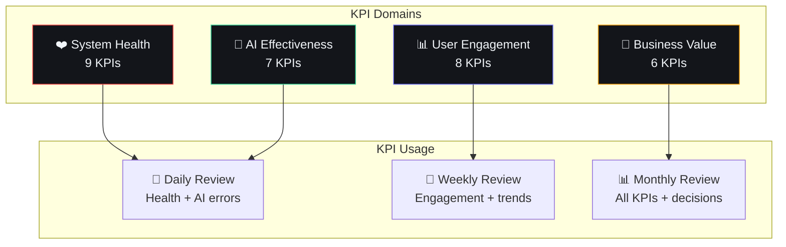

# Key Performance Indicators (KPIs)

## Document Control

| Field | Value |
|---|---|
| Document ID | OPS-KPI-012 |
| Version | 1.0.0 |
| Status | Approved |
| Date | 2026-07-10 |
| Classification | Internal |
| Owner | Developer |

---

## 1. Executive Summary

### Purpose
Define the Key Performance Indicators (KPIs) for Second Brain OS. KPIs measure system health, user engagement, AI effectiveness, and business value. They provide a quantitative framework for decision-making and prioritization.

### Scope
Covers four KPI domains: System Health (infrastructure reliability), User Engagement (product adoption), AI Effectiveness (agent performance), and Business Value (personal productivity impact).

---

## 2. KPI Framework



---

## 3. KPI Definitions

### 3.1 System Health KPIs

| ID | KPI | Definition | Formula | Target | Measurement |
|---|---|---|---|---|---|
| SYS-01 | API Uptime | % of time API responds successfully | `(total_time - downtime) / total_time * 100` | > 99.5% | Health check every 5 min |
| SYS-02 | API Latency P95 | 95th percentile response time | P95 of all API response times | < 500ms | Per-endpoint tracking |
| SYS-03 | Error Rate | % of requests returning 5xx | `5xx_count / total_requests * 100` | < 1% | Per-endpoint tracking |
| SYS-04 | DB Query P95 | 95th percentile query time | P95 of database queries | < 200ms | `pg_stat_statements` |
| SYS-05 | DB Connection Usage | % of available connections used | `active_connections / max_connections * 100` | < 80% | Supabase dashboard |
| SYS-06 | Memory Usage | % of available RAM | `used_memory / total_memory * 100` | < 80% | Railway metrics |
| SYS-07 | AI Provider Uptime | % of AI calls that succeed | `successful_calls / total_calls * 100` | > 95% | AI client logs |
| SYS-08 | Circuit Breaker Time | % of time CB is open | `open_duration / total_duration * 100` | < 1% | CB state tracking |
| SYS-09 | Scheduler Success | % of scheduled jobs that complete | `successful_jobs / total_jobs * 100` | > 99% | Scheduler logs |

### 3.2 User Engagement KPIs

| ID | KPI | Definition | Formula | Target | Measurement |
|---|---|---|---|---|---|
| ENG-01 | Daily Active User (DAU) | Unique user sessions per day | Count of distinct user IDs | 1 (single user) | `analytics_events` |
| ENG-02 | Session Length | Average time per session | `total_session_time / session_count` | > 10 min | Session tracking |
| ENG-03 | Module Adoption | % of modules used this week | `used_modules / total_modules * 100` | > 60% (16/27) | Feature usage logs |
| ENG-04 | Task Completion Rate | % of tasks completed on time | `completed_on_time / total_completed * 100` | > 70% | Tasks table |
| ENG-05 | Habit Streak Consistency | Avg streak length across all habits | `avg(streak_length)` | > 7 days | Habits table |
| ENG-06 | AI Feature Adoption | % of sessions using AI features | `sessions_with_ai / total_sessions * 100` | > 50% | Chat + agent logs |
| ENG-07 | Feature Retention | % of features used again within 7 days | `returned_users / first_time_users * 100` | > 60% | Event analytics |
| ENG-08 | Goal Progress Rate | % of goals making weekly progress | `goals_with_progress / total_active_goals * 100` | > 80% | Goals table |

### 3.3 AI Effectiveness KPIs

| ID | KPI | Definition | Formula | Target | Measurement |
|---|---|---|---|---|---|
| AI-01 | Response Accuracy | % of AI responses rated helpful | `helpful_ratings / total_ratings * 100` | > 80% | Feedback system |
| AI-02 | Generation Success | % of AI generations that succeed | `successful_generations / total_attempts * 100` | > 90% | AI client logs |
| AI-03 | Fallback Rate | % of requests using fallback algorithm | `fallback_count / total_requests * 100` | < 5% | AI trace logs |
| AI-04 | AI Response Time P95 | 95th percentile AI response time | P95 of AI generation times | < 10s | AI trace logs |
| AI-05 | Prompt Quality | % of prompts loading without errors | `valid_prompts / total_prompts * 100` | 100% | PromptLoader validation |
| AI-06 | Cache Hit Rate | % of AI responses served from cache | `cache_hits / total_requests * 100` | > 10% (future) | Cache metrics |
| AI-07 | Token Efficiency | Avg tokens per meaningful output | `output_tokens / meaningful_responses` | < 500 tokens | AI trace logs |

### 3.4 Business Value KPIs

| ID | KPI | Definition | Formula | Target | Measurement |
|---|---|---|---|---|---|
| VAL-01 | Weekly Time Saved | Estimated hours saved per week | `ai_tasks_automated * avg_manual_time` | > 3 hours | Task logs |
| VAL-02 | Idea Completion Rate | % of ideas that become projects | `ideas_to_projects / total_ideas * 100` | > 20% | Ideas/Projects tables |
| VAL-03 | Learning Progress | % of course learning goals advanced | `completed_units / total_units * 100` | > 25% monthly | Courses table |
| VAL-04 | Sleep Improvement | Change in sleep quality score | `avg(quality_score) over 30 days` | +10% over baseline | Sleep logs |
| VAL-05 | Income Efficiency | Avg hourly rate trend | `avg(income / hours) over 90 days` | Increasing | Income + Time tables |
| VAL-06 | Productivity Score | Composite score from multiple factors | Custom weighted formula | > 70/100 | Analytics composite |

---

## 4. Measurement & Collection

### 4.1 Data Sources

| KPI Group | Primary Source | Secondary Source | Collection Method |
|---|---|---|---|
| System Health | Railway Dashboard | Application logs | Manual check + scripts |
| User Engagement | Analytics events table | Supabase queries | SQL aggregation |
| AI Effectiveness | AI trace logs | Feedback table | Log parsing |
| Business Value | Multiple tables | Cross-module view | SQL join queries |

### 4.2 Collection Script

```python
# scripts/collect_kpis.py
"""Collect all KPIs and output as JSON."""
from datetime import datetime, timedelta
import json

def collect_system_health():
    return {
        "api_uptime": calculate_uptime(),
        "api_latency_p95": get_p95_latency(),
        "error_rate": get_error_rate(),
        "db_query_p95": get_db_p95(),
        "circuit_breaker_time": get_cb_percentage(),
    }

def collect_engagement():
    return {
        "dau": 1,  # Single user
        "session_length": get_avg_session_length(),
        "module_adoption": get_module_adoption(),
        "task_completion_rate": get_task_completion_rate(),
        "habit_streak_consistency": get_avg_streak(),
    }

def collect_ai_effectiveness():
    return {
        "response_accuracy": get_feedback_rating(),
        "generation_success": get_ai_success_rate(),
        "fallback_rate": get_fallback_rate(),
        "ai_response_p95": get_ai_p95(),
        "prompt_quality": 100,  # Validated in CI
    }

def collect_business_value():
    return {
        "time_saved_hours": estimate_time_saved(),
        "idea_completion_rate": get_idea_completion(),
        "learning_progress": get_course_progress(),
        "sleep_improvement": get_sleep_trend(),
        "income_efficiency": get_income_trend(),
    }

if __name__ == "__main__":
    kpis = {
        "timestamp": datetime.now().isoformat(),
        "system_health": collect_system_health(),
        "engagement": collect_engagement(),
        "ai_effectiveness": collect_ai_effectiveness(),
        "business_value": collect_business_value(),
    }
    
    with open("reports/kpis.json", "w") as f:
        json.dump(kpis, f, indent=2)
    
    print(json.dumps(kpis, indent=2))
```

---

## 5. KPI Review Cadence

| Frequency | KPIs Reviewed | Action |
|---|---|---|
| **Daily** | SYS-01 (Uptime), SYS-03 (Error Rate), AI-02 (Generation Success) | Quick check, no action if green |
| **Weekly** | ENG-01 through ENG-08, AI-01, AI-03, AI-04 | Weekly review document |
| **Monthly** | All 30 KPIs | Monthly health report, priority decisions |
| **Quarterly** | Trend analysis for all KPIs | Strategy adjustments, OKR alignment |

---

## 6. Alert Thresholds

| KPI | Warning Threshold | Critical Threshold | Action |
|---|---|---|---|
| SYS-01 API Uptime | < 99.5% | < 99% | Incident response |
| SYS-02 API Latency P95 | > 500ms | > 1000ms | Performance investigation |
| SYS-03 Error Rate | > 1% | > 5% | Bug fix priority |
| AI-02 Generation Success | < 90% | < 80% | AI provider investigation |
| AI-03 Fallback Rate | > 5% | > 20% | AI provider health check |
| ENG-04 Task Completion | < 60% | < 40% | Workflow analysis |
| ENG-05 Habit Streak | < 5 days | < 3 days | Habit design review |

---

## 7. KPI Dashboard

### 7.1 Text-Based Dashboard

```
┌─────────────────────────────────────────────────┐
│  📊 KPI Dashboard          Week 28, 2026        │
├────────────────┬────────────────────────────────┤
│ SYSTEM HEALTH  │ ✅ All green                    │
│ Uptime         │ 99.8% (✓ > 99.5%)              │
│ Latency P95    │ 120ms (✓ < 500ms)               │
│ Error Rate     │ 0.3% (✓ < 1%)                  │
├────────────────┼────────────────────────────────┤
│ ENGAGEMENT     │ ✅ On track                     │
│ Module Adoption│ 65% (17/27 modules)             │
│ Task Completion│ 72% (✓ > 70%)                  │
│ Habit Streak   │ 12 days (✓ > 7)                │
├────────────────┼────────────────────────────────┤
│ AI EFFECTIVENESS│ ⚠️ Needs attention             │
│ Fallback Rate  │ 8% (✗ > 5%)                    │
│ Response P95   │ 4.2s (✓ < 10s)                 │
│ Gen Success    │ 94% (✓ > 90%)                  │
├────────────────┼────────────────────────────────┤
│ BUSINESS VALUE │ 📈 Improving                    │
│ Time Saved     │ 4.2 hrs/week (✓ > 3)           │
│ Idea Completion│ 22% (✓ > 20%)                  │
└────────────────┴────────────────────────────────┘
```

---

## 8. Performance Targets

| Metric | Baseline (Month 1) | Target (Month 3) | Stretch (Month 6) |
|---|---|---|---|
| Task completion rate | 60% | 70% | 80% |
| Habit consistency | 5 days | 7 days | 14 days |
| AI fallback rate | 15% | 5% | 2% |
| Module adoption | 40% | 60% | 75% |
| Time saved/week | 2 hrs | 3 hrs | 5 hrs |

---

## 9. Edge Cases

| Edge Case | Handling |
|---|---|
| Single-user KPI baseline | All KPIs measured against self (baseline) |
| Zero-data for new modules | Excluded from adoption KPI until first use |
| Outlier day (sick, vacation) | Exclude from trend calculations |
| KPI collection failure | Show last known values with staleness indicator |
| Division by zero | Default to N/A marker, not 0 or ∞ |

---

## 10. Failure Scenarios

| Scenario | Impact | Mitigation |
|---|---|---|
| KPI collection script fails | No data for review period | Manual estimate, fix script |
| Data inconsistency across sources | Incorrect KPI values | Validate with cross-reference queries |
| Target consistently missed | Low morale or wrong targets | Review targets quarterly |
| Target always exceeded | Targets too easy | Ratchet targets up |

---

## 11. Risks

| Risk | Likelihood | Impact | Mitigation |
|---|---|---|---|
| KPI fatigue (too many metrics) | Medium | Medium | Focus on top 5-10 weekly |
| Vanity metrics (measuring what's easy) | Medium | Medium | Quarterly metric audit |
| Gaming metrics (AI for higher scores) | Low | Low | Automated validation |
| Single-user skew | High | Low | Baseline comparison, not benchmarks |

---

## 12. Related Documents

| Document | Relation |
|---|---|
| docs/operations/30_Analytics.md | Event tracking for KPIs |
| docs/operations/31_Observability.md | System health measurement |
| docs/operations/Dashboards.md | KPI dashboard design |
| docs/product/01_CurrentStateAudit.md | Baseline measurements |
| docs/product/02_PRD.md | Product requirements |

---

## 13. Appendices

### 13.1 KPI Refresh Schedule

```python
KPI_SCHEDULE = {
    "system_health": {
        "collection": "continuous",
        "aggregation": "every 5 minutes",
        "retention": "30 days",
    },
    "engagement": {
        "collection": "event-driven",
        "aggregation": "daily",
        "retention": "90 days",
    },
    "ai_effectiveness": {
        "collection": "per AI call",
        "aggregation": "daily",
        "retention": "90 days",
    },
    "business_value": {
        "collection": "daily",
        "aggregation": "weekly",
        "retention": "forever",
    },
}
```

### 13.2 KPI Review Template (Weekly)

```markdown
# Weekly KPI Review — Week [N]

## System Health: ✅ / ⚠️ / ❌
- Uptime: [N]%
- Top error: [description]

## Engagement: ✅ / ⚠️ / ❌
- Tasks completed: [N] ([N]% rate)
- Habits tracked: [N] ([N] day streak)

## AI Effectiveness: ✅ / ⚠️ / ❌
- Fallback rate: [N]%
- Slowest agent: [name]

## Business Value: ✅ / ⚠️ / ❌
- Time saved: [N] hrs
- Goals progressed: [N]

## Action Items
- [ ] Action 1
- [ ] Action 2
```
