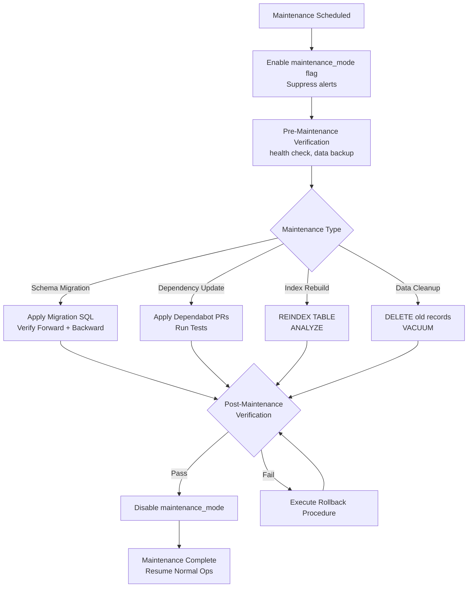
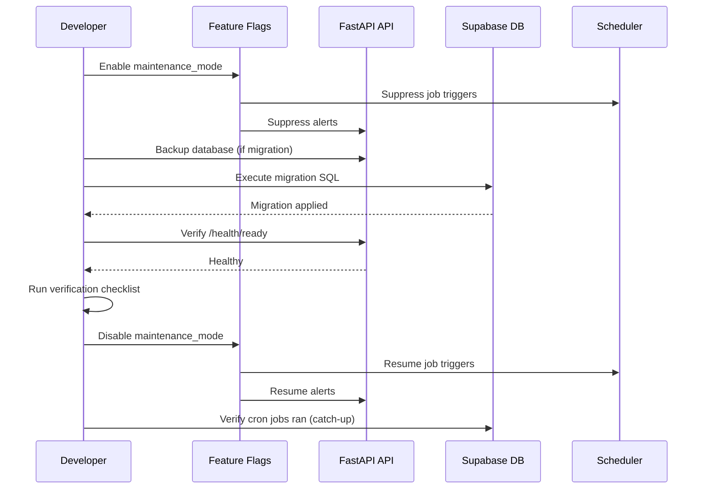
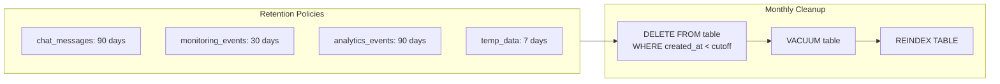

# Maintenance Procedures — Second Brain OS

## Document Control

| Field | Value |
|---|---|
| Document ID | OPS-MNT-007 |
| Version | 1.0.0 |
| Status | Approved |
| Date | 2026-07-10 |
| Classification | Internal |
| Owner | Developer |

---

## Table of Contents

- [1. Executive Summary](#1-executive-summary)
- [2. Purpose](#2-purpose)
- [3. Scope](#3-scope)
- [4. Business Context](#4-business-context)
- [5. Functional Specification](#5-functional-specification)
- [6. Non-Functional Requirements](#6-non-functional-requirements)
- [7. Architecture](#7-architecture)
- [8. Diagrams](#8-diagrams)
- [9. Data Models](#9-data-models)
- [10. APIs](#10-apis)
- [11. Security](#11-security)
- [12. Performance Targets](#12-performance-targets)
- [13. Edge Cases](#13-edge-cases)
- [14. Failure Scenarios](#14-failure-scenarios)
- [15. Risks & Mitigations](#15-risks--mitigations)
- [16. Acceptance Criteria](#16-acceptance-criteria)
- [17. Traceability](#17-traceability)
- [18. Implementation Notes](#18-implementation-notes)
- [19. Testing Strategy](#19-testing-strategy)
- [20. References](#20-references)

---

## 1. Executive Summary

Second Brain OS follows a defined maintenance schedule covering database schema migrations, dependency updates, index rebuilds, and data cleanup. Maintenance is performed during low-usage windows with the `system.maintenance_mode` feature flag enabled to suppress alerts. The maintenance philosophy favours small, frequent updates over large, infrequent changes, reducing the risk of regression and downtime.

---

## 2. Purpose

Structured maintenance procedures prevent data corruption, performance degradation, and security vulnerabilities. Regular maintenance ensures the database remains optimised, dependencies stay current, and the system operates reliably. Without a maintenance schedule, technical debt accumulates silently until it causes production incidents.

---

## 3. Scope

This document covers:

- Scheduled maintenance windows and notification
- Maintenance types: schema migrations, dependency updates, index rebuilds, data cleanup
- Execution procedure with pre- and post-maintenance verification
- Rollback plans for each maintenance type
- Post-maintenance verification checklist
- `system.maintenance_mode` feature flag usage

Out of scope: emergency patching, security hotfixes (covered in [Incident Response](./40_IncidentResponse.md)), infrastructure maintenance (handled by Vercel/Railway).

---

## 4. Business Context

As a single-developer project with personal productivity use, Second Brain OS has flexible maintenance windows. The developer is the sole user, so maintenance can be scheduled at convenience. However, the procedures are documented as if for a multi-user system to build operational maturity. As the project scales to more users, these procedures will be critical for maintaining trust and reliability.

---

## 5. Functional Specification

### 5.1 Maintenance Types

| Type | Frequency | Duration | Risk | Description |
|---|---|---|---|---|
| Schema migration | As needed (weekly avg) | < 30 min | Medium | Add/modify database tables, columns, indexes |
| Dependency update | Weekly (Monday) | < 15 min | Low | npm/pip/Docker updates via Dependabot |
| Index rebuild | Monthly | < 10 min | Low | Rebuild database indexes for query performance |
| Data cleanup | Monthly | < 15 min | Low | Apply retention policies; archive old data |
| Feature flag cleanup | Monthly | < 10 min | Low | Remove stale feature flags |
| Prompt review | Bi-weekly | < 30 min | Low | Review prompt performance; bump versions |
| Security review | Monthly | < 60 min | Medium | Scan dependencies; review vulnerabilities |

### 5.2 Maintenance Window

| Window | Day | Time | Notes |
|---|---|---|---|
| Primary | Monday | 09:00 - 10:00 UTC | After weekly review |
| Secondary | Wednesday | 14:00 - 15:00 UTC | Overflow/emergency |
| No-maintenance | Weekends | All day | Avoid unless critical |

### 5.3 Feature Flag: `system.maintenance_mode`

When enabled:
- Suppresses all alerts (including P0)
- Disables cron jobs (they will not fire)
- Returns 503 with `Retry-After` header from API (future)
- Shows maintenance banner in frontend (future)
- Auto-disables after configurable timeout (default: 2 hours)

To enable:

```bash
curl -X PUT https://api.secondbrain-os.com/api/v1/feature-flags/system.maintenance_mode \
  -H "Authorization: Bearer $TOKEN" \
  -d '{"enabled": true, "metadata": {"timeout_minutes": 120, "reason": "Schema migration"}}'
```

---

## 6. Non-Functional Requirements

| ID | Requirement | Target |
|---|---|---|
| MNT-NFR-001 | Maintenance window duration | < 60 minutes |
| MNT-NFR-002 | Notification lead time | 24 hours for scheduled, 0 for emergency |
| MNT-NFR-003 | Data loss during maintenance | Zero (all operations reversible) |
| MNT-NFR-004 | Rollback time | < 30 minutes |
| MNT-NFR-005 | Maintenance frequency | Max 2x per week |

---

## 7. Architecture



---

## 8. Diagrams

### 8.1 Maintenance Workflow



### 8.2 Data Retention Cleanup Flow



---

## 9. Data Models

### 9.1 Maintenance Log Entry

```python
class MaintenanceEntry(BaseModel):
    id: str
    type: str  # schema_migration, dependency_update, index_rebuild, data_cleanup
    status: str  # planned, in_progress, completed, rolled_back, failed
    started_at: datetime
    completed_at: Optional[datetime]
    reason: str
    details: str
    verification_results: list[str]
    rollback_required: bool = False
    maintenance_mode_enabled: bool = True
```

---

## 10. APIs

| Endpoint | Method | Purpose |
|---|---|---|
| `/api/v1/feature-flags/system.maintenance_mode` | GET/PUT | Enable/disable maintenance mode |
| `/api/v1/monitoring/maintenance/log` | GET | View maintenance history |

---

## 11. Security

- Maintenance mode flag requires admin privileges
- Database backup before migrations is mandatory
- Rollback procedures must be verified before executing forward migration
- All maintenance logged for audit trail
- No sensitive operations performed during maintenance (keys, tokens remain unchanged)

---

## 12. Performance Targets

| Metric | Target |
|---|---|
| Migration execution time | < 30 minutes |
| Dependency update time | < 15 minutes |
| Index rebuild time | < 10 minutes |
| Data cleanup time | < 15 minutes |
| Rollback execution time | < 30 minutes |

---

## 13. Edge Cases

| Edge Case | Handling |
|---|---|
| Migration fails mid-execution | Execute down migration; restore from backup |
| Dependency update breaks API | Revert package version; pin with exact version |
| Index rebuild locked by query | Terminate conflicting query; retry with `CONCURRENTLY` |
| Data cleanup deletes too many rows | Run with `LIMIT` first; verify row count; delete in batches |
| Maintenance timeout exceeded | Auto-disable maintenance_mode; log warning |

---

## 14. Failure Scenarios

| Scenario | Impact | Mitigation |
|---|---|---|
| Migration cannot be rolled back | Data inconsistency | Backup before every migration; test rollback on staging |
| Dependency introduces critical vulnerability | Security risk | Pin versions; review changelog before update |
| Maintenance mode fails to suppress alerts | False alarms | Manual fallback: disable alert rule temporarily |
| Concurrent maintenance operations | Race conditions | Enforce single maintenance operation at a time |

---

## 15. Risks & Mitigations

| Risk | Likelihood | Impact | Mitigation |
|---|---|---|---|
| Forgetting to disable maintenance mode | Low | Medium | Auto-disable after configurable timeout |
| Migration tested on staging but fails in production | Low | High | Same schema on staging and production |
| Dependency update introduces breaking change | Medium | Medium | Dependabot grouped PRs; review changelog |
| Data cleanup removes data still needed | Low | High | Soft-delete before hard-delete; backup before cleanup |

---

## 16. Acceptance Criteria

- [ ] Maintenance mode flag correctly suppresses alerts and cron jobs
- [ ] Schema migrations are reversible (forward + backward SQL)
- [ ] Dependency updates pass full test suite before deploy
- [ ] Index rebuilds complete within 10 minutes
- [ ] Data cleanup validates row count before and after
- [ ] Maintenance log records all operations with timestamps
- [ ] Rollback procedure is documented and tested before every migration

---

## 17. Traceability

| Requirement | Covered By | Verified By |
|---|---|---|
| MNT-NFR-001 | Maintenance time tracking | Post-maintenance log review |
| MNT-NFR-002 | Calendar scheduling | Calendar entry verification |
| MNT-NFR-003 | Backup before migration | Backup file existence check |
| MNT-NFR-004 | Rollback drill | Quarterly test |

---

## 18. Implementation Notes

### 18.1 Migration Execution

All database migrations follow this pattern:

```bash
# 1. Enable maintenance mode
curl -X PUT /api/v1/feature-flags/system.maintenance_mode \
  -d '{"enabled": true, "metadata": {"reason": "Add user_preferences table"}}'

# 2. Backup (if modifying data or complex schema)
pg_dump --db "$SUPABASE_DATABASE_URL" > "backup_$(date +%Y%m%d_%H%M%S).sql"

# 3. Apply migration
psql --db "$SUPABASE_DATABASE_URL" -f migrations/20260710_add_user_preferences.sql

# 4. Run verification
python scripts/validate_migrations.py

# 5. Run smoke tests
pytest tests/test_api_endpoints.py -k "user_preferences"

# 6. Disable maintenance mode
curl -X PUT /api/v1/feature-flags/system.maintenance_mode \
  -d '{"enabled": false}'
```

### 18.2 Post-Maintenance Verification Checklist

- [ ] Health check returns healthy: `curl https://api.../health/ready`
- [ ] All cron jobs ran since maintenance ended: check last_run timestamps
- [ ] No error spikes in Sentry
- [ ] Data integrity verified: spot-check 5 records in affected tables
- [ ] Feature flag `system.maintenance_mode` is disabled
- [ ] Migration SQL committed to `migrations/` directory
- [ ] Rollback SQL also committed (as `migrations/<name>_rollback.sql`)

### 18.3 Maintenance Calendar

Maintenance tasks are tracked in the project calendar at `docs/operations/Maintenance.md`. Each task has:
- Scheduled date and time
- Maintenance type
- Expected duration
- Risk level
- Pre-requisites

---

## 19. Testing Strategy

| Test Type | Scope | Location |
|---|---|---|
| Unit | Maintenance mode flag toggle | `tests/test_api_endpoints.py` |
| Integration | Migration forward + rollback | `tests/test_database_schemas.py` |
| Integration | Data cleanup SQL | `tests/test_scripts.py` |
| Manual | Index rebuild | `ANALYZE; EXPLAIN` query plan comparison |
| Manual | Full maintenance drill | Quarterly execution of complete procedure |

---

## 20. References

| Reference | Description |
|---|---|
| [Playbooks](./Playbooks.md) | Operational playbooks (DB restore, migration) |
| [Runbooks](./39_Runbooks.md) | Detailed runbooks for maintenance scenarios |
| [Change Management](../governance/02_ChangeManagement.md) | Change control process |
| [Data Retention](../security/25_DataRetentionPolicy.md) | Retention policies applied during cleanup |
| [Backup Strategy](../engineering/BackupStrategy.md) | Backup procedures for pre-maintenance |
| [Technical Debt](./50_TechnicalDebt.md) | Tech debt prioritised in maintenance windows |

---

## Revision History

| Version | Date | Author | Changes |
|---|---|---|---|
| 1.0.0 | 2026-07-10 | Developer | Initial maintenance procedures document |
