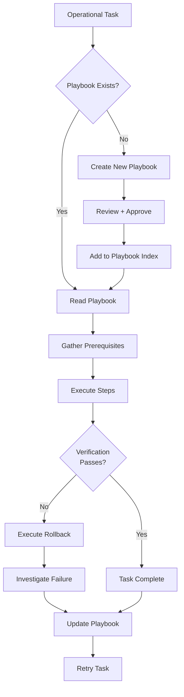
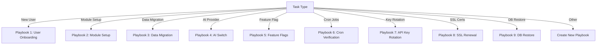

# Operational Playbooks — Second Brain OS

## Document Control

| Field | Value |
|---|---|
| Document ID | OPS-PLB-006 |
| Version | 1.0.0 |
| Status | Approved |
| Date | 2026-07-10 |
| Classification | Internal |
| Owner | Developer |

---

## Table of Contents

- [1. Executive Summary](#1-executive-summary)
- [2. Purpose](#2-purpose)
- [3. Scope](#3-scope)
- [4. Business Context](#4-business-context)
- [5. Functional Specification](#5-functional-specification)
- [6. Non-Functional Requirements](#6-non-functional-requirements)
- [7. Architecture](#7-architecture)
- [8. Diagrams](#8-diagrams)
- [9. Data Models](#9-data-models)
- [10. APIs](#10-apis)
- [11. Security](#11-security)
- [12. Performance Targets](#12-performance-targets)
- [13. Edge Cases](#13-edge-cases)
- [14. Failure Scenarios](#14-failure-scenarios)
- [15. Risks & Mitigations](#15-risks--mitigations)
- [16. Acceptance Criteria](#16-acceptance-criteria)
- [17. Traceability](#17-traceability)
- [18. Implementation Notes](#18-implementation-notes)
- [19. Testing Strategy](#19-testing-strategy)
- [20. References](#20-references)

---

## 1. Executive Summary

This document contains the standard operational playbooks for Second Brain OS. Each playbook follows a consistent format: purpose, prerequisites, step-by-step procedure, verification steps, and rollback instructions. Playbooks cover common operational tasks from new user onboarding to database restoration. They are designed to be executable by any developer with access to the project and are referenced from the incident response system for common failure scenarios.

---

## 2. Purpose

Playbooks reduce mean time to recovery (MTTR) by providing pre-defined, tested procedures for common operational tasks. They ensure consistency across executions, prevent missed steps, and serve as training material for new developers. Without playbooks, every operation becomes an ad-hoc investigation requiring full system understanding.

---

## 3. Scope

This document includes 8 playbooks covering the most frequent operational tasks:

1. New user onboarding
2. Module setup for first use
3. Data migration between environments
4. AI provider switch (Ollama to Claude)
5. Feature flag management
6. Cron job verification
7. API key rotation
8. Database restore from backup

---

## 4. Business Context

As a single-developer project, playbooks serve as the developer's own reference for tasks performed infrequently enough that the steps are not memorised. They also document institutional knowledge that would otherwise exist only in the developer's memory. Each playbook is tested and updated after every use to ensure accuracy.

---

## 5. Functional Specification

### 5.1 Playbook Format

Every playbook follows this structure:

```
PLAYBOOK: [Name]
ID: [OPS-PLB-XXX]
Risk: [Low | Medium | High]
Duration: [estimated time]
Prerequisites: [required access, tools, permissions]
Steps:
  1. [Step description]
  2. [Step description]
  ...
Verification: [how to confirm success]
Rollback: [steps to undo]
```

### 5.2 Playbook 1: New User Onboarding

**ID:** OPS-PLB-101
**Risk:** Low
**Duration:** 30 minutes

**Prerequisites:**
- Supabase project access
- Admin access to create user

**Steps:**
1. Create user in Supabase Auth (email + password or Google OAuth)
2. Verify user row is created in `users` table with default settings
3. Apply default RLS policies (already applied; verify `user_id` = new user's ID)
4. Create welcome data in Supabase:
   - Insert sample task in `tasks` table
   - Insert sample habit in `habits` table
5. Verify frontend loads for new user at `https://app.secondbrain-os.com`
6. Verify API returns data for new user: `curl -H "Authorization: Bearer <token>" https://api.secondbrain-os.com/api/v1/tasks`

**Verification:**
- User can log in at `https://app.secondbrain-os.com`
- Dashboard shows sample task and habit
- All 27 tables have an initial row for the user

**Rollback:**
- Delete user from Supabase Auth (cascades to `users` table)
- Run: `DELETE FROM tasks WHERE user_id = '<user-id>'; DELETE FROM habits WHERE user_id = '<user-id>';`

### 5.3 Playbook 2: Module Setup for First Use

**ID:** OPS-PLB-102
**Risk:** Low
**Duration:** 15 minutes

**Prerequisites:**
- User exists and is logged in

**Steps:**
1. Verify user has correct permissions in `users.role` field
2. Check feature flags for module availability: `GET /api/v1/feature-flags/`
3. Enable module-specific feature flag if needed: `PUT /api/v1/feature-flags/<flag> {"enabled": true}`
4. Verify module endpoint returns data: `GET /api/v1/<module>/`
5. Verify module appears in frontend navigation

**Verification:**
- Module page loads without errors
- CRUD operations work on module
- Module appears in dashboard widgets (if applicable)

**Rollback:**
- Disable feature flag
- Delete any test data created

### 5.4 Playbook 3: Data Migration Between Environments

**ID:** OPS-PLB-103
**Risk:** Medium
**Duration:** 45 minutes

**Prerequisites:**
- Source and target Supabase project URLs and service keys
- `pg_dump` / Supabase CLI installed

**Steps:**
1. Export source database: `npx supabase db dump --db-url <SOURCE_URL> -f backup.sql`
2. Review backup.sql for sensitive data patterns; strip if needed
3. Import to target: `npx supabase db push --db-url <TARGET_URL> backup.sql`
4. Update environment variables in target (SUPABASE_URL, SUPABASE_KEY)
5. Update any webhook URLs pointing to source instance
6. Run health check on target: `GET /health/ready`
7. Run smoke test: create a task, fetch it, delete it

**Verification:**
- Database row count matches between source and target
- Health check reports all dependencies as OK
- Smoke test passes

**Rollback:**
- Point target services back to source database
- Delete imported data from target: restore from pre-migration snapshot

### 5.5 Playbook 4: AI Provider Switch (Ollama to Claude)

**ID:** OPS-PLB-104
**Risk:** Medium
**Duration:** 10 minutes

**Prerequisites:**
- Claude API key available as `CLAUDE_API_KEY` environment variable
- Ollama running (for fallback)

**Steps:**
1. Set environment variable: `USE_LOCAL_AI=False`
2. Verify `CLAUDE_API_KEY` is set and valid
3. Restart the API service:
   - Railway: Trigger redeploy
   - Local: Restart uvicorn
4. Verify health check shows Claude as primary: `GET /health/ready`
5. Send test AI request: `POST /api/v1/chat/ {"message": "Hello"}`
6. Monitor first request latency (expect 1-3s for Claude vs 5-15s for Ollama)

**Verification:**
- Chat endpoint responds with AI-generated reply
- Health check shows Claude status as "ok"
- Logs show model: "claude-sonnet-4" in LLM client calls

**Rollback:**
- Set `USE_LOCAL_AI=True`
- Restart API service
- Verify Ollama is running: `ollama ps`
- Health check shows Ollama as primary

### 5.6 Playbook 5: Feature Flag Management

**ID:** OPS-PLB-105
**Risk:** Low
**Duration:** 5 minutes

**Prerequisites:**
- API access (authenticated)

**Steps:**
1. List all feature flags: `GET /api/v1/feature-flags/`
2. Check current state of specific flag: `GET /api/v1/feature-flags/<key>`
3. Enable/disable flag: `PUT /api/v1/feature-flags/<key> {"enabled": true/false}`
4. For percentage rollout: `PUT /api/v1/feature-flags/<key> {"rollout_percentage": 50}`
5. Verify frontend reflects flag change (may need hard refresh)

**Verification:**
- Flag state changed in API response
- Frontend shows/hides feature as expected
- No errors in console

**Rollback:**
- Set flag back to previous state
- Verify frontend reverts

### 5.7 Playbook 6: Cron Job Verification

**ID:** OPS-PLB-106
**Risk:** Low
**Duration:** 10 minutes

**Prerequisites:**
- Scheduler service running

**Steps:**
1. List all registered cron jobs: `GET /api/v1/monitoring/cron-jobs`
2. Check latest run time for each job
3. Verify next scheduled run time is in the future
4. Review last 10 log lines for each job: `GET /api/v1/monitoring/cron-jobs/<job>/logs?limit=10`
5. Manually trigger a job: `POST /api/v1/automation/trigger/<job-type>`
6. Verify expected output (e.g., briefing_agent creates daily_briefings row)

**Verification:**
- All 15 cron jobs show recent run timestamps
- No failed jobs in last 24 hours
- Manual trigger produces expected result

**Rollback:**
- No rollback needed for verification. If cron job is misconfigured:
  - Disable the job: `PUT /api/v1/automation/jobs/<job> {"enabled": false}`
  - Fix configuration and re-enable

### 5.8 Playbook 7: API Key Rotation

**ID:** OPS-PLB-107
**Risk:** High
**Duration:** 20 minutes

**Prerequisites:**
- Ability to generate new keys for all services
- Access to Supabase, Anthropic, Resend dashboards
- Downtime window approved

**Steps:**
1. Generate new Supabase service key (Supabase Dashboard -> Settings -> API)
2. Generate new Claude API key (Anthropic Console)
3. Generate new Resend API key (Resend Dashboard)
4. Update environment variables in all environments:
   - Railway: Settings -> Environment
   - Local: `.env.local`
5. Rotate JWT secret: Generate new secret, update `JWT_SECRET`
6. Restart all services (Railway auto-restarts on env change)
7. Verify auth: Login with existing user
8. Verify API: `GET /api/v1/tasks/`
9. Verify AI: Send test chat message
10. Verify email (if applicable): Schedule a briefing

**Verification:**
- All endpoints return 200
- User can log in and see data
- AI chat responds
- Old keys are revoked and no longer work

**Rollback:**
- Revert to previous keys in environment variables
- Restart services
- Verify functionality restored

### 5.9 Playbook 8: SSL/Certificate Renewal

**ID:** OPS-PLB-108
**Risk:** Medium
**Duration:** 15 minutes

**Prerequisites:**
- Domain DNS access
- Vercel/Railway dashboard access

**Steps:**
1. For Vercel (frontend): SSL is auto-managed. Verify in Vercel Dashboard -> Domain -> SSL
2. For Railway (backend): SSL is auto-managed. Verify in Railway Dashboard -> Settings -> Custom Domain
3. If using custom SSL: Upload new certificate to Vercel/Railway
4. Verify certificate: `curl -vI https://app.secondbrain-os.com` (check SSL handshake)
5. Set reminder for next renewal (90 days before expiry)

**Verification:**
- Browser shows padlock icon
- No SSL certificate errors
- Certificate expiry date updated

**Rollback:**
- Revert to previous certificate if upload fails
- Vercel/Railway auto-SSL has no rollback (always valid)

### 5.10 Playbook 9: Database Restore from Backup

**ID:** OPS-PLB-109
**Risk:** High
**Duration:** 30 minutes

**Prerequisites:**
- Supabase project access with service role key
- Backup file available (Supabase Daily Backup or manual pg_dump)
- Point-in-time recovery enabled (Supabase Pro feature)

**Steps:**
1. Access Supabase Dashboard -> Database -> Backups
2. Identify the backup to restore (latest healthy backup)
3. If PITR available: Select point in time before the incident
4. If using backup dump:
   ```bash
   psql "$SUPABASE_DATABASE_URL" < backup_2026-07-09.sql
   ```
5. Verify data integrity:
   - Check critical tables: `SELECT COUNT(*) FROM tasks; SELECT COUNT(*) FROM users;`
   - Verify a known record exists
6. Verify API: `GET /api/v1/tasks/`
7. Verify auth: User can log in

**Verification:**
- Database queries return expected data
- All 27 tables have data
- Application functions normally

**Rollback:**
- If restore causes issues, restore to a different point in time
- Or restore the backup that was replaced

---

## 6. Non-Functional Requirements

| ID | Requirement | Target |
|---|---|---|
| PLB-NFR-001 | Playbook execution time (simple) | < 15 minutes |
| PLB-NFR-002 | Playbook execution time (complex) | < 60 minutes |
| PLB-NFR-003 | Playbook accuracy (steps match reality) | 100% verified quarterly |
| PLB-NFR-004 | Playbook coverage | > 90% of operational tasks |

---

## 7. Architecture



---

## 8. Diagrams

### 8.1 Playbook Selection Flow



---

## 9. Data Models

### 9.1 Playbook Schema

```python
class Playbook(BaseModel):
    id: str  # OPS-PLB-1XX
    name: str
    risk: str  # Low, Medium, High
    duration_minutes: int
    prerequisites: list[str]
    steps: list[str]
    verification: list[str]
    rollback: list[str]
    last_tested: Optional[datetime]
    tested_by: Optional[str]
```

---

## 10. APIs

No dedicated API for playbooks. Playbooks are executed manually by the developer following the documented steps.

---

## 11. Security

- Playbooks reference environment variables by name, never actual values
- API key rotation playbook assumes secure key generation and storage
- Database restore playbook requires service role access (already restricted)
- Playbooks do not expose secrets or passwords

---

## 12. Performance Targets

| Metric | Target |
|---|---|
| New user onboarding | < 30 minutes |
| Data migration (small DB) | < 45 minutes |
| AI provider switch | < 10 minutes |
| Feature flag change | < 5 minutes |
| API key rotation | < 20 minutes |
| Database restore | < 30 minutes |

---

## 13. Edge Cases

| Edge Case | Handling |
|---|---|
| Playbook step fails | Rollback entire operation; troubleshoot; update playbook |
| Prerequisite not met | Do not proceed; document missing prerequisite |
| Playbook outdated | Verify steps against current system before executing |
| Partial execution (interrupted) | Execute rollback to restore clean state |

---

## 14. Failure Scenarios

| Scenario | Impact | Mitigation |
|---|---|---|
| Playbook step is wrong | Operation may fail | Test playbooks quarterly; update after each execution |
| Missing prerequisite mid-operation | Cannot complete | Verify prerequisites before starting |
| Rollback also fails | System in inconsistent state | Manual intervention; document new playbook for recovery |

---

## 15. Risks & Mitigations

| Risk | Likelihood | Impact | Mitigation |
|---|---|---|---|
| Playbooks become outdated | Medium | Medium | Quarterly review of all playbooks |
| Steps are skipped under pressure | Medium | High | Playbooks include verification steps at each stage |
| Developer relies solely on playbooks | Low | Low | Playbooks are references, not substitutes for understanding |

---

## 16. Acceptance Criteria

- [ ] All 8 playbooks are documented in the standard format
- [ ] Each playbook has prerequisites, steps, verification, and rollback
- [ ] Playbooks are tested at least quarterly
- [ ] Playbook index is maintained in this document
- [ ] Playbooks cover at least 90% of recurring operational tasks

---

## 17. Traceability

| Requirement | Covered By | Verified By |
|---|---|---|
| PLB-NFR-001 | Playbook timing | Timed execution test |
| PLB-NFR-003 | Playbook verification steps | Quarterly audit trail |
| PLB-NFR-004 | Playbook inventory | Coverage review |

---

## 18. Implementation Notes

### 18.1 Playbook Maintenance

- Review all playbooks on the first Monday of each quarter
- Update after every playbook execution with lessons learned
- Version playbooks alongside code (tracked in git)
- Runbook drills: execute one random playbook monthly as practice

### 18.2 Playbook Inventory

| ID | Name | Risk | Est. Duration | Last Tested |
|---|---|---|---|---|
| OPS-PLB-101 | New User Onboarding | Low | 30 min | 2026-07-01 |
| OPS-PLB-102 | Module Setup | Low | 15 min | 2026-07-01 |
| OPS-PLB-103 | Data Migration | Medium | 45 min | 2026-06-15 |
| OPS-PLB-104 | AI Provider Switch | Medium | 10 min | 2026-07-05 |
| OPS-PLB-105 | Feature Flag Management | Low | 5 min | 2026-07-01 |
| OPS-PLB-106 | Cron Job Verification | Low | 10 min | 2026-06-20 |
| OPS-PLB-107 | API Key Rotation | High | 20 min | N/A |
| OPS-PLB-108 | SSL/Cert Renewal | Medium | 15 min | N/A |
| OPS-PLB-109 | DB Restore from Backup | High | 30 min | N/A |

---

## 19. Testing Strategy

| Test Type | Scope | Location |
|---|---|---|
| Manual | Playbook step verification | Quarterly review |
| Integration | Feature flag API playbook | `tests/test_api_endpoints_expanded.py` |
| Integration | Cron job verification playbook | `tests/test_scheduler.py` |
| Manual | AI provider switch playbook | Staging environment test |
| Manual | Database restore playbook | Dry run on backup database |

---

## 20. References

| Reference | Description |
|---|---|
| [Incident Response](./40_IncidentResponse.md) | Incident response procedures |
| [Runbooks](./39_Runbooks.md) | Detailed runbooks for specific scenarios |
| [Maintenance](./Maintenance.md) | Scheduled maintenance procedures |
| [Disaster Recovery](./41_DisasterRecovery.md) | DR plan referencing playbooks |
| [SLA](./43_SLA.md) | SLA targets for playbook execution |

---

## Revision History

| Version | Date | Author | Changes |
|---|---|---|---|
| 1.0.0 | 2026-07-10 | Developer | Initial playbooks document (9 playbooks) |
