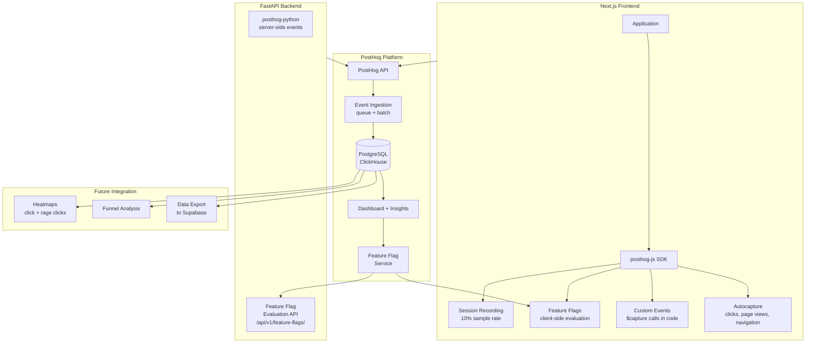
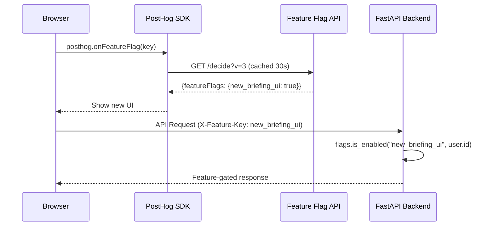
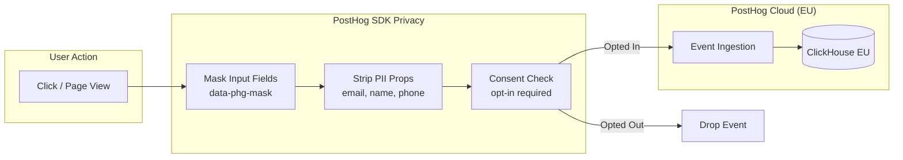

# PostHog Product Analytics — Second Brain OS

## Document Control

| Field | Value |
|---|---|
| Document ID | OPS-PST-005 |
| Version | 1.0.0 |
| Status | Draft |
| Date | 2026-07-10 |
| Classification | Internal |
| Owner | Developer |

---

## Table of Contents

- [1. Executive Summary](#1-executive-summary)
- [2. Purpose](#2-purpose)
- [3. Scope](#3-scope)
- [4. Business Context](#4-business-context)
- [5. Functional Specification](#5-functional-specification)
- [6. Non-Functional Requirements](#6-non-functional-requirements)
- [7. Architecture](#7-architecture)
- [8. Diagrams](#8-diagrams)
- [9. Data Models](#9-data-models)
- [10. APIs](#10-apis)
- [11. Security](#11-security)
- [12. Performance Targets](#12-performance-targets)
- [13. Edge Cases](#13-edge-cases)
- [14. Failure Scenarios](#14-failure-scenarios)
- [15. Risks & Mitigations](#15-risks--mitigations)
- [16. Acceptance Criteria](#16-acceptance-criteria)
- [17. Traceability](#17-traceability)
- [18. Implementation Notes](#18-implementation-notes)
- [19. Testing Strategy](#19-testing-strategy)
- [20. References](#20-references)

---

## 1. Executive Summary

PostHog is the planned product analytics platform for Second Brain OS, targeted for implementation in Q4 2026. PostHog provides event tracking, session recording, feature flags, heatmaps, and funnel analysis in a single platform with both self-hosted and cloud options. Its open-source core and privacy-first approach align with Second Brain OS's data philosophy. Currently, analytics are collected via a custom first-party event system (see [Analytics](./30_Analytics.md)), and PostHog will replace or supplement this as the user base grows. **This document describes the planned/ target state, not current implementation.**

---

## 2. Purpose

PostHog will provide product and engineering teams with quantitative insight into user behaviour without third-party data sharing. It answers questions like: Which features do users engage with most? Where do users drop off in key flows? Which modules have the highest retention? What is the impact of new feature releases? Feature flags enable gradual rollouts and A/B testing with minimal developer overhead.

---

## 3. Scope

This document covers the planned PostHog implementation including:

- Self-hosted vs cloud deployment decision
- Event autocapture and custom event setup
- Page view tracking and session recording
- Feature flag integration for gradual rollouts
- User identification and group analytics
- Data privacy and GDPR compliance
- Migration path from current custom analytics

Out of scope: migration of historical analytics data, third-party analytics connectors, billing analytics.

---

## 4. Business Context

PostHog is chosen for its developer-friendly experience, generous free tier (cloud: 1 million events/month), and open-source core. The self-hosted option (on Railway or a small VPS) gives full data control. The decision between self-hosted and cloud will be made based on user count at implementation time. For fewer than 100 monthly active users, the cloud free tier is appropriate; beyond that, self-hosted provides cost benefits.

---

## 5. Functional Specification

### 5.1 Event Tracking

| Event Type | Method | Properties |
|---|---|---|
| Page views | Autocapture | URL, referrer, screen size, user agent |
| Module interaction | Custom `$capture` | module_name, action (view, create, edit, delete) |
| AI interaction | Custom `$capture` | agent_name, tokens_used, latency_ms |
| Feature usage | Custom `$capture` | feature_name, action, context |
| Error events | Autocapture + custom | error_type, endpoint, status_code |

### 5.2 Feature Flags

PostHog feature flags will be integrated via the `/api/v1/feature-flags/` API:

```typescript
interface PostHogFeatureFlag {
  key: string
  enabled: boolean
  variants?: Record<string, { rolloutPercentage: number }>
  filters?: {
    groups: Array<{
      properties: Array<{ key: string; value: string; operator: string }>
      rollout_percentage: number
    }>
  }
}
```

### 5.3 Session Recording

- Sample rate: 10% of all sessions (configurable)
- Recording triggers: page navigation, clicks, mouse movements, form inputs
- Privacy: auto-mask all input fields; manual masking for sensitive elements via `data-phg-mask` attribute
- Duration: max 4 hours per recording; stored 30 days

### 5.4 User Identification

```typescript
import posthog from 'posthog-js'

// Identify user after login
posthog.identify(user.id, {
  email: hashEmail(user.email),  // hashed for privacy
  plan: 'free',
  signup_date: user.created_at,
})

// Group for multi-tenant (future)
posthog.group('instance', instanceId, { name: instanceName })
```

---

## 6. Non-Functional Requirements

| ID | Requirement | Target |
|---|---|---|
| PST-NFR-001 | PostHog JS bundle impact | < 20KB gzip |
| PST-NFR-002 | Event submission latency | < 100ms (async) |
| PST-NFR-003 | Monthly event quota (cloud) | < 1,000,000 (free tier) |
| PST-NFR-004 | Session recording storage | 30 days |
| PST-NFR-005 | Feature flag evaluation latency | < 50ms |
| PST-NFR-006 | Data residency | EU (cloud) or self-hosted |

---

## 7. Architecture



---

## 8. Diagrams

### 8.1 Feature Flag Evaluation Flow



### 8.2 Data Privacy Flow



---

## 9. Data Models

### 9.1 PostHog Event Schema

```typescript
interface PostHogEvent {
  event: string           // e.g., "task_created", "$pageview"
  properties: {
    $current_url: string
    $browser: string
    $os: string
    module?: string
    action?: string
    distinct_id: string   // hashed user ID
    timestamp: string     // ISO 8601
  }
  user_id?: string        // identified user
  timestamp: string
}
```

---

## 10. APIs

| Endpoint | Description | Integration |
|---|---|---|
| `POST /decide/?v=3` | Feature flag evaluation | posthog-js auto |
| `POST /capture/` | Event ingestion | posthog-js / posthog-python |
| `POST /identify/` | User identification | posthog-js / posthog-python |
| `GET /api/v1/feature-flags/` | Server-side flag evaluation | FastAPI (existing) |
| `POST /api/v1/analytics/events` | Existing custom analytics (migration path) | FastAPI (existing) |

---

## 11. Security

- All PostHog data transmitted over HTTPS/TLS
- PostHog cloud hosted in EU region (GDPR compliant)
- PII fields auto-masked in session recordings
- Email addresses hashed before sending to PostHog
- Opt-in consent required before PostHog loads
- Data retention policy: 90 days raw events, indefinite aggregates
- Self-hosted option available for full data sovereignty

---

## 12. Performance Targets

| Metric | Target |
|---|---|
| PostHog JS load time | < 100ms (async deferred) |
| Bundle size impact | < 20KB gzip |
| Event submission latency | < 100ms |
| Feature flag evaluation (client) | < 50ms |
| Feature flag evaluation (server) | < 20ms |
| Session recording performance impact | < 5% CPU usage during recording |

---

## 13. Edge Cases

| Edge Case | Handling |
|---|---|
| Ad blocker blocks PostHog | Graceful degradation: no analytics, no feature flags (default to enabled) |
| PostHog service unavailable | Feature flags default to `enabled=false`; events buffered locally |
| User clears cookies | New `distinct_id` generated; user re-identified on login |
| EU data residency requirement | Configure PostHog cloud for EU region or self-host |
| High traffic spike ($1M+ events) | PostHog cloud may require paid upgrade; self-hosted can scale vertically |

---

## 14. Failure Scenarios

| Scenario | Impact | Mitigation |
|---|---|---|
| PostHog ingest API down | Analytics data lost | Buffer events in localStorage; retry on reconnect |
| Feature flag service unavailable | Flags default to false | Fallback to hardcoded defaults in code |
| Session recording storage full | Old recordings dropped | 30-day TTL; increase storage if needed |
| Multiple rapid identify calls | Identity merge conflicts | Use `posthog.alias()` for identity resolution |

---

## 15. Risks & Mitigations

| Risk | Likelihood | Impact | Mitigation |
|---|---|---|---|
| PostHog sunset or pricing change | Low | Medium | Open-source core ensures self-hosting option |
| Privacy compliance violation | Low | High | All PII hashed; opt-in consent; data masking |
| Feature flag complexity slows development | Medium | Low | Simple boolean flags initially; graduate to multivariate |
| Migration from custom analytics is disruptive | Medium | Medium | Run both systems in parallel for one release cycle |

---

## 16. Acceptance Criteria

- [ ] PostHog SDK loads on all pages (with user consent)
- [ ] Custom events fire for task creation, habit logging, AI interactions
- [ ] Session recording captures 10% of sessions with masked inputs
- [ ] Feature flags created in PostHog are evaluated on frontend and backend
- [ ] User identification works across sessions (login/logout)
- [ ] Data privacy: all PII is hashed or masked
- [ ] PostHog free tier quota is not exceeded in testing

---

## 17. Traceability

| Requirement | Covered By | Verified By |
|---|---|---|
| PST-NFR-001 | Bundle size audit | Lighthouse CI |
| PST-NFR-002 | PostHog ingest latency | PostHog dashboard |
| PST-NFR-003 | Usage dashboard | Monthly quota check |
| PST-NFR-005 | Feature flag evaluation test | Integration test |

---

## 18. Implementation Notes

### 18.1 Implementation Priority

| Priority | Feature | Effort | Dependencies |
|---|---|---|---|
| P1 | Event autocapture + page views | 2 days | PostHog account creation |
| P1 | Custom event tracking in key modules | 3 days | Event taxonomy document |
| P2 | Feature flag integration | 2 days | Existing feature-flag API |
| P2 | User identification | 1 day | Auth system integration |
| P3 | Session recording | 1 day | Privacy compliance review |
| P3 | Dashboard + insights setup | 2 days | Event data accumulated |

### 18.2 Migration Path from Custom Analytics

| Phase | Duration | Description |
|---|---|---|
| Phase 1: Parallel run | 2 weeks | Both custom analytics + PostHog fire simultaneously |
| Phase 2: Validation | 1 week | Compare event counts; validate data quality |
| Phase 3: Cutover | 1 release cycle | Disable custom analytics; PostHog is primary |
| Phase 4: Cleanup | 1 week | Remove custom analytics code and Supabase table |

---

## 19. Testing Strategy

| Test Type | Scope | Location |
|---|---|---|
| Unit | Feature flag evaluation (fallback) | `tests/test_feature_flags.py` |
| Integration | PostHog SDK initialization | `apps/web/__tests__/analytics.test.ts` |
| Integration | Custom event firing | Manual with PostHog live events view |
| E2E | Full event flow from click to PostHog | Manual verification on staging |
| Security | PII masking in session recordings | Review sample recordings |

---

## 20. References

| Reference | Description |
|---|---|
| [Analytics](./30_Analytics.md) | Current custom analytics implementation |
| [Events](./Events.md) | Event taxonomy and tracking specification |
| [Feature Flags](../engineering/FeatureFlags.md) | Feature flag system architecture |
| [Data Privacy](../security/46_DataPrivacy.md) | Data privacy and GDPR compliance |
| [Dashboards](./Dashboards.md) | Dashboards powered by analytics data |
| [PostHog Docs](https://posthog.com/docs) | Official PostHog documentation |

---

## Revision History

| Version | Date | Author | Changes |
|---|---|---|---|
| 1.0.0 | 2026-07-10 | Developer | Initial PostHog plan (future/planned) |
