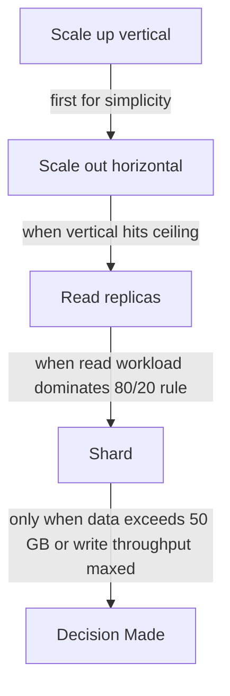
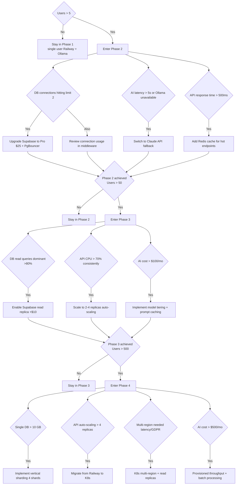

# Scaling Plan — Second Brain OS

## Document Control

| Field | Value |
|---|---|
| **Document ID** | OPS-SCALE-001 |
| **Version** | 1.0 |
| **Status** | Draft |
| **Author** | ARIA OS Engineering |
| **Last Updated** | 2026-06-11 |
| **Approval** | Pending |
| **Classification** | Internal — Infrastructure |

---

## 1. Executive Summary

Second Brain OS is currently a single-user system deployed on a single Railway instance with a free-tier Supabase database. As the product evolves toward multi-user SaaS, the architecture must scale across compute, database, AI inference, and frontend delivery without degradation in performance or excessive cost.

**Purpose:** Define a phased scaling strategy from current single-user (~100 req/day) to production-scale multi-user (1K+ users), with cost projections, decision criteria, and implementation guidance for each phase.

**Scope:** FastAPI backend (Python), Next.js 14 frontend (React), Supabase PostgreSQL, AI inference (Ollama → Claude API), Redis caching, file storage, and deployment infrastructure.

**Guiding Principles:**
1. **Scale only when needed** — optimize before adding nodes
2. **Cost-aware scaling** — each phase must fit within the ARIA OS budget (student project — prioritize free tiers and minimal paid services)
3. **Data integrity first** — scaling must never risk data loss
4. **Observability-driven** — scale decisions based on metrics, not intuition

---

## 2. Current Scale

| Metric | Current Value |
|---|---|
| **Users** | 1 (single user) |
| **API requests/day** | ~100 |
| **Database** | Supabase free tier (500 MB, 2 concurrent connections) |
| **Database size** | ~10 MB |
| **Compute** | 1 Railway instance (512 MB RAM, 1 vCPU shared) |
| **Frontend** | Vercel Hobby (single region, no CDN) |
| **AI inference** | Ollama (local, GPU on dev machine) |
| **Caching** | None |
| **File storage** | Local filesystem (`uploads/`) |
| **Uptime SLA** | None (development only) |
| **Monthly cost** | ~$5 (Railway + Supabase free tier + Vercel Hobby) |

### Current Bottlenecks

| Bottleneck | Impact | Solution in Current Phase |
|---|---|---|
| Single Railway instance | No redundancy, manual restart on crash | Acceptable during development |
| No connection pooling | Max 2 concurrent DB connections | Acceptable for single user |
| Ollama local only | AI unavailable when dev machine offline | Fallback to basic local responses |
| No caching | Every request hits DB directly | Acceptable at current scale |
| Local file storage | Files lost on Railway restart | Add basic S3-compatible storage |

---

## 3. Scaling Dimensions

Second Brain OS scales across six dimensions:

| Dimension | Metric | Current | Target (Phase 4) |
|---|---|---|---|
| **Users** | Active accounts | 1 | 1,000+ |
| **Requests** | API req/s peak | ~0.01 | ~50 |
| **Data** | DB size | 10 MB | 50 GB |
| **AI throughput** | LLM calls/day | ~20 | ~5,000 |
| **Storage** | File uploads | ~0 | 100 GB |
| **Bandwidth** | Egress/month | ~100 MB | ~500 GB |

### Scaling Strategy per Dimension



---

## 4. Phase 2 Scaling — Multi-User (10 Users)

**Target:** 10 active users, ~1,000 req/day, <50 MB DB

### 4.1 Compute — Gunicorn Workers

```python
# apps/api/gunicorn.conf.py
# Phase 2: Multi-worker with pre-fork
workers = 4  # 2 × CPU cores + 1
worker_class = "uvicorn.workers.UvicornWorker"
timeout = 60
max_requests = 1000
max_requests_jitter = 50
keepalive = 5
```

```yaml
# Railway deployment update
# railway.json
{
  "build": {
    "builder": "nixpacks",
    "buildCommand": "cd apps/api && pip install -r requirements.txt"
  },
  "deploy": {
    "numReplicas": 1,
    "startCommand": "cd apps/api && gunicorn -c gunicorn.conf.py main:app",
    "healthcheckPath": "/health",
    "healthcheckTimeout": 30,
    "restartPolicyType": "always"
  }
}
```

### 4.2 Database — PgBouncer Connection Pooling

```yaml
# Supabase project settings
# Phase 2: Enable PgBouncer (included in Supabase Pro $25/mo)
# Connection pooling settings:
# - Default pool size: 15
# - Pool mode: transaction
# - Reserve pool: 3
```

**Supabase connection from FastAPI:**
```python
# apps/api/app/core/database.py
from supabase import create_client
from pydantic_settings import BaseSettings

class DatabaseConfig(BaseSettings):
    supabase_url: str
    supabase_service_key: str
    pool_size: int = 10  # Phase 2: increased from 1
    max_overflow: int = 5

    class Config:
        env_file = ".env"

db_config = DatabaseConfig()
supabase = create_client(
    supabase_url=db_config.supabase_url,
    supabase_key=db_config.supabase_service_key,
    options={"pool_size": db_config.pool_size}
)
```

### 4.3 Caching — Redis (Upstash Free Tier)

```python
# apps/api/app/core/cache.py
import redis.asyncio as redis
from pydantic_settings import BaseSettings

class CacheConfig(BaseSettings):
    redis_url: str = "redis://localhost:6379"  # Phase 2: use Upstash Redis free tier (100 MB)

    class Config:
        env_file = ".env"

cache_config = CacheConfig()
redis_client = redis.from_url(cache_config.redis_url, decode_responses=True)

async def get_cached_or_fetch(key: str, ttl: int, fetch_fn):
    """Cache-aside pattern."""
    cached = await redis_client.get(key)
    if cached:
        return json.loads(cached)
    data = await fetch_fn()
    await redis_client.setex(key, ttl, json.dumps(data, default=str))
    return data
```

**Caching strategy for Phase 2:**

| Cache Key | TTL | Reason |
|---|---|---|
| `user:{id}:profile` | 300s | User profile data |
| `user:{id}:dashboard:*` | 60s | Dashboard aggregations |
| `goals:{user_id}` | 120s | Goal lists (infrequently changed) |
| `habits:{user_id}:today` | 30s | Today's habit status |
| `ai:model_list` | 3600s | Available AI models (rarely changes) |

### 4.4 AI — Hybrid Ollama + Claude API

```python
# packages/ai/agents/provider.py
class AIProvider:
    """Phase 2: Hybrid AI provider with fallback."""

    def __init__(self):
        self.ollama_url = os.getenv("OLLAMA_URL", "http://localhost:11434")
        self.claude_api_key = os.getenv("CLAUDE_API_KEY")
        self.fallback_mode = os.getenv("AI_FALLBACK_MODE", "ollama")

    async def generate(self, prompt: str, model: str = "llama3.2") -> str:
        """Primary: Ollama (free). Fallback: Claude API (paid, ~$0.03/request)."""
        try:
            if self.fallback_mode == "claude":
                return await self._call_claude(prompt)
            return await self._call_ollama(prompt, model)
        except Exception as e:
            logger.warning("ai.fallback.triggered", error=str(e), model=model)
            if self.claude_api_key:
                return await self._call_claude(prompt)
            raise
```

### 4.5 Storage — Supabase Storage

```typescript
// apps/web/lib/storage.ts
// Phase 2: Migrate from local filesystem to Supabase Storage
import { supabase } from "@/lib/supabase";

export async function uploadFile(file: File, path: string): Promise<string> {
  const { data, error } = await supabase.storage
    .from("user-uploads")
    .upload(path, file, { upsert: false });

  if (error) throw error;

  const { data: url } = await supabase.storage
    .from("user-uploads")
    .getPublicUrl(path);

  return url.publicUrl;
}
```

### 4.6 Phase 2 Cost Projection

| Service | Tier | Monthly Cost |
|---|---|---|
| Railway | Developer ($5) + 2x RAM ($10) | $15 |
| Supabase | Pro ($25) | $25 |
| Vercel | Pro ($20) | $20 |
| Upstash Redis | Free (100 MB) | $0 |
| Claude API | Pay-as-you-go (~1K req/mo) | ~$30 |
| **Total** | | **~$90/mo** |

---

## 5. Phase 3 Scaling — Growth (100 Users)

**Target:** 100 active users, ~10,000 req/day, ~500 MB DB

### 5.1 Compute — Read Replicas & Auto-scaling

```yaml
# railway.json (Phase 3)
{
  "deploy": {
    "numReplicas": 2,
    "autoscaling": {
      "minReplicas": 2,
      "maxReplicas": 4,
      "cpuThreshold": 70,
      "memoryThreshold": 75
    },
    "startCommand": "cd apps/api && gunicorn -c gunicorn.conf.py main:app"
  }
}
```

### 5.2 Database — Read Replicas

```sql
-- Supabase project: Enable read replica (available on Supabase Pro + $10/mo add-on)
-- Read replica is used for GET endpoints, reporting, analytics

-- Router in FastAPI to split read/write
-- apps/api/app/core/database_router.py
READ_ONLY_ENDPOINTS = {
    "/api/tasks": {"GET"},
    "/api/goals": {"GET"},
    "/api/habits": {"GET"},
    "/api/ideas": {"GET"},
    "/api/dashboard": {"GET"},
    "/api/admin/audit": {"GET"},
}
```

**Database proxy pattern:**
```python
# apps/api/app/core/db_router.py
from functools import lru_cache
from starlette.middleware.base import BaseHTTPMiddleware

class DatabaseRouterMiddleware(BaseHTTPMiddleware):
    """Route read queries to replica, writes to primary."""

    READ_METHODS = {"GET", "HEAD", "OPTIONS"}

    async def dispatch(self, request, call_next):
        request.state.use_replica = request.method in self.READ_METHODS and \
            any(request.url.path.startswith(path) for path in READ_ONLY_ENDPOINTS)
        response = await call_next(request)
        return response
```

### 5.3 AI — Dedicated Inference

```python
# packages/ai/agents/provider.py (Phase 3 updates)
# Scale AI processing:
# - Ollama removed from production (local inference too unreliable)
# - Primary: Claude API (Anthropic)
# - Fallback: Groq API (free tier for smaller models)
# - Caching: Identical prompts cached in Redis for 1 hour (hash of prompt + model)

class AIProviderV3(AIProvider):
    def __init__(self):
        super().__init__()
        self.groq_api_key = os.getenv("GROQ_API_KEY")
        self.prompt_cache = redis_client
        self.cache_ttl = 3600  # 1 hour for identical prompts

    async def generate(self, prompt: str, model: str = "claude-3-haiku") -> str:
        # Check cache
        cache_key = f"ai:response:{hashlib.sha256((prompt + model).encode()).hexdigest()}"
        cached = await self.prompt_cache.get(cache_key)
        if cached:
            return cached

        # Try primary
        try:
            response = await self._call_claude(prompt, model)
        except Exception:
            # Fallback to Groq
            logger.warning("ai.claude.failed, falling back to groq")
            response = await self._call_groq(prompt, "llama3-70b")

        # Cache response
        await self.prompt_cache.setex(cache_key, self.cache_ttl, response)
        return response
```

### 5.4 CDN Caching

```typescript
// apps/web/next.config.js (Phase 3)
const nextConfig = {
  images: {
    remotePatterns: [
      { protocol: "https", hostname: "*.supabase.co" },
      { protocol: "https", hostname: "images.unsplash.com" },
    ],
  },
  async headers() {
    return [
      {
        source: "/:all*(svg|jpg|png|webp|css|js|woff2)",
        locale: false,
        headers: [
          { key: "Cache-Control", value: "public, max-age=31536000, immutable" },
        ],
      },
    ];
  },
};
```

### 5.5 Microservices Decomposition (Partial)

| Service | Responsibility | Deployment |
|---|---|---|
| **API Gateway** (`apps/api`) | Auth, routing, request validation | Railway (2-4 replicas) |
| **AI Service** (`packages/ai`) | LLM calls, prompt management | Railway (separate service, 1-2 replicas) |
| **Scheduler** (`services/scheduler`) | Cron jobs, retention, reminders | Railway (1 replica, low resource) |
| **Frontend** (`apps/web`) | Next.js SSR + static assets | Vercel (auto-scaling) |

### 5.6 Phase 3 Cost Projection

| Service | Tier | Monthly Cost |
|---|---|---|
| Railway (API) | 2-4 replicas, 1 GB RAM each | $50 |
| Railway (AI service) | 1-2 replicas | $20 |
| Railway (Scheduler) | 1 replica (512 MB) | $5 |
| Supabase | Pro + read replica | $35 |
| Vercel | Pro | $20 |
| Upstash Redis | Pay-as-you-go (250 MB) | $5 |
| Claude API | ~5K req/mo | ~$75 |
| Groq API | ~2K req/mo (free) | $0 |
| **Total** | | **~$210/mo** |

---

## 6. Phase 4 Scaling — Production (1K+ Users)

**Target:** 1,000+ active users, ~100,000 req/day, ~5 GB DB

### 6.1 Kubernetes Deployment

```yaml
# infrastructure/k8s/api-deployment.yaml
apiVersion: apps/v1
kind: Deployment
metadata:
  name: aria-api
spec:
  replicas: 4
  strategy:
    type: RollingUpdate
    rollingUpdate:
      maxSurge: 1
      maxUnavailable: 0
  template:
    spec:
      containers:
      - name: api
        image: ghcr.io/aria-os/api:latest
        resources:
          requests:
            cpu: "500m"
            memory: "512Mi"
          limits:
            cpu: "1"
            memory: "1Gi"
        readinessProbe:
          httpGet: { path: /health, port: 8000 }
          initialDelaySeconds: 5
          periodSeconds: 10
        envFrom:
        - secretRef: { name: aria-api-secrets }
---
apiVersion: autoscaling/v2
kind: HorizontalPodAutoscaler
metadata:
  name: aria-api-hpa
spec:
  scaleTargetRef:
    apiVersion: apps/v1
    kind: Deployment
    name: aria-api
  minReplicas: 4
  maxReplicas: 16
  metrics:
  - type: Resource
    resource:
      name: cpu
      target:
        type: Utilization
        averageUtilization: 70
  - type: Resource
    resource:
      name: memory
      target:
        type: Utilization
        averageUtilization: 75
```

### 6.2 Multi-Region

```yaml
# infrastructure/terraform/main.tf
# Primary region: us-east-1 (Vercel default)
# Read replica region: eu-west-1 (EU users for GDPR compliance)
# DR region: ap-south-1 (India latency for primary user base)

resource "aws_rds_cluster" "aria_postgres" {
  engine              = "aurora-postgresql"
  engine_mode         = "provisioned"
  serverless_v2_scaling_configuration {
    min_capacity = 0.5
    max_capacity = 64
  }
  storage_encrypted = true
  # Multi-AZ for HA
  # Read replicas in eu-west-1, ap-south-1
}

resource "aws_route53_record" "aria_api" {
  type = "CNAME"
  # Latency-based routing to nearest region
  set_identifier = "api-${var.region}"
  latency_routing_policy {
    region = var.region
  }
}
```

### 6.3 Database Sharding (Vertical by Tenant Group)

```sql
-- Phase 4: Vertical sharding by user_id hash modulo N
-- Each shard is a separate Supabase project or PostgreSQL schema

-- Routing logic (application-level):
SHARD_COUNT = 4
def get_shard(user_id: str) -> int:
    return int(hashlib.md5(user_id.encode()).hexdigest(), 16) % SHARD_COUNT
```

### 6.4 AI — Dedicated Inference Endpoint

```python
# Phase 4: Dedicated Claude API with provisioned throughput
# - Claude 3.5 Sonnet: 100K TPM provisioned
# - Custom fine-tuned small model for classification tasks
# - Batch inference for non-real-time tasks (summarization, embedding)
# - Cost: ~$500-1,000/mo at 1K users
```

### 6.5 Phase 4 Cost Projection

| Service | Tier | Monthly Cost |
|---|---|---|
| Kubernetes (Digital Ocean / GKE) | 4-16 nodes | $200-500 |
| Supabase / Aurora PostgreSQL | Serverless, multi-region | $100-300 |
| Vercel Enterprise | Custom | ~$200 |
| Redis (ElastiCache / Upstash) | 5 GB clustered | $50 |
| Claude API | Provisioned throughput | $500-1,000 |
| CDN (Cloudflare) | Enterprise | $0-200 |
| **Total** | | **~$1,050-2,250/mo** |

---

## 7. Database Scaling

### 7.1 Index Optimization (Phase 2)

```sql
-- Performance-critical indexes for multi-user workload
CREATE INDEX CONCURRENTLY idx_tasks_user_id ON tasks (user_id);
CREATE INDEX CONCURRENTLY idx_tasks_due_date ON tasks (due_date) WHERE status != 'completed';
CREATE INDEX CONCURRENTLY idx_tasks_status ON tasks (user_id, status);
CREATE INDEX CONCURRENTLY idx_goals_user_id ON goals (user_id);
CREATE INDEX CONCURRENTLY idx_goals_status ON goals (user_id, status);
CREATE INDEX CONCURRENTLY idx_income_user_id ON income (user_id);
CREATE INDEX CONCURRENTLY idx_income_date ON income (user_id, transaction_date DESC);
CREATE INDEX CONCURRENTLY idx_time_entries_user_date ON time_entries (user_id, date DESC);
CREATE INDEX CONCURRENTLY idx_habits_user_date ON habits (user_id, date DESC);
```

### 7.2 Query Optimization

```python
# apps/api/app/api/tasks.py
# Phase 2+: Optimize N+1 queries with eager loading and batch fetching

@router.get("/api/dashboard")
async def get_dashboard(current_user = Depends(require_auth)):
    """Aggregated dashboard with batched queries."""
    user_id = current_user.id

    # Single parallel batch instead of sequential queries
    tasks, goals, habits, time_entries = await asyncio.gather(
        supabase.from_("tasks").select("id, title, status, due_date, priority").eq("user_id", user_id).execute(),
        supabase.from_("goals").select("id, title, progress, deadline").eq("user_id", user_id).execute(),
        supabase.from_("habits").select("id, name, completed_today").eq("user_id", user_id).execute(),
        supabase.from_("time_entries").select("id, duration_minutes, date").eq("user_id", user_id).gte("date", today.isoformat()).execute(),
    )

    return {
        "tasks": tasks.data,
        "goals": goals.data,
        "habits": habits.data,
        "time_tracked_today": sum(t["duration_minutes"] for t in time_entries.data),
    }
```

### 7.3 Read Replicas (Phase 3)

- All `SELECT` queries for reporting, dashboard, and analytics go to read replica
- All `INSERT`, `UPDATE`, `DELETE` go to primary
- Replication lag: <1 second on Supabase managed replicas
- Stale read risk: Dashboard accepts <5s lag

### 7.4 Vertical Sharding (Phase 4)

```python
# apps/api/app/core/shard_router.py
import hashlib

SHARD_COUNT = 4
SHARDS = [
    create_client(supabase_url=os.getenv(f"SUPABASE_URL_SHARD_{i}"), supabase_key=os.getenv(f"SUPABASE_KEY_SHARD_{i}"))
    for i in range(SHARD_COUNT)
]

class ShardRouter:
    def get_shard(self, user_id: str):
        shard_id = int(hashlib.md5(user_id.encode()).hexdigest(), 16) % SHARD_COUNT
        return SHARDS[shard_id]

    async def execute(self, user_id: str, table: str, query_fn):
        shard = self.get_shard(user_id)
        return await query_fn(shard)
```

---

## 8. AI Service Scaling

### Phase Progression

| Phase | Provider | Model | Latency | Cost/Request | Monthly Cost |
|---|---|---|---|---|---|
| Current | Ollama (local) | Llama 3.2 8B | 2-5s | $0 | $0 |
| Phase 2 | Ollama + Claude | Haiku / Llama 3.2 | 1-3s | ~$0.03 | ~$30 |
| Phase 3 | Claude + Groq | Haiku / Llama 3 70B | 0.5-2s | ~$0.015 | ~$75 |
| Phase 4 | Claude PT + Fine-tune | Sonnet / Custom | 0.3-1s | ~$0.01 | ~$500-1,000 |

### Optimization Strategies

| Strategy | Reduction | Implementation |
|---|---|---|
| Prompt caching | 40-60% token reuse | Claude API prompt caching (Phase 3+) |
| Semantic cache | 20-30% identical queries | Redis cache keyed by prompt hash (Phase 2+) |
| Model tiering | 30-50% cost | Simple tasks → Haiku, complex → Sonnet (Phase 2+) |
| Batch processing | 50-70% on non-real-time | Async batch for summarization/embedding (Phase 3+) |
| Local classification | 80% reduction | FastText/ONNX for intent classification (Phase 3+) |

### Model Tiering System

```python
# packages/ai/agents/tiering.py
class ModelTier:
    """Route requests to appropriate model tier based on task complexity."""

    TIERS = {
        "simple": {           # Quick classification, entity extraction
            "model": "claude-3-haiku",
            "max_tokens": 256,
            "cost_per_1k": 0.00025,
        },
        "medium": {           # Task generation, habit suggestions
            "model": "claude-3-5-haiku",
            "max_tokens": 1024,
            "cost_per_1k": 0.0005,
        },
        "complex": {          # Goal planning, project breakdown, idea expansion
            "model": "claude-3-5-sonnet",
            "max_tokens": 4096,
            "cost_per_1k": 0.003,
        },
        "batch": {            # Non-real-time: summarization, weekly reports
            "model": "claude-3-haiku",
            "max_tokens": 4096,
            "batch": True,     # Processed via batch API (50% discount)
        },
    }

    @classmethod
    def get_tier(cls, task: str) -> str:
        if task in ("classify", "extract", "tag"):
            return "simple"
        if task in ("suggest", "generate_task", "quick_reply"):
            return "medium"
        if task in ("plan", "breakdown", "expand", "analyze"):
            return "complex"
        if task in ("summarize_week", "embed", "report"):
            return "batch"
        return "medium"  # default
```

---

## 9. Frontend Scaling

### 9.1 Vercel Auto-Scaling

Vercel scales Next.js applications automatically with zero configuration. Key settings:

```javascript
// apps/web/next.config.js
const nextConfig = {
  // ISR for dashboard pages — revalidate every 60s
  // Enables static generation + background regeneration
  experimental: {
    serverActions: true,
  },
  // Enable on-demand ISR for user data changes
};

module.exports = nextConfig;
```

### 9.2 ISR Strategy

| Page | Strategy | Revalidation |
|---|---|---|
| `/dashboard` | ISR + client-side fetch | 60s (ISR), real-time via SWR |
| `/tasks` | ISR | 30s |
| `/goals/[id]` | ISR | 60s |
| `/ideas` | ISR | 120s |
| `/admin/*` | SSR | — |
| Landing / Marketing | Static (SSG) | — |

### 9.3 Edge Functions

```typescript
// apps/web/app/api/geo/route.ts
// Edge function for geolocation-based routing (no serverless cold start)
import { NextRequest, NextResponse } from "next/server";

export const runtime = "edge";
export const preferredRegion = "auto";

export async function GET(request: NextRequest) {
  const country = request.geo?.country || "US";
  return NextResponse.json({ country });
}
```

### 9.4 Bundle Optimization

```javascript
// apps/web/next.config.js
const withBundleAnalyzer = require("@next/bundle-analyzer")({
  enabled: process.env.ANALYZE === "true",
});

module.exports = withBundleAnalyzer({
  // ...
  experimental: {
    optimizePackageImports: [
      "lucide-react",
      "framer-motion",
      "three",
    ],
  },
});
```

---

## 10. Cost-Per-Scale Analysis

### 10.1 Cost Projection Summary

| Phase | Users | Monthly Cost | Cost/User | AI Cost % | DB Cost % | Compute % |
|---|---|---|---|---|---|---|
| Current | 1 | ~$5 | $5.00 | 0% | 0% | 100% |
| Phase 2 | 10 | ~$90 | $9.00 | 33% | 28% | 39% |
| Phase 3 | 100 | ~$210 | $2.10 | 36% | 17% | 47% |
| Phase 4 | 1,000 | ~$1,500 | $1.50 | 50% | 13% | 37% |

### 10.2 When to Upgrade

| Trigger | Action | From | To |
|---|---|---|---|
| 5+ concurrent DB connections needed | Enable PgBouncer | Free (0 pool) | Pro ($25/mo) |
| DB >500 MB | Upgrade Supabase | Free | Pro $25 |
| AI latency >5s p95 | Switch to Claude API | Ollama | Claude Haiku |
| >1 Railway instance needed | Scale API replicas | 1 × $5 | 2 × $10 |
| >100 req/min API | Add Redis cache | None | Upstash free |
| >1 GB code size / slow builds | Monorepo optimization | Single build | Turborepo + caching |
| >50 users | Read replicas | Single DB | Pro + replica |
| >500 users | Kubernetes | Railway | K8s |
| >1K users or multi-region | Sharding | Single DB | Sharded |

---

## 11. Scaling Decision Tree



---

## 12. Appendices

### 12.1 Scenario Plans

| Scenario | Trigger | Action | Estimated Cost Impact |
|---|---|---|---|
| **Viral growth** | 1K users in 30 days | Skip to Phase 4 immediately, K8s + Supabase Team plan + provisioned AI | ~$2,000/mo |
| **Cost crisis** | Monthly cost exceeds $500 | Strip AI to basic Ollama, downgrade to Hobby tiers, optimize queries | ~$50/mo |
| **AI provider outage** | Claude API down | Failover to Groq API + cached responses, graceful degradation | +$0 (cached) |
| **Data breach** | Security incident | Scale audit logging, enable WAF, restrict all non-critical services | +$200/mo |
| **Single user growth** | One user with 10K+ tasks | Optimize indexes, archive old data, add pagination everywhere | Minimal |

### 12.2 Cost Projection Spreadsheet

Available at `docs/operations/scaling-cost-model.xlsx`.

### 12.3 Revision History

| Version | Date | Author | Changes |
|---|---|---|---|
| 1.0 | 2026-06-11 | ARIA OS Engineering | Initial draft — full scaling plan with 4 phases, cost analysis, decision tree |
