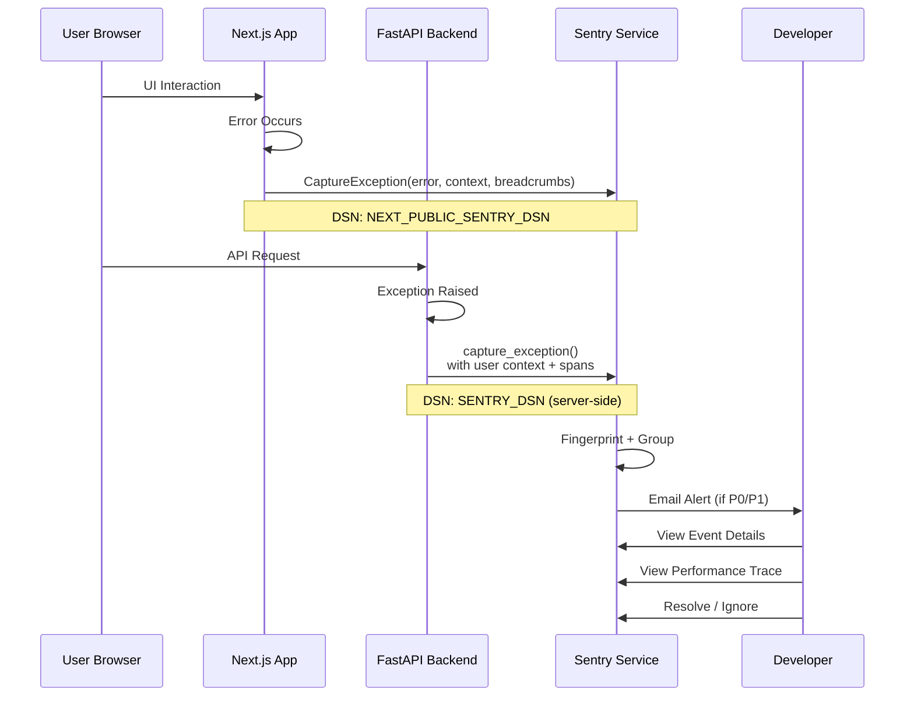
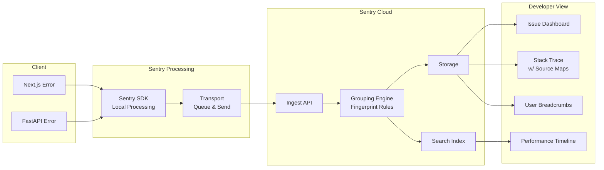

# Sentry Error Tracking — Second Brain OS

## Document Control

| Field | Value |
|---|---|
| Document ID | OPS-SNT-004 |
| Version | 1.0.0 |
| Status | Approved |
| Date | 2026-07-10 |
| Classification | Internal |
| Owner | Developer |

---

## Table of Contents

- [1. Executive Summary](#1-executive-summary)
- [2. Purpose](#2-purpose)
- [3. Scope](#3-scope)
- [4. Business Context](#4-business-context)
- [5. Functional Specification](#5-functional-specification)
- [6. Non-Functional Requirements](#6-non-functional-requirements)
- [7. Architecture](#7-architecture)
- [8. Diagrams](#8-diagrams)
- [9. Data Models](#9-data-models)
- [10. APIs](#10-apis)
- [11. Security](#11-security)
- [12. Performance Targets](#12-performance-targets)
- [13. Edge Cases](#13-edge-cases)
- [14. Failure Scenarios](#14-failure-scenarios)
- [15. Risks & Mitigations](#15-risks--mitigations)
- [16. Acceptance Criteria](#16-acceptance criteria)
- [17. Traceability](#17-traceability)
- [18. Implementation Notes](#18-implementation-notes)
- [19. Testing Strategy](#19-testing-strategy)
- [20. References](#20-references)

---

## 1. Executive Summary

Second Brain OS uses Sentry for production error tracking across both the Next.js frontend and FastAPI backend. Sentry provides real-time error capture, grouping, performance monitoring, and release tracking within a single dashboard. Both frontend and backend are configured with error grouping, breadcrumb trails, user context, and source map uploads for readable stack traces. The Sentry free tier covers 5,000 events per month, which is sufficient for current single-user traffic levels.

---

## 2. Purpose

Sentry enables proactive error detection and debugging by capturing unhandled exceptions, performance bottlenecks, and frontend crashes with full context. It replaces the need for users to manually report errors and provides developers with actionable diagnostic information including stack traces, browser/environment context, and user actions leading up to the error.

---

## 3. Scope

This document covers:

- Sentry setup for Next.js (`sentry.client.config.ts`, `sentry.server.config.ts`)
- Sentry setup for FastAPI (`sentry_sdk.init`)
- Error grouping and fingerprinting strategy
- Performance monitoring (Tracing)
- Source maps upload for stack trace deobfuscation
- Release tracking via git SHA
- User context attachment
- Breadcrumb configuration
- Rate limiting and quota management

Out of scope: self-hosted Sentry, mobile app Sentry, Sentry for scheduler service.

---

## 4. Business Context

Sentry was chosen over alternatives (Datadog, Rollbar, Bugsnag) for its generous free tier, ease of setup with Next.js and Python, and developer-friendly UX. As the project scales, the paid Sentry tier ($26/month/developer) provides increased event quotas and team features. For now, the free tier (5,000 events/month) is sufficient for single-developer usage.

---

## 5. Functional Specification

### 5.1 Frontend Setup (Next.js)

Configured in `apps/web/sentry.client.config.ts`:

```typescript
import * as Sentry from '@sentry/nextjs'

Sentry.init({
  dsn: process.env.NEXT_PUBLIC_SENTRY_DSN,
  environment: process.env.NODE_ENV,
  release: process.env.NEXT_PUBLIC_VERCEL_GIT_COMMIT_SHA,
  tracesSampleRate: 0.1, // 10% of transactions sampled
  replaysSessionSampleRate: 0.1,
  replaysOnErrorSampleRate: 1.0,
  integrations: [
    new Sentry.BrowserTracing(),
    new Sentry.Replay(),
  ],
  beforeSend(event) {
    // Sanitize PII before sending
    if (event.request?.headers) {
      delete event.request.headers['Authorization']
      delete event.request.headers['Cookie']
    }
    return event
  },
})
```

### 5.2 Backend Setup (FastAPI)

Configured in `apps/api/main.py`:

```python
import sentry_sdk
from sentry_sdk.integrations.fastapi import FastApiIntegration
from sentry_sdk.integrations.loguru import LoguruIntegration

sentry_sdk.init(
    dsn=settings.SENTRY_DSN,
    environment=settings.ENVIRONMENT,
    release=settings.GIT_COMMIT_SHA,
    traces_sample_rate=0.1,
    integrations=[
        FastApiIntegration(transaction_style="endpoint"),
        LoguruIntegration(),
    ],
    before_send=lambda event, hint: sanitize_sentry_event(event),
)
```

### 5.3 Error Grouping

Custom fingerprinting logic:

```python
def sentry_fingerprint(request, exc_info):
    """Group errors by type + endpoint for meaningful aggregation."""
    exc_type = type(exc_info[1]).__name__
    endpoint = request.scope.get("path", "unknown")
    return ["{{ default }}", exc_type, endpoint]
```

Error groups are defined by:
- Error class name (e.g., `HTTPException`, `SupabaseError`, `LLMProviderUnavailableError`)
- Endpoint path (e.g., `/api/v1/tasks/{task_id}`)
- HTTP status code (for HTTP exceptions)

### 5.4 User Context

User identification attached to Sentry events:

```python
from sentry_sdk import set_user

async def get_current_user(token: str = Depends(oauth2_scheme)):
    user = verify_jwt(token)
    set_user({"id": user.id, "email": hash_email(user.email)})
    return user
```

### 5.5 Breadcrumbs

Automatic breadcrumbs are configured for:
- Outgoing HTTP requests (via `httpx` integration)
- Database queries (via `sqlalchemy` or Supabase client logging)
- Console log messages
- UI interactions (frontend click tracking)
- Route navigation (frontend)

---

## 6. Non-Functional Requirements

| ID | Requirement | Target |
|---|---|---|
| SNT-NFR-001 | Sentry event submission overhead | < 50ms |
| SNT-NFR-002 | Events captured per month (free tier) | < 5,000 |
| SNT-NFR-003 | Source map upload frequency | Per deployment |
| SNT-NFR-004 | Stack trace readability | 100% with source maps |
| SNT-NFR-005 | Error grouping accuracy | > 90% correct grouping |

---

## 7. Architecture



---

## 8. Diagrams

### 8.1 Event Processing Pipeline



---

## 9. Data Models

### 9.1 Sentry Configuration Schema

```typescript
interface SentryConfig {
  dsn: string
  environment: 'development' | 'staging' | 'production'
  release: string  // git commit SHA
  tracesSampleRate: number  // 0.0 to 1.0
  beforeSend?: (event: SentryEvent, hint: SentryHint) => SentryEvent | null
}
```

### 9.2 Event Sanitization

Fields that are automatically stripped from Sentry events before sending:

- `request.headers.Authorization`
- `request.headers.Cookie`
- `request.headers['X-API-Key']`
- `user.email` (hashed in `set_user`)
- `user.ip_address` (hashed by Sentry automatically)
- `extra.password`
- `extra.secret`
- `extra.token`

---

## 10. APIs

### 10.1 Sentry SDK Initialization (Backend)

```python
# apps/api/main.py
sentry_sdk.init(
    dsn=settings.SENTRY_DSN,
    environment=settings.ENVIRONMENT,
    release=os.environ.get("GIT_COMMIT_SHA", "development"),
    traces_sample_rate=0.1,
    profiles_sample_rate=0.1,  # performance profiling
    integrations=[
        FastApiIntegration(transaction_style="endpoint"),
        LoguruIntegration(),
        HttpxIntegration(),  # trace outgoing HTTP requests
    ],
)
```

### 10.2 Sentry SDK Initialization (Frontend)

```typescript
// apps/web/sentry.client.config.ts
Sentry.init({
  dsn: process.env.NEXT_PUBLIC_SENTRY_DSN,
  environment: process.env.NODE_ENV,
  tracesSampleRate: 0.1,
  replaysSessionSampleRate: 0.1,
  replaysOnErrorSampleRate: 1.0,
  integrations: [Sentry.browserTracingIntegration(), Sentry.replayIntegration()],
})
```

---

## 11. Security

- DSN is public on the frontend (required for client-side error reporting)
- Backend DSN is server-side only, never exposed to clients
- All events are sanitized before sending (PII removal)
- `beforeSend` hooks strip sensitive headers, cookies, and tokens
- User email is hashed before attachment to events
- Sentry agreements: data not used for model training; no third-party data sharing
- Source maps are uploaded with authentication token (not publicly accessible)

---

## 12. Performance Targets

| Metric | Target |
|---|---|
| Event submission latency | < 50ms (async, non-blocking) |
| Performance tracing overhead | < 5% of request handling time |
| Source map upload time | < 30s per deployment |
| Frontend bundle size impact | < 30KB gzip |
| Monthly event usage | < 5,000 (free tier limit) |

---

## 13. Edge Cases

| Edge Case | Handling |
|---|---|
| Sentry DSN not configured | Graceful degradation: skip init, no error capture |
| Event submission fails (network) | SDK buffers and retries up to 3 times |
| Exceed monthly quota | Sentry stops accepting events; log locally |
| Development environment | Use separate DSN; errors not sent to production project |
| Source map mismatch | Fall back to minified stack trace; log warning |
| User logged out when error occurs | Send anonymous event without user context |
| Error in Sentry initialization | Catch and log locally; never crash the app |

---

## 14. Failure Scenarios

| Scenario | Impact | Mitigation |
|---|---|---|
| Sentry service outage | Errors not captured | Local log fallback; buffer up to 100 events |
| Quota exceeded | Blind to errors | Monitor usage dashboard; upgrade if approaching limit |
| Incorrect fingerprinting | Noise in issue dashboard | Review grouping rules; adjust fingerprint function |
| Source map upload fails | Unreadable stack traces | Retry in CI; manual upload via Sentry CLI |
| `beforeSend` throws | Event dropped; breadcrumbs lost | Wrap in try/catch; ensure `beforeSend` never throws |

---

## 15. Risks & Mitigations

| Risk | Likelihood | Impact | Mitigation |
|---|---|---|---|
| PII leaked through custom context | Low | High | Sanitization rules in `beforeSend`; regular audit |
| Sentry SDK bundle size impact | Low | Medium | Dynamic import for Replay; tree-shaking |
| Over-reliance on Sentry (ignore logs) | Medium | Medium | Structured logging remains primary debugging tool |
| Source maps reveal source code | Low | Medium | Upload with auth; Sentry stores securely |

---

## 16. Acceptance Criteria

- [ ] Unhandled exceptions in frontend are captured in Sentry
- [ ] Unhandled exceptions in backend are captured in Sentry
- [ ] Stack traces are readable (source maps uploaded)
- [ ] User context (hashed user ID) is attached to events
- [ ] Breadcrumbs show user actions leading to error
- [ ] Performance traces are visible in Sentry Performance
- [ ] PII is stripped from all events
- [ ] Release version is tracked per event
- [ ] Sentry works without crashing when DSN is missing

---

## 17. Traceability

| Requirement | Covered By | Verified By |
|---|---|---|
| SNT-NFR-001 | Latency benchmark | Manual profiling |
| SNT-NFR-002 | Sentry dashboard | Monthly quota check |
| SNT-NFR-003 | CI source map upload | `cd apps/web && npm run build` log review |

---

## 18. Implementation Notes

### 18.1 Environment-Specific Configuration

| Environment | DSN | tracesSampleRate | replaysSessionSampleRate |
|---|---|---|---|
| Development | Separate project | 0.0 (no tracing) | 0.0 |
| Staging | Separate project | 0.5 | 0.5 |
| Production | Main project | 0.1 | 0.1 |

### 18.2 Source Maps Upload

Source maps are uploaded automatically during Vercel deployment using the Sentry Next.js integration. The `sentry.properties` file at `apps/web/sentry.properties` configures the organization and project. For manual upload:

```bash
npx @sentry/cli sourcemaps inject --org secondbrain-os --project secondbrain-web ./out
npx @sentry/cli sourcemaps upload --org secondbrain-os --project secondbrain-web ./out
```

### 18.3 Quota Management

- Free tier: 5,000 events/month
- Performance: 5,000 transactions/month (free)
- Replays: 1,000 replays/month (free)
- Upgrade path: Team plan at $26/month for 50,000 events + unlimited team members

---

## 19. Testing Strategy

| Test Type | Scope | Location |
|---|---|---|
| Unit | `beforeSend` sanitization | `tests/test_shared_utils.py` |
| Unit | Event fingerprinting logic | `tests/test_shared_utils.py` |
| Integration | Sentry init with/without DSN | `tests/test_main_routes.py` |
| Integration | Error capture in request handler | Manual test with `/api/v1/debug-sentry` |
| CI | Source map upload verification | GitHub Actions workflow log |

---

## 20. References

| Reference | Description |
|---|---|
| [Alerts](./Alerts.md) | Sentry integration in alerting |
| [Monitoring](./32_Monitoring.md) | Monitoring and error rate dashboards |
| [Deployment](../devops/26_Deployment.md) | Source map upload in deployment pipeline |
| [Runbooks](./39_Runbooks.md) | Debugging with Sentry event IDs |
| [Observability](./31_Observability.md) | Overall observability strategy |

---

## Revision History

| Version | Date | Author | Changes |
|---|---|---|---|
| 1.0.0 | 2026-07-10 | Developer | Initial Sentry configuration document |
