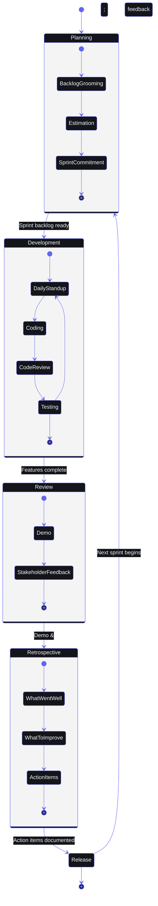

# Sprint Plan

> **Document ID:OPS-SPR-001 SB-OPS-SPRINT-002  
> **Version:** 2.0.0  
> **Status:** Active  
> **Last Updated:** 2026-06-11  
> **Classification:** Internal — Development Process  
> **Owner:** Scrum Master  

---

## Table of Contents

1. [Sprint Cadence](#1-sprint-cadence)
2. [Sprint Ceremonies](#2-sprint-ceremonies)
3. [Sprint Planning Process](#3-sprint-planning-process)
4. [Sprint Structure Template](#4-sprint-structure-template)
5. [Role Definitions](#5-role-definitions)
6. [Sprint Artifact Templates](#6-sprint-artifact-templates)
7. [Definition of Ready](#7-definition-of-ready)
8. [Story Point Estimation Guide](#8-story-point-estimation-guide)
9. [Sprint Review Output Format](#9-sprint-review-output-format)
10. [Retrospective Format](#10-retrospective-format)
11. [Sprint Calendar Template](#11-sprint-calendar-template)
12. [Tooling](#12-tooling)
13. [Velocity Tracking and Forecasting](#13-velocity-tracking-and-forecasting)
14. [Appendices](#14-appendices)

---



## 1. Sprint Cadence

### 1.1 Schedule Overview

| Parameter | Value |
|---|---|
| Sprint duration | 2 weeks (10 working days) |
| Sprint start | Monday 00:00 UTC |
| Sprint end | Sunday 23:59 UTC (end of Week 2) |
| Sprints per year | 26 sprints |
| Holidays | Sprints adjusted per regional calendar; if >3 holidays in a sprint, extend by 1 week |

### 1.2 Sprint Calendar (2026 Sample)

| Sprint | Start | End | Theme |
|---|---|---|---|
| SB-26.S1 | 2026-01-05 | 2026-01-18 | Foundation & Core |
| SB-26.S2 | 2026-01-19 | 2026-02-01 | Foundation & Core |
| SB-26.S3 | 2026-02-02 | 2026-02-15 | Task & Goal Modules |
| SB-26.S4 | 2026-02-16 | 2026-03-01 | Task & Goal Modules |
| SB-26.S5 | 2026-03-02 | 2026-03-15 | Course & Habit Modules |
| SB-26.S6 | 2026-03-16 | 2026-03-29 | Course & Habit Modules |
| SB-26.S7 | 2026-03-30 | 2026-04-12 | AI Agent Integration |
| SB-26.S8 | 2026-04-13 | 2026-04-26 | AI Agent Integration |
| SB-26.S9 | 2026-04-27 | 2026-05-10 | Dashboard & Analytics |
| SB-26.S10 | 2026-05-11 | 2026-05-24 | Dashboard & Analytics |
| SB-26.S11 | 2026-05-25 | 2026-06-07 | Mobile & PWA |
| SB-26.S12 | 2026-06-08 | 2026-06-21 | Polish & Testing |
| SB-26.S13 | 2026-06-22 | 2026-07-05 | Performance Optimization |
| SB-26.S14 | 2026-07-06 | 2026-07-19 | Feature Parity |
| SB-26.S15 | 2026-07-20 | 2026-08-02 | Bug Bash & Hardening |
| SB-26.S16 | 2026-08-03 | 2026-08-16 | Release v1.0 Prep |
| SB-26.S17 | 2026-08-17 | 2026-08-30 | Post-Release Stabilization |
| SB-26.S18+ | 2026-08-31 | — | Ongoing feature development |

### 1.3 Sprint ID Convention

Format: `SB-YY.SN` where:
- `SB` = Second Brain
- `YY` = Last two digits of year (26, 27, ...)
- `S` = Sprint prefix
- `N` = Sprint number (1-26)

Examples: `SB-26.S1`, `SB-26.S14`, `SB-27.S3`

### 1.4 Sprint Schedule Exceptions

| Scenario | Adjustment |
|---|---|
| Major holiday (3+ days) | Extend sprint by 1 week |
| Team member on PTO (50%+ capacity) | Reduce sprint scope, maintain duration |
| Production incident | Pause sprint, form SWAT team; remaining work carries over |
| Dependency blocker | Remove blocked items during sprint, adjust goal |

---

## 2. Sprint Ceremonies

### 2.1 Ceremony Schedule

| Ceremony | Day | Time | Duration | Participants |
|---|---|---|---|---|
| Sprint Planning | Monday (Week 1) | 10:00-11:30 UTC | 90 min | Full team |
| Daily Standup | Monday-Friday | 9:15-9:25 UTC | 10 min | Full team |
| Mid-Sprint Check-in | Wednesday (Week 1) | 10:00-10:30 UTC | 30 min | PM + Engineers |
| Sprint Review | Friday (Week 2) | 15:00-16:00 UTC | 60 min | Full team + Stakeholders |
| Sprint Retrospective | Friday (Week 2) | 16:00-17:00 UTC | 60 min | Full team |
| Backlog Refinement | Wednesday (Week 2) | 14:00-15:00 UTC | 60 min | PM + Tech Lead |
| Product Sync | Monday (Week 1) | 11:30-12:00 UTC | 30 min | PM + Stakeholders |

### 2.2 Sprint Planning (90 minutes)

**Agenda:**

| Time | Activity | Facilitator | Description |
|---|---|---|---|
| 0-10 min | Sprint goal introduction | Product Owner | Present top 3-5 prioritized items from backlog |
| 10-30 min | Capacity check | Scrum Master | Review team availability, adjust scope expectations |
| 30-70 min | Story breakdown & estimation | Full team | Decompose selected stories, assign points |
| 70-85 min | Task assignment | Full team | Self-assignment of tasks, dependency check |
| 85-90 min | Commitment & goal finalization | Scrum Master | Confirm sprint goal, record in GitHub Project |

**Inputs:**
- Prioritized product backlog (refined, estimated, DOR met)
- Velocity from last 3 sprints
- Team availability sheet (PTO, holidays)
- Definition of Ready checklist

**Outputs:**
- Sprint goal (1-2 sentences)
- Sprint backlog in GitHub Project
- Identified risks and dependencies
- Capacity allocation per developer

### 2.3 Daily Standup (10 minutes)

**Format:** Each team member answers 3 questions:

1. **What did I accomplish yesterday?**
   - Link to specific GitHub Issues or PRs
   - Reference sprint board column moved

2. **What will I work on today?**
   - Specific tasks with issue numbers
   - Expected time to complete

3. **What blockers do I have?**
   - Clear description of the impediment
   - Who needs to unblock this
   - Deadline for unblocking

**Rules:**
- Stand at the board (physical or virtual)
- No deep discussions — take them to a breakout
- Record blockers in GitHub Issues with `blocked` label
- Timebox strictly at 10 minutes

**Blockers Escalation:**

| Blocked Duration | Action |
|---|---|
| < 4 hours | Self-resolve, ask for help in Slack |
| 4-24 hours | Escalate to Scrum Master |
| 24-48 hours | Escalate to Engineering Manager |
| > 48 hours | Escalate to Product Owner — consider scope change |

### 2.4 Sprint Review (60 minutes)

**Agenda:**

| Time | Activity | Owner |
|---|---|---|
| 0-5 min | Sprint goal recap | Product Owner |
| 5-35 min | Demo completed work (5 min per feature) | Developers |
| 35-50 min | Stakeholder feedback | Stakeholders |
| 50-60 min | Backlog adjustments & roadmap update | Product Owner |

**Demo Guidelines:**
- Demo must be prepared 24 hours in advance
- Use production-like data (not localhost)
- Demonstrate the user-facing behavior, not code
- If a feature is not done, do not demo it
- Record demos for asynchronous stakeholders

### 2.5 Sprint Retrospective (60 minutes)

**Format:** Start / Stop / Continue (see [Section 10](#10-retrospective-format) for full details)

**Retrospective Types (rotate quarterly):**

| Week | Retro Type | Description |
|---|---|---|
| Quarter Week 1 | Start/Stop/Continue | Standard format |
| Quarter Week 4 | Sailboat | What's pushing us forward? What's holding us back? |
| Quarter Week 8 | Mad/Sad/Glad | Emotional retrospective |
| Quarter Week 12 | 4Ls | Liked, Learned, Lacked, Longed For |

### 2.6 Backlog Refinement (60 minutes)

**Frequency:** Mid-week of Sprint 2 (bi-weekly)

**Activities:**
- Split large stories (>13 points) into smaller ones
- Add acceptance criteria to upcoming stories
- Estimate un-estimated stories (t-shirt size first, then points)
- Remove or deprioritize stale items (>6 months untouched)
- Validate Definition of Ready for top 5-10 backlog items

---

## 3. Sprint Planning Process

### 3.1 Capacity Calculation

Formula: `Available Capacity = (Team Members × Working Days × Hours/Day) × Focus Factor`

**Standard Team Capacity:**

| Role | Members | Daily Hours | Sprint Hours | Focus Factor | Effective Hours |
|---|---|---|---|---|---|
| Product Owner | 1 | 4 | 40 | 0.7 | 28 |
| Scrum Master | 1 | 2 | 20 | 0.8 | 16 |
| Developers | 4 | 6 | 120 | 0.75 | 90 |
| QA | 1 | 6 | 60 | 0.8 | 48 |
| **Total** | **7** | — | **240** | — | **182** |

**Focus Factor Adjustments:**

| Factor | Adjustment |
|---|---|
| Greenfield development | 0.80 |
| Maintenance & bugs | 0.60 |
| On-call rotation week | -25% capacity |
| Conference / training | -50% for that developer |
| New team member (< 1 month) | 0.40 |
| Known production incidents | -1 dev for incident resolution |

**Availability Tracking Template:**

```
Sprint: SB-26.S7
Total Team Members: 7
Working Days: 10
Focus Factor: 0.75

| Name | Role | Days Available | PTO | Notes | Capacity (h) |
|---|---|---|---|---|---|
| Alice | Dev | 10 | 0 | Full capacity | 45 |
| Bob | Dev | 8 | 2 | Conference Mon-Tue | 36 |
| Carol | Dev | 10 | 0 | On-call week 1 | 34 |
| Dave | Dev | 10 | 0 | — | 45 |
| Eve | QA | 10 | 0 | — | 48 |
| Frank | PO | 9 | 1 | — | 25 |
| Grace | SM | 10 | 0 | — | 16 |
| **Total** | | **67** | **3** | | **249** |
```

### 3.2 Priority-Based Backlog Grooming

**Backlog Prioritization Framework (RICE):**

| Factor | Weight | Description |
|---|---|---|
| **Reach** | 0.25 | How many users will this impact? (1-5) |
| **Impact** | 0.35 | How much will this improve the user experience? (1-5) |
| **Confidence** | 0.15 | How confident are we in our estimates? (1-5) |
| **Effort** | -0.25 | How many story points is this? (inverse) |

RICE Score = `(Reach × 0.25 + Impact × 0.35 + Confidence × 0.15) / Effort`

**Backlog Tiers:**

| Tier | Definition | Planning Horizon |
|---|---|---|
| P0 | Critical — blocks all progress | Current sprint |
| P1 | High — strategic priority | Next 1-2 sprints |
| P2 | Medium — valuable but not urgent | Next 3-4 sprints |
| P3 | Low — nice to have | Next 6+ sprints |
| P4 | Icebox — may never do | Indefinite |

### 3.3 Sprint Capacity Allocation

**Recommended split per sprint:**

| Activity | % Capacity | Hours (182h sprint) |
|---|---|---|
| Feature development | 60% | 109 |
| Tech debt & refactoring | 15% | 27 |
| Bug fixes | 10% | 18 |
| Testing & QA | 10% | 18 |
| Documentation | 5% | 10 |

---

## 4. Sprint Structure Template

### 4.1 Week 1: Feature Implementation (Days 1-5)

| Day | Focus | Activities | Ceremonies |
|---|---|---|---|
| Monday | Sprint kickoff | Sprint planning, task assignments, initial commits | Sprint Planning (10am) |
| Tuesday | Deep work | Feature implementation, pair programming | Standup (9:15am) |
| Wednesday | Core features | Feature implementation, early testing | Standup + Mid-Sprint Check |
| Thursday | Feature completion | Complete feature work, code review requests | Standup |
| Friday | Review prep | Internal demos, integration testing | Standup |

### 4.2 Week 2: Polish + Testing + Documentation (Days 6-10)

| Day | Focus | Activities | Ceremonies |
|---|---|---|---|
| Monday | Testing | Unit tests, integration tests, E2E tests | Standup |
| Tuesday | Bug fixing | Fix regressions, edge case handling | Standup |
| Wednesday | Polish | UI polish, performance optimization, accessibility | Standup + Backlog Refinement |
| Thursday | Documentation | Update docs, API docs, changelog | Standup |
| Friday | Ship | Sprint Review, Retrospective, deployment | Sprint Review (3pm) + Retro (4pm) |

### 4.3 Sprint Goal Template

```markdown
## Sprint Goal: SB-26.S7

**Theme:** AI Agent Integration

**Goal Statement:** 
Deliver the Daily Briefing Agent (A09) and Weekly Review Agent (A10) with prompt-templated outputs, Supabase persistence, and scheduler integration.

**Success Metrics:**
- [ ] Daily briefing generates for all active users by 7:05 AM
- [ ] Weekly review generates by Sunday 8:05 PM
- [ ] All prompts validated (scripts/validate_prompts.py passes)
- [ ] 100% test coverage on agent modules
- [ ] Agent latency < 5s p95

**Risks:**
- Ollama model availability (fallback to Claude configured)
- Supabase RLS policy gaps for daily_briefings table

**Scope:**
- In: A09 Briefing Agent, A10 Weekly Review Agent, scheduler cron jobs
- Out: Opportunity Radar Agent (deferred to SB-26.S8)
```

---

## 5. Role Definitions

### 5.1 Product Owner (PO)

**Primary:** Frank

| Responsibility | Description | Time Commitment |
|---|---|---|
| Backlog management | Prioritize, refine, and communicate the product backlog | 4h/day |
| Stakeholder liaison | Gather requirements, manage expectations | Weekly syncs |
| Acceptance criteria | Define clear acceptance criteria for all stories | Per story |
| Sprint goal | Define and communicate sprint goal | Per sprint |
| Decision making | Triage bugs, approve scope changes | Daily |
| Release management | Coordinate releases, write release notes | Per release |

**Rights:** Move items in/out of sprint, reprioritize backlog, accept/reject stories
**Duties:** Available for clarification within 2 hours during working hours

### 5.2 Scrum Master (SM)

**Primary:** Grace

| Responsibility | Description | Time Commitment |
|---|---|---|
| Process facilitation | Run ceremonies, enforce timeboxes, remove blockers | 2h/day |
| Team coaching | Coach agile practices, facilitate retrospectives | Per sprint |
| Metrics tracking | Track velocity, burndown, cycle time | Weekly |
| Impediment removal | Escalate and resolve blockers | Daily |
| Continuous improvement | Drive action items from retrospectives | Per sprint |
| Tool administration | Manage GitHub Projects, labels, workflows | As needed |

**Rights:** Block scope changes mid-sprint, enforce Definition of Done
**Duties:** Ensure ceremonies start/end on time, maintain sprint board hygiene

### 5.3 Development Team

**Members:** Alice, Bob, Carol, Dave

| Responsibility | Description | Time Commitment |
|---|---|---|
| Feature implementation | Code, test, and deploy features | 6h/day |
| Code review | Review PRs within 24 hours | 1h/day |
| Technical design | Write technical specs, review architecture | Per story |
| Bug fixing | Address bugs found during sprint | 10% capacity |
| Testing | Write unit, integration, and E2E tests | 10% capacity |
| Documentation | Update code comments, API docs, user guides | 5% capacity |

**Rights:** Self-assign tasks, spike on technical unknowns, reject DOR violations
**Duties:** Update task status daily, attend all ceremonies, respond to review requests within 24h

### 5.4 QA Engineer

**Primary:** Eve

| Responsibility | Description | Time Commitment |
|---|---|---|
| Test planning | Write test plans for sprint features | Per sprint |
| Manual testing | Exploratory testing, UAT verification | 3h/day |
| Automation | Maintain E2E test suite, add test cases | 3h/day |
| Regression | Run regression suite before release | Per release |
| Bug tracking | Log bugs, verify fixes, triage severity | Daily |
| Accessibility | Verify a11y compliance (WCAG 2.1 AA) | Per feature |

**Rights:** Block release on severity-critical bugs, reject incomplete features
**Duties:** Report test results at standup, maintain test documentation

### 5.5 Stakeholders

| Role | Interest | Engagement |
|---|---|---|
| Engineering Manager | Resource allocation, technical oversight | Sprint review, 1:1s |
| Design Lead | UI/UX consistency | Sprint review, backlog refinement |
| User representatives | Feature validation | Sprint review (monthly) |
| Infrastructure team | Platform stability | As needed |

---

## 6. Sprint Artifact Templates

### 6.1 Sprint Goal

```markdown
# Sprint Goal: [SB-YY.SN] - [Theme]

**Goal Statement:**
[One or two sentences describing the primary objective of the sprint]

**Success Criteria:**
- [Criterion 1 with measurable outcome]
- [Criterion 2 with measurable outcome]
- [Criterion 3 with measurable outcome]

**Stretch Goals:**
- [Optional goal if capacity allows]

**Out of Scope:**
- [Items explicitly not included this sprint]
```

### 6.2 Sprint Backlog

The sprint backlog lives in **GitHub Project** with the following columns:

```yaml
columns:
  - name: Backlog
    description: All items considered for this sprint
    limit: null
    
  - name: Sprint Backlog
    description: Committed items for this sprint
    limit: 20

  - name: In Progress
    description: Actively being worked on
    limit: 3 per developer

  - name: In Review
    description: PR submitted, awaiting code review
    limit: 5 total

  - name: In QA
    description: Passed code review, awaiting QA verification
    limit: 3 total

  - name: Done
    description: Meets Definition of Done
    limit: null
```

**Issue Template for Sprint Backlog:**

```markdown
---
title: "[Module] Brief description of the task"
labels: [sprint-YY-SN, type/feature]
assignees: [developer]
milestone: SB-26.S7
---

## Description
[Clear description of what needs to be done]

## Acceptance Criteria
- [ ] [Criterion 1]
- [ ] [Criterion 2]
- [ ] [Criterion 3]

## Technical Notes
- [Implementation details, design decisions]
- [Relevant files or modules]

## Dependencies
- Blocked by: #[issue-number]
- Blocks: #[issue-number]

## Effort
- Story Points: [1|2|3|5|8|13]
- T-shirt Size: [XS|S|M|L|XL]

## Definition of Ready Checklist
- [ ] Acceptance criteria defined
- [ ] Dependencies identified
- [ ] Design approved (if applicable)
- [ ] Technical approach agreed
- [ ] Estimated
```

### 6.3 Sprint Board Columns

```
┌──────────────┐    ┌──────────────────┐    ┌──────────────┐    ┌────────────┐    ┌──────┐    ┌──────┐
│   Backlog    │ →  │  Sprint Backlog  │ →  │ In Progress  │ →  │ In Review  │ →  │In QA │ →  │ Done │
│              │    │                  │    │              │    │            │    │      │    │      │
│ Refined &    │    │ Committed items │    │ Active dev   │    │ PR under   │    │QA    │    │DoD  │
│ prioritized  │    │ DoR met         │    │ Self-assigned │    │ review     │    │verify │    │met  │
│ Not committed│    │                 │    │ Max 3/dev    │    │ Max 5 total│    │      │    │     │
└──────────────┘    └──────────────────┘    └──────────────┘    └────────────┘    └──────┘    └──────┘
```

**WIP Limits:**
- In Progress: 3 per developer (engineering standard)
- In Review: 5 total (ensures reviews don't bottleneck)
- In QA: 3 total (QA capacity management)

### 6.4 Burndown Chart

**Template:** Generate in GitHub Projects or export to Google Sheets

```yaml
sprint: SB-26.S7
total_points: 85
days: 10

daily_tracking:
  day_1: 85   # Start (Monday)
  day_2: 75
  day_3: 65
  day_4: 55
  day_5: 45   # End Week 1
  day_6: 38
  day_7: 30
  day_8: 22
  day_9: 12
  day_10: 0   # End (Friday)

# Ideal burndown: 8.5 points/day
# Track: remaining_points vs expected_remaining
```

**Burndown Interpretation:**

| Pattern | Meaning | Action |
|---|---|---|
| Above ideal line | Behind schedule | Check blockers, consider scope reduction |
| On ideal line | On track | Continue |
| Below ideal line | Ahead of schedule | Consider stretch goals |
| Flat for 2+ days | Major blocker | Scrum Master intervenes |
| Flat then steep drop | Task not updated | Enforce daily status updates |
| Never decreases | Scope creep | Remove items not in sprint goal |

---

## 7. Definition of Ready

### 7.1 Ready Checklist

Every item in the sprint backlog MUST meet ALL criteria below:

```markdown
## Definition of Ready Checklist

### Requirements
- [ ] User story is clearly described with persona, action, and benefit
- [ ] Acceptance criteria are defined (minimum 3)
- [ ] Edge cases are documented
- [ ] Non-functional requirements are specified (performance, security, accessibility)

### Dependencies
- [ ] All external dependencies are identified
- [ ] No unresolved blocking dependencies on other teams
- [ ] Data model changes are approved by DB team

### Design
- [ ] UI mockups or wireframes are approved (if UI change)
- [ ] API contract is defined and reviewed
- [ ] Technical design doc is written and reviewed (if complex)

### Estimation
- [ ] Story is estimated in story points
- [ ] Story size ≤ 13 points (if >13, it must be split)
- [ ] Task breakdown is created at planning

### Validation
- [ ] Test strategy is identified (unit, integration, E2E)
- [ ] Sample test cases are considered
- [ ] Rollback plan exists (for infrastructure changes)
```

### 7.2 Ready Exemptions

| Exemption | Approval Required | Conditions |
|---|---|---|
| Missing design mockups | Product Owner + Tech Lead | Only if UI is trivial (e.g., backend-only task) |
| Undefined test strategy | QA Lead | Only if task is experimental/spike |
| Missing estimation | Scrum Master | Cannot exceed 3 unestimated items in sprint |
| UI not finalized | Product Owner | Only if backend implementation can proceed independently |

Exemptions must be documented in the issue body and approved before Sprint Planning begins.

### 7.3 Ready Gates Process

```
Backlog Item Created
        │
        â–¼
PO adds acceptance criteria
        │
        â–¼
Tech Lead reviews technical approach
        │
        â–¼
Design Lead reviews (if UI)
        │
        â–¼
Team estimates in refinement
        │
        â–¼
Scrum Master checks DoR checklist
        │
        â–¼
┌───────────┐    Yes
│ DoR Met?  │ ───────→ Move to "Ready" column
└───────────┘
     │
     No
     │
     â–¼
Add specific blockers to issue
Return to refinement queue
```

---

## 8. Story Point Estimation Guide

### 8.1 Fibonacci Scale

| Points | Size | Time Estimate | Complexity | Risk | Example |
|---|---|---|---|---|---|
| 1 | XS | < 2 hours | Trivial | None | Fix typo, update config |
| 2 | S | 2-4 hours | Simple | Low | Add form validation |
| 3 | M | 4-8 hours (1 day) | Moderate | Low | Create a new API endpoint |
| 5 | L | 1-2 days | Complex | Medium | New page with data fetching |
| 8 | XL | 2-3 days | Very complex | Medium | Agent module integration |
| 13 | XXL | 3-5 days | Extremely complex | High | End-to-end feature with AI |
| 21+ | — | Must split | — | — | Epic — break down |

### 8.2 Reference Stories (Second Brain OS)

| Story | Points | Rationale |
|---|---|---|
| Add a new API endpoint to list tasks | 2 | Simple CRUD, existing pattern |
| Create task creation form with validation | 3 | UI + API call + error handling |
| Implement daily briefing agent with prompt | 8 | AI integration, prompt loading, scheduler |
| Build habit streak visualization | 5 | Complex UI, calculations, state management |
| Add Supabase RLS policy for user isolation | 3 | Security-sensitive, requires testing |
| Set up CI/CD pipeline (frontend + backend) | 5 | Multiple services, YAML config, testing |
| Implement knowledge graph visualization | 13 | Complex UI, graph algorithms, performance |
| Add AI-powered task prioritization | 8 | AI integration, prompt engineering, fallback |
| Fix login redirect on token expiry | 2 | Small scope, clear acceptance criteria |
| Mobile responsive dashboard layout | 5 | CSS-heavy, cross-browser testing |

### 8.3 Estimation Process

**Step 1: T-Shirt Sizing (Quick Filter)**

During refinement, quickly size items:
- XS → 1-2 points
- S → 3 points
- M → 5 points
- L → 8 points
- XL → 13 points
- XXL → Needs splitting

**Step 2: Fibonacci Voting (Planning Poker)**

1. Product Owner presents the story
2. Team discusses requirements (2 minutes)
3. Each member selects a card privately
4. All cards revealed simultaneously
5. If variance > 2x (e.g., 3 and 8), discuss reasoning
6. Re-vote after discussion
7. Repeat until consensus or majority (≥2/3)

**Estimation Rules:**
- Ignore calendar dates — estimate relative effort
- Use the smallest person's estimate as the anchor (they'll implement it)
- A story that takes 2 developers 2 days = 8 points (not 4)
- Estimation time: Max 5 minutes per story

### 8.4 Velocity Tracking

**Rolling Average (Last 3 Sprints):**

```python
velocity = (sprint_n_1_points + sprint_n_2_points + sprint_n_3_points) // 3
```

**Velocity History Table:**

| Sprint | Committed Points | Completed Points | Completion % | Velocity |
|---|---|---|---|---|
| SB-26.S1 | 60 | 55 | 92% | — |
| SB-26.S2 | 65 | 60 | 92% | — |
| SB-26.S3 | 70 | 68 | 97% | 61 |
| SB-26.S4 | 70 | 65 | 93% | 64 |
| SB-26.S5 | 75 | 70 | 93% | 68 |
| SB-26.S6 | 80 | 78 | 98% | 71 |
| SB-26.S7 | 85 | — | — | 71 |

**Velocity-Based Capacity Planning:**

```
Forecast points for next sprint = Last 3 sprint average × (1 - known capacity reduction)

Example:
- Average velocity: 71
- Next sprint: 2 team members on PTO (25% capacity reduction)
- Forecast: 71 × 0.75 = 53 points
- Commitment ceiling: 53 points
```

---

## 9. Sprint Review Output Format

### 9.1 Demo Script Template

```markdown
# Sprint Review Demo Script — SB-26.S7

**Date:** 2026-04-11  
**Time:** 15:00-16:00 UTC  
**Location:** Google Meet / Discord  

## Demo Flow

---

### Demo 1: Daily Briefing Agent (A09)
**Presenter:** Alice

**Setup:**
- Logged in as test user (test@secondbrain.io)
- Supabase seeded with 3 tasks, 2 courses, 1 habit
- Ollama running locally with Mistral 7B

**Steps:**
1. Navigate to Dashboard
2. Click "Generate Briefing" button
3. Observe AI-generated briefing card
4. Verify: tasks summary, course progress, habit streak, AI insight

**Expected Behavior:**
- Briefing loads within 5 seconds
- All data sections populated
- AI insight is relevant and contextual

**Demo Data:**
- User: test@secondbrain.io
- Tasks: Complete AI module (due today), Review PR (due tomorrow)
- Courses: CS50 (75% complete), FastAPI (40% complete)

---

### Demo 2: Weekly Review Agent (A10)
**Presenter:** Bob

**Setup:**
- Trigger via API POST /api/automation/trigger/weekly-review
- Weekly data accumulated over 7 days

**Steps:**
1. Trigger weekly review generation
2. Verify Supabase weekly_reviews table
3. Display generated review in dashboard
4. Show productivity metrics, patterns, recommendations

**Expected Behavior:**
- Review generates within 10 seconds
- Contains all 5 sections (tasks, courses, habits, insights, recommendations)
- Data matches actual usage patterns

---

### Feedback Collection

**Stakeholder Feedback Form:**

| Feature | Rating (1-5) | What worked well? | What could improve? | Priority (P0-P3) |
|---|---|---|---|---|
| Daily Briefing | | | | |
| Weekly Review | | | | |
| Scheduler Integration | | | | |
| Prompt System | | | | |

**Open Discussion Notes:**
-
-
-
```

### 9.2 Stakeholder Feedback Template

```markdown
## Sprint Review Feedback — SB-YY.SN

**Sprint Goal:** [Goal Statement]

### Decision Log

| Decision | Rationale | Decided By |
|---|---|---|
| | | |

### Feedback Summary

| Category | Feedback | Action Item | Owner | Due Date |
|---|---|---|---|---|
| Feature | | | | |
| UX | | | | |
| Performance | | | | |
| Priority | | | | |

### Backlog Changes Resulting from Feedback

- [Issue #] — Description of change
- [Issue #] — New item added

### Approval Status

- [ ] Sprint goal achieved
- [ ] Demo accepted by stakeholders
- [ ] Release approved (if applicable)
```

### 9.3 Review Output Artifacts

| Artifact | Location | Format | Retention |
|---|---|---|---|
| Demo recording | Google Drive / Loom | Video | 6 sprints |
| Feedback form responses | Google Sheets | CSV | 1 year |
| Decision log | GitHub Wiki | Markdown | Permanent |
| Action items | GitHub Issues | Linked from sprint | Per sprint |

---

## 10. Retrospective Format

### 10.1 Start / Stop / Continue Template

```markdown
# Sprint Retrospective — SB-YY.SN

**Date:** [Date]  
**Participants:** [Names]  
**Facilitator:** [Scrum Master]  

## Metrics

| Metric | Value | Trend |
|---|---|---|
| Planned points | 85 | — |
| Completed points | 78 | 92% |
| Bugs found | 5 | ↑ 2 from last sprint |
| Cycle time (avg) | 2.3 days | ↓ 0.5 days |
| Code review time (avg) | 6.5 hours | ↓ 2h improvement |

---

## Start Doing

| What | Why | Owner | Action Item |
|---|---|---|---|
| | | | |
| | | | |

## Stop Doing

| What | Why | Owner | Action Item |
|---|---|---|---|
| | | | |
| | | | |

## Continue Doing

| What | Why | Owner | Action Item |
|---|---|---|---|
| | | | |
| | | | |

---

## Action Items (Top 3)

| # | Action Item | Owner | Due Date | Status |
|---|---|---|---|---|
| 1 | | | | â–¡ |
| 2 | | | | â–¡ |
| 3 | | | | â–¡ |

## Happiness Index

- Team morale: ⭐⭐⭐⭐⭐ (5/5)
- Process satisfaction: ⭐⭐⭐⭐ (4/5)
- Product confidence: ⭐⭐⭐⭐⭐ (5/5)

## Blockers for Next Sprint

| Blocker | Impact | Resolution | Owner |
|---|---|---|---|
| | | | |
```

### 10.2 Retrospective Action Item Tracking

```markdown
## Retrospective Action Items Registry

| ID | Sprint | Action Item | Owner | Status | Due | Verified |
|---|---|---|---|---|---|---|
| RETRO-001 | SB-26.S1 | Reduce standup time to 10 min | Grace | ✅ Done | S2 | ✅ |
| RETRO-002 | SB-26.S2 | Add prompt validation to CI | Alice | ✅ Done | S3 | ✅ |
| RETRO-003 | SB-26.S3 | Create developer onboarding doc | Bob | ✅ Done | S4 | ✅ |
| RETRO-004 | SB-26.S4 | Implement staging environment | Carol | ⏳ In Progress | S6 | □ |
| RETRO-005 | SB-26.S5 | Reduce PR review time to <12h | Team | ✅ Done | S6 | ✅ |
| RETRO-006 | SB-26.S6 | Split large stories before sprint | Frank | ✅ Done | S7 | ✅ |
```

**Rules:**
- Max 3 action items per sprint
- Each action item must have a single owner
- Owner reports progress at each standup until complete
- Action items roll over to next sprint if not completed
- Retrospective actions are reviewed at the next retrospective

### 10.3 Retrospective Health Check

```markdown
## Sprint Health Scorecard

Rate each dimension 1-5 (1 = poor, 5 = excellent)

| Dimension | Rating | Notes |
|---|---|---|
| Goal Achievement | | |
| Code Quality | | |
| Team Collaboration | | |
| Technical Excellence | | |
| Process Adherence | | |
| Stakeholder Satisfaction | | |
| Work-Life Balance | | |

**Overall Health Score:** ___ / 30
```

---

## 11. Sprint Calendar Template

### 11.1 Yearly Sprint Calendar

```markdown
# Sprint Calendar 2026

| Month | Sprint | Start (Mon) | End (Sun) | Theme | Notes |
|---|---|---|---|---|---|
| Jan | S1 | Jan 5 | Jan 18 | Foundation | — |
| Jan-Feb | S2 | Jan 19 | Feb 1 | Foundation | — |
| Feb | S3 | Feb 2 | Feb 15 | Task & Goal | — |
| Feb-Mar | S4 | Feb 16 | Mar 1 | Task & Goal | — |
| Mar | S5 | Mar 2 | Mar 15 | Course & Habit | — |
| Mar-Apr | S6 | Mar 16 | Mar 29 | Course & Habit | — |
| Apr | S7 | Mar 30 | Apr 12 | AI Agents | — |
| Apr-May | S8 | Apr 13 | Apr 26 | AI Agents | — |
| May | S9 | Apr 27 | May 10 | Dashboard | May 1 holiday |
| May | S10 | May 11 | May 24 | Dashboard | — |
| May-Jun | S11 | May 25 | Jun 7 | Mobile | — |
| Jun | S12 | Jun 8 | Jun 21 | Testing | — |
| Jun-Jul | S13 | Jun 22 | Jul 5 | Performance | — |
| Jul | S14 | Jul 6 | Jul 19 | Feature Parity | — |
| Jul-Aug | S15 | Jul 20 | Aug 2 | Hardening | — |
| Aug | S16 | Aug 3 | Aug 16 | Release Prep | v1.0 release |
| Aug | S17 | Aug 17 | Aug 30 | Stabilization | Post-release |
| Sep | S18 | Aug 31 | Sep 13 | Features | — |
| Sep-Oct | S19 | Sep 14 | Sep 27 | Features | — |
| Oct | S20 | Sep 28 | Oct 11 | Features | — |
| Oct | S21 | Oct 12 | Oct 25 | Features | — |
| Oct-Nov | S22 | Oct 26 | Nov 8 | Features | — |
| Nov | S23 | Nov 9 | Nov 22 | Features | — |
| Nov-Dec | S24 | Nov 23 | Dec 6 | Features | — |
| Dec | S25 | Dec 7 | Dec 20 | Year-end | — |
| Dec-Jan | S26 | Dec 21 | Jan 3 | Holiday | Limited capacity |

### 11.2 Quarterly Planning Cadence

| Quarter | Months | Planning Sprint | Retrospective |
|---|---|---|---|
| Q1 | Jan-Mar | S1 (First sprint) | End of S6 |
| Q2 | Apr-Jun | S6 (Last sprint of prev quarter) | End of S12 |
| Q3 | Jul-Sep | S12 (Last sprint of prev quarter) | End of S18 |
| Q4 | Oct-Dec | S18 (Last sprint of prev quarter) | End of S26 |

### 11.3 Release Cadence

| Release Type | Frequency | Example | Process |
|---|---|---|---|
| Major (v1.0, v2.0) | Quarterly | v1.0 (S16), v2.0 (S42) | Full regression, staging, canary |
| Minor (v1.1, v1.2) | Monthly | v1.1 (S8), v1.2 (S12) | Automated tests, staging |
| Patch (v1.0.1) | As needed | Hotfix | Direct to main with emergency process |
| Internal (v1.0.0-dev) | Continuous | Every merged PR | Auto-deploy to dev |

---

## 12. Tooling

### 12.1 GitHub Projects (Sprint Board)

**Configuration:**
- **Project Type:** Team-level Kanban
- **Template:** Automated Kanban with review
- **Fields:** Status, Sprint, Priority, Story Points, Type, Epic

**Automation Rules:**

| Trigger | Action |
|---|---|
| Issue labeled `sprint-YY-SN` | Auto-add to project |
| PR linked to issue | Auto-move to "In Review" |
| PR merged | Auto-move to "In QA" |
| QA approval label added | Auto-move to "Done" |
| New issue with `type/bug` | Auto-add to current sprint if severity is critical |

### 12.2 GitHub Issues (Task Management)

**Labels:**

```yaml
# Type
type/feature:       New functionality
type/bug:           Defect fix
type/tech-debt:     Refactoring, optimization
type/documentation: Docs, README, comments
type/spike:         Research, investigation
type/hotfix:        Emergency production fix

# Priority
priority/p0: Drop everything — critical
priority/p1: High priority
priority/p2: Medium priority
priority/p3: Low priority
priority/p4: Icebox

# Status
status/blocked:     Waiting on dependency
status/needs-review: PR submitted
status/in-qa:       Awaiting QA verification

# Sprint
sprint-backlog:     Committed to current sprint
sprint-26-S7:       Specific sprint tag

# Module
module/tasks:       Tasks module
module/courses:     Courses module
module/habits:      Habits module
module/ai:          AI agent system
module/frontend:    Frontend/UI
module/api:         Backend API
module/prompts:     Prompt system
module/infra:       Infrastructure, CI/CD
```

**Milestones:**

```yaml
v1.0:       Release milestone (S16)
v1.1:       Release milestone (S20)
v2.0:       Release milestone (S42)
SB-26.S1:   Sprint milestone
SB-26.S2:   Sprint milestone
```

### 12.3 Reports & Dashboards

| Tool | Report | Frequency |
|---|---|---|
| GitHub Insights | Sprint Burndown, Velocity Chart | Daily |
| GitHub Pulse | Cycle time, review time, merge frequency | Weekly |
| Custom Script | Points per developer, throughput | Per sprint |
| Google Sheets | Sprint metrics dashboard | Per sprint |

### 12.4 Templates Directory

All templates are stored in:
```
.github/
├── ISSUE_TEMPLATE/
│   ├── feature-request.md
│   ├── bug-report.md
│   └── task.md
├── PULL_REQUEST_TEMPLATE.md
└── workflows/
    └── ci.yml
```

---

## 13. Velocity Tracking and Forecasting

### 13.1 Velocity Calculation

**Formula:**
```
Velocity = Sum of story points completed (meeting DoD) per sprint
Rolling Average = (V[n-1] + V[n-2] + V[n-3]) / 3
```

**Velocity Table:**

```sql
CREATE TABLE sprint_metrics (
    sprint_id TEXT PRIMARY KEY,
    committed_points INTEGER NOT NULL,
    completed_points INTEGER NOT NULL,
    completion_pct DECIMAL(5,2) GENERATED ALWAYS AS 
        (completed_points * 100.0 / committed_points) STORED,
    team_size INTEGER NOT NULL,
    avg_cycle_time_hours DECIMAL(6,2),
    bug_count INTEGER DEFAULT 0,
    sprint_start DATE NOT NULL,
    sprint_end DATE NOT NULL,
    notes TEXT
);
```

### 13.2 Forecasting

**Conservative Forecast:**
```
Forecast points = Rolling Avg × (1 - σ)
where σ = standard deviation / mean of last 6 sprints
```

**Optimistic Forecast:**
```
Forecast points = Rolling Avg × (1 + σ)
```

**Release Date Prediction:**
```
Remaining Story Points (total backlog) / Average Velocity = Sprints to completion
Example: 850 points remaining / 68 velocity = ~12.5 sprints = ~25 weeks
```

### 13.3 Velocity Improvement Targets

| Target | Current | Goal | Timeline |
|---|---|---|---|
| Points per sprint | 68 | 85 | Q3 2026 |
| Completion rate | 93% | 97% | Q3 2026 |
| Cycle time (avg) | 2.3 days | < 2 days | Q3 2026 |
| Code review time | 6.5 hours | < 4 hours | Q2 2026 |
| Bug escape rate | 5/sprint | < 2/sprint | Q4 2026 |

---

## 14. Appendices

### Appendix A: Sprint Checklist (SM)

```markdown
## Pre-Sprint Checklist
- [ ] Previous retro action items are closed
- [ ] Backlog is refined and prioritized
- [ ] Capacity is calculated
- [ ] Sprint template is created in GitHub Project
- [ ] Planning meeting invite sent
- [ ] Stakeholders invited to review

## Mid-Sprint Checklist
- [ ] Burndown is on track (daily check)
- [ ] Blockers are being resolved
- [ ] Standups are happening on time
- [ ] PR reviews are < 24h turnaround

## Post-Sprint Checklist
- [ ] Sprint review completed
- [ ] Retrospective completed
- [ ] Action items recorded
- [ ] Velocity logged
- [ ] Sprint goal achieved Y/N documented
- [ ] Release tagged (if applicable)
- [ ] Sprint board archived
```

### Appendix B: Definition of Ready Poster

```
┌─────────────────────────────────────────────────────────┐
│           DEFINITION OF READY — QUICK REFERENCE          │
├─────────────────────────────────────────────────────────┤
│                                                         │
│  ☐  Acceptance criteria written (min 3)                 │
│  ☐  Dependencies identified & resolved                  │
│  ☐  Design approved (if UI)                             │
│  ☐  Technical approach reviewed                         │
│  ☐  Estimated (1-13 points)                             │
│  ☐  No blockers on other teams                          │
│  ☐  Test strategy identified                            │
│  ☐  Story is actionable (team understands it)           │
│                                                         │
│  ALL items MUST be checked before sprint commitment     │
└─────────────────────────────────────────────────────────┘
```

### Appendix C: Estimation Reference Card

```
  ┌─────┐ ┌─────┐ ┌─────┐ ┌─────┐ ┌─────┐ ┌─────┐
  │  1  │ │  2  │ │  3  │ │  5  │ │  8  │ │ 13  │
  │ XS  │ │  S  │ │  M  │ │  L  │ │ XL  │ │XXL  │
  │<2h  │ │2-4h │ │4-8h │ │1-2d │ │2-3d │ │3-5d │
  └─────┘ └─────┘ └─────┘ └─────┘ └─────┘ └─────┘
```

### Appendix D: Sprint Calendar ICS Integration

All sprint dates are maintained in the team Google Calendar and synced via:

- Calendar Name: `Second Brain OS — Sprint Calendar`
- Color coding: Blue (sprint), Green (review), Yellow (retro), Red (release)
- Subscription URL: [Internal Google Calendar Link]
- Auto-reminders: 15 minutes before ceremonies

---

## Revision History

| Version | Date | Author | Changes |
|---|---|---|---|
| 1.0.0 | 2026-06-01 | Grace (Scrum Master) | Initial sprint plan document |
| 2.0.0 | 2026-06-11 | Grace (Scrum Master) | Added velocity forecasting, retrospective formats, sprint calendar, ceremony refinements, DoR expansion |
