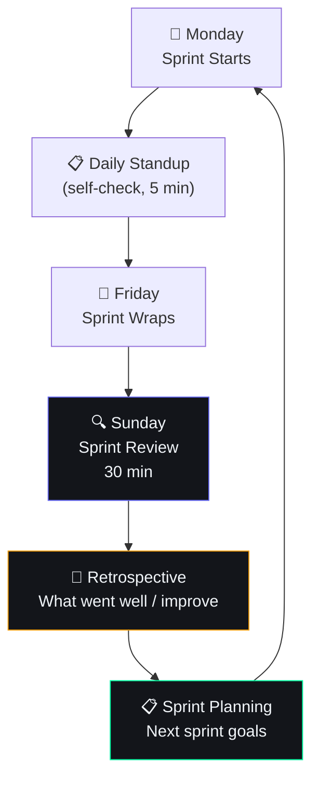

# Sprint Review Process

## Document Control

| Field | Value |
|---|---|
| Document ID | OPS-SPR-013 |
| Version | 1.0.0 |
| Status | Approved |
| Date | 2026-07-10 |
| Classification | Internal |
| Owner | Developer |

---

## 1. Executive Summary

### Purpose
Define the sprint review process for Second Brain OS. Sprint reviews are lightweight, single-developer retrospectives to assess what was accomplished, what went well, what could improve, and what to prioritize next.

### Format
- **Frequency:** Weekly (every Sunday)
- **Duration:** 30 minutes
- **Participants:** Developer (self-review)
- **Output:** Sprint review document + updated backlog

---

## 2. Sprint Review Cycle



---

## 3. Sprint Review Template

```markdown
# Sprint Review — Week [N]

**Date:** YYYY-MM-DD
**Sprint:** Week [N] of [Month]
**Theme:** [Monthly theme]

## 🎯 Sprint Goal
[One-line goal for the sprint]

## ✅ Completed
| Task | Module | Estimate | Actual | Notes |
|---|---|---|---|---|
| [Task 1] | [Module] | [N] hrs | [N] hrs | |
| [Task 2] | [Module] | [N] hrs | [N] hrs | |

## ❌ Incomplete / Carried Over
| Task | Reason | New Estimate |
|---|---|---|
| [Task 1] | [Reason] | [N] hrs |

## 📊 Metrics Snapshot
| KPI | Current | Last Week | Change |
|---|---|---|---|
| Task completion rate | [N]% | [N]% | ±[N]% |
| AI fallback rate | [N]% | [N]% | ±[N]% |
| Module adoption | [N]/27 | [N]/27 | ±[N] |

## 🏆 Wins
1. [Win 1]
2. [Win 2]

## 🧱 Blockers
1. [Blocker 1] — [Mitigation]
2. [Blocker 2] — [Mitigation]

## 💡 Ideas for Next Sprint
- [Idea 1]
- [Idea 2]

## 📋 Next Sprint Plan
**Theme:** [Next theme]
**Top 3 priorities:**
1. [Priority 1]
2. [Priority 2]
3. [Priority 3]
```

---

## 4. Daily Standup (Self-Check)

```markdown
# Daily Standup — [Date]

## Yesterday
- [What I worked on]
- [What I completed]

## Today
- [What I'm working on]

## Blockers
- [Anything blocking progress]

## Metrics Check (30s)
- API error rate: [N]%
- AI fallback rate: [N]%
- Tasks completed today: [N]
```

---

## 5. Sprint Retrospective

### 5.1 Retrospective Format (Weekly)

```
┌─────────────────────────────────────┐
│  💭 Sprint Retrospective — Week N   │
├──────────────────┬──────────────────┤
│  Keep Doing ✅   │  Stop Doing ❌   │
├──────────────────┼──────────────────┤
│  • [Practice 1]  │  • [Practice 1]  │
│  • [Practice 2]  │  • [Practice 2]  │
├──────────────────┼──────────────────┤
│  Start Doing ➕  │  Improve 🔧      │
├──────────────────┼──────────────────┤
│  • [Practice 1]  │  • [Practice 1]  │
│  • [Practice 2]  │  • [Practice 2]  │
└──────────────────┴──────────────────┘

## Actions for Next Sprint
- [ ] Action 1
- [ ] Action 2
```

### 5.2 Monthly Deep Retrospective

Questions to answer:
1. **Velocity:** Did I complete what I planned? If not, why?
2. **Quality:** How many bugs were introduced? Fixed?
3. **Focus:** Did I context-switch too much?
4. **Tooling:** Are my tools working for me or against me?
5. **Health:** Am I maintaining sustainable pace?

---

## 6. Sprint Planning

### 6.1 Priority Tiers

| Tier | Definition | Examples | Capacity Allocation |
|---|---|---|---|
| **P0 — Critical** | Must do this sprint | Bug fix, security patch, production issue | 50% |
| **P1 — High** | Important, planned feature | New module, AI agent improvement | 30% |
| **P2 — Medium** | Nice to have | Enhancement, minor feature | 15% |
| **P3 — Low** | If time permits | Refactor, tech debt, docs | 5% |

### 6.2 Capacity Planning

| Day | Available Hours | Meeting Hours | Coding Hours |
|---|---|---|---|
| Monday | 4 | 0 | 4 |
| Tuesday | 4 | 0 | 4 |
| Wednesday | 2 | 0 | 2 |
| Thursday | 4 | 0 | 4 |
| Friday | 2 | 0 | 2 |
| **Week Total** | **16** | **0** | **16** |

**Sprint capacity:** ~16 coding hours per week (varies by schedule)
**Buffer:** 20% for unexpected issues (~3 hours)
**Effective capacity:** ~13 hours per sprint

---

## 7. Metrics to Track

| Metric | Why It Matters | Review Frequency |
|---|---|---|
| Planned vs completed tasks | Sprint accuracy estimate | Weekly |
| Bugs found vs fixed | Code quality trend | Weekly |
| Time spent by category | Where time actually goes | Monthly |
| AI feature usage | Product-market fit | Monthly |
| Module completion | Progress toward milestones | Weekly |

---

## 8. Performance Targets

| Metric | Target |
|---|---|
| Planned task completion | > 70% |
| Sprint review duration | < 30 minutes |
| Retrospective action items completed | > 80% |
| Time between review and next planning | < 24 hours |

---

## 9. Edge Cases

| Edge Case | Handling |
|---|---|
| Sprint interrupted by emergency | Adjust scope, don't extend sprint |
| No tasks completed | Honest retrospective, adjust planning |
| Holiday week | 50% capacity, don't overcommit |
| Sick week | Cancel sprint, resume next week |

---

## 10. Failure Scenarios

| Scenario | Impact | Mitigation |
|---|---|---|
| Overcommitment every sprint | Burnout, missed deadlines | Reduce P0 items per sprint |
| No measurable progress | Wasted sprints | Define clear sprint goals |
| Retrospective fatigue | Skipped reviews | Keep it light, 5 min if rushed |

---

## 11. Risks

| Risk | Likelihood | Impact | Mitigation |
|---|---|---|---|
| Single-developer blind spots | High | Medium | External feedback monthly |
| Scope creep during sprint | Medium | Medium | Freeze scope after planning |
| Context switching overhead | High | Medium | Time-blocking, theme days |

---

## 12. Related Documents

| Document | Relation |
|---|---|
| docs/operations/00_SprintPlan.md | Sprint backlog and plan |
| docs/operations/01_Backlog.md | Full backlog management |
| docs/product/07_AcceptanceCriteria.md | Feature acceptance |
| docs/operations/IMPLEMENTATION_STATUS.md | Long-term progress tracking |

---

## 13. Appendices

### 13.1 Tools

| Tool | Purpose |
|---|---|
| GitHub Projects | Sprint board |
| GitHub Issues | Task tracking |
| AGENTS.md | Long-term roadmap reference |
| CHANGELOG.md | Release history |

### 13.2 Quick Reference Card

```bash
# Start sprint
gh issue list --label "sprint-$(date +%V)" --json title,number

# Review sprint
gh issue list --label "sprint-$(date +%V)" --state closed
gh issue list --label "sprint-$(date +%V)" --state open

# Generate report
python scripts/generate_sprint_report.py --week $(date +%V)
```
