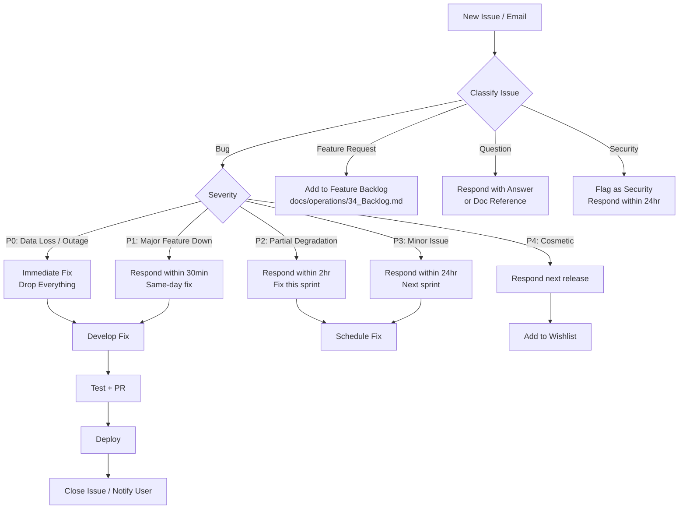
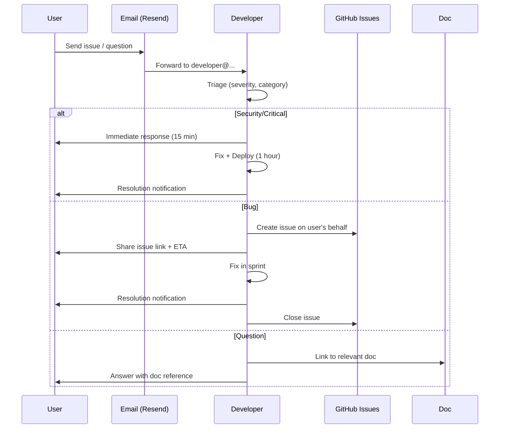

# Support Processes — Second Brain OS

## Document Control

| Field | Value |
|---|---|
| Document ID | OPS-SUP-008 |
| Version | 1.0.0 |
| Status | Approved |
| Date | 2026-07-10 |
| Classification | Internal |
| Owner | Developer |

---

## Table of Contents

- [1. Executive Summary](#1-executive-summary)
- [2. Purpose](#2-purpose)
- [3. Scope](#3-scope)
- [4. Business Context](#4-business-context)
- [5. Functional Specification](#5-functional-specification)
- [6. Non-Functional Requirements](#6-non-functional-requirements)
- [7. Architecture](#7-architecture)
- [8. Diagrams](#8-diagrams)
- [9. Data Models](#9-data-models)
- [10. APIs](#10-apis)
- [11. Security](#11-security)
- [12. Performance Targets](#12-performance-targets)
- [13. Edge Cases](#13-edge-cases)
- [14. Failure Scenarios](#14-failure-scenarios)
- [15. Risks & Mitigations](#15-risks--mitigations)
- [16. Acceptance Criteria](#16-acceptance-criteria)
- [17. Traceability](#17-traceability)
- [18. Implementation Notes](#18-implementation-notes)
- [19. Testing Strategy](#19-testing-strategy)
- [20. References](#20-references)

---

## 1. Executive Summary

Second Brain OS provides support through a structured tier system designed for a single-developer operation. Users access support via GitHub Issues (for bugs and feature requests) and direct email for critical issues. The tier structure routes problems efficiently: Tier 1 is self-serve via documentation, Tier 2 is GitHub Issues triaged by the developer, and Tier 3 is direct developer escalation. SLAs are defined per severity level, with transparent response time expectations.

---

## 2. Purpose

Support processes ensure users receive timely, consistent assistance with their issues. Clear SLAs set user expectations, and the tiered structure protects the developer's time by routing common issues to self-serve resources. Without formal support processes, every user query requires direct developer attention, which does not scale.

---

## 3. Scope

This document covers:

- Support channels (GitHub Issues, email)
- Tier structure (T1, T2, T3)
- Issue triage and severity classification
- SLA by severity (P0-P4)
- Bug report and feature request templates
- Escalation path
- Frequently Asked Questions (FAQ)

Out of scope: phone support, live chat, 24/7 support, paid support plans, SLAs for third-party services (Supabase, Vercel, Railway).

---

## 4. Business Context

As a personal productivity tool used primarily by the developer, the support load is currently very low. These processes are documented proactively to establish good practices before the user base expands. When the project opens for broader use (college ambassador program, Q4 2026), these processes will be the foundation of the support operation.

---

## 5. Functional Specification

### 5.1 Support Channels

| Channel | Purpose | Availability | SLA |
|---|---|---|---|
| GitHub Issues | Bug reports, feature requests, questions | 24/7 submission | Severity-based |
| Email (`developer@secondbrain-os.com`) | Critical issues, security reports, private matters | Monitored daily | P0: 15min, P1: 30min |
| Documentation | Self-serve, how-to guides, FAQs | Always | Instant |
| Built-in feedback (`POST /api/v1/feedback`) | In-app feedback | 24/7 | Weekly review |

### 5.2 Tier Structure

| Tier | Who | Capabilities | Escalation |
|---|---|---|---|
| T1 | User (self-serve) | Documentation search, FAQ, known issues | Creates GitHub Issue |
| T2 | Developer | Issue triage, bug fix, workaround, feature evaluation | Technical escalation |
| T3 | Developer (deep dive) | Architecture change, security audit, data recovery | Postmortem |

### 5.3 Issue Triage Process



### 5.4 SLA by Severity

| Severity | Response Time | Fix Time | Example |
|---|---|---|---|
| P0 | 15 minutes | 1 hour | API completely down, data loss, security breach |
| P1 | 30 minutes | 4 hours | AI not responding, scheduler stopped |
| P2 | 2 hours | 24 hours | One module failing, slow responses |
| P3 | 24 hours | Next sprint | UI glitch, typo, minor edge case |
| P4 | Next release | Next release | Enhancement, cosmetic issue |

### 5.5 Bug Report Template

```markdown
## Bug Report

**Severity:** P0 / P1 / P2 / P3 / P4

**Environment:**
- OS: [e.g., Windows 11, macOS 14]
- Browser: [e.g., Chrome 126, Firefox 128]
- Version: [e.g., v1.2.3 or commit SHA]

**Description:**
[Clear, concise description of the bug]

**Steps to Reproduce:**
1. Go to [page]
2. Click [button]
3. See error

**Expected Behaviour:**
[What should happen]

**Actual Behaviour:**
[What actually happens]

**Screenshots / Logs:**
[Attach if applicable]

**Request ID (from browser network tab):**
[If available, from X-Request-ID header]
```

### 5.6 Feature Request Template

```markdown
## Feature Request

**Module:** [e.g., Tasks, Habits, AI Chat]

**Problem:**
[What problem does this feature solve?]

**Proposed Solution:**
[How should the feature work?]

**Alternatives Considered:**
[Other approaches you considered]

**Priority:** Critical / High / Medium / Low

**Use Case:**
[Describe your specific use case]
```

### 5.7 Escalation Path

```
T1 Issue → User creates GitHub Issue
    ↓
T2 Developer triages within SLA
    ↓
T3 → If technical complexity requires architecture change:
    ↓
    Developer opens ADR
    ↓
    Implements change
    ↓
    Updates documentation
    ↓
    Closes issue
```

---

## 6. Non-Functional Requirements

| ID | Requirement | Target |
|---|---|---|
| SUP-NFR-001 | GitHub Issue response time (P0) | < 15 minutes |
| SUP-NFR-002 | GitHub Issue response time (P3) | < 24 hours |
| SUP-NFR-003 | Email response time | < 24 hours (all) |
| SUP-NFR-004 | Documentation up-time | Always available |
| SUP-NFR-005 | Issue resolution rate | > 90% within SLA |
| SUP-NFR-006 | Feedback loop closure | 100% of issues receive resolution notice |

---

## 7. Architecture

```mermaid
flowchart TD
    subgraph Users["Users"]
        DevUser[Single Developer User]
        FutureUser[Future Users<br/>College Program]
    end

    subgraph Channels["Support Channels"]
        GH[GitHub Issues<br/>Public / Anonymous]
        Email[Email<br/>developer@...]
        Doc[Documentation<br/>docs/]
        Feedback[In-App Feedback<br/>POST /api/v1/feedback]
    end

    subgraph Triage["Triage System"]
        Auto[Auto-Classification<br/>Labels + Severity]
        Manual[Manual Review<br/>Developer]
        Backlog[Feature Backlog<br/>docs/operations/34_Backlog.md]
    end

    subgraph Resolution["Resolution"]
        Fix[Bug Fix / Feature]
        Answer[Answer / Workaround]
        Docs[Documentation Update]
        Patch[Security Patch]
    end

    Users --> Channels
    Channels --> Triage
    Triage --> Resolution
    Resolution --> Users
```

---

## 8. Diagrams

### 8.1 Email Support Flow



---

## 9. Data Models

### 9.1 Feedback Schema

```python
class FeedbackEntry(BaseModel):
    id: str
    user_id: str
    type: str  # bug, feature, general
    message: str
    severity: Optional[str]  # P0-P4
    module: Optional[str]
    created_at: datetime
    status: str = "open"  # open, acknowledged, in_progress, resolved, closed
    resolution: Optional[str]
    resolved_at: Optional[datetime]
```

---

## 10. APIs

| Endpoint | Method | Purpose |
|---|---|---|
| `/api/v1/feedback/` | POST | Submit feedback/bug report in-app |
| `/api/v1/feedback/summary` | GET | View feedback summary |

---

## 11. Security

- Security issues reported via email are flagged for immediate attention
- GitHub Issues are public; users should not include secrets, tokens, or personal data
- Email communications are encrypted in transit (TLS)
- In-app feedback (`POST /api/v1/feedback`) is authenticated; user_id is validated
- Bug reports should sanitise stack traces for PII before sharing

---

## 12. Performance Targets

| Metric | Target |
|---|---|
| P0 response time | < 15 minutes |
| P3 response time | < 24 hours |
| First response for all issues | < 2 business days |
| Issue resolution rate | > 90% within SLA |
| Documentation search success | User finds answer in < 5 minutes |

---

## 13. Edge Cases

| Edge Case | Handling |
|---|---|
| Issue submitted with no severity | Default to P3; developer reclassifies |
| Duplicate issue reported | Close as duplicate; link to original |
| Issue reported in wrong language | Reply in English; use translation tool if needed |
| Abusive or spam issue | Close immediately; block user if repeated |
| P0 reported outside business hours | Best-effort response; no on-call guarantee |
| Feature request already exists | Link to existing request; add +1 vote |

---

## 14. Failure Scenarios

| Scenario | Impact | Mitigation |
|---|---|---|
| Email provider (Resend) down | Missing critical issue reports | Monitor email delivery; switch to backup provider |
| GitHub Issues inaccessible | No bug tracking | Use email as fallback; restore when GitHub is available |
| Developer unavailable (illness/vacation) | SLA breach | Set auto-responder; document expected return |
| Feedback database full | Lost in-app feedback | Auto-cleanup feedback > 90 days old |
| User reports issue without details | Slow triage | Respond with template; ask for missing information |

---

## 15. Risks & Mitigations

| Risk | Likelihood | Impact | Mitigation |
|---|---|---|---|
| Single point of failure (one developer) | High | High | Document all processes; open-source for community contributions |
| Support volume exceeds capacity (post-launch) | Medium | High | Scale T1 (docs); limit support to GitHub Issues only |
| Users expect 24/7 support | Medium | Medium | Communicate SLA clearly; set expectations in README |
| Security report mishandled | Low | High | Security reporting process (SECURITY.md); encrypted email |

---

## 16. Acceptance Criteria

- [ ] GitHub Issue templates are configured for bugs and features
- [ ] Email (developer@...) is configured and monitored
- [ ] In-app feedback endpoint is operational
- [ ] SLA response targets are published to users
- [ ] All support channels are documented with expected response times
- [ ] FAQ section is maintained in this document

---

## 17. Traceability

| Requirement | Covered By | Verified By |
|---|---|---|
| SUP-NFR-001 | Email notification test | Manual email send + timer |
| SUP-NFR-002 | Issue response tracking | GitHub issue timeline |
| SUP-NFR-004 | Documentation availability | Link checker |
| SUP-NFR-005 | Issue resolution audit | Monthly review |

---

## 18. Implementation Notes

### 18.1 Support Response Templates

**P0 Acknowledgement:**
> Thank you for reporting this critical issue. I have received your report and am investigating. You can expect a fix within 1 hour. I will update this issue with progress. — Developer

**Bug Report Acknowledgement:**
> Thank you for the detailed bug report. I have reproduced the issue and added it to the sprint backlog. Target fix: [date]. — Developer

**Feature Request Acknowledgment:**
> Thank you for the feature suggestion. I have added it to the roadmap for evaluation. It will be prioritised based on impact and alignment with the product vision. — Developer

### 18.2 FAQ

| Question | Answer |
|---|---|
| How do I get started? | See `docs/operations/44_DeveloperOnboarding.md` or the project README. |
| Where do I report a bug? | Open a GitHub Issue using the bug report template. |
| How can I request a feature? | Open a GitHub Issue using the feature request template. |
| Is my data secure? | Yes. See `docs/security/24_Security.md` for details. |
| How do I export my data? | Use `GET /api/v1/data/export` for GDPR-compliant export. |
| How often is the app updated? | Weekly releases on Monday. Emergency patches as needed. |
| Can I self-host? | The project is designed for single-user use. Self-hosting guides are planned. |
| How do I contribute? | See `CONTRIBUTING.md` and `docs/operations/Contributing.md`. |

---

## 19. Testing Strategy

| Test Type | Scope | Location |
|---|---|---|
| Integration | Feedback API create + read | `tests/test_api_endpoints.py` |
| Integration | Feedback summary endpoint | `tests/test_api_endpoints.py` |
| Manual | Email delivery test | Monthly email test |
| Manual | GitHub Issue template validation | Upon template update |
| E2E | User creates issue → resolution | Manual walkthrough |

---

## 20. References

| Reference | Description |
|---|---|
| [Incident Response](./40_IncidentResponse.md) | P0-P4 severity framework |
| [SLA](./43_SLA.md) | Service level agreement details |
| [Contributing](../operations/Contributing.md) | How to contribute to the project |
| [Feedback System](../ai/20_Agent.md) | In-app feedback integration |
| [Runbooks](./39_Runbooks.md) | Developer runbooks for common fixes |
| [Security Policy](../../SECURITY.md) | Vulnerability disclosure process |

---

## Revision History

| Version | Date | Author | Changes |
|---|---|---|---|
| 1.0.0 | 2026-07-10 | Developer | Initial support processes document |
