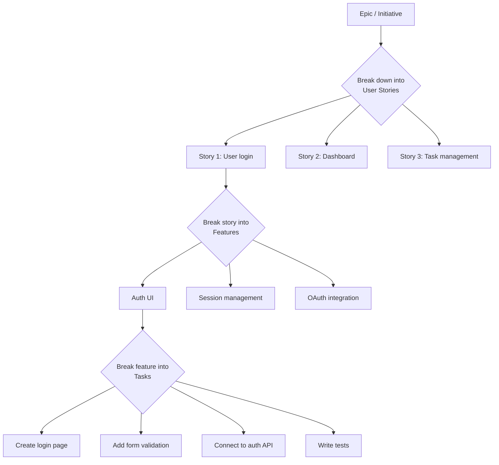
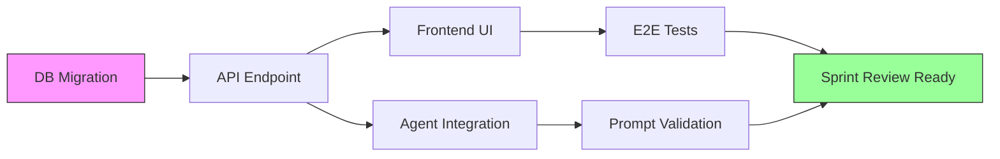

# Task Breakdown

> **Document ID:OPS-TSK-001 SB-OPS-TASK-005  
> **Version:** 2.0.0  
> **Status:** Active  
> **Last Updated:** 2026-06-11  
> **Classification:** Internal — Development Process  
> **Owner:** Lead Developer  

---

## Table of Contents

1. [Task Decomposition Methodology](#1-task-decomposition-methodology)
2. [Task Size Guidelines](#2-task-size-guidelines)
3. [Task Template](#3-task-template)
4. [Task Types and Subtask Breakdown Patterns](#4-task-types-and-subtask-breakdown-patterns)
5. [Estimation Techniques](#5-estimation-techniques)
6. [Task Dependencies Management](#6-task-dependencies-management)
7. [Task Prioritization Framework](#7-task-prioritization-framework)
8. [Sprint Capacity Planning](#8-sprint-capacity-planning)
9. [Tracking Tools](#9-tracking-tools)
10. [Task Lifecycle States](#10-task-lifecycle-states)
11. [Definition of Ready Per Task](#11-definition-of-ready-per-task)
12. [Appendices](#12-appendices)

---

## 1. Task Decomposition Methodology

### 1.1 Decomposition Hierarchy

```
Epic (Multi-sprint initiative)
    │
    â–¼
User Story (User-valuable feature — fits in 1 sprint)
    │
    â–¼
Feature (Logical unit of work — 1-3 days)
    │
    â–¼
Task (Individual work item — 2-8 hours)
    │
    â–¼
Subtask (Granular action — < 2 hours, optional)
```

### 1.2 Decomposition Rules

| Level | Duration | Story Points | Responsible | Completeness Check |
|---|---|---|---|---|
| Epic | 2-6 sprints | 40-100+ | Product Owner | Milestone achieved |
| User Story | 1-3 days | 5-13 | Product Owner | Acceptance criteria met |
| Feature | 1-2 days | 3-8 | Tech Lead | Feature complete |
| Task | 2-8 hours | 1-3 | Developer | DoD checklist |
| Subtask | < 2 hours | Not estimated | Developer | Subtask completed |

### 1.3 Decomposition Process



**Step-by-step decomposition workflow:**

1. **Start with the epic** — What is the high-level goal?
2. **Identify user stories** — What value does each user get?
3. **Break stories into features** — What technical capabilities are needed?
4. **Split features into tasks** — What are the individual work items?
5. **Optionally create subtasks** — What are the exact steps for each task?

### 1.4 Decomposition Heuristics

| If a story/feature is... | Then... |
|---|---|
| > 13 story points | Split into multiple stories |
| > 3 days of work | Split into multiple features |
| > 8 hours for one task | Break into smaller tasks |
| Understood by only 1 person | Need knowledge sharing first |
| Dependent on 3+ other items | Escalate dependency resolution |
| Not testable in isolation | Restructure to make testable |

### 1.5 INVEST Principle for User Stories

| Letter | Meaning | Question |
|---|---|---|
| **I** | Independent | Can it be developed independently? |
| **N** | Negotiable | Is there room for discussion? |
| **V** | Valuable | Does it deliver value to users? |
| **E** | Estimable | Can the team estimate it? |
| **S** | Small | Is it small enough to fit in a sprint? |
| **T** | Testable | Can we verify it's done? |

---

## 2. Task Size Guidelines

### 2.1 Size Limits

| Metric | Optimal | Maximum | Action if Exceeded |
|---|---|---|---|
| Duration | < 4 hours (half day) | 3 days | Split into 2+ tasks |
| Story points | 1-3 points | 8 points | Split into 2+ tasks |
| Lines of code | < 100 lines | 400 lines (per PR) | Split into stacked PRs |
| Files changed | 1-5 files | 15 files | Split by concern |
| Dependencies | 0-2 | 5 | Resolve dependencies first |

### 2.2 Breaking Down Large Tasks

**Task > 3 days: Break by concern**

```
❌ BAD: Large task
"Build task management feature" (5 days, 8 points)

✅ GOOD: Broken down
1. "Create task API endpoints"          (2 days, 3 points)
2. "Build task list UI component"       (1 day, 2 points)
3. "Add task creation form"             (1 day, 2 points)
4. "Implement task filtering & search"  (1 day, 2 points)
```

**Task > 3 days: Break by layer**

```
1. "Backend: task CRUD API"             (1 day, 2 points)
2. "Frontend: task data fetching layer" (1 day, 2 points)
3. "Frontend: task UI components"       (1 day, 2 points)
4. "Testing: integration + E2E tests"   (0.5 day, 1 point)
```

### 2.3 Task Granularity Examples

| Granularity | Duration | Example |
|---|---|---|
| Too coarse | 1 week | "Build the entire dashboard" |
| Good | 1-2 days | "Create daily briefing API endpoint" |
| Good | 4-8 hours | "Add form validation to login page" |
| Too fine | 15 minutes | "Rename variable 'x' to 'userCount'" |

### 2.4 Time Boxing for Unknown Tasks

When a task involves unknowns (spike/research), timebox it:

```markdown
## Timeboxed Task Template

**Task:** Research vector database options
**Timebox:** 4 hours (no more)
**Goal:** Recommend primary and secondary vector DB choices

**Research questions:**
1. What vector DBs work with Supabase?
2. What is the pricing model?
3. What is the setup complexity?
4. What is the query performance?

**Output:** 1-page comparison doc with recommendation

**Decision point:** After 4 hours, present findings; decide to continue or pivot
```

---

## 3. Task Template

### 3.1 Standard Task Template

```markdown
---
title: "[Module] Brief task description"
labels: [type/feature, module/<module>]
assignees: [username]
milestone: SB-YY.SN
---

## Description

[Clear description of what needs to be done. Include context and motivation.]

## Acceptance Criteria

- [ ] [Criterion 1 — specific, measurable, testable]
- [ ] [Criterion 2 — specific, measurable, testable]
- [ ] [Criterion 3 — specific, measurable, testable]

## Technical Notes

- [Implementation approach or design decisions]
- [Relevant files or modules that need to be modified]
- [Any known constraints or gotchas]

## Files to Modify

- `apps/api/app/api/<module>.py` — [what changes]
- `apps/web/app/<module>/page.tsx` — [what changes]
- `packages/ai/agents/<agent>.py` — [what changes]

## Dependencies

### Blocked By
- #[issue-number] — [description of dependency]
- #[issue-number] — [description of dependency]

### Blocks
- #[issue-number] — [description of what this blocks]

## Effort

- Story Points: [1|2|3|5|8]
- T-shirt Size: [XS|S|M|L]
- Estimated Hours: [hours]

## Definition of Ready Checklist

- [ ] Acceptance criteria are clear and testable
- [ ] Dependencies are identified
- [ ] Technical approach is defined
- [ ] Design is approved (if UI change)
- [ ] Task is estimated
- [ ] Task is sized correctly (< 3 days)

## Testing Notes

- [What to test, edge cases to consider]
- [Unit tests needed? Integration tests? E2E?]
```

### 3.2 Bug Fix Task Template

```markdown
---
title: "fix([module]): [brief description of bug]"
labels: [type/bug, severity/<severity>]
assignees: [username]
---

## Bug Description

[Clear description of the bug, including what happens vs what should happen]

## Steps to Reproduce

1. Go to [page]
2. Click on [element]
3. Scroll to [position]
4. See error: [actual behavior]

## Expected Behavior

[What should happen instead]

## Environment

- Browser: [Chrome/Firefox/Safari/Edge] [version]
- OS: [Windows/macOS/Linux]
- Device: [Desktop/Tablet/Mobile]
- App Version: [version or commit]

## Screenshots / Logs

[Attach screenshots, console logs, or error messages]

## Root Cause Analysis

[To be filled during investigation]

## Technical Notes

- [Relevant files, modules, or functions]
- [Suspected cause]

## Checklist

- [ ] Bug reproduced in dev environment
- [ ] Root cause identified
- [ ] Unit test added (that fails without fix)
- [ ] Fix implemented
- [ ] Regression tests pass
- [ ] PR created
- [ ] Deployed (if critical)
```

### 3.3 Tech Debt Task Template

```markdown
---
title: "refactor([module]): [description]"
labels: [type/tech-debt]
assignees: [username]
---

## Current State

[Description of the current code or architecture problem]

## Problem

- [Issue 1: e.g., slow performance]
- [Issue 2: e.g., hard to test]
- [Issue 3: e.g., duplicate code]

## Target State

[Description of the desired state after refactoring]

## Migration Plan

1. [Step 1: e.g., Extract function]
2. [Step 2: e.g., Move to new module]
3. [Step 3: e.g., Update references]
4. [Step 4: e.g., Remove old code]

## Risk Assessment

- Risk level: [Low/Medium/High]
- Behavior change: [None/Minimal/Some]
- Rollback plan: [How to revert]

## Verification

- [ ] Existing tests pass with no changes
- [ ] Performance benchmarks within 5% of baseline
- [ ] Manual smoke test of affected features
```

---

## 4. Task Types and Subtask Breakdown Patterns

### 4.1 Frontend Feature Breakdown

```
Story: "As a user, I want to view my tasks with priority sorting"

Feature: Task list with priority sorting

Tasks:
├── 1. API Layer (2 points)
│   ├── Create API endpoint: GET /api/tasks?sort=priority
│   ├── Add TypeScript types for priority sort params
│   └── Write API integration tests
│
├── 2. Data Fetching (1 point)
│   ├── Create useTasks hook with sort parameter
│   ├── Add loading and error states
│   └── Implement optimistic updates
│
├── 3. UI Components (3 points)
│   ├── Build TaskList component with sort dropdown
│   ├── Create PriorityBadge component
│   ├── Implement drag-to-reorder (priority-based)
│   └── Add empty state and error state
│
├── 4. State Management (1 point)
│   ├── Add sort preference to Zustand store
│   ├── Persist sort preference to localStorage
│   └── Handle edge case: no tasks to sort
│
├── 5. Styling (1 point)
│   ├── CSS for priority indicators
│   ├── Responsive layout adjustments
│   └── Dark mode compliance
│
└── 6. Tests (2 points)
    ├── Unit tests for sorting logic
    ├── Component tests for TaskList
    ├── Integration tests for API + fetch
    └── E2E test for full flow
```

### 4.2 Backend Endpoint Breakdown

```
Task: Create task CRUD API endpoint

Subtasks:
├── 1. Data Model (1 hour)
│   ├── Define Pydantic schemas (TaskCreate, TaskUpdate, TaskResponse)
│   ├── Validate fields (title length, priority enum, due_date format)
│   └── Add OpenAPI examples
│
├── 2. Database (1 hour)
│   ├── Write Supabase migration (if table doesn't exist)
│   ├── Add RLS policy for user isolation
│   └── Add indexes on commonly queried fields
│
├── 3. Route Handler (2 hours)
│   ├── Create CRUD functions (create, read, update, delete, list)
│   ├── Add error handling (404, 400, 500)
│   ├── Add pagination for list endpoint
│   └── Implement query parameters (filter, sort, search)
│
├── 4. Validation (1 hour)
│   ├── Input sanitization
│   ├── Business rule validation (due_date not in past)
│   └── Permission validation (user_id matches auth)
│
├── 5. Tests (2 hours)
│   ├── Unit tests for validation logic
│   ├── Integration tests for each CRUD operation
│   ├── Test error cases (invalid input, missing record)
│   └── Test RLS policy enforcement
│
└── 6. Documentation (30 min)
    ├── Update OpenAPI schema
    ├── Add examples to API docs
    └── Update endpoint inventory
```

### 4.3 Agent Module Breakdown

```
Story: "ARIA should generate daily briefings with AI"

Feature: Daily Briefing Agent (A09)

Tasks:
├── 1. Prompt Engineering (3 points)
│   ├── Create prompts/agents/briefing_agent.md with YAML frontmatter
│   ├── Define output JSON schema (tasks_summary, courses_progress, etc.)
│   ├── Write 5+ few-shot examples
│   ├── Document edge cases and anti-patterns
│   └── Run validate_prompts.py — pass with zero errors
│
├── 2. Agent Module (3 points)
│   ├── Create packages/ai/agents/briefing_agent.py
│   ├── Import from PromptLoader: prompts.get_agent("briefing_agent")
│   ├── Implement generate_briefing(user_id) async function
│   ├── Add fallback prompt (hardcoded inline string)
│   ├── Parse LLM response as JSON with validation
│   └── Handle LLM failure gracefully (return default briefing)
│
├── 3. Database Integration (2 points)
│   ├── Create daily_briefings table in Supabase
│   ├── Add RLS policy
│   ├── Create Pydantic schemas
│   └── Create API endpoint: GET /api/briefings/latest
│
├── 4. Scheduler Integration (2 points)
│   ├── Add cron job in services/scheduler/main.py
│   ├── Configure trigger at 7:00 AM daily
│   ├── Add error handling and retry logic
│   └── Add logging for monitoring
│
├── 5. Frontend UI (2 points)
│   ├── Create dashboard briefing card component
│   ├── Format LLM output for display
│   ├── Add loading skeleton
│   ├── Add refresh button
│   └── Handle case: no briefing available yet
│
└── 6. Testing (2 points)
    ├── Prompt content tests (tests/test_agent_prompts.py)
    ├── Agent unit tests (mock LLM, verify parsing)
    ├── Integration test (scheduler → agent → database)
    └── Manual testing with real LLM
```

### 4.4 Bug Fix Breakdown

```
Task: Fix login redirect loop when token expires

Subtasks:
├── 1. Reproduce (30 min)
│   ├── Set up test scenario: expired token
│   ├── Document exact reproduction steps
│   └── Capture error logs
│
├── 2. Locate Root Cause (1 hour)
│   ├── Trace auth middleware flow
│   ├── Identify where redirect is triggered
│   └── Determine why refresh isn't happening first
│
├── 3. Fix Implementation (2 hours)
│   ├── Move token expiry check after refresh attempt
│   ├── Add max redirect counter (3) to prevent infinite loops
│   ├── Add toast notification on token refresh failure
│   └── Minimize diff (only touch affected lines)
│
├── 4. Tests (1 hour)
│   ├── Add unit test for token refresh flow
│   ├── Add integration test for expired token handling
│   └── Verify no regression in other auth flows
│
└── 5. Deploy (30 min)
    ├── Create PR with bug fix
    ├── Deploy to production
    └── Verify fix with smoke test
```

### 4.5 Refactoring Breakdown

```
Task: Refactor PromptLoader for better error handling

Subtasks:
├── 1. Map Current State (1 hour)
│   ├── Document current PromptLoader architecture
│   ├── Identify pain points (error handling, caching)
│   └── Read all current consumers
│
├── 2. Plan Migration (1 hour)
│   ├── Design new error handling approach
│   ├── Define new public API
│   └── Write migration plan
│
├── 3. Execute Refactoring (4 hours)
│   ├── Add error handling for YAML parse failures
│   ├── Add caching layer with TTL
│   ├── Add logging for debug
│   └── Update type hints
│
├── 4. Verify (1 hour)
│   ├── Run existing tests — all pass unchanged
│   ├── Add new tests for error scenarios
│   └── Manual test with malformed prompt files
│
└── 5. Clean Up (30 min)
    ├── Remove deprecated methods
    ├── Update documentation
    └── Mark migration task as complete
```

### 4.6 Task Breakdown by Module (Second Brain OS)

| Module | Typical Tasks | Avg Points |
|---|---|---|
| Tasks API | CRUD endpoint, filtering, sorting, prioritization | 2-3 |
| Tasks UI | List view, create form, drag-drop, search | 3-5 |
| Courses | Progress tracking, enrollment, deadlines | 2-5 |
| Habits | Streak calculation, logging, calendar view | 3-5 |
| Sleep | Logging, score calculation, wind-down | 2-3 |
| Income | Entry logging, hourly rate, reporting | 2-3 |
| Projects | Phase management, blocker tracking | 3-5 |
| Ideas | Pipeline management, voting, evaluation | 2-3 |
| Resources | CRUD, tagging, search | 2-3 |
| Opportunities | Matching algorithm, scoring, notifications | 3-5 |
| Time | Pomodoro timer, deep work tracking, stats | 3-5 |
| AI Agents | Prompt engineering, agent module, fallback | 3-8 |
| Prompt System | New prompt, validation, testing | 2-5 |
| Scheduler | Cron job, error handling, monitoring | 2-3 |
| Infrastructure | CI/CD, deployment, monitoring | 3-5 |
| Documentation | API docs, README, runbooks | 1-2 |

---

## 5. Estimation Techniques

### 5.1 T-Shirt Sizing → Fibonacci

| T-Shirt | Points | Time Range | Certainty |
|---|---|---|---|
| XS | 1 | < 2 hours | Very high |
| S | 2 | 2-4 hours | High |
| M | 3 | 4-8 hours (1 day) | High |
| L | 5 | 1-2 days | Moderate |
| XL | 8 | 2-3 days | Moderate |
| XXL | 13 | 3-5 days | Low — must split |

### 5.2 Affinity Estimation

For estimating many items quickly:

```
1. Place all stories on a table/board
2. Team silently sorts stories into groups by size
3. Groups are labeled: XS, S, M, L, XL, XXL
4. Review and adjust as a team
5. Convert T-shirt sizes to Fibonacci points
```

**Best for:** Backlog refinement with 10+ unestimated items
**Time:** 15-30 minutes for 20 items
**Accuracy:** ±30% (acceptable for backlog prioritization)

### 5.3 Reference Stories

Fixed reference stories that the team calibrates against:

```markdown
## Reference Stories (1 point)
- Fix a typo in a UI label
- Update a CSS variable in tailwind.config.js
- Add a comment to a function

## Reference Stories (2 points)
- Add form validation to an existing form
- Create a simple CRUD endpoint (following existing pattern)
- Update API documentation for one endpoint

## Reference Stories (3 points)
- Create a new page component with data fetching
- Add a new database table with RLS policies
- Implement a small LLM agent with fallback

## Reference Stories (5 points)
- Build a new module from scratch (backend + frontend)
- Implement a real-time feature with Supabase subscriptions
- Create a dashboard with multiple data sources

## Reference Stories (8 points)
- Implement a complex AI agent with prompt engineering
- Build an E2E feature across all layers
- Major refactoring of a core module

## Reference Stories (13 points)
- Epic-level feature spanning multiple sprints
- Architecture-level change (data model migration)
- Integrating a new external service
```

### 5.4 Estimation Guidelines

| Principle | Description |
|---|---|
| **Relative sizing** | Compare to reference stories, not absolute time |
| **Collective ownership** | Whole team estimates, not just implementer |
| **No anchoring** | Don't reveal your estimate first (use planning poker) |
| **Timebox estimation** | Max 5 minutes per story |
| **Trust the process** | Velocity will calibrate over 3-5 sprints |
| **Don't revise** | Once a story is pointed, points don't change (split instead) |

### 5.5 Common Estimation Anti-Patterns

| Anti-Pattern | Problem | Solution |
|---|---|---|
| "This is like the last one" | False comparison | Break down and re-estimate |
| "It's simple, just 2 points" | Underselling complexity | Add buffer for unknowns |
| "We need to pad for risk" | Over-estimation | Add separate risk/uncertainty task |
| "It's 13 points, but we'll squeeze" | Overcommitment | Split into multiple stories > 13 |
| "Bob can do it in 1 day" | Single-person perspective | Team estimates, not individual |
| "We did this before, same points" | Scope creep ignored | If scope changed, points change |

---

## 6. Task Dependencies Management

### 6.1 Dependency Types

| Type | Description | Example | Resolution |
|---|---|---|---|
| **Technical** | Code depends on other code | Frontend waiting for API | API-first development |
| **External** | Third-party service or team | Waiting for Supabase feature | Escalate, find alternative |
| **Knowledge** | Need expertise from someone | LLM prompt expertise | Pair programming |
| **Data** | Need data to test | Need seed data | Create seed scripts |
| **Decision** | Waiting for decision | Design approval | Set decision deadline |
| **Process** | Blocked by process | Code review pending | SLA enforcement |

### 6.2 Dependency Tracking

**In GitHub Issues, use the linked issues feature:**

```markdown
## Dependencies

### Blocked By (must complete first)
- [ ] #142 — Task API endpoints (Alice) — Due: S7.D3
- [ ] #143 — Database migrations (Bob) — Due: S7.D2

### Blocks (must complete before these can start)
- [ ] #145 — Task list UI (Carol) — Needs API endpoints
- [ ] #146 — Task filtering (Dave) — Needs API endpoints
```

**Dependency status labels:**

| Label | Meaning |
|---|---|
| `status/blocked` | Cannot proceed, waiting on dependency |
| `status/needs-dependency` | Dependency identified, not yet resolved |
| `status/dependency-resolved` | Blocking item complete, ready to proceed |

### 6.3 Dependency Graph



### 6.4 Critical Path Analysis

For complex features, identify the critical path (longest dependent chain):

```
Task: Daily Briefing Agent feature

Chain A (Frontend): 
  API endpoint → Frontend card → Dashboard integration → Tests = 5 days

Chain B (Backend): 
  DB migration → Agent module → Prompt → Scheduler → Tests = 8 days ⬅ CRITICAL

Chain C (Integration):
  Agent + Scheduler → E2E tests → Documentation = 3 days

Critical path = Chain B (8 days)
Schedule buffer = 2 days (for risk)
Total timeline = 10 days = 1 sprint
```

### 6.5 Dependency Resolution SLA

| Dependency Type | Max Wait Time | Escalation |
|---|---|---|
| Code review | 12 hours | Ping reviewer after 12h |
| Design approval | 24 hours | Escalate to Design Lead |
| External team | 48 hours | Escalate to Engineering Manager |
| Decision (PM) | 24 hours | Escalate to Product Owner |
| Technical spike | 4 hours (timebox) | Decide: continue or pivot |

---

## 7. Task Prioritization Framework

### 7.1 RICE Scoring

**Formula:** RICE Score = `(Reach × Impact × Confidence) / Effort`

| Factor | Description | Scale | Weight |
|---|---|---|---|
| **Reach** | How many users per time period? | 0.25 (0.25×) |
| **Impact** | How much impact per user? | 0.35 (0.35×) |
| **Confidence** | How confident are we? | 0.15 (multiplier) |
| **Effort** | How many person-months? | - (divisor) |

**Scoring Guide:**

| Score | Reach (users/quarter) | Impact | Confidence |
|---|---|---|---|
| 5 | All users (1000+) | Massive (core workflow) | Very high (solid data) |
| 4 | Most users (500-1000) | High (major improvement) | High (good data) |
| 3 | Some users (100-500) | Medium (noticeable) | Medium (reasonable) |
| 2 | Few users (10-100) | Low (minor) | Low (educated guess) |
| 1 | Very few (<10) | Minimal (cosmetic) | Very low (wild guess) |

**Effort (person-months):**
- 0.5 = < 1 week
- 1.0 = 1-2 weeks
- 2.0 = 1 month
- 3.0 = 2 months
- 5.0 = 3+ months

**Example RICE Calculation:**

```
Feature: Daily Briefing Agent
Reach: 5 (all users get it daily)
Impact: 4 (significantly improves morning routine)
Confidence: 4 (well-understood, existing patterns)
Effort: 1.0 (2 weeks)

RICE = (5 × 4 × 4) / 1.0 = 80

Feature: Dark mode toggle
Reach: 3 (some users prefer dark mode)
Impact: 2 (nice to have, not critical)
Confidence: 3 (straightforward CSS)
Effort: 0.5 (3 days)

RICE = (3 × 2 × 3) / 0.5 = 36
```

### 7.2 Priority Matrix

```
                    High Impact
                        │
                   ┌────┴────┐
                   │         │
    Low Effort ────┤ DO NOW  │ SCHEDULE ├──── High Effort
                   │ (P0)    │ (P1)     │
                   └────┬────┘
                        │
                   ┌────┴────┐
                   │         │
                   │ DO NEXT │ MAYBE    │
                   │ (P2)    │ (P3/P4)  │
                   └─────────┘
                        │
                    Low Impact
```

### 7.3 Sprint Prioritization Rules

| Rule | Description |
|---|---|
| 60/20/10/10 split | 60% features, 20% tech debt, 10% bugs, 10% docs |
| P0 always first | Critical items go to top of sprint backlog |
| Max 1 P0 per developer | Prevents context switching on critical items |
| Stretch goals | 20% buffer for ambitious items |
| Cut scope, not quality | Remove features before cutting testing |

---

## 8. Sprint Capacity Planning

### 8.1 Per-Developer Capacity

| Role | Daily Hours | Focus Factor | Sprint Hours | Story Points (avg) |
|---|---|---|---|---|
| Full-stack Developer | 6 | 0.75 | 45 | 12-15 |
| Frontend Developer | 6 | 0.75 | 45 | 12-15 |
| Backend Developer | 6 | 0.80 | 48 | 13-16 |
| QA Engineer | 6 | 0.80 | 48 | Not applicable |
| Tech Lead | 5 | 0.50 | 25 | 5-8 |

### 8.2 Capacity Allocation Template

```markdown
## Sprint Capacity Plan — SB-26.S7

### Team Availability

| Name | Role | Days Avail | Hours/Day | Focus | Eff. Hours | Notes |
|---|---|---|---|---|---|---|
| Alice | Dev | 10 | 6 | 0.80 | 48 | Full sprint |
| Bob | Dev | 8 | 6 | 0.75 | 36 | Conference Mon-Tue |
| Carol | Dev | 10 | 6 | 0.80 | 48 | Full sprint |
| Dave | Dev | 10 | 6 | 0.75 | 45 | On-call week 1 |
| Eve | QA | 10 | 6 | 0.80 | 48 | Full sprint |
| **Total** | | **48** | | | **225** | |

### Sprint Goals
1. Feature: Daily Briefing Agent (A09)
2. Feature: Weekly Review Agent (A10)
3. Tech Debt: PromptLoader error handling
4. Bug Fixes: Auth redirect loop

### Capacity Allocation

| Developer | Assignment | Estimated Points |
|---|---|---|
| Alice | A09: Backend + Prompt | 8 |
| Bob | A09: Frontend + Scheduler | 5 |
| Alice | Tech debt: PromptLoader | 3 |
| Carol | A10: Agent + Prompt | 8 |
| Dave | A10: Frontend + Scheduler | 5 |
| Dave | Bug fixes | 3 |
| **Total Committed** | | **32** |
| **Team Velocity (avg)** | | **35** |
| **Forecast Confidence** | | **High (91%)** |
```

### 8.3 Velocity-Based Capacity

```markdown
## Velocity-Based Planning

| Sprint | Velocity |
|---|---|
| SB-26.S4 | 30 |
| SB-26.S5 | 33 |
| SB-26.S6 | 35 |
| **Average** | **32.7** |
| **Std Dev** | **2.5** |

### Forecast Ranges

| Scenario | Calculation | Points |
|---|---|---|
| Conservative | Avg - σ | 30 |
| Expected | Avg | 33 |
| Optimistic | Avg + σ | 35 |

### Recommended Commitment: 30-33 points
```

---

## 9. Tracking Tools

### 9.1 GitHub Issues Configuration

```yaml
# Issue fields configuration
fields:
  - name: Story Points
    type: number
    required: true
    range: [1, 2, 3, 5, 8, 13]

  - name: Priority
    type: single_select
    options: [P0, P1, P2, P3, P4]
    required: true

  - name: Module
    type: single_select
    options: [tasks, courses, habits, goals, sleep, income, projects,
              ideas, resources, opportunities, time, chat, automation,
              agents, prompts, api, web, db, ci, deps, infra, auth]
    required: true

  - name: Sprint
    type: iteration
    required: true

  - name: Status
    type: single_select
    options: [backlog, ready, in-progress, in-review, in-qa, done, deployed]
    required: true
```

### 9.2 Labels

```yaml
# Type
type/feature:     "New functionality"
type/bug:         "Defect fix"
type/tech-debt:   "Refactoring, optimization"
type/docs:        "Documentation"
type/spike:       "Research, investigation"
type/hotfix:      "Emergency production fix"

# Priority
priority/p0:      "Drop everything — critical"
priority/p1:      "High priority"
priority/p2:      "Medium priority"
priority/p3:      "Low priority"
priority/p4:      "Icebox"

# Module
module/tasks:     module/tasks
module/courses:   module/courses
module/habits:    module/habits
module/agents:    module/agents
module/prompts:   module/prompts
module/api:       module/api
module/web:       module/web
module/infra:     module/infra

# Size
size/xs:          "< 2 hours"
size/s:           "2-4 hours"
size/m:           "4-8 hours"
size/l:           "1-2 days"
size/xl:          "2-3 days"

# Status
status/blocked:   "Blocked by dependency"
status/needs-review: "PR submitted"
status/in-qa:     "Awaiting QA verification"
status/needs-dependency: "Dependency not yet resolved"
```

### 9.3 Milestones

```yaml
# Release milestones
milestones:
  - title: v1.0
    description: "Initial production release"
    due_on: 2026-08-16
    
  - title: v1.1
    description: "Feature release"
    due_on: 2026-10-01

# Sprint milestones
  - title: SB-26.S7
    description: "Sprint 7 — AI Agent Integration"
    due_on: 2026-04-12
    
  - title: SB-26.S8
    description: "Sprint 8 — AI Agent Integration"
    due_on: 2026-04-26
```

### 9.4 GitHub Projects Views

```yaml
# Sprint Board View
view: Sprint Board
layout: board
group_by: Status
columns:
  - Backlog
  - Ready
  - In Progress
  - In Review
  - In QA
  - Done
  - Deployed

# Developer View
view: Developer View
layout: table
group_by: Assignee
sort_by: Priority (ascending)

# Dependency View
view: Dependency View
layout: table
filter: "label:status/blocked"
group_by: "Blocked By (linked issues)"

# Velocity View
view: Velocity View
layout: chart
type: bar
x_axis: Milestone
y_axis: Story Points
```

### 9.5 Reporting

| Report | Tool | Frequency | Audience |
|---|---|---|---|
| Sprint Burndown | GitHub Insights | Daily | Team |
| Velocity Chart | GitHub Insights | Per sprint | Team + PM |
| Cycle Time | GitHub Insights | Weekly | Team |
| Blocked Items | Board filter | Daily | Scrum Master |
| PR Review Time | GitHub Pulse | Weekly | Tech Lead |
| Developer Throughput | Custom dashboard | Per sprint | Engineering Manager |

---

## 10. Task Lifecycle States

### 10.1 State Flow

```
                   ┌──────────────────────────────────────┐
                   │                                      │
                   ▼                                      │
┌────────┐   ┌────────┐   ┌────────────┐   ┌──────────┐  │  ┌──────────┐   ┌────────────┐
│Backlog │ → │ Ready  │ → │ In Progress│ → │In Review │  │  │   Done   │ → │  Deployed  │
│        │   │(DoR met)│   │ (Active)   │   │(PR sent)  │  │  │(DoD met) │   │(In prod)   │
└────────┘   └────────┘   └────────────┘   └──────────┘  │  └──────────┘   └────────────┘
                               │               │         │       ▲
                               ▼               ▼         │       │
                          ┌────────────┐   ┌──────────┐  │       │
                          │  Blocked   │   │  In QA   │──┘       │
                          │(Dependency)│   │(QA check)│          │
                          └────────────┘   └──────────┘──────────┘
                                                     (QA failed → back to In Progress)
```

### 10.2 State Definitions

| State | Definition | Responsible | Max Duration | Exit Criteria |
|---|---|---|---|---|
| **Backlog** | Refined but not committed | Product Owner | Indefinite | Sprint planning |
| **Ready** | DoR met, ready for sprint | Scrum Master | 2 weeks | Developer picks up |
| **In Progress** | Active development | Developer | Sprint duration | PR submitted |
| **Blocked** | Waiting on dependency | Developer + SM | 48h before escalation | Dependency resolved |
| **In Review** | PR submitted for review | Reviewer | 24h SLA | At least 1 approval |
| **In QA** | Passed review, in QA testing | QA Engineer | 24h | QA verified |
| **Done** | DoD met, ready for deploy | Developer | 24h | Deployed to production |
| **Deployed** | Live in production | CI/CD | Permanent | Monitoring confirms |

### 10.3 State Transition Rules

| From | To | Condition |
|---|---|---|
| Backlog | Ready | All DoR criteria met |
| Ready | In Progress | Developer self-assigns |
| In Progress | In Review | PR submitted with CI green |
| In Progress | Blocked | Dependency not available — add `status/blocked` label |
| Blocked | In Progress | Dependency resolved — remove label |
| In Review | In QA | 1+ approval received, PR ready for QA |
| In Review | In Progress | Changes requested — address feedback |
| In QA | Done | QA verified, all checks pass |
| In QA | In Progress | QA failed — fix issues |
| Done | Deployed | Merge to main, CD deploys |

---

## 11. Definition of Ready Per Task

### 11.1 Ready Checklist

Every task in the sprint backlog must meet:

```markdown
## Definition of Ready for Tasks

### Clarity
- [ ] Task description is clear and unambiguous
- [ ] Technical approach is defined (how will we build this?)
- [ ] Acceptance criteria are specific and testable
- [ ] All team members understand the task

### Dependencies
- [ ] All blocking dependencies are identified
- [ ] No unresolved external blockers
- [ ] Dependent tasks are visible in the board

### Estimation
- [ ] Task is estimated (points and/or hours)
- [ ] Task duration is < 3 days (if more, split)
- [ ] Task has a size label (XS, S, M, L, XL)

### Completeness
- [ ] Design mockups are approved (if UI change)
- [ ] API contract is defined (if API change)
- [ ] Database changes are reviewed (if DB change)
- [ ] Associated tests are identified

### Environment
- [ ] Required services are available
- [ ] Test data is available (or can be created)
- [ ] Feature flag is configured (if needed)
```

### 11.2 Ready Gate Questions

| Question | Who Answers | Gate |
|---|---|---|
| Is the task clear enough to start? | Developer | Yes/No |
| Are all dependencies resolved? | Scrum Master | Yes/No |
| Is the design approved? | Design Lead (if UI) | Yes/No |
| Is the estimate valid? | Team | ±25% |
| Is test data available? | QA Lead | Yes/No |

---

## 12. Appendices

### Appendix A: Task Breakdown Cheatsheet

```
Legend: Pts = Story Points, Dur = Duration

┌─────────────────────────────────────────────────────────────┐
│           TASK BREAKDOWN — QUICK REFERENCE                   │
├─────────────────────────────────────────────────────────────┤
│                                                             │
│  USER STORY → FEATURES → TASKS → SUBTASKS                   │
│                                                             │
│  Size limits:                                               │
│    Story:   ≤ 13 pts, ≤ 3 days         [If >, split]        │
│    Feature: ≤ 8 pts,  ≤ 2 days         [If >, split]        │
│    Task:    ≤ 3 pts,  ≤ 8 hours        [If >, split]        │
│    Subtask: Not estimated, < 2 hours   [Optional]           │
│                                                             │
│  Typical breakdown:                                         │
│    Frontend:  API → Data → UI → State → Style → Tests       │
│    Backend:   Model → Schema → Route → Val → Tests → Docs   │
│    Agent:     Prompt → Module → Tests → Integration         │
│    Bug:       Reproduce → Find → Fix → Test → Deploy        │
│    Refactor:  Map → Plan → Execute → Verify → Cleanup       │
│                                                             │
│  Estimation:                                                │
│    XS = 1 pt (< 2h)    S = 2 pt (2-4h)                     │
│    M = 3 pt (4-8h)     L = 5 pt (1-2d)                     │
│    XL = 8 pt (2-3d)    XXL = 13 pt (split!)                │
│                                                             │
│  Dependencies:                                              │
│    Blocked By: #[issue] — dependency must complete first     │
│    Blocks: #[issue] — other work depends on this task        │
│                                                             │
│  Task states: Backlog → Ready → In Progress → In Review      │
│               → In QA → Done → Deployed                      │
│                                                             │
└─────────────────────────────────────────────────────────────┘
```

### Appendix B: Common Task Templates by Type

| Task Type | Template File |
|---|---|
| API endpoint | `.github/ISSUE_TEMPLATE/api-endpoint.md` |
| Frontend page | `.github/ISSUE_TEMPLATE/frontend-page.md` |
| Agent module | `.github/ISSUE_TEMPLATE/agent-module.md` |
| Prompt creation | `.github/ISSUE_TEMPLATE/prompt-creation.md` |
| Bug fix | `.github/ISSUE_TEMPLATE/bug-fix.md` |
| Refactoring | `.github/ISSUE_TEMPLATE/refactoring.md` |

### Appendix C: Task Splitting Strategies

| Strategy | When to Use | Example |
|---|---|---|
| **By layer** | Full-stack features | API → Frontend → Tests |
| **By use case** | Multiple user workflows | Create task → Edit task → Complete task |
| **By data type** | Multiple entity types | Task CRUD → Goal CRUD → Habit CRUD |
| **By operation** | CRUD features | Create → Read → Update → Delete |
| **By complexity** | Varying difficulty | Simple case → Edge cases → Advanced features |
| **By scenario** | Multiple paths | Happy path → Error path → Empty state |

### Appendix D: Estimation Poker Cards

```
┌─────┐  ┌─────┐  ┌─────┐  ┌─────┐  ┌─────┐  ┌─────┐
│  0  │  │  1  │  │  2  │  │  3  │  │  5  │  │  8  │
│  ?  │  │ XS  │  │  S  │  │  M  │  │  L  │  │ XL  │
└─────┘  └─────┘  └─────┘  └─────┘  └─────┘  └─────┘

┌─────┐  ┌─────┐  ┌─────┐  ┌─────┐  ┌─────┐
│ 13  │  │ 21  │  │ ∞   │  │ ☕  │  │ ?   │
│ XXL │  │SPLIT│  │UNKNW│  │BREAK│  │UNCLR│
└─────┘  └─────┘  └─────┘  └─────┘  └─────┘

Card Meanings:
0    = Already done / trivial (no effort)
?    = Don't understand, need clarification
∞    = Too large, must split
☕   = Need a break / can't estimate right now
21   = Epic, must split into smaller stories
```

---

## Revision History

| Version | Date | Author | Changes |
|---|---|---|---|
| 1.0.0 | 2026-06-01 | Lead Developer | Initial task breakdown document |
| 2.0.0 | 2026-06-11 | Lead Developer | Added 6 task breakdown patterns, estimation techniques, dependency management, RICE prioritization, capacity planning, lifecycle states, DoR per task |
