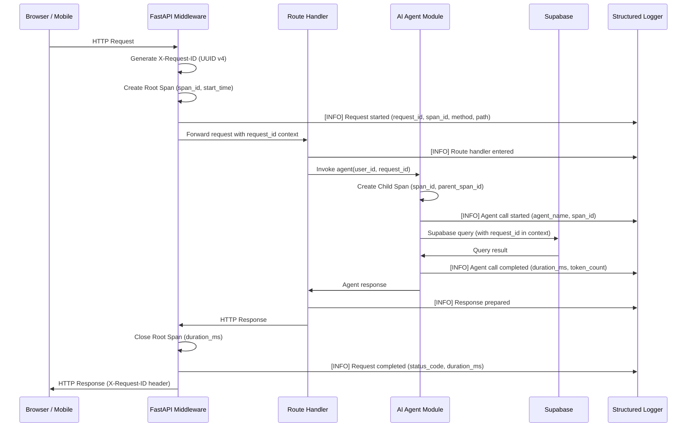
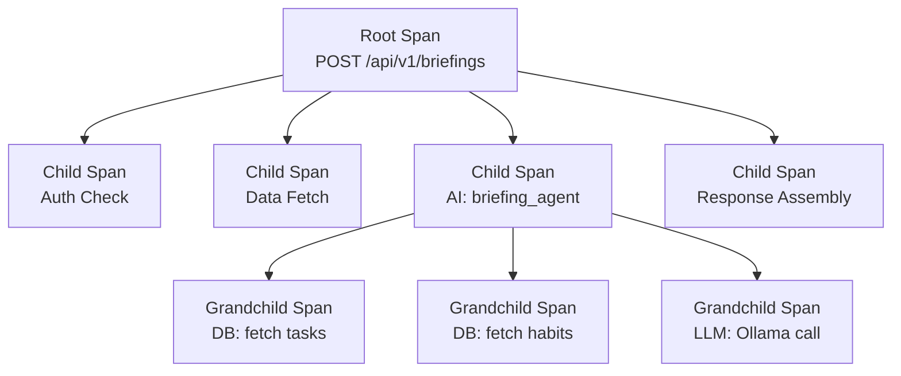

# Distributed Tracing — Second Brain OS

## Document Control

| Field | Value |
|---|---|
| Document ID | OPS-TRC-001 |
| Version | 1.0.0 |
| Status | Approved |
| Date | 2026-07-10 |
| Classification | Internal |
| Owner | Developer |

---

## Table of Contents

- [1. Executive Summary](#1-executive-summary)
- [2. Purpose](#2-purpose)
- [3. Scope](#3-scope)
- [4. Business Context](#4-business-context)
- [5. Functional Specification](#5-functional-specification)
- [6. Non-Functional Requirements](#6-non-functional-requirements)
- [7. Architecture](#7-architecture)
- [8. Diagrams](#8-diagrams)
- [9. Data Models](#9-data-models)
- [10. APIs](#10-apis)
- [11. Security](#11-security)
- [12. Performance Targets](#12-performance-targets)
- [13. Edge Cases](#13-edge-cases)
- [14. Failure Scenarios](#14-failure-scenarios)
- [15. Risks & Mitigations](#15-risks--mitigations)
- [16. Acceptance Criteria](#16-acceptance-criteria)
- [17. Traceability](#17-traceability)
- [18. Implementation Notes](#18-implementation-notes)
- [19. Testing Strategy](#19-testing-strategy)
- [20. References](#20-references)

---

## 1. Executive Summary

Second Brain OS implements lightweight distributed tracing without a dedicated tracing backend. Every API request receives a unique `X-Request-ID` header at the FastAPI middleware layer, propagated through all downstream calls (database queries, AI agent invocations, scheduler jobs). This enables request-level correlation across logs without the operational overhead of OpenTelemetry, which is planned for a future phase. The current approach balances observability needs with the constraints of a free-tier hosting environment.

---

## 2. Purpose

Distributed tracing provides end-to-end visibility into request flows across the Second Brain OS stack. It enables developers to diagnose performance bottlenecks, debug failures across service boundaries, and correlate events from frontend to database to AI provider. Tracing is the foundation for all observability, alerting, and performance optimisation efforts.

---

## 3. Scope

This document covers all tracing mechanisms in Second Brain OS:

- X-Request-ID generation and propagation through FastAPI middleware
- Span creation for AI agent calls, database queries, and external API calls
- Log correlation using request IDs
- Future OpenTelemetry migration plan
- Tracing exclusion list (health endpoints, static assets)

Out of scope: third-party tracing SaaS (Datadog, New Relic), client-side tracing, mobile app tracing.

---

## 4. Business Context

As a free-tier project hosted on Railway and Vercel, Second Brain OS cannot run a dedicated tracing backend like Jaeger or Zipkin. The lightweight X-Request-ID approach provides 80% of the debugging value with zero infrastructure cost. As the user base grows and hosting is upgraded, a full OpenTelemetry deployment will be introduced. Until then, structured logging with request IDs is the primary debugging tool.

---

## 5. Functional Specification

### 5.1 Request ID Generation

- Format: UUID v4 (36-character string)
- Generated by FastAPI middleware `RequestIDMiddleware`
- Set as response header `X-Request-ID` on every request
- Propagated to downstream calls via logging context
- Included in every log entry as `request_id` field

### 5.2 Span Lifecycle

Each request creates a root span. Child spans are created for:

- AI agent invocations (per agent call)
- Database queries (per Supabase call)
- External API calls (Ollama, Claude API)
- Scheduler job executions (per cron trigger)

Spans record:
- `start_time` and `end_time` (high-resolution monotonic clock)
- `duration_ms` (computed)
- `span_type` (root, ai_call, db_query, external_api, cron_job)
- `status` (ok, error, timeout)
- `metadata` (endpoint, agent name, query type, model name)

### 5.3 Trace Correlation

Log entries carry:
- `request_id` — correlates all logs for a single request
- `span_id` — correlates logs within a specific span
- `parent_span_id` — enables parent-child span tree reconstruction
- `trace_id` — future OpenTelemetry compatibility field (currently equals request_id)

### 5.4 Log Output Format

```json
{
  "timestamp": "2026-06-14T12:00:00.000Z",
  "level": "INFO",
  "message": "AI agent started",
  "request_id": "a1b2c3d4-e5f6-7890-abcd-ef1234567890",
  "span_id": "s001",
  "parent_span_id": null,
  "duration_ms": null,
  "endpoint": "/api/v1/briefings",
  "method": "POST",
  "status_code": null,
  "agent": "briefing_agent",
  "user_id": "user-uuid"
}
```

---

## 6. Non-Functional Requirements

| ID | Requirement | Target |
|---|---|---|
| TRC-NFR-001 | Request ID overhead per request | < 1ms |
| TRC-NFR-002 | Log volume per request | < 20 log lines |
| TRC-NFR-003 | Span creation overhead | < 0.5ms |
| TRC-NFR-004 | Log retention (tracing context) | 30 days |
| TRC-NFR-005 | Trace context propagation success | 100% of requests |
| TRC-NFR-006 | Unique request ID collision probability | < 1 in 2^122 |

---

## 7. Architecture



---

## 8. Diagrams

### 8.1 Span Tree Structure



### 8.2 Trace Context Propagation

```mermaid
graph LR
    subgraph Frontend["Frontend (Next.js)"]
        FX[fetch() call]
    end
    subgraph Backend["Backend (FastAPI)"]
        MW[RequestIDMiddleware<br/>gen UUID → X-Request-ID]
        RT[Router Handler]
        AG[AI Agent<br/>child spans]
    end
    subgraph Storage["Storage"]
        DB[Supabase<br/>log table]
    end

    FX -->|HTTP Request| MW
    MW -->|request_id context| RT
    RT -->|request_id + span_id| AG
    AG -->|logged with IDs| DB
    MW -->|X-Request-ID header| FX
```

---

## 9. Data Models

### 9.1 Span Schema

```python
from pydantic import BaseModel
from datetime import datetime
from typing import Optional

class TraceSpan(BaseModel):
    request_id: str
    span_id: str
    parent_span_id: Optional[str] = None
    span_type: str  # root, ai_call, db_query, external_api, cron_job
    start_time: datetime
    end_time: Optional[datetime] = None
    duration_ms: Optional[float] = None
    status: str = "ok"  # ok, error, timeout
    metadata: dict = {}
```

### 9.2 Log Entry Schema

```python
class TraceLogEntry(BaseModel):
    timestamp: datetime
    level: str
    message: str
    request_id: str
    span_id: Optional[str] = None
    parent_span_id: Optional[str] = None
    duration_ms: Optional[float] = None
    endpoint: Optional[str] = None
    method: Optional[str] = None
    status_code: Optional[int] = None
    user_id: Optional[str] = None
    error: Optional[str] = None
```

---

## 10. APIs

### 10.1 Middleware Registration

The `RequestIDMiddleware` is registered in `apps/api/main.py` as the outermost middleware:

```python
app.add_middleware(RequestIDMiddleware)
```

### 10.2 Request ID Access

```python
from shared.utils.logger import logger

# Automatically includes request_id from context
logger.info("Agent started", extra={"agent": "briefing_agent", "span_id": generate_span_id()})
```

### 10.3 Span Helper

```python
from contextlib import asynccontextmanager
from shared.utils.tracing import trace_span

async def my_function():
    async with trace_span("db_query", metadata={"table": "tasks"}) as span:
        result = await run_query()
        span.set_metadata({"row_count": len(result)})
```

---

## 11. Security

- Request IDs are UUID v4 and contain no user-identifiable information
- Request IDs are safe to expose in response headers and client-side logs
- Span metadata must not include sensitive data (passwords, tokens, PII)
- Log redaction is enforced for fields matching `password`, `secret`, `key`, `token` patterns
- Trace context is never propagated to external services (Ollama is local, Claude receives no tracing headers)

---

## 12. Performance Targets

| Metric | Target | Measurement |
|---|---|---|
| Request ID generation | < 0.1ms | `time.perf_counter` |
| Span creation | < 0.05ms | `time.perf_counter` |
| Log write overhead per span | < 0.2ms | Logger benchmark |
| Maximum spans per request | < 50 | Enforced in code |
| Memory overhead per request | < 10KB | `sys.getsizeof` estimate |

---

## 13. Edge Cases

| Edge Case | Handling |
|---|---|
| Request ID collision | Probability negligible; log warning if detected |
| Missing request ID (internal call) | Generate new ID; log warning |
| Span duration overflow | Cap at 3600s (1 hour); log warning |
| Nested span depth exceeded | Hard limit at 10 levels; truncate |
| Concurrent requests with same user | Each gets unique request_id; no collision |
| Health check endpoints | Skipped for tracing; no spans created |
| WebSocket connections | Single request_id per connection lifetime |

---

## 14. Failure Scenarios

| Scenario | Impact | Mitigation |
|---|---|---|
| Logger unavailable | Tracing lost | Fail-open: continue without logging |
| Span storage overflow | Memory pressure | Ring buffer with max 1000 entries |
| Clock skew between services | Incorrect duration | All spans use server monotonic clock |
| Massive request volume | Log noise | Sampling at > 1000 req/min |
| Thread pool exhaustion | Span context leakage | Use `contextvars` for thread-safe context |

---

## 15. Risks & Mitigations

| Risk | Likelihood | Impact | Mitigation |
|---|---|---|---|
| Tracing overhead slows responses | Low | Medium | Keep span count low; benchmark regularly |
| Request ID leaks to third parties | Low | Low | UUID v4 is inherently non-sensitive |
| Span parent-child mismatch | Low | Medium | Validate span tree on close |
| Migration to OpenTelemetry breaks existing spans | Medium | Medium | Map request_id to OpenTelemetry trace_id |

---

## 16. Acceptance Criteria

- [ ] Every HTTP response includes a unique `X-Request-ID` header
- [ ] All log entries for a single request share the same `request_id`
- [ ] AI agent calls create child spans with parent references
- [ ] Database query spans record duration and row count
- [ ] Span trees are reconstructible from log entries
- [ ] Health endpoints (`/health`, `/health/live`, `/health/ready`) do not create spans
- [ ] Tracing adds less than 2ms to p95 response time

---

## 17. Traceability

| Requirement | Covered By | Verified By |
|---|---|---|
| TRC-NFR-001 | RequestIDMiddleware | `tests/test_main_routes.py` |
| TRC-NFR-002 | Logger configuration | Manual log review |
| TRC-NFR-003 | `trace_span` context manager | `tests/test_shared_utils.py` |
| TRC-NFR-005 | Span propagation tests | `tests/test_ai_modules.py` |

---

## 18. Implementation Notes

### 18.1 Current Implementation

The `RequestIDMiddleware` in `apps/api/main.py` generates UUIDs using Python's `uuid.uuid4()`. The request ID is stored in a `contextvars.ContextVar` for thread-safe propagation. The structured logger (`packages/shared/utils/logger.py`) reads the context var automatically on each log call.

### 18.2 OpenTelemetry Migration Plan

| Phase | Timeline | Changes |
|---|---|---|
| Phase 1 | Current | X-Request-ID + structured logging |
| Phase 2 | Q4 2026 | Add OpenTelemetry SDK as optional dependency |
| Phase 3 | Q1 2027 | Configure OTLP exporter to local collector |
| Phase 4 | Q2 2027 | Replace manual spans with OpenTelemetry spans |
| Phase 5 | Q3 2027 | Deploy collector; connect to observability backend |

### 18.3 Known Limitations

- No automatic instrumentation for httpx/aiohttp calls (manual wrapping required)
- No distributed context propagation to background tasks (scheduler gets new request_id per job)
- No trace sampling logic (every request is traced equally)

---

## 19. Testing Strategy

| Test Type | Scope | Location |
|---|---|---|
| Unit | Request ID generation | `tests/test_shared_utils.py` |
| Unit | Span creation and lifecycle | `tests/test_shared_utils.py` |
| Integration | Middleware adds X-Request-ID header | `tests/test_main_routes.py` |
| Integration | Log entries contain request_id | `tests/test_main_routes.py` |
| Integration | Span tree reconstructible | `tests/test_ai_modules.py` |
| Performance | Tracing overhead | `tests/performance/load-test-crud.js` |

---

## 20. References

| Reference | Description |
|---|---|
| [Observability](./31_Observability.md) | Overall observability architecture |
| [Monitoring](./32_Monitoring.md) | Metrics and monitoring dashboards |
| [Alerts](./Alerts.md) | Alerting based on trace metrics |
| [Runbooks](./39_Runbooks.md) | Debugging runbooks using request IDs |
| [Logging Guide](./31_Observability.md) | Structured logging standards |
| [Performance Scalability](../engineering/45_PerformanceScalability.md) | Performance benchmarking |

---

## Revision History

| Version | Date | Author | Changes |
|---|---|---|---|
| 1.0.0 | 2026-07-10 | Developer | Initial tracing architecture document |
