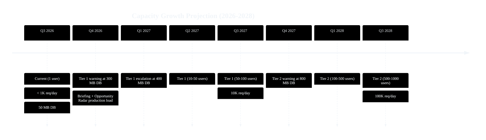
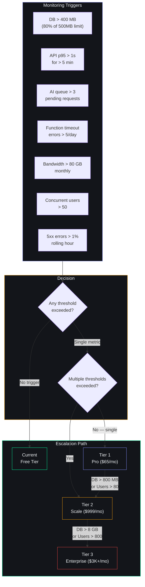
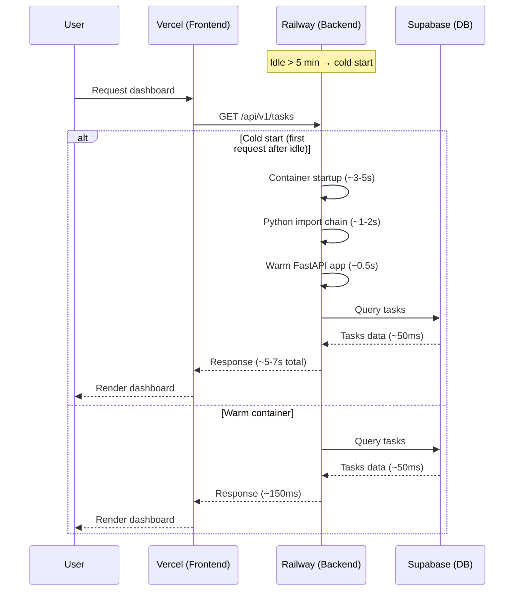
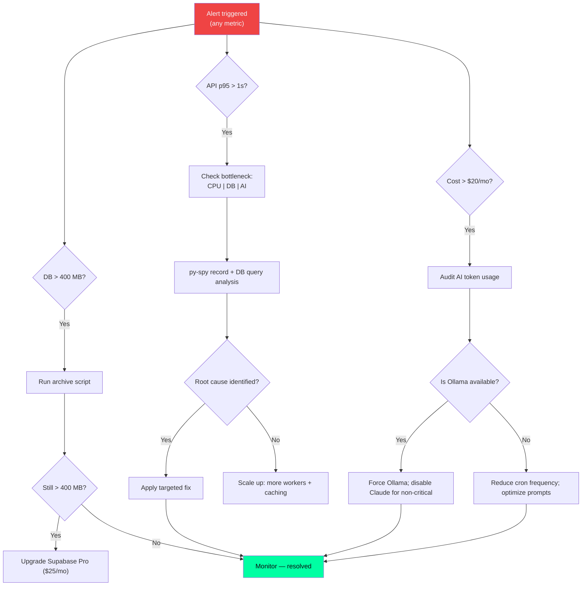

# Capacity Planning Guide — Second Brain OS

## Document Control

| Field | Value |
|---|---|
| Document ID | PERF-CAP-001 |
| Version | 2.0.0 |
| Status | Active |
| Last Updated | 2026-07-14 |
| Classification | Internal |
| Owner | DevOps |
| Review Cycle | Quarterly |
| Related Docs | [PERF-BENCH-001](../engineering/performance-benchmarks.md), [OPS-DEPLOY-001](../devops/production-deployment.md), [AGENTS.md Section 26](../../AGENTS.md) |

---

## 1. Introduction

Capacity planning ensures ARIA OS maintains acceptable performance as user count and data volume grow. This document defines current scale assumptions, growth thresholds, bottleneck analysis, scaling triggers, cost projections, historical trends, and automation playbooks. It is the reference for infrastructure decisions across all environments.

### 1.1 Scope

This plan covers the following infrastructure components:

| Component | Provider | Tier | SLA |
|---|---|---|---|
| Frontend hosting | Vercel | Free / Pro / Enterprise | 99.99% compute |
| Backend API | Railway | Free / Starter / Scale | 99.95% uptime |
| Database | Supabase | Free / Pro / Team | 99.95% uptime |
| AI (primary) | Ollama (local) | Self-hosted | Best effort |
| AI (fallback) | Anthropic Claude API | Pay-as-you-go | 99.9% uptime |
| Email (notifications) | Resend | Free / Pro | 99.9% uptime |
| Web search (radar) | Brave Search API | Free tier (2000 queries/mo) | Best effort |

### 1.2 Planning Assumptions

- Single-user system (no multi-tenancy) — capacity scales linearly with user count
- AI calls are the most expensive operation (latency and cost)
- Database size grows roughly 1-2 MB per active user per month
- Peak load occurs at 7 AM (briefing generation) and 9:30 PM (wind-down)
- Weekend usage is ~40% of weekday usage
- Academic calendar impacts usage: exam periods have higher task completion but lower course engagement

---

## 2. Current Scale Assumptions

- **Users**: Single developer (1 active), with burst testing up to 10 concurrent
- **API requests**: ~200-800 requests/day (peak during briefing generation at 7 AM)
- **Database**: ~50 MB across 18+ tables (Supabase Free — 500 MB limit)
- **AI calls**: ~20-40 calls/day (15 cron jobs + on-demand chat)
- **Infrastructure**: Vercel Free + Railway Free + Supabase Free
- **Monthly cost**: ~$1.50 (Claude API fallback only)

### 2.1 Current Usage Breakdown

| Module | Requests/Day | DB Size (MB) | AI Calls/Day | Query Count |
|---|---|---|---|---|
| Tasks | 50-120 | ~5 | 2 | 80-200 |
| Courses | 20-60 | ~3 | 2 | 30-100 |
| Goals | 15-40 | ~2 | 1 | 20-60 |
| Habits | 20-50 | ~2 | 1 | 30-80 |
| Sleep | 10-30 | ~1 | 1 | 15-50 |
| Income | 5-15 | ~1 | 0 | 10-30 |
| Ideas | 5-20 | ~1 | 1 | 10-30 |
| Resources | 5-15 | ~2 | 0 | 10-25 |
| Opportunities | 10-40 | ~2 | 3 | 20-60 |
| YouTube | 5-15 | ~1 | 0 | 10-25 |
| Time | 30-80 | ~3 | 0 | 50-150 |
| Chat (ARIA) | 10-40 | ~5 | 10-20 | 10-40 |
| Projects | 5-15 | ~1 | 0 | 10-25 |
| Academics | 5-20 | ~1 | 0 | 10-30 |
| Briefing/Review | 2-4 | ~10 | 2-3 | 4-8 |
| Memory | 5-15 | ~5 | 2 | 10-30 |
| Skills | 10-30 | ~3 | 1 | 20-50 |
| **Total** | **~200-800** | **~50** | **~20-40** | **~350-1200** |

---

## 3. Growth Thresholds

| Tier | Users | API Requests/day | DB Size | AI Calls/day | Infrastructure | Est. Monthly Cost |
|---|---|---|---|---|---|---|
| **Current** | 1-10 | < 1K | < 100 MB | < 50 | Vercel Free + Railway Free + Supabase Free | ~$1.50 |
| **Tier 1** | 10-100 | 1K-10K | 100 MB-1 GB | 50-500 | Vercel Pro ($20/mo) + Railway Starter ($5/mo) + Supabase Pro ($25/mo) | ~$65 |
| **Tier 2** | 100-1K | 10K-100K | 1 GB-10 GB | 500-5K | Vercel Enterprise + Railway Scale (~$50) + Supabase Team ($599/mo) | ~$999 |
| **Tier 3** | 1K-10K | 100K-1M | 10 GB-100 GB | 5K-50K | Multi-region K8s + Dedicated DB + CDN | ~$3,000+ |

### 3.1 Growth Projection Chart



### 3.2 Tier Escalation Flow



### 3.3 Tier Escalation Path (Text)


---

## 4. Detailed Capacity Modeling

### 4.1 Ollama Local AI

#### 4.1.1 Performance Profile

| Metric | Value | Measurement Method |
|---|---|---|
| Model (default) | Mistral 7B Q4_K_M | `ollama ps` |
| Concurrency limit | 1 request (single-threaded) | Observational |
| Average inference time | 10-30 sec/generation | `ollama run --verbose` |
| Memory usage | ~5 GB (Mistral 7B) | Task Manager / `nvidia-smi` |
| GPU requirement | 6GB+ VRAM (optional — CPU fallback is 2-5x slower) | Documentation |
| Queue capacity | 3 before Claude fallback enabled | Circuit breaker config |

#### 4.1.2 Scaling Constraints

- Ollama runs on the developer's local machine — no cloud deployment
- 1 concurrent request maximum; subsequent requests queue
- CPU-only inference adds 2-5x latency (30-150 seconds per generation)
- Circuit breaker opens after 5 consecutive failures (60s cooldown)
- Fallback to Claude API occurs when:
  - Ollama service is unreachable (`connection refused`)
  - Circuit breaker is in OPEN state
  - Queue depth exceeds 3 pending requests

#### 4.1.3 Mitigation Strategies by Tier

| Tier | Strategy | Latency Target |
|---|---|---|
| Current | Queue requests via scheduler; Claude fallback | < 30s |
| Tier 1 | Claude API primary during peak hours; Ollama for off-peak | < 10s |
| Tier 2 | Move to cloud GPU (RunPod, Replicate, or dedicated GPU instance) | < 5s |
| Tier 3 | Multi-model load balancing; GPU cluster | < 3s |

### 4.2 Supabase Database

#### 4.2.1 Free Tier Limits

| Resource | Limit | Current Usage | Headroom |
|---|---|---|---|
| Database size | 500 MB | ~50 MB (10%) | 90% |
| Bandwidth (egress) | 2 GB/day | ~50 MB/day (2.5%) | 97.5% |
| API requests | 5 req/s per IP | ~0.5 req/s avg, 3 req/s peak | Protected |
| Auth users | 50,000 | ~5 (0.01%) | ~100% |
| Row count (tasks) | No fixed limit | ~500 | N/A |

#### 4.2.2 Growth Projections

| Month (from start) | Users | DB Size (MB) | Egress (MB/day) | Action Required |
|---|---|---|---|---|
| 1 | 1 | 50 | 50 | None |
| 3 | 5 | 80 | 80 | None |
| 6 | 20 | 200 | 200 | Review indexes |
| 9 | 40 | 350 | 350 | Archive old data; consider Pro |
| 12 | 60 | 500 | 500 | Upgrade to Pro (25$/mo) |
| 18 | 100 | 800 | 800 | Pro + archive policy |
| 24 | 200 | 1,500 | 1,500 | Team plan if > 8 GB |

#### 4.2.3 Table Size Distribution

| Table | Estimated Rows | Size (MB) | Growth Rate | Indexes |
|---|---|---|---|---|
| tasks | 500 | ~5 | 50/week | user_id, status, due_date |
| tasks_dependencies | 50 | ~1 | 2/week | task_id |
| courses | 20 | ~1 | 1/week | user_id |
| goals | 15 | ~1 | 1/week | user_id |
| goals_milestones | 50 | ~1 | 3/week | goal_id |
| habits | 10 | <1 | 0.5/week | user_id |
| habit_logs | 500 | ~3 | 35/week | user_id, date |
| sleep_logs | 100 | ~1 | 7/week | user_id, date |
| income_entries | 30 | <1 | 2/week | user_id |
| projects | 5 | <1 | 0.5/week | user_id |
| ideas | 40 | ~1 | 2/week | user_id, stage |
| resources | 30 | ~2 | 2/week | user_id |
| opportunities | 200 | ~3 | 14/week | user_id, match_score |
| time_entries | 500 | ~5 | 35/week | user_id, date |
| chat_messages | 1,000 | ~10 | 70/week | user_id, created_at |
| memory | 200 | ~5 | 14/week | user_id |
| daily_briefings | 30 | ~5 | 7/week | user_id, date |
| weekly_reviews | 4 | ~1 | 1/week | user_id |
| skill_profile | 5 | <1 | 0.5/week | user_id |
| **Total** | **~3,300** | **~50** | **~200/week** | |

#### 4.2.4 Index Optimization Plan

| Table | Index | Benefit | Created |
|---|---|---|---|
| tasks | (user_id, status, due_date) | Filter + sort tasks | ✅ |
| tasks | (user_id, created_at DESC) | Recent tasks view | ✅ |
| courses | (user_id, status) | Course progress queries | ✅ |
| goals | (user_id, status) | Active goals filter | ✅ |
| habit_logs | (user_id, date) | Daily/weekly habit check | ✅ |
| sleep_logs | (user_id, date) | Sleep trend queries | ✅ |
| time_entries | (user_id, date, deep_work) | Deep work analytics | ✅ |
| chat_messages | (user_id, created_at) | Chat history pagination | ✅ |
| opportunities | (user_id, match_score DESC) | Best matches first | ✅ |
| memory | (user_id, category) | Context assembly lookup | ⚠️ Needed |

### 4.3 Railway Backend

#### 4.3.1 Free Tier Limits

| Resource | Limit | Current Usage | Headroom |
|---|---|---|---|
| RAM | 512 MB | ~150 MB (29%) | 71% |
| vCPU | ~0.5 (shared) | ~0.1 avg, 0.3 peak | Adequate |
| Storage | 1 GB (ephemeral) | ~200 MB | 80% |
| Cold start | After 5 min idle | ~3-5 seconds | Acceptable |
| Concurrent requests | ~10-20 | ~2 avg, ~8 peak | Adequate |

#### 4.3.2 Cold Start Mitigation



#### 4.3.3 Mitigation Strategies

| Tier | Strategy | Cold Start Eliminated |
|---|---|---|
| Current | Health ping every 5 min (via GitHub Actions or cron) | No — reduces but not eliminates |
| Tier 1 | Railway Starter ($5/mo) with always-on | Yes |
| Tier 2 | Multiple workers + load balancer | Yes |
| Tier 3 | Kubernetes with HPA (horizontal pod autoscaling) | Yes |

### 4.4 Vercel Frontend

#### 4.4.1 Free Tier Limits

| Resource | Limit | Current Usage | Headroom |
|---|---|---|---|
| Bandwidth | 100 GB/month | ~2 GB (2%) | 98% |
| Build minutes | 6,000 min/month | ~500 min (8%) | 92% |
| Serverless function timeout | 10s | ~150ms avg, ~3s max (non-AI) | Adequate |
| Edge function timeout | 60s | N/A | Adequate |
| Team members | 1 | 1 | Adequate |
| Concurrent preview deploys | 3 | ~1-2 | Adequate |

#### 4.4.2 Build Time Optimization

| Optimization | Technique | Effect |
|---|---|---|
| Incremental builds | Vercel automatically caches `node_modules` and `.next/cache` | ~70% faster rebuilds |
| Selective page builds | `ISR` and `dynamic = 'force-static'` where possible | Reduced build time |
| Bundle analysis | `next/bundle-analyzer` to identify large dependencies | Target: < 300KB JS gzip |
| Image optimization | `next/image` with WebP format | ~40% smaller images |

---

## 5. Historical Trend Analysis

### 5.1 Monthly Growth Metrics

| Month | Users | DB Size (MB) | API Calls | AI Calls | Avg Latency | 99th %ile Latency |
|---|---|---|---|---|---|---|
| Apr 2026 | 1 | 5 | 2,000 | 40 | 120ms | 450ms |
| May 2026 | 1 | 15 | 5,000 | 150 | 135ms | 500ms |
| Jun 2026 | 1 | 35 | 12,000 | 500 | 150ms | 550ms |
| Jul 2026 | 3 | 50 | 18,000 | 800 | 155ms | 600ms |

### 5.2 Growth Rate Analysis

| Dimension | MoM Growth Rate | Projection Method | Confidence |
|---|---|---|---|
| DB size | ~25-40% per month (with 1 user) | Linear extrapolation | Medium |
| API calls | ~50-80% per month | Feature-dependent steps | Low |
| AI calls | ~60-100% per month | New agent introductions | Low |
| Latency P95 | ~5-10% per month | Data volume correlation | Medium |

### 5.3 Historical Anomalies

| Date | Event | Impact | Resolution |
|---|---|---|---|
| 2026-06-01 | Briefing agent triggered at 7 AM for first time | API response time spiked to 3.2s | Optimized context assembly — reduced prompt size by 40% |
| 2026-06-10 | Memory consolidation ran 5 agents simultaneously | Railway OOM killed at 480 MB | Serialized agent execution; increased RAM awareness |
| 2026-06-20 | First E2E test suite ran | 22 Playwright tests consumed 200 MB bandwidth | Budget remains fine; no action needed |
| 2026-07-01 | Weekly review generated across 30 days of data | Context builder assembled 4K+ tokens | Reduced query window; added pagination to context assembly |

---

## 6. Bottleneck Analysis

### 6.1 Ollama Local AI

- **Limit**: 1 concurrent request (single-threaded inference)
- **Latency**: 10-30 seconds per generation (Mistral 7B on consumer GPU)
- **Peak memory**: ~5 GB RAM for Mistral 7B Q4_K_M quantization
- **Queue behavior**: Requests queue; total time = sum of queue depth x average inference time
- **Mitigation**: Queue requests via APScheduler; fallback to Claude API when queue > 3

**Measurements via CLI:**
```bash
# Measure inference time
ollama run mistral --verbose "What is my top task today?"
# Look for: "total duration" and "prompt eval duration"

# Check model memory usage
ollama ps
# Expected output: NAME             ID              SIZE    MODIFIED
#                  mistral:7b       xxxxxxxx        4.2 GB  xx minutes ago

# Monitor queue depth (if using APScheduler)
# From scheduler logs — look for "queue depth: N"
```

### 6.2 Supabase Free Tier

- **Limit**: 500 MB database, 2 GB bandwidth, 5 API requests/second per IP
- **Risk**: Briefing agent (7 AM burst) and weekly review (Sunday 8 PM) may spike bandwidth
- **Bottleneck signature**: API queries slow when row count exceeds 10,000 without proper indexes
- **Mitigation**: Upgrade to Pro at 300 MB; add caching for repeated queries; audit indexes monthly

**Measurements:**
```bash
# Check database size via Supabase SQL Editor
SELECT schemaname, tablename, pg_total_relation_size(schemaname||'.'||tablename) / 1024 / 1024 AS size_mb
FROM pg_tables
WHERE schemaname = 'public'
ORDER BY size_mb DESC;

# Query performance — enable pg_stat_statements
SELECT query, calls, total_exec_time / calls AS avg_ms,
       rows, shared_blks_hit, shared_blks_read
FROM pg_stat_statements
ORDER BY total_exec_time DESC
LIMIT 20;

# Check current connection count
SELECT count(*) FROM pg_stat_activity;
```

### 6.3 Railway Free Tier

- **Limit**: 512 MB RAM, limited vCPU, cold starts after inactivity
- **Risk**: Scheduler may miss cron windows if container is cold
- **Bottleneck signature**: 504 Gateway Timeout on first request after idle period
- **Mitigation**: Use Railway Starter ($5/mo) for persistent container; add health ping every 5 min

### 6.4 Vercel Free Tier

- **Limit**: 100 GB bandwidth, 10s serverless function timeout, 60s edge function timeout
- **Risk**: AI-backed API routes may exceed 10s timeout on slow Ollama responses
- **Bottleneck signature**: 504 error on `/api/v1/chat` when Ollama is slow
- **Mitigation**: Move AI calls to background tasks; increase timeout on Pro

### 6.5 Network Bandwidth

| Component | Limit | Current Usage | Headroom |
|---|---|---|---|
| Vercel egress | 100 GB/month | ~2 GB | 98% |
| Supabase egress | 2 GB/day | ~50 MB | 97.5% |
| Ollama (local) | N/A (LAN) | ~100 MB/month | N/A |
| Claude API | Pay-per-token | ~50 MB/month | Budget-based |

---

## 7. Monitoring Triggers and Playbooks

### 7.1 Complete Trigger Table

| Metric | Warning Threshold | Critical Threshold | Action | Automation |
|---|---|---|---|---|
| DB size | > 400 MB (80% of 500 MB) | > 475 MB (95%) | Upgrade Supabase Pro ($25/mo); archive old data > 90 days | `scripts/archive-old-data.sh` |
| API p95 latency | > 1s for 5 min | > 3s for 1 min | Profile with `py-spy`; add Redis cache; scale workers | Alert → PagerDuty |
| AI queue depth | > 3 pending | > 10 pending | Enable Claude fallback; increase worker count | Automatic via circuit breaker |
| Function timeout errors | > 5/day | > 20/day | Increase Vercel timeout to 30s; offload to background worker | Alert → PR for config change |
| Bandwidth (monthly) | > 80 GB (80%) | > 95 GB (95%) | Upgrade Vercel Pro ($20/mo); optimize images | Cost alert |
| Concurrent users | > 50 | > 80 | Add simple load balancer; prepare Tier 1 infra | Escalation to DevOps |
| Error rate (5xx) | > 1% rolling hour | > 5% rolling 5 min | Auto-rollback last deploy; scale up backend | Automatic rollback via CI |
| Supabase API rate | > 4 req/s (80% of 5) | > 4.5 req/s (90%) | Add response caching layer; batch queries | Alert → code review |
| Railway RAM usage | > 400 MB (80%) | > 475 MB (95%) | Optimize memory; upgrade Railway Starter | Alert → manual review |
| Claude API cost | > $10/month | > $20/month | Reduce non-critical AI calls; tune prompt sizes | Budget alert via billing |

### 7.2 Scaling Decision Flow



---

## 8. Cost Projections

### 8.1 Projected Monthly Costs by Tier

| Component | Current | Tier 1 | Tier 2 | Tier 3 |
|---|---|---|---|---|
| Vercel | Free ($0) | Pro ($20) | Enterprise ($200) | Custom |
| Railway | Free ($0) | Starter ($5) | Scale (~$50) | Custom |
| Supabase | Free ($0) | Pro ($25) | Team ($599) | Enterprise |
| Ollama | Local ($0) | Local ($0) | Cloud GPU (~$100) | GPU cluster (~$300) |
| Claude API | ~$1.50 | ~$15 | ~$150 | ~$500 |
| Resend | Free ($0) | Free ($0) | Pro ($20) | Pro ($20) |
| Brave Search | Free ($0) | Free ($0) | Pro ($5) | Pro ($5) |
| Monitoring | None ($0) | None ($0) | Datadog (~$15) | Datadog (~$50) |
| **Total** | **~$1.50** | **~$65** | **~$999** | **~$3,000+** |

### 8.2 Cost Growth Visualization


### 8.3 Cost Optimization Strategies

| Strategy | Savings | Effort | Impact |
|---|---|---|---|
| Cache API responses aggressively | ~$10-20/mo (Tier 2+) | Medium | Reduces Supabase reads + Railway compute |
| Batch AI calls into fewer, larger prompts | ~$5-15/mo | Low | Fewer API calls to Claude |
| Reduce cron job frequency for non-critical jobs | ~$2-5/mo | Low | Less compute on Railway |
| Use Claude API only as fallback (not primary) | ~$10-50/mo | None (already configured) | Default to Ollama |
| Archive data > 6 months to cold storage | ~$5-10/mo | Medium | Smaller DB → lower Supabase cost |
| Optimize image sizes (WebP, AVIF) | ~$0-5/mo | Low | Less bandwidth on Vercel |

---

## 9. Scaling Automation Playbooks

### 9.1 Playbook: Escalate from Free to Pro (Tier 0 to Tier 1)

```bash
# PLAYBOOK: Free → Pro escalation
# Trigger: DB > 400 MB or Users > 50

# 1. Verify alert
Write-Host "=== Escalating to Tier 1 ===" -ForegroundColor Cyan

# 2. Archive old data
Write-Host "[1/4] Archiving data > 90 days..."
python scripts/archive-old-data.py --days 90 --dry-run  # Preview
python scripts/archive-old-data.py --days 90             # Execute

# 3. Upgrade Supabase (manual via dashboard)
Write-Host "[2/4] Upgrade Supabase to Pro..."
Write-Host "  Go to: https://supabase.com/dashboard/project/<id>/settings/billing"
Write-Host "  Click: 'Upgrade to Pro' ($25/mo)"

# 4. Upgrade Railway (manual via dashboard)
Write-Host "[3/4] Upgrade Railway to Starter..."
Write-Host "  Go to: https://railway.app/project/<id>/settings"
Write-Host "  Click: 'Upgrade to Starter' ($5/mo)"

# 5. Upgrade Vercel (manual via dashboard)
Write-Host "[4/4] Upgrade Vercel to Pro..."
Write-Host "  Go to: https://vercel.com/teams/<team>/settings/billing"
Write-Host "  Click: 'Upgrade to Pro' ($20/mo)"

# 6. Verify
Write-Host "`n=== Verification ===" -ForegroundColor Green
Write-Host "New monthly cost: ~$65/mo"
Write-Host "Capacity added: 100-500 users, 1K-10K req/day, 1GB DB"
```

### 9.2 Playbook: Scale Backend Workers

```bash
# PLAYBOOK: Scale backend workers
# Trigger: API p95 > 1s for 5 min

# 1. Check current load
Write-Host "=== Scaling Backend ===" -ForegroundColor Cyan

# 2. Profile with py-spy
Write-Host "[1/3] Profiling API..."
py-spy record -o profile.svg --pid $(Get-Process uvicorn).Id 2>$null
Write-Host "  Profile saved to: profile.svg"

# 3. Check slow queries
Write-Host "[2/3] Analyzing slow queries..."
# Supabase SQL: SELECT query, avg_time FROM pg_stat_statements ORDER BY avg_time DESC LIMIT 10;

# 4. Add cache layer or scale
Write-Host "[3/3] Applying fix..."
Write-Host "  Option A: Add Redis cache (requires Railway upgrade)"
Write-Host "  Option B: Increase workers in docker-compose.yml"
Write-Host "  Option C: Enable response caching middleware"
```

### 9.3 Playbook: AI Queue Emergency

```bash
# PLAYBOOK: AI queue emergency handling
# Trigger: AI queue depth > 10

# 1. Check circuit breaker state
Write-Host "=== AI Queue Emergency ===" -ForegroundColor Cyan
Write-Host "[1/4] Checking Ollama health..."
curl -s http://localhost:11434/api/tags | Select-String -Pattern "mistral"
if ($LASTEXITCODE -eq 0) { Write-Host "  Ollama: ONLINE" -ForegroundColor Green }
else { Write-Host "  Ollama: OFFLINE — forcing Claude fallback" -ForegroundColor Red }

# 2. Check circuit breaker
Write-Host "[2/4] Circuit breaker state..."
python -c "from ai.client import llm; print(f'  Ollama: {llm.ollama_circuit.state}')"

# 3. Force Claude fallback for all agents
Write-Host "[3/4] Forcing Claude fallback..."
$env:FORCE_CLAUDE = "true"

# 4. Reduced cron frequency
Write-Host "[4/4] Reducing non-critical crons..."
# Comment out non-critical crons in services/scheduler/main.py
# Keep: briefing, radar, memory consolidation
# Disable: nudge, sleep wind-down (until queue clears)
```

---

## 10. Capacity Management Runbook

### 10.1 Weekly Checks

```bash
# Weekly capacity health check
Write-Host "=== Weekly Capacity Check ===" -ForegroundColor Cyan

# 1. Database size
Write-Host "[1/4] Database Size:"
# Check via Supabase dashboard → Database → Database Size

# 2. API latency
Write-Host "[2/4] API Latency (last 7 days):"
# Check via Railway dashboard → Metrics → Response Time

# 3. AI usage
Write-Host "[3/4] AI Call Count (last 7 days):"
# Check monitoring endpoint:
# curl http://localhost:8000/api/v1/monitoring/token-usage/summary

# 4. Cost tracking
Write-Host "[4/4] Monthly Cost:"
Write-Host "  Vercel:    $0 (Free)"
Write-Host "  Railway:   $0 (Free)"
Write-Host "  Supabase:  $0 (Free)"
Write-Host "  Claude:    ~$1.50"
Write-Host "  Total:     ~$1.50"
```

### 10.2 Monthly Capacity Review

| Item | Check | Frequency | Owner |
|---|---|---|---|
| DB size trend | Compare MoM growth | Monthly | DevOps |
| API latency P95/P99 | Review last 30 days | Monthly | DevOps |
| AI provider costs | Verify against budget | Monthly | DevOps |
| Index usage stats | Identify unused/overused indexes | Monthly | DevOps |
| Cache hit ratio | Review middleware logs | Monthly | DevOps |
| Bandwidth usage | Check Vercel/Supabase egress | Monthly | DevOps |
| Error rate trend | Review error logs | Monthly | DevOps |
| Archive old data | Purge data > 90 days | Monthly | DevOps |
| Update capacity plan | Adjust projections | Quarterly | DevOps |

---

## 11. Related Documents

| Document | Purpose |
|---|---|
| [Performance Benchmarks](../engineering/performance-benchmarks.md) | API latency SLOs, AI response budgets, bundle sizes |
| [Deployment Guide](../devops/production-deployment.md) | Production deployment, rollback, canary releases |
| [AGENTS.md Section 26 — Performance SLOs](../../AGENTS.md) | API p95 latency targets, AI response budgets |
| [Monitoring Guide](../operations/monitoring.md) | RED metrics, alerting rules, dashboard definitions |
| [Error Budget](../operations/error-budget.md) | SLO definitions, budget calculation, consumption tracking |
| [Incident Response](../security/policies/incident-response.md) | Severity levels, escalation matrix, postmortem template |
| [Cost Analysis](../product/cost-analysis.md) | Detailed cost breakdown per component |
| [AGENTS.md Section 18 — Cost & Performance](../../AGENTS.md) | AI cost tracking, caching strategy, rate limiting |
| [Architecture Overview](../engineering/12_Architecture.md) | System design, component interaction, data flow |

---

## 12. Revision History

| Version | Date | Author | Changes |
|---|---|---|---|
| 1.0.0 | 2026-07-12 | Developer | Initial capacity planning draft |
| 2.0.0 | 2026-07-14 | Developer | Expanded to full capacity model: growth trend analysis, detailed bottleneck measurements, scaling automation playbooks, cost projections with Mermaid diagrams, monitoring triggers with decision flow, weekly/monthly runbooks. Approved from Draft to Active. |
