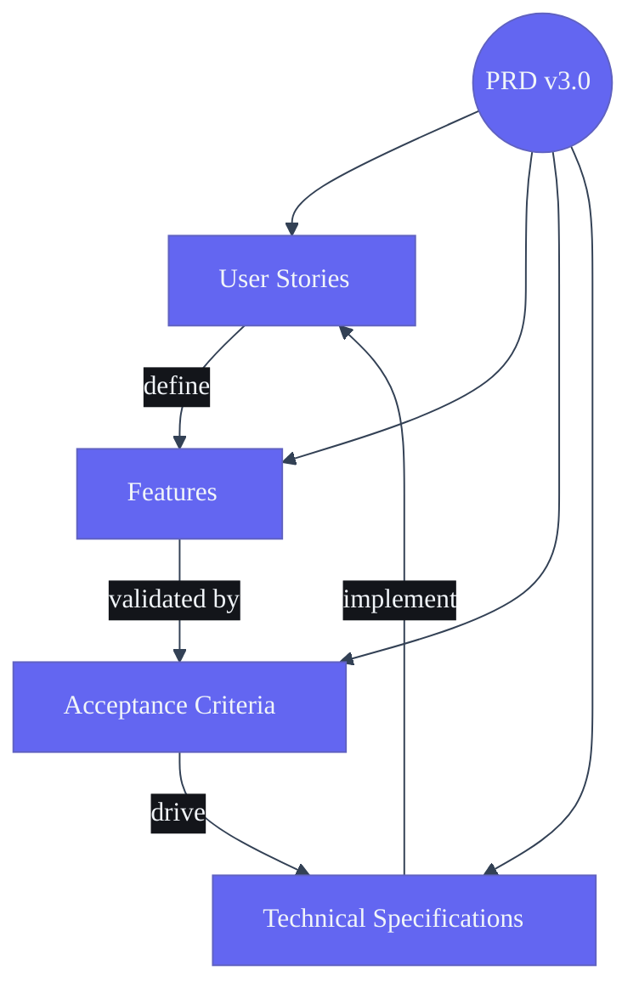

# Product Requirements Document — Second Brain OS

## Document Control

| Field | Value |
|---|---|
| Document ID | SB-PRD-001 |
| Version | 3.0.0 |
| Status | Draft |
| Date | 2026-06-11 |
| Author | Product Team |
| Approved By | — |

---

## Requirements Domain Breakdown

## 1. Vision

ARIA OS is a personal AI operating system for BTech CSE students. It manages the student's entire digital life — tasks, courses, goals, projects, income, habits, sleep, career opportunities, and ideas — through a single intelligence layer (ARIA) that understands context, remembers preferences, and proactively drives the student toward their goals. One app to replace 15 tools.

---

## 2. Problem Statement

BTech CSE students juggle an average of 8-12 tools daily: Todoist (tasks), Notion (notes), Google Calendar (time), Coursera/Udemy (courses), GitHub (projects), LinkedIn (career), Excel (CGPA), bank statements (income), a habit tracker, a sleep tracker, and a notes app for ideas. This fragmentation causes:

| Problem | Impact |
|---|---|
| No single source of truth | Tasks, notes, and deadlines spread across tools |
| Context switching cost | Switching between 8+ tools costs 40% productivity |
| Invisible patterns | No tool correlates sleep → productivity → grades |
| Reactive vs proactive | Tools remind, but none plan, prioritize, or suggest |
| Career blind spots | Students miss internship deadlines because they're in a different tool |
| No AI memory | Every session starts from scratch — no tool remembers preferences |

---

## 3. Target Users

| Persona | Description | Key Need |
|---|---|---|
| **Primary:** BTech CSE Student (Years 1-4) | 18-22, Indian engineering student, manages courses, projects, internships, placements | All-in-one productivity with career focus |
| **Secondary:** Self-learning Developer | 20-28, upskilling via online courses, building side projects, freelancing | Track learning + income + opportunities |
| **Tertiary:** CS Graduate (0-2 years exp) | 22-24, working professional, still studying for certifications, managing finances | Career tracking + skill gaps |

---

## 4. Business Goals

| Goal | Metric | Target | Timeline |
|---|---|---|---|
| User acquisition | Daily active users | 1,000 DAU | 6 months |
| User engagement | Daily sessions per user | 3+ sessions/day | 3 months |
| User retention | 30-day retention | > 60% | 3 months |
| Task completion | Tasks completed per week | 15+ tasks/week | 3 months |
| Course completion | Course completion rate | > 60% | 6 months |
| Monetization (future) | Conversion to premium | 5% free→paid | 12 months |

---

## 5. Success Metrics (KPIs)

### 5.1 Product Metrics

| KPI | Target | Measurement | Frequency |
|---|---|---|---|
| Daily Active Users | 1,000 | Supabase analytics | Daily |
| Tasks created per user/day | 3 | tasks table | Daily |
| Tasks completed per user/day | 2 | tasks.completed_at | Daily |
| Session duration | > 5 min | time_entries | Daily |
| Chat interactions per user/day | 5 | chat_messages | Daily |
| Habits tracked per day | 3 | habit_logs | Daily |
| Courses tracked per user | 3 | courses table | Weekly |
| Opportunities saved per week | 2 | opportunities | Weekly |

### 5.2 Quality Metrics

| KPI | Target | Measurement |
|---|---|---|
| API uptime | 99.9% | Uptime monitor |
| API p95 latency | < 500ms | Structured logs |
| Frontend Lighthouse score | > 90 | Lighthouse CI |
| Error rate | < 0.1% of requests | Error tracking |
| Offline capability | Core features work offline | PWA audit |

### 5.3 Business Metrics

| KPI | Target | Measurement |
|---|---|---|
| User acquisition cost | ₹0 (organic) | Referral tracking |
| Monthly active users | 500 | Supabase analytics |
| Feature adoption rate | > 60% use 5+ modules | Module usage tracking |
| Notification opt-in rate | > 70% | Push permission stats |

---

## 6. User Personas

### 6.1 Primary Persona: Rohit (BTech CSE, Year 3)

| Attribute | Detail |
|---|---|
| **Name** | Rohit Sharma |
| **Age** | 20 |
| **Year** | 3rd Year BTech CSE |
| **College** | Tier-2 engineering college, India |
| **Daily tools used** | Todoist, Notion, Google Calendar, Coursera, GitHub, LinkedIn, Excel |
| **Pain points** | Misses assignment deadlines, forgets internship applications, can't track study progress across 4 courses, doesn't know how his sleep affects grades |
| **Goals** | Get a high-CGPA, land a summer internship, build 2 side projects, learn React + Go, earn ₹50K/month freelancing |
| **Tech level** | Comfortable with CLI, knows Git, prefers keyboard shortcuts |
| **Device** | Windows laptop (primary) + Android phone (secondary) |
| **When he uses ARIA** | Morning (plan day), throughout day (track tasks), evening (log habits/sleep), ad-hoc (chat with ARIA) |

**User Journey (Typical Day):**
1. 7:00 AM — ARIA briefing push: "Good morning, Rohit. Sleep score 78. Top task: Complete DBMS assignment. You have 3 pending tasks today, 1 deadline tomorrow."
2. 9:00 AM — Chats: "ARIA, add 'Research internship at Google' as a goal" → ARIA creates goal with roadmap
3. 2:00 PM — ARIA suggests: "You finished your assignment early. Want to study 25 min of your React course?"
4. 6:00 PM — Course nudge: "Your Node.js course deadline is in 2 weeks. You're 40% behind. Need 30 min/day to finish."
5. 9:30 PM — Wind-down: "Time to wind down. Tomorrow's first task: Complete OS slides. Set bedtime for 11 PM?"
6. 11:00 PM — Logs sleep via ARIA

### 6.2 Secondary Persona: Ananya (Self-learning Developer)

| Attribute | Detail |
|---|---|
| **Name** | Ananya Patel |
| **Age** | 24 |
| **Status** | Working (frontend developer), upskilling |
| **Tools used** | Notion, Udemy, Fiverr, GitHub, Google Calendar |
| **Pain points** | Can't track multiple course progresses, doesn't know which skill to learn next, no clear income-from-skills visibility |
| **Goals** | Transition to full-stack, earn $2K/month freelancing, build portfolio |
| **Device** | MacBook + iPhone |

### 6.3 Tertiary Persona: Arjun (Fresh Graduate)

| Attribute | Detail |
|---|---|
| **Name** | Arjun Kumar |
| **Age** | 22 |
| **Status** | Working (junior dev), preparing for certifications |
| **Pain points** | Unclear career path, no skill gap visibility, doesn't know which certification to pursue |
| **Goals** | Get AWS certified, switch to better role in 1 year, track professional growth |

---

## 7. Functional Requirements

### 7.1 Core Modules (FR-01 to FR-15)

| FR# | Module | Priority | Description |
|---|---|---|---|
| FR-01 | Tasks | P0 | Full CRUD with priority, category, due date, dependencies, recurring, auto-reschedule, Pomodoro timer |
| FR-02 | Courses | P0 | Track Udemy/Coursera/NPTEL/YouTube courses, progress, deadlines, daily study target, auto-generated study tasks |
| FR-03 | Goals | P0 | Create goals with roadmap builder, visual milestones, timeline estimates, scenario planning, weekly relevance checks |
| FR-04 | Habits | P0 | Track daily/weekly habits, streaks, consistency %, goal-linked habits |
| FR-05 | Sleep | P0 | Log bedtime/wake, calculate score, track debt, bed time consistency, wind-down reminders |
| FR-06 | Income | P0 | Track sources and logs, hourly rate calculation, milestone tracking, skill-to-income mapping |
| FR-07 | Projects | P1 | Phase tracking, next action, blockers, GitHub link, LinkedIn post draft generation |
| FR-08 | Ideas | P0 | Idea vault with status pipeline (raw→validating→planned→building→launched), AI market check |
| FR-09 | Resources | P0 | Bookmark-style resource library, auto-tagging, AI summarization, natural language search |
| FR-10 | Opportunities | P0 | Automatic internship/hackathon/OS scanning, match scoring, deadline alerts |
| FR-11 | Academics | P1 | CGPA calculator, subject/marks tracker, exam countdown, semester planner |
| FR-12 | YouTube | P0 | YouTube video save, AI summary, watch scheduling, expiry system, topic extraction |
| FR-13 | Chat (ARIA) | P0 | Natural language AI assistant, memory, action execution, context-aware |
| FR-14 | Automation | P1 | Cron dashboard, manual trigger, schedule visualization, job health |
| FR-15 | Time | P0 | Time tracking, start/stop, Pomodoro mode, deep work detection, daily stats |

### 7.2 Cross-Cutting Features (FR-16 to FR-25)

| FR# | Feature | Priority | Description |
|---|---|---|---|
| FR-16 | Daily Briefing (7 AM) | P0 | AI-generated morning briefing with top-3 tasks, sleep-adjusted, opportunity surface |
| FR-17 | Weekly Review (Sunday 8 PM) | P0 | AI-generated narrative review with patterns, week-over-week, 3 recommendations |
| FR-18 | ARIA Memory | P0 | Persistent memory across sessions, preference learning, pattern detection |
| FR-19 | Push Notifications | P0 | Task reminders, habit nudges, bedtime alerts, deadline warnings |
| FR-20 | Email Integration | P1 | Weekly review via email, critical escalation via Resend |
| FR-21 | SMS Integration | P2 | Critical task escalation via Twilio |
| FR-22 | Data Export | P1 | JSON/CSV export of all modules |
| FR-23 | PWA | P1 | Offline support, installable, service worker |
| FR-24 | Onboarding | P1 | 5-step wizard: goals → skills → courses → habits → schedule |
| FR-25 | Voice Input | P2 | Web Speech API for hands-free ARIA interaction |

---

## 8. Non-Functional Requirements

### 8.1 Performance (NFR-01)

| Requirement | Target | Measurement |
|---|---|---|
| API response time (p95) | < 500ms | Structured logging |
| Frontend page load (initial) | < 3s | Lighthouse |
| Frontend page load (subsequent) | < 1s | Lighthouse |
| Time to Interactive | < 3s | Lighthouse |
| API concurrency | 100 simultaneous requests | Load testing |
| Database query time (p95) | < 200ms | Supabase query insights |
| AI response time | < 5s | Orchestrator timer |
| Cron job execution | < 30s per job | Scheduler logs |

### 8.2 Scalability (NFR-02)

| Requirement | Target | Method |
|---|---|---|
| User capacity | 10,000 users | Supabase scale-up |
| Tasks per user | 1,000+ | Pagination + indexing |
| Courses per user | 50+ | Indexed by user_id |
| Chat messages per user | 10,000+ | Table partitioning |
| Concurrent cron jobs | 10 | APScheduler threading |
| Frontend scalability | Vercel Edge Functions | Auto-scaling |

### 8.3 Reliability (NFR-03)

| Requirement | Target | Method |
|---|---|---|
| API uptime | 99.9% | Health checks + auto-restart |
| Data durability | 99.99% | Supabase backups |
| Cron job reliability | 100% of scheduled runs | Logging + alert on miss |
| Error rate | < 0.1% of requests | Sentry/Grafana |
| Graceful degradation | All features degrade gracefully | Circuit breakers |
| Offline resilience | Core CRUD works offline | Service worker + local cache |

### 8.4 Security (NFR-04)

| Requirement | Implementation |
|---|---|
| Authentication | Supabase Google OAuth + JWT |
| Authorization | Row-Level Security (all tables) |
| Data encryption | HTTPS in transit, Supabase at rest |
| Input validation | Pydantic models on all endpoints |
| Rate limiting | 100 req/min per IP (RateLimiter middleware) |
| CSRF protection | CORS middleware + token-based auth |
| Secrets management | Environment variables, not in code |
| Audit logging | Structured JSON logs for all write operations |

### 8.5 Maintainability (NFR-05)

| Requirement | Method |
|---|---|
| Code organization | Monorepo: apps/, packages/, services/ |
| API versioning | /api/v1/ prefix (future) |
| Error format | Standardized JSON: {error, code, message, details} |
| Logging | Structured JSON (timestamp, level, module, request_id) |
| Documentation | 41 docs covering all areas |
| Testing | Pytest (backend) + Jest (frontend) — to be built |

### 8.6 Accessibility (NFR-06)

| Requirement | Target |
|---|---|
| WCAG compliance | WCAG 2.1 AA |
| Keyboard navigation | All features accessible via keyboard |
| Screen reader support | ARIA labels on all interactive elements |
| Color contrast | 4.5:1 minimum for text |
| Font scaling | Supports 200% zoom without breakage |

---

## 9. AI Requirements

| Requirement | Description |
|---|---|
| AI Provider | Ollama (local, default) + Claude API (fallback) |
| Models | Mistral 7B (Ollama), Claude Sonnet 4 (Anthropic) |
| Context window | ~4,050 tokens for orchestrator |
| Response time | < 5s (target), < 10s (max) |
| Fallback behavior | Algorithmic response when LLM unavailable |
| Prompt management | Centralized prompts per agent in Agent.md |
| Memory | Persistent SQL-based memory (aria_memory table) |
| Rate limiting | 30 req/min for chat, 100 req/min for other agents |
| Agents | 15 agents (1 orchestrator + 14 sub-agents) |

---

## 10. Security Requirements

| Requirement | Category | Priority |
|---|---|---|
| Row-Level Security on all Supabase tables | Database | P0 |
| JWT token authentication on all API routes | API | P0 |
| Environment-based configuration (debug=False in prod) | Config | P0 |
| CORS restricted to production origins | API | P0 |
| Rate limiting on all endpoints | API | P0 |
| Input sanitization on all user inputs | API | P1 |
| HTTPS enforcement (redirect middleware) | API | P1 |
| Audit logging for all write operations | API | P1 |
| Secrets in environment variables, not code | Config | P0 |
| Dependency scanning (Snyk/Dependabot) | CI/CD | P2 |
| No sensitive data in client-side code | Frontend | P0 |

---

## 11. Scalability Requirements

| Requirement | Target | Timeline |
|---|---|---|
| Support 1,000 concurrent users | 1,000 CCU | Month 3 |
| Support 10,000 registered users | 10,000 users | Month 6 |
| Support 100,000 tasks | 100K rows in tasks | Month 6 |
| Support 50 API requests/second | 50 req/s | Month 3 |
| Support 10 cron jobs (parallel) | 10 parallel jobs | Month 2 |
| Database query time < 100ms at scale | < 100ms p95 | Month 3 |
| Frontend bundle < 200KB (initial) | < 200KB | Month 2 |

---

## 12. Acceptance Criteria

| Criteria | Condition | Verification |
|---|---|---|
| All 13 API routers start without import errors | API responds on /health | `uvicorn main:app` → 200 |
| All 50 API endpoints return correct status codes | Known response per route | Automated API tests |
| Frontend compiles without errors | `npm run build` succeeds | CI pipeline |
| AI agents return meaningful responses | LLM generates context-appropriate output | Integration tests |
| All 6 cron jobs run on schedule | Scheduler logs confirm execution | Cron log audit |
| Database schema supports all 15 modules | All tables accessible via Supabase | Schema verification |
| PWA installable and works offline | Lighthouse PWA audit passes | Lighthouse CI |
| Auth protects all API routes | Unauthenticated requests return 401 | API test suite |
| Rate limiter blocks excessive requests | >100 req/min returns 429 | Load test |
| Error boundaries catch all React errors | Component crash shows fallback UI | Manual testing |

---

## 13. Release Criteria

### 13.1 Alpha (v0.2.0) — Current

| Criteria | Status |
|---|---|
| All 13 API routers functional | ✅ Verified (imports fixed) |
| Frontend renders 15 modules | ✅ 14/15 modules complete UI |
| AI agents wired to Ollama/Claude | ✅ All 5 agents call LLM |
| 6 cron jobs implemented | ✅ All written and registered |
| API starts and /health returns 200 | ✅ Verified |
| Rate limiter + logger wired | ✅ Done |

### 13.2 Beta (v0.5.0) — Target: 2 weeks

| Criteria | Status |
|---|---|
| Auth wired on all API routes | ❌ Not started |
| Supabase project created + schemas deployed | ❌ Not started |
| Frontend deployed to Vercel | ❌ Not started |
| Backend deployed to Railway/Render | ❌ Not started |
| GitHub Actions CI/CD pipeline | ❌ Not started |
| Pagination on all list endpoints | ❌ Not started |
| `services/agent-orchestrator/` consolidated | ❌ Not started |
| PWA manifest + service worker | ❌ Not started |

### 13.3 Production (v1.0.0) — Target: 2 months

| Criteria | Status |
|---|---|
| All 41 docs finalized | ❌ In progress |
| 100% test coverage on critical paths | ❌ Not started |
| Error boundaries on all pages | ❌ Not started |
| Loading skeletons | ❌ Not started |
| Accessibility audit passed | ❌ Not started |
| Security audit passed | ❌ Not started |
| Production monitoring (Grafana/Sentry) | ❌ Not started |
| Custom domain + SSL | ❌ Not started |

---

## 14. Assumptions

1. User has internet connectivity for cloud features (core CRUD works offline via PWA)
2. User has a Supabase account (free tier sufficient for alpha)
3. Ollama runs locally on user's machine (or Claude API key configured)
4. User has a Google account for OAuth
5. User is comfortable with a keyboard-driven UI (mobile optimization is secondary)
6. User stores all data in ARIA OS (not migrating from other tools initially)
7. Single-user system (no multi-user/sharing in v1)
8. Indian engineering college context for academics module

---

## 15. Constraints

| Constraint | Impact |
|---|---|
| Free-tier Supabase (500 MB DB, 50k users) | Limits storage and auth users |
| Local Ollama model (Mistral 7B) | AI quality limited by model size |
| Single developer (bootstrapped) | Development velocity bounded |
| Windows development environment | No native Docker/K8s on dev machine |
| No cloud budget for alpha | Services must run on free tiers |

---

## 16. Glossary

| Term | Definition |
|---|---|
| ARIA | AI orchestrator agent for Second Brain OS |
| Module | One of 15 functional areas (Tasks, Courses, Goals, etc.) |
| Agent | Specialized AI or algorithmic sub-system |
| Cron | Scheduled background job |
| Briefing | AI-generated daily morning summary |
| Review | AI-generated weekly narrative summary |
| RLS | Row-Level Security (Supabase) |
| PWA | Progressive Web App |
| Roadmap | Visual milestone plan for a goal |
| Match Score | 0-100 score for opportunity relevance |

---

## 17. Revision History

| Version | Date | Author | Changes |
|---|---|---|---|
| 1.0.0 | 2026-04-01 | Product Team | Initial PRD |
| 2.0.0 | 2026-06-01 | Product Team | Updated for monorepo structure |
| 3.0.0 | 2026-06-11 | Product Team | Post-audit update with verified status, expanded NFRs, release criteria |
