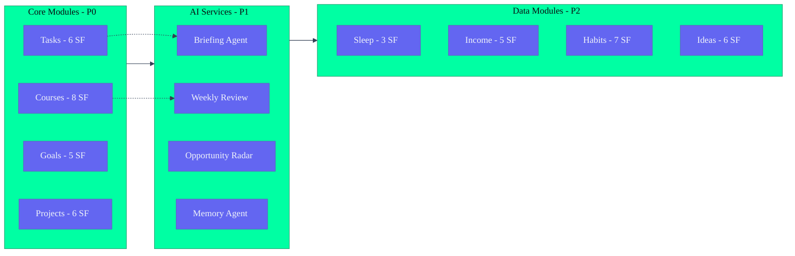

# Features Breakdown — Second Brain OS

## Document Control

| Field | Value |
|---|---|
| Document ID | PRD-FEA-001 |
| Version | 4.0.0 |
| Status | Active |
| Date | 2026-07-10 |
| Classification | Internal — Product Reference |
| Total Modules | 15 |
| Total Epics | 15 |
| Total Features | 87 |
| Total Sub-Features | 215 |
| Related Docs | [Acceptance Criteria](./07_AcceptanceCriteria.md), [User Stories](./06_UserStories.md) |

---

## Feature Taxonomy & Inter-Dependencies



## Module 1: Tasks (EPIC-01)

**Priority:** P0 | **Status:** Frontend Complete, Backend Complete (50 endpoints)

### Feature 1.1: Task CRUD (F-1.1)

| Attribute | Value |
|---|---|
| Priority | P0 |
| Dependencies | None |
| API Endpoints | GET /, POST /, PUT /{id}, DELETE /{id} |
| Frontend Route | /tasks |

**Sub-Features:**

| ID | Sub-Feature | Acceptance Criteria | Status |
|---|---|---|---|
| SF-1.1.1 | Create task | Title, description, priority, category, due_date, estimated_minutes supported; saved to Supabase | ✅ |
| SF-1.1.2 | Read tasks | List with priority sort, filter by status/category | ✅ |
| SF-1.1.3 | Update task | All fields modifiable; optimistic UI update | ✅ |
| SF-1.1.4 | Delete task | Confirmation dialog; removes from DB | ✅ |
| SF-1.1.5 | Get task by ID | Single task view with all fields | ✅ |
| SF-1.1.6 | Mark complete | Updates status, sets completed_at timestamp | ✅ |

### Feature 1.2: Priority & Categorization (F-1.2)

| Attribute | Value |
|---|---|
| Priority | P0 |
| Dependencies | F-1.1 |

**Sub-Features:**

| ID | Sub-Feature | Acceptance Criteria | Status |
|---|---|---|---|
| SF-1.2.1 | Priority levels | Urgent, High, Medium, Low with visual badges | ✅ |
| SF-1.2.2 | Category assignment | Study, Project, Habit, Personal, Income | ✅ |
| SF-1.2.3 | Priority sort | Tasks auto-sorted by priority + due_date | ✅ |
| SF-1.2.4 | Filter by status | All, Pending, In Progress, Completed, Missed | ✅ |
| SF-1.2.5 | Filter by category | Category pill filters | ✅ |

### Feature 1.3: Task Dependencies (F-1.3)

| Attribute | Value |
|---|---|
| Priority | P1 |
| Dependencies | F-1.1 |

**Sub-Features:**

| ID | Sub-Feature | Acceptance Criteria | Status |
|---|---|---|---|
| SF-1.3.1 | Set dependency | Task A blocks Task B; B can't start before A done | ❌ |
| SF-1.3.2 | Dependency graph | Visual tree of blocked/blocking tasks | ❌ |
| SF-1.3.3 | Auto-block | Dependency chain auto-resolved on completion | ❌ |
| SF-1.3.4 | Circular dependency detection | Prevent user from creating cycles | ❌ |

### Feature 1.4: Recurring Tasks (F-1.4)

| Attribute | Value |
|---|---|
| Priority | P1 |
| Dependencies | F-1.1 |

**Sub-Features:**

| ID | Sub-Feature | Acceptance Criteria | Status |
|---|---|---|---|
| SF-1.4.1 | Set recurrence | Daily, weekly, monthly, custom interval | ❌ |
| SF-1.4.2 | Auto-generation | Next instance created on completion | ❌ |
| SF-1.4.3 | Skip instance | Skip one occurrence without breaking recurrence | ❌ |
| SF-1.4.4 | End condition | After N occurrences or on date | ❌ |

### Feature 1.5: Auto-Reschedule (F-1.5)

| Attribute | Value |
|---|---|
| Priority | P0 |
| Dependencies | F-1.1 |

**Sub-Features:**

| ID | Sub-Feature | Acceptance Criteria | Status |
|---|---|---|---|
| SF-1.5.1 | Missed task detection | Cron checks overdue tasks every 15 min | ✅ |
| SF-1.5.2 | Missed count tracking | Increments missed_count on each detection | ✅ |
| SF-1.5.3 | Auto-reschedule | Moves due_date to next available slot | ✅ |
| SF-1.5.4 | Escalation | Push at 3, Email at 5, SMS at 7 misses | ✅ |

### Feature 1.6: Pomodoro Timer (F-1.6)

| Attribute | Value |
|---|---|
| Priority | P1 |
| Dependencies | F-1.1 |

**Sub-Features:**

| ID | Sub-Feature | Acceptance Criteria | Status |
|---|---|---|---|
| SF-1.6.1 | Start timer | 25-min focus countdown linked to task | ✅ (in Time module) |
| SF-1.6.2 | Break timer | 5-min break after focus | ✅ |
| SF-1.6.3 | Session log | Logs completed Pomodoro to time_entries | ✅ |
| SF-1.6.4 | Daily Pomodoro count | Shows completed sessions | ✅ |

### Feature 1.7: Task Search & Pagination (F-1.7)

| Attribute | Value |
|---|---|
| Priority | P1 |
| Dependencies | F-1.1 |

**Sub-Features:**

| ID | Sub-Feature | Acceptance Criteria | Status |
|---|---|---|---|
| SF-1.7.1 | Full-text search | Search by title, description | ❌ |
| SF-1.7.2 | Pagination | 20 tasks per page with cursor/offset | ❌ |
| SF-1.7.3 | Infinite scroll | Load more on scroll | ❌ |

---

## Module 2: Courses (EPIC-02)

**Priority:** P0 | **Status:** Frontend Complete, Backend Complete

### Feature 2.1: Course CRUD (F-2.1)

| Attribute | Value |
|---|---|
| Priority | P0 |
| Dependencies | None |
| API Endpoints | GET /, POST /, PUT /{id}, DELETE /{id} |
| Frontend Route | /courses |

**Sub-Features:**

| ID | Sub-Feature | Acceptance Criteria | Status |
|---|---|---|---|
| SF-2.1.1 | Create course | Title, platform, URL, total_videos, deadline, why_enrolled | ✅ |
| SF-2.1.2 | Read courses | List with progress bars, sorted by deadline | ✅ |
| SF-2.1.3 | Update course | All fields, progress %, completed_videos | ✅ |
| SF-2.1.4 | Delete course | Confirmation required | ✅ |

### Feature 2.2: Progress Tracking (F-2.2)

| Attribute | Value |
|---|---|
| Priority | P0 |
| Dependencies | F-2.1 |

**Sub-Features:**

| ID | Sub-Feature | Acceptance Criteria | Status |
|---|---|---|---|
| SF-2.2.1 | Video-based progress | completed_videos / total_videos | ✅ |
| SF-2.2.2 | Deadline calculation | Days remaining, required daily pace | ✅ |
| SF-2.2.3 | Status tracking | Not started, In Progress, Completed, Abandoned | ✅ |
| SF-2.2.4 | Behind-schedule detection | Compares required vs actual pace | ✅ |

### Feature 2.3: Study Task Generation (F-2.3)

| Attribute | Value |
|---|---|
| Priority | P0 |
| Dependencies | F-2.1 |

**Sub-Features:**

| ID | Sub-Feature | Acceptance Criteria | Status |
|---|---|---|---|
| SF-2.3.1 | Auto-create study task | 25-min study task created for behind course | ✅ |
| SF-2.3.2 | Daily target display | "Need X min/day" shown in UI | ✅ |
| SF-2.3.3 | Nudge notification | 6 PM push if course is behind | ✅ |

---

## Module 3: Goals (EPIC-03)

**Priority:** P0 | **Status:** Frontend Partial, Backend Complete

### Feature 3.1: Goal CRUD (F-3.1)

| Attribute | Value |
|---|---|
| Priority | P0 |
| Dependencies | None |
| API Endpoints | GET /, POST /, PUT /{id}, DELETE /{id} |
| Frontend Route | /goals |

**Sub-Features:**

| ID | Sub-Feature | Acceptance Criteria | Status |
|---|---|---|---|
| SF-3.1.1 | Create goal | Title, description, roadmap_type, target_date, hours_per_day, intensity | ✅ |
| SF-3.1.2 | Read goals | List with progress %, sorted by status | ✅ |
| SF-3.1.3 | Update goal | All fields mutable | ✅ |
| SF-3.1.4 | Delete goal | Confirmation required | ✅ |

### Feature 3.2: Roadmap Builder (F-3.2)

| Attribute | Value |
|---|---|
| Priority | P0 |
| Dependencies | F-3.1 |

**Sub-Features:**

| ID | Sub-Feature | Acceptance Criteria | Status |
|---|---|---|---|
| SF-3.2.1 | Visual roadmap | React Flow editor with nodes and edges | ⚠️ Shell only (no API) |
| SF-3.2.2 | Add milestone | Title, description, type, estimated_hours | ⚠️ |
| SF-3.2.3 | Set dependencies | Drag edge between milestones | ⚠️ |
| SF-3.2.4 | Auto-layout | Automatic node positioning | ❌ |
| SF-3.2.5 | Timeline projection | Visual timeline bar with milestones | ❌ |

### Feature 3.3: Scenario Planning (F-3.3)

| Attribute | Value |
|---|---|
| Priority | P1 |
| Dependencies | F-3.1 |

**Sub-Features:**

| ID | Sub-Feature | Acceptance Criteria | Status |
|---|---|---|---|
| SF-3.3.1 | What-if simulation | "What if I study 1h/day?" shows adjusted timeline | ❌ |
| SF-3.3.2 | Intensity slider | Adjustable low/medium/high intensity | ❌ |
| SF-3.3.3 | Hard-deadline mode | Work backwards from fixed date | ❌ |

### Feature 3.4: Weekly Relevance Check (F-3.4)

| Attribute | Value |
|---|---|
| Priority | P1 |
| Dependencies | F-3.1, AI Agent |

**Sub-Features:**

| ID | Sub-Feature | Acceptance Criteria | Status |
|---|---|---|---|
| SF-3.4.1 | Auto-check milestones | Sunday scan: are roadmap items still relevant? | ❌ |
| SF-3.4.2 | Change suggestion | "React 19 released — consider updating" | ❌ |
| SF-3.4.3 | Relevance score | 0-100 for each milestone | ❌ |

### Feature 3.5: Goal Analytics (F-3.5)

| Attribute | Value |
|---|---|
| Priority | P2 |
| Dependencies | F-3.1 |

**Sub-Features:**

| ID | Sub-Feature | Acceptance Criteria | Status |
|---|---|---|---|
| SF-3.5.1 | Progress velocity | % change per week | ❌ |
| SF-3.5.2 | Completion prediction | Predicted vs target date | ❌ |
| SF-3.5.3 | Goal completion rate | % of goals completed on time | ❌ |

---

## Module 4: Habits (EPIC-04)

**Priority:** P0 | **Status:** Frontend Complete, Backend Complete

### Feature 4.1: Habit CRUD (F-4.1)

| Attribute | Value |
|---|---|
| Priority | P0 |
| Dependencies | None |
| API Endpoints | GET /, POST /, PUT /{id}, DELETE /{id} |
| Frontend Route | /habits |

**Sub-Features:**

| ID | Sub-Feature | Acceptance Criteria | Status |
|---|---|---|---|
| SF-4.1.1 | Create habit | Name, frequency, custom_days, time_target_minutes | ✅ |
| SF-4.1.2 | Read habits | List with streak, consistency % | ✅ |
| SF-4.1.3 | Update habit | All fields mutable | ✅ |
| SF-4.1.4 | Delete/archive habit | Soft delete (archive) | ✅ |

### Feature 4.2: Habit Tracking (F-4.2)

| Attribute | Value |
|---|---|
| Priority | P0 |
| Dependencies | F-4.1 |

**Sub-Features:**

| ID | Sub-Feature | Acceptance Criteria | Status |
|---|---|---|---|
| SF-4.2.1 | Daily check-in | Mark habit as done for today | ✅ |
| SF-4.2.2 | Streak tracking | Current streak, best streak, consistency % | ✅ |
| SF-4.2.3 | Weekly calendar | Visual calendar showing 30-day completion | ✅ |
| SF-4.2.4 | Goal-linked habits | Habits tied to a parent goal | ✅ |

### Feature 4.3: Habit Notifications (F-4.3)

| Attribute | Value |
|---|---|
| Priority | P1 |
| Dependencies | F-4.1 |

**Sub-Features:**

| ID | Sub-Feature | Acceptance Criteria | Status |
|---|---|---|---|
| SF-4.3.1 | Streak-at-risk alert | Push notification at 2 consecutive misses | ✅ |
| SF-4.3.2 | Daily check-in reminder | 8 PM push if habit not logged | ✅ |
| SF-4.3.3 | Consistency report | Weekly summary in review | ✅ |

---

## Module 5: Sleep (EPIC-05)

**Priority:** P0 | **Status:** Frontend Complete, Backend Complete

### Feature 5.1: Sleep Logging (F-5.1)

| Attribute | Value |
|---|---|
| Priority | P0 |
| Dependencies | None |
| API Endpoints | GET /, POST /, DELETE /{id} |
| Frontend Route | /sleep |

**Sub-Features:**

| ID | Sub-Feature | Acceptance Criteria | Status |
|---|---|---|---|
| SF-5.1.1 | Log sleep | Bedtime, wake_time, quality_rating | ✅ |
| SF-5.1.2 | Auto-calculate duration | Duration in hours from bedtime → wake | ✅ |
| SF-5.1.3 | View history | Last 30 logs with scores | ✅ |

### Feature 5.2: Sleep Score (F-5.2)

| Attribute | Value |
|---|---|
| Priority | P0 |
| Dependencies | F-5.1 |

**Sub-Features:**

| ID | Sub-Feature | Acceptance Criteria | Status |
|---|---|---|---|
| SF-5.2.1 | Score calculation | Combination of duration + quality, max 100 | ✅ |
| SF-5.2.2 | Sleep debt | Rolling 7-day debt = (8h - actual_duration) | ✅ |
| SF-5.2.3 | Score display | Score card with color indicator | ✅ |

### Feature 5.3: Wind-Down Reminder (F-5.3)

| Attribute | Value |
|---|---|
| Priority | P1 |
| Dependencies | F-5.1 |

**Sub-Features:**

| ID | Sub-Feature | Acceptance Criteria | Status |
|---|---|---|---|
| SF-5.3.1 | 9:30 PM push | Wind-down notification with tomorrow's first task | ✅ |
| SF-5.3.2 | Bedtime goal | User-configurable target bedtime | ✅ |

### Feature 5.4: Morning Adjustment (F-5.4)

| Attribute | Value |
|---|---|
| Priority | P1 |
| Dependencies | F-5.1, Planner Agent |

**Sub-Features:**

| ID | Sub-Feature | Acceptance Criteria | Status |
|---|---|---|---|
| SF-5.4.1 | Score < 50 adjustment | Heavy tasks moved to afternoon | ❌ |
| SF-5.4.2 | Score < 30 adjustment | Total tasks reduced by 50% | ❌ |
| SF-5.4.3 | Plan notification | User notified of adjusted plan | ❌ |

---

## Module 6: Income (EPIC-06)

**Priority:** P0 | **Status:** Frontend Complete, Backend Complete

### Feature 6.1: Income Source Tracking (F-6.1)

| Attribute | Value |
|---|---|
| Priority | P0 |
| Dependencies | None |
| API Endpoints | GET /, POST /, PUT /{id}, DELETE /{id} |
| Frontend Route | /income |

**Sub-Features:**

| ID | Sub-Feature | Acceptance Criteria | Status |
|---|---|---|---|
| SF-6.1.1 | Add income source | Platform, type, description | ✅ |
| SF-6.1.2 | Log income entry | Amount, date, hours_spent, source | ✅ |
| SF-6.1.3 | Hourly rate calc | Auto-calculated if hours_spent provided | ✅ |
| SF-6.1.4 | Effective rate | amount / hours_spent | ✅ |

### Feature 6.2: Income Analytics (F-6.2)

| Attribute | Value |
|---|---|
| Priority | P1 |
| Dependencies | F-6.1 |

**Sub-Features:**

| ID | Sub-Feature | Acceptance Criteria | Status |
|---|---|---|---|
| SF-6.2.1 | Monthly total | Income chart by month | ✅ |
| SF-6.2.2 | Source breakdown | Pie chart by source type | ✅ |
| SF-6.2.3 | Hourly rate trend | Rate over time chart | ✅ |
| SF-6.2.4 | Milestone tracking | "Earned $1K total" badges | ✅ |

### Feature 6.3: Skill-to-Income Mapping (F-6.3)

| Attribute | Value |
|---|---|
| Priority | P2 |
| Dependencies | F-6.1, Career Agent |

**Sub-Features:**

| ID | Sub-Feature | Acceptance Criteria | Status |
|---|---|---|---|
| SF-6.3.1 | Tag skills to income | Associate skill with each income entry | ❌ |
| SF-6.3.2 | Skill monetization chart | Which skills generate most income | ❌ |
| SF-6.3.3 | Recommend monetization | "Your Python skills could earn ₹X on Fiverr" | ❌ |

---

## Module 7: Projects (EPIC-07)

**Priority:** P1 | **Status:** Frontend Complete, Backend Complete

### Feature 7.1: Project CRUD (F-7.1)

| Attribute | Value |
|---|---|
| Priority | P1 |
| Dependencies | None |
| API Endpoints | GET /, POST /, PUT /{id}, DELETE /{id} |
| Frontend Route | /projects |

**Sub-Features:**

| ID | Sub-Feature | Acceptance Criteria | Status |
|---|---|---|---|
| SF-7.1.1 | Create project | Title, description, phase, github_url, live_url, next_action | ✅ |
| SF-7.1.2 | Read projects | List with phase filter, sorted by last_updated | ✅ |
| SF-7.1.3 | Update project | All fields, phase changes, blocker tracking | ✅ |
| SF-7.1.4 | Delete project | Confirmation required | ✅ |

### Feature 7.2: Phase Management (F-7.2)

| Attribute | Value |
|---|---|
| Priority | P1 |
| Dependencies | F-7.1 |

**Sub-Features:**

| ID | Sub-Feature | Acceptance Criteria | Status |
|---|---|---|---|
| SF-7.2.1 | Phase tracking | Planning → Building → Testing → Deployed → Maintained | ✅ |
| SF-7.2.2 | Next action | Single next step displayed prominently | ✅ |
| SF-7.2.3 | Blocker tracking | Mark blocker, set type, link to resource | ✅ |

### Feature 7.3: GitHub Integration (F-7.3)

| Attribute | Value |
|---|---|
| Priority | P2 |
| Dependencies | F-7.1 |

**Sub-Features:**

| ID | Sub-Feature | Acceptance Criteria | Status |
|---|---|---|---|
| SF-7.3.1 | Link GitHub repo | URL + auto-fetch metadata | ⚠️ URL store only |
| SF-7.3.2 | Commit activity | Show recent commits in project view | ❌ |
| SF-7.3.3 | PR count | Open/merged PR count | ❌ |

### Feature 7.4: LinkedIn Post Draft (F-7.4)

| Attribute | Value |
|---|---|
| Priority | P2 |
| Dependencies | F-7.1, AI Agent |

**Sub-Features:**

| ID | Sub-Feature | Acceptance Criteria | Status |
|---|---|---|---|
| SF-7.4.1 | Generate post | AI drafts LinkedIn post from project data | ❌ |
| SF-7.4.2 | Edit + approve | User can edit before posting | ❌ |
| SF-7.4.3 | Post history | Track which projects got posted | ❌ |

---

## Module 8: Ideas (EPIC-08)

**Priority:** P0 | **Status:** Frontend Complete, Backend Complete

### Feature 8.1: Idea CRUD (F-8.1)

| Attribute | Value |
|---|---|
| Priority | P0 |
| Dependencies | None |
| API Endpoints | GET /, POST /, PUT /{id}, DELETE /{id} |
| Frontend Route | /ideas |

**Sub-Features:**

| ID | Sub-Feature | Acceptance Criteria | Status |
|---|---|---|---|
| SF-8.1.1 | Capture idea | Title, description, quick capture | ✅ |
| SF-8.1.2 | Update idea | Market research, competitors, status | ✅ |
| SF-8.1.3 | Delete idea | Confirmation | ✅ |

### Feature 8.2: Idea Pipeline (F-8.2)

| Attribute | Value |
|---|---|
| Priority | P0 |
| Dependencies | F-8.1 |

**Sub-Features:**

| ID | Sub-Feature | Acceptance Criteria | Status |
|---|---|---|---|
| SF-8.2.1 | Pipeline stages | Raw → Validating → Planned → Building → Launched | ✅ |
| SF-8.2.2 | Stage drag | Move ideas between stages | ✅ |
| SF-8.2.3 | Stage count | Count per stage in header | ✅ |

### Feature 8.3: AI Market Check (F-8.3)

| Attribute | Value |
|---|---|
| Priority | P1 |
| Dependencies | F-8.1, AI Agent |

**Sub-Features:**

| ID | Sub-Feature | Acceptance Criteria | Status |
|---|---|---|---|
| SF-8.3.1 | Market research | AI analyzes competitors for the idea | ❌ (UI has field) |
| SF-8.3.2 | Feasibility score | 0-100 AI-generated feasibility rating | ❌ |
| SF-8.3.3 | Similar ideas | AI finds similar projects/products | ❌ |

---

## Module 9: Resources (EPIC-09)

**Priority:** P0 | **Status:** Frontend Complete, Backend Complete

### Feature 9.1: Resource CRUD (F-9.1)

| Attribute | Value |
|---|---|
| Priority | P0 |
| Dependencies | None |
| API Endpoints | GET /, POST /, PUT /{id}, DELETE /{id} |
| Frontend Route | /resources |

**Sub-Features:**

| ID | Sub-Feature | Acceptance Criteria | Status |
|---|---|---|---|
| SF-9.1.1 | Save resource | URL, title, type, tags, notes | ✅ |
| SF-9.1.2 | Update resource | All fields, archive toggle | ✅ |
| SF-9.1.3 | Delete resource | Confirmation | ✅ |

### Feature 9.2: Organization (F-9.2)

| Attribute | Value |
|---|---|
| Priority | P0 |
| Dependencies | F-9.1 |

**Sub-Features:**

| ID | Sub-Feature | Acceptance Criteria | Status |
|---|---|---|---|
| SF-9.2.1 | Auto-tagging | Tags extracted from URL/title | ✅ |
| SF-9.2.2 | Type filter | Article, Video, Book, Documentation, Tool, Course | ✅ |
| SF-9.2.3 | Natural language search | "React hooks tutorial" returns relevant resources | ✅ |

### Feature 9.3: AI Summarization (F-9.3)

| Attribute | Value |
|---|---|
| Priority | P1 |
| Dependencies | F-9.1, AI Agent |

**Sub-Features:**

| ID | Sub-Feature | Acceptance Criteria | Status |
|---|---|---|---|
| SF-9.3.1 | Auto-summary | AI generates 2-3 sentence summary of URL | ❌ |
| SF-9.3.2 | Key takeaways | Bullet-point key points | ❌ |
| SF-9.3.3 | Read-later queue | Resources marked for later reading | ❌ |

---

## Module 10: Opportunities (EPIC-10)

**Priority:** P0 | **Status:** Frontend Partial, Backend Complete

### Feature 10.1: Opportunity Display (F-10.1)

| Attribute | Value |
|---|---|
| Priority | P0 |
| Dependencies | None |
| API Endpoints | GET /, POST /, PUT /{id}, DELETE /{id} |
| Frontend Route | /opportunities |

**Sub-Features:**

| ID | Sub-Feature | Acceptance Criteria | Status |
|---|---|---|---|
| SF-10.1.1 | List opportunities | Cards with title, company, match_score, deadline | ⚠️ Uses mock data |
| SF-10.1.2 | Filter by type | Internship, Hackathon, Open Source, Fellowship, Freelance | ⚠️ |
| SF-10.1.3 | Sort by match | Sort by match_score descending | ⚠️ |
| SF-10.1.4 | Save/applied/reject | User action tracking on each opportunity | ⚠️ |

### Feature 10.2: Auto-Scanning (F-10.2)

| Attribute | Value |
|---|---|
| Priority | P0 |
| Dependencies | AI Agent |

**Sub-Features:**

| ID | Sub-Feature | Acceptance Criteria | Status |
|---|---|---|---|
| SF-10.2.1 | Daily scan | 6 AM cron scans 6 categories | ✅ (AI-powered now) |
| SF-10.2.2 | Match scoring | 0-100 based on skills + interests | ✅ |
| SF-10.2.3 | Filter low matches | < 40 match hidden | ✅ |

### Feature 10.3: Deadline Alerts (F-10.3)

| Attribute | Value |
|---|---|
| Priority | P1 |
| Dependencies | F-10.1 |

**Sub-Features:**

| ID | Sub-Feature | Acceptance Criteria | Status |
|---|---|---|---|
| SF-10.3.1 | 48h alert | Push notification for closing opportunities | ❌ |
| SF-10.3.2 | Daily countdown | Show upcoming deadlines in briefing | ❌ |
| SF-10.3.3 | Priority sorting | Sort by deadline + match | ❌ |

---

## Module 11: Academics (EPIC-11)

**Priority:** P1 | **Status:** Frontend Complete, Backend Complete (inline)

### Feature 11.1: CGPA Calculator (F-11.1)

| Attribute | Value |
|---|---|
| Priority | P1 |
| Dependencies | None |
| Frontend Route | /academics |

**Sub-Features:**

| ID | Sub-Feature | Acceptance Criteria | Status |
|---|---|---|---|
| SF-11.1.1 | Add subject | Semester, subject name, credits | ✅ |
| SF-11.1.2 | Add marks | Internal, external, total | ✅ |
| SF-11.1.3 | Calculate CGPA | Weighted average across all semesters | ✅ |
| SF-11.1.4 | Semester view | Per-semester GPA breakdown | ✅ |

### Feature 11.2: Exam Countdown (F-11.2)

| Attribute | Value |
|---|---|
| Priority | P1 |
| Dependencies | F-11.1 |

**Sub-Features:**

| ID | Sub-Feature | Acceptance Criteria | Status |
|---|---|---|---|
| SF-11.2.1 | Add exam | Subject, date, type (midterm/final) | ✅ |
| SF-11.2.2 | Countdown timer | Days remaining with color urgency | ✅ |
| SF-11.2.3 | Exam calendar | Semester view of all exams | ✅ |

### Feature 11.3: Grade Prediction (F-11.3)

| Attribute | Value |
|---|---|
| Priority | P2 |
| Dependencies | F-11.1 |

**Sub-Features:**

| ID | Sub-Feature | Acceptance Criteria | Status |
|---|---|---|---|
| SF-11.3.1 | Target CGPA | "I want 8.5 CGPA" → required marks per subject | ❌ |
| SF-11.3.2 | What-if scenario | "If I score X in finals, my CGPA will be Y" | ❌ |

---

## Module 12: YouTube (EPIC-12)

**Priority:** P0 | **Status:** Frontend Complete

### Feature 12.1: YouTube Save (F-12.1)

| Attribute | Value |
|---|---|
| Priority | P0 |
| Dependencies | None |
| Frontend Route | /youtube |

**Sub-Features:**

| ID | Sub-Feature | Acceptance Criteria | Status |
|---|---|---|---|
| SF-12.1.1 | Save video | URL, title, channel, duration | ✅ |
| SF-12.1.2 | Auto-fetch metadata | Title, thumbnail from YouTube API | ✅ |
| SF-12.1.3 | Categorize | Topic, course, project tags | ✅ |

### Feature 12.2: Watch Scheduling (F-12.2)

| Attribute | Value |
|---|---|
| Priority | P1 |
| Dependencies | F-12.1 |

**Sub-Features:**

| ID | Sub-Feature | Acceptance Criteria | Status |
|---|---|---|---|
| SF-12.2.1 | Schedule for later | Assign date/time to watch | ✅ |
| SF-12.2.2 | Expiry system | Videos expire if not watched by scheduled date | ✅ |
| SF-12.2.3 | Watch queue | Sorted by scheduled date | ✅ |

### Feature 12.3: AI Summary (F-12.3)

| Attribute | Value |
|---|---|
| Priority | P1 |
| Dependencies | F-12.1, AI Agent |

**Sub-Features:**

| ID | Sub-Feature | Acceptance Criteria | Status |
|---|---|---|---|
| SF-12.3.1 | Auto-summary | AI generates summary from video title | ⚠️ Basic |
| SF-12.3.2 | Topic extraction | Extracts technologies/topics mentioned | ❌ |
| SF-12.3.3 | Related resources | Suggests similar videos from library | ❌ |

---

## Module 13: Chat / ARIA (EPIC-13)

**Priority:** P0 | **Status:** Frontend Complete, Backend Complete (AI-wired)

### Feature 13.1: Chat Interface (F-13.1)

| Attribute | Value |
|---|---|
| Priority | P0 |
| Dependencies | None |
| API Endpoints | POST / |
| Frontend Route | /chat |

**Sub-Features:**

| ID | Sub-Feature | Acceptance Criteria | Status |
|---|---|---|---|
| SF-13.1.1 | Message input | Text input with send button | ✅ |
| SF-13.1.2 | Message history | Scrollable chat history | ✅ |
| SF-13.1.3 | Role indicators | User vs ARIA message styling | ✅ |
| SF-13.1.4 | Typing indicator | Shows when ARIA is generating | ✅ |

### Feature 13.2: Intent Recognition (F-13.2)

| Attribute | Value |
|---|---|
| Priority | P0 |
| Dependencies | AI Agent |

**Sub-Features:**

| ID | Sub-Feature | Acceptance Criteria | Status |
|---|---|---|---|
| SF-13.2.1 | Task intent | "Add task" creates a new task | ✅ |
| SF-13.2.2 | Query intent | "Show my tasks" lists tasks | ✅ |
| SF-13.2.3 | Goal intent | "Create goal" initiates goal flow | ✅ |
| SF-13.2.4 | Mixed intent | "Add task and show goals" handles both | ❌ |

### Feature 13.3: Action Execution (F-13.3)

| Attribute | Value |
|---|---|
| Priority | P0 |
| Dependencies | F-13.1 |

**Sub-Features:**

| ID | Sub-Feature | Acceptance Criteria | Status |
|---|---|---|---|
| SF-13.3.1 | Create from chat | "Add task to study DBMS" creates in DB | ✅ |
| SF-13.3.2 | Update from chat | "Mark task X as done" updates status | ✅ |
| SF-13.3.3 | Delete from chat | "Delete task X" requires confirmation | ❌ |
| SF-13.3.4 | Log from chat | "Log 2h study" creates time entry | ✅ |

### Feature 13.4: Context Awareness (F-13.4)

| Attribute | Value |
|---|---|
| Priority | P0 |
| Dependencies | F-13.1 |

**Sub-Features:**

| ID | Sub-Feature | Acceptance Criteria | Status |
|---|---|---|---|
| SF-13.4.1 | Day context | ARIA knows time of day, adjusts tone | ✅ |
| SF-13.4.2 | Pending count | ARIA knows how many tasks are pending | ✅ |
| SF-13.4.3 | Recent activity | ARIA knows what user did today | ✅ |

### Feature 13.5: Memory (F-13.5)

| Attribute | Value |
|---|---|
| Priority | P0 |
| Dependencies | F-13.1, Memory Agent |

**Sub-Features:**

| ID | Sub-Feature | Acceptance Criteria | Status |
|---|---|---|---|
| SF-13.5.1 | Fact extraction | Remembers preferences from chat | ✅ |
| SF-13.5.2 | Fact recall | "Remember I prefer morning study" → uses it | ✅ |
| SF-13.5.3 | Forget command | "Forget that" removes memory | ✅ |
| SF-13.5.4 | Pattern detection | Notices productivity patterns | ⚠️ Basic |

---

## Module 14: Automation Dashboard (EPIC-14)

**Priority:** P1 | **Status:** Frontend Complete, Backend Complete

### Feature 14.1: Cron Status (F-14.1)

| Attribute | Value |
|---|---|
| Priority | P1 |
| Dependencies | Scheduler |
| Frontend Route | /automation |

**Sub-Features:**

| ID | Sub-Feature | Acceptance Criteria | Status |
|---|---|---|---|
| SF-14.1.1 | Job list | All 15 cron jobs with schedule | ✅ |
| SF-14.1.2 | Status indicator | Last run, next run, green/red status | ✅ |
| SF-14.1.3 | Schedule display | Human-readable schedule times | ✅ |

### Feature 14.2: Manual Trigger (F-14.2)

| Attribute | Value |
|---|---|
| Priority | P1 |
| Dependencies | F-14.1 |

**Sub-Features:**

| ID | Sub-Feature | Acceptance Criteria | Status |
|---|---|---|---|
| SF-14.2.1 | Trigger briefing | POST /trigger/briefing | ✅ |
| SF-14.2.2 | Trigger radar | POST /trigger/radar | ✅ |
| SF-14.2.3 | Trigger weekly review | POST /trigger/weekly-review | ✅ |
| SF-14.2.4 | Result display | Shows output after trigger | ✅ |

---

## Module 15: Time Tracking (EPIC-15)

**Priority:** P0 | **Status:** Frontend Complete, Backend Complete

### Feature 15.1: Time Entry (F-15.1)

| Attribute | Value |
|---|---|
| Priority | P0 |
| Dependencies | None |
| API Endpoints | GET /, POST /, PUT /{id}, DELETE /{id}, POST /stop, GET /stats/daily |
| Frontend Route | /time |

**Sub-Features:**

| ID | Sub-Feature | Acceptance Criteria | Status |
|---|---|---|---|
| SF-15.1.1 | Start timer | Begin tracking with task/category | ✅ |
| SF-15.1.2 | Stop timer | End tracking, auto-calculate duration | ✅ |
| SF-15.1.3 | Manual entry | Log past session manually | ✅ |
| SF-15.1.4 | Category assignment | Work, Study, Project, Break | ✅ |

### Feature 15.2: Daily Stats (F-15.2)

| Attribute | Value |
|---|---|
| Priority | P0 |
| Dependencies | F-15.1 |

**Sub-Features:**

| ID | Sub-Feature | Acceptance Criteria | Status |
|---|---|---|---|
| SF-15.2.1 | Daily breakdown | Minutes per category | ✅ |
| SF-15.2.2 | Total focus time | Sum of all tracked time | ✅ |
| SF-15.2.3 | Category pie chart | Visual breakdown | ✅ |

### Feature 15.3: Pomodoro Mode (F-15.3)

| Attribute | Value |
|---|---|
| Priority | P1 |
| Dependencies | F-15.1 |

**Sub-Features:**

| ID | Sub-Feature | Acceptance Criteria | Status |
|---|---|---|---|
| SF-15.3.1 | 25-min focus | Countdown timer | ✅ |
| SF-15.3.2 | 5-min break | Auto-transition | ✅ |
| SF-15.3.3 | Session counter | Completed sessions today | ✅ |

### Feature 15.4: Deep Work Detection (F-15.4)

| Attribute | Value |
|---|---|
| Priority | P2 |
| Dependencies | F-15.1 |

**Sub-Features:**

| ID | Sub-Feature | Acceptance Criteria | Status |
|---|---|---|---|
| SF-15.4.1 | Long focus flag | Sessions > 90 min flagged as deep work | ✅ |
| SF-15.4.2 | Deep work count | Count per week | ✅ |
| SF-15.4.3 | Peak hours | Detect user's most productive hours | ❌ |

---

## Cross-Cutting Features

### CC-1: Daily Briefing

| Attribute | Value |
|---|---|
| Priority | P0 |
| Dependencies | AI Agent, All Modules |
| Trigger | 7 AM daily (cron) |

**Sub-Features:**

| ID | Sub-Feature | Acceptance Criteria | Status |
|---|---|---|---|
| SF-CC-1.1 | Top-3 tasks | Priority + deadline sorted | ✅ |
| SF-CC-1.2 | ARIA's pick | Single most important task with reason | ✅ |
| SF-CC-1.3 | Sleep-adjusted | Tone/volume adjusts based on sleep score | ✅ |
| SF-CC-1.4 | Course target | Daily study minutes needed | ✅ |
| SF-CC-1.5 | New opportunities | Overnight matches | ✅ |
| SF-CC-1.6 | Push delivery | Delivered at 7:00 AM ± 2 min | ✅ |

### CC-2: Weekly Review

| Attribute | Value |
|---|---|
| Priority | P0 |
| Dependencies | AI Agent, All Modules |
| Trigger | Sunday 8 PM (cron) |

**Sub-Features:**

| ID | Sub-Feature | Acceptance Criteria | Status |
|---|---|---|---|
| SF-CC-2.1 | Pattern detection | One behavioral pattern user missed | ✅ |
| SF-CC-2.2 | Week-over-week | 6+ metric comparisons | ✅ |
| SF-CC-2.3 | Recommendations | 3 actionable suggestions | ✅ |
| SF-CC-2.4 | Email delivery | Resend API delivery | ✅ |
| SF-CC-2.5 | In-app save | Stored in weekly_reviews table | ✅ |

### CC-3: Data Export

| Attribute | Value |
|---|---|
| Priority | P1 |
| Dependencies | All Modules |

| ID | Sub-Feature | Acceptance Criteria | Status |
|---|---|---|---|
| SF-CC-3.1 | JSON export | All user data as JSON | ❌ |
| SF-CC-3.2 | CSV export | Per-module CSV download | ❌ |
| SF-CC-3.3 | Scheduled backup | Monthly auto-export | ❌ |

### CC-4: PWA

| Attribute | Value |
|---|---|
| Priority | P1 |
| Dependencies | None |

| ID | Sub-Feature | Acceptance Criteria | Status |
|---|---|---|---|
| SF-CC-4.1 | Manifest | Installable via browser prompt | ❌ |
| SF-CC-4.2 | Service worker | Offline CRUD caching | ❌ |
| SF-CC-4.3 | Push notifications | Browser push for reminders | ❌ |

### CC-5: Onboarding

| Attribute | Value |
|---|---|
| Priority | P1 |
| Dependencies | Frontend |

| ID | Sub-Feature | Acceptance Criteria | Status |
|---|---|---|---|
| SF-CC-5.1 | Step 1: Goals | "What do you want to achieve?" | ❌ |
| SF-CC-5.2 | Step 2: Skills | Current skills + target | ❌ |
| SF-CC-5.3 | Step 3: Courses | Courses you're taking | ❌ |
| SF-CC-5.4 | Step 4: Habits | Habits to track | ❌ |
| SF-CC-5.5 | Step 5: Schedule | Available hours, bedtime | ❌ |
| SF-CC-5.6 | First briefing | Generate after onboarding | ❌ |

---

## Feature Dependency Graph

```
                    ┌─────────────┐
                    │  Auth/User   │
                    └──────┬──────┘
                           │
           ┌───────────────┼───────────────┐
           │               │               │
     ┌─────▼─────┐   ┌────▼────┐   ┌──────▼─────┐
     │   Tasks    │   │  Time   │   │   Chat     │
     │ (P0, F-1) │   │(P0,F-15)│   │(P0, F-13)  │
     └──┬──┬──┬──┘   └────┬────┘   └──────┬─────┘
        │  │  │           │               │
        │  │  │      ┌────▼────┐          │
        │  │  └──────│ Courses │◄─────────┘
        │  │         │ (P0,F-2)│
        │  │         └──┬──┬───┘
        │  │            │  │
   ┌────▼──▼────┐  ┌────▼──▼────┐
   │   Goals    │  │  YouTube   │
   │ (P0, F-3) │  │ (P0, F-12) │
   └──┬──┬──┬──┘  └──────┬─────┘
      │  │  │             │
      │  │  │        ┌────▼────┐
      │  │  └────────│Resources│
      │  │           │(P0, F-9)│
      │  │           └────┬────┘
 ┌────▼──▼────┐           │
 │   Habits   │      ┌────▼────┐
 │ (P0, F-4)  │      │  Ideas  │
 └──────┬─────┘      │(P0, F-8)│
        │            └────┬────┘
   ┌────▼────┐            │
   │  Sleep  │       ┌────▼────┐
   │ (P0,F-5)│       │Opportun.│
   └────┬────┘       │(P0,F-10)│
        │            └─────────┘
   ┌────▼────┐
   │  Income │
   │ (P0,F-6)│
   └────┬────┘
        │
   ┌────▼────┐
   │Projects │
   │ (P1,F-7)│
   └────┬────┘
        │
   ┌────▼─────┐
   │Academics │
   │ (P1,F-11)│
   └──────────┘
```

---

## Revision History

| Version | Date | Author | Changes |
|---|---|---|---|
| 1.0.0 | 2026-04-01 | Product Team | Initial features breakdown |
| 2.0.0 | 2026-06-01 | Product Team | Updated for monorepo structure |
| 3.0.0 | 2026-06-11 | Product Team | Added status tracking, dependency graph, enterprise sub-features |
