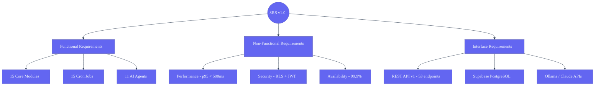

# Software Requirements Specification (SRS) — Second Brain OS

## Document Control
| Field | Value |
|---|---|
| Document ID | PRD-SRS-001 |
| Version | 1.0.0 |
| Status | Draft |
| Date | 2026-06-11 |

---

## Software Requirements Hierarchy

## 1. Introduction

### 1.1 Purpose
This Software Requirements Specification (SRS) defines the detailed functional and non-functional requirements for Second Brain OS, a personal AI productivity system for BTech CSE students. It is intended for developers, testers, and maintainers of the system.

### 1.2 Scope
The system comprises 15 integrated modules, an AI agent (ARIA) with 11 agents, a scheduler with 15 cron jobs, a browser extension, and a mobile-responsive PWA frontend. The system operates on free-tier infrastructure (Vercel, Supabase, Brave Search API, Ollama, Claude API).

### 1.3 Definitions

| Term | Definition |
|---|---|
| ARIA | Adaptive Reasoning and Intelligence Assistant — the AI core |
| Module | A functional area of the system (e.g., Task Manager, Course Tracker) |
| RLS | Row Level Security — Supabase security policy per user |
| Edge Function | Serverless function running on Supabase for cron-triggered tasks |
| Zero Miss | Policy where every task is done, rescheduled, or explicitly dropped |
| Resurface Engine | Algorithm that surfaces saved content related to current activity |
| Opportunity Radar | Daily scanner matching external opportunities to user skills |

---

## 2. Overall Description

### 2.1 Product Perspective
Second Brain OS is a standalone personal productivity system. It does not integrate with enterprise systems. External interfaces include: Google OAuth, Google Calendar API, Brave Search API, Claude API, Resend API, Twilio SMS API, YouTube oEmbed, GitHub API, Web Push API, Web Speech API.

### 2.2 Product Functions (Summary)
- 15 integrated modules with CRUD operations
- ARIA AI agent with context-aware conversation
- 15 scheduled cron jobs running daily/weekly/15-minutely
- Multi-channel notifications (push, email, SMS)
- PWA with offline capability
- Browser extension for one-tap saving
- Voice input via Web Speech API
- Data export to JSON

### 2.3 User Characteristics
- BTech CSE students aged 18-22
- Comfortable with web browsers and basic CLI
- Low patience for setup friction
- High responsiveness to morning briefings and push notifications
- Value privacy and zero-cost solutions

### 2.4 Assumptions and Dependencies
- User has internet connectivity for cloud sync (offline mode supports read + local writes)
- User has a Google account for OAuth
- Supabase, Vercel, Brave Search, Resend maintain their free tiers
- Claude API free credits last through Phase 3 development
- User uses Chrome or Firefox (for browser extension)

---

## 3. Functional Requirements — By Module

### 3.1 Module 1: Dashboard & Morning Briefing (FR-DASH)

| ID | Requirement | Priority |
|---|---|---|
| FR-DASH-01 | System shall display a daily briefing at 7 AM IST with top 3 tasks, overnight opportunities, course target, roadmap status, and ARIA top pick | Critical |
| FR-DASH-02 | System shall calculate a live productivity score (0-100) based on tasks completed, study time, sleep quality, and habit streaks | High |
| FR-DASH-03 | System shall render a GitHub-style activity heatmap showing 6 months of daily productivity | Medium |
| FR-DASH-04 | System shall provide a quick capture button (task, idea, resource) from any page | High |
| FR-DASH-05 | System shall display today's time-blocked schedule generated by ARIA each morning | High |
| FR-DASH-06 | System shall calculate productivity score as: (tasks_completed_today / tasks_due_today * 100) | High |
| FR-DASH-07 | System shall mark briefing as read when user opens it, tracking engagement | Medium |

### 3.2 Module 2: Task Manager (FR-TASK)

| ID | Requirement | Priority |
|---|---|---|
| FR-TASK-01 | System shall allow creation of tasks with title, priority, category, estimated time, due date, and recurrence | Critical |
| FR-TASK-02 | System shall auto-assign priority, category, and estimated time via AI on task creation | High |
| FR-TASK-03 | System shall run a background cron every 15 minutes to detect and auto-reschedule overdue tasks | Critical |
| FR-TASK-04 | System shall enforce zero-miss policy: every overdue task must be completed, rescheduled, or explicitly dropped | Critical |
| FR-TASK-05 | System shall support subtask breakdown via AI — user asks ARIA to break complex tasks | Medium |
| FR-TASK-06 | System shall support task dependencies with visual dependency graph | Medium |
| FR-TASK-07 | System shall support recurring tasks (daily, weekly, custom frequency) | High |
| FR-TASK-08 | System shall adjust task priorities based on sleep score (low sleep → lighter tasks) | High |
| FR-TASK-09 | System shall escalate missed critical tasks: push notification → email after 30 min → SMS after 1 hour | High |
| FR-TASK-10 | System shall increment missed_count each reschedule and display on task card | Medium |

### 3.3 Module 3: Course Tracker (FR-COURSE)

| ID | Requirement | Priority |
|---|---|---|
| FR-COURSE-01 | System shall support course tracking from Udemy, Coursera, NPTEL, YouTube, and college | Critical |
| FR-COURSE-02 | System shall require a target completion date for every course — no date = no creation | Critical |
| FR-COURSE-03 | System shall display a "why-enrolled" field on every course card | Medium |
| FR-COURSE-04 | System shall auto-generate daily study tasks linked to course progress | High |
| FR-COURSE-05 | System shall calculate daily minutes needed to finish by deadline and display it | High |
| FR-COURSE-06 | System shall implement spaced repetition reviews at 1, 3, 7, 14, 30 days | Medium |
| FR-COURSE-07 | System shall alert when falling behind 2 weeks from deadline, recalculating daily target | High |
| FR-COURSE-08 | System shall show progress percentage per course with visual progress bar | High |
| FR-COURSE-09 | System shall run a Course Progress Nudge cron at 6 PM daily | Medium |

### 3.4 Module 4: YouTube Knowledge Vault (FR-YT)

| ID | Requirement | Priority |
|---|---|---|
| FR-YT-01 | System shall allow one-tap save of YouTube videos via browser extension or share button | High |
| FR-YT-02 | System shall auto-fetch video title and thumbnail via YouTube oEmbed API | High |
| FR-YT-03 | System shall generate a 3-sentence AI summary of what the video teaches | High |
| FR-YT-04 | System shall link videos to active goals automatically via AI | Medium |
| FR-YT-05 | System shall schedule saved videos into weekly watch slots | Medium |
| FR-YT-06 | System shall implement a 60-day expiry: unwatched videos trigger "Keep or Archive?" prompt | Medium |
| FR-YT-07 | System shall surface related saved videos when user works on a topic (spaced resurfacing) | Medium |
| FR-YT-08 | System shall display filter tabs: unseen / scheduled / watched / archived | High |

### 3.5 Module 5: Resource Library (FR-RES)

| ID | Requirement | Priority |
|---|---|---|
| FR-RES-01 | System shall save articles, books, GitHub repos, tools, research papers, and Twitter threads | High |
| FR-RES-02 | System shall auto-tag resources with topics, skills, and related goals via AI | High |
| FR-RES-03 | System shall provide natural language search (e.g., "React article 3 months ago") | Medium |
| FR-RES-04 | System shall maintain a reading queue prioritized by active goals | Medium |
| FR-RES-05 | System shall support annotations and personal notes per resource | Medium |
| FR-RES-06 | System shall surface relevant resources when user works on related topics | Medium |
| FR-RES-07 | System shall provide filter by type (article/book/repo/tool/paper/thread) and tag | High |

### 3.6 Module 6: Idea Vault (FR-IDEA)

| ID | Requirement | Priority |
|---|---|---|
| FR-IDEA-01 | System shall allow instant idea capture with minimal fields (title + optional description) | High |
| FR-IDEA-02 | System shall run AI market check: does this idea exist? Who are competitors? | High |
| FR-IDEA-03 | System shall enrich ideas with similar products, market size, feasibility, and validation suggestions | Medium |
| FR-IDEA-04 | System shall enforce status pipeline: Raw → Researching → Validating → Building → Archived | High |
| FR-IDEA-05 | System shall generate a 2-week no-money validation plan for any idea | Medium |
| FR-IDEA-06 | System shall detect patterns in ideas after 6 months — what type of problems user notices | Low |
| FR-IDEA-07 | System shall display ai_analysis JSONB data as badges on idea cards | Medium |

### 3.7 Module 7: Goal & Roadmap System (FR-ROAD)

| ID | Requirement | Priority |
|---|---|---|
| FR-ROAD-01 | System shall provide a visual drag-and-drop roadmap builder using React Flow | High |
| FR-ROAD-02 | System shall support 5 input methods: visual, text paste, image upload, PDF upload, third-party import | High |
| FR-ROAD-03 | System shall implement 8 roadmap types: Career, Business, Exam, Study, Project, Health, Financial, Custom | High |
| FR-ROAD-04 | System shall provide AI-based time estimates with three sliders (hours/day, days/week, intensity) | High |
| FR-ROAD-05 | System shall auto-reschedule downstream milestones when a milestone is missed | Medium |
| FR-ROAD-06 | System shall implement hard deadline mode (backwards from exam date) | High |
| FR-ROAD-07 | System shall run weekly AI auto-update checks online for roadmap relevance | Medium |
| FR-ROAD-08 | System shall support scenario planning (what-if simulations) | Low |
| FR-ROAD-09 | System shall generate tasks from active roadmap nodes automatically | High |
| FR-ROAD-10 | System shall provide per-project Kanban board (To Do / In Progress / Done) | Medium |
| FR-ROAD-11 | System shall detect stalled goals (no progress in 7 days) and suggest micro-tasks | Medium |

### 3.8 Module 8: Opportunity Radar (FR-OPP)

| ID | Requirement | Priority |
|---|---|---|
| FR-OPP-01 | System shall run daily at 6 AM IST to scan for opportunities | Critical |
| FR-OPP-02 | System shall scan 6 categories: Internships, Hackathons, Open Source, Competitions, Fellowships, Freelance | Critical |
| FR-OPP-03 | System shall calculate skill match score against requirements (40% minimum threshold) | High |
| FR-OPP-04 | System shall generate critical alerts for opportunities closing within 48 hours | High |
| FR-OPP-05 | System shall personalize results based on user history after 2 months | Medium |
| FR-OPP-06 | System shall estimate effort required for each opportunity and rank accordingly | Medium |
| FR-OPP-07 | System shall generate a personalized one-sentence reason for each opportunity's relevance | High |
| FR-OPP-08 | System shall support opportunity profile settings (types, minimum score, location) | Medium |
| FR-OPP-09 | System shall push results to morning briefing for daily consumption | Critical |

### 3.9 Module 9: Income Sources Tracker (FR-INC)

| ID | Requirement | Priority |
|---|---|---|
| FR-INC-01 | System shall log income with type, amount, platform, date, and hours spent | High |
| FR-INC-02 | System shall calculate effective hourly rate for each income source | High |
| FR-INC-03 | System shall track income milestones (Rs. 1K/5K/10K/25K) with progress bar | Medium |
| FR-INC-04 | System shall map which skills generate income and which are unmonetized | Medium |
| FR-INC-05 | System shall generate a weekly ROI report showing best return on time | Medium |
| FR-INC-06 | System shall support income goals with AI-calculated path to reach them | Medium |

### 3.10 Module 10: Project Tracker (FR-PROJ)

| ID | Requirement | Priority |
|---|---|---|
| FR-PROJ-01 | System shall track projects through phases: Planning → Design → Build → Test → Launch → Maintain | High |
| FR-PROJ-02 | System shall enforce next-action rule — every project must have one clear next action | High |
| FR-PROJ-03 | System shall support blocker logging with ARIA suggestions to unblock | Medium |
| FR-PROJ-04 | System shall integrate with GitHub: link repo, check commit activity weekly, flag inactivity | Medium |
| FR-PROJ-05 | System shall link projects to income sources for monetization tracking | Medium |
| FR-PROJ-06 | System shall generate LinkedIn post drafts for milestones (course completion, project launch) | Medium |
| FR-PROJ-07 | System shall auto-update GitHub skill profile based on repo languages | Low |
| FR-PROJ-08 | System shall generate GitHub Wrapped monthly summary (repos, commits, languages) | Low |

### 3.11 Module 11: Academic Planner (FR-ACAD)

| ID | Requirement | Priority |
|---|---|---|
| FR-ACAD-01 | System shall track semester subjects with name, credits, exam dates | High |
| FR-ACAD-02 | System shall log marks per exam, assignment, and practical | High |
| FR-ACAD-03 | System shall calculate current CGPA and projected end-of-semester CGPA | High |
| FR-ACAD-04 | System shall trigger at-risk alerts when a subject threatens CGPA target | High |
| FR-ACAD-05 | System shall recommend electives based on career goals and job market | Medium |
| FR-ACAD-06 | System shall show exam countdown with daily topic targets | High |

### 3.12 Module 12: Habit Engine (FR-HAB)

| ID | Requirement | Priority |
|---|---|---|
| FR-HAB-01 | System shall allow custom habit creation with name, frequency, and time target | High |
| FR-HAB-02 | System shall track streaks (current + best) and consistency percentage | High |
| FR-HAB-03 | System shall link habits to goals — habit completion contributes to goal progress | Medium |
| FR-HAB-04 | System shall send miss nudge after 2 consecutive missed days | Medium |
| FR-HAB-05 | System shall generate 30-day consistency report showing kept vs dropped habits | Medium |
| FR-HAB-06 | System shall run Habit Miss Checker at midnight daily | Medium |

### 3.13 Module 13: Sleep Monitor (FR-SLEEP)

| ID | Requirement | Priority |
|---|---|---|
| FR-SLEEP-01 | System shall provide one-tap bedtime and wake-up logging | High |
| FR-SLEEP-02 | System shall calculate sleep score (0-100) from duration and quality | High |
| FR-SLEEP-03 | System shall auto-adjust task priorities based on low sleep score | High |
| FR-SLEEP-04 | System shall track cumulative sleep debt across days and weeks | Medium |
| FR-SLEEP-05 | System shall send bedtime reminder notification at user's set time | Medium |
| FR-SLEEP-06 | System shall integrate with Google Fit for automatic sleep data import | Low |
| FR-SLEEP-07 | System shall generate weekly sleep report with correlation to productivity | Low |

### 3.14 Module 14: Time Tracker (FR-TIME)

| ID | Requirement | Priority |
|---|---|---|
| FR-TIME-01 | System shall provide start/stop timer per task — one-click start, one-click stop | High |
| FR-TIME-02 | System shall implement Pomodoro mode (25 min focus / 5 min break) | Medium |
| FR-TIME-03 | System shall auto-stop timer after 15 minutes of inactivity | Medium |
| FR-TIME-04 | System shall track estimate accuracy and correct future estimates | Low |
| FR-TIME-05 | System shall detect deep work sessions (>90 min uninterrupted) and badge them | Low |
| FR-TIME-06 | System shall identify user's most productive hours and schedule hard tasks there | Medium |

### 3.15 Module 15: Weekly Review (FR-WEEKLY)

| ID | Requirement | Priority |
|---|---|---|
| FR-WEEKLY-01 | System shall generate weekly review every Sunday at 8 PM IST | High |
| FR-WEEKLY-02 | System shall compile tasks completed vs planned, courses studied, income logged, opportunities acted on, roadmap progress | High |
| FR-WEEKLY-03 | System shall provide one AI-discovered pattern insight from the week's data | Medium |
| FR-WEEKLY-04 | System shall deliver review via email (Resend) and save in-app | High |
| FR-WEEKLY-05 | System shall provide month-over-month comparison after 4 weeks | Medium |

---

## 4. External Interface Requirements

### 4.1 User Interfaces
- **Web Application**: Next.js 14, responsive (mobile + desktop), dark cyberpunk theme
- **PWA**: Installable, offline-capable with IndexedDB
- **Browser Extension**: WXT-based, Chrome + Firefox, one-tap save

### 4.2 Hardware Interfaces
- Not applicable (software-only product)

### 4.3 Software Interfaces

| Interface | Technology | Purpose |
|---|---|---|
| Supabase | REST + Realtime | Database, Auth (Google OAuth), Storage, Edge Functions |
| Claude API | HTTPS/JSON | AI chat, briefing generation, analysis, parsing |
| Ollama | Local HTTP | Fallback AI for non-critical tasks |
| Brave Search API | HTTPS/JSON | Opportunity Radar web scanning |
| Resend API | HTTPS/JSON | Weekly review and escalation email delivery |
| Twilio API | HTTPS/JSON | SMS escalation for critical missed tasks |
| Google Calendar API | OAuth 2.0 + REST | Calendar sync |
| Google Fit API | REST | Sleep data import |
| GitHub API | REST | Commit checking, repo data |
| YouTube oEmbed | HTTPS/JSON | Video metadata fetching |
| Web Push API | Browser native | Push notifications |
| Web Speech API | Browser native | Voice input |

### 4.4 Communication Interfaces
- All external API calls via HTTPS (TLS 1.3)
- Supabase Realtime for live data sync
- Push notifications via VAPID (Voluntary Application Server Identification)

---

## 5. Non-Functional Requirements

| Category | Requirement | Target |
|---|---|---|
| Performance | Lighthouse score | >90 on low-end Android |
| Performance | API response time | <200ms P95 |
| Performance | Page load time | <2s initial, <0.5s subsequent |
| Availability | Uptime | Best effort (free tier) |
| Scalability | Concurrent users | 100 simultaneous (free tier limit) |
| Security | Data encryption | TLS 1.3 in transit, AES-256 at rest |
| Security | Row Level Security | All 27 tables with auth.uid() = user_id |
| Security | API key exposure | Zero — keys in server env only |
| Security | Rate limiting | 20 AI calls/min, 10 uploads/hr, 50 radar searches/day |
| Privacy | Data training | User data never used for AI model training |
| Privacy | Income analysis | Done via local Ollama, data never leaves Supabase |
| Privacy | Browser extension | No background browsing history access |
| Privacy | Data export | Full JSON download from Settings |
| Reliability | Edge Function timeout | <10 seconds |
| Reliability | Cron job precision | Within 5 minutes of scheduled time |
| Usability | New user onboarding | <5 minutes to first value |
| Usability | Learning curve | All core features usable without documentation |

---

## 6. Use Case Model

### 6.1 Actor List
| Actor | Description |
|---|---|
| Student | Primary user — BTech CSE student using the system daily |
| ARIA | AI agent — internal actor that triggers actions autonomously |
| System | Cron scheduler — internal actor that runs scheduled jobs |

### 6.2 Key Use Cases

| UC ID | Use Case | Actor | Module |
|---|---|---|---|
| UC-01 | View Morning Briefing | Student | Dashboard |
| UC-02 | Create Task | Student | Task Manager |
| UC-03 | Complete Task | Student | Task Manager |
| UC-04 | Reschedule Overdue Tasks | System | Task Manager |
| UC-05 | Course Progress Check | System | Course Tracker |
| UC-06 | Save YouTube Video | Student | YouTube Vault |
| UC-07 | Generate Idea Analysis | System | Idea Vault |
| UC-08 | Build Roadmap from Text | Student | Roadmap |
| UC-09 | Scan Opportunities | System | Opportunity Radar |
| UC-10 | Apply to Opportunity | Student | Opportunity Radar |
| UC-11 | Log Income Entry | Student | Income Tracker |
| UC-12 | Log Sleep | Student | Sleep Monitor |
| UC-13 | Start Task Timer | Student | Time Tracker |
| UC-14 | Generate Weekly Review | System | Weekly Review |
| UC-15 | Chat with ARIA | Student | ARIA Chat |

### 6.3 Use Case: UC-01 View Morning Briefing
- **Actor**: Student
- **Precondition**: User has data in the system (tasks, courses, etc.)
- **Trigger**: 7 AM IST cron job OR user opens app
- **Flow**: 1. System compiles data from tasks, courses, sleep, opportunities, goals. 2. System calls Claude API with DAILY BRIEFING system prompt. 3. System saves briefing to daily_briefings table. 4. System sends push notification. 5. User opens briefing. 6. System marks was_read=true.
- **Postcondition**: User has prioritized plan for the day
- **Alternative**: If no data exists, system shows "Start by adding your first task or course"

### 6.4 Use Case: UC-04 Reschedule Overdue Tasks
- **Actor**: System (cron)
- **Precondition**: Tasks exist with due_date < now(), status not done/archived, rescheduled_from is null
- **Trigger**: Every 15 minutes via cron
- **Flow**: 1. System queries for overdue tasks. 2. For each: increment missed_count, set status=missed, set rescheduled_from=due_date, set scheduled_start=now()+2h. 3. Send push notification: "Task overdue: [title]". 4. If missed_count >= 2: send email. 5. If missed_count >= 3 and priority=high: send SMS.
- **Postcondition**: All overdue tasks rescheduled with escalation if needed
