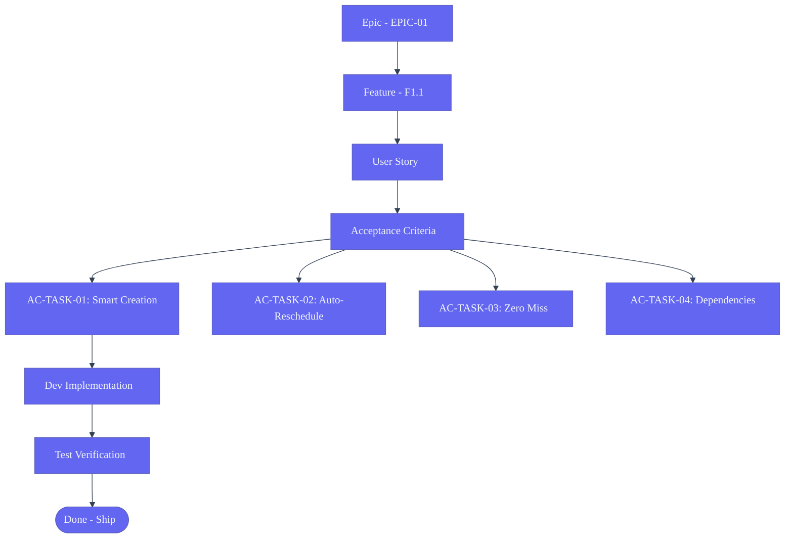

# User Stories — Second Brain OS

## Document Control
| Field | Value |
|---|---|
| Document ID | SB-US-001 |
| Version | 1.0.0 |
| Status | Draft |
| Date | 2026-06-11 |

---

## User Story Workflow

## Module 1: Dashboard & Morning Briefing

| ID | As a... | I want to... | So that... | Priority |
|---|---|---|---|---|
| US-DASH-01 | BTech CSE student | receive a daily morning briefing at 7 AM with my top 3 tasks | I know exactly what to focus on today without spending 15 minutes planning | Critical |
| US-DASH-02 | BTech CSE student | see my productivity score updated in real-time | I can track whether I am actually being productive or just busy | High |
| US-DASH-03 | BTech CSE student | view a GitHub-style activity heatmap of my last 6 months | I can see my productive and unproductive patterns at a glance | Medium |
| US-DASH-04 | BTech CSE student | capture a task, idea, or resource with one click from anywhere | I never lose a thought because it took too long to log it | High |
| US-DASH-05 | BTech CSE student | see my time-blocked schedule for today | I know what to work on and when without deciding repeatedly | High |
| US-DASH-06 | BTech CSE student | see overnight opportunities found by the radar in my briefing | I can apply before others even know the opportunity exists | High |
| US-DASH-07 | BTech CSE student | get a single ARIA top pick recommendation each day | I have one decisive thing to do when I feel overwhelmed | Medium |

## Module 2: Task Manager

| ID | As a... | I want to... | So that... | Priority |
|---|---|---|---|---|
| US-TASK-01 | BTech CSE student | create a task by typing natural language and have AI assign priority and category | I spend 5 seconds adding a task, not 30 seconds filling fields | Critical |
| US-TASK-02 | BTech CSE student | have overdue tasks automatically rescheduled every 15 minutes | I never lose track of what I was supposed to do | Critical |
| US-TASK-03 | BTech CSE student | either complete, reschedule, or explicitly drop every task | nothing quietly expires and comes back to surprise me | Critical |
| US-TASK-04 | BTech CSE student | ask ARIA to break a complex task into subtasks | I can start on a big project without feeling paralyzed | Medium |
| US-TASK-05 | BTech CSE student | link tasks that depend on each other | I work on things in the right order without tracking it manually | Medium |
| US-TASK-06 | BTech CSE student | set recurring tasks with smart rescheduling | I never manually recreate "leetcode daily" or "gym" | High |
| US-TASK-07 | BTech CSE student | have my low-priority tasks auto-moved when I had bad sleep | I don't burn out trying to do deep work on 4 hours of sleep | High |
| US-TASK-08 | BTech CSE student | get an SMS when a critical task is 1 hour overdue | I cannot miss truly important deadlines even if I ignore the app | Medium |
| US-TASK-09 | BTech CSE student | filter tasks by status, priority, category, and date | I can focus on what matters right now without visual noise | Medium |

## Module 3: Course Tracker

| ID | As a... | I want to... | So that... | Priority |
|---|---|---|---|---|
| US-COURSE-01 | BTech CSE student | track all my courses (Udemy, Coursera, NPTEL, YouTube, college) in one place | I don't forget I enrolled in a course and let it expire | Critical |
| US-COURSE-02 | BTech CSE student | be forced to set a completion date for each course | I stop accumulating half-finished courses | Critical |
| US-COURSE-03 | BTech CSE student | see why I enrolled in each course every time I look at it | I remember what I was thinking when I signed up | Medium |
| US-COURSE-04 | BTech CSE student | have daily study tasks auto-generated for each active course | studying becomes part of my daily flow without extra planning | High |
| US-COURSE-05 | BTech CSE student | get a review prompt at 1, 3, 7, 14, 30 days after studying | I retain what I learned through spaced repetition | Medium |
| US-COURSE-06 | BTech CSE student | be warned 2 weeks before a course deadline if I am behind | I can increase my pace instead of missing the deadline silently | High |
| US-COURSE-07 | BTech CSE student | see my daily progress toward each course target | I know if I am on track to finish by the deadline | High |

## Module 4: YouTube Knowledge Vault

| ID | As a... | I want to... | So that... | Priority |
|---|---|---|---|---|
| US-YT-01 | BTech CSE student | save a YouTube video in one click from my browser | I stop accumulating hundreds of "Watch Later" videos | High |
| US-YT-02 | BTech CSE student | get a 3-sentence AI summary of each saved video | I know what I will learn without watching the whole thing first | High |
| US-YT-03 | BTech CSE student | have videos automatically linked to my active goals | saved content stays relevant to what I am building | Medium |
| US-YT-04 | BTech CSE student | have saved videos scheduled into my weekly plan | watching tutorials becomes a scheduled activity, not guilt | Medium |
| US-YT-05 | BTech CSE student | be asked to archive unwatched videos after 60 days | my vault does not become "Watch Later 2.0" | Medium |
| US-YT-06 | BTech CSE student | see related saved videos when I start a new topic | I leverage everything I already saved instead of starting fresh | Medium |

## Module 5: Resource Library

| ID | As a... | I want to... | So that... | Priority |
|---|---|---|---|---|
| US-RES-01 | BTech CSE student | save any type of content (article, book, repo, tool) in one place | I stop having bookmarks in 3 different browsers and 2 note apps | High |
| US-RES-02 | BTech CSE student | have AI auto-tag every resource I save | I never have to organize manually | High |
| US-RES-03 | BTech CSE student | search my saved resources using natural language | I find things without remembering exact titles | Medium |
| US-RES-04 | BTech CSE student | get a prioritized reading queue based on my active goals | I read what matters now, not what was interesting 3 months ago | Medium |
| US-RES-05 | BTech CSE student | add notes to resources and be quizzed on them by ARIA | I actually remember what I read | Medium |
| US-RES-06 | BTech CSE student | have relevant resources surface when I work on a topic | my past research helps my current work automatically | Medium |

## Module 6: Idea Vault

| ID | As a... | I want to... | So that... | Priority |
|---|---|---|---|---|
| US-IDEA-01 | BTech CSE student | capture any idea instantly with just a few words | my 2 AM startup ideas survive until morning | High |
| US-IDEA-02 | BTech CSE student | have ARIA check if my idea already exists online | I don't spend weeks validating something that already exists | High |
| US-IDEA-03 | BTech CSE student | get market analysis and feasibility notes for each idea | I know which ideas are worth pursuing without manual research | Medium |
| US-IDEA-04 | BTech CSE student | move ideas through a clear pipeline (Raw → Researching → Validating → Building → Archived) | I know exactly where each idea stands and nothing lingers in limbo | High |
| US-IDEA-05 | BTech CSE student | get a 2-week no-money validation plan for any idea | I start validating immediately instead of overthinking | Medium |
| US-IDEA-06 | BTech CSE student | see which types of problems I keep noticing after 6 months | I discover my natural path and focus my energy there | Low |

## Module 7: Goal & Roadmap System

| ID | As a... | I want to... | So that... | Priority |
|---|---|---|---|---|
| US-ROAD-01 | BTech CSE student | visually build a roadmap by dragging and dropping nodes | I can plan complex goals without feeling overwhelmed | High |
| US-ROAD-02 | BTech CSE student | paste any text (syllabus, job description, outline) and have AI build a roadmap | I never have to manually enter structured plans | High |
| US-ROAD-03 | BTech CSE student | upload a photo of a whiteboard or hand-drawn plan | my offline brainstorming connects to my digital system | Medium |
| US-ROAD-04 | BTech CSE student | upload a PDF syllabus and get a complete study roadmap | exam prep becomes a guided daily plan automatically | High |
| US-ROAD-05 | BTech CSE student | choose from 8 roadmap types depending on my goal | the system matches the planning approach to what I am trying to do | Medium |
| US-ROAD-06 | BTech CSE student | adjust three sliders (hours/day, days/week, intensity) and see timing update instantly | I see the real impact of my available time on my goals | High |
| US-ROAD-07 | BTech CSE student | have missed milestones auto-reschedule downstream dates | I don't have to manually re-plan everything when I fall behind | Medium |
| US-ROAD-08 | BTech CSE student | set a hard deadline mode that works backwards from my exam date | I know exactly what to study each day to finish on time | High |
| US-ROAD-09 | BTech CSE student | have ARIA check weekly if my roadmap skills or context changed | my plan stays current without me monitoring the industry | Medium |
| US-ROAD-10 | BTech CSE student | run what-if scenarios before changing my schedule | I see the consequences before committing | Low |
| US-ROAD-11 | BTech CSE student | have every roadmap node create tasks automatically in my task manager | my long-term plans actually turn into daily actions | High |
| US-ROAD-12 | BTech CSE student | see a Kanban board for each project | I know the status of every project at a glance | Medium |

## Module 8: Opportunity Radar

| ID | As a... | I want to... | So that... | Priority |
|---|---|---|---|---|
| US-OPP-01 | BTech CSE student | have the system scan for internships, hackathons, and open source opportunities every night | I discover opportunities without spending hours browsing every day | Critical |
| US-OPP-02 | BTech CSE student | see a skill match score for every opportunity | I only apply to things I actually have a chance at | High |
| US-OPP-03 | BTech CSE student | get an immediate push notification when an opportunity closes in under 48 hours | I never miss a deadline by one day again | High |
| US-OPP-04 | BTech CSE student | have the radar learn which opportunities I actually act on | I stop seeing irrelevant suggestions after a few weeks | Medium |
| US-OPP-05 | BTech CSE student | see a personalized one-sentence reason for each opportunity | I know why this is relevant to me specifically | High |
| US-OPP-06 | BTech CSE student | set my opportunity preferences (types, location, minimum match) | the radar only shows me what I actually want | Medium |

## Module 9: Income Sources Tracker

| ID | As a... | I want to... | So that... | Priority |
|---|---|---|---|---|
| US-INC-01 | BTech CSE student | log every income stream with amount, platform, and hours spent | I track my earnings accurately across freelance, internship, and gigs | High |
| US-INC-02 | BTech CSE student | see my effective hourly rate per income source | I know which work is actually worth my time | High |
| US-INC-03 | BTech CSE student | track progress toward income milestones | I stay motivated when small earnings add up | Medium |
| US-INC-04 | BTech CSE student | see which skills generate income and which are unmonetized | I know what to double down on and what to start selling | Medium |
| US-INC-05 | BTech CSE student | get a weekly ROI report showing best income source | I optimise my time toward the highest-return work | Medium |
| US-INC-06 | BTech CSE student | set income goals and have ARIA calculate the path | I have a concrete plan to earn more, not just a wish | Medium |

## Module 10: Project Tracker

| ID | As a... | I want to... | So that... | Priority |
|---|---|---|---|---|
| US-PROJ-01 | BTech CSE student | track my projects through clear phases (Planning → Design → Build → Test → Launch → Maintain) | I always know what stage each project is in | High |
| US-PROJ-02 | BTech CSE student | be required to define the next action for every project | I never have a project stuck because I don't know what to do next | High |
| US-PROJ-03 | BTech CSE student | log blockers and get ARIA suggestions to unblock | I don't stay stuck for weeks on solvable problems | Medium |
| US-PROJ-04 | BTech CSE student | connect my GitHub repo and have ARIA check commit activity | I stay accountable to actually coding, not just planning | Medium |
| US-PROJ-05 | BTech CSE student | link projects to income sources | I know which projects are actually making money | Medium |
| US-PROJ-06 | BTech CSE student | have ARIA draft a LinkedIn post when I complete a milestone | I build my professional presence without spending time writing | Medium |
| US-PROJ-07 | BTech CSE student | get a monthly GitHub Wrapped report | I see my coding activity trend without manual tracking | Low |

## Module 11: Academic Planner

| ID | As a... | I want to... | So that... | Priority |
|---|---|---|---|---|
| US-ACAD-01 | BTech CSE student | log all my semester subjects with credits and exam dates | I never forget an exam date again | High |
| US-ACAD-02 | BTech CSE student | log marks per exam, assignment, and practical | I have a single source of truth for my grades | High |
| US-ACAD-03 | BTech CSE student | see my current CGPA and projected end-of-semester CGPA | I know exactly where I stand and what I need to achieve | High |
| US-ACAD-04 | BTech CSE student | get alerts when a subject threatens my CGPA target | I take action before it is too late to recover | High |
| US-ACAD-05 | BTech CSE student | get elective recommendations based on my career goals | I choose electives that actually help my career | Medium |
| US-ACAD-06 | BTech CSE student | see an exam countdown with daily topic targets | I study systematically instead of cramming the night before | High |

## Module 12: Habit Engine

| ID | As a... | I want to... | So that... | Priority |
|---|---|---|---|---|
| US-HAB-01 | BTech CSE student | create custom habits with flexible frequency | I track habits that match my actual routine, not a rigid system | High |
| US-HAB-02 | BTech CSE student | see my current streak, best streak, and consistency percentage | I stay motivated by visible progress | High |
| US-HAB-03 | BTech CSE student | link habits to goals and see contribution to goal progress | my daily actions clearly connect to my long-term objectives | Medium |
| US-HAB-04 | BTech CSE student | get a gentle nudge after 2 missed days | I catch myself before a streak fully dies | Medium |
| US-HAB-05 | BTech CSE student | see a 30-day consistency report showing which habits I keep and drop | I discover my real priorities vs what I tell myself I care about | Medium |

## Module 13: Sleep Monitor

| ID | As a... | I want to... | So that... | Priority |
|---|---|---|---|---|
| US-SLEEP-01 | BTech CSE student | log bedtime and wake-up with one tap | I track sleep without friction | High |
| US-SLEEP-02 | BTech CSE student | see a sleep score (0-100) based on duration and quality | I know objectively if I am sleeping enough | High |
| US-SLEEP-03 | BTech CSE student | have my tasks automatically adjusted when I sleep poorly | I don't force deep work on low sleep and burn out | High |
| US-SLEEP-04 | BTech CSE student | see my accumulated sleep debt | I know when I need to prioritize rest | Medium |
| US-SLEEP-05 | BTech CSE student | get a bedtime reminder with tomorrow's first task | I sleep with intention and wake up ready | Medium |
| US-SLEEP-06 | BTech CSE student | see how my sleep correlates with productivity | I have data-driven motivation to sleep better | Low |

## Module 14: Time Tracker

| ID | As a... | I want to... | So that... | Priority |
|---|---|---|---|---|
| US-TIME-01 | BTech CSE student | start and stop a timer per task with one click | I track time without disrupting flow | High |
| US-TIME-02 | BTech CSE student | use Pomodoro mode with automatic transitions | I stay focused without watching the clock | Medium |
| US-TIME-03 | BTech CSE student | have the timer auto-stop when I am idle | my time data stays accurate even if I walk away | Medium |
| US-TIME-04 | BTech CSE student | see if my time estimates are accurate with correction suggestions | I get better at estimating how long things actually take | Low |
| US-TIME-05 | BTech CSE student | get a deep work badge for sessions over 90 minutes | I have a measurable goal for focused work | Low |
| US-TIME-06 | BTech CSE student | have ARIA identify my most productive hours | my hardest tasks are scheduled when I work best | Medium |

## Module 15: Weekly Review

| ID | As a... | I want to... | So that... | Priority |
|---|---|---|---|---|
| US-WEEKLY-01 | BTech CSE student | receive a weekly review every Sunday at 8 PM | I reflect on my week without spending time compiling it | High |
| US-WEEKLY-02 | BTech CSE student | see completed vs planned tasks, study time, income, and opportunities all in one review | I get a comprehensive picture, not fragmented stats | High |
| US-WEEKLY-03 | BTech CSE student | get one pattern insight ARIA noticed about my behaviour | I learn something about myself I would not notice otherwise | Medium |
| US-WEEKLY-04 | BTech CSE student | receive the review via email and in-app | I read it even if I am not in the app on Sunday evening | High |
| US-WEEKLY-05 | BTech CSE student | compare weeks month-over-month | I see whether I am actually improving or just staying busy | Medium |

## Cross-Cutting User Stories

| ID | As a... | I want to... | So that... | Priority |
|---|---|---|---|---|
| US-CROSS-01 | BTech CSE student | save any URL from my browser in one click via an extension | I never lose a useful resource because saving was too hard | High |
| US-CROSS-02 | BTech CSE student | use the app offline as a PWA | I stay productive even in areas with poor connectivity | High |
| US-CROSS-03 | BTech CSE student | complete a 5-step onboarding wizard when I first sign up | I start using the system immediately with my actual data | High |
| US-CROSS-04 | BTech CSE student | export all my data as JSON from Settings | I own everything and can leave anytime | Medium |
| US-CROSS-05 | BTech CSE student | speak to ARIA instead of typing while commuting or cooking | I stay productive even when I cannot use my hands | Medium |
| US-CROSS-06 | BTech CSE student | use the app comfortably on my phone | I can check tasks and log data anywhere | High |
| US-CROSS-07 | BTech CSE student | know my data is private and never used to train AI models | I trust the system with my personal information | Critical |
| US-CROSS-08 | BTech CSE student | have access to all features without paying anything | I can use this throughout college regardless of my financial situation | Critical |
