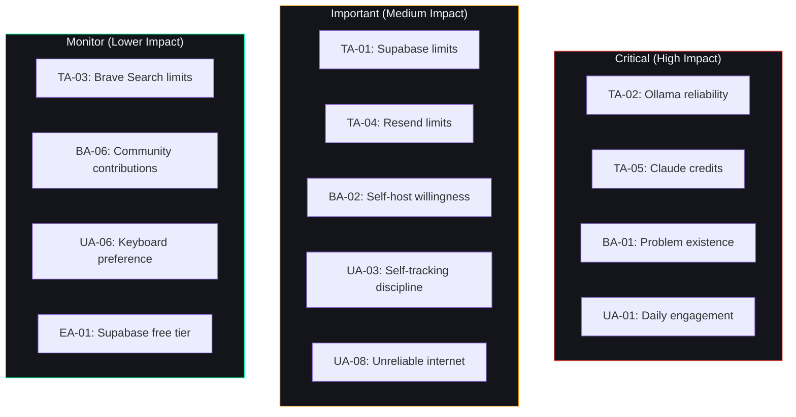

# Assumptions — Second Brain OS (ARIA OS)

## Document Control

| Field | Value |
|---|---|
| Document ID | PRD-ASM-006 |
| Version | 1.0.0 |
| Status | Approved |
| Date | 2026-07-10 |
| Classification | Internal |
| Owner | Developer |

---

## 1. Executive Summary

This document captures all assumptions underlying the Second Brain OS project. Each assumption is documented with its rationale, impact if invalidated, validation criteria, and contingency plan. Assumptions span technical, business, user, timeline, and external dependency categories.

---

## 2. Purpose

To make implicit assumptions explicit, enable risk assessment of assumption validity, ensure contingency plans exist for every critical assumption, and provide a framework for assumption monitoring and validation.

---

## 3. Scope

**In Scope:**
- Technical assumptions (infrastructure, AI, database)
- Business assumptions (market, monetization, competition)
- User assumptions (behavior, preferences, capabilities)
- Timeline assumptions (development velocity, availability)
- External dependency assumptions (third-party services)

**Out of Scope:**
- General industry trends (covered in [MarketResearch.md](MarketResearch.md))
- Product strategy decisions (covered in [ProductStrategy.md](ProductStrategy.md))
- Implementation details (covered in [04_SRS.md](04_SRS.md))

---

## 4. Business Context

Second Brain OS is a solo-developed, zero-budget product targeting BTech CSE students. Every assumption must be evaluated through the lens of limited resources, free-tier infrastructure dependence, and a single-developer team. The most critical assumptions are those that, if invalidated, could cause project failure regardless of execution quality.

---

## 5. Technical Assumptions

| ID | Assumption | Rationale | Impact if Wrong | Validation | Contingency |
|---|---|---|---|---|---|
| TA-01 | Supabase free tier (500MB DB, 50MB transfer/day) is sufficient for Year 1 | 100 users at ~5MB data/user/month = 500MB. 50MB/day transfer sufficient for API calls. | Infrastructure costs increase or migration required | Monitor Supabase usage dashboard weekly | Archive old data; paginate aggressively; migrate to Neon.tech if needed |
| TA-02 | Ollama runs reliably on consumer laptops (8GB+ RAM) | Mistral 7B requires ~4.5GB RAM with 4-bit quantization. Common student laptops have 8GB. | AI features unavailable for low-RAM users | Test on 8GB Windows laptop; document RAM requirements | Claude API fallback + algorithmic fallback for all AI features |
| TA-03 | Brave Search API free tier (2000 queries/month) is sufficient | 100 users x 6 category scans/day = 600 scans. 2000 limit allows headroom. | Reduced radar scan frequency | Track API quota usage weekly | Cache results 24h; use Google Programmable Search as fallback |
| TA-04 | Resend free tier (3000 emails/month) is sufficient | 100 users x 1 briefing + 1 notification/day = ~200 emails/day = 6000/month exceeds limit | Need paid email service or reduce frequency | Monitor Resend usage dashboard | Switch to SendGrid free tier (100 emails/day) or SMTP relay |
| TA-05 | Claude API free credits ($5) last through development phase | ~500 AI calls at ~$0.01/call = $5. Ollama handles 80% of calls. | Development blocked if credits exhaust before GA | Track API spend monthly | Switch to GPT-4o-mini (cheaper); restrict AI calls during dev |
| TA-06 | Vercel free tier (100GB bandwidth, 100GB-hours) sufficient | Small frontend with <100 users generates minimal bandwidth. | Unexpected cost or degraded performance | Monitor Vercel usage monthly | Optimize images; add CDN caching; switch to Cloudflare Pages |
| TA-07 | Railway free tier remains available | Railway currently offers $5/month credit or free tier for small projects. | Backend hosting cost up to $5-10/month | Monitor Railway pricing blog quarterly | Maintain Dockerfile for Render or Fly.io migration |
| TA-08 | PostgreSQL full-text search meets search requirements | Resources, ideas, and tasks require text search. Supabase full-text search is sufficient. | Need dedicated search service (MeiliSearch, Algolia) | Test search quality with 1000+ documents | Add pgvector for semantic search; use MeiliSearch if needed |
| TA-09 | GitHub API rate limits (60 requests/hour unauthenticated, 5000 authenticated) sufficient | Limited GitHub API calls per user per day (commit checks, repo metadata). | Reduced GitHub integration reliability | Implement caching; stagger requests | Use stored commit data; manual refresh option |
| TA-10 | Browser push notifications (Web Push API) have reasonable opt-in rate | >70% of users opt in to browser notifications. | Lower engagement if opt-in rate is low | Track notification opt-in rate weekly | Add email fallback for critical alerts |

---

## 6. Business Assumptions

| ID | Assumption | Rationale | Impact if Wrong | Validation | Contingency |
|---|---|---|---|---|---|
| BA-01 | BTech CSE students experience the fragmentation problem acutely | Survey data: avg student uses 7.3 tools, loses 80% of ideas. | Market does not exist as large as estimated | Pre-launch survey of 20 students | Pivot to adjacent segment (self-taught devs, fresh grads) |
| BA-02 | Students are willing to self-host / self-configure (CLI, GitHub, Supabase) | Target users are CS students comfortable with terminal. | Lower adoption due to setup friction | Track onboarding completion rate | Create 1-click deploy template (Railway + Vercel) |
| BA-03 | Rs. 0 forever model attracts users who would not pay | Core value proposition is free AI productivity. | Users don't value free product (perception = quality) | Track DAU and retention vs. competition | Add optional donation tier; premium AI features |
| BA-04 | Students have Google accounts for OAuth | Google account penetration among Indian college students >95%. | Auth barrier for non-Google users | Track auth failure reasons | Add email magic link as alternative |
| BA-05 | Morning briefing provides daily value that drives retention | Briefing is the primary engagement hook. | Users ignore briefings, retention drops | Track briefing read rate and 30-day retention correlation | A/B test briefing format; allow opt-out; personalize |
| BA-06 | Open-source release generates community contributions | MIT license and comprehensive docs attract contributors. | Solo maintenance burden persists | Track external PRs monthly | Accept solo maintenance; prioritize documentation for self-serve |
| BA-07 | Monetization (Year 2+ premium) does not conflict with Rs. 0 core | Premium = optional AI credits. Core functionality remains free. | Core user resentment at any monetization | Survey users before introducing paid features | Keep premium purely additive; no feature gating |
| BA-08 | Indian college calendar (semester system June-Nov, Dec-Apr) aligns with development cadence | Exam periods (Oct, Dec, Apr) reduce both development and user activity. | Development velocity during user's peak usage | Track user activity vs semester calendar | Schedule major releases during semester breaks |
| BA-09 | Organic word-of-mouth is sufficient for Year 1 growth (target: 100 DAU) | No marketing budget. Growth through GitHub, Reddit, student communities. | Growth stalls below target | Track weekly signups and referral sources | Community outreach; college ambassador program |
| BA-10 | 5 early testers (developer's friends) provide sufficient usability feedback | Small test group catches critical UX issues before wider release. | Missed usability issues cause churn | Structured feedback forms; weekly check-in calls | Expand tester group to 10+; create feedback pipeline |

---

## 7. User Assumptions

| ID | Assumption | Rationale | Impact if Wrong | Validation | Contingency |
|---|---|---|---|---|---|
| UA-01 | Users engage with the system 2-3x daily (morning, afternoon, evening) | Engagement pattern drives value from proactive features (briefing, nudge, wind-down). | Briefing and nudge missed, reducing value | Track session frequency during first 30 days | Adjust push timing; consolidate notification cadence |
| UA-02 | Users complete 15+ tasks/week | Target based on developer's personal usage. | Lower task volume, different engagement model | Track tasks completed/week after 30 days | Adjust targets; investigate alternative value metrics |
| UA-03 | Users are willing to log sleep, time, habits, income daily | Self-tracking discipline is core to value proposition. | Low data density, AI insights less valuable | Track logging frequency per module | Reduce logging friction (one-tap, fewer fields); add gamification-lite |
| UA-04 | Users understand the concept of opportunity-scarring (some sources may block scrapers) | Users will manually add opportunities if radar misses some. | User frustration with incomplete radar results | Track manual opportunity adds rate | Add manual opportunity entry; improve radar source diversity |
| UA-05 | Users read and act on AI-generated nudges and suggestions | Nudge Agent drives course completion and habit consistency. | Nudges ignored, course completion remains low | Track nudge-to-action conversion rate | Make nudges more specific; add HITL confirmation |
| UA-06 | Users prefer keyboard-driven UI over mouse/touch | Target users are developers comfortable with keyboard shortcuts. | Lower satisfaction for mouse/touch users | Track input method usage (keyboard shortcuts vs click) | Maintain full keyboard accessibility; optimize touch targets |
| UA-07 | Users trust local AI (Ollama) with personal data | Privacy is a stated value differentiator. | Users prefer cloud AI despite privacy concerns | Survey privacy preferences at onboarding | Offer choice: local AI (private) vs cloud AI (more capable) |
| UA-08 | Users have unreliable/poor internet connectivity (hostel Wi-Fi) | PWA and offline-first design depends on this being true. | Offline features underutilized if internet is reliable | Track online/offline session ratio | Optimize for online-first with graceful offline degradation |

---

## 8. Timeline Assumptions

| ID | Assumption | Rationale | Impact if Wrong | Validation | Contingency |
|---|---|---|---|---|---|
| TA-01a | Developer maintains 10-15 hrs/week consistently | Solo developer, part-time, alongside academics. | Timeline extends by 2-3x | Track weekly hours committed | Reduce scope; defer non-critical features |
| TA-02a | Exam periods reduce capacity by 50% for 4 weeks/year | Mid-sem and end-sem exams in Oct and Dec. | Unexpected exam schedule changes | Monitor academic calendar | Built-in 10-week buffer |
| TA-03a | AI integration (agents, prompts) takes 4 weeks for initial version | 11 agents with PromptLoader, context assembly, and testing. | Integration takes longer | Track agent development per module | Ship agents incrementally; algorithmic fallback first |
| TA-04a | 48 weeks to GA from start date (July 2026) | 9 phases of 3-8 weeks each with 10-week buffer. | GA slips past June 2027 | Track phase completion bi-weekly | Prioritize core 12 modules; defer 3 to post-GA |
| TA-05a | No extended health/personal breaks during development | Solo developer resilience. | Extended break freezes all progress | Monitor burnout risk (mood, sleep, task completion) | Built-in health buffer; document all processes for handoff |
| TA-06a | All test suites (2795+ tests) can be maintained within 2 hrs/week | Test maintenance scales with codebase growth. | Test maintenance becomes bottleneck | Track CI test run time and failure rate | Reduce integration tests; focus on unit test coverage |

---

## 9. External Dependency Assumptions

| ID | Assumption | Rationale | Impact if Wrong | Validation | Contingency |
|---|---|---|---|---|---|
| EA-01 | Supabase does not deprecate their free tier | Supabase has maintained a free tier since 2021. | Need paid plan ($25/month) or alternative | Monitor Supabase blog and HN monthly | Migrate to Neon.tech (free PostgreSQL) or self-host |
| EA-02 | Anthropic does not block API access from India regions | Claude API available globally with region-based pricing. | No cloud AI fallback available | Verify API access during development | Switch to GPT-4o-mini (OpenAI, available in India) |
| EA-03 | Brave Search API free tier is not reduced | Brave has maintained free tier since API launch. | Reduced radar scan frequency | Monitor Brave API announcements | Switch to Google Programmable Search (100 queries/day free) |
| EA-04 | Vercel does not remove hobby plan | Vercel has maintained a generous free/hobby plan since 2021. | Frontend hosting cost | Monitor Vercel pricing quarterly | Migrate to Cloudflare Pages (unlimited bandwidth) |
| EA-05 | GitHub remains unrestricted in India | GitHub fully accessible in India. | CI/CD and code hosting disrupted | Track any regional access issues | Self-host Gitea; use GitLab as mirror |
| EA-06 | Ollama continues supporting Mistral 7B | Ollama actively maintained; Mistral 7B is a flagship model. | Need alternative local model | Monitor Ollama releases quarterly | Use Llama 3.2 (3B) or Phi-3 (3.8B) as local alternatives |

---

## 10. Assumption Monitoring Cadence

| Category | Review Frequency | Reviewer | Action if Invalidated |
|---|---|---|---|
| Technical assumptions | Monthly | Developer | Implement contingency plan; document migration |
| Business assumptions | Quarterly | Developer | Update business model; revise GTM |
| User assumptions | Quarterly (after launch) | Developer + testers | Update persona models; adjust UX |
| Timeline assumptions | Weekly | Developer | Re-estimate; adjust scope; commit to new timeline |
| External dependencies | Monthly | Developer | Test alternative; maintain migration readiness |
| All assumptions | Annual | Developer | Full assumption review and document refresh |

---

## 11. Assumption Risk Heatmap

---

## 12. References

| Document | Location | Relationship |
|---|---|---|
| Risks | [Risks.md](Risks.md) | Risk register informed by assumptions |
| Project Scope | [ProjectScope.md](ProjectScope.md) | Scope boundaries conditioned on assumptions |
| Product Strategy | [ProductStrategy.md](ProductStrategy.md) | Strategy validation dependent on assumptions |
| Market Research | [MarketResearch.md](MarketResearch.md) | Market assumptions detailed here |
| Decision Log | [DecisionLog.md](DecisionLog.md) | Decisions made under specific assumptions |
| AGENTS.md | `AGENTS.md` | Development guidelines |
