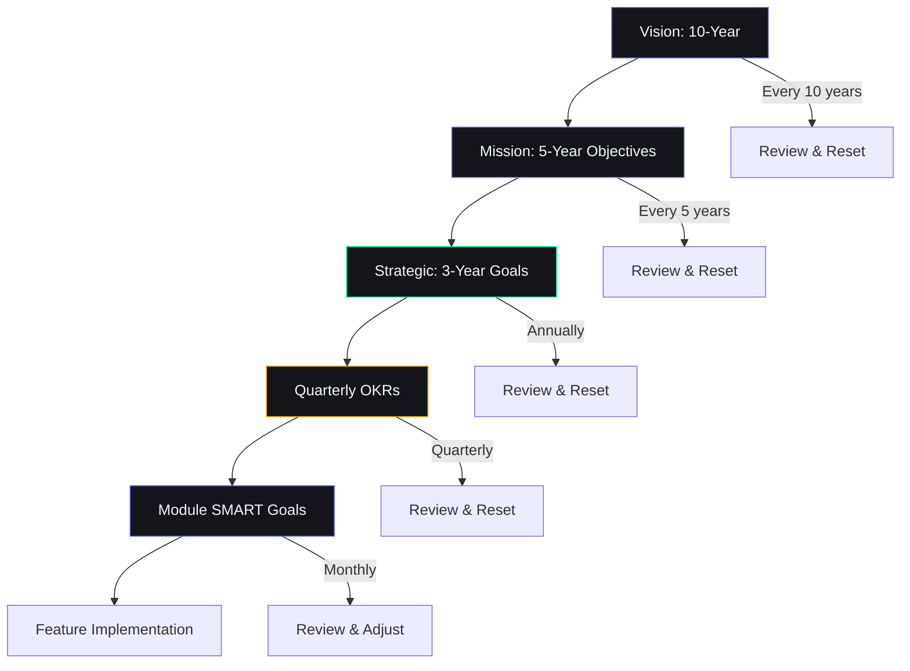

# Strategic Goals — Second Brain OS (ARIA OS)

## Document Control

| Field | Value |
|---|---|
| Document ID | PRD-GOL-002 |
| Version | 1.0.0 |
| Status | Approved |
| Date | 2026-07-10 |
| Classification | Internal |
| Owner | Developer |

---

## 1. Executive Summary

This document defines the complete goal architecture for Second Brain OS: from high-level vision down to tactical quarterly OKRs. Goals cascade from vision through mission to strategic objectives, then to quarterly key results, and finally to module-level SMART targets. Every goal is measurable, time-bound, and tied to a specific outcome that moves the north star metric.

---

## 2. Purpose

To provide a single, authoritative goal hierarchy that aligns all product development, prioritization decisions, and resource allocation. Every feature, bug fix, and documentation update must trace to at least one goal defined here. Goals are reviewed quarterly and updated bi-annually.

---

## 3. Scope

**In Scope:**
- Vision-level goal (10-year horizon)
- Mission-level objectives (5-year horizon)
- Strategic goals (3-year horizon)
- Q3 2026 OKRs (quarterly)
- Module-level SMART goals
- Goal hierarchy and cascade logic
- Goal review cadence

**Out of Scope:**
- Feature-level implementation tasks (see [04_SRS.md](04_SRS.md))
- Sprint planning and weekly tasks
- Performance targets (see [SuccessMetrics.md](SuccessMetrics.md))
- Risk-adjusted goal projections (see [Risks.md](Risks.md))

---

## 4. Business Context

Second Brain OS is a solo-developer project with Rs. 0 infrastructure budget targeting BTech CSE students. The product must achieve product-market fit (100 DAU, >60% 30-day retention) within 12 months to validate the model before any monetization. Goals are ambitious but constrained by 10-15 hours/week development capacity. Success is measured by user outcomes (tasks completed, courses finished, income earned), not by revenue in the first 18 months.

---

## 5. Goal Hierarchy

### 5.1 Vision-Level Goal (10 Years)

By 2036, Second Brain OS will have helped 250,000+ students complete 5 million+ courses, ship 1 million+ projects, and collectively earn Rs. 100 crore+ through opportunities found via the system — creating a generation of builders who entered the workforce with real products, real income, and real experience.

### 5.2 Mission-Level Objectives (5 Years)

| ID | Objective | Key Metric | Year 5 Target |
|---|---|---|---|
| M-01 | Reach 25,000+ daily active students | DAU | 25,000 |
| M-02 | Enable 500,000+ course completions | Cumulative courses completed | 500,000 |
| M-03 | Facilitate Rs. 10 crore+ student income | Cumulative income through Radar | Rs. 10 crore |
| M-04 | Ship 100,000+ student projects | Cumulative projects shipped | 100,000 |
| M-05 | Maintain zero-cost infrastructure | Monthly infra cost | < Rs. 5,000 |
| M-06 | Build a self-sustaining open-source community | Active contributors | 200+ |

### 5.3 Strategic Goals (3 Years)

| ID | Goal | Target | Timeline |
|---|---|---|---|
| SG-01 | Achieve product-market fit with 1,000 DAU | 1,000 DAU, >60% retention | End of Year 2 |
| SG-02 | Complete all 15 modules to production quality | Zero P0/P1 bugs per module | End of Year 2 |
| SG-03 | Establish community-driven development pipeline | 20+ external contributors | End of Year 3 |
| SG-04 | Launch mobile app (React Native) | 500 mobile DAU | End of Year 2 |
| SG-05 | Generate first revenue (donations + premium) | Rs. 2-5 lakhs/year | End of Year 3 |
| SG-06 | Internationalize for non-Indian students | 10% users outside India | End of Year 3 |

### 5.4 Q3 2026 OKRs (July — September 2026)

**Objective 1: Production-Ready Foundation**
| Key Result | Current | Target | Owner |
|---|---|---|---|
| KR-1.1: Fix all API router imports | Broken | All 13 routers compile clean | Developer |
| KR-1.2: Create Supabase project with all schemas | Not created | 27 tables deployed | Developer |
| KR-1.3: Deploy frontend to Vercel | Not deployed | Production URL live | Developer |
| KR-1.4: Deploy backend to Railway | Not deployed | Backend serving requests | Developer |
| KR-1.5: Wire auth on all API routes | 0/13 routes | 13/13 routes protected | Developer |

**Objective 2: AI Agent System Live**
| Key Result | Current | Target | Owner |
|---|---|---|---|
| KR-2.1: All 11 agents calling real LLMs | 5 agents | 11 agents | Developer |
| KR-2.2: All 15 cron jobs running in production | 6 implemented | 15 running | Developer |
| KR-2.3: PromptLoader with 22 validated prompts | 12 prompts | 22 prompts | Developer |
| KR-2.4: Context engine assembled for all agents | Partial | Full context assembly | Developer |

**Objective 3: User Experience Validation**
| Key Result | Current | Target | Owner |
|---|---|---|---|
| KR-3.1: Onboard 5 early testers | 0 | 5 active users | Developer |
| KR-3.2: Achieve >60% 30-day retention | N/A | >60% | Developer |
| KR-3.3: Complete 2795+ Python tests | Existing | All passing | Developer |
| KR-3.4: Lighthouse score >90 | Not measured | >90 | Developer |

---

## 6. Module-Level SMART Goals

### 6.1 Tasks Module
| Goal | Specific | Measurable | Achievable | Relevant | Time-bound |
|---|---|---|---|---|---|
| Auto-reschedule accuracy | Algorithm reschedules overdue tasks | <15% re-rescheduled within 24h | Based on priority-based scheduling | Zero-miss policy | Q3 2026 |
| Task completion rate | Users complete created tasks | >78% weekly completion | 15-20 tasks/week target | Core engagement metric | Q4 2026 |

### 6.2 Courses Module
| Goal | Specific | Measurable | Achievable | Relevant | Time-bound |
|---|---|---|---|---|---|
| Course completion | Students finish enrolled courses | >70% completion rate | Daily nudge + auto-study tasks | Learning-to-building pipeline | Q1 2027 |

### 6.3 Goals Module
| Goal | Specific | Measurable | Achievable | Relevant | Time-bound |
|---|---|---|---|---|---|
| Roadmap builder live | Drag-drop roadmap editor | Connected to API + DB | React Flow library available | Core planning feature | Q4 2026 |

### 6.4 Habits Module
| Goal | Specific | Measurable | Achievable | Relevant | Time-bound |
|---|---|---|---|---|---|
| Habit consistency | Users maintain tracked habits | >50% 30-day consistency | Streak tracking + nudges | Habit formation support | Q4 2026 |

### 6.5 Sleep Module
| Goal | Specific | Measurable | Achievable | Relevant | Time-bound |
|---|---|---|---|---|---|
| Sleep logging adoption | Users log sleep regularly | >4 nights/week logged | One-tap logging + reminder | Health-productivity link | Q4 2026 |

### 6.6 Income Module
| Goal | Specific | Measurable | Achievable | Relevant | Time-bound |
|---|---|---|---|---|---|
| Income tracking adoption | Users log income entries | >70% of weeks have >=1 entry | Simple form + auto-calc hourly rate | Core financial awareness | Q1 2027 |

### 6.7 Opportunities Module
| Goal | Specific | Measurable | Achievable | Relevant | Time-bound |
|---|---|---|---|---|---|
| Radar relevance | Opportunities match user skills | >60% with match_score >= 50 | Skill-based matching algorithm | Career impact | Q4 2026 |

### 6.8 Projects Module
| Goal | Specific | Measurable | Achievable | Relevant | Time-bound |
|---|---|---|---|---|---|
| Project completion | Users ship projects | >2 projects with >2 phases completed | Phase-based tracking + next-action rule | Build-first mission | Q1 2027 |

### 6.9 Chat / ARIA Module
| Goal | Specific | Measurable | Achievable | Relevant | Time-bound |
|---|---|---|---|---|---|
| ARIA engagement | Users interact with ARIA | >5 chat sessions/week | Context-aware responses | AI value demonstration | Q4 2026 |

---

## 7. Goal Cascade Diagram

---

## 8. Goal Review Cadence

| Review Type | Frequency | Participants | Process |
|---|---|---|---|
| Vision check | Every 10 years | Developer | Full reset of vision and mission |
| Mission review | Every 5 years | Developer + Community | Survey users, analyze trends |
| Strategic review | Annual | Developer | Evaluate progress against 3-year goals |
| OKR review | Quarterly | Developer | Score each KR 0-1.0; adjust for next quarter |
| Module health check | Monthly | Developer | Review module-level SMART targets |
| Weekly check-in | Weekly (Sunday) | Developer | Review this week's contribution to quarterly OKRs |

---

## 9. Risks to Goal Achievement

| Risk | Impacted Goals | Mitigation |
|---|---|---|
| Solo developer burnout | All | 10-15 hr/week limit; buffer weeks for exams |
| Free tier deprecation | M-05, SG-01 | Architecture supports migration; Dockerfile portability |
| Low early adoption | SG-01, SG-05 | Target 100 users (0.02% of SAM); low bar for success |
| AI quality below expectations | KR-2.1, KR-2.4 | Algorithmic fallback always available; gradual rollout |
| Feature scope creep | All | Builder test for every feature; quarterly scope review |

---

## 10. References

| Document | Location | Relationship |
|---|---|---|
| Mission & Values | [Mission.md](Mission.md) | Foundational mission driving all goals |
| Success Metrics | [SuccessMetrics.md](SuccessMetrics.md) | KPIs measuring goal progress |
| Product Strategy | [ProductStrategy.md](ProductStrategy.md) | Strategic pillars aligned with goals |
| Project Scope | [ProjectScope.md](ProjectScope.md) | Scope boundaries for goal achievement |
| Risks | [Risks.md](Risks.md) | Risk-adjusted goal projections |
| AGENTS.md | `AGENTS.md` | Development guidelines |
