# KPI Dashboard

## Document Control

| Field | Value |
|---|---|
| Document ID | PRD-KPI-001 |
| Version | 1.0.0 |
| Status | Active |
| Date | 2026-07-12 |
| Classification | Internal |
| Owner | Developer |

---

## 1. Key Performance Indicators

| KPI | Target | Current | Measurement Method |
|---|---|---|---|
| API p95 latency | < 500ms | — | Request ID logging / monitoring |
| Test coverage | > 85% | 87% | `pytest --cov` |
| Broken links | 0 | 0 | `scripts/check-links.ps1` |
| AI response time | < 30s | — | LLM client timing |
| Frontend Lighthouse score | > 90 | — | Lighthouse CI |
| Documentation files | > 500 | ~350 | `Get-ChildItem -Recurse -Filter *.md` |
| Documentation maturity | L4 | L2.8 | Maturity model assessment |
| CI pipeline success rate | > 95% | — | GitHub Actions |
| API uptime (p99) | > 99.9% | — | Monitoring dashboard |
| Security scan findings | 0 critical/high | — | Trivy / npm audit / pip-audit |

## 2. Tracking

KPIs are reviewed during sprint reviews. Degrading metrics trigger a root cause analysis and remediation plan. The dashboard is updated after each sprint cycle.

## 3. Alerts

- Test coverage below 80% → CI failure (hard threshold)
- Broken links detected → PR blocked + Slack notification
- API p95 > 1s → monitoring alert triggered

---

## 3.1 Alert Thresholds Detail

The following thresholds define when action is required for each KPI:

| KPI | Warn Threshold | Critical Threshold | Action |
|---|---|---|---|
| Code Coverage | < 85% | < 80% | CI failure; team must add tests before next merge |
| API Latency p95 | > 500ms | > 1s | P2 incident; investigate bottleneck |
| AI Response Time | > 15s | > 30s | P2 incident; check Ollama/LM provider |
| Broken Links | Any (1+) | Any (1+) | PR blocked; fix or suppress in link checker config |
| Lighthouse Score | < 85 | < 75 | P3 ticket; performance audit required |
| Documentation Maturity | Unchanged for 2 months | Unchanged for 4 months | P3 ticket; schedule doc sprint |
| CI Success Rate | < 98% | < 95% | P1 incident; investigate root cause |
| Security Readiness | < 40% | < 30% | P1 incident; action plan required within 7 days |
| API Uptime (p99) | < 99.9% | < 99.5% | P0 incident; immediate investigation |
| Security Scan Findings | Any medium | Any critical/high | Critical/high: P1 incident; medium: next sprint |

## 4. Measurement Methodology

Each KPI is measured using a standardized methodology to ensure consistency and reproducibility:

### 4.1 Code Coverage

- **Tool**: `pytest --cov=packages --cov=apps/api --cov=services/scheduler`
- **Measurement**: Parsed from the pytest output summary line (e.g., `TOTAL 5234 228 96%`)
- **Threshold check**: CI job compares coverage percentage against the 85% hard threshold
- **Reporting**: HTML report generated at `htmlcov/index.html`; coverage uploaded to CI artifacts

### 4.2 API Latency

- **Tool**: Custom FastAPI middleware in `packages/shared/utils/logger.py`
- **Measurement**: Duration between request receipt and response dispatch, tracked via `X-Request-ID`
- **Granularity**: Per-endpoint timing recorded in structured JSON logs
- **Aggregation**: p50, p95, p99 calculated over sliding 15-minute window

### 4.3 Documentation Maturity

- **Tool**: Manual maturity assessment per the 5-level maturity model (L1–L5)
- **Measurement Criteria**:
  - L1: File exists (basic outline)
  - L2: Substantial content with sections and examples
  - L3: Complete with cross-references and diagrams
  - L4: Reviewed, updated within 3 months, has version history
  - L5: Living document with automated validation and continuous updates
- **Cadence**: Monthly review; each document scored against rubric

### 4.4 Test Pass Rate

- **Tool**: CI job output parsing (pytest JUnit XML report)
- **Measurement**: `(passed / (passed + failed + errored)) * 100`
- **Reporting**: CI job status badge in repository README

### 4.5 Security Readiness

- **Tool**: Compliance checklist updated quarterly
- **Measurement**: Count of satisfied controls divided by total applicable controls
- **Domains**: Vulnerability management, secret detection, dependency scanning, access control, encryption, incident response, audit logging

### 4.6 AI Response Time

- **Tool**: LLM client timing in `packages/ai/client.py`
- **Measurement**: Wall-clock time from request submission to full response receipt
- **Tracking**: Logged per-agent with agent ID, token count, and provider name

## 5. Data Sources and Refresh Cadence

| KPI | Source | Refresh Frequency | Owner |
|---|---|---|---|
| Code Coverage | `pytest --cov` output | Per CI run (push to main) | QA |
| API Latency p95 | Custom FastAPI middleware | Real-time (every request) | DevOps |
| AI Response Time | LLM client timing | Real-time (every AI call) | DevOps |
| Documentation Maturity | Manual maturity assessment | Monthly | Developer (owner) |
| Test Pass Rate | CI job output (JUnit XML) | Per CI run (every push) | QA |
| Security Readiness | Compliance checklist | Quarterly | Security |
| Broken Links | `scripts/check-links.ps1` | Per CI run (every push) | Developer |
| Lighthouse Score | Lighthouse CI | Per CI run (main branch) | Developer |
| CI Success Rate | GitHub Actions API | Real-time | DevOps |
| API Uptime (p99) | Monitoring dashboard (WIP) | Continuous | DevOps |
| Security Scan Findings | Trivy / npm audit / pip-audit | Per CI run (every push) | Security |

## 6. Targets for Q3 2026

The following targets guide improvement efforts during the Q3 Intelligence Phase (July – September 2026):

| KPI | Baseline | Q3 Target | Stretch Goal | Owner |
|---|---|---|---|---|
| Code Coverage | 87% | 90% | 95% | Developer |
| API Latency p95 | 120ms | < 500ms (maintain) | < 300ms | DevOps |
| AI Response Time | ~10s | < 15s | < 10s | Developer |
| Documentation Maturity | L2.8 | L4.0 | L4.5 | Developer |
| Security Readiness | 24% | 60% | 75% | Developer |
| Test Pass Rate | 99.8% | 99%+ (maintain) | 100% | QA |
| Lighthouse Score | — | 90+ | 95+ | Developer |
| Broken Links | 0 | 0 (maintain) | 0 | Developer |
| CI Success Rate | — | 98%+ | 99%+ | DevOps |
| API Uptime (p99) | — | 99.9%+ | 99.95% | DevOps |
| Security Scan Findings | — | 0 critical/high | 0 critical/high | Developer |

### 6.1 Gap Analysis

| KPI | Baseline → Target | Gap | Action Plan |
|---|---|---|---|
| Documentation Maturity | L2.8 → L4.0 | 1.2 levels | Schedule 2 doc sprints in Q3; target 12 files per sprint |
| Security Readiness | 24% → 60% | 36 percentage points | Implement vulnerability management, access control review, audit logging |
| Code Coverage | 87% → 90% | 3 percentage points | Add tests for uncovered modules (scheduler, scripts) |

## 7. Quarterly Review Process

KPIs are reviewed during sprint reviews at the end of each sprint. The process follows:

1. **Data Collection**: Gather KPI measurements from all sources (CI, monitoring, manual review)
2. **Trend Analysis**: Compare against previous sprint and Q3 target trajectory
3. **Exception Handling**: Any metric in Warn or Critical threshold triggers a root cause analysis
4. **Action Items**: Each degraded metric gets a remediation task assigned to the relevant owner
5. **Dashboard Update**: The KPI dashboard Mermaid diagram below is updated with latest values
6. **Reporting**: KPI summary posted to team channel with highlights and action items

### 1.1 KPI Health Dashboard

```mermaid
graph TB
    subgraph KPIs["ARIA OS — KPI Health Dashboard"]
        KPI1["Code Coverage<br/>96% (Target: 85%)<br/>✅ Exceeding"]
        KPI2["API Latency p95<br/>120ms (Target: 500ms)<br/>✅ On track"]
        KPI3["Doc Maturity<br/>L3.5 / L5 (Target: L4)<br/>⚠️ Near target"]
        KPI4["Security Readiness<br/>24% (Target: 80%)<br/>❌ Critical gap"]
        KPI5["Test Pass Rate<br/>99.8% (Target: 100%)<br/>✅ On track"]
    end

    subgraph LEGEND["Status"]
        L1["✅ Exceeding target"]
        L2["⚠️ Below target"]
        L3["❌ Critical gap"]
    end

    KPI1 -.->|"Strength"| KPI2
    KPI2 -.->|"Strength"| KPI3
    KPI3 -.->|"Gap"| KPI4
    KPI4 -.->|"Action needed"| KPI5

    style KPIs fill:#0A0B0F,stroke:#334155,color:#F1F5F9
    style KPI1 fill:#13151A,stroke:#00FFA3,color:#F1F5F9,stroke-width:3px
    style KPI2 fill:#13151A,stroke:#00FFA3,color:#F1F5F9,stroke-width:3px
    style KPI3 fill:#13151A,stroke:#818CF8,color:#F1F5F9
    style KPI4 fill:#13151A,stroke:#EF4444,color:#F1F5F9,stroke-width:3px
    style KPI5 fill:#13151A,stroke:#00FFA3,color:#F1F5F9
    style L1 fill:#13151A,stroke:#00FFA3,color:#F1F5F9
    style L2 fill:#13151A,stroke:#818CF8,color:#F1F5F9
    style L3 fill:#13151A,stroke:#EF4444,color:#F1F5F9
```

---

## Related Documents

| Document | Purpose |
|---|---|
| [AGENTS.md](../../AGENTS.md) | Master project reference — Section 26 (Performance Benchmarks), Section 18 (Cost & Performance) |
| [Error Budget](../operations/error-budget.md) | SLO definitions and error budget calculation |
| [Observability](../operations/31_Observability.md) | RED metrics, alerting rules, dashboard definitions |
| [Testing Strategy](../qa/28_Testing.md) | Coverage thresholds and test automation |
| [Glossary](../governance/glossary.md) | Project terminology for KPI metrics (SLO, SLI, etc.) |
