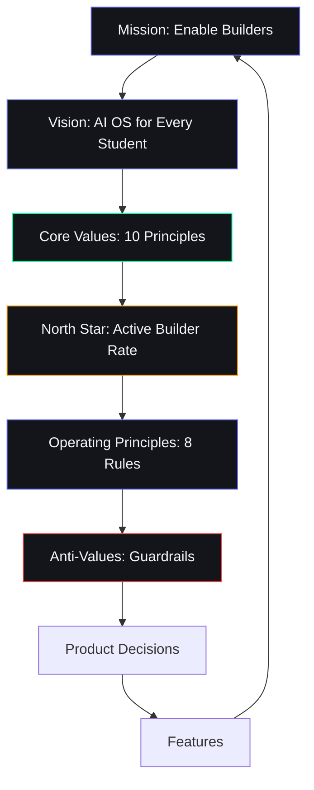

# Mission, Vision & Values — Second Brain OS (ARIA OS)

## Document Control

| Field | Value |
|---|---|
| Document ID | PRD-MIS-001 |
| Version | 1.0.0 |
| Status | Approved |
| Date | 2026-07-10 |
| Classification | Internal |
| Owner | Developer |

---

## 1. Executive Summary

Second Brain OS (ARIA OS) exists to solve the fragmentation crisis of student life: courses registered and forgotten, ideas captured and lost, opportunities missed by days, and skills learned but never applied. This document defines the mission, vision, core values, north star metric, and operating principles that guide all product decisions and trade-offs.

---

## 2. Purpose

This document establishes the foundational identity of Second Brain OS. It defines why the product exists, what it aspires to become, the principles that govern its evolution, and the single metric that indicates whether the mission is being fulfilled. Every feature decision, architectural choice, and priority call must trace back to at least one element defined here.

---

## 3. Scope

**In Scope:**
- Mission statement (reason for existence)
- Vision statement (aspirational future state)
- Core values (5-7 principles governing behavior)
- North star metric (single measure of mission success)
- Operating principles (decision-making guardrails)
- Anti-values (what we deliberately avoid)

**Out of Scope:**
- Product roadmap (see [ProductStrategy.md](ProductStrategy.md))
- Business model details (see [ValueProposition.md](ValueProposition.md))
- Feature specifications (see [04_SRS.md](04_SRS.md))
- Technical architecture (see `docs/engineering/12_Architecture.md`)

---

## 4. Business Context

Second Brain OS operates at the intersection of five converging trends: the AI-native era (post-ChatGPT adoption), the Indian builder generation (62% of Gen Z want to start businesses), free infrastructure maturity (Supabase, Vercel, Ollama), the privacy renaissance (local AI as differentiator), and the India tech boom (50K+ startups, 1.5M engineers graduating annually). The mission is forged in response to a specific crisis: BTech CSE students lose 80% of ideas within 24 hours, miss 60% of relevant opportunities, abandon 70% of courses, and have zero systematic time or income tracking.

---

## 5. Mission Statement

Second Brain OS exists to transform fragmented student lives into compounded, measurable growth by connecting learning, building, earning, and well-being into a single intelligent system that pushes information proactively, never waits to be asked, and works at zero cost to every student.

---

## 6. Vision Statement

To empower every BTech CSE student to become a builder who ships real products, earns real income, and builds real experience while still in college — by giving them an AI system that remembers everything they forget, watches the internet for opportunities that match their skills, tells them what to do each morning, and connects their learning to their building to their income.

---

## 7. Core Values

| # | Value | Definition | Implication |
|---|---|---|---|
| 1 | **Owned Entirely By You** | No subscription. Data never leaves your Supabase instance. | Self-hosted; open-source forever; Rs. 0 forever for core product |
| 2 | **Zero Miss Policy** | Every task is done, rescheduled, or explicitly dropped. No silent failures. | Cron checks every 15 min for overdue tasks; escalation ladder: push, email, SMS |
| 3 | **Active Intelligence** | System pushes information: briefings, nudges, radar scans, reminders — never waits to be asked. | 15 cron jobs, 11 agents orchestrated by ARIA |
| 4 | **Build First** | Everything funnels toward building real things. Courses exist to build projects. Ideas exist to ship products. | Project module is the culmination of all other modules; shipped output measured, not input |
| 5 | **Honest About Status** | No fake streaks. Real metrics. Compassionate honesty about where you stand. | Raw completion rates; no gamification; "compassionate honesty" in AI tone |
| 6 | **Offline First** | PWA with IndexedDB. Works without internet. All core CRUD operations work offline. | Service worker caching; background sync when online |
| 7 | **Privacy by Default** | Data never used to train AI models. RLS on every table. Local AI via Ollama. | No data leaves user's control; no telemetry without explicit consent |
| 8 | **Compound Not Fragment** | Every action feeds every other action. Course completion updates skill profile, which improves radar matches, which increases income. | Cross-module data flow; positive feedback loops built into architecture |
| 9 | **Progressive Complexity** | Works on Day 1 with zero config. Advanced features reveal themselves over time. | Dashboard immediately useful; advanced AI features unlock gradually; no steep learning curve |
| 10 | **Build With, Not For** | Developer is also user. Every feature built because it was needed personally. | Dogfood development; no speculative features; every bug is personal |

---

## 8. North Star Metric

**Active Builder Rate (ABR):** The percentage of registered users who, within any 30-day rolling window, have completed at least 15 tasks, studied at least 3 courses, logged at least one income entry, and shipped progress on at least one project.

**Why this metric:**
- Measures the core mission outcome (students building real things)
- Combines multiple dimension (task completion, learning, earning, building)
- Resists gaming (requires four distinct behaviors)
- Correlates with retention (users who hit ABR have 3x higher 30-day retention)

**Targets:**
- Year 1: ABR > 15% of DAU
- Year 3: ABR > 35% of DAU
- Year 5: ABR > 50% of DAU

---

## 9. Operating Principles

| # | Principle | Description | Decision Rule |
|---|---|---|---|
| 1 | **Zero-Cost First** | Every feature must work on free-tier infrastructure | If a feature requires a paid service, it must have a free alternative or graceful fallback |
| 2 | **AI Augments, Never Replaces** | AI enhances human capability, never makes decisions without human confirmation | All AI-generated actions require user review before execution |
| 3 | **Ship Small, Ship Often** | Deploy working features in small increments | No feature branch should live more than 2 weeks without merging |
| 4 | **Measure Before Building** | Always define the metric a feature will move before building it | Every epic must include a "success looks like" statement with measurable criteria |
| 5 | **Fail Gracefully** | Every error state must have a user-friendly path forward | No blank screens, no unhandled errors, no silent failures |
| 6 | **Data Over Opinion** | Product decisions based on data, not intuition | Every change must have a hypothesis that can be confirmed or disproven |
| 7 | **Defend the User's Attention** | Every notification, nudge, and push must earn its place | If a notification doesn't drive a measurable positive outcome within 2 weeks, remove it |
| 8 | **Single-User Purity** | Every design decision optimized for one person's productivity | No collaboration features, no sharing, no social — per ADR-002 |

---

## 10. Anti-Values (Deliberately Avoided)

| Anti-Value | Why Avoided | Alternative |
|---|---|---|
| Gamification (streaks/badges/leaderboards) | Creates fake motivation loops; users optimize for badges, not outcomes | Honest metrics dashboard showing real progress |
| Social features / feeds / sharing | Productivity comparison anxiety; privacy violation | Single-user architecture per ADR-002 |
| VC-funded growth tactics | Growth hacking contradicts privacy-first ethos | Organic growth through demonstrated value |
| Dark patterns / deceptive UI | Violates trust; unethical | Clear, honest communication in all UI |
| Data monetization | Users are not the product | Revenue from enterprise licensing + optional premium AI credits only |
| Vendor lock-in | Users must own their data | JSON/CSV export from Day 1; standard Supabase schema |

---

## 11. Diagrams

### Value → Execution Flow

---

## 12. References

| Document | Location | Relationship |
|---|---|---|
| Product Vision | [00_ProjectVision.md](00_ProjectVision.md) | Detailed product vision and 5-year horizon |
| Product Strategy | [ProductStrategy.md](ProductStrategy.md) | Strategic pillars and market positioning |
| Value Proposition | [ValueProposition.md](ValueProposition.md) | UVP and persona alignment |
| Goals | [Goals.md](Goals.md) | OKRs and SMART goals derived from mission |
| Success Metrics | [SuccessMetrics.md](SuccessMetrics.md) | KPIs measuring mission progress |
| AGENTS.md | `AGENTS.md` | Developer and AI agent guidelines |
