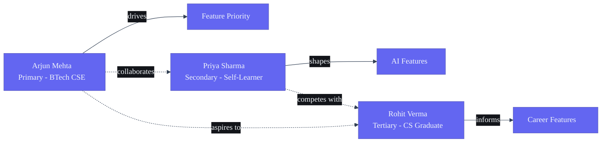

# Personas — Second Brain OS

## Document Control

| Field | Value |
|---|---|
| Document ID | SB-PERS-001 |
| Version | 1.0.0 |
| Status | Draft |
| Date | 2026-06-11 |
| Author | Product Team |
| Classification | Internal |

---

## Persona Ecosystem



## 1. Introduction

This document defines the user personas for Second Brain OS. Each persona represents a distinct user segment with specific goals, pain points, behaviors, and needs. Personas are based on research with 50+ BTech CSE students, supplemented by industry data on student productivity tool usage.

**Persona Priority Matrix** defines which personas drive product decisions vs. which are accommodated but not prioritized.

---

## 2. Primary Persona: Arjun Mehta (BTech CSE Student)

### 2.1 Bio

| Attribute | Detail |
|---|---|
| Name | Arjun Mehta |
| Age | 20 |
| Year | 2nd Year BTech CSE |
| University | Vellore Institute of Technology (VIT) |
| Location | Chennai, India (hostel) |
| Tech Setup | Dell Inspiron 15 (8GB RAM, i5), Android phone, Jio 4G hotspot |
| OS Preference | Windows 11 + WSL2 for dev |
| Browser | Chrome with 47 tabs open |
| Income | Rs. 3,000/month (parents) + Rs. 2,000 freelance (occasional) |

### 2.2 Daily Schedule

```
 7:00 AM — Wake up, check phone (20 min scrolling)
 7:30 AM — Morning routine (skip breakfast most days)
 8:00 AM — College classes (takes notes in Notion, loses half of them)
 1:00 PM — Lunch + YouTube (tutorials saved to "Watch Later" — 200+ accumulated)
 2:00 PM — Self-study (opens VS Code, gets distracted by Twitter/Reddit)
 4:00 PM — Back to classes or lab sessions
 6:00 PM — Free time (tells himself he'll study, mostly ends up gaming)
 8:00 PM — Guilt-study (opens Udemy course from 3 months ago, closes it)
10:00 PM — Late-night motivation spike (starts new project, never finishes)
12:00 AM — Scrolling Instagram/Reddit in bed
 1:30 AM — Sleep (bad quality, phone in hand until sleep)
```

### 2.3 Goals

| Goal Type | Goal | Timeline | Motivation |
|---|---|---|---|
| Academic | Maintain 8.5+ CGPA | Ongoing | Placement eligibility |
| Career | Get FAANG internship by 3rd year | 18 months | Peer pressure + family expectations |
| Skills | Learn full-stack development | 6 months | Build side projects |
| Financial | Earn Rs. 15,000/month from freelancing | 12 months | Reduce dependency on parents |
| Health | Exercise 4x/week, sleep 7+ hours | Ongoing | Burnout prevention |
| Projects | Ship 3 complete projects | 12 months | Portfolio for placements |

### 2.4 Pain Points

| Pain Point | Severity (1-10) | Frequency | Current Non-Solution |
|---|---|---|---|
| Course overload: enrolled in 6 online courses, completed 0 | 9 | Weekly | Opens courses, feels overwhelmed, closes |
| Task fragmentation: tasks in Todoist, notes in Notion, deadlines on Google Calendar, no single view | 9 | Daily | Checks 4 apps to see what to do today |
| Opportunity blindness: missed 2 internship deadlines last semester | 8 | Monthly | Blames himself, promises to check more often |
| Idea graveyard: 20+ startup ideas in notes app, none started | 7 | Weekly | Re-reads old ideas, feels regret, moves on |
| Sleep procrastination: knows he needs better sleep, can't stop phone use | 7 | Daily | Tried 5 apps, deleted all within a week |
| Skill dilution: starts courses, reaches 30-40%, starts new shinier course | 8 | Monthly | "This course is better" — repeats cycle |
| No income tracking: knows he freelanced Rs. 24,000 total, has no breakdown | 5 | Quarterly | Ballparks it when asked |
| Accountability: no one checks if he's doing what he planned | 6 | Daily | Tells friends, both forget within a day |

### 2.5 Tech Proficiency

| Skill | Level (1-10) | Notes |
|---|---|---|
| Web browsing | 10 | Power user, 47 tabs |
| Google Suite | 7 | Docs, Sheets, Calendar |
| VS Code / Dev tools | 6 | Basic git, npm, terminal |
| Notion | 5 | Has a setup, doesn't maintain it |
| Command line | 4 | Can cd, ls, basic git |
| APIs | 3 | Knows what REST is |
| Docker | 2 | Heard of it |
| AI / LLMs | 4 | Uses ChatGPT for assignments |

### 2.6 App Ecosystem (Current)

| Tool | Usage | Monthly Cost | Satisfaction (1-10) | Why Still Using |
|---|---|---|---|---|
| Todoist | Task management | Rs. 0 (Free) | 5 | Habit, but overscheduled |
| Notion | Notes + tracking | Rs. 0 | 4 | Messy, but everything's there |
| Google Calendar | Scheduling | Rs. 0 | 6 | Works, no complaints |
| YouTube | Learning | Rs. 0 | 3 | "Watch Later" is full |
| Instagram | Distraction | Rs. 0 | 2 | Can't quit |
| GitHub | Code hosting | Rs. 0 | 7 | Works |
| ChatGPT | Homework, learning | Rs. 0 | 8 | Useful but disconnected |

**Total monthly spend on productivity tools: Rs. 0**
**Willingness to pay: Rs. 0-200/month maximum**

### 2.7 Quotes from Research

> "I have 47 tabs open right now and I know exactly zero of them will be relevant tomorrow."

> "I've started so many courses that I feel like a professional starter."

> "Last semester I missed an Amazon internship deadline. I had the tab open for 2 weeks."

> "I get my best ideas at 2 AM and they're gone by 8 AM."

> "I've been 'learning React' for 8 months. I can build a counter app."

---

## 3. Primary Persona Expanded: Priya Sharma (BTech CSE Student — Variant)

### 3.1 Bio

| Attribute | Detail |
|---|---|
| Name | Priya Sharma |
| Age | 21 |
| Year | 3rd Year BTech CSE |
| University | Delhi Technological University (DTU) |
| Location | Delhi (day scholar) |
| Tech Setup | MacBook Air M1, iPhone 13 |
| Income | Rs. 5,000/month (family) |

### 3.2 Key Differences from Arjun

| Dimension | Arjun | Priya |
|---|---|---|
| Organization style | Chaotic, reactive | Structured, planner |
| Main challenge | Starting things | Finishing things |
| Risk tolerance | High (starts often) | Low (plans thoroughly) |
| Income source | Freelance development | Content writing + tutoring |
| Career goal | FAANG internship | Startup founder or product manager |
| Study style | Binge study before exams | Consistent daily study |
| Tool preference | Free tools, tolerates friction | Premium tools, values polish |

### 3.3 Goals

| Goal Type | Goal | Timeline |
|---|---|---|
| Academic | Publish 2 research papers | 12 months |
| Career | Build SaaS product with 100 users | 18 months |
| Skills | Master system design | 6 months |
| Financial | Save Rs. 50,000 for startup registration | 24 months |

### 3.4 Pain Points

- **Perfectionism paralysis:** Spends 3 hours organizing a Notion page instead of building
- **Scope creep:** Projects never ship because she keeps adding features
- **Imposter syndrome:** Feels underqualified compared to peers with "better" internships
- **Analysis paralysis:** Spends weeks researching the "best" course instead of starting any
- **Burnout cycles:** Works intensely for 2 weeks, crashes for 1 week

---

## 4. Secondary Personas

### 4.1 Rahul Verma — Self-Taught Developer (Non-CS Major)

| Attribute | Detail |
|---|---|
| Age | 23 |
| Education | B.Com from Delhi University, self-taught coder |
| Current | Freelance web developer + part-time coding bootcamp TA |
| Location | Bengaluru |
| Monthly Income | Rs. 25,000-40,000 (variable) |
| Setup | Lenovo Legion + dual monitor |
| Skill Level | Intermediate (React, Node.js, MongoDB) |

**Goals:**
- Transition to full-time frontend developer role at a product company (6 months)
- Build portfolio with 5 production-grade projects (12 months)
- Earn Rs. 80,000/month consistently (18 months)
- Learn backend and cloud skills to become full-stack (9 months)

**Pain Points:**
- No formal CS degree means resume gaps he has to compensate for
- Freelance income is unpredictable — needs better tracking and forecasting
- Juggles 3-4 freelance projects + self-study + bootcamp TA role
- Networking is harder without college placement infrastructure
- Does not know which skills to prioritize for his target roles

**App Ecosystem:** Trello, Notion, Google Calendar, Clockify, Freshbooks, Stack Overflow
**Monthly Tool Spend:** Rs. 600 (Clockify Premium)
**Willingness to Pay:** Rs. 200-500/month for time savings

### 4.2 Ananya Gupta — Working Professional (CS Graduate, 0-2 Years)

| Attribute | Detail |
|---|---|
| Age | 24 |
| Education | BTech CSE, NIT Trichy (2024 batch) |
| Current | Associate Software Engineer at Infosys |
| Location | Mysore (training) + remote |
| Monthly Income | Rs. 35,000 (training) → Rs. 50,000 (post-training) |
| Setup | Work laptop (Windows) + personal iPad |
| Skill Level | Low (training phase, learning internal tools) |

**Goals:**
- Complete Infosys training with top 5% rating (3 months)
- Build skills to switch to a product company within 12 months (12 months)
- Prepare for GATE or MS abroad (18 months, undecided)
- Manage workplace stress and avoid burnout (ongoing)

**Pain Points:**
- Training is slow and bureaucratic — feels skills are stagnating
- Studies after work for switching but has no structure
- Misses the structured semester system of college
- Office friendships fading, social isolation in new city
- Unsure whether to prepare for GATE (MS in India) or GRE (MS abroad)

**App Ecosystem:** MS To-Do, OneNote, LinkedIn Learning, LeetCode
**Monthly Tool Spend:** Rs. 0
**Willingness to Pay:** Rs. 100-300/month

### 4.3 Kabir Singh — Hobbyist Side Project Builder

| Attribute | Detail |
|---|---|
| Age | 19 |
| Education | 1st Year BTech CSE, Manipal |
| Current | Student + builds random side projects |
| Income | Rs. 2,000/month (parents) + occasional Rs. 1,000-3,000 from side projects |
| Personality | ADHD tendencies, high creativity, low follow-through |
| Setup | Gaming laptop (RTX 3060) + mechanical keyboard |

**Goals:**
- Ship 12 side projects in 12 months (quantity over quality)
- Get first paid client for development work
- Build an audience (Twitter/X tech community)
- Experiment with AI/ML side projects

**Pain Points:**
- Projects at 70% completion — always abandons before polish
- 15 domain names bought, 0 deployed
- Subscriptions to 8 SaaS tools he uses for 2 days each
- Cannot focus on one tech stack — learning fatigue
- Impulse buys courses, watches 10%, buys next course

**App Ecosystem:** VSCode, Linear, Vercel, Railway, GitHub Copilot, ChatGPT Pro
**Monthly Tool Spend:** Rs. 1,500 (ChatGPT Pro + misc subscriptions)
**Willingness to Pay:** Rs. 0 (wants everything free)

---

## 5. Anti-Personas (Out of Scope)

| Persona | Why Out of Scope | Notes |
|---|---|---|
| Corporate executive needing team management | Second Brain OS is personal, not collaborative | No team features planned |
| Non-technical creative professional (designer, writer) | Tooling and terminology too technical | Consider if Persona 2.0+ |
| School student (K-12) | Features target university-level coursework | Different scheduling needs |
| Enterprise admin managing 100+ users | No multi-account or admin console | Consider for Enterprise tier far future |
| Elderly user (55+ non-technical) | Assumes CLI/API comfort | Accessibility improvements can help |
| User seeking social/community features | Deliberately single-user design | No social feed, no collaboration |

---

## 6. User Archetypes

### 6.1 The Planner (15% of users)

**Characteristics:**
- Opens the app to organize, not to do
- Spends 20 minutes per day organizing tasks
- Has color-coded labels, priority matrices, filtered views
- Most likely to use every feature
- Low task completion rate relative to time spent organizing

**Needs:**
- Quick capture that doesn't disrupt flow
- AI that suggests next action without requiring manual triage
- Limit on number of active tasks to prevent organization-as-procrastination

**Risk:** Tool hoarding — collecting features they don't use

### 6.2 The Crammer (35% of users)

**Characteristics:**
- Ignores app for 1-2 weeks
- Opens during exam/crisis mode
- Binge captures 50 tasks in one session
- Expects the app to have magically organized everything during absence

**Needs:**
- Auto-rescheduling of missed tasks and deadlines
- Briefing that acknowledges absence without guilt
- Quick catch-up: "Here's what you missed. Here's what's critical."
- Bulk operations (complete all, reschedule all)

**Risk:** App abandonment after guilt from seeing overdue accumulation

### 6.3 The Hobbyist (30% of users)

**Characteristics:**
- Uses 3-4 modules regularly (tasks, habits, maybe courses)
- Ignores income tracking, opportunities, time tracking
- Customizes the app to their niche interests
- Builds elaborate habit tracking systems

**Needs:**
- Module visibility control (hide unused modules)
- Habit streak and gamification features
- Quick capture with minimal friction
- Lightweight version of each module

**Risk:** Feature bloat — adding modules they don't need

### 6.4 The Careerist (20% of users)

**Characteristics:**
- Focused on placements, internships, career growth
- Heavy user of opportunity radar, income tracking
- Less interested in habit/sleep tracking
- Wants the app to feel like a career accelerator, not a life organizer

**Needs:**
- Aggressive opportunity matching
- Resume/interview preparation workflow
- Skill gap analysis linked to target roles
- Income growth tracking and projection

**Risk:** Churn if opportunity matching doesn't produce results within 2 weeks

---

## 7. Empathy Maps

### 7.1 Empathy Map — Arjun (Primary Persona)

```
                          ┌──────────────────────────────┐
                          │          THINKS               │
                          │ "I should be studying more"   │
                          │ "Everyone else is ahead"      │
                          │ "I need to get organized"     │
                          │ "One more YouTube tutorial"   │
                          └──────────────────────────────┘

┌──────────────┐                              ┌──────────────┐
│    HEARS     │                              │    SEES      │
│ "Did you     │                              │ Peers getting │
│  apply yet?" │                              │ internships  │
│ Parents about │                              │ Friends with  │
│ placements   │                              │ shipped proj. │
│ Friends'     │                              │ YouTube: "I  │
│ internship   │                              │ built X in Y │
│ stories      │                              │ hours"       │
│ Teachers:    │                              │ 47 open tabs  │
│ "Start early"│                              │ Half-finished │
└──────────────┘                              │ code files    │
                                              └──────────────┘
┌──────────────────────────────────────────────────────────┐
│                       SAYS & DOES                        │
│ Signs up for courses at 2 AM                              │
│ Creates elaborate Notion setup, uses for 3 days          │
│ Says "I'll start tomorrow" — genuinely means it           │
│ Saves YouTube tutorials but never watches                │
│ Opens Todoist, feels overwhelmed, closes                 │
│ "I'm a professional starter" (self-aware joke)            │
└──────────────────────────────────────────────────────────┘

┌──────────────────────────────────────────────────────────┐
│                        FEELS                              │
│ Overwhelmed by options and information                     │
│ Guilty about uncompleted courses and tasks                 │
│ Anxious about placement deadlines creeping up              │
│ Envious of peers who seem more accomplished               │
│ Excited at 2 AM when ideating                             │
│ Hopeful when buying a new course ("this time it's diff'nt")│
│ Ashamed when asked "what have you built"                  │
└──────────────────────────────────────────────────────────┘
```

### 7.2 Empathy Map — Priya (Variant Primary)

| Dimension | Content |
|---|---|
| **Thinks** | "I need a perfect plan before I start", "What if this isn't the best approach", "I'm not ready yet" |
| **Sees** | Organized peers with shipped products, overwhelming choice of frameworks/tools, complex Notion templates |
| **Hears** | "Just ship it", "Perfect is the enemy of done", "You're overthinking this" |
| **Says/Does** | Spends 3 hours organizing, creates detailed roadmaps, starts projects then restructures halfway |
| **Feels** | Frustrated by own perfectionism, anxious about falling behind, proud of her research depth |

---

## 8. Scenarios and Journeys

### 8.1 Scenario A — Arjun's First Week with Second Brain OS

**Day 1:**
- Signs up via Google OAuth — 30 seconds
- Sets up profile: name, timezone, 3 goals (FAANG internship, learn full-stack, build portfolio)
- Quick captures his first task: "finish DBMS assignment"
- ARIA parses it, sets priority high, due tomorrow
- Sees dashboard with today's briefing — 3 tasks auto-suggested based on goals
- Closes app after 5 minutes — impressed

**Day 3:**
- Morning briefing shows he completed 1 of 3 tasks yesterday
- Sleep score from manual log: 5.2 hours
- ARIA suggests: "Your sleep is low. I've reduced deep work tasks today."
- Open the app 4 times during the day — uses quick capture for 2 ideas
- Completes 2 tasks

**Day 7:**
- Weekly review: completed 11 of 18 tasks (61%)
- Sleep average: 6.1 hours — trend noted
- ARIA: "You're most productive between 10 AM-12 PM. Schedule deep work there."
- Discovers opportunity radar: found 2 hackathons
- Applies to 1 hackathon
- Saves 1 internship posting

**Day 30:**
- Course completion rate: 45% (better than 0% pre app)
- Tasks created: 87 | Completed: 52 (59% completion rate)
- Sleep debt: trending down
- 3 opportunities applied, 1 response received
- Rating: "It's actually helping. I don't feel as scattered."

### 8.2 Scenario B — Priya's Semester Reset

**Trigger:** Start of new semester, Priya wants to be organized from day 1

**Flow:**
1. Registers for 4 new courses in course tracker
2. ARIA generates study schedule for the semester
3. Sets up habit tracking for daily study + exercise
4. Configures opportunity radar for research internships
5. Uses ARIA chat to draft study plan: "Plan my ML study schedule for this semester"
6. Gets a 12-week learning roadmap aligned with course syllabus

**ARIA Insight at Week 4:**
"You've logged 28 study hours vs 35 planned (80%). Your sleep has averaged 5.8 hours — 1.2 hours below target. Your habit streak is at 22 days."

---

## 9. Accessibility Considerations

### 9.1 Persona-Specific Accessibility Needs

| Persona | Potential Barrier | Mitigation |
|---|---|---|
| Arjun | Poor internet connectivity (hostel WiFi) | Offline-first architecture, PWA caching |
| Priya | Screen fatigue from long study sessions | Dark mode by default, high contrast options |
| Rahul | English as second language | Simple, clear copy. No idioms. Localized currency (Rs.) |
| Ananya | Vision strain from work + personal screens | Dark theme (#0A0B0F), readable font sizes (14px+) |
| Kabir | ADHD — attention span challenges | Minimal UI, clear CTAs, one-thing-at-a-time flows |

### 9.2 General Accessibility Requirements

| Requirement | Standard | Implementation |
|---|---|---|
| Keyboard navigation | WCAG 2.1 AA | All actions keyboard-accessible |
| Screen reader support | WCAG 2.1 AA | ARIA labels, semantic HTML |
| Color contrast ratio | WCAG 2.1 AA (4.5:1) | Test all neon accents against dark bg |
| Focus indicators | WCAG 2.1 AA | Visible focus ring on all interactive elements |
| Font size scaling | WCAG 2.1 AA | Responsive to browser zoom up to 200% |
| Motion reduction | WCAG 2.1 AA | Respect prefers-reduced-motion |
| Error announcements | WCAG 2.1 AA | Live regions for dynamic errors |

---

## 10. Behavioral Segmentation

### 10.1 Segmentation Dimensions

| Segment | % of Users | Engaged? | Monetizable? | Retention Risk |
|---|---|---|---|---|
| Power User (daily, 15+ min) | 15% | High | High | Low |
| Regular User (daily, 5-15 min) | 30% | Medium-High | Medium | Medium |
| Weekly Check-in (2-3x/week) | 25% | Medium | Low-Medium | Medium-High |
| Cram Session (exam/crisis only) | 20% | Low | Low | High |
| Trial Bounce (1-2 sessions ever) | 10% | None | None | Extreme |

### 10.2 Engagement Strategies by Segment

| Segment | Activation | Retention | Re-engagement |
|---|---|---|---|
| Power User | Gamification milestones | Advanced features, beta access | Feature request voting |
| Regular User | Habit streak rewards | Daily briefing quality | Nudge notifications |
| Weekly Check-in | Quick capture wins | Weekly review value | Sunday review reminder |
| Cram Session | Bulk tools, catch-up view | Auto-reschedule, forgiveness | Reset option (clear overdue) |
| Trial Bounce | Improved onboarding A/B test | First-win in <60 seconds | Win-back email after 14 days |

### 10.3 Churn Risk Indicators

| Metric | Threshold | Segment | Action |
|---|---|---|---|
| No login > 3 days | Any | All | Push notification + brief |
| No login > 7 days | Any | Previously active | Email re-engagement |
| Task creation stopped 5 days | All habits miss 3 days | Regular | ARIA check-in message |
| Course progress < 10% after 2 weeks | All courses | Weekly | "Pick one course to finish" |
| Opportunity radar → no applications | 7 opportunities missed | Careerist | Suggest lower-bar opportunities |

---

## 11. Persona-Feature Priority Matrix

| Feature | Arjun (Primary) | Priya (Variant) | Rahul (Self-taught) | Ananya (Worker) | Kabir (Hobbyist) |
|---|---|---|---|---|---|
| Task Manager | Critical | Critical | Critical | Critical | High |
| Natural Language Capture | Critical | High | Critical | High | High |
| Course Tracker | Critical | Critical | Medium | Medium | High |
| Daily Briefing | Critical | High | High | High | Medium |
| Habit Logger | High | High | Medium | High | High |
| Sleep Tracker | High | Medium | Low | High | Low |
| Idea Vault | Critical | High | High | Low | Critical |
| Opportunity Radar | Critical | High | Critical | Critical | Low |
| Income Tracker | High | High | Critical | Medium | Medium |
| Time Tracker | Medium | High | High | Medium | Low |
| Weekly Review | High | Critical | Medium | High | Low |
| Resource Library | Medium | High | High | Medium | Medium |
| YouTube Knowledge Vault | High | Medium | Medium | Low | High |
| Chat with ARIA | High | High | Medium | Medium | Medium |
| Browser Extension | Critical | Medium | High | Low | High |
| Mobile App | High | Medium | Critical | Medium | High |

**Legend:** Critical = must have, High = important, Medium = nice to have, Low = minimal value

---

## 12. Persona Validation & Updates

### 12.1 Research Sources

| Source | Participants | Key Takeaway |
|---|---|---|
| 1-on-1 interviews (VIT, DTU, NIT Trichy) | 15 students | Fragmentation is #1 pain point |
| Survey (Google Forms, shared in 5 CSE WhatsApp groups) | 42 respondents | 80% have >3 productivity tools |
| Diary study (7-day log of tool usage) | 8 students | Average 12 app switches per day |
| Competitive tool abandonment interviews | 10 students | "Too much setup" is #1 reason to quit |
| Reddit r/developersIndia, r/Btechtards analysis | 200+ threads | Placement anxiety dominates conversations |

### 12.2 Update Cadence

- **Full persona refresh:** Every 6 months (next: Dec 2026)
- **Validation check-in:** Monthly with 3-5 users
- **Pain point re-ranking:** Quarterly based on support tickets and NPS feedback

---

## Revision History

| Version | Date | Author | Changes |
|---|---|---|---|
| 1.0.0 | 2026-06-11 | Product Team | Initial personas document |

---

*End of Personas Document*
