# Project Scope — Second Brain OS (ARIA OS)

## Document Control

| Field | Value |
|---|---|
| Document ID | PRD-SCO-004 |
| Version | 1.0.0 |
| Status | Approved |
| Date | 2026-07-10 |
| Classification | Internal |
| Owner | Developer |

---

## 1. Executive Summary

Second Brain OS is a personal AI productivity system for BTech CSE students comprising 15 functional modules, 11 AI agents, 15 cron jobs, and an enterprise-grade infrastructure layer. This document defines precisely what is included in the project scope, what is explicitly excluded, the boundaries between modules, and the process for managing scope changes.

---

## 2. Purpose

To prevent scope creep, clarify boundaries for development and testing, and provide a definitive reference for what the product does and does not include. Every feature suggestion, bug report, and enhancement request can be evaluated against this scope document.

---

## 3. Scope Boundaries

### 3.1 In Scope

**Functional Modules (15):**
- Tasks — CRUD with priority, categories, dependencies, recurring, auto-reschedule, Pomodoro timer
- Courses — Multi-platform tracking, progress, deadlines, daily targets, spaced repetition
- Goals — Create goals, visual roadmap builder, milestones, scenario planning, weekly relevance checks
- Habits — Custom habits, streaks, consistency, goal-linked habits, miss detection
- Sleep — Bedtime/wake logging, sleep score, debt tracking, wind-down reminders
- Income — Source/entry tracking, effective hourly rate, milestones, skill-to-income mapping
- Projects — Phase tracking, next-action rule, blocker logging, GitHub integration, LinkedIn post drafts
- Ideas — Capture, status pipeline (raw->validating->building->shipped), AI market check
- Resources — URL save, auto-tagging, AI summary, natural language search, resurface engine
- Opportunities — Daily 6 AM radar scan (6 categories), skill match scoring, deadline alerts
- Academics — CGPA calculator, subjects/marks, exam countdown, at-risk alerts
- YouTube Vault — Save, AI summary, watch scheduling, 60-day expiry, goal linking
- Chat (ARIA) — Natural language AI assistant, memory, intent recognition, action execution
- Automation Dashboard — Cron job status, manual triggers, schedule visualization
- Time Tracking — Start/stop timers, Pomodoro mode, deep work detection, daily stats

**AI Agent System (11 agents):**
- ARIA Orchestrator — Central intelligence layer coordinating all agents
- Briefing Agent (A09) — 7 AM daily briefing generation
- Memory Agent (A02) — Persistent fact extraction and recall
- Learning Agent (A03) — Pattern detection and productivity insights
- Opportunity Agent (A06) — Daily skill-matched opportunity scanning
- Opportunity Matching Agent (A15) — Opportunity scoring engine
- Weekly Review Agent (A10) — Sunday 8 PM narrative review
- Sleep Agent (A13) — Wind-down messages, sleep analysis
- Nudge Agent (A14) — Course/habit progress nudges
- Roadmap Agent (A08) — Skill development roadmap optimization

**Cron Jobs (7):**
- Daily Briefing (7 AM) — Generate and push morning briefing
- Opportunity Radar (6 AM) — Scan and match opportunities
- Weekly Review (Sunday 8 PM) — Generate narrative weekly review
- Habit Miss Checker (Midnight) — Detect missed habits
- Missed Task Checker (Every 15 min) — Reschedule overdue tasks
- Sleep Reminder (9:30 PM) — Wind-down push notification
- Course Nudge (6 PM) — Course progress reminders

**Infrastructure:**
- Frontend: Next.js 14 + TypeScript + Tailwind CSS (cyberpunk theme)
- Backend: FastAPI + Python 3.10
- Database: Supabase PostgreSQL with RLS
- AI: Ollama (Mistral 7B, local) + Claude API (cloud fallback)
- Auth: Supabase Auth (Google OAuth)
- Scheduler: APScheduler
- Search: Brave Search API
- Email: Resend
- Testing: pytest (Python) + Jest/Vitest (TypeScript)
- CI/CD: GitHub Actions (14 jobs)

**Documentation:**
- Product: Vision, PRD, BRD, SRS, Features, User Stories, Acceptance Criteria
- Design: UI/UX, Design System, Design Tokens
- Engineering: Architecture, API, Database, Events, ADRs
- AI: Agent specifications, Prompt files, PromptLoader
- Security: Security model, Compliance, Data Privacy
- DevOps: Deployment, Docker, CI/CD
- QA: Testing strategy, E2E specs
- Operations: Runbooks, Monitoring, Incident Response

**Testing:**
- 2795+ Python tests across 58 test files
- ~1900+ frontend tests
- 22 E2E Playwright specs
- 105+ Storybook stories
- 95.56% Python code coverage (85% threshold)

### 3.2 Explicitly Out of Scope

| Item | Reason | When/If to Revisit |
|---|---|---|
| Multi-user collaboration | Single-user architecture per ADR-002 | Year 3+ if community requests |
| Mobile native app (iOS/Android) | PWA satisfies mobile needs initially | Year 2 (React Native) |
| Desktop app (Electron/Tauri) | Web app meets requirements | Year 3 |
| Browser extension (v1) | Not critical for core value | Post-GA |
| Voice input | Web Speech API has limited accuracy | Post-GA |
| Team features / workspaces | Single-user only per ADR-002 | Never without ADR revision |
| Enterprise SSO / SAML | No enterprise customers | Year 4+ |
| Offline-first (full) | PWA with limited offline support | Year 2 with CRDT sync |
| Real-time collaboration | Conflict resolution complexity | Year 3+ |
| File storage / attachments | Supabase storage limited on free tier | Post-GA with budget |
| Third-party calendar sync | Google Calendar API integration | Post-GA |
| Third-party habit import (Apple Health) | Apple Health/Google Fit integration | Post-GA |
| Data migration tools (from Notion/Todoist) | Low ROI for 100-user scale | Post-PMF |
| Admin panel / user management | Single-user product | Year 4+ |
| API marketplace / public API | Internal API only | Year 3+ |
| Plugin system / SDK | Community plugin marketplace | Year 3+ |
| Theming / light mode | Dark mode only | Post-GA |
| Multi-language / i18n | India English only initially | Year 2 (Hindi + Tamil) |
| Accessibility (full WCAG) | Partial compliance initially | Year 2 |
| AI model fine-tuning | Requires user conversation data | Year 2+ |

### 3.3 Module Boundaries

| Boundary | Rule | Rationale |
|---|---|---|
| Tasks <-> Courses | Tasks can be linked to courses (course_id FK). Courses auto-generate study tasks. | Learning-to-action pipeline |
| Goals <-> Tasks | Tasks can be linked to goals (goal_id FK). Goal progress computed from linked task completion. | Execution tracking |
| Goals <-> Courses | Courses can be linked to goals. Goal progress includes course progress. | Learning alignment |
| Ideas <-> Goals | Ideas linked to goals. Moving idea to "building" auto-creates a goal. | Idea-to-execution |
| Income <-> Skills | Income entries tagged with skills. Skill-to-income map computed. | Monetization insight |
| Opportunities <-> Skills | Opportunities matched to user skills. Match score threshold enforced. | Relevance filtering |
| Sleep <-> Tasks | Low sleep score adjusts task priorities. Heavy tasks moved to afternoon. | Health-aware productivity |
| Habits <-> Goals | Habits linked to goals. Habit completion contributes to goal progress. | Behavioral compounding |
| Projects <-> Tasks | Projects have next action task. Tasks can reference project. | Execution focus |
| Resources <-> Anything | Resources tagged to goals, courses, projects. Resurface engine activates on context. | Knowledge reuse |

---

## 4. Scope Management Process

### 4.1 How Scope Changes Are Evaluated

All scope change requests go through a structured evaluation:

```mermaid
graph TD
    SR[Scope Request] --> Q1{Builder Test: <br/>Does this help users <br/>build real things?}
    Q1 -->|No| R1[Reject]
    Q1 -->|Yes| Q2{Complexity Test: <br/>Can it ship in <br/>< 2 weeks?}
    Q2 -->|No| R2[Defer to next phase]
    Q2 -->|Yes| Q3{Maintenance Test: <br/>Can one person <br/>maintain it forever?}
    Q3 -->|No| R3[Defer or simplify]
    Q3 -->|Yes| Q4{Infrastructure Test: <br/>Does it work on <br/>free tier?}
    Q4 -->|No| R4[Find free alternative]
    Q4 -->|Yes| A[Approve for current phase]
    
    style Q1 fill:#13151A,stroke:#6366F1
    style Q2 fill:#13151A,stroke:#818CF8
    style Q3 fill:#13151A,stroke:#00FFA3
    style Q4 fill:#13151A,stroke:#F59E0B
    style A fill:#13151A,stroke:#00FFA3
    style R1 fill:#13151A,stroke:#EF4444
    style R2 fill:#13151A,stroke:#EF4444
    style R3 fill:#13151A,stroke:#EF4444
    style R4 fill:#13151A,stroke:#EF4444
```

### 4.2 Scope Change Authority

| Change Type | Authority | Documentation Required |
|---|---|---|
| Bug fix within existing scope | Developer | GitHub issue |
| Minor enhancement (<=8 hours) | Developer | Brief note in commit |
| Major feature (>8 hours) | Developer (self-approval) | DecisionLog entry + Impact analysis |
| Scope boundary change | Developer + community feedback | ADR + ProjectScope update |
| Out-of-scope item to in-scope | Developer + community poll | Market research + PRD update |
| Module deprecation | Developer | Migration plan + docs update |

### 4.3 Scope Review Cadence

| Review Type | Frequency | Participants | Focus |
|---|---|---|---|
| Light scope check | Weekly (Sunday) | Developer | Did we stay in scope this week? |
| Quarterly scope review | Quarterly | Developer | Are scope boundaries still correct? |
| Annual scope audit | Annual | Developer + community | Full scope document refresh |

---

## 5. Risks of Scope Mismanagement

| Risk | Consequence | Mitigation |
|---|---|---|
| Feature creep | Timeline slip, burnout | Builder test; quarterly scope review |
| Premature expansion | Broken core experience | Freeze new features during stability phases |
| Scope too narrow | Missed market opportunity | Community feedback loop; competitive monitoring |
| Undocumented scope changes | Team confusion, inconsistent product | DecisionLog entries for all scope changes |
| Scope gold-plating | Low-value features consume capacity | Measure-before-building principle |

---

## 6. Implementation Notes

- All 15 modules follow the same CRUD pattern: GET list, GET by ID, POST create, PUT update, DELETE
- Frontend routes match module names: /tasks, /courses, /goals, etc.
- Backend routes follow /api/v1/{module}/ pattern
- AI agent modules in packages/ai/agents/ named consistently
- Prompt files in prompts/{category}/ named to match agent modules

---

## 7. References

| Document | Location | Relationship |
|---|---|---|
| Product Strategy | [ProductStrategy.md](ProductStrategy.md) | Strategic justification for scope |
| Mission | [Mission.md](Mission.md) | Principles guiding scope decisions |
| Goals | [Goals.md](Goals.md) | Scope aligned with goal achievement |
| Features | [03_Features.md](03_Features.md) | Detailed feature inventory |
| Decision Log | [DecisionLog.md](DecisionLog.md) | Records of scope decisions |
| ADR-002 | `docs/engineering/adr/ADR-002.md` | Single-user architecture scope decision |
| AGENTS.md | `AGENTS.md` | Development guidelines |
