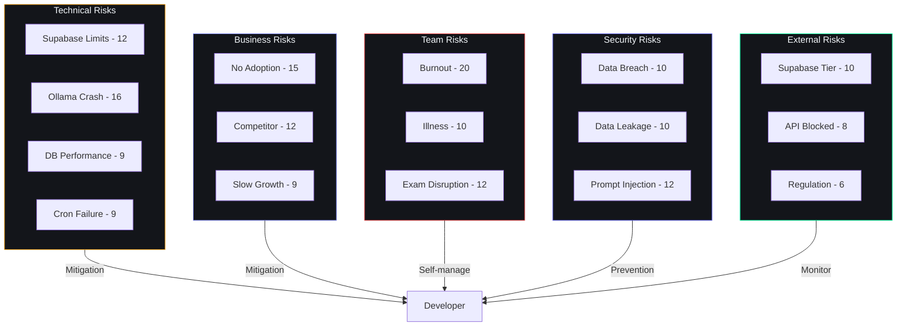

# Risk Register — Second Brain OS (ARIA OS)

## Document Control

| Field | Value |
|---|---|
| Document ID | PRD-RIS-007 |
| Version | 1.0.0 |
| Status | Approved |
| Date | 2026-07-10 |
| Classification | Internal |
| Owner | Developer |

---

## 1. Executive Summary

This document contains the comprehensive risk register for Second Brain OS, identifying 25+ risks across technical, business, product, team, security, and external categories. Each risk is assessed with likelihood and impact scores, assigned a risk score (1-25), documented with mitigation strategies and contingency plans, and assigned an owner and review date.

---

## 2. Purpose

To proactively identify, assess, and manage risks that could threaten project success. The risk register is reviewed quarterly and updated as new risks emerge or existing risks change. Every mitigation strategy has a clear owner and timeline.

---

## 3. Scope

**In Scope:**
- Technical risks (infrastructure, AI, database, performance)
- Business risks (market, monetization, competition)
- Product risks (adoption, engagement, quality)
- Team risks (burnout, capacity, continuity)
- Security risks (data breach, unauthorized access)
- External risks (third-party deprecation, regulation)
- Operational risks (deployment, monitoring, incident response)

**Out of Scope:**
- Assumptions (see [Assumptions.md](Assumptions.md))
- Feature-level bugs (tracked in GitHub Issues)
- Sprint-level impediments (tracked in daily work)
- Code-level technical debt (tracked in AGENTS.md Section 19)

---

## 4. Business Context

Second Brain OS is a solo-developed product with zero infrastructure budget. Risk tolerance is low for critical-path items (auth, data, AI) but higher for non-essential features. The solo developer model means team risks (burnout, capacity) are existential rather than operational. Most risks are mitigated through architectural choices: graceful degradation, free-tier alternatives, and modular design.

---

## 5. Risk Scoring Methodology

**Risk Score = Likelihood x Impact**

| Likelihood | Score | Definition |
|---|---|---|
| Very Low | 1 | <10% probability |
| Low | 2 | 10-25% probability |
| Medium | 3 | 25-50% probability |
| High | 4 | 50-75% probability |
| Very High | 5 | >75% probability |

| Impact | Score | Definition |
|---|---|---|
| Negligible | 1 | No noticeable effect |
| Minor | 2 | Small inconvenience, easily recovered |
| Moderate | 3 | Feature degraded, workaround available |
| Major | 4 | Feature unavailable, significant impact |
| Critical | 5 | Project failure, data loss, unrecoverable |

---

## 6. Risk Register

### 6.1 Technical Risks

| ID | Risk | Category | Likelihood | Impact | Score | Mitigation | Contingency | Owner | Status | Review Date |
|---|---|---|---|---|---|---|---|---|---|---|
| R-001 | Supabase free tier limits exceeded (DB size, transfer, auth users) | Infrastructure | Medium (3) | Major (4) | 12 | Pagination (20 items); compressed data; archive old records; monitor usage dashboard weekly | Migrate to Neon.tech (free PostgreSQL, 3GB limit); reduce storage by archiving to JSON exports | Developer | Active | 2026-08-10 |
| R-002 | Ollama crashes or produces unusably slow responses on low-end hardware | AI/ML | High (4) | Major (4) | 16 | Circuit breaker (5 failures -> 60s cooldown); Claude API fallback; algorithmic fallback as safety net | All AI features have deterministic non-AI fallback; system works without AI | Developer | Active | 2026-08-10 |
| R-003 | Claude API credits ($5) exhaust during development | AI/ML | Medium (3) | Major (4) | 12 | Ollama as primary (80% of calls); strict token budgets (max 4096); skip non-essential AI calls during dev | Switch to GPT-4o-mini (cheaper: $0.15/1M input); reduce AI call frequency; use cached responses | Developer | Active | 2026-08-10 |
| R-004 | Brave Search API rate limit (2000 queries/month) reached | External | Medium (3) | Moderate (3) | 9 | Cache scan results for 24h; reduce scan diversity on busy days; use distributed scan schedule | Switch to Google Programmable Search (100 queries/day free); user manual opportunity entry | Developer | Active | 2026-08-10 |
| R-005 | Database query performance degrades with user data growth | Performance | Medium (3) | Moderate (3) | 9 | Indexed columns (user_id, status, due_date, created_at); pagination on all list endpoints (20 items/page) | Add covering indexes; implement read replicas (Supabase); archive data >6 months old | Developer | Active | 2026-08-10 |
| R-006 | AI response quality insufficient for user expectations | AI/ML | Medium (3) | Major (4) | 12 | Gradual rollout with feature flags; collect user ratings per response; algorithmic fallback always available | Improve prompts (iterate on frontmatter); fine-tune Mistral 7B with LoRA (post-launch); upgrade to larger model | Developer | Active | 2026-08-10 |
| R-007 | PWA offline sync conflicts cause data loss | Technical | Low (2) | Critical (5) | 10 | CRDT-based sync for concurrent edits; last-write-wins for simple fields; conflict resolution UI for complex cases | Manual conflict resolution; periodic full-sync prompt; backup to localStorage | Developer | Active | 2026-09-10 |
| R-008 | Cron jobs fail silently, degrading proactive features | Technical | Medium (3) | Moderate (3) | 9 | Job execution logging; alert on missed schedule; retry mechanism (3 attempts with 5-min interval) | Manual trigger UI for all cron jobs; user can request ad-hoc briefing/radar/review | Developer | Active | 2026-08-10 |

### 6.2 Business Risks

| ID | Risk | Category | Likelihood | Impact | Score | Mitigation | Contingency | Owner | Status | Review Date |
|---|---|---|---|---|---|---|---|---|---|---|
| R-009 | Target users (BTech CSE students) do not adopt the product | Market | Medium (3) | Critical (5) | 15 | Targeted at known pain points (course abandonment, idea loss, missed opportunities); Rs. 0 removes adoption barrier | Pivot to adjacent segment (self-taught devs; CS fresh graduates); test with 5 early testers before public launch | Developer | Active | 2026-09-10 |
| R-010 | Competitor launches free AI productivity tool for students in 2026-2027 | Market | Medium (3) | Major (4) | 12 | First-mover advantage; student-specific depth (15 modules) hard to replicate; open-source community moat | Double down on unique features (opportunity radar, income tracking, CGPA calculator); emphasize privacy (local AI) | Developer | Active | 2026-10-10 |
| R-011 | Organic growth insufficient to reach 100 DAU target | Market | Medium (3) | Moderate (3) | 9 | Low target (100 DAU = 0.02% of SAM); multiple distribution channels (GitHub, Reddit, student communities) | Active outreach: college ambassador program; Product Hunt launch; Hacker News post; student Discord servers | Developer | Active | 2026-12-10 |
| R-012 | Monetization attempts (Year 2+) alienate core users | Market | Low (2) | Major (4) | 8 | Premium features are purely additive (AI credits); core remains Rs. 0 forever; communicated from Day 1 | Survey users before introducing paid features; keep optional donation model if premium rejected | Developer | Monitor | 2027-06-10 |
| R-013 | User expectations exceed solo-developer delivery capacity | Product | High (4) | Moderate (3) | 12 | Clear scope boundaries ([ProjectScope.md](ProjectScope.md)); quarterly scope review; explicit "out of scope" list | Community contribution pipeline; accept slower feature delivery; focus on quality over quantity | Developer | Active | 2026-08-10 |

### 6.3 Team Risks

| ID | Risk | Category | Likelihood | Impact | Score | Mitigation | Contingency | Owner | Status | Review Date |
|---|---|---|---|---|---|---|---|---|---|---|
| R-014 | Developer burnout causes project abandonment | Team | High (4) | Critical (5) | 20 | 10-15 hr/week limit (hard cap); built-in exam buffer (10 weeks); celebrate phase completions; maintain other hobbies/interests | Document all processes for handoff; open-source from Day 1 (someone could fork); simplify maintenance by using established frameworks | Developer | Active | 2026-08-10 |
| R-015 | Extended illness or personal emergency halts development | Team | Low (2) | Critical (5) | 10 | Built-in health buffer (2 weeks factored into timeline); document critical processes | Community can self-serve via documentation; worst case: project goes dormant until developer recovers | Developer | Active | 2026-08-10 |
| R-016 | Exam period disrupts development velocity for 4+ weeks | Team | High (4) | Moderate (3) | 12 | Built-in buffer weeks (10 total); reduced scope during exam periods; schedule non-critical work during exam months | Accept timeline extension; defer non-essential features to post-exam | Developer | Active | 2026-08-10 |
| R-017 | Knowledge loss on complex features (AI agents, prompts) if developer takes break | Team | Medium (3) | Major (4) | 12 | Comprehensive documentation (AGENTS.md, prompt files, ADRs); type hints and docstrings in all code | Onboarding guide in AGENTS.md (Section 21); 30-60-90 day plan for new developers | Developer | Active | 2026-09-10 |

### 6.4 Security Risks

| ID | Risk | Category | Likelihood | Impact | Score | Mitigation | Contingency | Owner | Status | Review Date |
|---|---|---|---|---|---|---|---|---|---|---|
| R-018 | Data breach exposing user tasks, income, personal information | Security | Low (2) | Critical (5) | 10 | RLS on all 18+ tables (auth.uid() = user_id); JWT validation on every API request; no client-side secrets; HTTPS everywhere | Immediate rotation of all keys; notify affected users within 24h; force logout all sessions; postmortem within 48h | Developer | Active | 2026-08-10 |
| R-019 | Cross-user data leakage due to misconfigured RLS policy | Security | Low (2) | Critical (5) | 10 | Automated RLS audit script; test at schema creation and after every migration; every endpoint explicitly filters by user_id | Manual audit of all RLS policies; restrict data access at application layer (redundant with RLS) | Developer | Active | 2026-08-10 |
| R-020 | AI prompt injection attack via chat interface | Security | Medium (3) | Major (4) | 12 | Input sanitization (strip HTML, escape special chars); system prompt guardrails; output validation; rate limiting (30 req/min) | Claude API has built-in prompt injection protections; Ollama can be restarted; chat history not used for training | Developer | Active | 2026-08-10 |
| R-021 | API key or JWT secret leaked via git history | Security | Low (2) | Critical (5) | 10 | .env files in .gitignore; pre-commit hooks scan for secrets; NO hardcoded keys in source; git-secrets scanner in CI | Immediate rotation of leaked keys; force re-auth all users; audit git history for key patterns | Developer | Active | 2026-08-10 |

### 6.5 External Risks

| ID | Risk | Category | Likelihood | Impact | Score | Mitigation | Contingency | Owner | Status | Review Date |
|---|---|---|---|---|---|---|---|---|---|---|
| R-022 | Supabase discontinues free tier | External | Low (2) | Critical (5) | 10 | Standard PostgreSQL schema (no proprietary features); Dockerfile for self-hosting; documented migration procedure | Migrate to Neon.tech (3GB free PostgreSQL) or self-host PostgreSQL; update connection strings only | Developer | Monitor | 2026-10-10 |
| R-023 | Vercel removes hobby/free plan | External | Low (2) | Major (4) | 8 | Next.js is framework-agnostic; can deploy to any Node.js host | Migrate to Cloudflare Pages (unlimited bandwidth) or Netlify (100GB bandwidth free) | Developer | Monitor | 2026-10-10 |
| R-024 | Anthropic blocks API access from India | External | Low (2) | Major (4) | 8 | Multiple AI provider abstraction in LLMClient; Ollama as primary | Switch to OpenAI GPT-4o-mini; use Google Gemini API (generous free tier) | Developer | Monitor | 2026-10-10 |
| R-025 | Indian data protection regulation changes affect data processing | External | Low (2) | Moderate (3) | 6 | Data minimized (no unnecessary PII); user controls own data; local AI means no data leaves user machine | Consult legal advisor; update privacy policy; implement region-specific data handling | Developer | Monitor | 2026-12-10 |
| R-026 | GitHub Actions CI/CD minutes exhausted (free tier: 2000 min/month) | External | Medium (3) | Minor (2) | 6 | Optimize CI: cache dependencies; skip redundant jobs; run only on relevant file changes | Switch to self-hosted runner on dev machine; use GitLab CI (2000 min/month free) | Developer | Monitor | 2026-09-10 |

---

## 7. Risk Response Plans

### 7.1 Critical Risks (Score >= 15)

| Risk | Score | Response | Trigger | Action Plan |
|---|---|---|---|---|
| R-014 (Developer burnout) | 20 | Mitigate + Accept | Consistently >15 hrs/week for 2 weeks; loss of interest/motivation | Reduce to 10 hrs/week hard cap; extend timeline; defer non-critical features; take 1-week break |
| R-002 (Ollama crash) | 16 | Mitigate | Ollama not responding for >60s | Circuit breaker opens; switch to Claude API; if Claude also fails, use algorithmic fallback; notify developer |
| R-009 (No adoption) | 15 | Mitigate + Contingency | <5 new users/month for 2 months post-launch | Survey non-adopters; pivot to adjacent segment; revise GTM strategy |

### 7.2 High Risks (Score 10-14)

| Risk | Score | Response | Trigger | Action Plan |
|---|---|---|---|---|
| R-001 (Supabase limits) | 12 | Mitigate | DB usage >80% of free tier | Archive old data; implement compression; evaluate migration |
| R-003 (Claude credits) | 12 | Mitigate | <$1 remaining of $5 credits | Reduce AI calls by 50%; switch to GPT-4o-mini |
| R-006 (AI quality) | 12 | Mitigate | User rating <3/5 for >5 consecutive responses | Review and improve prompts; add more few-shot examples; test different models |
| R-010 (Competitor) | 12 | Monitor | Competitor publicly announces student AI tool | Differentiate in messaging; accelerate unique features; emphasize privacy |
| R-016 (Exam disruption) | 12 | Accept | Exam schedule conflicts with phase plan | Schedule low-cognitive-load tasks (docs, design, planning) during exam periods |
| R-020 (Prompt injection) | 12 | Mitigate | User input contains suspicious patterns | Strengthen input sanitization; add additional guardrails; test with known injection patterns |

---

## 8. Risk Budget

| Category | Annual Mitigation Hours | % of Total Dev Time | Activities |
|---|---|---|---|
| Preventive | 40 hours | 8% | Code audits, dependency updates, security reviews, monitoring setup |
| Detective | 20 hours | 4% | Log analysis, performance monitoring, assumption validation |
| Corrective | 60 hours | 12% | Incident response, bug fixes, security patches, contingency activation |
| **Total** | **120 hours** | **24%** | |

---

## 9. Risk Monitoring Cadence

| Risk | Monitor | Frequency | Escalation Threshold | Escalation To |
|---|---|---|---|---|
| R-001 (Supabase limits) | Supabase dashboard | Weekly | >80% usage | Developer (immediate action) |
| R-002 (Ollama failure) | Health check endpoint | Per request | >5 consecutive failures | Developer (circuit breaker auto-opens) |
| R-006 (AI quality) | User ratings | Per response | Avg <3/5 for week | Developer (prompt review) |
| R-009 (Adoption) | Signup analytics | Weekly | <5 signups/week for 2 weeks | Developer (GTM revision) |
| R-014 (Burnout) | Self-assessment | Weekly | >15 hrs/week for 2 weeks | Developer (reduce hours) |
| R-018 (Security breach) | CI security scan | Per commit | Any high/critical finding | Developer (immediate fix) |
| R-020 (Prompt injection) | Input logs | Weekly | Suspicious pattern detected | Developer (strengthen sanitization) |

---

## 10. Risk Diagram

---

## 11. References

| Document | Location | Relationship |
|---|---|---|
| Assumptions | [Assumptions.md](Assumptions.md) | Assumptions that inform risk likelihood |
| Project Scope | [ProjectScope.md](ProjectScope.md) | Scope boundaries affecting risk exposure |
| Decision Log | [DecisionLog.md](DecisionLog.md) | Risk-informed decisions |
| AGENTS.md Section 22 | `AGENTS.md` | Incident response procedures |
| AGENTS.md Section 19 | `AGENTS.md` | Debugging guide for common issues |
