# Success Metrics — Second Brain OS (ARIA OS)

## Document Control

| Field | Value |
|---|---|
| Document ID | PRD-MET-003 |
| Version | 1.0.0 |
| Status | Approved |
| Date | 2026-07-10 |
| Classification | Internal |
| Owner | Developer |

---

## 1. Executive Summary

This document defines how success is measured for Second Brain OS across all dimensions: product engagement, technical performance, business outcomes, AI effectiveness, and user satisfaction. It defines leading and lagging indicators, measurement methodology, reporting cadence, and success thresholds for every module.

---

## 2. Purpose

To establish a single source of truth for all success metrics, ensuring consistent measurement, objective evaluation of progress, and data-driven decision-making. Every metric defined here must be instrumented before the feature it measures is considered complete.

---

## 3. Scope

**In Scope:**
- KPIs for all 15 modules
- Technical performance metrics
- Business outcome metrics
- AI/agent effectiveness metrics
- Leading vs. lagging indicators
- Measurement methodology
- Reporting cadence and dashboards
- Success thresholds (minimum, target, stretch)

**Out of Scope:**
- Goal definitions (see [Goals.md](Goals.md))
- OKR tracking
- Financial projections (see [ValueProposition.md](ValueProposition.md))
- Qualitative user research methodology

---

## 4. Business Context

Second Brain OS operates with zero infrastructure budget, solo development, and organic growth. Success metrics must account for these constraints while measuring genuine progress toward product-market fit. The primary risk is building features that do not drive user engagement — every metric is designed to detect this early.

---

## 5. Leading vs. Lagging Indicators

### 5.1 Leading Indicators (Predictive)

Leading indicators signal future success before it materializes. These are measured weekly.

| Indicator | Predicts | Measurement | Threshold |
|---|---|---|---|
| New user signups/week | Future DAU growth | Supabase auth events | >5/week post-launch |
| Tasks created/user/day | Future retention | tasks table | >3/day |
| Chat sessions/user/week | AI engagement | chat_messages | >5/week |
| Modules activated/user | Breadth of adoption | Module usage per user | >3 modules in first week |
| Briefing read rate | Daily habit formation | daily_briefings.was_read | >80% within 1 hour |
| Courses added/user/month | Learning intent | courses table | >2/month |
| Opportunity saves/user/week | Career intent | opportunities table | >2/week |

### 5.2 Lagging Indicators (Outcome)

Lagging indicators confirm whether leading indicators translated to real outcomes. These are measured monthly or quarterly.

| Indicator | Timeframe | Measurement | Threshold |
|---|---|---|---|
| 30-day retention | 30 days after signup | Auth last_sign_in | >60% |
| 90-day retention | 90 days after signup | Auth last_sign_in | >40% |
| DAU/MAU ratio | Monthly | DAU/MAU calculation | >40% |
| Task completion rate | Weekly | completed/created | >78% |
| Course completion rate | Quarterly | courses.progress = 100 | >70% |
| Income logged rate | Monthly | weeks with entries | >70% of weeks |
| NPS Score | Quarterly | Survey | >40 |
| User lifetime value | Quarterly | Avg days active | >6 months |

---

## 6. Module-Level KPIs

### 6.1 Dashboard
| KPI | Target | Type | Collection Method | Cadence |
|---|---|---|---|---|
| DAU/MAU ratio | >40% | Lagging | Auth sign_in events | Daily |
| Time to first meaningful paint | <1.5s | Technical | Lighthouse CI | Per build |
| Briefing read within 1 hour | >80% | Leading | daily_briefings table | Daily |
| Productivity score accuracy | Within 10% of user self-report | Quality | Quarterly survey | Quarterly |

### 6.2 Tasks
| KPI | Target | Minimum | Stretch | Collection Method |
|---|---|---|---|---|
| Tasks completed/week/user | >15 | >10 | >20 | tasks table status |
| Auto-reschedule accuracy | <15% re-rescheduled | <20% | <10% | Cron audit |
| Task creation rate | >3/user/day | >2 | >5 | tasks created_at |
| Completion-to-creation ratio | >0.7 | >0.5 | >0.8 | Weekly aggregate |

### 6.3 Courses
| KPI | Target | Minimum | Stretch | Collection Method |
|---|---|---|---|---|
| Course completion rate | >70% | >50% | >80% | progress = 100% |
| Courses started/semester | >4 | >3 | >6 | courses.created_at |
| Daily study minutes | >45 | >30 | >60 | study tasks + time entries |
| Behind-schedule detection | <2 weeks before deadline | — | — | Course progress cron |

### 6.4 Goals
| KPI | Target | Minimum | Stretch | Collection Method |
|---|---|---|---|---|
| Goals with >50% progress | >3 | >2 | >5 | goals.progress |
| Goal creation rate | >1/month | >1/quarter | >2/month | goals.created_at |
| Roadmap completion rate | >60% | >40% | >75% | milestones completed |
| Goal-task link rate | >80% | >60% | >90% | tasks.goal_id |

### 6.5 YouTube Vault
| KPI | Target | Minimum | Stretch | Collection Method |
|---|---|---|---|---|
| Videos saved/week | >5 | >3 | >10 | resources type=video |
| Watch rate (scheduled vs watched) | >60% | >40% | >75% | watch_status |
| Expiry action rate (keep/archive) | >80% | >60% | >90% | archive decision |
| AI summary quality rating | >4/5 | >3/5 | >4.5/5 | User rating |

### 6.6 Resources
| KPI | Target | Minimum | Stretch | Collection Method |
|---|---|---|---|---|
| Resources saved/week | >3 | >2 | >5 | resources table |
| Goal link rate | >50% | >30% | >70% | goal_id IS NOT NULL |
| Read rate | >50% | >30% | >65% | status = done/reading |
| Search success rate | >90% | >80% | >95% | Search returns expected |

### 6.7 Ideas
| KPI | Target | Minimum | Stretch | Collection Method |
|---|---|---|---|---|
| Ideas captured/month | >5 | >3 | >10 | ideas table |
| Ideas moved to building/month | >1 | >1 | >3 | status = building |
| Idea age at building | <60 days | <90 days | <30 days | days from raw to building |
| AI market check accuracy | >75% | >60% | >85% | User confirms AI finding |

### 6.8 Opportunities
| KPI | Target | Minimum | Stretch | Collection Method |
|---|---|---|---|---|
| Opportunities found/week | >8 | >5 | >12 | opportunities table |
| Match score relevance | >60% >= 50 | >50% | >75% | match_score |
| Apply rate | >25% of saved | >15% | >35% | status = applied |
| Application success rate | >15% | >10% | >25% | status = accepted |
| Critical alerts delivered | 100% within 30 min | 100% | 100% | Alert log audit |

### 6.9 Income
| KPI | Target | Minimum | Stretch | Collection Method |
|---|---|---|---|---|
| Weeks with >=1 income entry | >70% | >50% | >85% | income_logs per ISO week |
| Effective hourly rate known | 100% of entries | >80% | 100% | hours_spent IS NOT NULL |
| Income sources tracked | >3 | >2 | >5 | income_sources table |
| Skill-income link rate | >60% | >40% | >75% | skill_id on income |

### 6.10 Projects
| KPI | Target | Minimum | Stretch | Collection Method |
|---|---|---|---|---|
| Projects with >2 phases done | >2 | >1 | >4 | phase history |
| Next-action compliance | >90% have next_action | >80% | 100% | next_action field |
| Blocker resolution time | <3 days | <7 days | <24 hours | blocker.created_at to resolved_at |
| GitHub link rate | >50% | >30% | >70% | github_url IS NOT NULL |

### 6.11 Academics
| KPI | Target | Minimum | Stretch | Collection Method |
|---|---|---|---|---|
| CGPA projection accuracy | Within 0.2 | Within 0.3 | Within 0.1 | projected vs actual |
| Subjects tracked/semester | All enrolled | >80% | 100% | subjects table |
| Exam countdown engagement | >70% check before exam | >50% | >85% | exam views |
| At-risk alert accuracy | >90% pass if alert followed | >80% | >95% | pass/fail correlation |

### 6.12 Habits
| KPI | Target | Minimum | Stretch | Collection Method |
|---|---|---|---|---|
| Avg habit consistency | >50% | >35% | >65% | 30-day rolling |
| Streak recovery rate | <3 days to resume | <5 days | <2 days | streak_end to streak_restart |
| Goal-habit link rate | >60% | >40% | >80% | habit.goal_id |
| Active habits/user | >4 | >3 | >6 | habits where not archived |

### 6.13 Sleep
| KPI | Target | Minimum | Stretch | Collection Method |
|---|---|---|---|---|
| Nights logged/week | >5 | >4 | >7 | sleep_logs per week |
| Average sleep duration | >7h | >6.5h | >7.5h | AVG(duration) |
| Sleep score quality rating | >70/100 | >60 | >80 | sleep_score |
| Wind-down read rate | >50% | >30% | >70% | sleep_agent notifications read |

### 6.14 Time
| KPI | Target | Minimum | Stretch | Collection Method |
|---|---|---|---|---|
| Deep work hours/week | >10 | >5 | >15 | time_entries deep_work flag |
| Time tracked as % of planned | >80% | >60% | >90% | actual vs estimated |
| Pomodoro sessions/week | >10 | >5 | >15 | session_type = pomodoro |
| Focus hour utilization | >60% of peak hours used | >40% | >75% | tasks during identified peak hours |

### 6.15 ARIA Chat
| KPI | Target | Minimum | Stretch | Collection Method |
|---|---|---|---|---|
| Chat sessions/week | >5 | >3 | >10 | sessions with >=3 messages |
| Intent recognition accuracy | >85% | >75% | >92% | correct action execution |
| Memory retention rate | >90% after 30 days | >80% | >95% | memory entries not discarded |
| User satisfaction rating | >4/5 | >3.5/5 | >4.5/5 | Post-chat rating |

---

## 7. Technical Performance Metrics

| Metric | Target | Minimum | Stretch | Tool | Cadence |
|---|---|---|---|---|---|
| API p95 latency | <200ms | <500ms | <100ms | Structured logs | Per request |
| API p99 latency | <500ms | <1s | <300ms | Structured logs | Per request |
| Frontend Lighthouse perf | >90 | >80 | >95 | Lighthouse CI | Per build |
| Frontend Lighthouse a11y | >85 | >75 | >95 | Lighthouse CI | Per build |
| Frontend bundle size (gzip) | <200KB | <300KB | <150KB | next/bundle-analyzer | Per build |
| Database query p95 | <100ms | <200ms | <50ms | Supabase analytics | Weekly |
| AI response time p95 | <3s | <10s | <1.5s | LLM client timing | Per request |
| Cron job execution time | <30s | <60s | <15s | APScheduler logs | Per run |
| Test coverage (Python) | >85% | >80% | >95% | pytest --cov-report | Per commit |
| Uptime (excl. maintenance) | >99.9% | >99.5% | >99.99% | Status monitoring | Monthly |

---

## 8. AI/Agent Effectiveness Metrics

| Metric | Target | Collection Method | Cadence |
|---|---|---|---|
| Briefing relevance rating (user) | >4/5 | In-app rating | Daily |
| Weekly review insight quality | >4/5 | In-app rating | Weekly |
| Opportunity match precision | >60% | User action rate | Weekly |
| Nudge conversion rate | >30% | Task created after nudge | Daily |
| Sleep prediction accuracy | Within 30 min | Actual vs suggested bedtime | Daily |
| Memory fact accuracy | >90% | User confirmation rate | Per session |
| Fallback-to-algorithm rate | <20% | LLM client logs | Weekly |
| Circuit breaker open frequency | <1/week | LLM client logs | Weekly |
| Token budget utilization | <80% of max_tokens | LLM response size | Per response |

---

## 9. Measurement Methodology

| Method | Description | Tools | Reliability |
|---|---|---|---|
| Direct database queries | Count, sum, avg on Supabase tables | Supabase SQL queries | High — source of truth |
| Structured logging | JSON log lines with request_id | Python logging + file | Medium — depends on log retention |
| Lighthouse CI | Automated performance/accessibility audit | Lighthouse CI GitHub Action | High — standardized |
| In-app user ratings | 1-5 star prompts after key actions | Custom rating component | Medium — selection bias |
| User surveys | Quarterly NPS + qualitative | Google Forms | Low — response rate bias |
| Cohort analysis | Track retention by signup cohort | Supabase analytics | High — standard methodology |
| Feature flag analytics | Track opt-in/opt-out rates | Feature flag service | Medium — depends on instrumentation |

---

## 10. Reporting Cadence

| Report | Content | Format | Audience | Cadence |
|---|---|---|---|---|
| Daily health check | API latency, error rate, DAU | Dashboard | Developer | Daily (automated) |
| Weekly metrics | Tasks/week, active users, top modules | Email + Dashboard | Developer | Weekly (Sunday) |
| Monthly review | All KPIs, retention, module health | Document | Developer + Testers | Monthly (1st) |
| Quarterly OKR review | OKR scores, NPS, strategic progress | Document | Developer | Quarterly |
| Release report | Per-release metrics delta | GitHub release notes | Community | Per release |
| Annual report | Full year: growth, impact, plans | Public document | Community | Annual |

---

## 11. Diagrams

### Metrics Flow

```mermaid
graph LR
    subgraph Input["Data Sources"]
        A1[Supabase Tables]
        A2[Structured Logs]
        A3[Lighthouse CI]
        A4[User Ratings]
    end
    
    subgraph Process["Aggregation"]
        B1[SQL Queries]
        B2[Log Parser]
        B3[CI Pipeline]
        B4[Survey Tool]
    end
    
    subgraph Output["Dashboards"]
        C1[Daily Health]
        C2[Weekly Metrics]
        C3[Monthly Review]
        C4[Quarterly OKR]
    end
    
    subgraph Action["Decision"]
        D1[Feature Priority]
        D2[Bug Triage]
        D3[Goal Adjustment]
        D4[Architecture Change]
    end
    
    Input --> Process --> Output --> Action
    Action -.->|Instrument| Input
    
    style Input fill:#13151A,stroke:#6366F1,color:#F1F5F9
    style Process fill:#13151A,stroke:#818CF8,color:#F1F5F9
    style Output fill:#13151A,stroke:#00FFA3,color:#F1F5F9
    style Action fill:#13151A,stroke:#F59E0B,color:#F1F5F9
```

---

## 12. References

| Document | Location | Relationship |
|---|---|---|
| Goals | [Goals.md](Goals.md) | OKRs measured by these metrics |
| Mission | [Mission.md](Mission.md) | North star metric definition |
| Product Strategy | [ProductStrategy.md](ProductStrategy.md) | Strategic alignment of metrics |
| Project Scope | [ProjectScope.md](ProjectScope.md) | Scope boundaries for KPI ownership |
| AGENTS.md | `AGENTS.md` | Testing and quality standards |
