# User Flows — Second Brain OS

## Document Control

| Field | Value |
|---|---|
| Document ID | SB-UF-001 |
| Version | 1.0.0 |
| Status | Draft |
| Date | 2026-06-11 |
| Author | Product Team |
| Classification | Internal |

---

## 1. Introduction

This document defines every user flow across Second Brain OS. Each flow includes the complete journey from trigger to outcome, covering happy paths, error states, edge cases, and decision branching. Flows are organized by module and sequenced by typical user progression.

**Design Philosophy:** Every flow must complete in under 30 seconds for capture actions and under 3 minutes for review actions. Flows that exceed these thresholds must be broken into sub-flows.

**Flow Notation Key:**
- `[Action]` — User or system action
- `{Decision}` — Branching point
- `->` — Flow direction
- `==>` — Async/background process
- `(Error)` — Error recovery path
- `[Metric]` — Success metric captured

---

## 2. Onboarding Flow

### 2.1 First-Time User Onboarding

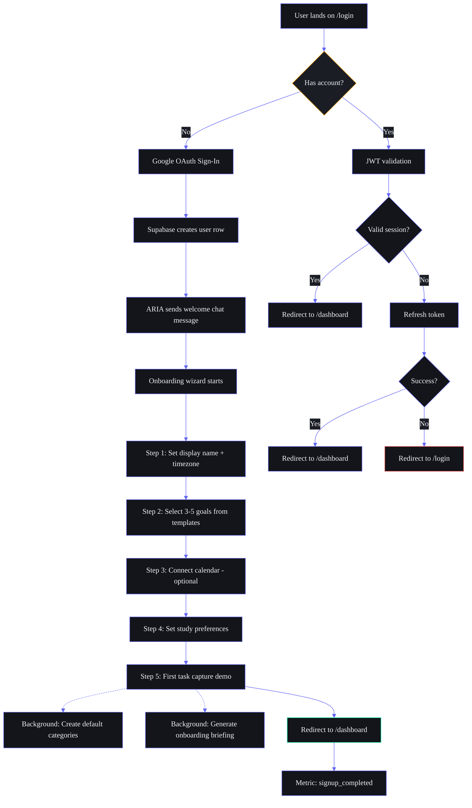
```mermaid
%%{init: {'theme': 'base', 'themeVariables': {'background': '#0A0B0F', 'primaryColor': '#13151A', 'primaryBorderColor': '#6366F1', 'primaryTextColor': '#F1F5F9', 'lineColor': '#6366F1', 'secondaryColor': '#1A1D24', 'tertiaryColor': '#0A0B0F', 'fontFamily': 'DM Sans'}}}%%
flowchart TD
    A[User lands on /login] --> B{Has account?}
    B -->|No| C[Google OAuth Sign-In]
    C --> D[Supabase creates user row]
    D --> E[ARIA sends welcome chat message]
    E --> F[Onboarding wizard starts]
    F --> G[Step 1: Set display name + timezone]
    G --> H[Step 2: Select 3-5 goals from templates]
    H --> I[Step 3: Connect calendar - optional]
    I --> J[Step 4: Set study preferences]
    J --> K[Step 5: First task capture demo]
    K -.-> L[Background: Create default categories]
    K -.-> M[Background: Generate onboarding briefing]
    K --> N[Redirect to /dashboard]
    N --> O[Metric: signup_completed]
    
    B -->|Yes| P[JWT validation]
    P --> Q{Valid session?}
    Q -->|Yes| R[Redirect to /dashboard]
    Q -->|No| S[Refresh token]
    S --> T{Success?}
    T -->|Yes| U[Redirect to /dashboard]
    T -->|No| V[Redirect to /login]
    
    style A fill:#13151A,stroke:#6366F1,color:#F1F5F9
    style B fill:#1A1D24,stroke:#F59E0B,color:#F1F5F9
    style N fill:#13151A,stroke:#00FFA3,color:#F1F5F9
    style V fill:#13151A,stroke:#EF4444,color:#F1F5F9
```

### 2.2 Profile Setup Sub-Flow

| Step | Screen | Fields | Validation | Skip Allowed? |
|---|---|---|---|---|
| 1 | Welcome | Name, Timezone, Semester | Name: 2-50 chars, Timezone: valid IANA | No |
| 2 | Goals | 5 goal templates (Study, Career, Health, Finance, Skills) | Min 1 selected | No |
| 3 | Integrations | Google Calendar toggle, Browser extension | None | Yes |
| 4 | Preferences | Study hours/day, deep work start time, focus duration | Hours: 1-12 | Yes (defaults applied) |
| 5 | First Task | Quick capture input | Min 1 char | No (enforced) |

**Edge Cases:**
- **Partial completion:** User closes browser during Step 3. On next login, resume at Step 3.
- **Timezone mismatch:** Detect via IP geolocation, allow override. If IP detection fails, default to IST (UTC+5:30).
- **Duplicate account:** Google OAuth handles this — same email = same user. Merge preferences if re-onboarding.
- **Network failure during save:** Queue changes locally, retry on reconnection. Show toast: "Your preferences will sync when you're back online."

**Error Paths:**

| Error | Detection | User Message | Recovery |
|---|---|---|---|
| OAuth failure | Supabase returns auth_error | "Unable to sign in with Google. Please try again." | Retry button + email login fallback |
| Profile save fails | API returns 500 | "We couldn't save your profile. Don't worry, we'll retry automatically." | Auto-retry 3x with exponential backoff |
| Calendar sync fails | Google API timeout | "Calendar sync failed. You can connect it later from Settings." | Skip + enable in Settings later |
| Invalid timezone | Select picks UTC | "Using UTC (Coordinated Universal Time). You can change this in Settings." | Silently fix + log warning |

**Success Metrics:**
- Onboarding completion rate: Target > 85%
- Time to complete onboarding: Target < 120 seconds
- Step-drop-off rate per step (target: < 5% per step)

---

## 3. Daily Briefing Flow

### 3.1 Morning Briefing Generation

Trigger: 7:00 AM (user's timezone) via APScheduler cron job

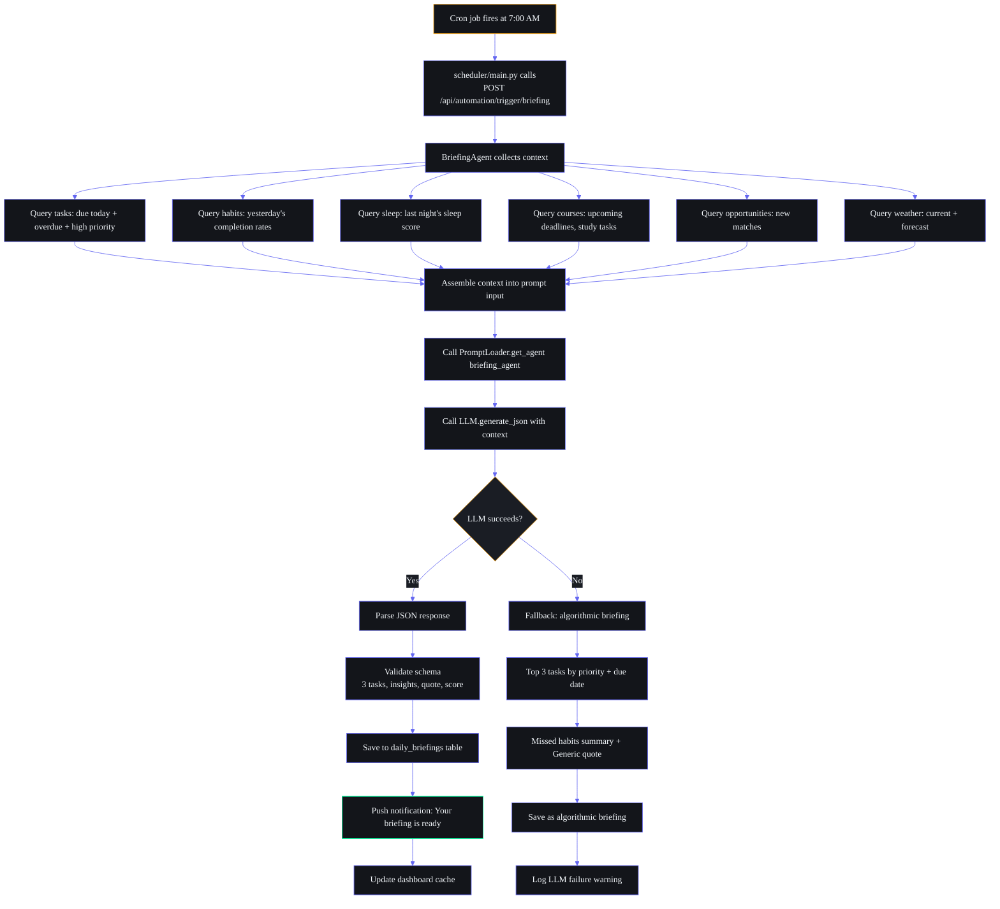
```mermaid
%%{init: {'theme': 'base', 'themeVariables': {'background': '#0A0B0F', 'primaryColor': '#13151A', 'primaryBorderColor': '#6366F1', 'primaryTextColor': '#F1F5F9', 'lineColor': '#6366F1', 'secondaryColor': '#1A1D24', 'tertiaryColor': '#0A0B0F', 'fontFamily': 'DM Sans'}}}%%
flowchart TD
    CRON[Cron job fires at 7:00 AM] --> API[scheduler/main.py calls<br/>POST /api/automation/trigger/briefing]
    API --> COLLECT[BriefingAgent collects context]
    COLLECT --> QT[Query tasks: due today + overdue + high priority]
    COLLECT --> QH[Query habits: yesterday's completion rates]
    COLLECT --> QS[Query sleep: last night's sleep score]
    COLLECT --> QC[Query courses: upcoming deadlines, study tasks]
    COLLECT --> QO[Query opportunities: new matches]
    COLLECT --> QW[Query weather: current + forecast]
    QT --> ASSEMBLE[Assemble context into prompt input]
    QH --> ASSEMBLE
    QS --> ASSEMBLE
    QC --> ASSEMBLE
    QO --> ASSEMBLE
    QW --> ASSEMBLE
    ASSEMBLE --> LOAD[Call PromptLoader.get_agent briefing_agent]
    LOAD --> LLM[Call LLM.generate_json with context]
    LLM --> SUCCESS{LLM succeeds?}
    SUCCESS -->|Yes| PARSE[Parse JSON response]
    PARSE --> VALIDATE[Validate schema<br/>3 tasks, insights, quote, score]
    VALIDATE --> SAVE[Save to daily_briefings table]
    SAVE --> PUSH[Push notification: Your briefing is ready]
    PUSH --> CACHE[Update dashboard cache]
    SUCCESS -->|No| FALLBACK[Fallback: algorithmic briefing]
    FALLBACK --> TOP[Top 3 tasks by priority + due date]
    TOP --> MISSED[Missed habits summary + Generic quote]
    MISSED --> ALGO[Save as algorithmic briefing]
    ALGO --> LOG[Log LLM failure warning]
    
    style CRON fill:#13151A,stroke:#F59E0B,color:#F1F5F9
    style LLM fill:#13151A,stroke:#818CF8,color:#F1F5F9
    style SUCCESS fill:#1A1D24,stroke:#F59E0B,color:#F1F5F9
    style PUSH fill:#13151A,stroke:#00FFA3,color:#F1F5F9
    style FALLBACK fill:#13151A,stroke:#6366F1,color:#F1F5F9
```

**Context Assembly (Input to Agent):**

```json
{
  "user_id": "uuid",
  "date": "2026-06-11",
  "tasks": {
    "overdue": [{"title": "Submit DBMS assignment", "priority": "high", "days_overdue": 2}],
    "due_today": [{"title": "Complete React tutorial", "priority": "medium"}],
    "high_priority": [{"title": "Apply to Google STEP internship", "priority": "urgent"}]
  },
  "sleep": {"score": 72, "duration_hours": 6.5, "debt_hours": 2.0},
  "habits": {"streak_current": 5, "yesterday_completed": 3, "total": 5},
  "courses": {
    "active": 3,
    "deadlines_this_week": [{"name": "NPTEL Machine Learning", "days_remaining": 4}],
    "study_tasks_today": 2
  },
  "opportunities": {"new_matches": 1, "title": "Hackathon: Build with AI"},
  "productivity_score": 68,
  "week_progress": "Wednesday — 42% through week"
}
```

**Output Schema (Briefing):**

```json
{
  "top_three": [
    {"task": "Apply to Google STEP internship", "reason": "Deadline in 3 days", "estimated_minutes": 30}
  ],
  "focus_suggestion": "Deep work block: 10 AM - 12 PM on ML project",
  "sleep_insight": "You're 2 hours behind on sleep. Consider lighter schedule today.",
  "opportunity_alert": "New: Build with AI Hackathon — apply by Friday",
  "quote": "The best time to start was yesterday. The next best time is now.",
  "morning_momentum_tip": "Start with your 5-minute task to build momentum",
  "productivity_forecast": 65
}
```

**Decision Tree: Sleep-Adjusted Briefing:**

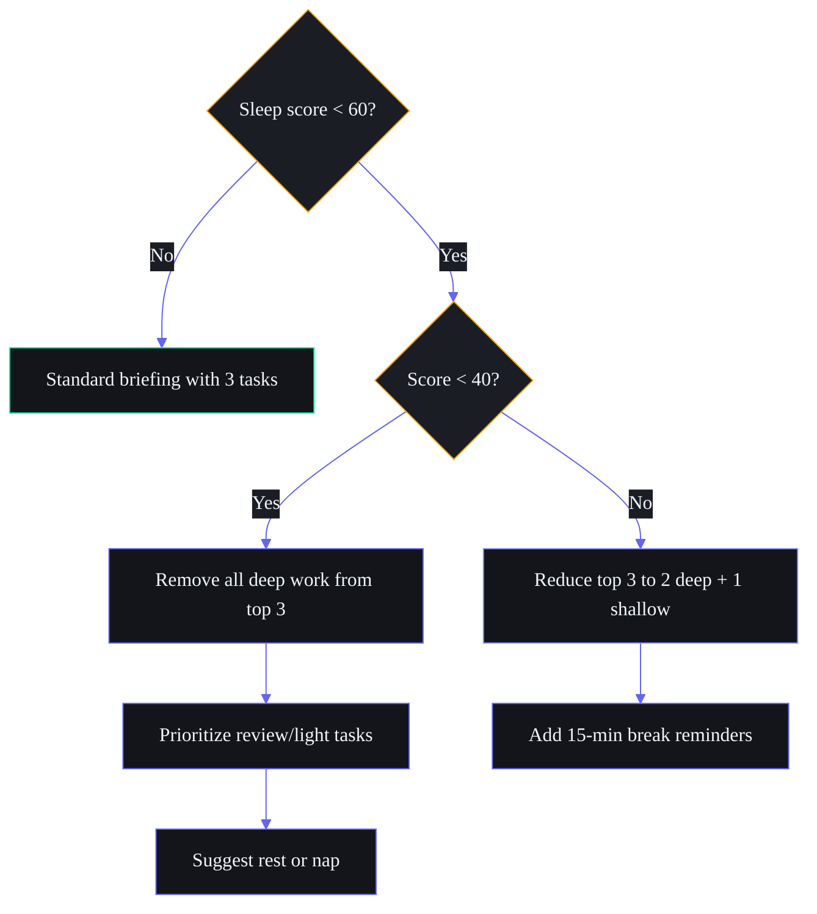
```mermaid
%%{init: {'theme': 'base', 'themeVariables': {'background': '#0A0B0F', 'primaryColor': '#13151A', 'primaryBorderColor': '#6366F1', 'primaryTextColor': '#F1F5F9', 'lineColor': '#6366F1', 'secondaryColor': '#1A1D24', 'tertiaryColor': '#0A0B0F', 'fontFamily': 'DM Sans'}}}%%
flowchart TD
    S1{Sleep score &lt; 60?}
    S1 -->|No| STD[Standard briefing with 3 tasks]
    S1 -->|Yes| S2{Score &lt; 40?}
    S2 -->|Yes| DEEP[Remove all deep work from top 3]
    DEEP --> LIGHT[Prioritize review/light tasks]
    LIGHT --> NAP[Suggest rest or nap]
    S2 -->|No| REDUCE[Reduce top 3 to 2 deep + 1 shallow]
    REDUCE --> BREAK[Add 15-min break reminders]
    
    style S1 fill:#1A1D24,stroke:#F59E0B,color:#F1F5F9
    style S2 fill:#1A1D24,stroke:#F59E0B,color:#F1F5F9
    style STD fill:#13151A,stroke:#00FFA3,color:#F1F5F9
    style DEEP fill:#13151A,stroke:#6366F1,color:#F1F5F9
    style REDUCE fill:#13151A,stroke:#818CF8,color:#F1F5F9
```

### 3.2 User Views Briefing

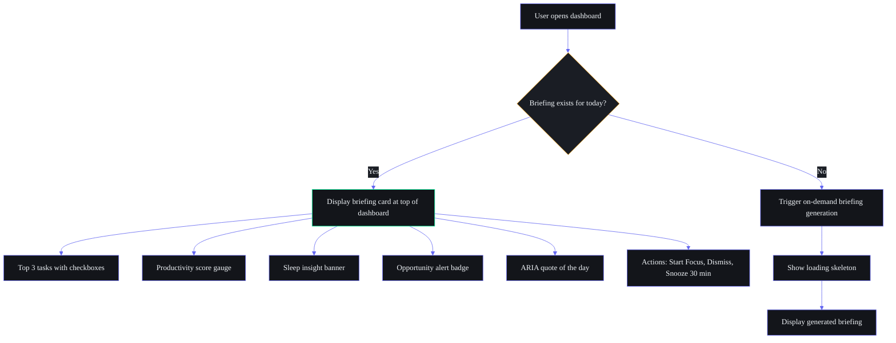
```mermaid
%%{init: {'theme': 'base', 'themeVariables': {'background': '#0A0B0F', 'primaryColor': '#13151A', 'primaryBorderColor': '#6366F1', 'primaryTextColor': '#F1F5F9', 'lineColor': '#6366F1', 'secondaryColor': '#1A1D24', 'tertiaryColor': '#0A0B0F', 'fontFamily': 'DM Sans'}}}%%
flowchart TD
    UD[User opens dashboard] --> CHECK{Briefing exists for today?}
    CHECK -->|Yes| DISP[Display briefing card at top of dashboard]
    DISP --> T3[Top 3 tasks with checkboxes]
    DISP --> PS[Productivity score gauge]
    DISP --> SI[Sleep insight banner]
    DISP --> OA[Opportunity alert badge]
    DISP --> AQ[ARIA quote of the day]
    DISP --> ACT[Actions: Start Focus, Dismiss, Snooze 30 min]
    CHECK -->|No| TRIGGER[Trigger on-demand briefing generation]
    TRIGGER --> SKEL[Show loading skeleton]
    SKEL --> GEN[Display generated briefing]
    
    style CHECK fill:#1A1D24,stroke:#F59E0B,color:#F1F5F9
    style DISP fill:#13151A,stroke:#00FFA3,color:#F1F5F9
    style TRIGGER fill:#13151A,stroke:#6366F1,color:#F1F5F9
```

**Error Paths:**

| Error | Detection | User Message | Recovery |
|---|---|---|---|
| No data for context | Empty query results | Show partial briefing with available data | Include note: "Some sections couldn't be loaded" |
| Briefing not generated | No row in daily_briefings for today | "Your briefing is being prepared..." | Trigger on-demand generation |
| LLM returns malformed JSON | JSON parse failure | Fall back to algorithmic briefing | Log error + alert admin |
| Supabase query timeout | > 5s query duration | Show cached briefing from yesterday | Retry in background |

**Success Metrics:**
- Briefing viewed within 1 hour: Target > 70%
- Top 3 tasks completion rate: Target > 60%
- Briefing generation time: Target < 8 seconds (including LLM)
- User satisfaction score: Target > 4.0/5.0 (via weekly prompt)

---

## 4. Task Creation to Completion Flow

### 4.1 Natural Language Task Creation

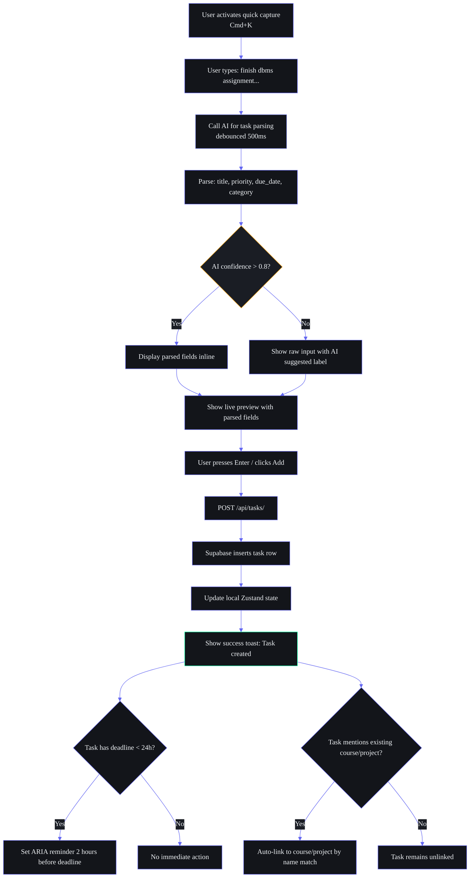
```mermaid
%%{init: {'theme': 'base', 'themeVariables': {'background': '#0A0B0F', 'primaryColor': '#13151A', 'primaryBorderColor': '#6366F1', 'primaryTextColor': '#F1F5F9', 'lineColor': '#6366F1', 'secondaryColor': '#1A1D24', 'tertiaryColor': '#0A0B0F', 'fontFamily': 'DM Sans'}}}%%
flowchart TD
    QC[User activates quick capture<br/>Cmd+K] --> TYPE[User types: finish dbms assignment...]
    TYPE --> AI[Call AI for task parsing<br/>debounced 500ms]
    AI --> PARSE[Parse: title, priority, due_date, category]
    PARSE --> CONF{AI confidence &gt; 0.8?}
    CONF -->|Yes| INLINE[Display parsed fields inline]
    CONF -->|No| RAW[Show raw input with AI suggested label]
    INLINE --> PREVIEW[Show live preview with parsed fields]
    RAW --> PREVIEW
    PREVIEW --> ADD[User presses Enter / clicks Add]
    ADD --> POST[POST /api/tasks/]
    POST --> SUPABASE[Supabase inserts task row]
    SUPABASE --> ZUSTAND[Update local Zustand state]
    ZUSTAND --> TOAST[Show success toast: Task created]
    TOAST --> DEADLINE{Task has deadline &lt; 24h?}
    DEADLINE -->|Yes| REMINDER[Set ARIA reminder 2 hours before deadline]
    DEADLINE -->|No| NOACT[No immediate action]
    TOAST --> LINK{Task mentions existing course/project?}
    LINK -->|Yes| AUTOLINK[Auto-link to course/project by name match]
    LINK -->|No| UNLINKED[Task remains unlinked]
    
    style CONF fill:#1A1D24,stroke:#F59E0B,color:#F1F5F9
    style AI fill:#13151A,stroke:#818CF8,color:#F1F5F9
    style TOAST fill:#13151A,stroke:#00FFA3,color:#F1F5F9
```

**Parsing Examples (AI Extraction):**

| Input | Title | Priority | Due Date | Category | Linked To |
|---|---|---|---|---|---|
| "finish dbms assignment by tomorrow evening high priority" | Finish DBMS assignment | High | Tomorrow 6 PM | Academics | DBMS course |
| "leetcode daily challenge" | LeetCode Daily Challenge | Medium | Today 11:59 PM | Coding | — |
| "buy groceries list milk eggs bread" | Buy groceries | Low | No date | Personal | — |
| "prepare for google interview next friday urgent" | Prepare for Google interview | Urgent | Next Friday 9 AM | Career | — |
| "review pull request for project X" | Review pull request for project X | High | No date | Projects | Project X |

### 4.2 Task Completion Flow

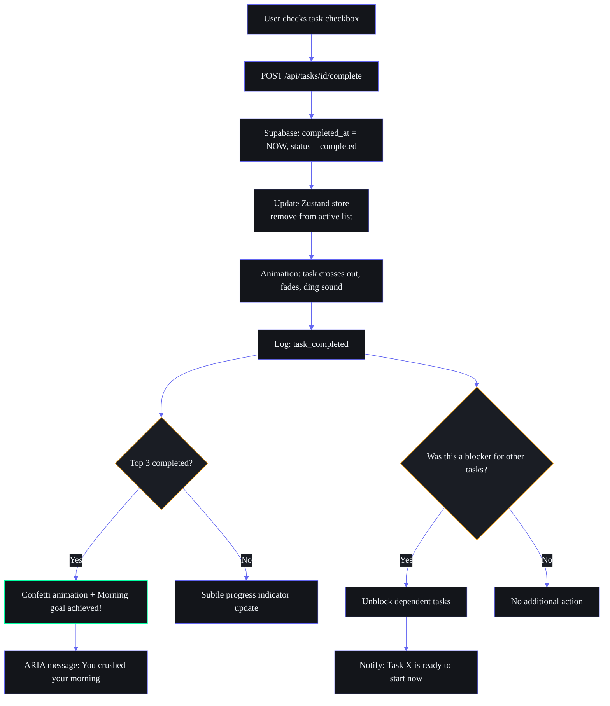
```mermaid
%%{init: {'theme': 'base', 'themeVariables': {'background': '#0A0B0F', 'primaryColor': '#13151A', 'primaryBorderColor': '#6366F1', 'primaryTextColor': '#F1F5F9', 'lineColor': '#6366F1', 'secondaryColor': '#1A1D24', 'tertiaryColor': '#0A0B0F', 'fontFamily': 'DM Sans'}}}%%
flowchart TD
    CHECK[User checks task checkbox] --> POSTC[POST /api/tasks/id/complete]
    POSTC --> SUPABASE2[Supabase: completed_at = NOW, status = completed]
    SUPABASE2 --> STORE[Update Zustand store<br/>remove from active list]
    STORE --> ANIM[Animation: task crosses out, fades, ding sound]
    ANIM --> METRIC[Log: task_completed]
    METRIC --> TOP3{Top 3 completed?}
    TOP3 -->|Yes| CONFETTI[Confetti animation + Morning goal achieved!]
    CONFETTI --> ARIA[ARIA message: You crushed your morning]
    TOP3 -->|No| PROGRESS[Subtle progress indicator update]
    METRIC --> BLOCKER{Was this a blocker for other tasks?}
    BLOCKER -->|Yes| UNBLOCK[Unblock dependent tasks]
    UNBLOCK --> NOTIFY[Notify: Task X is ready to start now]
    BLOCKER -->|No| NOACT2[No additional action]
    
    style TOP3 fill:#1A1D24,stroke:#F59E0B,color:#F1F5F9
    style BLOCKER fill:#1A1D24,stroke:#F59E0B,color:#F1F5F9
    style CONFETTI fill:#13151A,stroke:#00FFA3,color:#F1F5F9
```

### 4.3 Task Rescheduling Flow

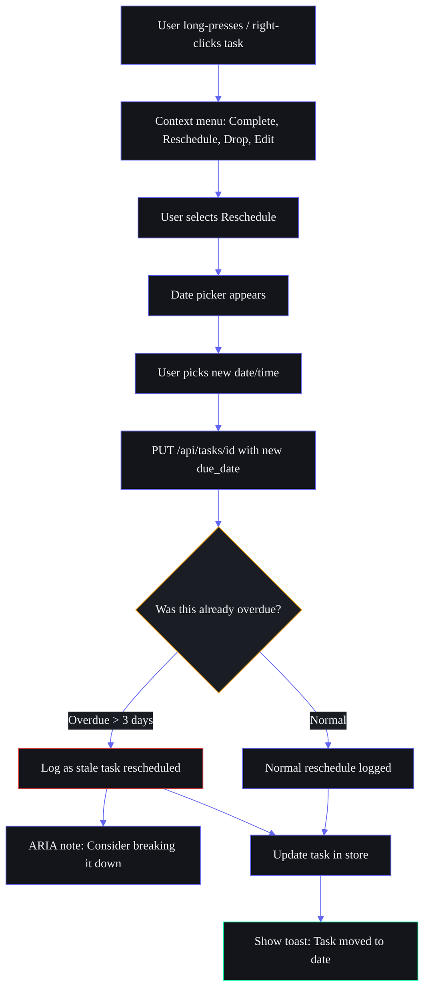
```mermaid
%%{init: {'theme': 'base', 'themeVariables': {'background': '#0A0B0F', 'primaryColor': '#13151A', 'primaryBorderColor': '#6366F1', 'primaryTextColor': '#F1F5F9', 'lineColor': '#6366F1', 'secondaryColor': '#1A1D24', 'tertiaryColor': '#0A0B0F', 'fontFamily': 'DM Sans'}}}%%
flowchart TD
    LP[User long-presses / right-clicks task] --> MENU[Context menu: Complete, Reschedule, Drop, Edit]
    MENU --> RESCHEDULE[User selects Reschedule]
    RESCHEDULE --> DATE[Date picker appears]
    DATE --> PICK[User picks new date/time]
    PICK --> PUT[PUT /api/tasks/id with new due_date]
    PUT --> OVERDUE{Was this already overdue?}
    OVERDUE -->|Overdue &gt; 3 days| STALE[Log as stale task rescheduled]
    STALE --> ARIA2[ARIA note: Consider breaking it down]
    OVERDUE -->|Normal| NORMAL[Normal reschedule logged]
    NORMAL --> UPDATE2[Update task in store]
    STALE --> UPDATE2
    UPDATE2 --> TOAST2[Show toast: Task moved to date]
    
    style OVERDUE fill:#1A1D24,stroke:#F59E0B,color:#F1F5F9
    style STALE fill:#13151A,stroke:#EF4444,color:#F1F5F9
    style TOAST2 fill:#13151A,stroke:#00FFA3,color:#F1F5F9
```

**Error Paths:**

| Error | Detection | User Message | Recovery |
|---|---|---|---|
| Save fails (network) | POST returns 500 | "Task saved offline. Will sync when connected." | Queue in IndexedDB, sync on reconnect |
| AI parsing fails | API returns no parse | "Could you be more specific? Try including what, when, and priority." | Fallback to manual field entry |
| Duplicate detection | Title similarity > 95% to active task | "A similar task already exists: '...'. Add anyway?" | Merge option or create duplicate |
| Dependency cycle detected | Task A blocks B, B blocks A | Circular dependency detected. Please adjust task links. | Highlight cycle in UI |

**Success Metrics:**
- Tasks created per day: Target > 3
- Tasks completed per day: Target > 2
- Completion rate (completed/created): Target > 60%
- Time to create task: Target < 10 seconds
- Natural language parse accuracy: Target > 90%
- Overdue task rate: Target < 20%

---

## 5. Course Tracking Flow

### 5.1 Course Registration Flow

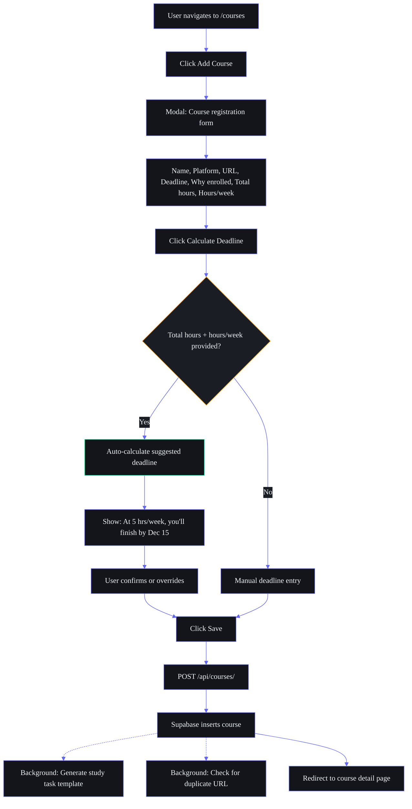
```mermaid
%%{init: {'theme': 'base', 'themeVariables': {'background': '#0A0B0F', 'primaryColor': '#13151A', 'primaryBorderColor': '#6366F1', 'primaryTextColor': '#F1F5F9', 'lineColor': '#6366F1', 'secondaryColor': '#1A1D24', 'tertiaryColor': '#0A0B0F', 'fontFamily': 'DM Sans'}}}%%
flowchart TD
    NAVC[User navigates to /courses] --> ADD[Click Add Course]
    ADD --> MODAL[Modal: Course registration form]
    MODAL --> FIELDS[Name, Platform, URL, Deadline, Why enrolled, Total hours, Hours/week]
    FIELDS --> CALC[Click Calculate Deadline]
    CALC --> CALCD{Total hours + hours/week provided?}
    CALCD -->|Yes| AUTO[Auto-calculate suggested deadline]
    AUTO --> SHOW[Show: At 5 hrs/week, you'll finish by Dec 15]
    SHOW --> CONFIRM[User confirms or overrides]
    CALCD -->|No| MANUAL[Manual deadline entry]
    CONFIRM --> SAVE[Click Save]
    MANUAL --> SAVE
    SAVE --> POSTC2[POST /api/courses/]
    POSTC2 --> INSERT[Supabase inserts course]
    INSERT -.-> BG1[Background: Generate study task template]
    INSERT -.-> BG2[Background: Check for duplicate URL]
    INSERT --> REDIRECT[Redirect to course detail page]
    
    style CALCD fill:#1A1D24,stroke:#F59E0B,color:#F1F5F9
    style AUTO fill:#13151A,stroke:#00FFA3,color:#F1F5F9
    style REDIRECT fill:#13151A,stroke:#818CF8,color:#F1F5F9
```

### 5.2 Course Progress & Deadline Warning Flow

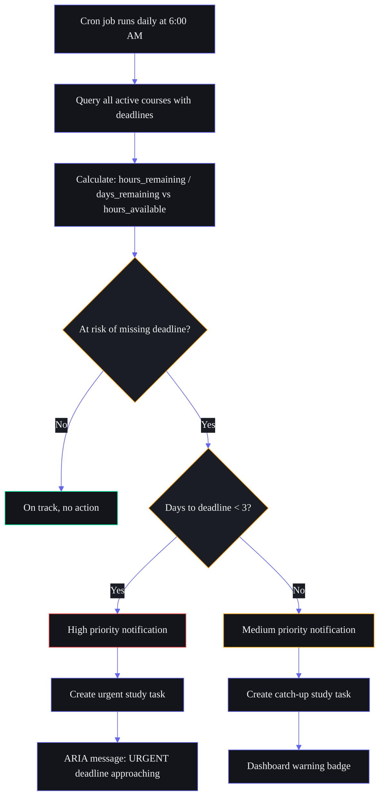
```mermaid
%%{init: {'theme': 'base', 'themeVariables': {'background': '#0A0B0F', 'primaryColor': '#13151A', 'primaryBorderColor': '#6366F1', 'primaryTextColor': '#F1F5F9', 'lineColor': '#6366F1', 'secondaryColor': '#1A1D24', 'tertiaryColor': '#0A0B0F', 'fontFamily': 'DM Sans'}}}%%
flowchart TD
    CRON2[Cron job runs daily at 6:00 AM] --> QUERY[Query all active courses with deadlines]
    QUERY --> CALC2[Calculate: hours_remaining / days_remaining vs hours_available]
    CALC2 --> RISK{At risk of missing deadline?}
    RISK -->|No| ONTRACK[On track, no action]
    RISK -->|Yes| DAYS{Days to deadline &lt; 3?}
    DAYS -->|Yes| HIGH[High priority notification]
    HIGH --> TASK1[Create urgent study task]
    TASK1 --> ARIA3[ARIA message: URGENT deadline approaching]
    DAYS -->|No| MED[Medium priority notification]
    MED --> TASK2[Create catch-up study task]
    TASK2 --> BADGE[Dashboard warning badge]
    
    style RISK fill:#1A1D24,stroke:#F59E0B,color:#F1F5F9
    style DAYS fill:#1A1D24,stroke:#F59E0B,color:#F1F5F9
    style HIGH fill:#13151A,stroke:#EF4444,color:#F1F5F9
    style MED fill:#13151A,stroke:#F59E0B,color:#F1F5F9
    style ONTRACK fill:#13151A,stroke:#00FFA3,color:#F1F5F9
```

**Progress Calculation:**

```
completion_pct = (hours_completed / total_hours) * 100
pace_needed = hours_remaining / days_remaining
pace_actual = avg_hours_per_day_last_7_days
on_track = pace_actual >= pace_needed
```

**Error Paths:**

| Error | Detection | User Message | Recovery |
|---|---|---|---|
| Duplicate course detected | Same URL + active status | "You already registered this course on [date]. Track it? Or add a different one?" | Merge or confirm duplicate |
| Deadline passed without mark | deadline < today, status != completed | "Your deadline for [course] passed. Update your progress?" | Update progress or extend deadline |
| Progress > 100% | hours_completed > total_hours | Progress capped at 100%. Course marked for completion review. | Auto-cap at 100%, prompt completion |

**Success Metrics:**
- Courses registered per user: Target > 3
- Course completion rate: Target > 60%
- Daily study tasks completed: Target > 80%
- Deadline miss rate: Target < 15%

---

## 6. Habit Logging Flow

### 6.1 Daily Habit Check-In

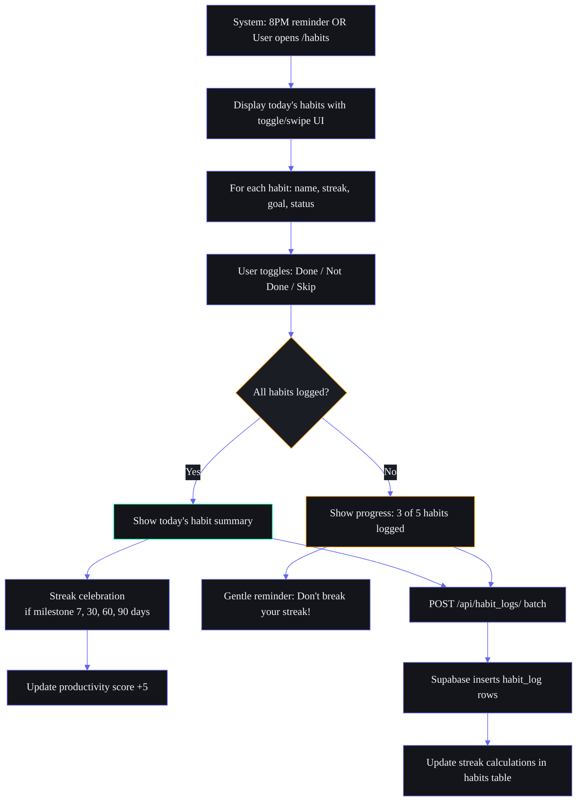
```mermaid
%%{init: {'theme': 'base', 'themeVariables': {'background': '#0A0B0F', 'primaryColor': '#13151A', 'primaryBorderColor': '#6366F1', 'primaryTextColor': '#F1F5F9', 'lineColor': '#6366F1', 'secondaryColor': '#1A1D24', 'tertiaryColor': '#0A0B0F', 'fontFamily': 'DM Sans'}}}%%
flowchart TD
    TRIGGER[System: 8PM reminder OR User opens /habits] --> DISPLAY[Display today's habits with toggle/swipe UI]
    DISPLAY --> SHOW[For each habit: name, streak, goal, status]
    SHOW --> TOGGLE[User toggles: Done / Not Done / Skip]
    TOGGLE --> ALL{All habits logged?}
    ALL -->|Yes| SUMMARY[Show today's habit summary]
    SUMMARY --> STREAK[Streak celebration<br/>if milestone 7, 30, 60, 90 days]
    STREAK --> SCORE[Update productivity score +5]
    ALL -->|No| PROG[Show progress: 3 of 5 habits logged]
    PROG --> REMIND[Gentle reminder: Don't break your streak!]
    SUMMARY --> POSTB[POST /api/habit_logs/ batch]
    PROG --> POSTB
    POSTB --> INSERTB[Supabase inserts habit_log rows]
    INSERTB --> UPDATESTREAK[Update streak calculations in habits table]
    
    style ALL fill:#1A1D24,stroke:#F59E0B,color:#F1F5F9
    style SUMMARY fill:#13151A,stroke:#00FFA3,color:#F1F5F9
    style PROG fill:#13151A,stroke:#F59E0B,color:#F1F5F9
```

### 6.2 Habit Streak Calculation

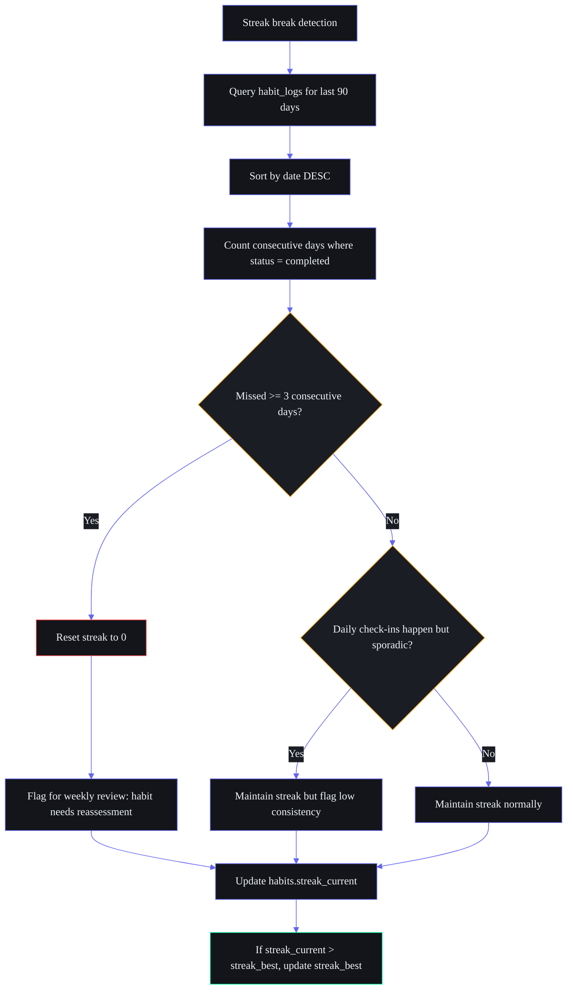
```mermaid
%%{init: {'theme': 'base', 'themeVariables': {'background': '#0A0B0F', 'primaryColor': '#13151A', 'primaryBorderColor': '#6366F1', 'primaryTextColor': '#F1F5F9', 'lineColor': '#6366F1', 'secondaryColor': '#1A1D24', 'tertiaryColor': '#0A0B0F', 'fontFamily': 'DM Sans'}}}%%
flowchart TD
    START[Streak break detection] --> QUERYH[Query habit_logs for last 90 days]
    QUERYH --> SORT[Sort by date DESC]
    SORT --> COUNT[Count consecutive days where status = completed]
    COUNT --> MISSED{Missed &gt;= 3 consecutive days?}
    MISSED -->|Yes| RESET[Reset streak to 0]
    RESET --> FLAG[Flag for weekly review: habit needs reassessment]
    MISSED -->|No| SPORADIC{Daily check-ins happen but sporadic?}
    SPORADIC -->|Yes| MAINTAIN[Maintain streak but flag low consistency]
    SPORADIC -->|No| NORMAL2[Maintain streak normally]
    MAINTAIN --> UPDATEH[Update habits.streak_current]
    FLAG --> UPDATEH
    NORMAL2 --> UPDATEH
    UPDATEH --> BEST[If streak_current &gt; streak_best, update streak_best]
    
    style MISSED fill:#1A1D24,stroke:#F59E0B,color:#F1F5F9
    style SPORADIC fill:#1A1D24,stroke:#F59E0B,color:#F1F5F9
    style RESET fill:#13151A,stroke:#EF4444,color:#F1F5F9
    style BEST fill:#13151A,stroke:#00FFA3,color:#F1F5F9
```

**Error Paths:**

| Error | Detection | User Message | Recovery |
|---|---|---|---|
| Duplicate log (same date) | Unique constraint violation | "Today's habit was already logged. It's been updated." | Update existing record |
| Missed habit notification | No log by 10 PM | "You haven't logged [habit] today. Quick check-in?" | Push notification + badge |
| Streak data inconsistency | streak_current != calculated | "Your streak has been recalculated. Check your habit history." | Recalculate from logs |

**Success Metrics:**
- Habits logged per day: Target > 80% of defined habits
- 7-day streak achievement rate: Target > 50%
- 30-day streak achievement rate: Target > 20%
- Habit abandonment rate: Target < 15% (reactivated > 7 days idle)

---

## 7. Weekly Review Flow

### 7.1 Automated Weekly Review Generation

Trigger: Sunday 8:00 PM user timezone via APScheduler

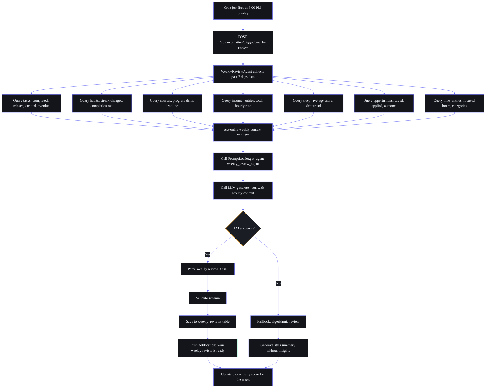
```mermaid
%%{init: {'theme': 'base', 'themeVariables': {'background': '#0A0B0F', 'primaryColor': '#13151A', 'primaryBorderColor': '#6366F1', 'primaryTextColor': '#F1F5F9', 'lineColor': '#6366F1', 'secondaryColor': '#1A1D24', 'tertiaryColor': '#0A0B0F', 'fontFamily': 'DM Sans'}}}%%
flowchart TD
    CRON3[Cron job fires at 8:00 PM Sunday] --> POSTW[POST /api/automation/trigger/weekly-review]
    POSTW --> COLLECTW[WeeklyReviewAgent collects past 7 days data]
    COLLECTW --> QTW[Query tasks: completed, missed, created, overdue]
    COLLECTW --> QHW[Query habits: streak changes, completion rate]
    COLLECTW --> QCW[Query courses: progress delta, deadlines]
    COLLECTW --> QIW[Query income: entries, total, hourly rate]
    COLLECTW --> QSW[Query sleep: average score, debt trend]
    COLLECTW --> QOW[Query opportunities: saved, applied, outcome]
    COLLECTW --> QTI[Query time_entries: focused hours, categories]
    QTW --> ASSEMBLEW[Assemble weekly context window]
    QHW --> ASSEMBLEW
    QCW --> ASSEMBLEW
    QIW --> ASSEMBLEW
    QSW --> ASSEMBLEW
    QOW --> ASSEMBLEW
    QTI --> ASSEMBLEW
    ASSEMBLEW --> LOADW[Call PromptLoader.get_agent weekly_review_agent]
    LOADW --> LLMW[Call LLM.generate_json with weekly context]
    LLMW --> SUCCESSW{LLM succeeds?}
    SUCCESSW -->|Yes| PARSEW[Parse weekly review JSON]
    PARSEW --> VALIDATEW[Validate schema]
    VALIDATEW --> SAVEW[Save to weekly_reviews table]
    SAVEW --> PUSHW[Push notification: Your weekly review is ready]
    SUCCESSW -->|No| FALLBACKW[Fallback: algorithmic review]
    FALLBACKW --> STATS[Generate stats summary without insights]
    PUSHW --> SCOREW[Update productivity score for the week]
    STATS --> SCOREW
    
    style SUCCESSW fill:#1A1D24,stroke:#F59E0B,color:#F1F5F9
    style PUSHW fill:#13151A,stroke:#00FFA3,color:#F1F5F9
    style FALLBACKW fill:#13151A,stroke:#818CF8,color:#F1F5F9
    style SCOREW fill:#13151A,stroke:#6366F1,color:#F1F5F9
```

**Output Schema (Weekly Review):**

```json
{
  "week_overview": "Strong week — completed 12 of 18 planned tasks (67%)",
  "wins": ["Completed DBMS project milestone", "5-day coding streak"],
  "improvements": ["Sleep debt increased by 4 hours", "Missed 2 habit check-ins"],
  "patterns": [
    {"pattern": "Low productivity on Wednesdays", "suggestion": "Schedule lighter tasks on Wednesdays"}
  ],
  "focus_next_week": "Prioritize ML course — deadline in 10 days",
  "metric_changes": {
    "productivity_score": {"previous": 65, "current": 72, "change": "+7"},
    "sleep_avg": {"previous": 7.2, "current": 6.1, "change": "-1.1"},
    "tasks_completed": {"previous": 9, "current": 12, "change": "+3"},
    "habit_completion": {"previous": "83%", "current": "76%", "change": "-7%"},
    "focus_hours": {"previous": 18.5, "current": 22, "change": "+3.5"}
  },
  "achievements": [
    {"title": "10-day coding streak", "icon": "fire", "unlocked": true}
  ],
  "next_week_goals": [
    {"goal": "Complete ML course module 5-8", "priority": "high"},
    {"goal": "Sleep 7+ hours every night", "priority": "high"}
  ],
  "weekly_score": 72
}
```

**Decision Tree: Low Score Intervention:**

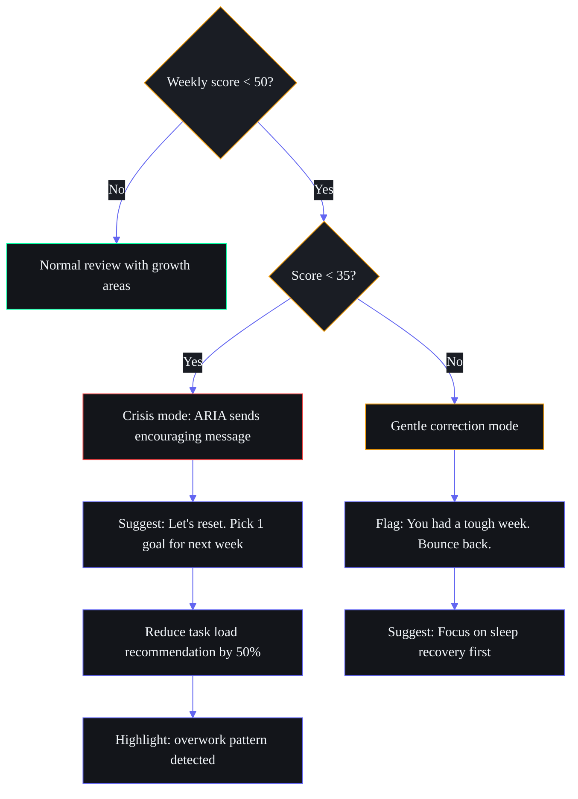
```mermaid
%%{init: {'theme': 'base', 'themeVariables': {'background': '#0A0B0F', 'primaryColor': '#13151A', 'primaryBorderColor': '#6366F1', 'primaryTextColor': '#F1F5F9', 'lineColor': '#6366F1', 'secondaryColor': '#1A1D24', 'tertiaryColor': '#0A0B0F', 'fontFamily': 'DM Sans'}}}%%
flowchart TD
    WS{Weekly score &lt; 50?}
    WS -->|No| NORMALR[Normal review with growth areas]
    WS -->|Yes| WS2{Score &lt; 35?}
    WS2 -->|Yes| CRISIS[Crisis mode: ARIA sends encouraging message]
    CRISIS --> RESET[Suggest: Let's reset. Pick 1 goal for next week]
    RESET --> REDUCE2[Reduce task load recommendation by 50%]
    REDUCE2 --> OVERWORK[Highlight: overwork pattern detected]
    WS2 -->|No| GENTLE[Gentle correction mode]
    GENTLE --> FLAG2[Flag: You had a tough week. Bounce back.]
    FLAG2 --> SLEEPF[Suggest: Focus on sleep recovery first]
    
    style WS fill:#1A1D24,stroke:#F59E0B,color:#F1F5F9
    style WS2 fill:#1A1D24,stroke:#F59E0B,color:#F1F5F9
    style CRISIS fill:#13151A,stroke:#EF4444,color:#F1F5F9
    style NORMALR fill:#13151A,stroke:#00FFA3,color:#F1F5F9
    style GENTLE fill:#13151A,stroke:#F59E0B,color:#F1F5F9
```

**Success Metrics:**
- Weekly reviews viewed: Target > 60% of users
- Action items completed from review: Target > 40%
- Score accuracy (self-reported vs calculated): Target > 85%

---

## 8. Chat with ARIA Flow

### 8.1 User Initiates Chat

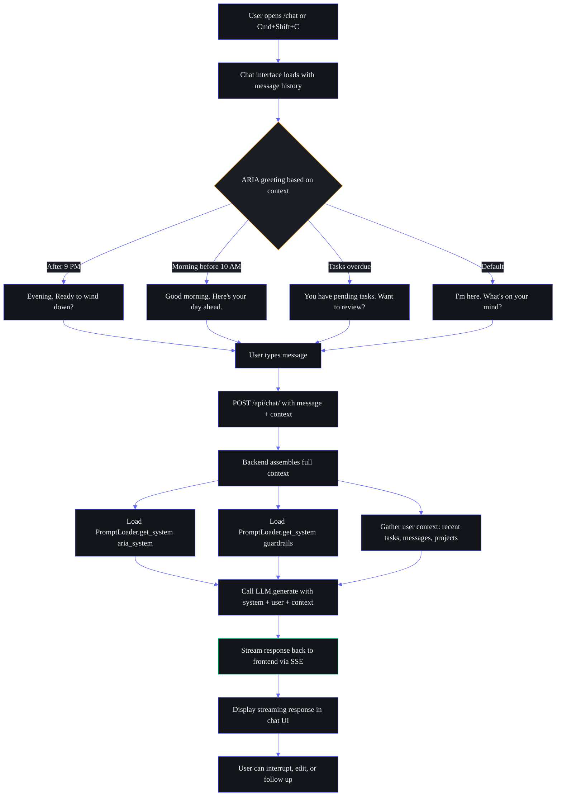
```mermaid
%%{init: {'theme': 'base', 'themeVariables': {'background': '#0A0B0F', 'primaryColor': '#13151A', 'primaryBorderColor': '#6366F1', 'primaryTextColor': '#F1F5F9', 'lineColor': '#6366F1', 'secondaryColor': '#1A1D24', 'tertiaryColor': '#0A0B0F', 'fontFamily': 'DM Sans'}}}%%
flowchart TD
    UC[User opens /chat or Cmd+Shift+C] --> LOADCHAT[Chat interface loads with message history]
    LOADCHAT --> GREET{ARIA greeting based on context}
    GREET -->|After 9 PM| WIND[Evening. Ready to wind down?]
    GREET -->|Morning before 10 AM| GOOD[Good morning. Here's your day ahead.]
    GREET -->|Tasks overdue| PENDING[You have pending tasks. Want to review?]
    GREET -->|Default| HERE[I'm here. What's on your mind?]
    WIND --> TYPE2[User types message]
    GOOD --> TYPE2
    PENDING --> TYPE2
    HERE --> TYPE2
    TYPE2 --> POSTCHAT[POST /api/chat/ with message + context]
    POSTCHAT --> BACKEND[Backend assembles full context]
    BACKEND --> LOADARIA[Load PromptLoader.get_system aria_system]
    BACKEND --> LOADGUARD[Load PromptLoader.get_system guardrails]
    BACKEND --> GATHER[Gather user context: recent tasks, messages, projects]
    LOADARIA --> CALLGEN[Call LLM.generate with system + user + context]
    LOADGUARD --> CALLGEN
    GATHER --> CALLGEN
    CALLGEN --> STREAM[Stream response back to frontend via SSE]
    STREAM --> DISPLAY2[Display streaming response in chat UI]
    DISPLAY2 --> INTERACT[User can interrupt, edit, or follow up]
    
    style GREET fill:#1A1D24,stroke:#F59E0B,color:#F1F5F9
    style BACKEND fill:#13151A,stroke:#6366F1,color:#F1F5F9
    style CALLGEN fill:#13151A,stroke:#818CF8,color:#F1F5F9
    style STREAM fill:#13151A,stroke:#00FFA3,color:#F1F5F9
```

### 8.2 Intent Classification (ARIA Router)

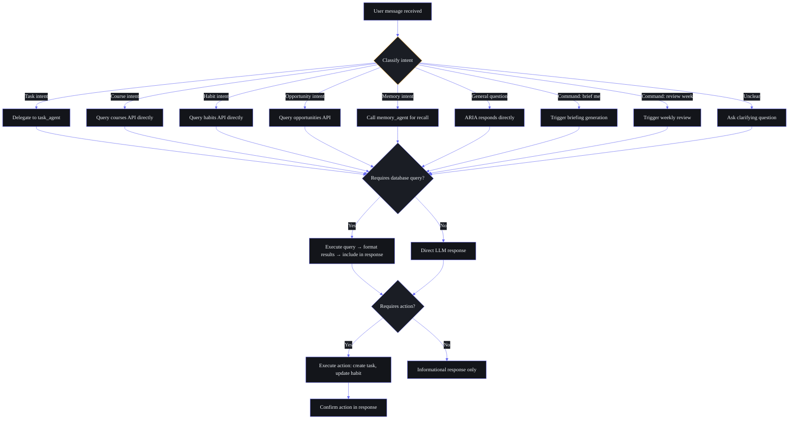
```mermaid
%%{init: {'theme': 'base', 'themeVariables': {'background': '#0A0B0F', 'primaryColor': '#13151A', 'primaryBorderColor': '#6366F1', 'primaryTextColor': '#F1F5F9', 'lineColor': '#6366F1', 'secondaryColor': '#1A1D24', 'tertiaryColor': '#0A0B0F', 'fontFamily': 'DM Sans'}}}%%
flowchart TD
    MSG[User message received] --> CLASSIFY{Classify intent}
    CLASSIFY -->|Task intent| TASK[Delegate to task_agent]
    CLASSIFY -->|Course intent| COURSEQ[Query courses API directly]
    CLASSIFY -->|Habit intent| HABITQ[Query habits API directly]
    CLASSIFY -->|Opportunity intent| OPPQ[Query opportunities API]
    CLASSIFY -->|Memory intent| MEMORY[Call memory_agent for recall]
    CLASSIFY -->|General question| DIRECT[ARIA responds directly]
    CLASSIFY -->|Command: brief me| BRIEF[Trigger briefing generation]
    CLASSIFY -->|Command: review week| REVIEW2[Trigger weekly review]
    CLASSIFY -->|Unclear| CLARIFY[Ask clarifying question]
    TASK --> DBQ{Requires database query?}
    COURSEQ --> DBQ
    HABITQ --> DBQ
    OPPQ --> DBQ
    MEMORY --> DBQ
    DIRECT --> DBQ
    BRIEF --> DBQ
    REVIEW2 --> DBQ
    CLARIFY --> DBQ
    DBQ -->|Yes| EXECUTE[Execute query → format results → include in response]
    DBQ -->|No| LLM2[Direct LLM response]
    EXECUTE --> ACTQ{Requires action?}
    LLM2 --> ACTQ
    ACTQ -->|Yes| ACTION2[Execute action: create task, update habit]
    ACTION2 --> CONFIRMA[Confirm action in response]
    ACTQ -->|No| INFOResp[Informational response only]
    
    style CLASSIFY fill:#1A1D24,stroke:#F59E0B,color:#F1F5F9
    style DBQ fill:#1A1D24,stroke:#6366F1,color:#F1F5F9
    style ACTQ fill:#1A1D24,stroke:#6366F1,color:#F1F5F9
```

**Error Paths:**

| Error | Detection | User Message | Recovery |
|---|---|---|---|
| LLM timeout | No response in 30s | "I'm thinking... just a moment longer." | Retry once, then escalate |
| LLM hallucination | Guardrail violation | Response filtered, fallback: "Let me check my data instead." | Query database directly |
| Context overflow | Tokens > context window | Truncate old messages from context | Keep last 20 messages + summary of earlier |
| API failure (Supabase down) | Supabase returns 503 | "My memory is having trouble. I'll use what I remember." | Use cached context, retry |

**Success Metrics:**
- Messages per session: Target > 4
- Session completion rate: Target > 70% (user gets answer)
- Intent classification accuracy: Target > 92%
- Response time: Target < 3 seconds
- User satisfaction (thumbs up/down): Target > 85% positive

---

## 9. Opportunity Discovery Flow

### 9.1 Opportunity Radar Daily Scan

Trigger: 6:00 AM daily via APScheduler

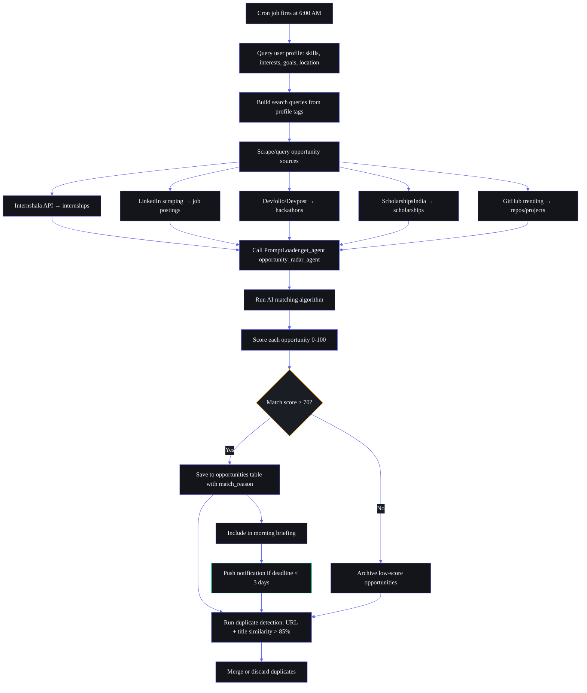
```mermaid
%%{init: {'theme': 'base', 'themeVariables': {'background': '#0A0B0F', 'primaryColor': '#13151A', 'primaryBorderColor': '#6366F1', 'primaryTextColor': '#F1F5F9', 'lineColor': '#6366F1', 'secondaryColor': '#1A1D24', 'tertiaryColor': '#0A0B0F', 'fontFamily': 'DM Sans'}}}%%
flowchart TD
    C6[Cron job fires at 6:00 AM] --> PROFILE[Query user profile: skills, interests, goals, location]
    PROFILE --> BUILDQ[Build search queries from profile tags]
    BUILDQ --> SCRAPE[Scrape/query opportunity sources]
    SCRAPE --> IS[Internshala API → internships]
    SCRAPE --> LI[LinkedIn scraping → job postings]
    SCRAPE --> DEV[Devfolio/Devpost → hackathons]
    SCRAPE --> SI2[ScholarshipsIndia → scholarships]
    SCRAPE --> GH[GitHub trending → repos/projects]
    IS --> LOADOPP[Call PromptLoader.get_agent opportunity_radar_agent]
    LI --> LOADOPP
    DEV --> LOADOPP
    SI2 --> LOADOPP
    GH --> LOADOPP
    LOADOPP --> MATCH[Run AI matching algorithm]
    MATCH --> SCORE[Score each opportunity 0-100]
    SCORE --> THRESH{Match score &gt; 70?}
    THRESH -->|Yes| SAVEOPP[Save to opportunities table with match_reason]
    SAVEOPP --> BRIEF2[Include in morning briefing]
    BRIEF2 --> PUSHNOTIF[Push notification if deadline &lt; 3 days]
    THRESH -->|No| ARCHIVE[Archive low-score opportunities]
    SAVEOPP --> DUPE[Run duplicate detection: URL + title similarity &gt; 85%]
    PUSHNOTIF --> DUPE
    ARCHIVE --> DUPE
    DUPE --> MERGE[Merge or discard duplicates]
    
    style THRESH fill:#1A1D24,stroke:#F59E0B,color:#F1F5F9
    style MATCH fill:#13151A,stroke:#818CF8,color:#F1F5F9
    style PUSHNOTIF fill:#13151A,stroke:#00FFA3,color:#F1F5F9
```

### 9.2 User Applies to Opportunity

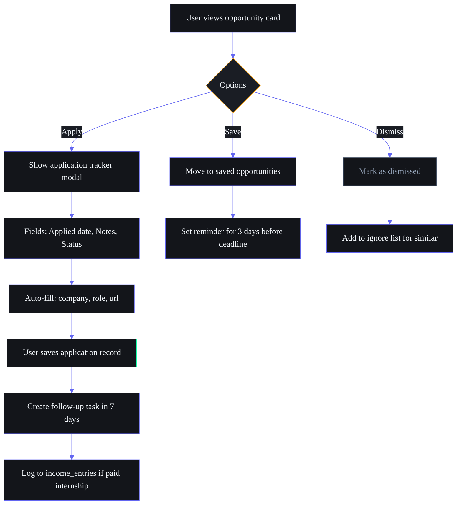
```mermaid
%%{init: {'theme': 'base', 'themeVariables': {'background': '#0A0B0F', 'primaryColor': '#13151A', 'primaryBorderColor': '#6366F1', 'primaryTextColor': '#F1F5F9', 'lineColor': '#6366F1', 'secondaryColor': '#1A1D24', 'tertiaryColor': '#0A0B0F', 'fontFamily': 'DM Sans'}}}%%
flowchart TD
    VIEW[User views opportunity card] --> OPTIONS{Options}
    OPTIONS -->|Apply| MODAL2[Show application tracker modal]
    MODAL2 --> FIELDS2[Fields: Applied date, Notes, Status]
    FIELDS2 --> AUTOFILL[Auto-fill: company, role, url]
    AUTOFILL --> SAVEAPP[User saves application record]
    SAVEAPP --> FOLLOWUP[Create follow-up task in 7 days]
    FOLLOWUP --> LOGINC[Log to income_entries if paid internship]
    OPTIONS -->|Save| SAVEOP[Move to saved opportunities]
    SAVEOP --> REMINDER2[Set reminder for 3 days before deadline]
    OPTIONS -->|Dismiss| DISMISS[Mark as dismissed]
    DISMISS --> IGNORE[Add to ignore list for similar]
    
    style OPTIONS fill:#1A1D24,stroke:#F59E0B,color:#F1F5F9
    style SAVEAPP fill:#13151A,stroke:#00FFA3,color:#F1F5F9
    style DISMISS fill:#13151A,stroke:#334155,color:#94A3B8
```

**Error Paths:**

| Error | Detection | User Message | Recovery |
|---|---|---|---|
| No sources reachable | All APIs timeout | "Couldn't scan today. Will retry in 6 hours." | Retry at noon |
| Match score too low | All scores < 50 | "No strong matches today. I'll keep watching." | Reduce threshold temporarily |
| Duplicate opportunity | Same URL already saved | "You already saved this on [date]. Check your applications page." | Open existing record |
| Application link broken | URL returns 404 | "The application link may be expired. Let me search for alternatives." | Manual search suggestion |

**Success Metrics:**
- Opportunities surfaced per week: Target > 5
- User applies to > 1 opportunity/week: Target > 40%
- Match-to-application rate: Target > 20%
- Opportunity source coverage: Target > 5 sources

---

## 10. Income Tracking Flow

### 10.1 Income Entry Flow

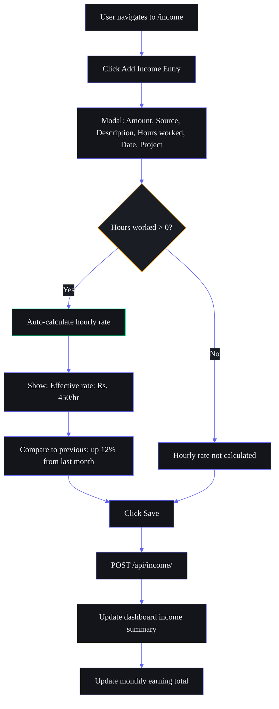
```mermaid
%%{init: {'theme': 'base', 'themeVariables': {'background': '#0A0B0F', 'primaryColor': '#13151A', 'primaryBorderColor': '#6366F1', 'primaryTextColor': '#F1F5F9', 'lineColor': '#6366F1', 'secondaryColor': '#1A1D24', 'tertiaryColor': '#0A0B0F', 'fontFamily': 'DM Sans'}}}%%
flowchart TD
    NAVI2[User navigates to /income] --> ADDINC[Click Add Income Entry]
    ADDINC --> MODAL3[Modal: Amount, Source, Description, Hours worked, Date, Project]
    MODAL3 --> HOURSQ{Hours worked &gt; 0?}
    HOURSQ -->|Yes| CALCRATE[Auto-calculate hourly rate]
    CALCRATE --> SHOWRATE[Show: Effective rate: Rs. 450/hr]
    SHOWRATE --> COMPARE[Compare to previous: up 12% from last month]
    HOURSQ -->|No| NORATE[Hourly rate not calculated]
    COMPARE --> SAVEI[Click Save]
    NORATE --> SAVEI
    SAVEI --> POSTI[POST /api/income/]
    POSTI --> DASHI[Update dashboard income summary]
    DASHI --> MONTHLY[Update monthly earning total]
    
    style HOURSQ fill:#1A1D24,stroke:#F59E0B,color:#F1F5F9
    style CALCRATE fill:#13151A,stroke:#00FFA3,color:#F1F5F9
    style MONTHLY fill:#13151A,stroke:#818CF8,color:#F1F5F9
```

**Success Metrics:**
- Income entries per month: Target > 4
- Monthly income tracked: Target > Rs. 5,000 average
- Hourly rate trend visibility: Target > 80% entries have hours

---

## 11. Cross-Module Flows

### 11.1 Flow: Idea → Project → Task → Income

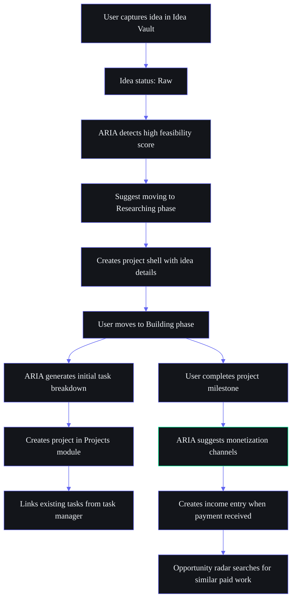
```mermaid
%%{init: {'theme': 'base', 'themeVariables': {'background': '#0A0B0F', 'primaryColor': '#13151A', 'primaryBorderColor': '#6366F1', 'primaryTextColor': '#F1F5F9', 'lineColor': '#6366F1', 'secondaryColor': '#1A1D24', 'tertiaryColor': '#0A0B0F', 'fontFamily': 'DM Sans'}}}%%
flowchart TD
    CAPTURE[User captures idea in Idea Vault] --> RAW[Idea status: Raw]
    RAW --> DETECT[ARIA detects high feasibility score]
    DETECT --> SUGGESTM[Suggest moving to Researching phase]
    SUGGESTM --> SHELL[Creates project shell with idea details]
    SHELL --> BUILD2[User moves to Building phase]
    BUILD2 --> BREAKDOWN[ARIA generates initial task breakdown]
    BREAKDOWN --> PROJECTS2[Creates project in Projects module]
    PROJECTS2 --> LINKE[Links existing tasks from task manager]
    BUILD2 --> MILESTONE[User completes project milestone]
    MILESTONE --> MONETIZE[ARIA suggests monetization channels]
    MONETIZE --> INCOME2[Creates income entry when payment received]
    INCOME2 --> RADAR[Opportunity radar searches for similar paid work]
    
    style CAPTURE fill:#13151A,stroke:#6366F1,color:#F1F5F9
    style DETECT fill:#13151A,stroke:#818CF8,color:#F1F5F9
    style MONETIZE fill:#13151A,stroke:#00FFA3,color:#F1F5F9
```

### 11.2 Flow: Course → Sleep → Productivity Correlation

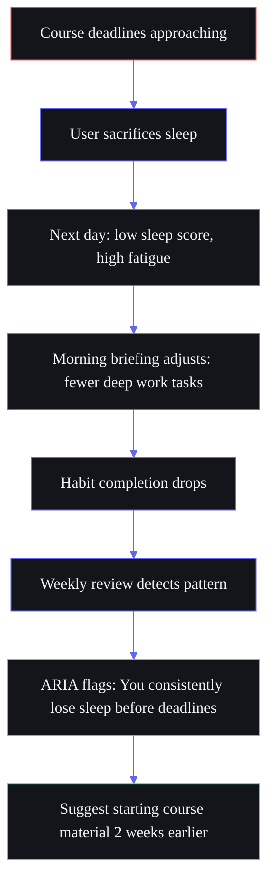
```mermaid
%%{init: {'theme': 'base', 'themeVariables': {'background': '#0A0B0F', 'primaryColor': '#13151A', 'primaryBorderColor': '#6366F1', 'primaryTextColor': '#F1F5F9', 'lineColor': '#6366F1', 'secondaryColor': '#1A1D24', 'tertiaryColor': '#0A0B0F', 'fontFamily': 'DM Sans'}}}%%
flowchart TD
    DEAD[Course deadlines approaching] --> SACRIFICE[User sacrifices sleep]
    SACRIFICE --> NEXT[Next day: low sleep score, high fatigue]
    NEXT --> ADJUST[Morning briefing adjusts: fewer deep work tasks]
    ADJUST --> HABITDROP[Habit completion drops]
    HABITDROP --> DETECT2[Weekly review detects pattern]
    DETECT2 --> FLAG3[ARIA flags: You consistently lose sleep before deadlines]
    FLAG3 --> SUGGEST2[Suggest starting course material 2 weeks earlier]
    
    style DEAD fill:#13151A,stroke:#EF4444,color:#F1F5F9
    style FLAG3 fill:#13151A,stroke:#F59E0B,color:#F1F5F9
    style SUGGEST2 fill:#13151A,stroke:#00FFA3,color:#F1F5F9
```

### 11.3 Flow: Opportunity → Application → Prep Tasks

```mermaid
%%{init: {'theme': 'base', 'themeVariables': {'background': '#0A0B0F', 'primaryColor': '#13151A', 'primaryBorderColor': '#6366F1', 'primaryTextColor': '#F1F5F9', 'lineColor': '#6366F1', 'secondaryColor': '#1A1D24', 'tertiaryColor': '#0A0B0F', 'fontFamily': 'DM Sans'}}}%%
flowchart TD
    MATCH2[Opportunity radar matches internship] --> APPLY2[User applies]
    APPLY2 --> TRACKER[Auto-creates application tracker]
    TRACKER --> PREPT[Generates preparation tasks]
    PREPT --> TASK3[Research company background<br/>due 3 days before interview]
    PREPT --> TASK4[Practice technical interview questions<br/>on LeetCode - recurring]
    PREPT --> TASK5[Prepare portfolio/examples<br/>due 1 week before]
    PREPT --> RESOURCE2[Suggest relevant saved resources from library]
    
    style MATCH2 fill:#13151A,stroke:#818CF8,color:#F1F5F9
    style PREPT fill:#13151A,stroke:#6366F1,color:#F1F5F9
    style RESOURCE2 fill:#13151A,stroke:#00FFA3,color:#F1F5F9
```

---

## 12. Error Recovery Flows

### 12.1 Network Offline Flow

```mermaid
%%{init: {'theme': 'base', 'themeVariables': {'background': '#0A0B0F', 'primaryColor': '#13151A', 'primaryBorderColor': '#6366F1', 'primaryTextColor': '#F1F5F9', 'lineColor': '#6366F1', 'secondaryColor': '#1A1D24', 'tertiaryColor': '#0A0B0F', 'fontFamily': 'DM Sans'}}}%%
flowchart TD
    OFFLINE[Network connectivity lost<br/>navigator.onLine = false] --> BADGE2[Show offline indicator badge]
    BADGE2 --> QUEUE[Queue all writes to IndexedDB]
    QUEUE --> CACHE2[Continue reading cached data]
    CACHE2 --> ALGO2[Switch to algorithmic mode for AI features]
    ALGO2 --> RESTORE{Network restored?}
    RESTORE -->|Yes| SYNC[Sync queued writes to Supabase]
    SYNC --> RESOLVE[Resolve conflicts<br/>last-write-wins]
    RESOLVE --> REFRESH2[Refresh stale cache]
    REFRESH2 --> TOAST3[Show sync complete toast]
    RESTORE -->|No| OFFLINE2[Remain in offline mode]
    
    style OFFLINE fill:#13151A,stroke:#EF4444,color:#F1F5F9
    style RESTORE fill:#1A1D24,stroke:#F59E0B,color:#F1F5F9
    style SYNC fill:#13151A,stroke:#00FFA3,color:#F1F5F9
    style OFFLINE2 fill:#13151A,stroke:#F59E0B,color:#F1F5F9
```

### 12.2 AI Service Down Flow

```mermaid
%%{init: {'theme': 'base', 'themeVariables': {'background': '#0A0B0F', 'primaryColor': '#13151A', 'primaryBorderColor': '#6366F1', 'primaryTextColor': '#F1F5F9', 'lineColor': '#6366F1', 'secondaryColor': '#1A1D24', 'tertiaryColor': '#0A0B0F', 'fontFamily': 'DM Sans'}}}%%
flowchart TD
    FAIL[LLM request returns timeout or 503] --> RETRY1[Retry 1 with exponential backoff 2s]
    RETRY1 --> RETRY2[Retry 2 with exponential backoff 4s]
    RETRY2 --> CLAUDE{Claude fallback available?}
    CLAUDE -->|Yes| ROUTE[Route to Claude API]
    ROUTE --> LOG2[Log: Ollama down, using Claude fallback]
    CLAUDE -->|No| FALLBACK2[Fallback to algorithmic mode]
    FALLBACK2 --> LOG3[Log: AI unavailable, using algorithm]
    LOG2 --> CACHE3[Cache algorithmic result]
    LOG3 --> CACHE3
    CACHE3 --> CONTINUE2[Continue service without AI]
    
    style FAIL fill:#13151A,stroke:#EF4444,color:#F1F5F9
    style CLAUDE fill:#1A1D24,stroke:#F59E0B,color:#F1F5F9
    style ROUTE fill:#13151A,stroke:#818CF8,color:#F1F5F9
    style FALLBACK2 fill:#13151A,stroke:#6366F1,color:#F1F5F9
```

### 12.3 Session Expiry Flow

```mermaid
%%{init: {'theme': 'base', 'themeVariables': {'background': '#0A0B0F', 'primaryColor': '#13151A', 'primaryBorderColor': '#6366F1', 'primaryTextColor': '#F1F5F9', 'lineColor': '#6366F1', 'secondaryColor': '#1A1D24', 'tertiaryColor': '#0A0B0F', 'fontFamily': 'DM Sans'}}}%%
flowchart TD
    API401[API returns 401 on any request] --> REFRESH2[Attempt token refresh with refresh_token]
    REFRESH2 --> SUCCESS2{Refresh successful?}
    SUCCESS2 -->|Yes| UPDATE2[Update access_token in memory]
    UPDATE2 --> RETRY3[Retry original request]
    SUCCESS2 -->|No| CLEAR[Clear auth state]
    CLEAR --> LOGIN2[Redirect to /login]
    LOGIN2 --> MSG2[Show: Your session expired. Please sign in again.]
    
    style API401 fill:#13151A,stroke:#EF4444,color:#F1F5F9
    style SUCCESS2 fill:#1A1D24,stroke:#F59E0B,color:#F1F5F9
    style RETRY3 fill:#13151A,stroke:#00FFA3,color:#F1F5F9
    style LOGIN2 fill:#13151A,stroke:#F59E0B,color:#F1F5F9
```

---

## 13. Future Flows

### 13.1 Offline-First Sync (Planned)

```mermaid
%%{init: {'theme': 'base', 'themeVariables': {'background': '#0A0B0F', 'primaryColor': '#13151A', 'primaryBorderColor': '#6366F1', 'primaryTextColor': '#F1F5F9', 'lineColor': '#6366F1', 'secondaryColor': '#1A1D24', 'tertiaryColor': '#0A0B0F', 'fontFamily': 'DM Sans'}}}%%
flowchart TD
    PWA[PWA installation flow] --> SW[Service worker registration]
    SW --> CACHE3[Cache app shell + static assets]
    CACHE3 --> BGSYNC[Background sync for writes]
    BGSYNC --> CONFLICT[Conflict resolution: last-write-wins<br/>+ manual for same-second conflicts]
    CONFLICT --> PERIODIC[Periodic background sync every 15 min when online]
    
    style PWA fill:#13151A,stroke:#6366F1,color:#F1F5F9
    style PERIODIC fill:#13151A,stroke:#00FFA3,color:#F1F5F9
```

### 13.2 Mobile App Flow (Planned)

```mermaid
%%{init: {'theme': 'base', 'themeVariables': {'background': '#0A0B0F', 'primaryColor': '#13151A', 'primaryBorderColor': '#6366F1', 'primaryTextColor': '#F1F5F9', 'lineColor': '#6366F1', 'secondaryColor': '#1A1D24', 'tertiaryColor': '#0A0B0F', 'fontFamily': 'DM Sans'}}}%%
flowchart TD
    RN[React Native app launch] --> BIO[Biometric authentication<br/>fingerprint/face]
    BIO --> TAB[Bottom tab navigation<br/>Dashboard · Quick Capture · Chat · Profile]
    TAB --> PUSH2[Push notification handling → deep link to relevant screen]
    PUSH2 --> WIDGET[Quick capture widget on home screen]
    WIDGET --> SQLITE[Offline support with local SQLite]
    SQLITE --> SYNC2[Sync with backend on connectivity]
    
    style RN fill:#13151A,stroke:#6366F1,color:#F1F5F9
    style BIO fill:#13151A,stroke:#818CF8,color:#F1F5F9
    style SYNC2 fill:#13151A,stroke:#00FFA3,color:#F1F5F9
```

### 13.3 Browser Extension Flow (Planned)

```mermaid
%%{init: {'theme': 'base', 'themeVariables': {'background': '#0A0B0F', 'primaryColor': '#13151A', 'primaryBorderColor': '#6366F1', 'primaryTextColor': '#F1F5F9', 'lineColor': '#6366F1', 'secondaryColor': '#1A1D24', 'tertiaryColor': '#0A0B0F', 'fontFamily': 'DM Sans'}}}%%
flowchart TD
    BROWSE[User browses any webpage] --> DETECT3[Extension icon detects page type]
    DETECT3 -->|Course page Udemy/Coursera| SAVEAS[Offer to save as course]
    DETECT3 -->|YouTube video| SAVEKV[Offer to save to knowledge vault]
    DETECT3 -->|Job posting| SAVEOPP2[Offer to save as opportunity]
    DETECT3 -->|Interesting article| SAVERES[Offer to save as resource]
    DETECT3 -->|Default| QC2[Quick capture overlay on Cmd+Shift+K]
    SAVEAS --> ONECLICK[One-click save to Second Brain OS]
    SAVEKV --> ONECLICK
    SAVEOPP2 --> ONECLICK
    SAVERES --> ONECLICK
    QC2 --> ONECLICK
    ONECLICK --> AUTOTAG[Auto-tagging and categorization]
    
    style DETECT3 fill:#1A1D24,stroke:#F59E0B,color:#F1F5F9
    style ONECLICK fill:#13151A,stroke:#00FFA3,color:#F1F5F9
    style AUTOTAG fill:#13151A,stroke:#818CF8,color:#F1F5F9
```

---

## 14. Flow Success Metrics Dashboard

| Flow | Primary Metric | Target | Secondary Metric | Target |
|---|---|---|---|---|
| Onboarding | Completion rate | > 85% | Time to complete | < 120s |
| Daily Briefing | View rate within 1h | > 70% | Top 3 completion | > 60% |
| Task Creation | Create time | < 10s | Parse accuracy | > 90% |
| Task Completion | Completion rate | > 60% | Overdue rate | < 20% |
| Course Tracking | Course completion | > 60% | Deadline accuracy | < 15% miss |
| Habit Logging | Daily log rate | > 80% | 7-day streak | > 50% |
| Weekly Review | View rate | > 60% | Action completion | > 40% |
| Chat | Session quality | > 85% positive | Response time | < 3s |
| Opportunities | Applied rate | > 20% | Sources covered | > 5 |
| Income Tracking | Entries/month | > 4 | Hourly rate tracking | > 80% |

---

## Revision History

| Version | Date | Author | Changes |
|---|---|---|---|
| 1.0.0 | 2026-06-11 | Product Team | Initial user flows document |

---

*End of User Flows Document*
