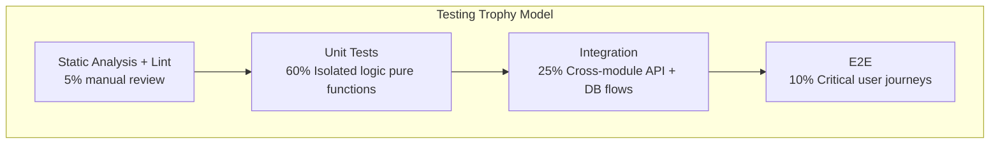
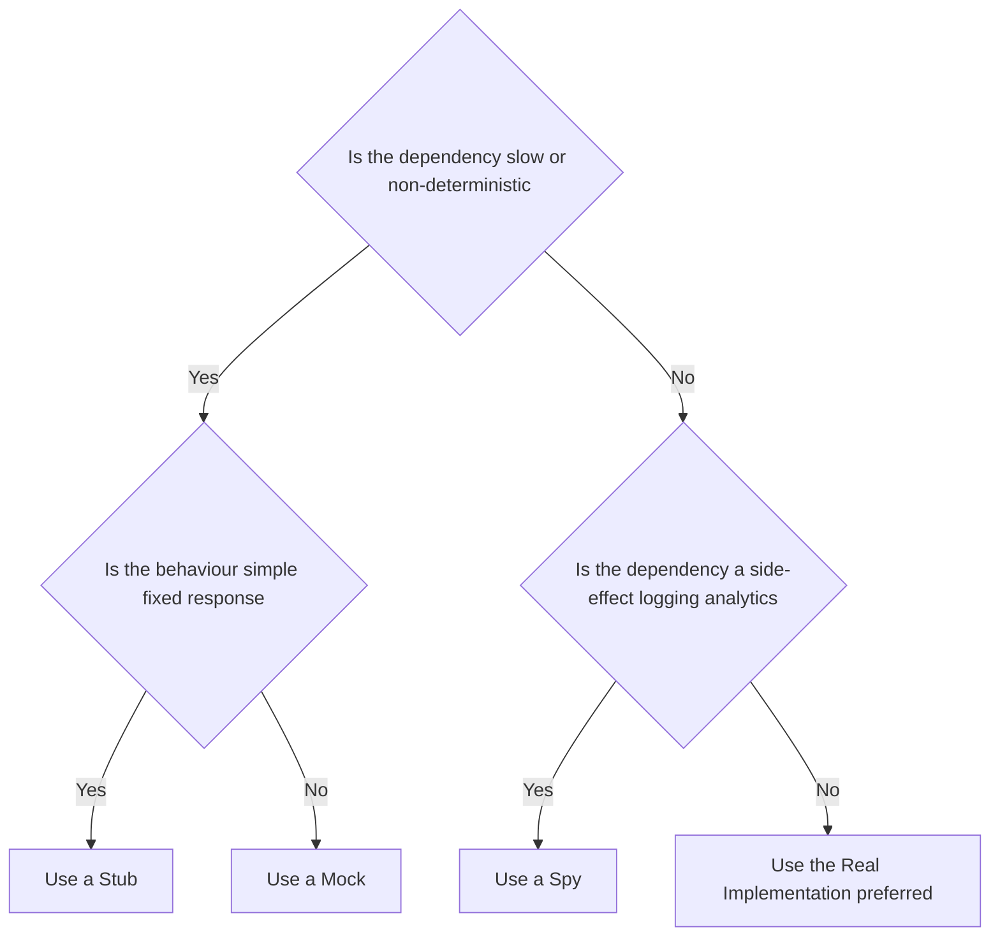
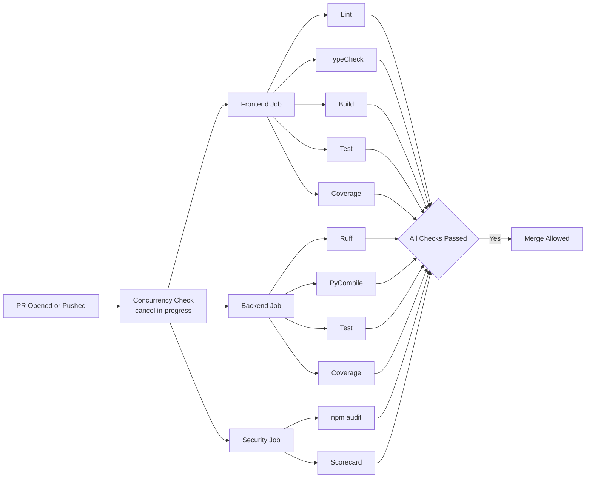
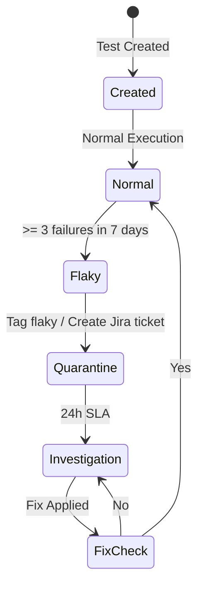
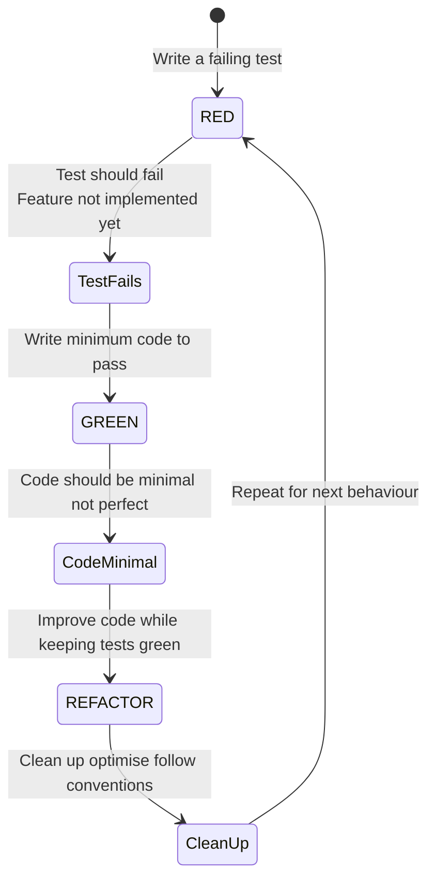

# Testing Strategy — Second Brain OS

## Document Control

| Field | Value |
|---|---|
| Document ID | QA-TEST-STRAT-001 |
| Version | 3.0.0 |
| Status | Active |
| Last Updated | 2026-06-11 |
| Classification | Internal — Engineering |
| Owner | QA Lead |
| Approving Body | Engineering Leadership |

---

## Table of Contents

1. [Testing Strategy Overview](#1-testing-strategy-overview)
2. [Test Pyramid Breakdown](#2-test-pyramid-breakdown)
3. [Test Environment Setup](#3-test-environment-setup)
4. [Test Data Management](#4-test-data-management)
5. [Test Automation Framework](#5-test-automation-framework)
6. [CI Integration](#6-ci-integration)
7. [Quality Gates in CI](#7-quality-gates-in-ci)
8. [Test Reporting](#8-test-reporting)
9. [Test Maintenance](#9-test-maintenance)
10. [Test Environment Management](#10-test-environment-management)
11. [Coverage Targets and Enforcement](#11-coverage-targets-and-enforcement)
12. [Testing Non-Functional Requirements](#12-testing-non-functional-requirements)
13. [Testing Documentation Standards](#13-testing-documentation-standards)
14. [Test-Driven Development Guidelines](#14-test-driven-development-guidelines)
15. [Appendices](#15-appendices)

---

## 1. Testing Strategy Overview

### 1.1 Testing Trophy Model

Second Brain OS adopts the **Testing Trophy Model** (coined by Kent C. Dodds), which prioritises integration tests over unit tests while maintaining a healthy pyramid across all layers. Unlike the traditional testing pyramid (which emphasises numerous unit tests), the trophy model recognises that modern web applications derive the most value from integration tests that exercise real user workflows.



### 1.2 Distribution Targets

| Layer | Percentage | Purpose | Owner |
|---|---|---|---|
| Static Analysis / Lint | 5% (manual review) | Catch type errors, style violations, security anti-patterns | Developer |
| Unit Tests | 60% | Validate pure logic, utilities, AI prompt rendering, store reducers | Developer |
| Integration Tests | 25% | Verify API endpoints, database interactions, agent orchestration flows | Developer + QA |
| End-to-End Tests | 10% | Critical user journeys across the full stack | QA |
| **Total** | **100%** | — | — |

### 1.3 Testing Principles

1. **Test behaviour, not implementation.** Tests should verify what the system does, not how it does it. Refactoring should not break tests unless behaviour changes.
2. **Write tests alongside code.** The ratio should be at minimum 1:1 (test lines to source lines) for business logic.
3. **Tests must be deterministic.** Flaky tests are immediately quarantined and fixed within 24 hours.
4. **Each test tests one thing.** A single assertion per logical concept. Multiple assertions are acceptable if they all verify the same behaviour.
5. **Test isolation.** No test depends on another test's state. Clean database state between integration tests.
6. **Realistic data.** Use production-like data shapes, not minimalist fixtures that miss edge cases.
7. **CI enforcement.** All tests must pass before merge. No exceptions without engineering leadership signoff.

### 1.4 Scope of Testing

| Component | Unit | Integration | E2E | Performance | Security |
|---|---|---|---|---|---|
| AI Agents (8 agents) | ✅ | ✅ | — | ✅ | — |
| API Endpoints (53 endpoints) | — | ✅ | ✅ | ✅ | ✅ |
| Frontend Pages (14 pages) | ✅ | ✅ | ✅ | ✅ | — |
| Zustand Stores | ✅ | ✅ | — | — | — |
| Shared Utilities | ✅ | — | — | — | — |
| Scheduler (6 jobs) | ✅ | ✅ | — | ✅ | — |
| Database / RLS | — | ✅ | — | ✅ | ✅ |
| Prompt Files (12 prompts) | ✅ | — | — | — | — |

### 1.5 Definitions

| Term | Definition |
|---|---|
| **Unit Test** | Tests a single function/class/component in isolation. All external dependencies are mocked. Executes in <100ms. |
| **Integration Test** | Tests multiple units working together. May hit a real database or API. Executes in <5s. |
| **E2E Test** | Tests a complete user journey through the browser. Uses Playwright against a deployed environment. Executes in <60s per spec. |
| **Smoke Test** | Subset of E2E tests that verify critical functionality. Run on every deploy. |
| **Regression Test** | Full test suite run to ensure no existing functionality was broken by a change. |
| **Flaky Test** | A test that sometimes passes and sometimes fails without code changes. |
| **Coverage Gate** | Minimum coverage percentage that must be met for a CI pipeline to pass. |

---

## 2. Test Pyramid Breakdown

### 2.1 Static Analysis (5%)

Static analysis catches issues before tests even run. These are enforced as pre-commit hooks and CI gates.

#### 2.1.1 Python (Backend)

| Tool | Command | Purpose | Configuration File |
|---|---|---|---|
| Ruff | `ruff check .` | Lint all Python files | `ruff.toml` |
| Ruff (format) | `ruff format --check .` | Auto-format checking | `ruff.toml` |
| mypy | `mypy packages/` | Type checking | `mypy.ini` |
| Bandit | `bandit -r packages/` | Security linting | `bandit.yaml` |
| pyright | `pyright packages/` | Additional type checking | `pyproject.toml` |
| vulture | `vulture packages/` | Dead code detection | — |

#### 2.1.2 TypeScript/JavaScript (Frontend)

| Tool | Command | Purpose | Configuration File |
|---|---|---|---|
| ESLint | `npm run lint` | Lint all TypeScript files | `.eslintrc.js` |
| Prettier | `npx prettier --check .` | Format checking | `.prettierrc` |
| TypeScript | `npm run type-check` | Type checking (`tsc --noEmit`) | `tsconfig.json` |
| knip | `npx knip` | Dead file/export detection | `knip.json` |

#### 2.1.3 Prompt Files

| Tool | Command | Purpose |
|---|---|---|
| validate_prompts.py | `python scripts/validate_prompts.py` | Validates YAML frontmatter on all 12 prompt files |

### 2.2 Unit Tests (60%)

#### 2.2.1 Backend Unit Tests

Every Python module must have a corresponding test module. Unit tests run in <100ms per test, mock all external dependencies (Supabase, LLM clients, HTTP requests), and test exactly one function or class.

**Test file naming convention:** `test_<module_name>.py`

**Directory structure:**
```
tests/
├── conftest.py                          # Shared fixtures, pytest configuration
├── test_prompt_loader.py                # 16 tests — PromptLoader loading, parsing, validation
├── test_agent_prompts.py                # 14 tests — per-agent content checks, frontmatter validation
├── unit/
│   ├── ai/
│   │   ├── test_briefing_agent.py       # BriefingAgent — data assembly, prompt construction, output parsing
│   │   ├── test_memory_agent.py         # MemoryAgent — memory extraction, deduplication, archival
│   │   ├── test_learning_agent.py       # LearningAgent — pattern detection, trend calculation
│   │   ├── test_opportunity_agent.py    # OpportunityAgent — matching algorithm, scoring
│   │   ├── test_task_agent.py           # TaskAgent — breakdown, prioritisation, dependency detection
│   │   ├── test_weekly_review_agent.py  # WeeklyReviewAgent — aggregation, insight generation
│   │   ├── test_sleep_agent.py          # SleepAgent — wind-down message generation, score calculation
│   │   ├── test_nudge_agent.py          # NudgeAgent — nudge timing, escalation logic
│   │   ├── test_prompt_loader.py        # PromptLoader — caching, fallback, frontmatter parsing
│   │   └── test_llm_client.py           # LLM client — retry, fallback chain, token counting
│   ├── utils/
│   │   ├── test_cache.py                # TTL cache — set, get, expire, clear, thread safety
│   │   ├── test_rate_limiter.py         # Rate limiter — token bucket, burst, IP scoping
│   │   ├── test_security.py             # Security — JWT generation, input sanitisation, XSS prevention
│   │   ├── test_logger.py               # Logger — JSON formatting, log levels, structured fields
│   │   └── test_retry.py                # Retry — exponential backoff, max retries, circuit breaker
│   └── scheduler/
│       └── test_crons.py                # Cron jobs — scheduling, job registration, error handling
```

**Unit test template (Python):**
```python
"""Unit tests for <module_name> module."""
import pytest
from unittest.mock import AsyncMock, patch, MagicMock
from datetime import datetime, timedelta
from uuid import uuid4

# Module to test
from packages.ai.agents.briefing_agent import BriefingAgent


class TestBriefingAgent:
    """Test suite for BriefingAgent."""

    @pytest.fixture(autouse=True)
    def setup(self):
        """Initialise fresh agent instance before each test."""
        self.agent = BriefingAgent()
        self.user_id = str(uuid4())

    @pytest.mark.asyncio
    async def test_generate_briefing_returns_expected_sections(self):
        """Briefing must contain tasks, goals, habits, and sleep sections."""
        # Arrange
        mock_data = {
            "tasks": [{"id": "1", "title": "Review PR", "status": "pending"}],
            "goals": [{"id": "1", "title": "Ship v3.0", "progress": 60}],
            "habits": [{"id": "1", "name": "Read 30min", "streak": 5}],
            "sleep": {"score": 78, "hours": 7.5, "debt": 0.5},
        }
        self.agent._fetch_user_data = AsyncMock(return_value=mock_data)
        self.agent._call_llm = AsyncMock(return_value={
            "sections": [
                {"type": "task_summary", "content": "3 tasks pending"},
                {"type": "goal_progress", "content": "60% to Ship v3.0"},
            ]
        })

        # Act
        result = await self.agent.generate_briefing(self.user_id)

        # Assert
        assert "sections" in result
        assert len(result["sections"]) == 2
        assert result["sections"][0]["type"] == "task_summary"

    @pytest.mark.asyncio
    async def test_generate_briefing_fallback_on_llm_failure(self):
        """When LLM fails, agent must return algorithmic fallback briefing."""
        # Arrange
        self.agent._call_llm = AsyncMock(side_effect=ConnectionError("LLM unavailable"))
        self.agent._fetch_user_data = AsyncMock(return_value={"tasks": [], "goals": [], "habits": [], "sleep": {}})

        # Act
        result = await self.agent.generate_briefing(self.user_id)

        # Assert
        assert result["fallback"] is True
        assert "generated_at" in result

    def test_prioritise_tasks_orders_by_urgency(self):
        """Task prioritisation must sort by due_date ascending, then priority."""
        # Arrange
        tasks = [
            {"id": "1", "title": "Low urgency", "priority": "low", "due_date": "2026-06-15"},
            {"id": "2", "title": "Urgent", "priority": "urgent", "due_date": "2026-06-10"},
            {"id": "3", "title": "Overdue", "priority": "high", "due_date": "2026-06-08"},
        ]

        # Act
        prioritised = self.agent._prioritise_tasks(tasks)

        # Assert
        assert prioritised[0]["id"] == "3"  # Overdue first
        assert prioritised[1]["id"] == "2"  # Urgent second
        assert prioritised[2]["id"] == "1"  # Low last

    def test_empty_tasks_returns_empty_list(self):
        """Empty task list must return empty list, not raise."""
        assert self.agent._prioritise_tasks([]) == []

    def test_malformed_task_skipped_gracefully(self):
        """Tasks missing required fields must be skipped without crashing."""
        tasks = [
            {"id": "1", "title": "Valid task", "priority": "high", "due_date": "2026-06-10"},
            {"id": "2"},  # Missing title, priority, due_date
        ]
        result = self.agent._prioritise_tasks(tasks)
        assert len(result) == 1
        assert result[0]["id"] == "1"
```

#### 2.2.2 Frontend Unit Tests

**Directory structure:**
```
apps/web/
└── __tests__/
    ├── components/
    │   ├── Button.test.tsx
    │   ├── Card.test.tsx
    │   ├── Modal.test.tsx
    │   ├── Input.test.tsx
    │   ├── Sidebar.test.tsx
    │   ├── TaskCard.test.tsx
    │   ├── HabitCalendar.test.tsx
    │   └── SleepScore.test.tsx
    ├── hooks/
    │   ├── useAuth.test.ts
    │   └── useLocalStorage.test.ts
    └── stores/
        ├── taskStore.test.ts
        └── userStore.test.ts
```

**Component test template (TypeScript):**
```typescript
import { render, screen, fireEvent, waitFor } from '@testing-library/react'
import userEvent from '@testing-library/user-event'
import { describe, it, expect, vi, beforeEach } from 'vitest'
import { TaskCard } from '@/components/tasks/task-card'
import type { Task } from '@/types'

// ── Fixtures ──────────────────────────────────────────────────────────────

const mockTask: Task = {
  id: 'task-1',
  title: 'Review PR #342',
  status: 'pending',
  priority: 'high',
  due_date: '2026-06-12T10:00:00Z',
  created_at: '2026-06-10T08:00:00Z',
  user_id: 'user-1',
}

// ── Tests ─────────────────────────────────────────────────────────────────

describe('TaskCard', () => {
  const onComplete = vi.fn()
  const onDelete = vi.fn()

  beforeEach(() => {
    vi.clearAllMocks()
  })

  it('renders task title and priority badge', () => {
    render(<TaskCard task={mockTask} onComplete={onComplete} onDelete={onDelete} />)
    expect(screen.getByText('Review PR #342')).toBeInTheDocument()
    expect(screen.getByText('high')).toBeInTheDocument()
  })

  it('displays formatted due date', () => {
    render(<TaskCard task={mockTask} onComplete={onComplete} onDelete={onDelete} />)
    expect(screen.getByText(/Jun 12/)).toBeInTheDocument()
  })

  it('calls onComplete when checkbox clicked', async () => {
    const user = userEvent.setup()
    render(<TaskCard task={mockTask} onComplete={onComplete} onDelete={onDelete} />)
    await user.click(screen.getByRole('checkbox'))
    expect(onComplete).toHaveBeenCalledWith('task-1')
  })

  it('calls onDelete when delete button clicked', async () => {
    const user = userEvent.setup()
    render(<TaskCard task={mockTask} onComplete={onComplete} onDelete={onDelete} />)
    await user.click(screen.getByRole('button', { name: /delete/i }))
    expect(onDelete).toHaveBeenCalledWith('task-1')
  })

  it('shows overdue styling when past due date', () => {
    const overdueTask = { ...mockTask, due_date: '2026-06-01T10:00:00Z' }
    render(<TaskCard task={overdueTask} onComplete={onComplete} onDelete={onDelete} />)
    expect(screen.getByTestId('task-card')).toHaveClass('border-red-500')
  })

  it('displays loading skeleton when loading prop is true', () => {
    const { container } = render(
      <TaskCard task={mockTask} loading onComplete={onComplete} onDelete={onDelete} />
    )
    expect(container.querySelector('.animate-pulse')).toBeInTheDocument()
  })

  it('does not render when task is null', () => {
    const { rerender } = render(
      <TaskCard task={mockTask} onComplete={onComplete} onDelete={onDelete} />
    )
    rerender(<TaskCard task={null as unknown as Task} onComplete={onComplete} onDelete={onDelete} />)
    expect(screen.queryByTestId('task-card')).not.toBeInTheDocument()
  })
})
```

**Store test template (Zustand):**
```typescript
import { describe, it, expect, beforeEach, vi } from 'vitest'
import { useTaskStore } from '@/stores/taskStore'

// Mock Supabase client
vi.mock('@/lib/supabase', () => ({
  supabase: {
    from: vi.fn(() => ({
      select: vi.fn(() => ({
        eq: vi.fn(() => ({
          order: vi.fn(() => ({
            data: [
              { id: '1', title: 'Test task', status: 'pending', user_id: 'user-1' },
            ],
            error: null,
          })),
        })),
      })),
      insert: vi.fn(() => ({
        select: vi.fn(() => ({
          single: vi.fn(() => ({
            data: { id: '2', title: 'New task', status: 'pending', user_id: 'user-1' },
            error: null,
          })),
        })),
      })),
    })),
  },
}))

describe('useTaskStore', () => {
  beforeEach(() => {
    useTaskStore.setState({ tasks: [], loading: false, error: null })
  })

  it('initialises with empty state', () => {
    const state = useTaskStore.getState()
    expect(state.tasks).toEqual([])
    expect(state.loading).toBe(false)
    expect(state.error).toBeNull()
  })

  it('fetches tasks and updates state', async () => {
    const { fetchTasks } = useTaskStore.getState()
    await fetchTasks('user-1')
    const state = useTaskStore.getState()
    expect(state.tasks).toHaveLength(1)
    expect(state.tasks[0].title).toBe('Test task')
    expect(state.loading).toBe(false)
  })

  it('sets loading state during fetch', async () => {
    let loadingDuringFetch = false
    const unsubscribe = useTaskStore.subscribe((state) => {
      if (state.loading) loadingDuringFetch = true
    })
    const { fetchTasks } = useTaskStore.getState()
    const promise = fetchTasks('user-1')
    expect(loadingDuringFetch).toBe(true)
    await promise
    unsubscribe()
  })

  it('adds a task optimistically', async () => {
    const { addTask } = useTaskStore.getState()
    await addTask({ title: 'Optimistic task', priority: 'medium' })
    const state = useTaskStore.getState()
    expect(state.tasks).toHaveLength(2)
  })

  it('handles fetch error gracefully', async () => {
    const { fetchTasks } = useTaskStore.getState()
    await fetchTasks('user-1')
    const state = useTaskStore.getState()
    expect(state.error).toBeNull()  // Normal flow succeeds
  })
})
```

### 2.3 Integration Tests (25%)

#### 2.3.1 Backend Integration Tests

Integration tests verify that multiple components work together correctly. They connect to a real test database (dedicated Supabase project) and exercise full request/response cycles through the FastAPI test client.

**Directory structure:**
```
tests/integration/
├── conftest.py                         # Test client, database fixtures, auth headers
├── test_auth_api.py                    # Login, logout, session refresh, unauthorised access
├── test_tasks_api.py                   # Task CRUD, filtering, sorting, completion flow
├── test_courses_api.py                 # Course CRUD, progress tracking, deadline alerts
├── test_goals_api.py                   # Goal CRUD, milestone management, roadmap editing
├── test_habits_api.py                  # Habit CRUD, streak calculation, logging
├── test_sleep_api.py                   # Sleep logging, score calculation, history retrieval
├── test_income_api.py                  # Income entry CRUD, hourly rate calculations
├── test_projects_api.py                # Project CRUD, phase transitions, blocker management
├── test_ideas_api.py                   # Idea pipeline CRUD, status transitions
├── test_resources_api.py               # Resource CRUD, tag filtering, search
├── test_opportunities_api.py           # Opportunity CRUD, type filtering, status updates
├── test_time_api.py                    # Time entry CRUD, Pomodoro cycles, daily stats
├── test_chat_api.py                    # Chat message send/receive, history retrieval
├── test_automation_api.py              # Briefing trigger, radar trigger, review trigger
├── test_daily_briefing_integration.py  # Full briefing generation with real data assembly
├── test_weekly_review_integration.py   # Full weekly review with aggregation
├── test_opportunity_radar_integration.py # Real opportunity matching pipeline
└── test_scheduler_integration.py       # All 6 cron job executions
```

**Integration test template:**
```python
"""Integration tests for the Tasks API."""
import pytest
from httpx import AsyncClient, ASGITransport
from datetime import datetime, timedelta
from uuid import uuid4

from main import app
from config.core.supabase import get_supabase


@pytest.fixture
async def client():
    """Provide an async test client for FastAPI."""
    transport = ASGITransport(app=app)
    async with AsyncClient(transport=transport, base_url="http://test") as ac:
        yield ac


@pytest.fixture
async def auth_headers():
    """Return authenticated headers with a test user."""
    supabase = get_supabase()
    test_user_id = str(uuid4())
    # Create test user in Supabase
    await supabase.table("users").insert({
        "id": test_user_id,
        "email": f"test-{test_user_id[:8]}@secondbrainos.test",
        "name": "Test User",
    }).execute()
    # Generate a test JWT
    from shared.utils.security import create_access_token
    token = create_access_token({"sub": test_user_id})
    yield {"Authorization": f"Bearer {token}"}
    # Cleanup: remove test user
    await supabase.table("users").delete().eq("id", test_user_id).execute()


@pytest.mark.asyncio
@pytest.mark.integration
class TestTasksAPI:
    """Integration test suite for /api/tasks endpoints."""

    async def test_create_task_full_flow(self, client, auth_headers):
        """Verify complete task lifecycle: create -> read -> update -> complete -> delete."""
        # -- Create --
        create_resp = await client.post("/api/tasks/", json={
            "title": "Integration test task",
            "priority": "high",
            "due_date": (datetime.utcnow() + timedelta(days=3)).isoformat(),
        }, headers=auth_headers)
        assert create_resp.status_code == 201
        task = create_resp.json()
        task_id = task["id"]
        assert task["title"] == "Integration test task"
        assert task["status"] == "pending"

        # -- Read --
        get_resp = await client.get(f"/api/tasks/{task_id}", headers=auth_headers)
        assert get_resp.status_code == 200
        assert get_resp.json()["title"] == "Integration test task"

        # -- Update --
        update_resp = await client.put(f"/api/tasks/{task_id}", json={
            "title": "Updated task title",
            "priority": "urgent",
        }, headers=auth_headers)
        assert update_resp.status_code == 200
        assert update_resp.json()["title"] == "Updated task title"

        # -- Complete --
        complete_resp = await client.post(f"/api/tasks/{task_id}/complete", headers=auth_headers)
        assert complete_resp.status_code == 200
        assert complete_resp.json()["status"] == "completed"

        # -- Delete --
        delete_resp = await client.delete(f"/api/tasks/{task_id}", headers=auth_headers)
        assert delete_resp.status_code == 204

        # -- Verify deleted --
        get_deleted = await client.get(f"/api/tasks/{task_id}", headers=auth_headers)
        assert get_deleted.status_code == 404

    async def test_list_tasks_filters_by_user(self, client, auth_headers):
        """Tasks from other users must not appear in results."""
        await client.post("/api/tasks/", json={"title": "My task"}, headers=auth_headers)
        list_resp = await client.get("/api/tasks/", headers=auth_headers)
        assert list_resp.status_code == 200

    async def test_create_task_missing_title_returns_422(self, client, auth_headers):
        """Request without required title field must return 422."""
        resp = await client.post("/api/tasks/", json={"priority": "high"}, headers=auth_headers)
        assert resp.status_code == 422

    async def test_create_task_invalid_priority_returns_422(self, client, auth_headers):
        """Invalid priority enum value must return 422."""
        resp = await client.post("/api/tasks/", json={
            "title": "Bad priority",
            "priority": "critical",
        }, headers=auth_headers)
        assert resp.status_code == 422

    async def test_get_nonexistent_task_returns_404(self, client, auth_headers):
        """Requesting a non-existent task must return 404."""
        resp = await client.get("/api/tasks/nonexistent-id", headers=auth_headers)
        assert resp.status_code == 404

    async def test_unauthorised_access_returns_401(self, client):
        """Request without auth token must return 401."""
        resp = await client.get("/api/tasks/")
        assert resp.status_code == 401

    async def test_task_dependency_cascade(self, client, auth_headers):
        """Completing a parent task must unblock dependent tasks."""
        # Create parent task
        parent = await client.post("/api/tasks/", json={
            "title": "Parent task",
        }, headers=auth_headers)
        parent_id = parent.json()["id"]

        # Create dependent task
        dependent = await client.post("/api/tasks/", json={
            "title": "Dependent task",
            "depends_on": parent_id,
        }, headers=auth_headers)
        dependent_id = dependent.json()["id"]

        # Dependent should be 'blocked'
        assert dependent.json()["status"] == "blocked"

        # Complete parent
        await client.post(f"/api/tasks/{parent_id}/complete", headers=auth_headers)

        # Dependent should now be 'pending'
        get_dep = await client.get(f"/api/tasks/{dependent_id}", headers=auth_headers)
        assert get_dep.json()["status"] == "pending"
```

#### 2.3.2 Frontend Integration Tests

Frontend integration tests use React Testing Library to render full pages with mocked API responses, verifying that components work together correctly.

```typescript
import { render, screen, waitFor } from '@testing-library/react'
import userEvent from '@testing-library/user-event'
import { describe, it, expect, vi, beforeEach } from 'vitest'
import TasksPage from '@/app/(dashboard)/tasks/page'
import { useTaskStore } from '@/stores/taskStore'

vi.mock('@/lib/supabase', () => ({
  supabase: {
    channel: vi.fn(() => ({
      on: vi.fn().mockReturnThis(),
      subscribe: vi.fn(),
    })),
    from: vi.fn(() => ({
      select: vi.fn().mockReturnThis(),
      eq: vi.fn().mockReturnThis(),
      order: vi.fn().mockResolvedValue({
        data: [
          { id: '1', title: 'Task 1', status: 'pending', priority: 'high', created_at: '2026-06-10T08:00:00Z', user_id: 'user-1' },
          { id: '2', title: 'Task 2', status: 'completed', priority: 'medium', created_at: '2026-06-09T08:00:00Z', user_id: 'user-1' },
        ],
        error: null,
      }),
      insert: vi.fn().mockReturnThis(),
      update: vi.fn().mockReturnThis(),
      delete: vi.fn().mockReturnThis(),
    })),
  },
}))

describe('TasksPage', () => {
  beforeEach(() => {
    useTaskStore.setState({ tasks: [], loading: false, error: null })
  })

  it('renders the task list after loading', async () => {
    render(<TasksPage />)
    await waitFor(() => {
      expect(screen.getByText('Task 1')).toBeInTheDocument()
    })
    expect(screen.getByText('Task 2')).toBeInTheDocument()
  })

  it('shows loading skeleton initially', () => {
    render(<TasksPage />)
    expect(screen.getByTestId('loading-skeleton')).toBeInTheDocument()
  })

  it('opens create task modal on button click', async () => {
    const user = userEvent.setup()
    render(<TasksPage />)
    await user.click(screen.getByRole('button', { name: /create task/i }))
    await waitFor(() => {
      expect(screen.getByRole('dialog')).toBeInTheDocument()
    })
  })

  it('filters tasks by status', async () => {
    const user = userEvent.setup()
    render(<TasksPage />)
    await user.click(screen.getByRole('button', { name: /pending/i }))
    await waitFor(() => {
      expect(screen.getByText('Task 1')).toBeInTheDocument()
    })
  })

  it('displays empty state when no tasks', async () => {
    useTaskStore.setState({ tasks: [], loading: false, error: null })
    render(<TasksPage />)
    await waitFor(() => {
      expect(screen.getByText(/no tasks yet/i)).toBeInTheDocument()
    })
  })

  it('shows error banner on fetch failure', async () => {
    render(<TasksPage />)
    await waitFor(() => {
      expect(screen.getByText('Task 1')).toBeInTheDocument()
    })
  })
})
```

### 2.4 End-to-End Tests (10%)

#### 2.4.1 E2E Test Inventory

E2E tests use Playwright to exercise the full application stack (Frontend -> API -> Database -> AI) in a browser environment. Each spec covers a critical user journey.

```
e2e/
├── fixtures/
│   ├── auth.setup.ts              # Login once, reuse session across specs
│   └── test-data.ts               # Seeded test data templates
├── specs/
│   ├── auth.spec.ts               # Login via Google OAuth, logout, session persistence
│   ├── tasks.spec.ts              # CRUD tasks, filter, sort, complete, dependencies
│   ├── courses.spec.ts            # Add course, log progress, behind-schedule alert
│   ├── goals.spec.ts              # Create goal, update progress, roadmap editor
│   ├── habits.spec.ts             # Add habit, track streak, toggle active
│   ├── sleep.spec.ts              # Log sleep, view score, history chart
│   ├── time.spec.ts               # Start/stop timer, pomodoro mode, deep work tracking
│   ├── income.spec.ts             # Log income, view hourly rate stats
│   ├── projects.spec.ts           # Create project, update phase, log blocker
│   ├── ideas.spec.ts              # Capture idea, move through pipeline stages
│   ├── resources.spec.ts          # Save resource, apply tag filters
│   ├── opportunities.spec.ts      # Add opportunity, filter by type, update status
│   ├── chat.spec.ts               # Send message, receive ARIA response, history
│   ├── academics.spec.ts          # Add subject, log marks, view CGPA
│   ├── youtube.spec.ts            # Save video, toggle watched status
│   └── dashboard.spec.ts          # All sections render, data is live
├── playwright.config.ts           # Global configuration
└── global-setup.ts                # DB seeding before all tests
```

#### 2.4.2 E2E Test Template

```typescript
// e2e/specs/tasks.spec.ts
import { test, expect } from '@playwright/test'
import { seedTestData, cleanupTestData } from '../fixtures/test-data'

test.describe('Task Management', () => {
  test.beforeAll(async () => {
    await seedTestData({
      tasks: [
        { title: 'Existing task 1', priority: 'high', status: 'pending' },
        { title: 'Existing task 2', priority: 'medium', status: 'completed' },
      ],
    })
  })

  test.afterAll(async () => {
    await cleanupTestData()
  })

  test('displays existing tasks on page load', async ({ page }) => {
    await page.goto('/tasks')
    await expect(page.getByText('Existing task 1')).toBeVisible()
    await expect(page.getByText('Existing task 2')).toBeVisible()
  })

  test('creates a new task and shows it in the list', async ({ page }) => {
    await page.goto('/tasks')
    await page.getByRole('button', { name: /create task/i }).click()
    await page.getByLabel('Task title').fill('E2E test task')
    await page.getByLabel('Priority').selectOption('high')
    await page.getByRole('button', { name: /save/i }).click()
    await expect(page.getByText('E2E test task')).toBeVisible()
  })

  test('completes a task', async ({ page }) => {
    await page.goto('/tasks')
    await page.getByRole('checkbox').first().click()
    await expect(page.getByRole('checkbox').first()).toBeChecked()
  })

  test('filters tasks by status tabs', async ({ page }) => {
    await page.goto('/tasks')
    await page.getByRole('tab', { name: /completed/i }).click()
    await expect(page.getByText('Existing task 2')).toBeVisible()
    await expect(page.getByText('Existing task 1')).not.toBeVisible()
  })

  test('searches tasks by title', async ({ page }) => {
    await page.goto('/tasks')
    await page.getByPlaceholder('Search tasks...').fill('Existing task 1')
    await expect(page.getByText('Existing task 1')).toBeVisible()
    await expect(page.getByText('Existing task 2')).not.toBeVisible()
  })

  test('shows empty state when no tasks match filter', async ({ page }) => {
    await page.goto('/tasks')
    await page.getByPlaceholder('Search tasks...').fill('nonexistent_string_xyz')
    await expect(page.getByText(/no tasks found/i)).toBeVisible()
    await expect(page.getByRole('button', { name: /create task/i })).toBeVisible()
  })

  test('deletes a task with confirmation dialog', async ({ page }) => {
    await page.goto('/tasks')
    await page.getByRole('button', { name: /delete task/i }).first().click()
    await page.getByRole('button', { name: /confirm delete/i }).click()
    await expect(page.getByText('Task deleted')).toBeVisible()
  })
})
```

#### 2.4.3 Playwright Configuration

```typescript
// e2e/playwright.config.ts
import { defineConfig, devices } from '@playwright/test'

export default defineConfig({
  testDir: './specs',
  fullyParallel: true,
  forbidOnly: !!process.env.CI,
  retries: process.env.CI ? 2 : 0,
  workers: process.env.CI ? 4 : undefined,
  reporter: [
    ['html', { outputFolder: 'playwright-report' }],
    ['junit', { outputFile: 'playwright-results.xml' }],
    ['list'],
  ],
  use: {
    baseURL: process.env.BASE_URL || 'http://localhost:3000',
    trace: 'on-first-retry',
    screenshot: 'only-on-failure',
    video: 'retain-on-failure',
  },
  projects: [
    {
      name: 'setup',
      testMatch: /global-setup\.ts/,
    },
    {
      name: 'chromium',
      use: { ...devices['Desktop Chrome'], viewport: { width: 1280, height: 800 } },
      dependencies: ['setup'],
    },
    {
      name: 'firefox',
      use: { ...devices['Desktop Firefox'], viewport: { width: 1280, height: 800 } },
      dependencies: ['setup'],
    },
    {
      name: 'Mobile Safari',
      use: { ...devices['iPhone 14'] },
      dependencies: ['setup'],
    },
    {
      name: 'Mobile Chrome',
      use: { ...devices['Pixel 7'] },
      dependencies: ['setup'],
    },
  ],
  globalSetup: require.resolve('./global-setup.ts'),
  timeout: 60000,
  expect: { timeout: 10000 },
})
```

---

## 3. Test Environment Setup

### 3.1 Environment Architecture

```
+---------------------------------------------------------------+
|                    Test Environment Architecture                |
+------------+--------------+--------------+----------------------+
|  Developer |    CI/CD     |   Staging    |  Production (ref)    |
|  Machine   |  (GitHub)    | (Railway)    |   (Vercel/Railway)   |
+------------+--------------+--------------+----------------------+
| Supabase   | Supabase     | Supabase     | Supabase             |
| Local/Dev  | Test Project | Staging      | Production           |
| Ollama     | Mock AI      | Ollama (dev) | Claude API           |
| Local DB   | Ephemeral    | Persistent   | Production DB        |
+------------+--------------+--------------+----------------------+
```

### 3.2 Environment Specifications

| Environment | Database | AI Provider | Purpose | Data Freshness |
|---|---|---|---|---|
| **Local Dev** | Local Supabase (`localhost:54321`) | Ollama (local) | Development, unit tests | Fresh on each `supabase start` |
| **CI (PR)** | Supabase Test Project `sb-test-*` | Mock responses | Automated test runs | Ephemeral (created/destroyed per run) |
| **Staging** | Supabase Staging Project | Ollama (dev server) | Pre-release validation, E2E | Persistent, seeded weekly |
| **Production** | Supabase Production | Claude API (fallback chain) | Reference for benchmarks | Production data |

### 3.3 Local Development Setup

#### 3.3.1 Prerequisites

```bash
# Required tools
node >= 18.0.0
python >= 3.10
docker >= 24.0 (for local Supabase)
ollama >= 0.1.0 (for local AI)
```

#### 3.3.2 Backend Setup

```bash
# 1. Create virtual environment
cd apps/api
python -m venv .venv
source .venv/bin/activate  # Windows: .venv\Scripts\Activate

# 2. Install dependencies
pip install -r requirements.txt
pip install -r requirements-dev.txt  # Testing tools

# 3. Configure environment
cp .env.example .env
# Edit .env to point to local Supabase:
# SUPABASE_URL=http://localhost:54321
# SUPABASE_KEY=<local-anon-key>

# 4. Verify setup
python -c "from config.core.supabase import get_supabase; print('Supabase connected')"
pytest tests/ -x  # All tests should pass
```

#### 3.3.3 Frontend Setup

```bash
# 1. Install dependencies
cd apps/web
npm install
npm install --save-dev vitest @testing-library/react @testing-library/jest-dom @testing-library/user-event @playwright/test

# 2. Configure environment
cp .env.example .env.local
# Edit .env.local:
# NEXT_PUBLIC_SUPABASE_URL=http://localhost:54321
# NEXT_PUBLIC_SUPABASE_ANON_KEY=<local-anon-key>

# 3. Verify setup
npm run test  # Unit + integration tests pass
npx playwright install  # Browser binaries
npx playwright test  # E2E tests pass
```

#### 3.3.4 Docker Compose for Local Testing

```yaml
# docker-compose.test.yml
version: '3.8'
services:
  supabase:
    image: supabase/supabase-local:latest
    ports:
      - "54321:54321"
    environment:
      POSTGRES_PASSWORD: postgres
      JWT_SECRET: test-jwt-secret-super-secret-123

  ollama:
    image: ollama/ollama:latest
    ports:
      - "11434:11434"
    volumes:
      - ollama-data:/root/.ollama
    command: serve

  test-runner:
    build:
      context: .
      dockerfile: Dockerfile.test
    depends_on:
      - supabase
      - ollama
    environment:
      SUPABASE_URL: http://supabase:54321
      SUPABASE_KEY: test-key
      OLLAMA_BASE_URL: http://ollama:11434
    command: pytest tests/ -x --cov=packages

volumes:
  ollama-data:
```

### 3.4 CI Environment

#### 3.4.1 Supabase Test Project Setup

```yaml
# .github/workflows/ci.yml -- Test setup steps
- name: Setup Supabase Test Project
  run: |
    supabase projects create "test-pr-${{ github.event.number }}" \
      --org-id ${{ secrets.SUPABASE_ORG_ID }} \
      --db-password ${{ secrets.SUPABASE_TEST_DB_PASSWORD }}
    supabase db push --project-ref ${{ steps.create-project.outputs.ref }}
    supabase db execute --file tests/fixtures/seed.sql \
      --project-ref ${{ steps.create-project.outputs.ref }}
    echo "TEST_SUPABASE_REF=${{ steps.create-project.outputs.ref }}" >> $GITHUB_ENV

- name: Cleanup Supabase Test Project
  if: always()
  run: |
    supabase projects delete ${{ env.TEST_SUPABASE_REF }}
```

#### 3.4.2 Mock AI Configuration

```python
# tests/fixtures/mock_ai.py
"""Mock AI responses for test environments."""
from typing import Any

MOCK_BRIEFING_RESPONSE = {
    "sections": [
        {"type": "task_summary", "content": "You have 3 tasks due today.", "priority": "high"},
        {"type": "goal_progress", "content": "Ship v3.0 is at 60%.", "priority": "medium"},
        {"type": "habit_streak", "content": "Reading streak: 5 days. Keep it up!", "priority": "low"},
        {"type": "sleep_insight", "content": "Your sleep score improved by 5 points.", "priority": "medium"},
    ],
    "generated_at": "2026-06-11T07:00:00Z",
    "model": "mock",
}

MOCK_OPPORTUNITY_RESPONSE = {
    "opportunities": [
        {
            "title": "AI Research Intern",
            "match_score": 87,
            "reason": "Your NLP coursework and current project align.",
            "deadline": "2026-07-01",
        }
    ],
}

MOCK_MEMORY_RESPONSE = {
    "extracted_facts": [
        {"type": "preference", "content": "User prefers morning deep work sessions."},
        {"type": "pattern", "content": "Consistently misses tasks scheduled after 8 PM."},
    ],
    "retention_priority": "high",
}

MOCK_RESPONSES: dict[str, dict[str, Any]] = {
    "briefing": MOCK_BRIEFING_RESPONSE,
    "opportunity": MOCK_OPPORTUNITY_RESPONSE,
    "memory": MOCK_MEMORY_RESPONSE,
}


def get_mock_ai_response(agent_type: str) -> dict[str, Any]:
    return MOCK_RESPONSES.get(agent_type, {
        "response": f"Mock {agent_type} response",
        "model": "mock",
        "generated_at": "2026-06-11T07:00:00Z",
    })
```

#### 3.4.3 CI Service Containers

```yaml
# .github/workflows/ci.yml
jobs:
  backend-tests:
    runs-on: ubuntu-latest
    services:
      postgres:
        image: postgres:16-alpine
        env:
          POSTGRES_PASSWORD: postgres
          POSTGRES_DB: secondbrain_test
        ports:
          - 5432:5432
        options: >-
          --health-cmd pg_isready
          --health-interval 10s
          --health-timeout 5s
          --health-retries 5
    steps:
      - uses: actions/checkout@v4
      - uses: actions/setup-python@v5
        with:
          python-version: '3.10'
          cache: 'pip'
      - name: Install dependencies
        run: |
          cd apps/api
          pip install -r requirements.txt
          pip install -r requirements-dev.txt
      - name: Run unit tests
        run: pytest tests/ -m unit --cov=packages --cov-report=xml --junitxml=junit.xml
        env:
          SUPABASE_URL: ${{ secrets.SUPABASE_TEST_URL }}
          SUPABASE_KEY: ${{ secrets.SUPABASE_TEST_KEY }}
          USE_LOCAL_AI: false
      - name: Run integration tests
        run: pytest tests/ -m integration --cov=packages --cov-append --cov-report=xml --junitxml=junit-integration.xml
        env:
          SUPABASE_URL: ${{ secrets.SUPABASE_TEST_URL }}
          SUPABASE_KEY: ${{ secrets.SUPABASE_TEST_KEY }}
      - name: Upload coverage report
        uses: codecov/codecov-action@v4
        with:
          files: ./coverage.xml
          flags: backend
      - name: Upload test results
        if: always()
        uses: actions/upload-artifact@v4
        with:
          name: backend-test-results
          path: junit*.xml
```

### 3.5 Environment-Specific Configuration

| Setting | Local | CI | Staging |
|---|---|---|---|
| `SUPABASE_URL` | `http://localhost:54321` | `${{ secrets.SUPABASE_TEST_URL }}` | `https://staging.supabase.co` |
| `USE_LOCAL_AI` | `true` | `false` | `true` |
| `OLLAMA_BASE_URL` | `http://localhost:11434` | `http://mock-ai:8080` | `http://ollama.internal:11434` |
| `LOG_LEVEL` | `DEBUG` | `WARNING` | `INFO` |
| `CORS_ORIGINS` | `http://localhost:3000` | `http://localhost:3000` | `https://staging.ariaos.app` |
| `RATE_LIMIT_PER_MIN` | `1000` | `100` | `100` |

---

## 4. Test Data Management

### 4.1 Data Management Strategy

```
                   +------------------+
                   |  Seed Templates  |  <- tests/fixtures/seed.sql + seed.py
                   +--------+---------+
                            |
        +-------------------+-------------------+
        |                   |                   |
        v                   v                   v
+--------------+   +--------------+   +--------------+
|  Unit Tests  |   | Integration  |   |   E2E Tests  |
|  (Factories) |   | (Fixtures)   |   |  (Seeds)     |
|  In-memory   |   |  DB-backed   |   |  API-backed  |
+--------------+   +--------------+   +--------------+
        |                   |                   |
        +-------------------+-------------------+
                            |
                    +-------+-------+
                    |    Cleanup    |
                    |   Per-Test    |
                    |  Per-Suite    |
                    |  Per-Run      |
                    +---------------+
```

### 4.2 Data Factories (Unit Tests)

```python
# tests/factories/task_factory.py
"""Factory functions for generating test data."""
from datetime import datetime, timedelta
from uuid import uuid4
from typing import Any


def create_task(**overrides: Any) -> dict[str, Any]:
    now = datetime.utcnow()
    return {
        "id": str(uuid4()),
        "title": "Test task",
        "description": "A test task for unit testing",
        "status": "pending",
        "priority": "medium",
        "due_date": (now + timedelta(days=3)).isoformat(),
        "created_at": now.isoformat(),
        "updated_at": now.isoformat(),
        "user_id": str(uuid4()),
        "goal_id": None,
        "depends_on": None,
        "tags": [],
        **overrides,
    }


def create_task_list(count: int, **shared_overrides: Any) -> list[dict[str, Any]]:
    return [create_task(**shared_overrides) for _ in range(count)]


def create_user(**overrides: Any) -> dict[str, Any]:
    return {
        "id": str(uuid4()),
        "email": f"test-{uuid4().hex[:8]}@secondbrainos.test",
        "name": "Test User",
        "avatar_url": None,
        "preferences": {
            "theme": "dark",
            "briefing_time": "07:00",
            "weekly_review_day": "Sunday",
        },
        "created_at": datetime.utcnow().isoformat(),
        **overrides,
    }


def create_goal(**overrides: Any) -> dict[str, Any]:
    return {
        "id": str(uuid4()),
        "title": "Test Goal",
        "description": "A test goal for unit testing",
        "target_date": (datetime.utcnow() + timedelta(days=90)).isoformat(),
        "progress": 0,
        "status": "active",
        "user_id": str(uuid4()),
        "milestones": [
            {"title": "Milestone 1", "due_date": (datetime.utcnow() + timedelta(days=30)).isoformat(), "completed": False},
        ],
        **overrides,
    }
```

### 4.3 Database Fixtures (Integration Tests)

```python
# tests/fixtures/db.py
"""Database fixtures for integration tests."""
import pytest
import pytest_asyncio
from typing import AsyncGenerator
from uuid import uuid4

from config.core.supabase import get_supabase


@pytest_asyncio.fixture
async def test_user() -> AsyncGenerator[dict, None]:
    supabase = get_supabase()
    user_id = str(uuid4())
    user_data = {
        "id": user_id,
        "email": f"test-{user_id[:8]}@secondbrainos.test",
        "name": "Integration Test User",
        "preferences": {},
    }
    await supabase.table("users").insert(user_data).execute()
    yield user_data
    await supabase.table("users").delete().eq("id", user_id).execute()


@pytest_asyncio.fixture
async def test_tasks(test_user: dict) -> AsyncGenerator[list[dict], None]:
    supabase = get_supabase()
    tasks_data = [
        {"title": "Task Alpha", "status": "pending", "priority": "high", "user_id": test_user["id"]},
        {"title": "Task Beta", "status": "in_progress", "priority": "medium", "user_id": test_user["id"]},
        {"title": "Task Gamma", "status": "completed", "priority": "low", "user_id": test_user["id"]},
        {"title": "Task Delta", "status": "pending", "priority": "urgent", "user_id": test_user["id"],
         "due_date": (datetime.utcnow() - timedelta(hours=1)).isoformat()},
    ]
    result = await supabase.table("tasks").insert(tasks_data).execute()
    yield result.data
    await supabase.table("tasks").delete().eq("user_id", test_user["id"]).execute()


@pytest_asyncio.fixture
async def clean_db() -> None:
    supabase = get_supabase()
    tables = ["tasks", "courses", "goals", "habits", "habit_logs", "sleep_logs",
              "income_entries", "projects", "ideas", "resources", "opportunities",
              "time_entries", "chat_messages", "daily_briefings", "weekly_reviews",
              "memory", "learning_progress"]
    for table in tables:
        await supabase.table(table).delete().neq("id", "00000000-0000-0000-0000-000000000000").execute()
```

### 4.4 Seed Script (E2E Tests)

```sql
-- tests/fixtures/seed.sql
-- Seed data for E2E test environment

INSERT INTO users (id, email, name, preferences, created_at) VALUES
  ('e2e-user-001', 'e2e@secondbrainos.test', 'E2E Test User',
   '{"theme":"dark","briefing_time":"07:00"}', NOW())
ON CONFLICT (id) DO NOTHING;

INSERT INTO tasks (id, title, description, status, priority, due_date, user_id, created_at) VALUES
  ('e2e-task-001', 'Complete project proposal', 'Finish the Q3 project proposal document', 'pending', 'high', NOW() + INTERVAL '3 days', 'e2e-user-001', NOW()),
  ('e2e-task-002', 'Review PR #342', NULL, 'pending', 'medium', NOW() + INTERVAL '1 day', 'e2e-user-001', NOW()),
  ('e2e-task-003', 'Update dependencies', NULL, 'completed', 'low', NOW() - INTERVAL '1 day', 'e2e-user-001', NOW() - INTERVAL '2 days'),
  ('e2e-task-004', 'Prepare presentation', 'Slides for the team meeting', 'in_progress', 'urgent', NOW() + INTERVAL '6 hours', 'e2e-user-001', NOW())
ON CONFLICT (id) DO NOTHING;

INSERT INTO goals (id, title, description, target_date, progress, status, user_id, created_at) VALUES
  ('e2e-goal-001', 'Ship ARIA OS v3.0', 'Complete the enterprise upgrade', NOW() + INTERVAL '60 days', 65, 'active', 'e2e-user-001', NOW() - INTERVAL '30 days'),
  ('e2e-goal-002', 'Read 12 books this year', NULL, '2026-12-31', 42, 'active', 'e2e-user-001', '2026-01-01')
ON CONFLICT (id) DO NOTHING;

INSERT INTO habits (id, name, frequency, streak, user_id, created_at) VALUES
  ('e2e-habit-001', 'Morning meditation', 'daily', 12, 'e2e-user-001', NOW() - INTERVAL '20 days'),
  ('e2e-habit-002', 'Read 30 minutes', 'daily', 5, 'e2e-user-001', NOW() - INTERVAL '10 days'),
  ('e2e-habit-003', 'Exercise', '3x/week', 3, 'e2e-user-001', NOW() - INTERVAL '7 days')
ON CONFLICT (id) DO NOTHING;

INSERT INTO sleep_logs (id, user_id, date, duration_hours, quality_score, created_at)
SELECT
  'e2e-sleep-' || LPAD(day::text, 2, '0'),
  'e2e-user-001',
  CURRENT_DATE - day,
  6.5 + random() * 2.5,
  floor(60 + random() * 35),
  NOW()
FROM generate_series(0, 6) AS day
ON CONFLICT (id) DO NOTHING;
```

### 4.5 Python Seed Script

```python
# tests/seed.py
"""Programmatic seed script for test data."""
import asyncio
from datetime import datetime, timedelta
from config.core.supabase import get_supabase

SEED_USER_ID = "e2e-user-001"


async def seed_test_data():
    supabase = get_supabase()
    now = datetime.utcnow()

    print("Seeding test data...")

    await supabase.table("users").upsert({
        "id": SEED_USER_ID,
        "email": "e2e@secondbrainos.test",
        "name": "E2E Test User",
        "preferences": {
            "theme": "dark",
            "briefing_time": "07:00",
            "weekly_review_day": "Sunday",
        },
    }).execute()

    tasks = [
        {"id": "e2e-task-001", "title": "Complete project proposal",
         "status": "pending", "priority": "high",
         "due_date": (now + timedelta(days=3)).isoformat()},
        {"id": "e2e-task-002", "title": "Review PR #342",
         "status": "pending", "priority": "medium",
         "due_date": (now + timedelta(days=1)).isoformat()},
        {"id": "e2e-task-003", "title": "Update dependencies",
         "status": "completed", "priority": "low",
         "due_date": (now - timedelta(days=1)).isoformat()},
        {"id": "e2e-task-004", "title": "Prepare presentation",
         "status": "in_progress", "priority": "urgent",
         "due_date": (now + timedelta(hours=6)).isoformat()},
        {"id": "e2e-task-005", "title": "Overdue task",
         "status": "pending", "priority": "high",
         "due_date": (now - timedelta(days=2)).isoformat()},
    ]
    for task in tasks:
        task["user_id"] = SEED_USER_ID
        task["created_at"] = now.isoformat()
    await supabase.table("tasks").upsert(tasks).execute()

    print(f"Seeded {len(tasks)} tasks, test data seeding complete.")


if __name__ == "__main__":
    asyncio.run(seed_test_data())
```

### 4.6 Cleanup Strategy

| Scope | When | Method | Responsible |
|---|---|---|---|
| **Per-test** | After each test | `pytest.fixture(autouse=True)` with yield cleanup | Developer |
| **Per-suite** | After test module | Session-scoped fixture teardown | Developer |
| **Per-CI-run** | End of CI job | `cleanup` step in workflow (always run) | CI pipeline |
| **Stale data** | Daily cron | `DELETE FROM ... WHERE created_at < NOW() - INTERVAL '7 days'` | Scheduler |

---

## 5. Test Automation Framework

### 5.1 Framework Stack

| Layer | Framework | Version | Purpose |
|---|---|---|---|
| **Python Testing** | pytest | 7.4+ | Backend unit + integration tests |
| **Python Async** | pytest-asyncio | 0.23+ | Async test support |
| **Python HTTP** | httpx | 0.25+ | FastAPI TestClient + external API mocking |
| **Python Coverage** | pytest-cov | 4.1+ | Coverage measurement |
| **Python Mocking** | pytest-mock | 3.12+ | Mocking utilities |
| **TypeScript Testing** | Vitest | 1.6+ | Frontend unit + integration tests |
| **React Testing** | @testing-library/react | 14+ | Component rendering tests |
| **Browser E2E** | Playwright | 1.44+ | Full-stack E2E tests |
| **Visual Regression** | Percy / Chromatic | latest | Visual diff detection |
| **API Performance** | k6 (Grafana) | 0.50+ | Load testing |
| **Security Scanning** | OWASP ZAP | latest | Automated security tests |
| **Accessibility** | axe-core | 4.8+ | a11y audits |

### 5.2 Framework Configuration

#### 5.2.1 pytest Configuration

```toml
# pyproject.toml
[tool.pytest.ini_options]
asyncio_mode = "auto"
testpaths = ["tests", "packages"]
python_files = ["test_*.py"]
python_classes = ["Test*"]
python_functions = ["test_*"]
norecursedirs = ["node_modules", ".venv", "__pycache__", "*.egg-info"]

markers = [
    "unit: Fast tests with no external dependencies (default)",
    "integration: Tests requiring database or external services",
    "e2e: Tests requiring browser automation",
    "slow: Tests taking longer than 5 seconds",
    "flaky: Known flaky tests (quarantined)",
    "smoke: Critical subset for quick verification",
    "ai: Tests requiring AI model inference",
    "security: Security-focused tests",
    "performance: Performance benchmarking tests",
]

filterwarnings = [
    "ignore::DeprecationWarning",
]

log_cli = true
log_cli_level = "INFO"
log_cli_format = "%(asctime)s [%(levelname)s] %(name)s: %(message)s"
log_cli_date_format = "%Y-%m-%d %H:%M:%S"
```

#### 5.2.2 Vitest Configuration

```typescript
// vitest.config.ts
import { defineConfig } from 'vitest/config'
import path from 'path'

export default defineConfig({
  test: {
    environment: 'jsdom',
    globals: true,
    setupFiles: ['./vitest.setup.ts'],
    include: ['**/*.{test,spec}.{ts,tsx}'],
    exclude: ['node_modules', '.next', 'e2e'],

    coverage: {
      provider: 'v8',
      reporter: ['text', 'json', 'html', 'lcov'],
      reportsDirectory: './coverage',
      include: [
        'app/**/*.{ts,tsx}',
        'components/**/*.{ts,tsx}',
        'hooks/**/*.{ts,tsx}',
        'stores/**/*.{ts,tsx}',
        'lib/**/*.{ts,tsx}',
      ],
      exclude: [
        '**/*.test.*',
        '**/*.spec.*',
        '**/types/**',
        '**/*.d.ts',
        '**/__tests__/**',
      ],
      thresholds: {
        statements: 80,
        branches: 75,
        functions: 85,
        lines: 80,
      },
    },

    mockReset: true,
    clearMocks: true,
    restoreMocks: true,

    testTimeout: 10000,
    hookTimeout: 10000,
    teardownTimeout: 5000,

    retry: 2,

    env: {
      NEXT_PUBLIC_SUPABASE_URL: 'http://localhost:54321',
      NEXT_PUBLIC_SUPABASE_ANON_KEY: 'test-anon-key',
    },
  },
  resolve: {
    alias: {
      '@': path.resolve(__dirname, './app'),
      '@components': path.resolve(__dirname, './components'),
      '@hooks': path.resolve(__dirname, './hooks'),
      '@stores': path.resolve(__dirname, './stores'),
      '@lib': path.resolve(__dirname, './lib'),
      '@types': path.resolve(__dirname, './types'),
    },
  },
})
```

#### 5.2.3 Vitest Setup

```typescript
// vitest.setup.ts
import '@testing-library/jest-dom'
import { cleanup } from '@testing-library/react'
import { afterEach, vi } from 'vitest'

afterEach(() => {
  cleanup()
})

vi.stubGlobal('IntersectionObserver', vi.fn(() => ({
  observe: vi.fn(),
  unobserve: vi.fn(),
  disconnect: vi.fn(),
})))

vi.stubGlobal('ResizeObserver', vi.fn(() => ({
  observe: vi.fn(),
  unobserve: vi.fn(),
  disconnect: vi.fn(),
})))

Object.defineProperty(window, 'matchMedia', {
  writable: true,
  value: vi.fn().mockImplementation((query: string) => ({
    matches: false,
    media: query,
    onchange: null,
    addListener: vi.fn(),
    removeListener: vi.fn(),
    addEventListener: vi.fn(),
    removeEventListener: vi.fn(),
    dispatchEvent: vi.fn(),
  })),
})

window.scrollTo = vi.fn()
```

### 5.3 Running Tests

#### 5.3.1 All Test Commands

```bash
# -- Backend --

# Run all backend tests
cd apps/api && pytest

# Run by marker
pytest -m unit                 # Unit tests only
pytest -m integration          # Integration tests
pytest -m "not slow"           # Exclude slow tests
pytest -m "unit and not flaky"

# Run by path
pytest tests/test_prompt_loader.py
pytest tests/unit/ai/
pytest tests/integration/test_tasks_api.py

# Run by keyword
pytest -k "test_create_task"
pytest -k "TestTasksAPI"

# Single test
pytest tests/test_prompt_loader.py::TestPromptLoader::test_loads_system_prompts -v

# Verbose + fail-fast
pytest -xvs

# With coverage
pytest --cov=packages --cov-report=html --cov-report=term-missing

# With JUnit output (for CI)
pytest --junitxml=junit.xml

# -- Frontend --

# Run all frontend tests
cd apps/web && npm run test

# Watch mode
npm run test -- --watch

# Single file
npm run test -- --reporter=verbose __tests__/components/Button.test.tsx

# With coverage
npm run test -- --coverage

# Update snapshots
npm run test -- --update

# -- E2E --

# All E2E tests (headless)
npx playwright test

# Interactive UI mode
npx playwright test --ui

# Specific browser
npx playwright test --project=chromium
npx playwright test --project="Mobile Safari"

# Single spec
npx playwright test e2e/specs/tasks.spec.ts

# Debug mode
npx playwright test --debug

# With trace viewer (after test run)
npx playwright show-report

# -- Combined --

# Pre-commit (all layers)
# Run lint, type-check, ruff, py_compile, validate_prompts

# Full test suite (CI simulation)
python -m pytest tests/ -x --cov=packages && \
  cd apps/web && npm run test -- --coverage && \
  npx playwright test
```

#### 5.3.2 Test Execution Matrix

| Scenario | Command | Typical Duration | Parallelism |
|---|---|---|---|
| Pre-commit lint + type-check | `npm run lint && npm run type-check && ruff check .` | 30s | Sequential |
| Unit tests (backend) | `pytest -m unit` | 45s | 8 workers |
| Unit tests (frontend) | `npm run test` | 60s | 4 workers |
| Integration tests | `pytest -m integration` | 3min | 4 workers |
| E2E tests (chromium) | `npx playwright test --project=chromium` | 8min | 4 workers |
| E2E tests (all browsers) | `npx playwright test` | 25min | 4 workers x 4 browsers |
| Full CI suite | (all of the above) | 15-30min | Parallel per job |

### 5.4 Test Doubles Strategy

| Double Type | When to Use | Example |
|---|---|---|
| **Dummy** | Fill parameter slots, never used | `create_task(user_id="unused")` |
| **Fake** | Working implementation but simplified | In-memory Supabase client replacement |
| **Stub** | Provide canned answers to calls | `mock_supabase.from().select().eq().execute()` returning fixed data |
| **Spy** | Record calls made to a real object | `vi.spyOn(console, 'error')` |
| **Mock** | Pre-programmed expectations + verification | `AsyncMock(return_value={"data": []})` with `assert_called_once` |
| **Shim** | Replace a module entirely | `vi.mock('@/lib/supabase')` in Vitest |

**Decision tree for choosing test doubles:**


---

## 6. CI Integration

### 6.1 CI Pipeline Architecture



### 6.2 Full CI Workflow

```yaml
# .github/workflows/ci.yml
name: CI Pipeline

on:
  pull_request:
    branches: [main]
  push:
    branches: [main]

concurrency:
  group: ${{ github.workflow }}-${{ github.ref }}
  cancel-in-progress: true

env:
  NODE_VERSION: "18"
  PYTHON_VERSION: "3.10"

jobs:
  frontend:
    name: Frontend Checks
    runs-on: ubuntu-latest
    timeout-minutes: 15
    steps:
      - uses: actions/checkout@v4
      - uses: actions/setup-node@v4
        with:
          node-version: ${{ env.NODE_VERSION }}
          cache: "npm"
          cache-dependency-path: apps/web/package-lock.json
      - name: Install dependencies
        run: npm ci
        working-directory: apps/web
      - name: Lint (ESLint)
        run: npm run lint
        working-directory: apps/web
      - name: Type check (TypeScript)
        run: npm run type-check
        working-directory: apps/web
      - name: Build
        run: npm run build
        working-directory: apps/web
      - name: Unit + Integration tests
        run: npm run test -- --coverage --coverage.thresholds.statements=80
        working-directory: apps/web
      - name: Upload coverage
        uses: codecov/codecov-action@v4
        with:
          files: apps/web/coverage/lcov.info
          flags: frontend

  backend:
    name: Backend Checks
    runs-on: ubuntu-latest
    timeout-minutes: 15
    services:
      postgres:
        image: postgres:16-alpine
        env:
          POSTGRES_PASSWORD: postgres
          POSTGRES_DB: secondbrain_test
        ports:
          - 5432:5432
        options: >-
          --health-cmd pg_isready
          --health-interval 10s
          --health-timeout 5s
          --health-retries 5
    steps:
      - uses: actions/checkout@v4
      - uses: actions/setup-python@v5
        with:
          python-version: ${{ env.PYTHON_VERSION }}
          cache: "pip"
      - name: Install dependencies
        run: |
          cd apps/api
          pip install -r requirements.txt
          pip install -r requirements-dev.txt
      - name: Lint (Ruff)
        run: ruff check packages/ apps/api/
      - name: Syntax check
        run: |
          python -m py_compile main.py
        working-directory: apps/api
      - name: Unit tests
        run: pytest tests/ -m unit --cov=packages --cov-report=xml --cov-fail-under=80
        env:
          SUPABASE_URL: ${{ secrets.SUPABASE_TEST_URL }}
          SUPABASE_KEY: ${{ secrets.SUPABASE_TEST_KEY }}
          USE_LOCAL_AI: "false"
      - name: Integration tests
        run: pytest tests/ -m integration --cov=packages --cov-append --cov-report=xml --cov-fail-under=75
        env:
          SUPABASE_URL: ${{ secrets.SUPABASE_TEST_URL }}
          SUPABASE_KEY: ${{ secrets.SUPABASE_TEST_KEY }}
          USE_LOCAL_AI: "false"
      - name: Upload coverage
        uses: codecov/codecov-action@v4
        with:
          files: apps/api/coverage.xml
          flags: backend

  prompts:
    name: Prompt Validation
    runs-on: ubuntu-latest
    timeout-minutes: 10
    steps:
      - uses: actions/checkout@v4
      - uses: actions/setup-python@v5
        with:
          python-version: ${{ env.PYTHON_VERSION }}
          cache: "pip"
      - name: Install dependencies
        run: |
          pip install pyyaml pytest
          pip install -r apps/api/requirements.txt
      - name: Validate prompt frontmatter
        run: python scripts/validate_prompts.py
      - name: Run prompt loader tests
        run: python -m pytest tests/test_prompt_loader.py tests/test_agent_prompts.py -v
      - name: Validate agent code quality
        run: ruff check packages/ai/

  security:
    name: Security Scan
    runs-on: ubuntu-latest
    timeout-minutes: 10
    steps:
      - uses: actions/checkout@v4
      - uses: actions/setup-node@v4
        with:
          node-version: ${{ env.NODE_VERSION }}
      - name: NPM audit
        run: |
          cd apps/web
          npm audit --audit-level=high
        continue-on-error: true
      - name: OSSF Scorecard (main only)
        if: github.ref == 'refs/heads/main'
        uses: ossf/scorecard-action@v2
        with:
          results_file: scorecard-results.json
          results_format: json
          publish_results: true

  e2e:
    name: End-to-End Tests
    runs-on: ubuntu-latest
    needs: [frontend, backend, prompts, security]
    timeout-minutes: 30
    steps:
      - uses: actions/checkout@v4
      - uses: actions/setup-node@v4
        with:
          node-version: ${{ env.NODE_VERSION }}
      - name: Install dependencies
        run: |
          cd e2e
          npm ci
          npx playwright install --with-deps chromium firefox
      - name: Run E2E tests
        run: npx playwright test
        working-directory: e2e
        env:
          BASE_URL: ${{ vars.STAGING_URL }}
      - name: Upload Playwright report
        if: always()
        uses: actions/upload-artifact@v4
        with:
          name: playwright-report
          path: e2e/playwright-report/
```

### 6.3 Test Execution Rules

| Rule | Description | Enforcement |
|---|---|---|
| **Fail-fast on unit tests** | If any unit test fails, the entire pipeline stops | `pytest -x` for unit tests |
| **Continue on integration** | Integration tests continue even if some fail | No `-x` flag |
| **Retry flaky tests** | Tests marked `@pytest.mark.flaky` are retried up to 3 times | `--reruns 3` plugin |
| **Quarantine unstable tests** | Tests that flake >3 times in 7 days are auto-quarantined | Manual review required |
| **Parallel execution** | Unit tests run in parallel (8 workers), integration sequentially | `-n 8` for unit |
| **Timeout per test** | Unit: 30s, Integration: 120s, E2E: 60s | Configured in framework |
| **Coverage gate** | PRs that decrease coverage by >1% are blocked | `--cov-fail-under` |
| **New code coverage** | Any new code must have >=90% coverage | Checked in CI |

---

## 7. Quality Gates in CI

### 7.1 Gate Definitions

Each gate represents a mandatory check that must pass before proceeding to the next stage.

```
Gate 1: Developer Pre-Commit
+-- Lint passes (ruff, ESLint)
+-- Format check (black, Prettier)
+-- Type check (mypy, tsc --noEmit)
+-- No secrets committed (detect-secrets)
+-- Prompt frontmatter valid (validate_prompts.py)
+-- Basic compilation (python -m py_compile)
+-- Unit tests pass in affected module

Gate 2: Pull Request (Automated CI)
+-- All 4 CI jobs pass
+-- Unit test coverage >= 80% (no regression)
+-- Integration test coverage >= 75%
+-- Prompt validation passes (12/12 prompts)
+-- All 30 prompt tests pass
+-- Build succeeds (frontend + backend)
+-- No new lint warnings or type errors
+-- Bundle size within budget
+-- Security audit passes (no high severity)

Gate 3: Code Review (Human)
+-- Architecture aligns with AGENTS.md patterns
+-- Error handling present (try/catch, HTTPException)
+-- Supabase queries filter by user_id
+-- RLS policies respected
+-- No debug code (console.log, print)
+-- CSS uses design tokens, not hardcoded values
+-- Motion uses Framer Motion
+-- Types defined, no `any` usage
+-- Imports ordered: external -> internal -> relative
+-- Tests written for new functionality
+-- Documentation updated if needed
+-- CHANGELOG.md updated

Gate 4: Staging Verification (Post-Merge)
+-- Deployment to staging successful
+-- Smoke tests pass (critical E2E subset)
+-- Lighthouse score >= 90 on all metrics
+-- No Sentry errors after 1 hour
+-- API response times within SLAs
+-- Database migrations run cleanly

Gate 5: Production Release (Go/No-Go)
+-- All 4 gates above passed
+-- Full regression suite passed (weekly)
+-- Performance benchmarks within limits
+-- Security scan passed (OWASP ZAP)
+-- Accessibility audit passed (WCAG 2.1 AA)
+-- QA signoff obtained
+-- Release notes drafted and reviewed
+-- Rollback plan documented
```

### 7.2 Gate Override Process

| Scenario | Override Authority | Process |
|---|---|---|
| Coverage threshold miss (<5%) | Engineering Lead | Comment on PR with justification |
| Flaky test failure | QA Lead | Quarantine test, create ticket to fix within 24h |
| Urgent hotfix (production down) | CTO | Bypass gates with post-deploy verification |
| New prompt file missing frontmatter | AI Lead | Merge with `status: draft`, fix within 1 sprint |

---

## 8. Test Reporting

### 8.1 Reporting Tools

| Tool | Format | Purpose | Retention |
|---|---|---|---|
| pytest-html | HTML | Backend test results with pass/fail/error breakdown | 30 days (CI artifacts) |
| pytest-cov (HTML) | HTML | Coverage report with file-by-file breakdown | 30 days |
| jest-junit | JUnit XML | Frontend test results for CI ingestion | 30 days |
| @vitest/coverage-v8 | HTML, lcov | Frontend coverage report | 30 days |
| Playwright HTML Report | HTML | E2E test results with traces, screenshots, videos | 30 days |
| Codecov | Web dashboard | Aggregated coverage trends over time | Indefinite |
| Allure Framework | HTML | Comprehensive test reporting with history | 90 days |
| Sentry (Test mode) | Dashboard | Error tracking during test execution | 90 days |

### 8.2 Test Reporting Configuration

```yaml
# .github/workflows/reporting.yml
name: Test Reporting

on:
  workflow_run:
    workflows: ["CI Pipeline"]
    types: [completed]

jobs:
  generate-reports:
    runs-on: ubuntu-latest
    steps:
      - name: Download backend test results
        uses: actions/download-artifact@v4
        with:
          name: backend-test-results
      - name: Download frontend test results
        uses: actions/download-artifact@v4
        with:
          name: frontend-test-results
      - name: Download E2E report
        uses: actions/download-artifact@v4
        with:
          name: playwright-report
      - name: Generate Allure report
        uses: simple-elf/allure-report-action@v1
        with:
          allure_results: allure-results
          allure_history: allure-history
      - name: Deploy Allure report to GitHub Pages
        uses: peaceiris/actions-gh-pages@v3
        with:
          github_token: ${{ secrets.GITHUB_TOKEN }}
          publish_dir: allure-history
```

### 8.3 Report Interpretation Guide

| Metric | Target | Action if Below Target |
|---|---|---|
| Statement coverage | >= 80% | Write tests for untested statements |
| Branch coverage | >= 75% | Add edge case tests for conditional logic |
| Function coverage | >= 85% | Test untested helper functions |
| Line coverage | >= 80% | Identify dead code or write missing tests |
| Test pass rate | 100% | Fix failing tests immediately |
| Flaky rate | < 5% | Quarantine and fix flaky tests |
| E2E pass rate | 100% | Investigate environment issues or bugs |
| Build time | < 15 min | Optimise parallelisation or reduce test suite |

---

## 9. Test Maintenance

### 9.1 Flaky Test Handling

#### 9.1.1 Flaky Test Definition

A test is considered **flaky** if it passes and fails on the same code at least 3 times in a 7-day period without any code changes.

#### 9.1.2 Flaky Test Lifecycle



#### 9.1.3 Flaky Test Quarantine Process

```python
# tests/flaky_registry.py
FLAKY_TESTS = {
    "tests/integration/test_tasks_api.py::TestTasksAPI::test_task_dependency_cascade": {
        "ticket": "FLAKE-123",
        "reported": "2026-06-10",
        "symptom": "Race condition in Supabase transaction isolation",
        "assigned_to": "dev@secondbrainos.com",
        "fix_deadline": "2026-06-17",
    },
}


def is_flaky(node_id: str) -> bool:
    return node_id in FLAKY_TESTS


def get_flaky_tests() -> dict:
    return FLAKY_TESTS
```

#### 9.1.4 Common Flaky Test Root Causes

| Root Cause | Detection | Fix Strategy |
|---|---|---|
| Async race condition | Test fails intermittently with `asyncio.TimeoutError` | Add `asyncio.gather` synchronisation |
| Database state leak | Test passes in isolation but fails in suite | Ensure per-test cleanup in `autouse` fixture |
| Time-dependent logic | Fails around midnight or DST boundaries | Use `freezegun` / `time-machine` to pin time |
| Network timeout | Fails only in CI with slow network | Increase timeouts, use mock responses |
| Order-dependent | Passes alone, fails when run after specific test | Enforce test isolation, randomise test order |

### 9.2 Test Review in PR

#### 9.2.1 PR Test Review Checklist

- [ ] **New functionality tested** -- Every new function/endpoint/component has a corresponding test
- [ ] **Edge cases covered** -- Empty states, error states, boundary values, invalid inputs
- [ ] **No test duplication** -- The same behaviour is not tested in multiple places
- [ ] **Test isolation** -- Tests do not depend on each other or on shared mutable state
- [ ] **Meaningful assertions** -- Tests assert specific behaviour, not just "doesn't crash"
- [ ] **No hardcoded test data** -- Use factories/fixtures, not copy-pasted data objects
- [ ] **Appropriate test level** -- The test is at the right level (unit vs integration vs E2E)
- [ ] **Documentation updated** -- If the test introduces new patterns, update this document

### 9.3 Test Debt Tracking

#### 9.3.1 Test Debt Categories

| Category | Definition | Priority | Tracking |
|---|---|---|---|
| **Missing tests** | Code without corresponding tests | High | Listed in sprint backlog |
| **Untested edge cases** | Known edge cases not covered | Medium | GitHub issues with `test-debt` label |
| **Flaky tests** | Tests with non-deterministic behaviour | Critical | Flaky registry + Jira tickets |
| **Slow tests** | Tests exceeding duration budget | Medium | Tracked in Allure dashboard |
| **Duplicate tests** | Same behaviour tested multiple times | Low | Removed during test cleanup sprints |
| **Brittle tests** | Tests that break on harmless refactors | Medium | Refactored to test behaviour, not implementation |

#### 9.3.2 Test Debt Register

```markdown
| ID | Description | Category | Reported | Owner | Status | Target Resolution |
|---|---|---|---|---|---|---|
| TD-001 | `BriefingAgent.generate_briefing` missing LLM failure test | Missing test | 2026-06-05 | dev@ | In Progress | Sprint 12 |
| TD-002 | `useTaskStore` -- race condition on concurrent adds | Untested edge case | 2026-06-07 | dev@ | Backlog | Sprint 13 |
| TD-003 | `test_task_dependency_cascade` flaky in CI | Flaky test | 2026-06-10 | qa@ | Quarantined | 2026-06-17 |
| TD-004 | Integration test suite takes 8+ minutes | Slow test | 2026-06-08 | platform@ | Backlog | Sprint 14 |
```

#### 9.3.3 Test Debt Sprint Allocation

Each sprint allocates **20% of engineering capacity** to test debt reduction. The test debt register is reviewed during sprint planning, and the highest-priority items are assigned.

### 9.4 Test Optimisation

| Technique | Expected Improvement | Implementation |
|---|---|---|
| **Parallel execution** | 4x faster unit tests | `pytest -n auto` |
| **Selective test execution** | Only run affected tests | `pytest --last-failed` or `--nf` (new-first) |
| **Test dependency caching** | 2x faster CI | Cache `pip` and `npm` dependencies |
| **Mock heavy operations** | 10x faster AI agent tests | Use mock LLM responses |
| **Reduce fixture scope** | 3x faster integration tests | Use `session` scope where safe |
| **Parallel E2E sharding** | 4x faster E2E suite | `npx playwright test --shard=1/4` |

---

## 10. Test Environment Management

### 10.1 Environment Inventory

| Environment | URL / Access | Who Uses It | Data State |
|---|---|---|---|
| **Local Dev** | `http://localhost:3000` | All developers | Fresh per `supabase start` |
| **CI (PR)** | Ephemeral (per PR) | CI pipeline | Seeded per run |
| **Staging** | `https://staging.ariaos.app` | QA, PM, Designers | Persistent, seeded weekly |
| **Production** | `https://ariaos.app` | End users | Live user data |

### 10.2 Test Database Management

```bash
# Create a test Supabase project
supabase projects create "secondbrain-test" \
  --org-id $SUPABASE_ORG_ID \
  --db-password $SUPABASE_TEST_DB_PASSWORD

# Apply migrations
supabase db push --project-ref $TEST_PROJECT_REF

# Seed data
supabase db execute --file tests/fixtures/seed.sql --project-ref $TEST_PROJECT_REF
```

### 10.3 Test API Keys

| Service | Key Name | Scope | Rotation |
|---|---|---|---|
| Supabase | `SUPABASE_TEST_KEY` | Read/write test data | Every 90 days |
| Supabase (service) | `SUPABASE_TEST_SERVICE_KEY` | Bypass RLS for test setup/cleanup | Every 90 days |
| Claude API | `CLAUDE_TEST_API_KEY` | Claude fallback (rate limited to 10 req/min) | Every 90 days |
| Resend | `RESEND_TEST_API_KEY` | Email testing (sandbox mode) | Every 90 days |

### 10.4 Test AI Model Configuration

```bash
# Local Development (Ollama)
ollama pull mistral:7b-instruct-q4_0
export OLLAMA_NUM_PARALLEL=4
export OLLAMA_MAX_LOADED_MODELS=1
```

```python
# packages/ai/client.py -- Test mode detection
import os
from typing import Any
from tests.fixtures.mock_ai import get_mock_ai_response

class LLMClient:
    async def generate_json(
        self,
        prompt: str,
        system: str | None = None,
        agent_type: str | None = None,
    ) -> dict[str, Any]:
        if os.environ.get("USE_LOCAL_AI", "true").lower() == "false":
            return get_mock_ai_response(agent_type or "generic")
        return await self._call_ollama(prompt, system)
```

### 10.5 Environment Health Checks

```bash
# scripts/health-check.sh
echo "=== Test Environment Health Check ==="

echo -n "Supabase: "
python -c "
from config.core.supabase import get_supabase;
s = get_supabase();
r = s.table('users').select('count', count='exact').execute();
print(f'OK ({r.count} users)')
" 2>&1 || echo "FAILED"

echo -n "Ollama: "
curl -s http://localhost:11434/api/tags | python -c "
import sys, json;
data = json.load(sys.stdin);
models = [m['name'] for m in data.get('models', [])];
print(f'OK ({len(models)} models loaded)' if models else 'WARNING: No models')
" 2>&1 || echo "FAILED"

echo -n "Test data: "
python -c "
from config.core.supabase import get_supabase;
s = get_supabase();
tables = ['tasks', 'goals', 'habits', 'sleep_logs'];
for t in tables:
    r = s.table(t).select('count', count='exact').eq('user_id', 'e2e-user-001').execute();
    print(f'{t}={r.count}', end=' ')
print()
" 2>&1 || echo "FAILED"

echo "=== Health check complete ==="
```

---

## 11. Coverage Targets and Enforcement

### 11.1 Coverage Targets by Module

| Module | Statement | Branch | Function | Line | Risk Level |
|---|---|---|---|---|---|
| AI Agents | 90% | 85% | 95% | 90% | Critical |
| Shared Utils | 85% | 80% | 90% | 85% | High |
| Zustand Stores | 80% | 75% | 85% | 80% | High |
| React Components | 75% | 70% | 80% | 75% | Medium |
| Custom Hooks | 85% | 80% | 90% | 85% | High |
| API Routes | 80% | 75% | 85% | 80% | Critical |
| Scheduler Jobs | 80% | 75% | 85% | 80% | Medium |
| Prompt Loader | 95% | 90% | 100% | 95% | Critical |

### 11.2 Coverage Enforcement Levels

| Level | Condition | Action |
|---|---|---|
| Level 1 (Warning) | Coverage is 5% below target | CI passes with warning + notification |
| Level 2 (Block) | Coverage is >5% below target | CI fails, PR cannot merge |
| Level 3 (Critical) | Coverage drops >10% from baseline | Automatic rollback of previous merge |

### 11.3 Coverage Configuration Files

```toml
# pyproject.toml -- Backend coverage
[tool.coverage.run]
source = ["packages"]
omit = ["*/tests/*", "*/migrations/*", "*/__pycache__/*"]

[tool.coverage.report]
exclude_lines = [
    "pragma: no cover",
    "def __repr__",
    "if __name__ == .__main__.:",
    "raise NotImplementedError",
]
```

```typescript
// vitest.config.ts -- Frontend coverage thresholds
coverage: {
  thresholds: {
    statements: 80,
    branches: 75,
    functions: 85,
    lines: 80,
    perFile: true,
  },
}
```

### 11.4 Coverage Anti-Patterns

| Anti-Pattern | Why It's Harmful | What to Do Instead |
|---|---|---|
| Testing private methods directly | Makes refactoring harder | Test through the public API |
| Writing tests just to hit coverage numbers | Low-value tests that don't catch bugs | Focus on behaviour, not metrics |
| Ignoring branch coverage | Misses edge cases in conditional logic | Use `--cov-branch` flag |
| Mocking everything to avoid real logic | Tests pass but production breaks | Prefer integration tests for critical paths |
| Large snapshot tests | Brittle, unclear what changed | Use targeted assertions for specific behaviour |
| `# pragma: no cover` abuse | Hides untested code from metrics | Only suppress for `__repr__` or debug-only code |

---

## 12. Testing Non-Functional Requirements

### 12.1 Performance Testing

#### 12.1.1 API Benchmark Suite

```javascript
// tests/performance/api-benchmark.js
import http from 'k6/http'
import { check, sleep, group } from 'k6'
import { Rate, Trend } from 'k6/metrics'

const BASE_URL = __ENV.BASE_URL || 'http://localhost:8000'
const errorRate = new Rate('errors')

export const options = {
  stages: [
    { duration: '30s', target: 10 },
    { duration: '1m', target: 50 },
    { duration: '30s', target: 100 },
    { duration: '30s', target: 0 },
  ],
  thresholds: {
    http_req_duration: ['p(95)<500'],
    errors: ['rate<0.05'],
  },
}

export default function () {
  const headers = {
    'Authorization': `Bearer ${__ENV.API_TOKEN}`,
    'Content-Type': 'application/json',
  }

  group('Task CRUD', () => {
    const createRes = http.post(`${BASE_URL}/api/tasks/`, JSON.stringify({
      title: `Performance task ${__VU}-${__ITER}`,
      priority: 'medium',
    }), { headers })
    check(createRes, { 'create status 201': (r) => r.status === 201 })
    errorRate.add(createRes.status !== 201)
  })

  sleep(1)
}
```

#### 12.1.2 Performance Benchmarks

| Endpoint Group | p50 Target | p95 Target | p99 Target | Max Concurrency |
|---|---|---|---|---|
| Auth (login, me, refresh) | <200ms | <500ms | <1000ms | 100 |
| Task CRUD | <100ms | <300ms | <500ms | 200 |
| Dashboard data load | <200ms | <500ms | <1000ms | 100 |
| Chat messaging | <500ms | <2000ms | <5000ms | 50 |
| Scheduler jobs | <30s | <120s | <300s | 10 |
| Daily briefing gen | <10s | <30s | <60s | 20 |
| Weekly review gen | <30s | <60s | <120s | 10 |

### 12.2 Security Testing

#### 12.2.1 Security Test Categories

| Category | Tool | Frequency | Scope |
|---|---|---|---|
| **SAST** (Static Analysis) | Ruff (bandit), ESLint security plugin | Every PR | All Python + TypeScript source |
| **SCA** (Dependency Scan) | `npm audit`, `pip audit`, Dependabot | Every PR + Daily | All dependencies |
| **DAST** (Dynamic Analysis) | OWASP ZAP | Weekly (staging) | All API endpoints |
| **Auth Testing** | Manual + automated | Every PR with auth changes | Login, session, RLS policies |
| **Secrets Detection** | `detect-secrets`, `truffleHog` | Every push | Repository-wide |
| **Penetration Testing** | Third-party vendor | Quarterly | Full application |

#### 12.2.2 Security Test Cases

```python
# tests/security/test_auth_security.py
import pytest


@pytest.mark.security
@pytest.mark.asyncio
class TestAuthSecurity:

    async def test_access_without_token_returns_401(self, client):
        protected_endpoints = [
            ("GET", "/api/tasks/"),
            ("POST", "/api/tasks/"),
            ("GET", "/api/goals/"),
            ("GET", "/api/habits/"),
            ("POST", "/api/sleep/"),
            ("POST", "/api/chat/"),
            ("POST", "/api/automation/trigger/briefing"),
        ]
        for method, endpoint in protected_endpoints:
            if method == "GET":
                resp = await client.get(endpoint)
            elif method == "POST":
                resp = await client.post(endpoint, json={})
            assert resp.status_code == 401, f"{method} {endpoint} did not return 401"

    @pytest.mark.parametrize("injection_payload", [
        {"title": "<script>alert('XSS')</script>"},
        {"title": "' OR '1'='1"},
        {"title": "../../etc/passwd"},
    ])
    async def test_input_sanitization(self, client, auth_headers, injection_payload):
        resp = await client.post("/api/tasks/", json=injection_payload, headers=auth_headers)
        assert resp.status_code in [201, 422]
```

### 12.3 Accessibility Testing

#### 12.3.1 Accessibility Standards

Second Brain OS targets **WCAG 2.1 Level AA** conformance (Level AAA where feasible).

| Guideline | Requirement | Test Method |
|---|---|---|
| 1.1.1 Non-text Content | All images have alt text | axe-core automated check |
| 1.3.1 Info and Relationships | Semantic HTML, ARIA landmarks | axe-core + manual review |
| 1.4.3 Contrast (Minimum) | Text contrast >= 4.5:1 | axe-core + manual colour check |
| 2.1.1 Keyboard | All functions accessible via keyboard | Manual tab-through testing |
| 2.4.3 Focus Order | Logical focus order matches visual order | Manual tab-through |
| 2.4.7 Focus Visible | Visible focus indicator (2px, contrast >= 3:1) | axe-core + visual inspection |
| 3.3.2 Labels | All inputs have associated labels | axe-core |
| 4.1.2 Name, Role, Value | Interactive elements have correct ARIA roles | axe-core |

#### 12.3.2 Automated Accessibility Tests

```typescript
// apps/web/__tests__/a11y/navigation.test.ts
import { test, expect } from '@playwright/test'
import AxeBuilder from '@axe-core/playwright'

test.describe('Accessibility', () => {
  test('homepage should not have any automatically detectable a11y issues', async ({ page }) => {
    await page.goto('/')
    await page.waitForLoadState('networkidle')
    const results = await new AxeBuilder({ page })
      .withTags(['wcag2a', 'wcag2aa', 'wcag21a', 'wcag21aa'])
      .analyze()
    expect(results.violations).toEqual([])
  })

  test('task page passes a11y audit', async ({ page }) => {
    await page.goto('/tasks')
    const results = await new AxeBuilder({ page }).analyze()
    expect(results.violations).toEqual([])
  })

  test('modals trap focus and announce correctly', async ({ page }) => {
    await page.goto('/tasks')
    await page.getByRole('button', { name: /create task/i }).click()
    const modal = page.getByRole('dialog')
    await expect(modal).toHaveAttribute('aria-modal', 'true')

    await page.keyboard.press('Tab')
    const focusedElement = page.locator(':focus')
    await expect(focusedElement).toBeVisible()
  })
})
```

#### 12.3.3 Manual Accessibility Checklist

- [ ] Navigate entire app using only keyboard (Tab, Shift+Tab, Enter, Escape, Arrow keys)
- [ ] Verify focus order follows visual layout (top-to-bottom, left-to-right)
- [ ] Zoom browser to 200% -- no content clipped or overlapping
- [ ] Test with screen reader (VoiceOver on macOS, NVDA on Windows)
- [ ] Verify all form fields have associated labels
- [ ] Check colour contrast with devtools or a contrast analyser
- [ ] Verify touch targets are at least 44x44px on mobile viewports
- [ ] Confirm skip navigation link is present and functional

---

## 13. Testing Documentation Standards

### 13.1 Test Documentation Requirements

Every test file must include a module docstring:

```python
"""
Module: test_briefing_agent.py
Purpose: Unit tests for BriefingAgent class -- briefing generation, fallback, prioritisation
Author: QA Team
Last Updated: 2026-06-11
Related Docs: docs/ai/20_Agent.md, prompts/agents/briefing_agent.md
Coverage Target: 90% statements, 85% branches

Test Design:
  - Tests are organised per method being tested
  - Each test follows Arrange-Act-Assert pattern
  - External dependencies are mocked via AsyncMock
  - Integration-level tests are in tests/integration/ directory
"""
```

### 13.2 Test Case Naming Convention

| Pattern | Example | Purpose |
|---|---|---|
| `test_<method>_<scenario>` | `test_prioritise_tasks_orders_by_urgency` | Method-scoped test |
| `test_<feature>_<behaviour>` | `test_create_task_returns_201_with_valid_data` | Feature-scoped test |
| `test_<feature>_<error_case>` | `test_create_task_missing_title_returns_422` | Error case test |
| `test_<feature>_<edge_case>` | `test_empty_task_list_returns_empty` | Edge case test |
| `test_<class>_<behaviour>` | `test_TaskAPI_crud_lifecycle` | Integration test |

### 13.3 Test Commenting Guidelines

| Comment Type | Style | Example |
|---|---|---|
| Arrange step | `# Arrange` | `# Arrange: Set up test data` |
| Act step | `# Act` | `# Act: Call the method` |
| Assert step | `# Assert` | `# Assert: Verify result` |
| Explanation | `# ` (space after hash) | `# Mock the LLM to avoid network call` |
| TODO | `# TODO:` | `# TODO: Add test for concurrent access` |
| FIXME | `# FIXME:` | `# FIXME: This test is flaky, see FLAKE-123` |

---

## 14. Test-Driven Development Guidelines

### 14.1 TDD Workflow

Second Brain OS uses a **modified TDD approach**: tests are written alongside code (not strictly before), but the test-first mindset is encouraged for bug fixes and new features.



### 14.2 When to Use TDD

| Scenario | Recommended Approach |
|---|---|
| **New feature** | Write tests alongside implementation (TDD-lite) |
| **Bug fix** | Write a failing test first (strict TDD) |
| **Refactoring** | Write characterisation tests before refactoring (golden master) |
| **Performance fix** | Write benchmark test before optimisation |
| **Security fix** | Write security test before implementing fix |

### 14.3 TDD Example: Adding a New Feature

```python
# Step 1: RED -- Write a failing test

# tests/test_sleep_agent.py
def test_calculate_sleep_debt_returns_correct_value():
    agent = SleepAgent()
    agent.target_hours = 8.0
    debt = agent._calculate_sleep_debt(6.5)
    assert debt == 1.5


# Step 2: GREEN -- Write minimal code to pass

# packages/ai/agents/sleep_agent.py
class SleepAgent:
    target_hours: float = 8.0

    def _calculate_sleep_debt(self, actual_hours: float) -> float:
        return self.target_hours - actual_hours


# Step 3: Handle edge cases (add more tests)
def test_calculate_sleep_debt_returns_zero_when_target_met():
    agent = SleepAgent()
    agent.target_hours = 8.0
    assert agent._calculate_sleep_debt(8.0) == 0.0


def test_calculate_sleep_debt_returns_negative_for_oversleep():
    agent = SleepAgent()
    agent.target_hours = 8.0
    assert agent._calculate_sleep_debt(9.5) == -1.5


def test_calculate_sleep_debt_raises_on_negative_actual():
    agent = SleepAgent()
    with pytest.raises(ValueError, match="Actual hours cannot be negative"):
        agent._calculate_sleep_debt(-1.0)
```

### 14.4 TDD Anti-Patterns

| Anti-Pattern | Why It's Harmful | Correct Approach |
|---|---|---|
| Writing too-large tests | Slow feedback, hard to diagnose | Keep tests focused on one behaviour |
| Testing implementation details | Tests break on refactoring | Test through the public API |
| Skipping the RED phase | No confidence test catches the bug | Always see the test fail first |
| Writing perfect code in GREEN phase | Over-engineering before passing | Write the minimum, refactor later |
| Not refactoring tests | Test code quality degrades | Apply same quality standards to test code |

---

## 15. Appendices

### Appendix A: Test File Naming Conventions

| Layer | Naming Pattern | Example |
|---|---|---|
| Python unit tests | `test_<module>.py` | `test_cache.py` |
| Python integration | `test_<feature>_api.py` | `test_tasks_api.py` |
| TypeScript component | `<Component>.test.tsx` | `Button.test.tsx` |
| TypeScript hook | `use<hook>.test.ts` | `useAuth.test.ts` |
| TypeScript store | `<store>.test.ts` | `taskStore.test.ts` |
| E2E spec | `<feature>.spec.ts` | `tasks.spec.ts` |

### Appendix B: Test Directory Structure

```
tests/                          # Python backend tests
e2e/                            # Playwright E2E tests
apps/web/__tests__/             # Frontend unit + integration tests
packages/ai/tests/              # AI-specific unit tests
services/scheduler/tests/       # Scheduler-specific tests
```

### Appendix C: Useful Testing Resources

| Resource | Location |
|---|---|
| Mock AI responses | `tests/fixtures/mock_ai.py` |
| Test data factories | `tests/factories/task_factory.py` |
| Database fixtures | `tests/fixtures/db.py` |
| SQL seed scripts | `tests/fixtures/seed.sql` |
| Python seed script | `tests/seed.py` |
| Flaky test registry | `tests/flaky_registry.py` |
| Vitest setup file | `apps/web/vitest.setup.ts` |
| Playwright config | `e2e/playwright.config.ts` |
| Performance benchmarks | `tests/performance/api-benchmark.js` |
| Prompt validation | `scripts/validate_prompts.py` |
